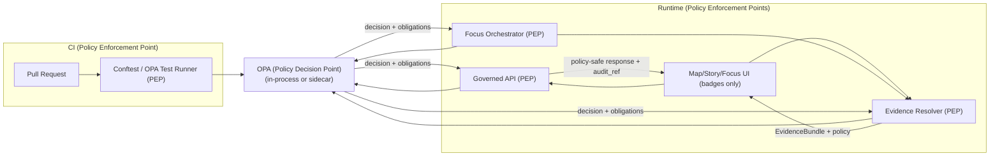

<!-- [KFM_META_BLOCK_V2]
doc_id: kfm://doc/7b6a1e3c-0a18-4a3c-9f4d-7a1b4b9d8c2e
title: Policy Pack (Rego) — KFM Governed Decisions (CI + Runtime)
type: standard
version: v1
status: draft
owners: TBD
created: 2026-02-22
updated: 2026-02-22
policy_label: public
related:
  - kfm://doc/kfm-gdg-vnext@2026-02-20
tags: [kfm, policy, rego, opa, governance, trust-membrane]
notes:
  - This README is a contract/guidance surface. Adjust repo-specific paths & tooling versions before first “published” release.
[/KFM_META_BLOCK_V2] -->

# Policy Pack (Rego)
OPA/Rego policies that enforce KFM’s trust membrane in **CI and runtime** (authorization + obligations + promotion gates).

**Status:** draft • **Owners:** TBD


---

## Quick navigation
- [What this directory is](#what-this-directory-is)
- [Non-negotiables](#non-negotiables)
- [Architecture](#architecture)
- [Directory layout](#directory-layout)
- [Policy domains](#policy-domains)
- [Controlled vocabularies](#controlled-vocabularies)
- [Input and output contracts](#input-and-output-contracts)
- [Run locally](#run-locally)
- [CI gate integration](#ci-gate-integration)
- [Runtime integration](#runtime-integration)
- [Change management](#change-management)
- [Threat model checklist](#threat-model-checklist)
- [Appendix](#appendix)

---

## What this directory is

This folder is the **policy bundle repository** for KFM (OPA/Rego or equivalent), including:
- **Rego** policies (authorization + obligations + gates)
- **Fixtures** for repeatable allow/deny + obligation outcomes
- **Tests** that must run in CI and block merges on deny-by-default failures

> [!NOTE]
> This README is intentionally written as **contract-first guidance**. It should remain stable even as policy packs grow.

[Back to top](#policy-pack-rego)

---

## Non-negotiables

These rules are KFM invariants:

1) **Same semantics in CI and runtime**
- If CI and runtime do not evaluate the *same* policy logic (or at minimum the same fixtures/outcomes), CI guarantees are meaningless.

2) **Default deny**
- Assume **deny** unless explicitly allowed.

3) **Policy produces obligations**
- Policy is not only “allow/deny”. It may also return **obligations** (e.g., show a notice; generalize geometry; remove attributes).

4) **UI never decides**
- The UI may render badges/notices, but **must not** be the decision-maker.

5) **No existence leaks**
- A public user must not infer restricted dataset existence via different error behaviors.

6) **Sensitivity controls include geometry + narrative**
- Do not embed precise coordinates in Story Nodes or Focus Mode outputs unless policy explicitly allows.
- If a public representation is allowed, publish a separate **public_generalized** version.

7) **Licensing is policy input**
- Online availability ≠ permission to reuse. License/rights metadata must be enforced in exports, downloads, and story publishing.

> [!WARNING]
> If you cannot apply an obligation safely, **fail closed** (deny) rather than “best-effort” serving.

[Back to top](#policy-pack-rego)

---

## Architecture



**Key concept:** The **PDP** evaluates Rego; the **PEPs** apply the results (deny/allow + obligations) in CI and runtime.

[Back to top](#policy-pack-rego)

---

## Directory layout

> Repo-specific: adjust names if your repository differs. Keep the “rego / fixtures / tests” split.

```text
policy/
├─ rego/
│  ├─ README.md                 # you are here
│  ├─ kfm.rego                  # core packages (start small; split as it grows)
│  └─ (optional) modules/        # additional policy modules (recommended as policy grows)
├─ fixtures/
│  ├─ public_user.json
│  ├─ steward_user.json
│  ├─ dataset_public.json
│  └─ dataset_restricted.json
└─ tests/
   └─ kfm_test.rego
```

[Back to top](#policy-pack-rego)

---

## Policy domains

| Domain | Rego package (recommended) | Enforced by | Primary decisions | Notes |
|---|---|---|---|---|
| Authorization | `kfm.authz` | API, Evidence Resolver, Focus, CI | allow/deny + obligations | Start here. Default deny. |
| Promotion gates | `kfm.promotion` | CI (PR gate) + pipeline runner | allow/deny + reason codes | Used to block promotion without required artifacts/catalogs/receipts. |
| Licensing/rights | `kfm.rights` | API export endpoints + CI | allow/deny + required attribution | “Metadata-only reference” should be representable. |
| Redaction/generalization | `kfm.obligations` (or embedded in domains) | Pipeline + Evidence Resolver | obligations list | Record transforms in provenance/receipts. |
| Error safety | `kfm.errors` (or enforced in PEP code) | API | policy-safe errors | Avoid 403/404 existence leaks. |

> [!TIP]
> You can keep everything in one file early (`kfm.rego`) while still using multiple `package` blocks. Split into modules only when policy grows.

[Back to top](#policy-pack-rego)

---

## Controlled vocabularies

### `policy_label` (starter set)
Use a controlled vocabulary for policy labels. Suggested starter values:

- `public`
- `public_generalized`
- `restricted`
- `restricted_sensitive_location`
- `internal`
- `embargoed`
- `quarantine`

### Roles (starter set)
- `public`
- `contributor`
- `steward` (reviewer/approver)
- `operator`
- `governance` (community stewards / council)

### Actions (starter set)
- `read`
- `query`
- `export`
- `resolve_evidence`
- `publish_story`
- `promote_dataset_version`
- `focus_ask`

> [!NOTE]
> If you introduce a new label/role/action, treat it as a governance change:
> update fixtures + tests + any UI badge mappings + docs.

[Back to top](#policy-pack-rego)

---

## Input and output contracts

### Minimum input shape (example)

Policies should assume an input shape consistent across CI and runtime.

```json
{
  "user": {
    "id": "user:123",
    "role": "public"
  },
  "action": "read",
  "resource": {
    "kind": "dataset",
    "dataset_version_id": "2026-02.abcd1234",
    "policy_label": "public"
  },
  "context": {
    "request_id": "req-uuid",
    "purpose": "map_view",
    "time": "2026-02-22T00:00:00Z"
  }
}
```

### Minimum output shape (recommended)

In Rego you’ll typically expose:
- `allow` (boolean)
- `obligations` (set/array of objects)
- (optional) `reason_codes` (for audit + UX)
- (optional) `rule_id` (for traceability)

```json
{
  "decision": "allow",
  "policy_label": "public",
  "reason_codes": [],
  "obligations": [
    {
      "type": "show_notice",
      "message": "Geometry generalized due to policy."
    }
  ]
}
```

> [!WARNING]
> **PEPs must record the decision** (and obligations) into audit receipts/logs for governed operations.

[Back to top](#policy-pack-rego)

---

## Run locally

### Prerequisites
- `opa` CLI available in your PATH (or run via a pinned container image in CI/local dev)

### Format
```bash
opa fmt -w ../rego
opa fmt -w ../tests
```

### Unit tests (OPA native)
```bash
# From repo root
opa test ./policy -v
```

### Evaluate a decision (debug)
```bash
# From repo root
opa eval \
  -d policy/rego \
  -i policy/fixtures/public_user.json \
  'data.kfm.authz.allow'
```

### Conftest (recommended for “policy gate” in CI)
```bash
# Example: conftest evaluates repo artifacts (YAML/JSON/etc) against Rego
conftest test \
  -p policy/rego \
  path/to/thing-being-validated.json
```

> [!TIP]
> Keep fixtures small and explicit: include allow cases, deny cases, and obligation cases.

[Back to top](#policy-pack-rego)

---

## CI gate integration

CI should enforce **deny-by-default** behavior.

Suggested gate layers:
1) `opa test` runs unit tests and blocks merges on failure.
2) `conftest test` (or equivalent) evaluates promotion manifests, receipts, catalogs, etc.
3) A “kill switch” can force fail-closed if governance needs an emergency stop.

### Example: “policy gate” checklist
- [ ] `opa test ./policy -v` runs on every PR
- [ ] Policy fixtures are committed (no hidden policy data)
- [ ] Conftest gate runs on promotion-bound artifacts (manifests/receipts/catalogs)
- [ ] Deny output is readable and points to remediation
- [ ] Optional: kill-switch mechanism exists and is tested

> [!WARNING]
> If CI allows merges when policy denies, the trust membrane is broken.

[Back to top](#policy-pack-rego)

---

## Runtime integration

### Where policy is enforced
Runtime policy checks should happen **before serving data** and **before resolving evidence**.

Typical PEPs:
- **Governed API**: authorize queries, downloads, and exports.
- **Evidence Resolver**: authorize evidence bundle resolution; apply redaction/generalization obligations.
- **Focus Mode**: pre-check query + verify citations are resolvable and allowed.

### PDP deployment patterns
- OPA **sidecar** (REST call from service → OPA)
- OPA **in-process** (language SDK / WASM)

### Policy-safe errors
- Do not leak restricted existence via different error behaviors.
- Keep error messages policy-safe and include an `audit_ref` for debugging through governed channels.

> [!NOTE]
> UI should only display what the API/evidence resolver returns (policy label badges, notices, and decisions).

[Back to top](#policy-pack-rego)

---

## Change management

### When do you need governance review?
Any of these should trigger steward/governance review:
- New `policy_label` values
- New actions or roles
- Relaxing default deny paths
- Any change that affects restricted/sensitive-location handling
- Any change affecting exports/downloads/licensing rules

### PR checklist for policy changes
- [ ] Update/add Rego rules
- [ ] Add/adjust fixtures covering allow/deny + obligations
- [ ] Add/adjust unit tests (`opa test`)
- [ ] Confirm CI gate output is readable (reason codes or messages)
- [ ] Confirm runtime PEPs can interpret the decision/obligations
- [ ] Confirm errors remain policy-safe (no existence leaks)
- [ ] If applicable: update UI badge/notice mappings

<details>
<summary><strong>Suggested commit message prefixes</strong></summary>

- `policy(authz): ...`
- `policy(promotion): ...`
- `policy(rights): ...`
- `policy(obligations): ...`
- `policy(fixtures): ...`
- `policy(tests): ...`

</details>

[Back to top](#policy-pack-rego)

---

## Threat model checklist

Use this as a quick review for changes touching policy enforcement:

- [ ] Frontend never fetches directly from object storage/databases (trust membrane)
- [ ] Public users cannot infer restricted dataset existence via error behavior
- [ ] Downloads/exports are checked against policy labels **and** rights
- [ ] Focus Mode cannot be prompt-injected into leaking restricted info (policy + citation gates)
- [ ] Audit logs are redacted and access-controlled
- [ ] Processed artifacts are immutable by digest
- [ ] Policy rules are tested in CI with fixtures

[Back to top](#policy-pack-rego)

---

## Appendix

### Minimal example (illustrative)

> Keep examples minimal and covered by tests.

```rego
package kfm.authz

default allow := false

allow {
  input.user.role == "steward"
}

allow {
  input.user.role == "public"
  input.action == "read"
  input.resource.policy_label == "public"
}

obligations[o] {
  input.resource.policy_label == "public_generalized"
  o := {"type": "show_notice", "message": "Geometry generalized due to policy."}
}
```

### Minimal test (illustrative)

```rego
package kfm.authz_test

import data.kfm.authz

test_public_can_read_public {
  authz.allow with input as {
    "user": {"role": "public"},
    "action": "read",
    "resource": {"policy_label": "public"}
  }
}

test_public_cannot_read_restricted {
  not authz.allow with input as {
    "user": {"role": "public"},
    "action": "read",
    "resource": {"policy_label": "restricted"}
  }
}
```

[Back to top](#policy-pack-rego)
