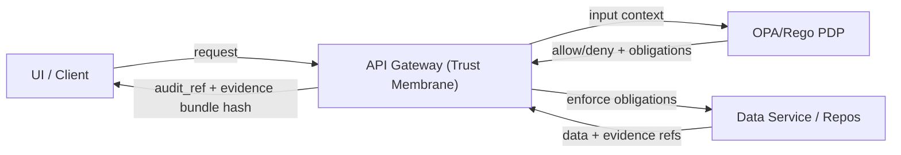

# KFM Data Policies (OPA/Rego) — `package kfm.data`


This directory contains **KFM’s governed data-access and data-safety policies** implemented in **OPA/Rego** under the `kfm.data` package. These policies enforce the **trust membrane**: all data access decisions are evaluated centrally and are **deny-by-default**.  

> **KFM invariant:** when policy is uncertain (missing inputs, unknown sensitivity, incomplete evidence), the system must **fail closed** (deny).  

---

## Table of Contents

- [Non-Negotiables](#non-negotiables)
- [What This Policy Package Covers](#what-this-policy-package-covers)
- [Decision Contract](#decision-contract)
- [Sensitivity Model](#sensitivity-model)
- [Redaction Is a First-Class Transformation](#redaction-is-a-first-class-transformation)
- [Policy Input Contract](#policy-input-contract)
- [Policy Outputs](#policy-outputs)
- [How to Run Locally](#how-to-run-locally)
- [Testing Strategy and Regression Suite](#testing-strategy-and-regression-suite)
- [Change Control](#change-control)
- [Troubleshooting](#troubleshooting)
- [Appendix: Minimal Examples](#appendix-minimal-examples)

---

## Non-Negotiables

These rules are **requirements**, not suggestions:

1) **Trust membrane enforced**  
   - Policy evaluation occurs on every request for data (and stories/AI elsewhere).  
   - Frontend/external clients never bypass the governed API boundary.

2) **Default deny + fail closed**  
   - If `input` is missing required keys, treat as **deny** (not “best effort”).

3) **Processed zone is the only publishable truth**  
   - Raw/work intermediates are not served to users; only processed + cataloged artifacts.

4) **Every response is auditable**  
   - API responses must carry an `audit_ref` and evidence/bundle identifiers so reviewers can verify what policy and evidence were used.

---

## What This Policy Package Covers

This package is about **data** (datasets, layers, features, tiles, exports) and **safe delivery**:

- **Authorization** (role/scope-based access) for datasets and derived products.
- **Sensitivity enforcement** (public vs restricted vs sensitive-location vs aggregate-only).
- **Field-level and geometry-level protections** (redaction/generalization obligations).
- **Promotion guardrails** (CI gates for publishing/serving) *when wired to promotion workflows*.
- **Audit integrity requirements** (ensure requests/responses can be traced).

> Focus Mode policies (cite-or-abstain) live in **other** packages (e.g., `kfm.ai`). This folder is specifically `kfm.data`.

---

## Decision Contract

At minimum, the following decision point must exist and remain stable:

| Decision | Primary query | Meaning |
|---|---|---|
| Data access allow/deny | `data.kfm.data.allow` | `true` only when the actor is permitted to perform the requested action on the dataset/resource |

**Recommended** (strongly): expose structured denial reasons and obligations:

| Optional output | Suggested query | Used by |
|---|---|---|
| Denial reasons | `data.kfm.data.deny_reasons` | API error handler / governance review |
| Obligations (redaction/generalization) | `data.kfm.data.obligations` | Response shaping layer (mask fields, generalize geometry) |
| Promotion gating | `data.kfm.data.promotion_ok` | CI / dataset promotion checks |
| Audit gating | `data.kfm.data.audit_ok` | Gateway middleware |

> If you add new decision outputs, document them here and add tests + fixtures.

---

## Sensitivity Model

KFM uses a **controlled sensitivity vocabulary**. Minimum set:

| Sensitivity | Allowed for public users? | Required handling |
|---|---:|---|
| `public` | ✅ Yes | Safe to publish without redaction |
| `restricted` | ❌ No | Role-based access required (reviewer/admin or explicit grants) |
| `sensitive-location` | ❌ No (precise) | Coordinates must be generalized/suppressed unless explicitly authorized |
| `aggregate-only` | ✅ Only in aggregate | Publish only above thresholds (avoid small counts / re-identification) |

**Important:** sensitivity can apply at **dataset**, **record**, and **field** level. Policies should treat *missing sensitivity* as **deny**.

---

## Redaction Is a First-Class Transformation

When data must be protected, KFM does **not** “silently hide” facts. It creates a governed derivative:

- **Raw stays immutable**
- **Redacted/generalized derivative becomes a separate dataset version (often a separate `dataset_id`)**
- The redaction step must be recorded in lineage/provenance (PROV)

This matters because KFM’s credibility relies on being able to prove:
- what changed,
- why it changed,
- and who approved/published it.

---

## Policy Input Contract

Policies must be designed so that:

- The API gateway can pass the request context as `input`.
- CI checks can pass dataset/promotion context as `input` (when policies are used as promotion gates).

### Minimum required keys (runtime access)

```json
{
  "actor": {
    "role": "viewer"
  },
  "resource": {
    "kind": "dataset",
    "sensitivity": "public",
    "dataset_id": "example_dataset"
  },
  "action": "read"
}
```

### Recommended keys (for robust enforcement)

```json
{
  "actor": {
    "id": "user_123",
    "role": "reviewer",
    "scopes": ["kfm:data:read", "kfm:data:export"],
    "groups": ["org:kfm", "custodian:tribal_partner_x"]
  },
  "resource": {
    "kind": "dataset",
    "dataset_id": "ks_archaeology_sites",
    "dataset_version": "2026-02-12",
    "sensitivity": "sensitive-location",
    "fields_requested": ["site_type", "geometry"],
    "precision_meters": 1
  },
  "action": "tile",
  "request": {
    "purpose": "map_view",
    "client": "web-ui",
    "ip_class": "public"
  },
  "audit": {
    "audit_ref": "audit_...",
    "evidence_bundle_digest": "sha256:..."
  }
}
```

> **Fail-closed rule:** if you rely on an input field in policy logic, it must be either (a) required by contract, or (b) guarded so missing keys result in deny.

---

## Policy Outputs

### Required: allow/deny

- `data.kfm.data.allow` → `true | false`

### Strongly recommended: denial reasons + obligations

To support “safe partial responses” (e.g., generalized geometry), expose:

- `deny_reasons`: array of strings or structured objects
- `obligations`: array of obligations the API must enforce (mask fields, generalize geometry, aggregation thresholds)

Example obligations:

```json
[
  { "type": "mask_fields", "fields": ["owner_name", "phone"] },
  { "type": "generalize_geometry", "min_precision_meters": 1000 },
  { "type": "aggregate_only", "min_group_size": 10 }
]
```

---

## How to Run Locally

### Option A: OPA native tests

From repo root:

```bash
opa test policy/rego/kfm/data -v
```

Evaluate a single decision:

```bash
opa eval \
  --data policy/rego/kfm \
  --input policy/rego/kfm/data/fixtures/allow_public.json \
  "data.kfm.data.allow"
```

### Option B: Conftest in CI-style mode

If your repo uses Conftest to run governance gates:

```bash
conftest test --policy policy/rego/kfm policy/rego/kfm/data/fixtures
```

> **Toolchain drift warning:** keep OPA/Conftest versions pinned and include a compatibility test suite so syntax or default changes don’t silently disable governance.

---

## Testing Strategy and Regression Suite

Policies are governed artifacts. Tests are not optional.

### Minimum unit tests

- ✅ allow public dataset for normal users  
- ✅ allow restricted dataset for reviewer/admin  
- ❌ deny restricted dataset for normal users  
- ❌ deny when sensitivity is missing  
- ❌ deny when required keys are missing (fail closed)

### CI policy regression suite (must never regress)

Maintain “golden” tests that prevent reintroducing past leaks:

- **Golden queries**: any query that previously leaked restricted fields must fail forever.
- **Negative tests**: sensitive-location layers must not return high-precision coordinates to unauthorized roles.
- **Field-level tests**: ensure owner names, health small counts, and exact archaeology coordinates are redacted.
- **Audit integrity tests**: every response includes `audit_ref` and an evidence/bundle hash.

---

## Change Control

Because policy changes can alter system behavior and disclosures:

- Treat policy updates as **production changes**.
- Require review by:
  - **Security reviewer**
  - **Data governance reviewer**
  - **Domain custodian** (when the policy affects restricted/sensitive datasets)
- Require:
  - unit tests + regression tests updated
  - fixtures updated
  - README updated if the input/output contract changes
- Prefer **small, reversible** policy diffs.

**Versioning (recommended):**
- Use SemVer for policy bundles or for tagged releases of the policy directory.
- Record the policy bundle hash in audit logs so decisions can be reproduced.

---

## Troubleshooting

### “Why is access denied?”

Check in order:

1) Is `resource.sensitivity` present and one of the controlled values?
2) Does `actor.role` (and/or scopes/groups) meet the rule requirements?
3) Are required fields missing, causing fail-closed deny?
4) Is the request asking for high precision geometry on `sensitive-location` data?
5) Is the request below aggregation thresholds for `aggregate-only`?

### “Why did CI block promotion?”

Typical causes:

- Missing license metadata
- Missing sensitivity classification
- Missing STAC/DCAT/PROV artifacts
- Missing checksums/digests
- Missing run record / validation report
- Regression suite failure (a known-leak test started passing)

---

## Appendix: Minimal Examples

### Baseline allow/deny example (illustrative)

```rego
package kfm.data
default allow := false

# Allow public datasets
allow if {
  input.resource.kind == "dataset"
  input.resource.sensitivity == "public"
}

# Allow non-public only for elevated roles
allow if {
  input.resource.kind == "dataset"
  input.resource.sensitivity != "public"
  input.actor.role == "reviewer"
}

allow if {
  input.actor.role == "admin"
}
```

### Mermaid: decision flow



---

> **If you change this contract, update this README and add test fixtures for both positive and negative cases.**

