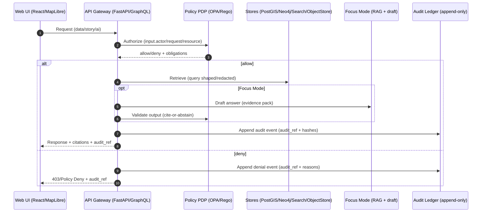

<!--
KFM Governed Artifact
Path: policy/rego/kfm/kfm/README.md
-->

# ⚖️ KFM Policy Pack (OPA/Rego) — Core Bundle: `kfm`


This directory contains the **core KFM OPA/Rego policy bundle** (`package kfm.*`) used to enforce the KFM trust membrane: **every data/story/AI request is policy-evaluated, redacted as needed, and audit/provenance-logged**.

---

## Table of contents

- [Non‑negotiables](#nonnegotiables)
- [Where policy runs](#where-policy-runs)
- [Policy domains](#policy-domains)
- [Sensitivity taxonomy and redaction](#sensitivity-taxonomy-and-redaction)
- [Policy I/O contracts](#policy-io-contracts)
- [CI gates and regression suite](#ci-gates-and-regression-suite)
- [Local development](#local-development)
- [Change control and governance](#change-control-and-governance)
- [Troubleshooting](#troubleshooting)
- [References](#references)

---

## Non‑negotiables

> [!IMPORTANT]
> **Boss‑mode summary (non‑negotiables):**
>
> 1) **Trust membrane:** UI/external clients never access databases directly — all access is via the governed API + policy boundary.  
> 2) **Fail‑closed policy** on every request (data, Story Nodes, AI).  
> 3) **Dataset promotion gates:** Raw → Work → Processed; promotion requires **checksums + STAC/DCAT/PROV** catalogs.  
> 4) **Focus Mode must cite or abstain**; every answer produces an **audit reference**.  
>
> These are build invariants; tests must enforce them. ✅

---

## Where policy runs

KFM policy is not “optional middleware.” It is the **governed boundary** of the platform (the trust membrane).



> [!NOTE]
> Trust membrane mechanics: **all reads/writes crossing the membrane pass through authentication, policy evaluation, query shaping/redaction, and audit/provenance logging** — enforced by tests.  

---

## Policy domains

This bundle is organized by **policy domain**, each mapped to a `package kfm.<domain>` namespace.

| Domain | Package | Primary decision(s) | Enforces |
|---|---|---|---|
| Data access | `kfm.data` | `allow` (bool), `deny_reasons[]`, `obligations[]` | Default‑deny access to datasets/layers/records (public vs restricted). |
| Focus Mode output validation | `kfm.ai` | `allow` (bool), `deny_reasons[]` | “Cite‑or‑abstain” (and optionally min citations) + sensitivity checks. |
| Story Nodes + governed docs | `kfm.story` | `allow` / `validate` | Story publishing rules: required template sections, citations, disallowed content. |
| Promotion gates (CI) | `kfm.promotion` | `allow` / `validate` | Promotion blocked unless catalogs, checksums, licenses, and provenance exist. |
| Redaction + query shaping | `kfm.redaction` | `obligations[]` | Field/geometry redaction and generalization rules. |
| Audit requirements | `kfm.audit` | `required_fields[]` | Ensures every response/decision is audit‑recordable (audit_ref + evidence bundle hash, etc.). |
| Supply chain gates (optional CI/admission) | `kfm.supplychain` | `allow` / `validate` | SBOM/SLSA/Cosign/attestation gates when enabled. |

> [!TIP]
> The **minimum required** packages for KFM “boss mode” are: `kfm.data`, `kfm.ai`, `kfm.promotion`, `kfm.redaction`, `kfm.audit`, and `kfm.story`.

---

## Sensitivity taxonomy and redaction

KFM treats some data as sensitive (e.g., private ownership, precise archaeological locations, certain health/public-safety indicators). Sensitivity is handled via:
- **policy labels** at dataset/record/field level
- **derivative datasets with explicit redaction provenance**
- **fail‑closed policy checks**

### Sensitivity classes (recommended)

| Class | Canonical label | Required behavior |
|---|---|---|
| Public | `public` | Safe to publish without redaction. |
| Restricted | `restricted` | Role‑based access required (ex: parcel ownership). |
| Sensitive‑location | `sensitive-location` | Coordinates must be generalized/suppressed unless explicitly granted. |
| Aggregate‑only | `aggregate-only` | Publish only above thresholds (avoid small counts / reidentification). |

### Redaction is a first‑class transformation

Redaction is **recorded in PROV**:
- Raw dataset remains **immutable**
- Redacted derivative is a separate `DatasetVersion` (often separate `dataset_id`) with a documented policy label

> [!IMPORTANT]
> Redaction must occur consistently across:
> - `data/processed/**` artifacts
> - catalogs (DCAT/STAC/PROV) that declare restrictions
> - API shaping
> - UI exposure controls

---

## Policy I/O contracts

### Recommended OPA input schema

OPA input is **structured** and should be validated for required keys (fail‑closed).

```json
{
  "actor": {
    "role": "public|reviewer|admin",
    "attributes": {
      "scopes": ["kfm:read", "kfm:review"],
      "groups": ["custodian:xyz"]
    }
  },
  "request": {
    "endpoint": "/api/v1/ai/query",
    "method": "POST",
    "context": {
      "request_id": "req_...",
      "environment": "dev|stage|prod",
      "time": "2026-02-15T00:00:00Z"
    }
  },
  "resource": {
    "kind": "dataset|layer|feature|story|audit|evidence",
    "id": "dataset_id_or_layer_id",
    "sensitivity": "public|restricted|sensitive-location|aggregate-only",
    "policy_label": "public|restricted|sensitive-location"
  },
  "answer": {
    "text": "...",
    "has_citations": true,
    "citations": [{"ref":"prov://...", "locator": "..." }],
    "sensitivity_ok": true
  }
}
```

> [!NOTE]
> The `answer` object is used for **output validation** (Focus Mode). The `resource` object is used for **authorization/query shaping**.

### Standard decision outputs (recommended)

Policies should return:
- `allow` boolean
- `deny_reasons[]` (stable codes + human-readable)
- `obligations[]` (what the API must do: redact/generalize/suppress/require_review/log)

```json
{
  "allow": false,
  "deny_reasons": [
    {"code":"NO_SOURCE_NO_ANSWER", "message":"Focus Mode answer missing citations"},
    {"code":"SENSITIVE_LOCATION_DENY", "message":"Precise coordinates require custodian grant"}
  ],
  "obligations": [
    {"type":"audit", "required": true},
    {"type":"redact", "fields":["owner_name"], "mode":"remove"},
    {"type":"generalize_geometry", "precision":"county"}
  ]
}
```

---

## CI gates and regression suite

Policy is enforced **in CI** and (optionally) at runtime.

### CI minimal hardening set (KFM baseline)

CI must, at minimum:
- validate governed Markdown + Story Nodes
- validate STAC/DCAT/PROV for new/changed datasets
- run OPA policy tests (default deny; cite‑or‑abstain):contentReference[oaicite:3]{index=3}

### CI policy regression suite requirements

The suite must include:
- Golden queries that previously leaked restricted fields must **fail forever** (non‑regression)
- Negative tests: sensitive‑location layers cannot be returned at high precision to unauthorized roles
- Field-level tests: owner names, health small counts, exact archaeological coordinates are redacted
- Audit integrity tests: **every API response includes audit_ref and evidence bundle hash**

### “No Source, No Answer” gates

CI gates must enforce:
- deny‑by‑default publishing
- “No Source, No Answer” for narratives/answers
- standard receipt writing (include digests + policy gate results):contentReference[oaicite:5]{index=5}

### Rego/OPA compatibility tests (mandatory)

Add a regression check to avoid silent drift:
- ensure Conftest/OPA policies run under **Rego v1 defaults** (or explicitly pinned flags):contentReference[oaicite:6]{index=6}

---

## Local development

> [!NOTE]
> Commands below are “repo‑portable defaults.” If your repo uses wrapper scripts, keep the semantics, update the paths.

### Run unit tests (OPA)

```bash
# from repo root
opa test policy -v
```

Or, scoped to this bundle:

```bash
opa test policy/rego/kfm/kfm -v
```

### Format policies

```bash
opa fmt -w policy/rego/kfm/kfm
```

### Run OPA locally with this bundle

```bash
opa run --server --log-level=debug \
  --bundle policy/rego/kfm/kfm
# OPA API: http://localhost:8181
```

### Query a decision

```bash
curl -s http://localhost:8181/v1/data/kfm/ai/allow \
  -H 'Content-Type: application/json' \
  -d '{"input":{"answer":{"has_citations":true,"sensitivity_ok":true,"citations":[{"id":"c1"}]}}}'
```

---

## Change control and governance

This policy pack is a **governed artifact**. Policy changes can change what the system is allowed to do.

### Governance review triggers (examples)

Manual governance review is required (beyond CI) when changes involve:
- introducing sensitive data or layers (e.g., archaeological/tribal/culturally restricted)
- new AI-driven narrative features that could be perceived as factual
- new external data sources (license/provenance review)
- new public-facing outputs that could expose sensitive info
- classification/sensitivity rule changes:contentReference[oaicite:7]{index=7}

### PR checklist (Definition of Done)

- [ ] Default deny preserved (no “allow‑all” rules)
- [ ] Fail‑closed behavior for missing required keys
- [ ] New/changed decisions have:
  - [ ] unit tests (`opa test`)
  - [ ] negative tests for sensitive-location & restricted fields
  - [ ] regression test if it addresses a past leak
- [ ] Audit obligations maintained (audit_ref + evidence bundle hash)
- [ ] Any sensitivity changes include:
  - [ ] documented labels
  - [ ] redaction PROV plan (raw immutable; derivative versioned)
  - [ ] governance sign-off when required

---

## Troubleshooting

### “Everything is denied”
- Verify `default allow := false` is not overridden unintentionally.
- Confirm your `input` includes required keys (`actor`, `request`, `resource` / `answer`).
- Run `opa test -v` to see rule traces.

### “Focus Mode answer denied”
Common causes:
- missing citations (`has_citations=false`)
- citations exist but `sensitivity_ok=false`
- your rule requires `min_citations` and you provided too few

### “Sensitive locations leaking”
- Ensure `resource.sensitivity == "sensitive-location"` triggers **generalization/suppression** obligations.
- Add a negative test that asserts precise geometry is denied for non‑granted roles.

---

## References

Design inputs that define the policy expectations for KFM:

- **KFM Comprehensive Data Source Integration Blueprint** (v1.0, 2026‑02‑12)  
  – Trust membrane, fail‑closed policy, promotion gates, sensitivity/redaction, CI regression expectations.  
- **KFM Next‑Gen Blueprint & Primary Guide** (draft)  
  – Cite‑or‑abstain pattern, policy input schema, CI hardening set, runtime flow diagrams.  
- **KFM Integration Report for “New Ideas Feb‑2026”**  
  – “No Source, No Answer” CI gates; Rego compatibility regression; receipts + policy gate results.

