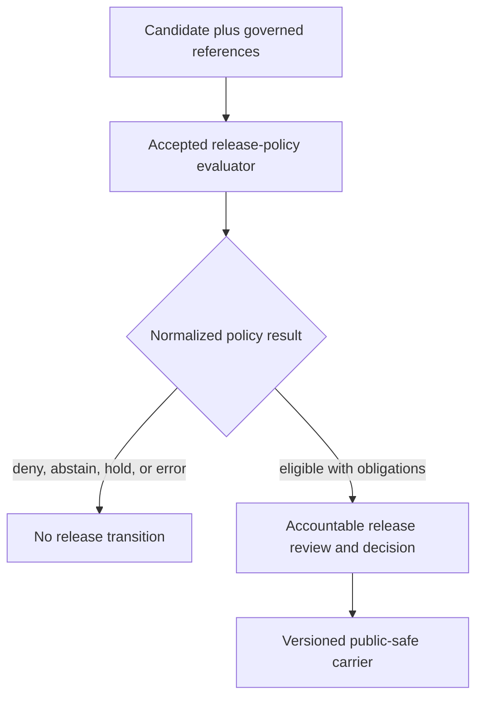

# policy :: release

> **One-line purpose.** `policy/release/` is the release-admissibility policy lane: it holds reviewed rule source that may restrict, hold, deny, or abstain from a proposed release operation without becoming a release decision, manifest, published artifact, evaluator, or publication authority.

<a id="top"></a>

**Quick navigation:** [Purpose](#purpose-and-inherited-authority) · [Boundaries](#scope-and-non-ownership-boundaries) · [Status](#current-status) · [Map](#direct-child-map) · [Rules](#current-rule-inventory) · [Inputs](#inputs-and-prerequisite-context) · [Outcomes](#outputs-and-outcome-boundary) · [Authoring](#release-policy-authoring-contract) · [Lifecycle](#lifecycle-and-release-boundary) · [Validation](#validation-and-known-limits) · [Review](#review-burden-and-separation-of-duties) · [Correction](#correction-supersession-and-rollback) · [Contributing](#contributor-workflow) · [Open work](#open-verification-register)

> [!IMPORTANT]
> **Policy source is not release authority.** A Rego file, policy result, workflow pass, signature check, pull request, merge, GitHub release, or documentation claim cannot approve a KFM release or publish data. Accountable release decisions and their correction or rollback records belong under [`release/`](../../release/README.md); public-safe released carriers belong under `data/published/`.

> [!CAUTION]
> **The current modules are scaffolds, not an active release-policy system.** The three Rego files in this lane have no accepted bundle binding, evaluator contract, native tests, governed consumer, decision receipt, replay path, or authenticated release integration. Do not load them into a release path or interpret their defaults as permission.

---

## Purpose and inherited authority

This directory inherits the [`policy/`](../README.md) root contract and narrows it to **release admissibility**.

It is the appropriate policy home for rules that answer bounded questions such as:

- whether a named release operation has the required evidence, validation, rights, consent, sensitivity, integrity, review, manifest, signature, correction, and rollback context;
- whether the requested audience, geography, time range, precision, artifact family, and public exposure are admissible;
- whether a release operation must be denied, held, restricted, generalized, delayed, or escalated;
- which public-safe reason codes and enforceable obligations must accompany a policy result;
- whether stale, corrected, revoked, superseded, conflicted, or unresolved inputs prevent further release processing.

The parent policy contract remains authoritative for policy-source behavior. Accepted [ADR-0029](../../docs/adr/ADR-0029-adopt-directory-governance-standard-v2.md) adopts the [Directory Rules](../../docs/doctrine/directory-rules.md), whose §9.3 assigns policy rules to singular `policy/` and whose §11.5 keeps release decision instances under `release/`.

| Field | Current bounded posture |
|---|---|
| Inherited parent | [`policy/`](../README.md) |
| README profile | `BOUNDARY_COMPACT` under Directory Rules §16.3 |
| Local scope | Release-admissibility policy source below the canonical policy root |
| Scope identifier | Repository path `policy/release/`; no accepted independent `kfm://` scope identifier was found |
| Repository review route | `/policy/` routes to `@bartytime4life` in [CODEOWNERS](../../.github/CODEOWNERS) |
| Stewardship status | `NEEDS VERIFICATION` — routing does not prove an accepted policy steward or independent release approver |
| Exposure | Internal policy source; not a public client or live decision API |
| Mutation | Versioned source changes through reviewed Git history |
| Retention | Durable policy lineage sufficient for review, replay, correction, and supersession when a rule becomes relied upon |

[Back to top](#top)

---

## Scope and non-ownership boundaries

The primary question for this lane is:

> Under the accepted release-policy profile and explicit governed context, may the named release-related operation proceed, and under which restrictions or obligations?

This README explains the boundary. It does not define an accepted evaluator, activate a rule, authenticate a reviewer, or make a release decision.

| Responsibility | Owning surface | Relationship to `policy/release/` |
|---|---|---|
| Release-admissibility rule source | `policy/release/` | Own the bounded policy source and its local documentation. |
| General policy contract and outcome posture | [`policy/`](../README.md) | Inherited; this lane must not redefine the root policy model. |
| Semantic meaning | [`contracts/release/`](../../contracts/release/) and policy contracts | Consume accepted meaning; do not redefine object semantics in Rego comments or this README. |
| Machine shape | [`schemas/contracts/v1/release/`](../../schemas/contracts/v1/release/) and policy schemas | Consume accepted shape; policy source is not schema authority. |
| Release candidates, manifests, decisions, corrections, withdrawals, and rollback cards | [`release/`](../../release/README.md) | Evaluate referenced context; never store decision instances here. |
| Public-safe released carriers | `data/published/` | Policy may constrain exposure; it does not store or publish carriers. |
| Evidence, receipts, and proofs | `data/proofs/` and `data/receipts/` | Consume governed references; never manufacture support or treat a policy result as proof. |
| Evaluation runtime | An accepted policy evaluator, currently `UNKNOWN` | Rule source may be loaded only through an accepted, digest-bound evaluator and bundle selector. |
| Validators and tests | `tools/validators/`, `tests/`, and `fixtures/` | Prove bounded behavior; they do not authorize release. |
| Public enforcement | Governed APIs and release operators | Consume normalized decisions and enforce obligations; browsers and maps must not load policy source directly. |

### Non-effects

Nothing in this lane may, by itself:

- create or resolve evidence;
- clear rights, consent, sovereignty, or sensitivity by assertion;
- authenticate a review, signature, or separation-of-duties claim;
- move data through lifecycle states;
- create a candidate, manifest, promotion decision, release decision, correction, withdrawal, or rollback card;
- mutate a published alias, cache, catalog, API, tile, search index, map, or AI response;
- release, deploy, promote, publish, or make a public-use determination.

[Back to top](#top)

---

## Current status

Evidence was reviewed at `main@09a01ef8a71a557efc1c35bda6f9b762a429a1f3` on 2026-08-13. The target README blob was `72fa13bfa2bd63ba0bd29201e282b45db0164d2c`, and the `policy/release/` tree was `ea698e56bfba8a60f6c0435f949e1f3c114772c2`.

| Surface | Status | Safe conclusion |
|---|---:|---|
| This README | `CONFIRMED` 45-byte greenfield stub at the evidence base | The stub established a path and H1 only; it did not establish implementation maturity. |
| `signed_manifest_required.rego` | `PROPOSED` greenfield stub | It defines a package and `default deny := false`, but no executable rule body, accepted input contract, test, or consumer. It must not be read as release permission. |
| `fauna/promotion_gate.rego` | `PROPOSED` generated scaffold | It defaults `allow` to `false`; no accepted tests, bundle, evaluator, or consumer were surfaced. |
| `settlements-infrastructure/asset_clustering.rego` | `PROPOSED` generated scaffold | It defaults `allow` to `false`; no accepted tests, bundle, evaluator, or consumer were surfaced. |
| Eight other domain lanes | `CONFIRMED` placeholder-only | Each contains only `.gitkeep`; directory presence is not a rule, policy profile, or implementation. |
| Native tests in this lane | `CONFIRMED` absent | No `_test.rego` or other executable test was present below `policy/release/`. |
| Bundle membership and selector | `UNKNOWN` | No accepted release-policy bundle or selector binding was established. |
| Evaluator and normalized decision binding | `UNKNOWN` | No accepted evaluator, input assembly, native-to-outward mapping, or governed consumer was established. |
| Decision receipts, replay, expiry, correction, and cache invalidation | `UNKNOWN` | Operational closure was not established. |
| Independent policy and release approval | `NEEDS VERIFICATION` | CODEOWNERS routing is not separation-of-duties evidence. |

> [!NOTE]
> The separately governed [`policy/rego/release_gate_v1.rego`](../rego/release_gate_v1.rego) profile has its own fixture-first workflow and remains `PROPOSED_INACTIVE`. It is not proof that the scaffolds in this directory are tested, bundled, accepted, or active.

[Back to top](#top)

---

## Direct-child map

The following current tree is verified from `policy/release/` at the evidence base. It shows direct children only, as required by Directory Rules §16.4.

```text
policy/release/
├── README.md                     # This boundary contract
├── air/                          # Placeholder-only domain lane
├── fauna/                        # Proposed generated Rego scaffold
├── flora/                        # Placeholder-only domain lane
├── habitat/                      # Placeholder-only domain lane
├── hazards/                      # Placeholder-only domain lane
├── people/                       # Placeholder-only domain lane
├── roads-rail-trade/             # Placeholder-only domain lane
├── scene/                        # Placeholder-only domain lane
├── settlement/                   # Placeholder-only domain lane
├── settlements-infrastructure/   # Proposed generated Rego scaffold
└── signed_manifest_required.rego # Proposed top-level Rego stub
```

| Child family | Current content | Boundary |
|---|---|---|
| `air/`, `flora/`, `habitat/`, `hazards/`, `people/`, `roads-rail-trade/`, `scene/`, `settlement/` | `.gitkeep` only | Reserved path presence; no implementation or authority. |
| `fauna/` | `promotion_gate.rego` | Domain-scoped generated scaffold; not an accepted promotion or release gate. |
| `settlements-infrastructure/` | `asset_clustering.rego` | Domain-scoped generated scaffold; not an accepted clustering or release rule. |
| `signed_manifest_required.rego` | Top-level proposed stub | Intended rule name is visible, but operational semantics and fail-closed behavior remain unresolved. |

Domain names remain lanes below the policy responsibility root. They do not become independent policy, release, schema, or evidence authorities.

[Back to top](#top)

---

## What belongs here

- reviewed declarative rules whose primary responsibility is release admissibility;
- release-operation preconditions for evidence, validation, integrity, rights, consent, sensitivity, review, manifest, signature, correction, and rollback context;
- rules that constrain audience, purpose, public scope, geometry precision, temporal scope, artifact family, and exposure;
- domain-specific release rules beneath the applicable domain lane;
- fail-closed defaults and explicit handling for missing, unknown, stale, corrected, revoked, conflicted, or unsupported inputs;
- stable packages, entrypoints, versions, reason codes, obligations, effective times, supersession links, and rollback references;
- policy-local documentation and, when an accepted convention supports them, narrowly paired native rule tests;
- links to accepted contracts, schemas, fixtures, tests, evaluator profiles, bundle manifests, consumers, decision receipts, release records, correction paths, and rollback targets.

A file belongs here because it decides **admissibility for a release-related operation**, not merely because it mentions release, signing, validation, a domain, or public data.

## What is prohibited

| Prohibited material | Correct responsibility or disposition |
|---|---|
| Release candidates, reviews, manifests, decisions, corrections, withdrawals, signatures, or rollback cards | [`release/`](../../release/README.md) |
| Published datasets, tiles, rasters, vectors, graphs, exports, or aliases | `data/published/` or the accepted delivery/storage surface |
| RAW, WORK, QUARANTINE, PROCESSED, CATALOG, or TRIPLET data | The applicable `data/` lifecycle lane |
| Receipts and proofs of record | `data/receipts/` and `data/proofs/` |
| Semantic definitions | `contracts/` |
| JSON Schemas, DTOs, or generated types | `schemas/` and declared generated projections |
| Evaluator, adapter, operator, API, or reusable runtime code | `packages/`, `tools/`, `apps/`, or `runtime/` by responsibility |
| Generic reusable fixtures and tests | Root `fixtures/` and `tests/` unless an accepted native-test convention requires colocation |
| Private keys, signing credentials, access tokens, or secrets | External secret and key-management systems; never Git |
| Real restricted payloads or harmful precise locations | Denied; use synthetic, redacted, generalized, or governed references |
| A second release-policy authority or hand-maintained mirror | Denied unless an accepted migration establishes a single canonical source |
| Prose that grants permission or marks a scaffold active | Denied; acceptance requires governed implementation and review evidence |

[Back to top](#top)

---

## Inputs and prerequisite context

An operational release-policy evaluation must receive explicit, versioned context. It must not silently fetch missing facts or substitute filenames and repository state for governed references.

| Input family | Minimum context | Fail-closed trigger |
|---|---|---|
| Operation | Stable operation, candidate or request ID, purpose, audience, evaluation time | Unknown or overly broad operation |
| Subject and scope | Candidate, manifest, artifact, domain, geography, time, precision, and public-scope references | Unbounded or unresolved subject |
| Evidence | Resolvable `EvidenceRef` / `EvidenceBundle` support where claims depend on evidence | Missing, stale, contradicted, corrected, or revoked support |
| Validation and integrity | Applicable schema, contract, hash, catalog, citation, and public-safety results | Missing required check or digest mismatch |
| Rights and consent | License, terms, consent applicability, revocation, sovereignty, and permitted-use posture | Unknown, expired, revoked, or incompatible posture |
| Sensitivity | Classification, join-induced sensitivity, redaction/generalization decisions, audience limits | Missing review or unsafe precision |
| Review and authority | Accountable actor, role, scope, subject binding, self-review posture, decision time | Unauthenticated, out-of-scope, or non-independent review where required |
| Release support | Manifest, signature/attestation, correction, withdrawal, supersession, notice, and rollback references | Missing required lineage or recovery support |
| Policy execution | Bundle ID/version/digest, evaluator profile/version, entrypoint, input digest, effective time | Unaccepted, ambiguous, or non-replayable execution context |

An input pointer is not proof that its target exists, is current, is authentic, or is admissible. Resolution and validation remain explicit responsibilities of governed upstream components.

[Back to top](#top)

---

## Outputs and outcome boundary

A release-policy evaluation may eventually produce an engine-native result and a normalized, receipt-ready policy result containing:

- a finite outcome;
- stable public-safe reason codes;
- enforceable obligations and expiry;
- subject, scope, audience, and operation bindings;
- policy bundle, evaluator, entrypoint, and input digests;
- evidence, rights, consent, sensitivity, review, release, correction, and rollback references;
- an explicit error or readiness hold when evaluation cannot be trusted.

No accepted mapping from the current module defaults to a canonical outward release-policy outcome was established. Until that binding exists:

- do not map `deny: false` to approval;
- do not map `allow: false` to a complete release denial without the rule's accepted reason semantics;
- do not collapse abstention, hold, denial, evaluator error, and missing input into one value;
- do not treat a validator pass or workflow conclusion as a policy decision;
- do not treat policy eligibility as release approval.

| Result layer | Meaning | Not equivalent to |
|---|---|---|
| Engine-native value | Result produced by one exact policy entrypoint | Normalized decision, release approval, or publication |
| Normalized policy result | Accepted outcome, reasons, obligations, and execution identity | Evidence, authenticated review, manifest, or release decision |
| Release decision | Accountable state-bearing record under `release/` | Published carrier or completed propagation |
| Published carrier | Immutable release-approved public-safe output | Canonical source truth or immunity from later correction |

[Back to top](#top)

---

## Current rule inventory

### `signed_manifest_required.rego`

| Field | Current evidence |
|---|---|
| Package | `kfm.signed_manifest_required` |
| Declared status | `PROPOSED greenfield stub` |
| Default | `deny := false` |
| Rule body | Commented example only |
| Tests | None in this lane |
| Bundle, evaluator, and consumer | `UNKNOWN` |
| Operational posture | `HOLD` — never interpret the absence of `deny` as permission |

The current default does not demonstrate the parent policy root's required fail-closed behavior. Repairing or retiring this module is a policy-code task with fixtures, native tests, consumer analysis, compatibility, and review; this README does not make that behavioral change.

### `fauna/promotion_gate.rego`

| Field | Current evidence |
|---|---|
| Package | `kfm.generated.policy.release.fauna.promotion_gate` |
| Declared status | `PROPOSED scaffold` |
| Source note | `docs/domains/fauna/MISSING_OR_PLANNED_FILES.md` |
| Default | `allow := false` |
| Additional rules and tests | None surfaced |
| Operational posture | `HOLD` — fail-closed scaffold, not an accepted promotion gate |

### `settlements-infrastructure/asset_clustering.rego`

| Field | Current evidence |
|---|---|
| Package | `kfm.generated.policy.release.settlements_infrastructure.asset_clustering` |
| Declared status | `PROPOSED scaffold` |
| Source note | `docs/domains/settlements-infrastructure/EXPANSION_BACKLOG.md` |
| Default | `allow := false` |
| Additional rules and tests | None surfaced |
| Operational posture | `HOLD` — fail-closed scaffold, not an accepted release rule |

Generated origin does not create canonical authority. Before either generated scaffold is retained as durable policy, its canonical source, regeneration command, generated marker, digest binding, review route, and update/rollback procedure must be established.

[Back to top](#top)

---

## Release policy authoring contract

Every new or materially changed release-policy module should identify and validate:

1. **Responsibility** — the exact release-related operation and why policy owns it.
2. **Identity** — stable package, entrypoint, version, effective time, and supersession lineage.
3. **Inputs** — accepted contract/schema profile, required references, explicit audience and purpose, and no-hidden-fetch behavior.
4. **Fail-closed default** — missing, malformed, stale, corrected, revoked, conflicted, or untrusted inputs cannot produce permission.
5. **Outcomes** — engine-native values, accepted outward mapping, stable reasons, obligations, abstention, and evaluator errors.
6. **Evidence membrane** — `EvidenceRef` resolves to `EvidenceBundle` before consequential support is relied upon.
7. **Rights and sensitivity** — unknown rights, consent, sovereignty, living-person, genomic, archaeology, rare-species, infrastructure, or harmful-precision context remains denied or held.
8. **Tests** — deterministic public-safe positive, negative, abstain, missing-input, stale, conflict, correction, expiry, and error cases.
9. **Execution binding** — accepted bundle manifest, selector, digest, evaluator version, and exact entrypoint.
10. **Consumer behavior** — governed consumer, enforced obligations, safe reasons, denial behavior, and no client-side bypass.
11. **Auditability** — decision receipt, input/result digests, actor and time binding, replay, retention, and redaction.
12. **Correction and rollback** — prior-version restoration, decision reevaluation, cache invalidation, correction/withdrawal propagation, and no dual-write authority.

Do not mark a rule active because it exists, formats, passes a unit test, appears in a bundle, or is referenced by a workflow. Operational maturity requires the complete accepted chain.

### Sensitive release posture

For living-person data, DNA/genomic material, cultural or tribal knowledge, archaeology, rare species, private land, security-sensitive infrastructure, emergency information, or exact harmful locations:

- default deny or hold when required context is missing;
- require qualified domain, rights, sensitivity, privacy/security, and release review as applicable;
- prefer aggregation, generalization, redaction, delayed release, staged access, or abstention;
- keep protected details out of rule reasons, fixtures, logs, receipts, and documentation;
- propagate join-induced sensitivity rather than evaluating each source in isolation;
- require correction, withdrawal, and invalidation behavior proportionate to public reliance.

[Back to top](#top)

---

## Lifecycle and release boundary

The governing relationship is sequential. It is not proof that the current repository implements this runtime flow.



The data lifecycle remains:

```text
RAW -> WORK / QUARANTINE -> PROCESSED -> CATALOG / TRIPLETS
                                          + PROOF
                                          + RELEASE DECISION
                                            -> PUBLISHED
```

Policy evaluation may constrain a proposed transition. It does not perform that transition. Promotion is a governed state change, never a file move, workflow completion, merge, badge, generated summary, or mutable alias update.

[Back to top](#top)

---

## Exposure, mutation, and retention

| Concern | Required posture |
|---|---|
| Public exposure | Policy source remains internal. Public clients receive governed, policy-filtered results and released carriers, not Rego source or detailed protected reasons. |
| Source mutation | Versioned and reviewed. A relied-upon rule change preserves prior identity, effective time, supersession, tests, and replay support. |
| Decision mutation | Not owned here. Release decisions and corrections are append-only records under `release/`. |
| Generation | A generated scaffold must name its canonical source and deterministic generator before it is relied upon. Do not hand-edit a mirror. |
| Retention | Preserve policy versions and execution identity long enough to explain, replay, correct, or withdraw affected decisions. |
| Secrets | Never store private keys, credentials, tokens, restricted payloads, or signing secrets in policy source, tests, reasons, or docs. |
| Logging | Emit bounded public-safe reason codes; never log protected inputs merely to explain a denial. |
| Cache | Bind cached results to policy/evaluator/input identity, audience, purpose, expiry, and correction state; fail closed on ambiguous invalidation. |

[Back to top](#top)

---

## Validation and known limits

### Documentation checks for this README

The focused changed-area posture is:

```bash
python -m unittest discover \
  --start-directory tests/validators/docs/link-check \
  --pattern 'test_*.py' \
  --verbose

python tools/validators/docs/link-check/check_links.py \
  --repo-root . \
  --git-diff '<base>...HEAD' \
  --format text

git diff --check '<base>...HEAD'
```

Also verify one H1, heading order, balanced fences and HTML, unique anchors, direct-child accuracy, table readability, final newline, and absence of placeholder residue or unsupported maturity claims.

### Current repository validation boundaries

| Surface | What it proves | What it does not prove |
|---|---|---|
| [`policy-test`](../../.github/workflows/policy-test.yml) | Read-only readiness and drift assertions for the broader policy root. | Execution of the three `policy/release/` modules, accepted bundle selection, or release approval. |
| [`pass12-release-policy-v1`](../../.github/workflows/pass12-release-policy-v1.yml) | OPA formatting, native tests, fixture polarity, and deny reasons for `policy/rego/release_gate_v1*` only. | Test coverage or activation of this directory's scaffolds. |
| [`release-dry-run`](../../.github/workflows/release-dry-run.yml) | Bounded synthetic no-write release-denial behavior and readiness checks. | A live policy evaluation, release decision, or publication. |
| [`promotion-gate`](../../.github/workflows/promotion-gate.yml) | Bounded fixture and readiness behavior with explicit holds. | Authenticated review, active release policy, promotion, or publication. |
| [`rollback-drill`](../../.github/workflows/rollback-drill.yml) | Read-only rollback-readiness inspection and required-path checks, including this README's presence. | Operational rollback, cache invalidation, restoration, or receipts. |
| [`link-check`](../../.github/workflows/link-check.yml) | Local Markdown targets and fragments in changed files under its documented bounded parser. | External-link availability, factual correctness, policy validity, or release authority. |

There is no accepted repository-native OPA command, native-test set, or bundle test specifically for the current `policy/release/` modules. A future Rego change must add or bind the exact formatter, native tests, deterministic fixtures, evaluator profile, and workflow needed for that module before operational reliance.

### Required negative checks for a future rule change

- missing evidence, rights, consent, sensitivity, review, manifest, signature, correction, or rollback context fails closed;
- invalid, stale, corrected, revoked, conflicted, or out-of-scope references cannot produce permission;
- self-review and unauthorized scope fail closed where separation is required;
- reason codes do not expose protected facts;
- evaluator errors never fall back to allow;
- policy eligibility cannot write a release record or published carrier;
- a watcher, CI workflow, AI agent, or validator cannot approve itself;
- prior policy identity remains replayable after supersession;
- rollback cannot create two writable policy authorities.

Passing any current check is bounded evidence only. It is not proof of production integration, public safety, legal sufficiency, review authority, release approval, deployment, or publication.

[Back to top](#top)

---

## Review burden and separation of duties

CODEOWNERS routes this path to `@bartytime4life`. That is repository review routing, not proof of accepted release-policy stewardship, qualified specialist review, independent approval, or required-check enforcement.

[ADR-0024](../../docs/adr/ADR-0024-steward-separation-of-duties-for-release.md) proposes actor-identity-based separation of duties and multi-role review for release-significant transitions. It remains `draft` with effective decision status `proposed`, reports no governed review records, and holds enforcement; use it as design evidence and an open dependency, not as accepted or implemented policy.

| Change class | Minimum review posture |
|---|---|
| README-only clarification | Policy-aware maintainer plus documentation accuracy review. |
| Rego rule or native test | Policy steward, affected domain owner, and validation reviewer. |
| Input/output contract or schema binding | Policy, contract, schema, validator/test, consumer, and compatibility review. |
| Bundle, selector, evaluator, signing, or receipt binding | Policy-runtime, supply-chain/security, release, operations, and validation review. |
| Rights, consent, living-person, genomic, cultural, archaeology, rare-species, land, or infrastructure rule | Qualified specialist plus policy, privacy/security, domain, and release review; fail closed without coverage. |
| Active release eligibility or public-exposure change | Independent accountable release approval and separation of duties proportionate to consequence. |
| Correction, revocation, withdrawal, or rollback behavior | Policy, release, evidence/proof, operations, affected consumer, and public-effect review. |

The author of a policy-significant release change must not be its only accountable approver. When ownership or authority is unresolved, hold the affected transition and record the decision gap rather than treating a merge as approval.

[Back to top](#top)

---

## Correction, supersession, and rollback

### Documentation correction

This README changes documentation only. Before merge, close or abandon its draft pull request and branch. After merge, use a transparent revert or forward-fix pull request against the actual merged commit; never rewrite shared history. The pre-modernization README can be restored from blob `72fa13bfa2bd63ba0bd29201e282b45db0164d2c` if doing so is still accurate.

### Policy correction and supersession

When relied-upon release policy is wrong or changes materially:

1. freeze the affected package, entrypoint, bundle, evaluator, consumers, decisions, releases, and caches;
2. preserve the prior rule and execution identity for replay;
3. issue a versioned correction or successor with effective time and reasons;
4. rerun deterministic tests and reevaluate affected decisions;
5. append correction, withdrawal, supersession, or no-action records through the owning release lanes;
6. invalidate or replace affected API, catalog, map, tile, search, AI, alias, and cache projections through accepted operators;
7. emit receipts and preserve public correction lineage appropriate to reliance;
8. verify the forward state and rollback target.

### Rollback boundary

Rollback restores a prior **accepted** policy bundle/selector/evaluator state; it must not copy files into a second authority or silently erase decision history. No such operational bundle or selector is established for the current scaffolds, so operational rollback is `NOT APPLICABLE` until an accepted integration exists.

A Git revert of policy source does not by itself correct already released artifacts, citations, caches, or downstream copies. Public reliance may require correction or withdrawal notices, replacement carriers, invalidation, and auditable supersession.

[Back to top](#top)

---

## Contributor workflow

For a README-only update:

1. pin current `main` and the target blob;
2. inspect open pull requests and recent target history for overlap;
3. read the complete target, parent policy contract, release-root boundary, accepted Directory Rules, and current child inventory;
4. preserve the H1, path, direct-child scope, uncertainty, and non-publication boundary;
5. update only claims supported by current repository evidence;
6. run focused Markdown structure, local-link, and diff checks;
7. deliver one reviewable draft pull request with exact base, changed path, validation, non-goals, and rollback.

For a rule or behavior change, additionally:

1. identify the accepted contract/schema and exact operation;
2. inventory bundle, evaluator, consumer, fixture, test, workflow, receipt, release, correction, and rollback dependencies;
3. use synthetic and rights-safe fixtures;
4. implement fail-closed positive and negative behavior with stable reasons and obligations;
5. validate native and normalized outcomes without network or ambient credentials;
6. preserve compatibility, effective time, supersession, replay, and correction lineage;
7. inspect triggered workflows for secret, write, deployment, release, or publication risk;
8. keep the change draft until accountable policy and release review is complete.

Do not expand a documentation task into silent rule repair, scaffold activation, path migration, bundle creation, or release-state mutation.

[Back to top](#top)

---

## Related surfaces

| Surface | Relationship |
|---|---|
| [`policy/`](../README.md) | Canonical policy-root contract and maturity boundary. |
| [`policy/rego/`](../rego/README.md) | Separately governed executable Rego lane, including the bounded Pass 12 profile. |
| [`policy/rights/`](../rights/README.md) | Rights-admissibility source and revocation posture. |
| [`policy/sensitivity/`](../sensitivity/README.md) | Sensitivity classification and exposure constraints. |
| [`release/`](../../release/README.md) | Canonical append-only release decision plane. |
| [`contracts/release/`](../../contracts/release/) | Semantic meaning for release object families. |
| [`schemas/contracts/v1/release/`](../../schemas/contracts/v1/release/) | Machine shape for release object profiles. |
| [`fixtures/policy/release_gate_v1/`](../../fixtures/policy/release_gate_v1/) | Synthetic fixtures for the separate Pass 12 release-gate profile. |
| [`tests/policy/`](../../tests/policy/) | Policy and trust-boundary test surface; not current native coverage for these scaffolds. |
| [`tools/validators/policy/`](../../tools/validators/policy/README.md) | Candidate-profile validators; not a policy evaluator. |
| [`packages/policy-runtime/`](../../packages/policy-runtime/README.md) | Placeholder general runtime boundary at the evidence base. |
| [Directory Rules](../../docs/doctrine/directory-rules.md) | Adopted placement, authority, README, migration, and release-plane rules. |
| [ADR-0024](../../docs/adr/ADR-0024-steward-separation-of-duties-for-release.md) | Draft/proposed separation-of-duties design; not accepted policy or current enforcement evidence. |
| [ADR-0029](../../docs/adr/ADR-0029-adopt-directory-governance-standard-v2.md) | Accepted Directory Rules adoption decision. |
| [Root registry](../../control_plane/root_registry.yaml) | Machine projection of policy and release root responsibilities; not authority by itself. |

[Back to top](#top)

---

## Open verification register

| ID | Question | Status |
|---|---|---:|
| RELPOL-001 | Who is the accepted release-policy steward, and how is independent release approval enforced? | `NEEDS VERIFICATION` |
| RELPOL-002 | What operation, input contract, consumer, and migration plan govern `signed_manifest_required.rego`? | `UNKNOWN` |
| RELPOL-003 | Should the current `deny := false` stub be repaired, replaced, or retired before any consumer binding? | `NEEDS DECISION` |
| RELPOL-004 | Are the two `kfm.generated.*` modules canonical generated outputs, temporary scaffolds, or migration candidates? | `NEEDS VERIFICATION` |
| RELPOL-005 | What canonical source and deterministic generator own the generated modules? | `UNKNOWN` |
| RELPOL-006 | Which bundle manifest, selector, evaluator version, and digest binding are accepted for this lane? | `UNKNOWN` |
| RELPOL-007 | What accepted input and outward outcome mapping preserves deny, abstain, hold, obligations, and evaluator error? | `UNKNOWN` |
| RELPOL-008 | Which native tests, synthetic fixtures, and hosted workflow cover each module? | `NOT ESTABLISHED` |
| RELPOL-009 | Which governed consumer enforces results and emits replayable decision receipts? | `UNKNOWN` |
| RELPOL-010 | How do policy expiry, correction, revocation, supersession, and cache invalidation propagate to prior release decisions and public carriers? | `UNKNOWN` |
| RELPOL-011 | Which placeholder domain lanes should receive real policy, remain reserved, or retire through governed migration? | `NEEDS VERIFICATION` |
| RELPOL-012 | Which checks are required by repository rules, and what evidence proves separation of duties? | `UNKNOWN` |

[Back to top](#top)

---

## Evidence and no-loss ledger

| Evidence | Observation | Status |
|---|---|---:|
| `policy/release/README.md` blob `72fa13b…` | Existing H1 and greenfield-stub statement | `CONFIRMED`; H1 preserved, unsupported maturity not added |
| `policy/release/` tree `ea698e56…` | Ten direct-child directories and one direct Rego file plus README | `CONFIRMED`; direct-child map reflects current tree only |
| Three current Rego files | One top-level proposed stub and two generated default-deny scaffolds | `CONFIRMED`; none described as active or accepted |
| [`policy/README.md`](../README.md) | Canonical policy root, non-release boundary, authoring and fail-closed posture | `CONFIRMED governing parent documentation` |
| [`release/README.md`](../../release/README.md) | Release decisions are separate from policy source and published carriers | `CONFIRMED adjacent root documentation` |
| Directory Rules §§9.3, 11.5, and 16 | Policy-source placement, release-decision separation, `BOUNDARY_COMPACT` fields | `CONFIRMED adopted doctrine through ADR-0029` |
| [ADR-0024](../../docs/adr/ADR-0024-steward-separation-of-duties-for-release.md) | Proposes actor-identity-based release separation of duties; remains draft/proposed with enforcement held | `CONFIRMED design evidence; not accepted authority or implementation proof` |
| `control_plane/root_registry.yaml` | `policy/` allows policy rules; `release/` prohibits them and owns release decisions | `CONFIRMED machine projection; non-authoritative by itself` |
| CODEOWNERS | `/policy/` routes to `@bartytime4life` | `CONFIRMED routing; stewardship and independent approval not proved` |
| Relevant workflows | Read-only readiness, documentation, promotion, release, and rollback checks | `CONFIRMED bounded orchestration; operational release not proved` |

### Material baseline disposition

| Baseline element | Disposition |
|---|---|
| Path `policy/release/README.md` | `KEEP` |
| H1 `policy :: release` | `KEEP` |
| “Greenfield bundle stub” | `CLARIFY` — replaced with repository-grounded scope, inventory, and explicit non-effects |
| Implementation maturity | `SURFACE_CONFLICT` — current Rego is scaffold-only and remains held |
| Policy-vs-release boundary | `ENRICH` using adopted Directory Rules and current root contracts |
| Validation, review, correction, and rollback | `ENRICH` without claiming an active evaluator or release path |

[Back to top](#top)

---

## Changelog

| Version | Date | Change | Rollback |
|---|---|---|---|
| Greenfield stub | Before 2026-08-13 | Declared the path and H1 only. | Restore blob `72fa13bfa2bd63ba0bd29201e282b45db0164d2c`. |
| Boundary modernization | 2026-08-13 | Adds the inherited policy contract, direct-child inventory, rule-maturity evidence, release non-ownership boundary, inputs/outcomes, authoring guidance, validation, review, correction, rollback, contributor guidance, and open verification register. No Rego or release behavior changes. | Revert this README-only commit or apply a transparent forward fix. |

<p align="right"><a href="#top">Back to top</a></p>
