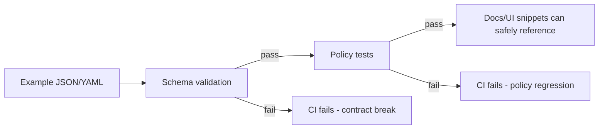

# KFM Artifact Examples (Policy + Schemas) 🧪📜


> **Purpose:** This folder contains **example instances** (“fixtures”) for governed KFM artifacts used by **schema validators**, **policy regression tests**, and **documentation snippets**.
>
> **Non-negotiable:** Examples must be **synthetic**, **safe to share within the repo**, and **representative enough** to catch breaking changes.

---

## Contents

- [What This Directory Is For](#what-this-directory-is-for)
- [Directory Layout](#directory-layout)
- [Example Conventions](#example-conventions)
- [Validation Workflow](#validation-workflow)
- [Adding a New Example](#adding-a-new-example)
- [Sensitivity and Redaction Rules](#sensitivity-and-redaction-rules)
- [“Golden Path” Examples](#golden-path-examples)
- [References](#references)

---

## What This Directory Is For

Examples here are used to:

- ✅ **Prove schemas are implementable** (realistic payloads validate cleanly).
- ✅ **Lock in “contract behavior”** for policy checks (deny-by-default / fail-closed).
- ✅ **Provide test fixtures** for CI (valid + invalid specimens).
- ✅ **Power docs** (“copy/paste” snippets that match the current contract).

Examples are **not** authoritative; schemas and policy rules are.

---

## Directory Layout

> This README intentionally describes a *contracted layout*. If some files do not exist yet, treat them as the **target shape** for build-out.

```text
policy/
└─ schemas/
   └─ artifacts/
      ├─ (authoritative schema files live here)
      └─ examples/
         ├─ README.md  ← you are here
         ├─ focus-mode/
         │  ├─ query.valid.min.json
         │  ├─ query.invalid.missing-evidence-scope.json
         │  ├─ answer.valid.min.json
         │  └─ answer.invalid.missing-citations.json
         ├─ story-node/
         │  ├─ frontmatter.v3.valid.yml
         │  ├─ frontmatter.v3.invalid.bad-date.yml
         │  └─ snippet.valid.md
         ├─ provenance/
         │  ├─ run-receipt.valid.min.json
         │  ├─ run-receipt.valid.full.json
         │  ├─ run-receipt.invalid.hash-mismatch.json
         │  └─ prov-bundle.valid.jsonld
         ├─ catalogs/
         │  ├─ stac.collection.valid.json
         │  ├─ stac.item.valid.json
         │  ├─ dcat.dataset.valid.jsonld
         │  └─ dcat.dataset.invalid.missing-license.jsonld
         └─ policy/
            ├─ input.valid.min.json
            ├─ input.invalid.missing-subject.json
            ├─ decision.allow.example.json
            └─ decision.deny.example.json
```

---

## Example Conventions

### File naming

Use predictable, grep-friendly names:

- **Format:** `<artifact>.<validity>.<variant>.<ext>`
- **Valid examples:** `*.valid.*`
- **Invalid examples:** `*.invalid.*` (include the reason in filename)

Examples:
- `run-receipt.valid.min.json`
- `run-receipt.invalid.missing-spec-hash.json`
- `frontmatter.v3.invalid.bad-timestamp.yml`

### Variant meanings

- `min` → smallest payload that still meets the contract.
- `full` → includes optional fields + edge cases (but still valid).
- `example` → human-facing; used in docs and UI mockups.

### Determinism & IDs

When examples include IDs/hashes:

- Prefer **deterministic** identifiers (stable across runs).
- If you include a `spec_hash` / checksum, ensure the example is either:
  - a **valid** canonical specimen (hash matches the chosen canonicalization), or
  - an **invalid** test case (hash mismatch is *intentional* and documented).

### Time & geography

- Use ISO-8601 timestamps with timezone (e.g., `2026-02-15T00:00:00Z`).
- Use geographic coordinates that are **synthetic / non-sensitive**.
  - When demonstrating geospatial shapes, use “boring” boxes (rectangles) and avoid real site coordinates.

---

## Validation Workflow



**Expectation:** A schema or policy change that breaks examples should be treated as a **breaking contract change** unless you also:
- update schemas,
- update examples,
- and document the migration/intent.

---

## Adding a New Example

### Checklist (Definition of Done)

- [ ] Example is **synthetic** (no PII, no sensitive locations, no secrets).
- [ ] File name matches convention (`valid` / `invalid` + reason).
- [ ] Example is **small** (min) *or* **representative** (full) — not bloated.
- [ ] The example clearly maps to a single schema/policy contract.
- [ ] If invalid: the failure is **intentional** and **isolated** (only one reason if possible).
- [ ] CI covers it:
  - [ ] schema validation runs on it
  - [ ] policy regression (if applicable) runs on it
- [ ] README table (below) is updated if you add a new “family” (Focus Mode, Story Nodes, etc.).

---

## Sensitivity and Redaction Rules

> **GOVERNANCE NOTE:** This folder is treated as “safe-to-repo” content. If it isn’t safe to publish in your repo, it doesn’t belong here.

- **Do not include:**
  - real personal data (names, emails, phone numbers),
  - exact coordinates of sensitive sites (archaeological, endangered species, protected cultural locations),
  - tokens, API keys, credentials, session cookies,
  - proprietary/licensed dataset samples unless the repo license explicitly permits.

- **Do include:**
  - obvious placeholder values (`example@example.org`, `00000000-0000-0000-0000-000000000000`),
  - redaction patterns (`"location": "REDACTED_SENSITIVE"`),
  - “policy denial” examples showing how access is blocked.

---

## “Golden Path” Examples

If you are unsure what to add next, prioritize these “golden path” fixtures (they catch the most integration breakage):

| Example family | Why it matters | Minimum set |
|---|---|---|
| **Run receipt / provenance** | Drives auditability + dataset promotion gates | `valid.min` + `invalid.hash-mismatch` |
| **STAC + DCAT catalogs** | Drives discoverability + compliance | `stac.collection.valid` + `dcat.dataset.valid` + `dcat.dataset.invalid.missing-license` |
| **Story Node front matter** | Governs publishing + Focus Mode citation linking | `frontmatter.v3.valid` + `frontmatter.v3.invalid.bad-date` |
| **Focus Mode query/answer** | Enforces “cite or abstain” contract | `query.valid` + `answer.valid` + `answer.invalid.missing-citations` |
| **Policy decision I/O** | Regression suite for fail-closed behavior | `input.valid` + `decision.deny.example` |

---

## References

- KFM Next-Generation Blueprint & Primary Guide (internal governed design artifact)
- KFM Comprehensive Data Source Integration Blueprint (promotion gates, catalogs, API/policy integration)
- KFM “New Ideas” integration reports (receipts, deterministic hashing, CI gates)
- Professional Markdown Guide for GitHub Documentation (formatting + repo hygiene)

> Tip: In PRs, link the exact schema and policy files your examples target so reviewers can diff contracts quickly.

