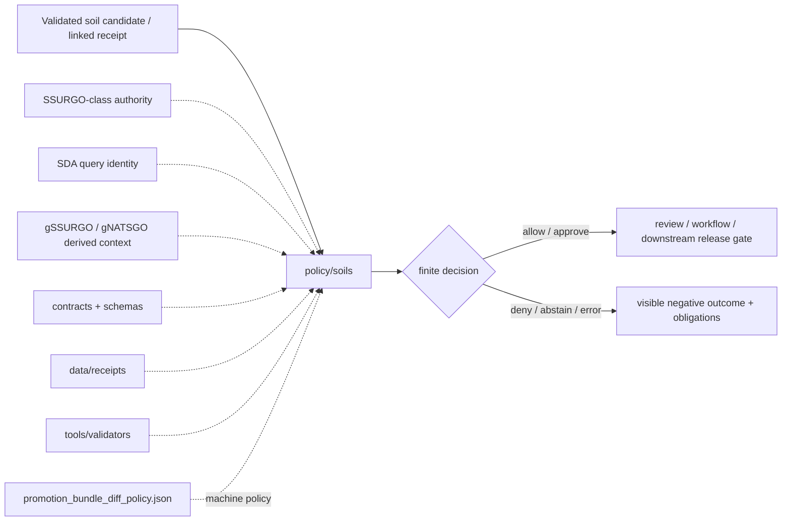

<!-- [KFM_META_BLOCK_V2]
doc_id: kfm://doc/NEEDS_VERIFICATION__policy_soils_readme
title: Soils Policy
type: standard
version: v1
status: draft
owners: @bartytime4life
created: NEEDS_VERIFICATION__YYYY-MM-DD
updated: 2026-04-17
policy_label: NEEDS_VERIFICATION__public_or_internal
related: [
  ../README.md,
  ../../README.md,
  ../../docs/domains/soils/README.md,
  ../../pipelines/README.md,
  ../../pipelines/soils/README.md,
  ../../pipelines/soils/gssurgo-ks/README.md,
  ../../contracts/README.md,
  ../../schemas/README.md,
  ../../data/README.md,
  ../../data/receipts/README.md,
  ../../tools/validators/README.md,
  ../../tools/validators/promotion_gate/README.md,
  ../../.github/workflows/README.md,
  ../../.github/CODEOWNERS,
  ./promotion_bundle_diff_policy.json
]
tags: [kfm, policy, soils, ssurgo, sda, gssurgo, gnatsgo, weighting, publication, fail-closed]
notes: [
  "This README is written as a repo-fit child-lane addition for `policy/soils/README.md`, not as proof that the leaf already exists on the active branch.",
  "Current public repo signals confirm the parent `policy/` lane, the visible soils execution surfaces, and the soils domain doctrine, but exact leaf inventory, created date, and final policy label still need branch verification.",
  "Owner is inherited from current `/policy/` CODEOWNERS coverage and should be rechecked at leaf scope before merge.",
  "This revision also acknowledges the newly added `promotion_bundle_diff_policy.json` as a likely first concrete artifact in the leaf."
]
[/KFM_META_BLOCK_V2] -->

<a id="top"></a>

# Soils Policy

Governed soil-domain decision surface for **source-role separation**, **weighting visibility**, **publication posture**, and **fail-closed soil outcomes** in Kansas Frontier Matrix.

[](#rule-surface)
[](#repo-fit)
[](#repo-fit)
[](#scope)
[](#rule-surface)
[](#operating-tables)
[](#accepted-inputs)

> [!IMPORTANT]
> **Status:** `experimental`  
> **Owners:** `@bartytime4life` *(inherited from current `/policy/` ownership signals; exact leaf ownership still needs branch verification)*  
> **Path:** `policy/soils/README.md`  
> **Repo fit:** child policy lane beneath [`../README.md`](../README.md), downstream of validated soil candidates and receipts, upstream of review, workflow, and release-facing gates  
> **Accepted inputs:** soil-domain rule bundles, reviewable policy fixtures, narrow policy data, and steward-facing decision notes  
> **Exclusions:** schema authority, validator implementation, receipts, raw or processed artifacts, proof packs, workflow YAML, and broad domain exposition

**Quick jumps:** [Scope](#scope) · [Repo fit](#repo-fit) · [Accepted inputs](#accepted-inputs) · [Exclusions](#exclusions) · [Rule surface](#rule-surface) · [Directory tree](#directory-tree) · [Quickstart](#quickstart) · [Usage](#usage) · [Diagram](#diagram) · [Operating tables](#operating-tables) · [Task list](#task-list--definition-of-done) · [FAQ](#faq)

> [!NOTE]
> This README is intentionally narrower than the parent [`../README.md`](../README.md) and the broader soil domain guide in [`../../docs/domains/soils/README.md`](../../docs/domains/soils/README.md). It exists to define **policy-bearing soil decisions**, not to restate the entire soils worldview, pipeline recipe, or contract registry.

> [!TIP]
> Keep the KFM soil trust split visible:
>
> - **SSURGO-class survey structure** is upstream soil authority.
> - **Soil Data Access (SDA)** is an access/query surface to that authority, not a second sovereign truth.
> - **gSSURGO** and **gNATSGO** are useful derived grids and convenience surfaces, but they remain derived unless a stronger release object says otherwise.
> - **Receipts** preserve process memory.
> - **Validators** prove shape and linkage.
> - **Policy** decides finite allow / deny / review semantics.
> - **Proofs, catalogs, and publication** stay downstream.

---

## Scope

`policy/soils/` is the child policy lane for soil-domain governance decisions that must stay explicit, reviewable, and fail-closed.

This lane should answer questions such as:

- what counts as **authoritative soil truth** versus a derived convenience surface
- when a soil summary is too flattened to trust
- when weighting or aggregation basis is required
- how soil outputs should be labeled before they become runtime- or publication-facing
- when a candidate should be **allowed**, **held**, **generalized**, **quarantined**, or otherwise routed into stronger review
- which obligations must remain visible when support is mixed, stale, or structurally weak

### Working rule

Use this lane for **soil-domain policy law**, not for:

- canonical schema ownership
- executable validator logic
- source-native ingest recipes
- receipt storage
- proof packs or signed attestations
- the public runtime answer surface

### Load-bearing soil policy commitments

| Commitment | Practical consequence here |
|---|---|
| Authoritative soil truth must remain distinct from derived convenience products | This lane should reject or downgrade outputs that present `gSSURGO`, `gNATSGO`, or other gridded convenience layers as if they were the same thing as detailed SSURGO-class survey structure |
| Structural hierarchy matters | Policy must keep map unit → component → horizon reasoning visible when the question depends on it |
| Weighting basis is load-bearing | Dominant-component, weighted-summary, catchment rollup, or statewide summary outputs should not publish or answer silently without explicit weighting basis |
| Mixed authority should stay visible | Soil survey records, model outputs, moisture observations, and KFM-authored derivatives should not be flattened into one undifferentiated truth surface |
| Negative outcomes still count | Missing weighting, mixed authority, stale release basis, or malformed candidates should remain explicit rather than being “helpfully” smoothed away |
| Publication is downstream | This lane may permit or deny a next step, but publication, proof packs, and catalog closure remain separate downstream burdens |

[Back to top](#top)

---

## Repo fit

**Path:** `policy/soils/README.md`  
**Role:** soil-specific child README for executable policy expectations beneath the broader top-level policy lane

### Path and adjacent surfaces

| Relation | Surface | Status | Why it matters |
|---|---|---:|---|
| Parent policy lane | [`../README.md`](../README.md) | **CONFIRMED** | Top-level decision authority, default-deny posture, and repo-wide policy placement rules live there |
| Root system identity | [`../../README.md`](../../README.md) | **CONFIRMED** | Keeps this child lane subordinate to repo-wide evidence-first identity |
| Domain burden guide | [`../../docs/domains/soils/README.md`](../../docs/domains/soils/README.md) | **CONFIRMED** | Strongest repo-facing prose for authoritative-versus-derived soil distinctions and soil hierarchy |
| Execution-family root | [`../../pipelines/README.md`](../../pipelines/README.md) | **CONFIRMED** | Confirms `/pipelines/` is the execution-family index, not the policy home |
| Soils execution parent | [`../../pipelines/soils/README.md`](../../pipelines/soils/README.md) | **CONFIRMED** | Parent execution index for soil-family work |
| Kansas child slice | [`../../pipelines/soils/gssurgo-ks/README.md`](../../pipelines/soils/gssurgo-ks/README.md) | **CONFIRMED** | Closest currently visible soil execution slice on public `main` |
| Shared contract boundary | [`../../contracts/README.md`](../../contracts/README.md) | **CONFIRMED** | Trust-bearing contract law should stay upstream, not be forked here |
| Shared schema boundary | [`../../schemas/README.md`](../../schemas/README.md) | **CONFIRMED** | Machine shape authority remains upstream |
| Process-memory lane | [`../../data/receipts/README.md`](../../data/receipts/README.md) | **CONFIRMED** | Policy consumes receipts and linked evidence; it does not own them |
| Validator parent | [`../../tools/validators/README.md`](../../tools/validators/README.md) | **CONFIRMED** | Validators verify linkage and structure before policy decides |
| Promotion validator | [`../../tools/validators/promotion_gate/README.md`](../../tools/validators/promotion_gate/README.md) | **CONFIRMED** | Release-facing validation remains a sibling downstream gate, not the same thing as policy authorship |
| Workflow doc lane | [`../../.github/workflows/README.md`](../../.github/workflows/README.md) | **CONFIRMED** | Workflow documentation may describe execution burden, but it should not be treated as policy authority |
| Ownership clue | [`../../.github/CODEOWNERS`](../../.github/CODEOWNERS) | **CONFIRMED at broader scope** | Current owner signal is inherited, not leaf-proven |
| Concrete first artifact | [`./promotion_bundle_diff_policy.json`](./promotion_bundle_diff_policy.json) | **CONFIRMED in current working set** | Gives this leaf a first machine-readable soils policy bundle rather than README-only intent |

### Boundary rule

Use `policy/soils/` when the main question is:

> **“What soil-domain decision law should apply once a candidate, receipt, or runtime-facing soil claim has already been shaped enough to evaluate?”**

Do **not** use `policy/soils/` to:

- define the canonical row or envelope schema
- store `run_receipt` or `ValidationReport` objects
- write pipeline-specific how-to recipes
- store raw or processed soil artifacts
- emit or persist proof bundles
- document workflow governance in the abstract

[Back to top](#top)

---

## Accepted inputs

`policy/soils/` should stay compact, explicit, and decision-oriented.

| Input class | What belongs here | Typical examples |
|---|---|---|
| Soil-domain rule bundles | Rule packs that decide one soil trust seam or seam family | authority split rules, weighting rules, publication-profile rules, runtime mediation rules |
| Positive / negative fixtures | Small reviewable cases that prove deny-by-default behavior | `allow`, `deny`, `abstain`, `needs-review`, `generalize`, `quarantine` examples |
| Soil-specific policy data | Small checked-in registries that keep decisions machine-readable | publication profiles, allowed derived-label classes, threshold bundles, reason / obligation lookups if not globally owned elsewhere |
| Runtime-policy coordination notes | Narrow notes explaining how soil runtime decisions should consume upstream authority | weighting-basis notes, stale-refresh handling notes, mixed-authority mediation notes |
| Steward-facing review notes | Minimal human-readable notes needed to review soil-policy changes | glossary notes, decision matrix notes, burden reminders |
| Starter decision fixtures | Cases that preserve finite outcomes without redefining the repo’s whole decision grammar | weighted summary allowed, mixed-authority denied, stale refresh basis held |

### Working placement rule

If the change mostly defines **soil policy law**, it belongs here.  
If it mostly defines **shared contract shape**, put it in [`../../contracts/README.md`](../../contracts/README.md) or [`../../schemas/README.md`](../../schemas/README.md).  
If it mostly proves **validator behavior**, put it under [`../../tools/validators/README.md`](../../tools/validators/README.md) or the repo-facing test lane.  
If it mostly describes **how one soil pipeline runs**, keep it in [`../../pipelines/soils/README.md`](../../pipelines/soils/README.md) or the specific child slice.

[Back to top](#top)

---

## Exclusions

`policy/soils/` should not quietly become a second home for soil logic that already has a stronger lane.

| Does **not** belong in `policy/soils/` | Put it instead | Why |
|---|---|---|
| Canonical JSON Schema / contract definitions | [`../../contracts/README.md`](../../contracts/README.md) and [`../../schemas/README.md`](../../schemas/README.md) | Shared trust-object shape should not drift into policy lanes |
| Raw source captures or processed soil datasets | [`../../data/README.md`](../../data/README.md) and child lifecycle lanes | Policy governs movement and exposure; it is not the canonical store |
| `run_receipt`, validation, or replay memory as the primary object | [`../../data/receipts/README.md`](../../data/receipts/README.md) | Process memory should remain distinct from decision law |
| Release manifests, proof packs, DSSE bundles, attestation payloads | [`../../data/proofs/README.md`](../../data/proofs/README.md) and `tools/attest/` | Release-significant evidence is stronger than local policy notes |
| Soil execution recipes and watcher documentation | [`../../pipelines/soils/README.md`](../../pipelines/soils/README.md) and child pipeline slices | Execution law and decision law should not collapse into one README |
| Broad domain interpretation | [`../../docs/domains/soils/README.md`](../../docs/domains/soils/README.md) | Domain worldview should stay domain-facing |
| Validator scripts or schema-check wrappers | [`../../tools/validators/README.md`](../../tools/validators/README.md) | Validation and decision remain separate responsibilities |
| Workflow YAML or platform settings | [`../../.github/workflows/README.md`](../../.github/workflows/README.md) | Documentation about gates is not the same thing as checked-in policy authority |

> [!WARNING]
> If a file here starts behaving like a proof pack, a receipt store, a schema registry, or a pipeline recipe, it is in the wrong lane.

[Back to top](#top)

---

## Rule surface

This section captures the **first-wave soil policy seams** that should remain explicit even when the implementation is still thin.

### 1. Authority split

- **SSURGO-class survey structure** is the strongest detailed soil authority.
- **SDA** should be treated as the authoritative tabular query surface to that structure when query identity is explicit.
- **gSSURGO** and **gNATSGO** are highly useful but remain **derived / grid convenience surfaces** unless a stronger release object explicitly says otherwise.
- **KFM-authored rollups** remain derived products and should say so plainly.

### 2. Structural integrity

Policy should remain sensitive to whether a candidate preserves the relevant soil structure:

- map unit (`mukey`)
- component (`cokey`)
- horizon / layer detail when applicable
- release or refresh basis
- explicit weighting method when producing summaries

If the question needs component weighting or horizon detail, a map-unit-only or grid-only answer may need to **abstain**, **deny**, or route to stronger review rather than pretending the reduction is harmless.

### 3. Weighting visibility

When a soil answer or release object summarizes or ranks soil properties, the candidate should keep the weighting basis visible.

Examples:

- dominant component
- weighted component summary
- catchment-weighted summary
- county or statewide rollup
- gridded pixel-derived summary
- modeled or inferred soil-class approximation

A weighting basis that is merely implicit should be treated as weak support, not as a fully answerable state.

### 4. Publication posture

A soil candidate should default to the safest truthful posture:

- **allow** when source role, grain, weighting, and refresh basis are explicit enough for the stated use
- **hold / abstain / deny** when key decision inputs are missing
- **generalize** when exactness would overstate support
- **quarantine** when rights, sensitivity, or integrity remain unresolved

### 5. Cross-lane mediation

This lane should help keep soil truth from being flattened by adjacent domains.

Examples of seams that should remain explicit:

- soil survey data + hydrology overlays
- soil survey data + soil-moisture time series
- soil survey data + crop or land-cover summaries
- soil survey data + hazard or erosion overlays
- soil survey data + KFM-authored derived summaries

A useful cross-lane result is not automatically a good policy result if it hides which side contributed surveyed truth and which side contributed contextual or derived interpretation.

### 6. Runtime mediation

When a runtime-facing soil claim depends on weak or mixed support, the negative path should stay visible.

Good policy behavior includes outcomes such as:

- **not enough weighting basis**
- **mixed authority or resolution flattening**
- **unknown release or refresh basis**
- **derived-only support where authoritative detail was required**
- **malformed or incomplete candidate**

That fail-closed behavior is preferable to a fluent but weak answer.

### 7. First concrete machine-readable bundle

The currently added [`promotion_bundle_diff_policy.json`](./promotion_bundle_diff_policy.json) is the strongest visible starter artifact for this leaf in the working set.

It externalizes policy-bearing decisions such as:

- threshold-driven promotion checks
- missing-value posture
- fail-closed defaults
- deny / review / approve decision rules
- downstream obligations

> [!IMPORTANT]
> Tooling should **consume** these values rather than hardcoding thresholds into helpers. Policy belongs here; scripts should execute policy, not invent it.

[Back to top](#top)

---

## Directory tree

### Current confirmed parent signal

```text
policy/
└── README.md
```

### Requested child target

```text
policy/
└── soils/
    ├── README.md
    └── promotion_bundle_diff_policy.json
```

> [!NOTE]
> The snippet above reflects the current working-set target for this leaf, but exact checked-in branch inventory still needs verification before stronger claims are made.

<details>
<summary><strong>Doctrine-aligned starter soil policy shape (PROPOSED)</strong></summary>

```text
policy/soils/
├── README.md
├── promotion_bundle_diff_policy.json
├── bundles/
│   ├── authority.rego
│   ├── weighting.rego
│   ├── publication.rego
│   └── runtime.rego
├── fixtures/
│   ├── allow/
│   ├── deny/
│   ├── abstain/
│   └── needs-review/
├── tests/
│   └── README.md
└── soil_publication_profiles.json
```

Use the tree above as a **starter scaffold**, not as a claim that these files are already mounted.

</details>

[Back to top](#top)

---

## Quickstart

Use inspection-first commands so this README stays truthful as the branch evolves.

### 1) Inspect the current branch before trusting this leaf

```bash
find policy -maxdepth 4 \( -type f -o -type d \) 2>/dev/null | sort

sed -n '1,260p' policy/README.md 2>/dev/null || true
sed -n '1,220p' docs/domains/soils/README.md 2>/dev/null || true
sed -n '1,220p' pipelines/README.md 2>/dev/null || true
sed -n '1,220p' pipelines/soils/README.md 2>/dev/null || true
sed -n '1,220p' pipelines/soils/gssurgo-ks/README.md 2>/dev/null || true
sed -n '1,220p' contracts/README.md 2>/dev/null || true
sed -n '1,220p' schemas/README.md 2>/dev/null || true
sed -n '1,220p' data/receipts/README.md 2>/dev/null || true
sed -n '1,220p' tools/validators/README.md 2>/dev/null || true
sed -n '1,220p' tools/validators/promotion_gate/README.md 2>/dev/null || true
sed -n '1,220p' .github/workflows/README.md 2>/dev/null || true
sed -n '1,220p' .github/CODEOWNERS 2>/dev/null || true
```

### 2) Reconfirm soil vocabulary before inventing new policy terms

```bash
git grep -n "SSURGO\|gSSURGO\|gNATSGO\|Soil Data Access\|SDA\|mukey\|cokey\|spec_hash\|run_receipt\|weighting\|hydric\|hydgrp\|dominant component\|promotion_bundle_diff_policy" -- \
  policy docs pipelines data contracts schemas tools tests .github 2>/dev/null || true
```

### 3) Add the smallest credible leaf

```bash
mkdir -p policy/soils
touch policy/soils/README.md
touch policy/soils/promotion_bundle_diff_policy.json
```

### 4) Minimal edit posture

```bash
# 1) preserve authoritative-versus-derived split
# 2) link to shared law instead of duplicating it loosely
# 3) make weighting requirements explicit
# 4) keep fail-closed outcomes visible
# 5) keep policy as the threshold home
# 6) do not imply workflow/runtime/publication maturity you cannot surface
```

[Back to top](#top)

---

## Usage

Use this lane when the main question is:

> “Given a validated soil candidate or runtime-facing soil claim, what policy rule should decide whether it may move forward, how it must be labeled, or whether it must fail closed?”

### Use this lane when

- the soil candidate already exists and now needs a governed decision
- source-role separation is the key question
- weighting basis or refresh basis decides whether a claim is trustworthy
- a derived grid or summary needs proper labeling
- runtime-facing soil language must avoid flattening mixed authority
- a reviewer needs an explicit allow / deny / review rule rather than more pipeline prose
- promotion thresholds or fail-closed defaults need a machine-readable home

### Do not use this lane when

- the main burden is raw ingest
- the main burden is the pipeline recipe itself
- the main burden is storing receipts or processed outputs
- the main burden is catalog closure
- the main burden is cryptographic proof
- the main burden is validator implementation

### Finite outcomes: consume, do not reinvent

This lane should consume the repo’s stronger decision grammar rather than fork it casually.

| Outcome family | Reading here |
|---|---|
| `allow / deny / abstain / error` style policy outcomes | reasonable to consume or document as policy-facing outcomes when upstream contract law already uses them |
| review / hold / generalize / quarantine posture | useful as human-readable routing language when tied back to stronger policy or validator objects |
| `APPROVE / REVIEW / DENY` promotion decisions | acceptable when rooted in this leaf’s machine-readable policy bundles and downstream decision envelopes |
| release-significant states | should remain downstream and should not be silently re-authored by this README |

> [!IMPORTANT]
> A soil policy leaf may preserve or explain a result. It should not quietly redefine the repo’s global runtime, release, or proof-object vocabularies.

[Back to top](#top)

---

## Diagram



This diagram is intentionally narrow: `policy/soils/` is a decision seam, not the whole soil system.

[Back to top](#top)

---

## Operating tables

### Representative source-role matrix

| Source family | Policy reading | Default posture |
|---|---|---|
| SSURGO / SSURGO-class survey records | strongest detailed soil authority | may support stronger soil claims when grain and structure stay explicit |
| Soil Data Access (SDA) | authoritative tabular access / query surface | acceptable when canonical query identity and response basis stay visible |
| gSSURGO | derived statewide gridded / convenience surface | allow as derived or convenience support; do not silently upgrade to detailed survey truth |
| gNATSGO | broader gridded regional / national surface | allow as derived context or fallback, not as a substitute for detailed local survey authority |
| Mesonet / SCAN / SMAP soil-moisture context | time-varying context adjacent to soils | useful context, but should not be flattened into soil survey truth |
| KFM-authored summaries and overlays | subordinate derived products | require explicit derivation, weighting, and labeling |

### Starter deny / abstain / review triggers

| Trigger | Typical problem | Safe reading |
|---|---|---|
| Missing source role | cannot tell whether input is authoritative, derived, or contextual | deny or hold |
| Missing weighting basis | summary pretends certainty without showing how it was derived | abstain or deny |
| Mixed authority / resolution flattening | survey data, grids, and model outputs collapsed into one answer | deny or route to stronger review |
| Unknown release / refresh basis | cannot tell which upstream soil release or query basis matters | abstain / hold |
| Rights or sensitivity uncertainty | public-safe use is not explicit enough | deny or quarantine |
| Malformed candidate | required fields, structure, or linkage missing | error / deny |

### What this lane should make easier

| Question | Why this lane is the right place |
|---|---|
| Can a gridded soil layer be described as authoritative? | because the answer is a policy distinction, not merely a pipeline choice |
| Is a dominant-component summary safe to publish as “soil truth”? | because weighting and labeling are governance questions |
| Can a runtime answer cite a soil class without refresh basis? | because fail-closed runtime trust depends on policy law |
| Should mixed survey + moisture + overlay output be generalized? | because cross-lane trust boundaries are policy-bearing |
| Where should promotion thresholds live? | in policy, so tools consume declared law instead of hardcoding hidden decisions |

### Promotion-bundle policy hooks

| Policy seam | Current local expression | Why it matters |
|---|---|---|
| Dominant mukey coverage | thresholded in `promotion_bundle_diff_policy.json` | keeps promotion thresholds in policy rather than helper scripts |
| Area mismatch | thresholded in `promotion_bundle_diff_policy.json` | preserves explicit release review posture |
| Missing provenance | fail-closed deny condition | protects trust objects from under-described lineage |
| Hydrologic group shift | draft policy threshold | keeps reviewable placeholder values visible instead of hidden |
| Raster histogram shift | draft policy threshold | gives raster drift a machine-readable review seam |

[Back to top](#top)

---

## Task list / definition of done

A first serious revision of this leaf is ready when all of the following are true:

- [ ] the child path is confirmed on the active branch
- [ ] the KFM Meta Block V2 placeholders are replaced with branch-backed values where possible
- [ ] at least one soil-specific allow fixture exists
- [ ] at least one deny or abstain fixture exists for mixed authority or missing weighting
- [ ] the leaf links cleanly to shared contracts, schemas, receipts, validators, soils execution/docs surfaces, and the current machine-readable policy bundle
- [ ] authoritative-versus-derived soil language remains explicit
- [ ] threshold-bearing policy remains here rather than drifting back into helper scripts
- [ ] this README does not imply mounted workflow, runtime, or publication maturity that the branch does not prove

[Back to top](#top)

---

## FAQ

### Does this lane make SSURGO or SDA queries?

No. Query execution belongs in pipeline or connector surfaces. This lane decides how those shaped results should be interpreted, labeled, or blocked.

### Can `gSSURGO` or `gNATSGO` be treated as the same thing as detailed SSURGO survey structure?

Not by default. They are useful and often necessary, but they should remain visibly derived unless a stronger release object explicitly promotes a specific use.

### Does this lane own `run_receipt`, `ValidationReport`, or `DecisionEnvelope` schemas?

No. It may consume or reference those objects, but contract and schema authority should remain upstream.

### Does this lane publish anything?

No. It should decide whether a next step is allowed or blocked. Publication, catalog closure, proofs, and release records remain downstream.

### Why does weighting show up so often here?

Because soil summaries become misleading quickly when the weighting basis disappears. In this domain, hidden weighting is often hidden authority drift.

### Why mention `promotion_bundle_diff_policy.json` here?

Because it is the clearest current example of a soils-specific machine-readable policy object in the working set. It gives this leaf a concrete policy-bearing artifact instead of leaving the lane purely aspirational.

[Back to top](#top)
