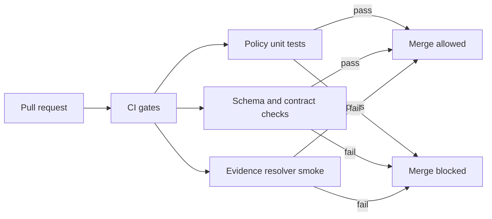

<!-- [KFM_META_BLOCK_V2]
doc_id: kfm://doc/89ecfdad-5839-4f7d-a3b2-dc1bf8768af2
title: Policy Tests
type: standard
version: v1
status: draft
owners: <fill-me>
created: 2026-02-22
updated: 2026-02-22
policy_label: internal
related:
  - policy/rego/
  - policy/fixtures/
  - policy/tests/
tags: [kfm, policy, tests, governance]
notes:
  - Policy tests are fixtures-driven and must match CI + runtime semantics.
[/KFM_META_BLOCK_V2] -->

# Policy Tests
Fixtures-driven policy-as-code tests that enforce KFM’s **fail-closed trust membrane** (CI + runtime).

**Status:** draft • **Owners:** `<fill-me>` • **Policy label:** `internal`


---

## Quick navigation
- [Truth status](#truth-status)
- [Scope](#scope)
- [Directory layout](#directory-layout)
- [Running tests locally](#running-tests-locally)
- [Writing tests](#writing-tests)
- [Test matrix](#test-matrix)
- [Promotion Contract mapping](#promotion-contract-mapping)
- [CI integration contract](#ci-integration-contract)
- [Troubleshooting](#troubleshooting)
- [Policy test checklist](#policy-test-checklist)
- [Glossary](#glossary)

---

## Truth status

**Confirmed (per KFM governance docs):**
- Policy must evaluate the same way in CI and runtime, or at minimum share the same fixtures and outcomes.
- Policy tests are fixtures-driven and must block merges (fail closed).
- Policy decisions include **allow/deny** plus **obligations** (and typically reason codes for audit/UX).
- Default posture is **deny** for sensitive/restricted material; error responses must not leak restricted existence.

**Proposed (this repo scaffold):**
- Using **OPA/Rego** test files in this directory and JSON fixtures in `policy/fixtures/`.
- Optional: using **Conftest** to apply policy checks to manifests/contracts in CI.

**Unknown (must be verified in repo):**
- Exact policy engine (OPA vs alternative), CI runner, and build tooling commands.
- Exact fixture naming conventions and schema locations.

> **NOTE:** If your repository structure differs from the proposed skeleton below, update this README (and keep tests/fixtures aligned with runtime).

[Back to top](#policy-tests)

---

## Scope

This directory contains **policy unit tests** (and closely related “policy contract tests”) that prove:

1. **Decisions** are correct: `allow` or `deny` is deterministic for a given `(user, action, resource, context)`.
2. **Obligations** are correct: any redaction/generalization/UX notice requirements are emitted deterministically.
3. **No leaks**: policy-safe errors (403/404 alignment) and “no ghost metadata” behavior are enforced in outputs.

### What a policy decision must look like

A *policy decision* is treated as a contract surface. At minimum it should be representable as:

```json
{
  "decision_id": "kfm://policy_decision/<id>",
  "policy_label": "restricted",
  "decision": "deny",
  "reason_codes": ["SENSITIVE_SITE", "RIGHTS_UNCLEAR"],
  "obligations": [
    {"type": "generalize_geometry", "min_cell_size_m": 5000},
    {"type": "remove_attributes", "fields": ["exact_location", "owner_name"]}
  ],
  "evaluated_at": "YYYY-MM-DDThh:mm:ssZ",
  "rule_id": "deny.restricted_dataset.default"
}
```

> Keep policy tests **hermetic**: no network I/O, no “current time” dependencies, no environment-coupled hostnames.

[Back to top](#policy-tests)

---

## Directory layout

Proposed (KFM-recommended) policy bundle skeleton:

```text
policy/
├─ rego/
│  └─ kfm.rego                      # core policy rules (authz, obligations, etc.)  (proposed)
├─ fixtures/
│  ├─ public_user.json              # input fixture                                 (proposed)
│  ├─ steward_user.json             # input fixture                                 (proposed)
│  ├─ dataset_public.json           # resource fixture                               (proposed)
│  └─ dataset_restricted.json       # resource fixture                               (proposed)
└─ tests/
   ├─ README.md                     # you are here
   └─ kfm_test.rego                 # rego test module(s)                            (proposed)
```

If your repo uses an alternative policy system, mirror the same **three-part** structure:

- `rego/` (or equivalent): policy sources
- `fixtures/`: inputs and expected outputs (goldens)
- `tests/`: deterministic tests that must pass in CI

[Back to top](#policy-tests)

---

## How policy tests fit into the trust membrane



**Principle:** CI and runtime must share the same semantics (or fixtures+outcomes), otherwise CI guarantees are meaningless.

[Back to top](#policy-tests)

---

## Running tests locally

### Option A — OPA/Rego (recommended pattern)

From repo root:

```bash
# Run all policy tests (OPA discovers *_test.rego automatically)
opa test ./policy -v
```

Common variations:

```bash
# Only run tests
opa test ./policy/tests -v

# Run tests but load the policy package(s)
opa test ./policy/rego ./policy/tests -v
```

### Option B — Conftest (recommended for “policy gates” on files)

If you apply policy to artifacts like promotion manifests, Story Node sidecars, or run receipts:

```bash
# Example pattern (paths will vary by repo)
conftest test \
  --policy ./policy/rego \
  ./path/to/manifests ./path/to/contracts
```

> Conftest is ideal when you want policy checks to run against files in PRs, with readable failure output.

[Back to top](#policy-tests)

---

## Writing tests

### Test design rules

1. **One rule, two tests minimum**
   - at least one `allow` case
   - at least one `deny` case

2. **Obligations must be asserted**
   - do not only test `allow/deny`
   - also test that obligations are emitted exactly when expected

3. **No metadata leaks**
   - tests must cover policy-safe error behavior (403/404 alignment, “no ghost metadata”)

4. **Fixtures-first**
   - prefer re-usable fixtures to inline JSON blobs
   - fixtures should represent *realistic* runtime input shapes

### Example Rego test pattern (illustrative)

```rego
package kfm.authz_test

import data.kfm.authz

# Public user can read public resources.
test_public_can_read_public {
  authz.allow with input as {
    "user": {"role": "public"},
    "action": "read",
    "resource": {"policy_label": "public"}
  }
}

# Public user cannot read restricted resources.
test_public_cannot_read_restricted {
  not authz.allow with input as {
    "user": {"role": "public"},
    "action": "read",
    "resource": {"policy_label": "restricted"}
  }
}

# public_generalized emits a UI notice obligation.
test_public_generalized_emits_notice {
  some o
  o := authz.obligations[_] with input as {
    "user": {"role": "public"},
    "action": "read",
    "resource": {"policy_label": "public_generalized"}
  }
  o.type == "show_notice"
}
```

[Back to top](#policy-tests)

---

## Test matrix

| Layer | What it validates | Typical location | Required in CI | Notes |
|---|---|---:|:---:|---|
| Policy unit tests | allow/deny + obligations correctness | `policy/tests/` | ✅ | Must share CI/runtime semantics |
| Fixture validity | fixture JSON shape + required fields | `policy/fixtures/` (+ schemas) | ✅ | Add invalid fixtures to prove fail-closed |
| Policy gates on artifacts | promotion manifests, run receipts, Story sidecars | varies | ✅ | Best via Conftest |
| Evidence resolution smoke | at least one EvidenceRef resolves in CI | varies | ✅ | Prevents “uncited” merges |
| API error model | policy-safe errors + audit_ref presence | API tests | ✅ | Avoid 403/404 side-channel leaks |

[Back to top](#policy-tests)

---

## Promotion Contract mapping

Policy tests are not “just authz.” They are a gate in dataset promotion.

| Gate | What must be true | How tests help |
|---|---|---|
| Gate A | Stable Dataset/DatasetVersion identity, deterministic `spec_hash` | Validate manifest inputs to hashing; reject unstable IDs |
| Gate B | License + rights holder captured; unclear rights ⇒ quarantine | Validate rights fields exist; deny promotion if missing |
| Gate C | `policy_label` assigned; redaction/generalization plan exists for sensitive/restricted | Validate label + obligations; require PROV reference |
| Gate D | DCAT/STAC/PROV validate and cross-link | Contract tests + resolver checks |
| Gate E | Run receipt exists with checksums + environment | Policy checks on receipt schema/invariants |
| **Gate F** | **Policy tests + contract tests pass**; EvidenceRef resolves | This directory is a core part of Gate F |
| Gate G | Optional hardening: SBOM, perf, a11y smoke | Separate suites, but referenced here |

[Back to top](#policy-tests)

---

## CI integration contract

### Required behaviors (fail closed)

- Policy tests **must run on every PR** that touches:
  - policy code (`policy/rego/` or equivalent)
  - fixtures (`policy/fixtures/`)
  - promotion artifacts (manifests, run receipts, catalogs, story sidecars)
- Policy tests **must block merges** when failing.
- CI failures must be **readable**:
  - include a stable error code (or test name)
  - include a safe remediation hint when possible
  - never include restricted metadata in failure messages

### Minimum verification steps (repo maintainers)

- Confirm `opa test` (or equivalent) is a **required status check** on the default branch.
- Confirm runtime uses the same policy bundle/fixtures (or a verified equivalent build).
- Confirm deny/abstain paths do not leak existence via 403/404 differences.

[Back to top](#policy-tests)

---

## Troubleshooting

### “Tests pass locally but fail in CI”
- Ensure CI and local use the **same policy bundle revision** and the same fixture set.
- Watch for environment-coupled values (hostnames, timestamps, random IDs) sneaking into fixtures.

### “Policy denies unexpectedly”
- Check `policy_label` and controlled vocab.
- Inspect obligations: a deny might be correct but you expected a generalized public representation.

### “No leak” tests failing
- Ensure errors are **policy-safe** and do not differ between “not found” and “not allowed” in ways that reveal restricted existence.
- Ensure logs/outputs avoid printing restricted IDs, titles, or bounding boxes unless policy allows.

[Back to top](#policy-tests)

---

## Policy test checklist

Use this as a PR checklist when modifying policy:

- [ ] Added/updated fixtures for the new case
- [ ] Added at least one allow test and one deny test
- [ ] Asserted obligations (not just allow/deny)
- [ ] Added/updated “no leak” test coverage (403/404 / ghost metadata)
- [ ] Updated controlled vocabulary usage if adding a new label
- [ ] Confirmed CI required checks run and fail closed

[Back to top](#policy-tests)

---

## Glossary

- **PDP**: Policy Decision Point (the evaluator, e.g., OPA)
- **PEP**: Policy Enforcement Point (where the decision is applied: CI, API, evidence resolver, UI boundary)
- **Obligations**: Required redactions/generalizations/UX notices returned with a decision
- **EvidenceRef**: A reference that must resolve to an evidence bundle through the governed evidence resolver
- **Fail closed**: Missing rights/sensitivity/metadata ⇒ deny promotion/serving, not “best effort”

---
