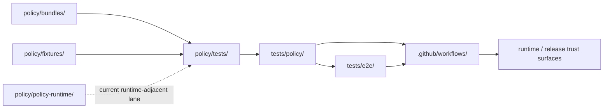

<!-- [KFM_META_BLOCK_V2]
doc_id: kfm://doc/<TODO-VERIFY-UUID>
title: Policy tests
type: standard
version: v1
status: draft
owners: @bartytime4life
created: <TODO: verify YYYY-MM-DD>
updated: 2026-03-23
policy_label: public
related: [policy/README.md, policy/bundles/README.md, policy/fixtures/README.md, policy/policy-runtime/README.md, tests/README.md, tests/policy/README.md, .github/workflows/README.md, contracts/README.md, schemas/README.md]
tags: [kfm, policy, tests, governance, verification]
notes: [doc_id and original created date need verification; current public main showed this file as a scaffold placeholder before this revision]
[/KFM_META_BLOCK_V2] -->

# Policy tests

Bundle-local policy verification lane for KFM deny-by-default rules, fixture-backed regression, and seam-local proof.

> **Status:** experimental  
> **Owners:** `@bartytime4life`  
> **Path:** `policy/tests/README.md`  
> **Repo fit:** child verifier lane under [`../README.md`](../README.md); nearest siblings [`../bundles/README.md`](../bundles/README.md), [`../fixtures/README.md`](../fixtures/README.md), and [`../policy-runtime/README.md`](../policy-runtime/README.md); repo-facing verification neighbors [`../../tests/README.md`](../../tests/README.md) and [`../../tests/policy/README.md`](../../tests/policy/README.md); workflow guardrail [`../../.github/workflows/README.md`](../../.github/workflows/README.md)  
>         
> **Quick jump:** [Scope](#scope) · [Repo fit](#repo-fit) · [Accepted inputs](#accepted-inputs) · [Exclusions](#exclusions) · [Directory tree](#directory-tree) · [Quickstart](#quickstart) · [Usage](#usage) · [Diagram](#diagram) · [Tables](#tables) · [Task list](#task-list--definition-of-done) · [FAQ](#faq) · [Appendix](#appendix)

> [!IMPORTANT]
> `policy/tests/` is the **bundle-local** policy assertion lane.  
> It is not the same surface as [`../../tests/policy/README.md`](../../tests/policy/README.md), which should hold repo-facing proof that policy behavior survives contact with broader verification, runtime, release, and correction lanes.

> [!NOTE]
> Current public `main` shows this lane as present, but executable bundle inventory, runner choice, fixture density, required checks, and merge-blocking workflow wiring still need branch-level verification.

---

## Scope

`policy/tests/` keeps policy assertions close to policy artifacts.

In KFM terms, this directory is where rule-local proof stays near the rule seam: admission, rights, sensitivity, review, runtime, release, correction, and related negative-path behavior should be testable without pretending that local bundle checks are the whole repo verification story.

Questions that belong here include:

- does a local rule default to `deny`, `hold`, or `review-required` when required inputs are missing?
- do shared fixtures trigger stable reason / obligation grammar instead of free-text drift?
- do restrict, generalize, withdraw, supersede, or similar governed outcomes remain explicit at the bundle boundary?
- do local helper imports or test packs resolve cleanly without silently changing bundle meaning?

### Evidence boundary used here

| Evidence layer | What this README treats as settled |
|---|---|
| **CONFIRMED — current public repo** | `policy/` is a real top-level lane; the current public tree shows `bundles/`, `fixtures/`, `policy-runtime/`, `tests/`, and `README.md`; `policy/tests/README.md` exists; `/policy/` is owned by `@bartytime4life`. |
| **CONFIRMED — adjacent repo docs** | [`../README.md`](../README.md) treats `policy/` as the executable governance surface; [`../../tests/README.md`](../../tests/README.md) separates policy bundle ownership under `../policy/` from repo-facing verification in `tests/policy/`; [`../../.github/workflows/README.md`](../../.github/workflows/README.md) currently documents a README-only public workflow lane. |
| **PROPOSED — doctrine-aligned working shape** | Seam-based local growth under `policy/tests/`, paired negative-path coverage, and explicit escalation from local policy assertions into repo-facing proof lanes. |
| **UNKNOWN / NEEDS VERIFICATION** | Actual `.rego` or equivalent test inventory, runner choice, fixture density, exact required checks, branch protection, and whether local policy tests are already wired into any merge-blocking automation. |

### Status markers used in this README

| Marker | Meaning in this file |
|---|---|
| **CONFIRMED** | Visible on the current public branch or directly anchored by adjacent repo documentation |
| **INFERRED** | Strongly suggested by current repo shape or neighboring docs, but not re-proven from a mounted checkout here |
| **PROPOSED** | Repo-native local structure or working rule that fits KFM doctrine but is not claimed as checked-in implementation depth |
| **UNKNOWN** | Not verified strongly enough in this session to present as current repo reality |
| **NEEDS VERIFICATION** | Placeholder detail that should be checked on the working branch before merge |

## Repo fit

**Path:** `policy/tests/README.md`  
**Role in repo:** directory guide for bundle-local policy assertions and the boundary between policy-source ownership and broader repo verification.

### Upstream and adjacent anchors

| Relation | Surface | Why it matters | Status here |
|---|---|---|---|
| Parent | [`../README.md`](../README.md) | defines `policy/` as the governed, executable policy surface | **CONFIRMED** |
| Sibling | [`../bundles/README.md`](../bundles/README.md) | bundle source files belong there, not in this lane | **CONFIRMED** path / **UNKNOWN** executable depth |
| Sibling | [`../fixtures/README.md`](../fixtures/README.md) | shared allow/deny/review fixtures should stay reviewable and reusable | **CONFIRMED** path / **UNKNOWN** fixture depth |
| Sibling | [`../policy-runtime/README.md`](../policy-runtime/README.md) | current public repo exposes this runtime-adjacent lane | **CONFIRMED** current path |
| Lateral | [`../../tests/README.md`](../../tests/README.md) | repo-wide verification map and placement rule for policy behavior | **CONFIRMED** |
| Lateral | [`../../tests/policy/README.md`](../../tests/policy/README.md) | nearest repo-facing policy proof lane | **CONFIRMED** path / **UNKNOWN** content maturity |
| Guardrail | [`../../.github/workflows/README.md`](../../.github/workflows/README.md) | workflow and merge-gate lane that may eventually exercise this surface | **CONFIRMED** |
| Contract boundary | [`../../contracts/README.md`](../../contracts/README.md) and [`../../schemas/README.md`](../../schemas/README.md) | local policy tests should consume shared contract truth without duplicating schema authority | **CONFIRMED** |

### Path reconciliation note

| Concern | Current public repo path | Doctrinal shorthand seen nearby | Working rule |
|---|---|---|---|
| bundle-local policy assertions | `policy/tests/` | often described broadly as “policy tests” | keep the current repo path explicit |
| repo-facing policy proof | `tests/policy/` | sometimes collapsed into general policy-gate language | keep higher-order behavior proof in `../../tests/policy/` or `../../tests/e2e/` |
| runtime-adjacent seam | `policy/policy-runtime/` | some doctrine sketches `packages/policy-runtime/` | link the current repo path, and note doctrinal naming divergence until the repo resolves it |

> [!TIP]
> If `../../tests/policy/README.md` is still thin on your branch, use [`../../tests/README.md`](../../tests/README.md) as the stronger placement guide for repo-facing policy proof.

[Back to top](#policy-tests)

## Accepted inputs

Content that belongs in `policy/tests/` includes:

- bundle-local assertions tied to policy seams such as admission, rights, sensitivity, review, runtime, release, export, or correction
- regression packs that prove local rules still emit stable governed outcomes
- thin negative-path cases that stay close to sibling bundles and fixtures
- local helper assertions or import-resolution checks that only make sense inside the `policy/` lane
- minimal runner-specific notes when they are truly local to this directory and do not masquerade as repo-wide CI truth

## Exclusions

The following do **not** belong here as the authoritative home:

- executable bundle source files  
  → keep them under [`../bundles/`](../bundles/)
- canonical shared fixtures or reusable example sets  
  → keep them under [`../fixtures/`](../fixtures/)
- repo-wide policy proof, runtime-proof, release-proof, rollback, or correction drills  
  → escalate to [`../../tests/policy/`](../../tests/policy/), [`../../tests/e2e/runtime_proof/`](../../tests/e2e/runtime_proof/), [`../../tests/e2e/release_assembly/`](../../tests/e2e/release_assembly/), or [`../../tests/e2e/correction/`](../../tests/e2e/correction/)
- workflow YAML, required-check logic, or promotion automation  
  → keep it under [`../../.github/workflows/`](../../.github/workflows/)
- runtime adapters, policy loaders, or request mediators  
  → keep them under [`../policy-runtime/`](../policy-runtime/) or the repo’s verified runtime package seam
- canonical schema / OpenAPI / shared contract definitions  
  → keep them under [`../../contracts/`](../../contracts/) and respect the current schema-authority boundary
- test-only shadow copies of shared reason, obligation, rights, or sensitivity vocabularies  
  → keep shared vocab in its confirmed policy or contract home, not as local duplicates

## Directory tree

### Current verified snapshot

```text
policy/
├── README.md
├── bundles/
├── fixtures/
├── policy-runtime/
└── tests/
    └── README.md

tests/
└── policy/
    └── README.md

.github/
└── workflows/
    └── README.md
```

### Reading rule

Use the tree above for **current public branch truth**.

Do **not** silently convert path presence into claims of mature bundle inventory, active merge gates, or end-to-end exercised policy behavior.

### Safe local growth shape (`PROPOSED`)

```text
policy/tests/
├── README.md
├── admission/
├── rights/
├── sensitivity/
├── review/
├── runtime/
├── release/
├── correction/
└── shared/
```

The proposed shape groups assertions by governed seam rather than by tool.  
If the repo later standardizes on a runner or different layout, keep the seam logic and rename the folders only after the checked-out branch proves the new structure.

> [!CAUTION]
> A local seam directory is not the same thing as repo-wide proof.  
> If a change affects runtime envelopes, release evidence, or correction propagation, local assertions are necessary but not sufficient.

[Back to top](#policy-tests)

## Quickstart

### Safe inspection commands

These commands inspect the visible surface without assuming a runner:

```bash
# inspect this lane and its nearest policy siblings
find policy/tests policy/bundles policy/fixtures policy/policy-runtime -maxdepth 3 -type f 2>/dev/null | sort

# inspect the repo-facing policy proof lanes
find tests/policy tests/e2e -maxdepth 3 -type f 2>/dev/null | sort

# inspect ownership and workflow guardrails
sed -n '1,220p' .github/CODEOWNERS 2>/dev/null || true
sed -n '1,260p' .github/workflows/README.md 2>/dev/null || true

# trace key trust objects and governed outcome grammar across policy-facing surfaces
grep -RIn 'DecisionEnvelope\|ReviewRecord\|RuntimeResponseEnvelope\|CorrectionNotice\|ANSWER\|ABSTAIN\|DENY\|ERROR\|reason_codes\|obligation_codes' \
  policy tests contracts docs 2>/dev/null || true
```

### First review pass

1. Read [`../README.md`](../README.md), this file, and [`../../tests/README.md`](../../tests/README.md) together.
2. Inventory the actual local bundle and fixture files before documenting runner commands.
3. Keep bundle-local assertions here; move repo-facing behavior proof to [`../../tests/policy/`](../../tests/policy/) or the appropriate `../../tests/e2e/` lane.
4. Verify the real `.github/workflows/` inventory before implying merge-blocking enforcement.
5. Add at least one meaningful negative path whenever a new governed seam is introduced.

## Usage

### Place work here when…

Use `policy/tests/` when the main question is local to the policy artifact stream:

- “Does this rule pack still default correctly when prerequisite data is missing?”
- “Do these sibling fixtures still trigger the right governed outcome and explanation grammar?”
- “Did a refactor change bundle-local behavior before broader repo checks ever run?”

### Escalate out of this lane when…

Move or mirror work into broader repo proof lanes when the question changes from local rule correctness to cross-surface trust:

- runtime outcome visibility across request handling
- release or promotion consequences
- correction, supersession, or stale-state propagation
- end-to-end behavior that only becomes meaningful once workflows, packages, or app surfaces are involved

### Working rule for change sets

A policy-significant change should usually move as a small bundle:

1. one or more rule changes under [`../bundles/`](../bundles/)
2. paired or updated examples under [`../fixtures/`](../fixtures/)
3. local assertions here under `policy/tests/`
4. broader proof in [`../../tests/policy/`](../../tests/policy/) or `../../tests/e2e/` when trust impact crosses the local bundle boundary

## Diagram


```mermaid
flowchart LR
    B["policy/bundles/"] --> T["policy/tests/"]
    F["policy/fixtures/"] --> T
    R["policy/policy-runtime/"] -. current runtime-adjacent lane .-> T
    T --> P["tests/policy/"]
    P --> E["tests/e2e/"]
    P --> W[".github/workflows/"]
    E --> W
    W --> S["runtime / release trust surfaces"]
```

## Tables

### Boundary map

| Surface | Owns | Use it when… | Do not use it for… |
|---|---|---|---|
| [`../bundles/`](../bundles/) | executable policy source | the rule body itself is changing | test-only assertions or fixture copies |
| [`../fixtures/`](../fixtures/) | shared positive / negative examples | multiple local tests or lanes should consume the same governed cases | one-off scratch data hidden from review |
| `policy/tests/` | bundle-local policy assertions | you are proving local rule behavior close to the policy artifact stream | repo-wide runtime, release, or correction proof |
| [`../../tests/policy/`](../../tests/policy/) | repo-facing policy behavior proof | policy behavior needs to stay visible in the broader verification map | bundle source ownership |
| [`../../tests/e2e/`](../../tests/e2e/) | release, runtime, and correction drills | trust impact only shows up end to end | narrow bundle-local assertions |
| [`../../.github/workflows/`](../../.github/workflows/) | automation and merge-gate wiring | the question is “what blocks or proves trust state in automation?” | shadow copies of bundle or test logic |

### Seam-to-lane map

| Policy seam | Typical local question in `policy/tests/` | Escalate when… |
|---|---|---|
| admission | does missing required context still fail closed? | source onboarding, release, or repo-wide intake proof is affected |
| rights / sensitivity | do local rules emit clear deny / restrict / review-required behavior? | a governed decision must survive runtime or publication surfaces |
| review | does the bundle distinguish review-required from outright deny? | review state needs repo-facing or UI-visible proof |
| runtime | does local decision grammar stay finite and explicit? | request-time behavior must be proven in `runtime_proof/` |
| release / export | do local rules hold or deny correctly before publish-like actions? | release manifests, promotion, or export proof is involved |
| correction | do local rules preserve withdraw / supersede meaning? | correction propagation or stale visibility must be exercised end to end |

[Back to top](#policy-tests)

## Task list / Definition of done

Treat this README as healthy only when the lane stays both readable and truthful.

- [ ] `policy/tests/` inventory shown here still matches the checked-out branch.
- [ ] Bundle-local assertions stay distinct from bundle source and shared fixture ownership.
- [ ] New governed seams add negative-path coverage, not only happy-path confirmation.
- [ ] Shared reason / obligation / rights / sensitivity vocabulary is referenced from its canonical home instead of duplicated here.
- [ ] Changes that affect repo-wide trust behavior also touch [`../../tests/policy/`](../../tests/policy/) or the appropriate `../../tests/e2e/` lane.
- [ ] Workflow or merge-gate claims stay aligned with the actual `.github/workflows/` inventory and branch settings.
- [ ] Path notes stay synchronized if the repo resolves the current `policy/policy-runtime/` versus doctrinal `packages/policy-runtime/` naming difference.

## FAQ

### Is `policy/tests/` the same thing as `tests/policy/`?

No.

`policy/tests/` is the local assertion lane inside `policy/`.  
`tests/policy/` is the broader repo-facing verifier lane that should prove policy behavior in the context of the full KFM verification surface.

### Should shared fixtures live here?

Default to **no**.

If a fixture is reusable or review-significant, keep it under [`../fixtures/`](../fixtures/) and let this lane consume it. Only keep local test data here when it is clearly lane-specific and not pretending to be the shared fixture source of truth.

### Does this README prove merge-blocking policy enforcement already exists?

No.

Current public repo inspection still shows [`../../.github/workflows/README.md`](../../.github/workflows/README.md) as the visible workflow lane and does not, by itself, prove active checked-in workflow YAML or protected-branch settings.

### Is a specific policy engine confirmed here?

No.

Treat runner or engine specifics as **NEEDS VERIFICATION** unless the checked-out branch proves them directly. The repo and March 2026 doctrine make policy shape and behavior load-bearing; they do not let this README invent mounted toolchain reality.

## Appendix

<details>
<summary>Illustrative only — what future local policy-test maturity could look like</summary>

A mature `policy/tests/` lane would usually make these things easy to review together:

- the governed seam being exercised
- the sibling bundle(s) under `../bundles/`
- the shared fixture(s) under `../fixtures/`
- the expected local outcome grammar
- any matching repo-facing proof added under `../../tests/policy/` or `../../tests/e2e/`

Illustrative local maturity signals:

- seam-local folders or tags are obvious from filenames
- negative paths are as visible as allow paths
- shared vocabulary use is explicit
- bundle-local assertions do not quietly become the only place a policy change is proven

Illustrative only — verify the real runner, entrypoints, and gate wiring before committing commands:

```bash
# inspect local policy-test material
find policy/tests policy/bundles policy/fixtures -maxdepth 3 -type f 2>/dev/null | sort

# replace this with the repo's real local policy-test entrypoint once verified
<policy-test-command>
```
</details>
