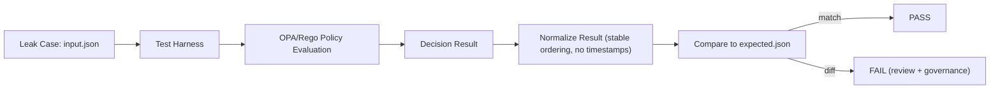

# leak_cases — Golden policy tests for leakage prevention


Golden regression cases that ensure **policy enforcement remains leak-safe** as OPA/Rego rules evolve.

> [!IMPORTANT]
> **Use synthetic fixtures only.** Never commit real PII, private addresses, culturally restricted locations, sensitive site coordinates, or secrets into this folder.

---

## Table of contents

- [Purpose](#purpose)
- [What counts as a leak](#what-counts-as-a-leak)
- [How golden leak cases work](#how-golden-leak-cases-work)
- [Directory layout](#directory-layout)
- [Case contract](#case-contract)
- [Running the suite](#running-the-suite)
- [Adding a new leak case](#adding-a-new-leak-case)
- [Updating goldens safely](#updating-goldens-safely)
- [Common failure modes](#common-failure-modes)
- [Governance and review rules](#governance-and-review-rules)
- [Glossary](#glossary)

---

## Purpose

This directory exists to prevent regressions where **restricted fields** (or restricted precision) accidentally appear in outputs when they should be denied, generalized, or redacted.

These tests support KFM’s core governance expectations:

- **Default-deny** policy posture (allow only when explicitly permitted).
- **Policy evaluation on every request** (data/story/AI output validation where applicable).
- “**No Source, No Answer**” / cite-or-abstain style guardrails for governed outputs.
- A stable **golden output** comparison so policy changes cannot silently weaken protections.

---

## What counts as a leak

A case is considered a “leak” if any of the following happen for a request context that should not receive sensitive information:

1. **Restricted fields appear**  
   Example: exact coordinates, unredacted personal identifiers, private site attributes, sensitive provenance fields, or restricted geometry.

2. **Over-precise geometry is returned**  
   Example: a sensitive record returns exact point geometry instead of generalized geometry or a coarse bounding region.

3. **Policy bypass / privilege escalation**  
   Example: a non-privileged actor gets an `allow=true` decision for a restricted dataset.

4. **Output validation allows unsafe answers** (when applicable)  
   Example: an AI/story response is marked allowed even though it lacks required citations or fails sensitivity checks.

> [!WARNING]
> **Leak cases should be minimal and deterministic.** If a case depends on timestamps, random IDs, network calls, or environment-specific ordering, it is not a good golden case.

---

## How golden leak cases work

Each leak case is a small, self-contained fixture:

- An **input** document representing the policy evaluation context (actor, resource, request).
- An **expected** output (“golden”) representing the correct policy decision and any redactions/obligations.

A test harness runs the policy against the input and compares the normalized result to the expected output.



---

## Directory layout

Recommended structure (one directory per case):

```text
policy/tests/golden/leak_cases/                 # “Never regress” leakage scenarios (highest bar: must deny/redact)
├─ README.md                                   # What a leak case is, how IDs work, and the update/review workflow
│
├─ LC-0001-precise-geometry-denied/            # Leak Case 0001: precise geometry must be denied (or forced to coarse)
│  ├─ input.json                               # Policy input payload (synthetic; deterministic)
│  ├─ expected.json                            # Expected decision/output (deny=true or redaction result + reasons)
│  └─ notes.md                                 # Human context: what incident/bug this prevents + acceptance criteria
│
├─ LC-0002-sensitive-field-redacted/           # Leak Case 0002: sensitive fields must be redacted (or denied if impossible)
│  ├─ input.json                               # Policy input payload (synthetic; deterministic)
│  ├─ expected.json                            # Expected redacted output + decision metadata (reasons, policy id)
│  └─ notes.md                                 # Human context: threat model + what changed when this was introduced
│
└─ …                                           # Additional LC-#### case folders (one scenario per folder; stable IDs)
```

| File | Required | Purpose |
|---|:---:|---|
| `input.json` | ✅ | Policy input payload for evaluation (what the system *would* send to OPA). |
| `expected.json` | ✅ | Golden output (what the policy *must* decide/return). |
| `notes.md` | ⛔️ (strongly recommended) | Human-readable rationale: what is being prevented, why it matters, and which rule(s) cover it. |

---

## Case contract

### Naming rules

- Case directory name format: `LC-####-short-kebab-name`
  - `####` is zero-padded (e.g., `0007`) to keep ordering stable.
  - `short-kebab-name` should describe the *leak being prevented* (not the implementation detail).

Examples:

- `LC-0007-precise-geometry-denied`
- `LC-0012-ai-output-denied-without-citations`
- `LC-0031-sensitive-record-must-generalize-geometry`

### `input.json` (policy input payload)

Use a stable shape aligned to your policy packages (typical patterns include `input.actor`, `input.resource`, and `input.request`).

Example (illustrative):

```json
{
  "actor": { "role": "viewer", "id": "user_synthetic_001" },
  "resource": {
    "kind": "dataset",
    "dataset_id": "ds_synthetic_sensitive_001",
    "sensitivity": "restricted"
  },
  "request": {
    "action": "read",
    "fields": ["geometry", "site_name", "notes"],
    "geometry_precision": "exact"
  }
}
```

### `expected.json` (golden decision)

At minimum, the golden output should be explicit about **allow/deny** and any **required redactions/obligations**.

Example (illustrative):

```json
{
  "allow": false,
  "deny_reason": [
    "resource_is_restricted",
    "actor_role_insufficient"
  ],
  "obligations": {
    "return_geometry": "none"
  }
}
```

If your policy returns a richer decision object, include it. The key is that the expected output is:

- **Deterministic** (no timestamps, UUIDs, machine-specific paths).
- **Minimal** (only what is needed to enforce the invariant).
- **Stable** (formatting and ordering normalized).

<details>
<summary>Recommended normalization rules (so goldens stay stable)</summary>

- Sort object keys (or serialize with a canonical JSON strategy).
- Sort arrays that are semantically sets (e.g., reason codes).
- Strip transient fields:
  - timestamps (`generated_at`, `now`, etc.)
  - random IDs
  - environment-dependent paths
- Prefer stable reason codes over full prose messages.

</details>

---

## Running the suite

This repository uses policy-as-code and expects policies to be testable via a CLI harness (commonly **Conftest + OPA/Rego**).

Typical options:

### Option A — Run via the repo’s policy test entrypoint

If the repo provides a wrapper script / Make target, use it (preferred, because it pins versions and normalization).

### Option B — Run Conftest directly (example)

From repo root:

```sh
conftest test policy/tests/golden/leak_cases -p policy
```

> If your policy uses Rego v1 defaults (or pins flags explicitly), keep a compatibility check in CI to prevent silent drift from toolchain changes.

---

## Adding a new leak case

Use this checklist to keep additions reviewable and consistent:

- [ ] Pick the next available ID: `LC-####`
- [ ] Create a new case folder under `leak_cases/`
- [ ] Add `input.json` representing the request context
- [ ] Add `expected.json` representing the correct decision
- [ ] Add `notes.md` explaining:
  - the leak being prevented
  - why it matters (risk)
  - the expected behavior (deny/redact/generalize)
  - policy module/rule references (as identifiers, not fragile line numbers)
- [ ] Ensure fixtures are **synthetic** and **non-sensitive**
- [ ] Run the suite locally and confirm the new case passes
- [ ] In your PR description: explain why this case belongs in `leak_cases` and what regression it prevents

---

## Updating goldens safely

Golden updates are governed changes because they can weaken (or strengthen) enforcement.

**Only update `expected.json` when:**

1. The policy behavior is intentionally changed (with rationale), **and**
2. A reviewer has validated the new behavior does not introduce leakage.

Suggested process:

1. Change policy code (or harness normalization) in a single PR.
2. Run tests; inspect diffs for each failing case.
3. For each case, answer in the PR:
   - *Why is the new decision correct?*
   - *Does this expand access or increase precision?*
4. Update goldens only after the above is documented.
5. Ensure CI passes and that case notes still reflect reality.

---

## Common failure modes

| Symptom | Likely cause | Fix |
|---|---|---|
| Goldens fail with noisy diffs | Non-deterministic fields included | Normalize output; remove transient fields |
| `allow` flips unexpectedly | Rule ordering / defaults changed | Re-check default-deny; add explicit tests |
| Precision leak (exact geometry returned) | Missing obligation/redaction enforcement | Add/strengthen geometry handling rules + test |
| Toolchain drift causes failures | Rego/OPA defaults changed | Pin versions/flags; add compatibility tests |
| A case requires real data to reproduce | Fixture too realistic / sensitive | Replace with synthetic minimal fixture |

---

## Governance and review rules

- Treat this directory as a **governed artifact**:
  - Changes can affect what information KFM is allowed to reveal.
- **Never** include real sensitive content in fixtures.
- Any change that expands access, precision, or fields should receive heightened review.
- Prefer adding a new case over deleting a failing one (deletions can hide regressions).

---

## Glossary

- **Golden test**: a test that compares current output to a stored expected output (“golden file”).
- **Leak case**: a test designed to ensure restricted information cannot appear in output.
- **Default-deny**: policy strategy where access is denied unless explicitly allowed.
- **Obligation**: a required post-condition (e.g., “generalize geometry”, “redact fields”) attached to an allow/deny decision.
- **Normalization**: making outputs deterministic so golden comparisons are meaningful.
