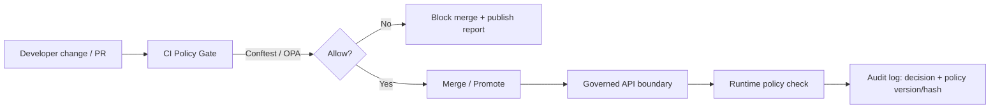

# Policy Tooling (policy/tools)


KFM’s governance is enforced through **policy-as-code**: machine-checkable rules that block unsafe promotion, unsafe exposure, and unsafe automation.  
This folder exists to make those policy checks **consistent, explainable, and reproducible** across:

- local developer workflows (pre-PR checks),
- CI merge gates,
- runtime services (API policy boundary),
- and audited operations.

---

## Read this first

> [!IMPORTANT]
> **Fail-closed is the default.**  
> If policy evaluation fails, can’t run, or can’t determine an answer, the correct behavior is to **block**.

> [!IMPORTANT]
> **Trust membrane rule (non-negotiable).**  
> Policy tooling must **never** bypass the governed API boundary (no direct DB access, no “just for testing” backdoors).  
> The tools in/for this folder operate on **artifacts + contracts** (JSON, manifests, receipts) and produce **decisions + reports**.

> [!WARNING]
> **No sensitive leakage in reports.**  
> Deny messages and CI logs must be written so they **do not** reveal restricted locations, private info, secrets, or culturally restricted details.  
> Prefer short, structural remediation hints (“missing field X”, “label Y required”) over echoing raw values.

---

## What lives here

This directory is intended for **policy support tools**, not the policies themselves.

Typical contents (recommended):
- **Wrappers / scripts** for running policy bundles locally in a deterministic way.
- **Formatting utilities** that turn OPA decisions into:
  - a human-readable CI summary, and/or
  - a machine-readable report for audit logging.
- **Pinned tool installers** (or checks) so CI and dev use the same versions.
- **Fixtures/templates** for common policy inputs (promotion manifests, receipts, catalog JSON).

> [!NOTE]
> The actual policy source files normally live in `policy/rego/`, and the unit tests + sample inputs live in `policy/tests/`.

---

## How policy gates fit in KFM



---

## Repository layout (expected)

Below is the *canonical* shape for policy-as-code in KFM repos. Adjust names as needed, but keep the separation of **rules**, **tests**, and **tooling**.

```text
policy/
  rego/                      # OPA/Rego rules (the “governance source of truth”)
    common/                  # shared helpers + common allowlists
    catalogs/                # STAC/DCAT/PROV required fields, invariants
    domains/                 # domain-specific QC rules (soils, hydrology, etc.)
    bundles.rego             # bundle assembly / entrypoints
  tests/                     # policy unit tests + sample inputs
    *_test.rego
    samples/
  tools/                     # THIS FOLDER: scripts + helpers for running policies consistently
    README.md
    (bin|scripts|fixtures)/  # optional subfolders for wrappers and examples
```

---

## Quickstart

### Prerequisites
- **OPA** (for policy compilation + unit tests)
- **Conftest** (for applying policies to real inputs in CI/dev)

> [!TIP]
> Pin tool versions in CI and in local tooling so policy behavior doesn’t drift across machines.

### Run policy unit tests (OPA native)
From repo root:

```bash
opa test policy -v
```

### Run policy checks on an input file (Conftest)
From repo root:

```bash
conftest test \
  --policy policy/rego \
  --input json \
  path/to/input.json
```

### Run policy checks on a directory (bulk validation)
```bash
conftest test \
  --policy policy/rego \
  --input json \
  data/
```

---

## Inputs and contracts this tooling should support

Policy gates are only as good as their **inputs**. KFM policy tools should standardize around a small set of input “contracts” (schemas) and keep them versioned.

Common input classes:

| Input class | What it represents | Typical use | Notes |
|---|---|---|---|
| Catalog JSON (STAC/DCAT/PROV) | Discovery + lineage metadata | Merge/promotion gates | Enforces required fields, allowed values, license presence, provenance links |
| Promotion manifest | A single “promotion decision” envelope | “Can this artifact be published / surfaced?” | Best place to unify: sensitivity, licensing, attestations, lane rules |
| Run receipt | A record of a pipeline run (inputs/outputs/checksums) | Auditability + evidence UX | Keep receipts minimal; redact; prefer digests over raw URLs |
| Attestation references | Pointers to signed supply-chain evidence | Promotion / compliance | Tooling should verify *references* without leaking secrets |

> [!IMPORTANT]
> Treat schemas as merge-blocking. If inputs can’t be validated, policy results are not trustworthy.

---

## Policy authoring guidelines (so gates stay explainable)

When adding or changing Rego policies:

1. **Write deny messages for humans**
   - Deny text should point to:
     - the missing/invalid field,
     - the violated constraint,
     - the minimum remediation step.
2. **Prefer structural checks**
   - Enforce typed fields/labels (e.g., `data_sensitivity`, `source_license`) instead of prose.
3. **Keep policies deterministic**
   - No time-dependent logic unless the input explicitly includes the time.
   - Avoid network access or external lookups inside policy evaluation.
4. **Unit test every policy**
   - Add at least:
     - one **ALLOW** case,
     - one **DENY** case,
     - one “edge” case (missing field / unexpected enum).

### Definition of Done (policy change)
- [ ] Rego compiles cleanly.
- [ ] Unit tests added/updated in `policy/tests/*_test.rego`.
- [ ] Sample inputs updated (or added) in `policy/tests/samples/`.
- [ ] Deny output is explainable and does not leak sensitive detail.
- [ ] CI policy gate passes locally and in PR checks.

---

## CI integration patterns

A policy gate typically:
1. Collects candidate inputs (catalog JSON, manifests, receipts),
2. Runs Conftest with the repo’s policy bundle,
3. Publishes a short report to the PR check output,
4. Blocks merge on any deny.

Example (illustrative) GitHub Actions step:

```yaml
- name: Policy gate (Conftest)
  run: |
    conftest test --policy policy/rego --input json data/
```

> [!WARNING]
> Add a **kill-switch** for emergencies (repo flag and/or CI secret) that can force gates to fail-closed instantly.
> Policy enforcement should never require “fast edits on main” during an incident.

---

## Operator-facing tools

Some tools are inherently dangerous (they can change production state, publish data, revoke access, etc.). If you add operator tooling that can affect production:

- Route actions through a **governed service boundary** (proxy or API)
- Require **policy authorization**
- Emit **audit logs** with policy decision + version metadata
- Provide a **breakglass** workflow for emergencies, with explicit audit trails

---

## Troubleshooting

### “Policy denies but I think it should allow”
- Read the deny reason carefully.
- Confirm you’re running the **pinned** tool versions.
- Validate the input against its schema (if applicable).
- Add (or update) a unit test that demonstrates the intended allow case.

### “Conftest says it can’t parse my file”
- Confirm `--input` is set correctly (`json`, `yaml`, etc.).
- Ensure your input is valid JSON/YAML.
- Prefer generating inputs from deterministic templates rather than hand-editing.

---

## Governance note

Changes under `policy/` are **production changes**.

Treat policy and policy-tool updates like code:
- review required,
- tests required,
- versioning required,
- and (where relevant) a governance record for why the rule changed.