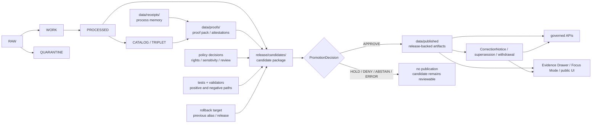

<!-- [KFM_META_BLOCK_V2]
doc_id: kfm://doc/NEEDS-VERIFICATION-release-readme
title: release
type: standard
version: v1
status: draft
owners: <TODO-OWNERS-NEEDS-VERIFICATION>
created: 2026-04-22
updated: 2026-04-22
policy_label: NEEDS_VERIFICATION
related: [
  ../README.md,
  ../docs/runbooks/release-evidence.md,
  ../docs/runbooks/promotion-gate.md,
  ../docs/runbooks/correction-rollback.md,
  ../contracts/README.md,
  ../schemas/README.md,
  ../policy/README.md,
  ../tests/README.md,
  ../tests/e2e/release_assembly/README.md,
  ../tests/e2e/correction/README.md,
  ../data/README.md,
  ../data/receipts/README.md,
  ../data/proofs/README.md,
  ../data/catalog/README.md,
  ../data/published/README.md,
  ../tools/attest/README.md,
  ../tools/validators/promotion_gate/README.md,
  ../.github/README.md,
  ../.github/workflows/README.md,
  ../.github/PULL_REQUEST_TEMPLATE.md
]
tags: [kfm, release, promotion, publication, proof-pack, rollback, correction]
notes: [
  "Target path requested by user: release/README.md.",
  "This README is doctrine-grounded but current mounted-repo implementation depth remains UNKNOWN in this session.",
  "doc_id, owners, policy_label, related path existence, and live release artifact inventory need verification in the real checkout.",
  "Directory tree and command snippets are inspection-first starter conventions, not claims that files currently exist."
]
[/KFM_META_BLOCK_V2] -->

<a id="top"></a>

# `release/`

Governed release coordination lane for KFM promotion candidates, release manifests, proof links, rollback posture, and correction-ready publication handoff.

> [!IMPORTANT]
> **Status:** experimental  
> **Document status:** draft  
> **Owners:** `<TODO-OWNERS-NEEDS-VERIFICATION>`  
> **Path:** `release/README.md`  
> **Repo fit:** root-level release lane downstream of [`../README.md`](../README.md), [`../contracts/README.md`](../contracts/README.md), [`../policy/README.md`](../policy/README.md), [`../tests/README.md`](../tests/README.md), [`../data/proofs/README.md`](../data/proofs/README.md), and [`../data/published/README.md`](../data/published/README.md). It is upstream of governed APIs, trust-visible UI surfaces, public-safe release inspection, and steward review handoff.  
> **Evidence posture:** doctrine-grounded · implementation depth **UNKNOWN** until a mounted checkout exposes the actual `release/` tree, emitted manifests, proof packs, workflow artifacts, branch settings, and rollback records.  
> **Role:** release-candidate coordination, release inventory, promotion decision handoff, rollback reference, and correction/supersession visibility.  
> **Not this lane:** canonical source data, raw/work/quarantine storage, schema authority, policy source, process receipt storage, proof-pack body storage, deployment secret custody, or hidden publish logic.  
>
> 
> 
> 
> 
> 
>   
>
> **Quick jump:** [Scope](#scope) · [Repo fit](#repo-fit) · [Accepted inputs](#accepted-inputs) · [Exclusions](#exclusions) · [Directory tree](#directory-tree) · [Quickstart](#quickstart) · [Usage](#usage) · [Diagram](#diagram) · [Operating tables](#operating-tables) · [Definition of done](#definition-of-done) · [FAQ](#faq) · [Appendix](#appendix)

> [!NOTE]
> `release/` is a coordination and evidence-handoff surface. It should make publication inspectable and reversible without turning release folders into the source of truth.

---

## Scope

`release/` exists to answer one operational question:

> **What exactly is proposed, approved, published, superseded, withdrawn, or rolled back — and what proof lets a reviewer trust that state?**

A release entry should make the following visible without forcing reviewers to reconstruct trust from scattered logs:

| Release burden | What this README expects |
|---|---|
| **Identity** | stable `release_id`, version scope, domain/lane scope, deterministic digest or `spec_hash` references |
| **Evidence** | `EvidenceRef` / `EvidenceBundle` links for consequential claims |
| **Validation** | schema, policy, catalog, proof, accessibility, and negative-path check summaries |
| **Rights and sensitivity** | rights posture, attribution posture, policy labels, redaction/generalization receipts where required |
| **Review** | promotion decision, reviewer notes, unresolved holds, denial reasons, or abstention reasons |
| **Publication** | `ReleaseManifest` or equivalent release inventory, published artifact refs, public-safe aliases, outward scope |
| **Correction readiness** | rollback target, previous release pointer, `CorrectionNotice` / supersession posture, withdrawal path |

Release is a **governed state transition**, not a file copy. A folder here may support a release decision, but the decision is only trustworthy when it links back to evidence, policy, validation, catalog closure, review state, and rollback/correction readiness.

[Back to top](#top)

---

## Repo fit

### Path and responsibility

| Question | Answer |
|---|---|
| **What is `release/` for?** | Release-candidate coordination, release manifests or manifest references, promotion decision records, rollback cards, correction/supersession references, and reviewer-facing release handoff. |
| **What is it not for?** | It is not the canonical home for schemas, policy bundles, raw data, unpublished work, process-memory receipts, hidden deploy scripts, secrets, or proof-pack bodies unless the repo later adopts that explicitly. |
| **What must it stay linked to?** | Evidence bundles, proof packs, catalog closure, receipts, policy decisions, tests, published artifact refs, rollback targets, correction notices, and reviewer decisions. |
| **What must stay separate?** | `data/receipts/` for process memory, `data/proofs/` for proof-pack assembly or archival, `data/published/` for release-backed outward artifacts, `contracts/` / `schemas/` for machine contracts, and `policy/` for executable policy. |

### Adjacent surfaces

| Relationship | Path | Why it matters | Status |
|---|---|---|---|
| Upstream orientation | [`../README.md`](../README.md) | Root doctrine should define KFM’s evidence-first, map-first, governed posture. | NEEDS VERIFICATION in mounted checkout |
| Contract authority | [`../contracts/README.md`](../contracts/README.md) and [`../schemas/README.md`](../schemas/README.md) | `ReleaseManifest`, `ReleaseProofPack`, `CorrectionNotice`, `DecisionEnvelope`, and runtime envelopes should be contract-governed before release text claims them. | NEEDS VERIFICATION |
| Policy authority | [`../policy/README.md`](../policy/README.md) | Release decisions must reflect deny-by-default policy, rights, sensitivity, and review gates. | NEEDS VERIFICATION |
| Verification authority | [`../tests/README.md`](../tests/README.md), `../tests/e2e/release_assembly/`, `../tests/e2e/correction/` | Release proof is incomplete unless positive and negative paths are testable. | NEEDS VERIFICATION |
| Process memory | [`../data/receipts/README.md`](../data/receipts/README.md) | Receipts explain what ran; they do not automatically prove public release readiness. | NEEDS VERIFICATION |
| Proof spine | [`../data/proofs/README.md`](../data/proofs/README.md) | Proof packs, attestations, and rollback/correction evidence should be referenced from release decisions. | NEEDS VERIFICATION |
| Catalog closure | [`../data/catalog/README.md`](../data/catalog/README.md) | Public release should close against catalog, lineage, and provenance records. | NEEDS VERIFICATION |
| Published scope | [`../data/published/README.md`](../data/published/README.md) | Published artifacts are downstream of release approval, not the release decision itself. | NEEDS VERIFICATION |
| Attestation helpers | [`../tools/attest/README.md`](../tools/attest/README.md) | Signing, digest, SBOM, and provenance helpers may produce release evidence. | NEEDS VERIFICATION |
| Promotion gate | [`../tools/validators/promotion_gate/README.md`](../tools/validators/promotion_gate/README.md) | Release must fail closed when evidence, policy, proof, or rollback conditions are incomplete. | NEEDS VERIFICATION |
| Gatehouse | [`../.github/README.md`](../.github/README.md), [`../.github/workflows/README.md`](../.github/workflows/README.md), [`../.github/PULL_REQUEST_TEMPLATE.md`](../.github/PULL_REQUEST_TEMPLATE.md) | Review, workflow evidence, PR templates, and platform settings shape what release docs may honestly claim. | NEEDS VERIFICATION |
| Downstream runtime | governed APIs, Evidence Drawer, Focus Mode, public-safe UI | Runtime surfaces should read release-linked trust state; they must not invent it. | PROPOSED |

[Back to top](#top)

---

## Accepted inputs

Content belongs under `release/` when it helps a reviewer or maintainer understand a release decision without weakening KFM’s evidence boundary.

| Accepted input | Why it belongs here | Typical source seam |
|---|---|---|
| Release candidate index | Gives reviewers a stable inventory of what is being considered. | pipeline output / candidate assembly |
| `ReleaseManifest` or release manifest reference | States what would leave, or has left, the system under a bounded release. | contract-governed manifest |
| `ReleaseProofPack` reference or proof-pack summary | Links validation, signatures, attestations, SBOM refs, policy decisions, and rollback readiness. | `data/proofs/`, `tools/attest/`, CI artifacts |
| Promotion decision record | Makes approval, denial, hold, abstention, or error state explicit. | promotion gate / reviewer decision |
| `DecisionEnvelope` / `PolicyDecision` summary | Preserves finite decision outcomes and policy reasons. | governed validator / policy gate |
| Catalog closure summary | Shows that release inventory, catalog entries, provenance, and artifact digests resolve coherently. | `data/catalog/`, validator reports |
| Rollback card or rollback reference | Identifies the previous safe release, alias state, and reversible path. | release assembly / ops handoff |
| `CorrectionNotice` / supersession reference | Keeps public correction lineage visible instead of silently replacing artifacts. | correction flow / steward review |
| Reviewer summary | Human-readable release notes that point to machine proof, not a substitute for proof. | PR review / release steward |
| Public-facing release notes | Explains outward changes, caveats, policy labels, and known limitations. | release handoff |
| Release inspection snapshots | Compact lists of release IDs, published aliases, supersession state, and stale/withdrawn state. | generated index |

### Input rules

1. Prefer **references with digests** over duplicated evidence bodies.
2. Prefer **machine-readable records** over narrative-only release notes.
3. Preserve **negative outcomes**: `DENY`, `ABSTAIN`, `ERROR`, `HOLD`, `WITHDRAWN`, and `SUPERSEDED` are release-relevant states.
4. Never hide an unresolved rights, sensitivity, provenance, or review gap behind polished release prose.
5. Do not create a public-facing release state that points to `RAW`, `WORK`, or `QUARANTINE`.

[Back to top](#top)

---

## Exclusions

The following do **not** belong in `release/` as their primary home:

| Does **not** belong here | Put it here instead | Why |
|---|---|---|
| Raw source files, downloads, unreconciled extracts | `../data/raw/` or repo-standard raw lifecycle path | Raw inputs are not release decisions. |
| Working candidates and unresolved transformations | `../data/work/` or repo-standard work lifecycle path | Work state must not masquerade as publishable scope. |
| Quarantined records | `../data/quarantine/` or repo-standard quarantine path | Quarantine is a denial/hold state, not a release asset. |
| Process receipts as the primary record | `../data/receipts/` | Receipts explain process memory; release references them. |
| Proof-pack bodies as the primary record | `../data/proofs/` | Proof should remain inspectable and reusable across release decisions. |
| Published artifacts as the primary record | `../data/published/` or configured artifact store | Release approval points to published artifacts; it does not replace artifact storage. |
| Canonical schemas, OpenAPI, vocabularies | `../contracts/` and/or `../schemas/` | Schema authority should not drift into release folders. |
| Policy source, Rego, role maps, obligation registries | `../policy/` | Release consumes policy decisions; it does not define policy. |
| Validator or attestation implementation code | `../tools/`, `../packages/`, `../scripts/`, or repo-standard implementation path | Release references outputs, not helper internals. |
| Deployment secrets, credentials, signing keys | external secret manager / repo security process | Release evidence may reference verification results, never expose secrets. |
| Long-form doctrine or operational playbooks | `../docs/` | Release should link doctrine and runbooks rather than duplicate them. |
| UI components or API handlers | `../apps/`, `../packages/`, or repo-standard app path | Runtime consumers read release state through governed interfaces. |

[Back to top](#top)

---

## Directory tree

> [!NOTE]
> The tree below is a **PROPOSED starter shape** for review. Do not treat it as current repo inventory until a mounted checkout confirms `release/` contents.

```text
release/
├── README.md
├── candidates/
│   └── <domain-or-lane>/
│       └── <release_id>/
│           ├── README.md
│           ├── manifest.ref.json
│           ├── proof-pack.ref.json
│           ├── decision.json
│           ├── catalog-closure.ref.json
│           ├── rollback.ref.json
│           └── reviewer-summary.md
├── manifests/
│   └── <release_id>.manifest.ref.json
├── decisions/
│   └── <release_id>.decision.json
├── rollback/
│   └── <release_id>.rollback.ref.json
├── corrections/
│   └── <correction_id>.notice.ref.json
└── notes/
    └── <release_id>.md
```

### Tree rules

| Rule | Reason |
|---|---|
| Keep release entries small and reference-heavy. | Prevents release folders from duplicating canonical proofs, catalogs, or artifacts. |
| Use stable IDs and digest-bearing refs where available. | Supports audit, rollback, and correction. |
| Keep candidates and published states visibly distinct. | Prevents review drafts from appearing as public release truth. |
| Keep rollback and correction near release decisions. | Makes reversibility visible during review, not after failure. |
| Update this README in the same PR that changes the release tree. | Keeps navigation and implementation from drifting. |

[Back to top](#top)

---

## Quickstart

Use these read-only commands before changing release path claims, file names, or release responsibilities.

```bash
# 0) Start at repo root when a real checkout is mounted.
git rev-parse --show-toplevel 2>/dev/null || pwd

# 1) Inspect the current release surface.
find release -maxdepth 5 -type f 2>/dev/null | sort

# 2) Inspect release-adjacent proof and publication surfaces.
for f in \
  README.md \
  docs/README.md \
  docs/runbooks/release-evidence.md \
  docs/runbooks/promotion-gate.md \
  docs/runbooks/correction-rollback.md \
  contracts/README.md \
  schemas/README.md \
  policy/README.md \
  tests/README.md \
  tests/e2e/release_assembly/README.md \
  tests/e2e/correction/README.md \
  data/receipts/README.md \
  data/proofs/README.md \
  data/catalog/README.md \
  data/published/README.md \
  tools/attest/README.md \
  tools/validators/promotion_gate/README.md \
  .github/README.md \
  .github/workflows/README.md \
  .github/PULL_REQUEST_TEMPLATE.md
do
  test -f "$f" && { echo "===== $f"; sed -n '1,220p' "$f"; } || true
done

# 3) Search for release object vocabulary before inventing new names.
grep -RIn \
  -e 'ReleaseManifest' \
  -e 'ReleaseProofPack' \
  -e 'ProofPack' \
  -e 'PromotionDecision' \
  -e 'DecisionEnvelope' \
  -e 'PolicyDecision' \
  -e 'CorrectionNotice' \
  -e 'rollback' \
  -e 'supersession' \
  -e 'withdrawal' \
  -e 'publish_receipt' \
  -e 'run_receipt' \
  -e 'spec_hash' \
  release data docs contracts schemas policy tests tools .github 2>/dev/null \
  | sed -n '1,260p'

# 4) Check whether workflows or release assembly tests emit proof objects.
find .github/workflows -maxdepth 2 -type f 2>/dev/null | sort
find tests/e2e/release_assembly tests/e2e/correction -maxdepth 4 -type f 2>/dev/null | sort

# 5) Confirm proof, correction, and rollback outputs are archived, not overwritten.
find data/proofs release -maxdepth 5 -type f 2>/dev/null \
  | grep -Ei 'proof|manifest|rollback|correction|supersession|withdrawal|decision' \
  | sort
```

If the mounted checkout proves a different release layout, revise this README in the same PR that changes the path.

[Back to top](#top)

---

## Usage

### 1. Assemble the candidate

A candidate should start as a bounded release proposal, not as a published fact. It should identify:

- the lane/domain being released;
- the `release_id` or repo-standard release key;
- the candidate artifact refs;
- the `spec_hash`, digest, or immutable version refs where available;
- the proof-pack and receipt refs needed to reconstruct the path;
- the policy and sensitivity state;
- the rollback target.

### 2. Link proof before approval

A release candidate should not be approved from a narrative summary alone. Link the proof objects and reports that support the candidate:

| Proof family | Release expectation |
|---|---|
| Evidence | Consequential claims resolve through `EvidenceRef` → `EvidenceBundle`. |
| Validation | Schema, geometry, temporal, source-role, policy, catalog, accessibility, and runtime checks are present or explicitly marked not applicable. |
| Policy | Rights, sensitivity, and review decisions are explicit. |
| Catalog | Catalog closure links release artifacts to lineage and provenance. |
| Attestation | Digest/signature/SBOM/provenance refs are present where the lane requires them. |
| Rollback | Previous release or safe alias target is identified before public promotion. |
| Correction | Supersession/withdrawal path is known before publication. |

### 3. Promote only after gates pass

Promotion should emit or link a decision record with a finite outcome:

| Outcome | Meaning | Release behavior |
|---|---|---|
| `APPROVE` | Candidate meets release gates. | May proceed to public-safe published state. |
| `HOLD` | Candidate is promising but blocked by unresolved evidence, rights, sensitivity, or review. | Do not publish; keep candidate reviewable. |
| `DENY` | Candidate violates a release gate. | Do not publish; record denial reason and rollback/no-op state. |
| `ABSTAIN` | System cannot make a release decision from available evidence. | No publication; request narrowed scope or missing evidence. |
| `ERROR` | Tooling, schema, policy, or runtime failure prevents trustworthy decision. | Fail closed; preserve logs/receipts for diagnosis. |

### 4. Publish without losing reversibility

When a candidate is approved, public-facing surfaces should use the governed published artifact or release-backed alias. The release record should still point to:

- what changed;
- why it was allowed;
- what proof exists;
- how to roll back;
- how to correct or withdraw;
- what public surfaces should show if the release becomes stale, superseded, or withdrawn.

### 5. Correct visibly

Do not silently overwrite a release. Use correction, supersession, withdrawal, or rollback state so downstream APIs, Evidence Drawer, Focus Mode, and release inspection views can show the public trust status.

[Back to top](#top)

---

## Diagram



[Back to top](#top)

---

## Operating tables

### Truth path and release contract

| Gate | Minimum release proof | Fail-closed behavior |
|---|---|---|
| Identity and versioning | stable `release_id`, immutable refs, digest / `spec_hash` where applicable | block on missing, duplicated, or unstable identity |
| Source and evidence | source role, EvidenceRefs, EvidenceBundle closure for consequential claims | abstain or deny unsupported claims |
| Rights and license | rights snapshot, attribution basis, redistribution posture | hold or quarantine when rights are unclear |
| Sensitivity and public safety | policy label, obligations, generalization/redaction receipts where required | restrict, generalize, or block release |
| Schema and QA | schema validity, spatial/time/unit/domain checks | route failures to work/quarantine; no publish |
| Catalog closure | catalog, lineage, provenance, digest, and release linkage resolve coherently | block if metadata and lineage do not close |
| Receipts and proof | run receipts, proof pack refs, validation reports, attestation refs where applicable | block if required proof is absent or malformed |
| Review and promotion | reviewer decision, role, time, unresolved holds, finite outcome | no approval without explicit review state |
| Release and correction readiness | manifest, rollback card, correction/supersession/withdrawal path | block promotion until public scope is inspectable and reversible |

### Canonical vs release-facing vs rebuildable

| Class | Examples | Release rule |
|---|---|---|
| Canonical / authoritative | source records after governed lifecycle, processed records, catalog closure, review decisions | Reference by stable ID or digest; do not duplicate casually. |
| Release-facing coordination | candidate folder, manifest refs, decision records, rollback card, release notes | Keep compact, inspectable, and linked to proof. |
| Process memory | fetch/normalize/validate/build receipts | Reference when needed; store in receipt path. |
| Proof spine | proof packs, attestations, validation summaries, SBOM/provenance refs | Reference from release; proof body belongs in proof path unless repo policy says otherwise. |
| Published outward scope | PMTiles, GeoParquet, COG, API aliases, public-safe derived artifacts | Publish only after approval; keep release link visible. |
| Rebuildable / derived | tiles, search indexes, graph projections, caches, summaries, scenes, embeddings | Rebuild from released or canonical sources; never treat as sovereign truth. |

### Release states

| State | Meaning | Public surface behavior |
|---|---|---|
| `candidate` | Assembled for review, not approved. | Not public unless explicitly marked as review-only. |
| `hold` | Blocked by missing evidence, rights, policy, sensitivity, or review. | Do not publish. |
| `denied` | Fails a release gate. | Preserve denial reason; no public alias change. |
| `approved` | Release gate passed. | May publish through governed path. |
| `published` | Release-backed public-safe artifact or alias exists. | APIs/UI may expose public-safe state with proof links. |
| `superseded` | Replaced by a newer release. | Show stale/superseded state, not silent replacement. |
| `withdrawn` | Removed from public trust scope. | Show withdrawal/correction notice where appropriate. |
| `rolled_back` | Alias or public scope restored to a previous safe release. | Preserve rollback reason and target. |

[Back to top](#top)

---

## Definition of done

A release candidate is not ready for public or semi-public promotion until the checklist below is complete or an explicit `HOLD` / `DENY` / `ABSTAIN` reason is recorded.

- [ ] `release_id` or repo-standard release key is stable and unique.
- [ ] Candidate scope is bounded by lane/domain, geography, time, and public surface.
- [ ] Candidate does not point public release state to `RAW`, `WORK`, or `QUARANTINE`.
- [ ] `ReleaseManifest` or equivalent manifest reference exists.
- [ ] `ReleaseProofPack` or equivalent proof-pack reference exists, or absence is explicitly justified.
- [ ] EvidenceRefs resolve to EvidenceBundles for consequential claims.
- [ ] Source roles are sufficient for the claims being released.
- [ ] Rights, license, attribution, and redistribution posture are explicit.
- [ ] Sensitivity and geoprivacy decisions are explicit.
- [ ] Redaction/generalization transform receipts exist where public detail was reduced.
- [ ] Schema, policy, catalog, proof, and public-safety validators pass or fail closed.
- [ ] Catalog closure resolves across release inventory, catalog entries, provenance, and artifact digests.
- [ ] Rollback target is identified before publication.
- [ ] Correction/supersession/withdrawal path is identified before publication.
- [ ] Reviewer decision uses a finite outcome and records unresolved holds.
- [ ] Public release notes are consistent with machine-readable release state.
- [ ] Downstream API/UI consumers can show release, correction, stale, or withdrawn state without inventing proof.
- [ ] README links, relative paths, and artifact references were checked in the mounted checkout.

[Back to top](#top)

---

## FAQ

### Is `release/` the same as `data/published/`?

No. `release/` coordinates release decisions and release evidence. `data/published/` or the configured artifact store holds outward public-safe release-backed artifacts.

### Can a release candidate include proof files?

It may include compact summaries or references. Do not duplicate proof-pack bodies into `release/` unless the repo adopts that intentionally and documents the tradeoff.

### Can a green CI run publish automatically?

Not by itself. A green run can support promotion, but KFM release requires evidence, policy, catalog closure, review state, rollback readiness, and correction posture.

### What happens when rights or sensitivity are unclear?

The release should fail closed: `HOLD`, `DENY`, or `ABSTAIN`, depending on the evidence. Public release should not proceed until the issue is resolved or the output is restricted/generalized appropriately.

### What should Focus Mode or the Evidence Drawer read?

They should read governed release-linked state through governed APIs or release-backed artifacts. They should not read raw release candidates, raw model outputs, or unpublished work.

[Back to top](#top)

---

## Appendix

<details>
<summary>Illustrative minimal release candidate card — PROPOSED / not a schema</summary>

The example below is intentionally illustrative. Use the repo’s contract schema once verified.

```json
{
  "release_id": "<repo-standard-release-id>",
  "status": "candidate",
  "lane": "<domain-or-lane>",
  "scope": {
    "geography": "<bounded geography>",
    "time": "<bounded time or version>",
    "public_surface": ["api", "map", "export"]
  },
  "manifest_ref": {
    "path": "release/manifests/<release_id>.manifest.ref.json",
    "digest": "<sha256-or-repo-standard-digest>"
  },
  "proof_pack_ref": {
    "path": "data/proofs/<lane>/<release_id>/proof-pack.json",
    "digest": "<sha256-or-repo-standard-digest>"
  },
  "catalog_closure_ref": {
    "path": "data/catalog/<lane>/<release_id>/catalog-closure.json",
    "digest": "<sha256-or-repo-standard-digest>"
  },
  "policy_decision": {
    "outcome": "HOLD",
    "reasons": ["NEEDS_VERIFICATION:rights", "NEEDS_VERIFICATION:rollback-target"]
  },
  "rollback_ref": {
    "previous_release_id": "<previous-safe-release-id>",
    "path": "release/rollback/<release_id>.rollback.ref.json"
  },
  "correction_posture": {
    "required": true,
    "notice_ref": "release/corrections/<correction_id>.notice.ref.json"
  }
}
```

</details>

<details>
<summary>Proposed release naming guidance — NEEDS VERIFICATION</summary>

Prefer names that are stable, boring, and reviewable:

- Use the existing repo convention first.
- Include lane/domain and release identity without exposing sensitive content.
- Do not encode secrets, credentials, private steward names, or unpublished sensitive locations.
- Avoid names that imply approval before approval exists.
- Avoid names that collapse candidate, published, superseded, and withdrawn states.

Candidate examples:

```text
release/candidates/<lane>/<release_id>/
release/manifests/<release_id>.manifest.ref.json
release/decisions/<release_id>.decision.json
release/rollback/<release_id>.rollback.ref.json
release/corrections/<correction_id>.notice.ref.json
```

</details>

<details>
<summary>Maintainer pre-publish checklist for this README</summary>

- [ ] Replace `doc_id` placeholder with the repo-approved document ID.
- [ ] Replace owner placeholder with verified `release/` owner or CODEOWNERS-backed owner.
- [ ] Confirm `policy_label`.
- [ ] Confirm `release/` directory contents in mounted checkout.
- [ ] Confirm whether `release/` stores manifests, manifest refs, or both.
- [ ] Confirm whether proof-pack bodies live in `data/proofs/`, `release/`, artifact storage, or another approved home.
- [ ] Confirm workflow emitters and required checks before claiming automation.
- [ ] Confirm release object schemas and update links to exact contracts.
- [ ] Confirm `tests/e2e/release_assembly/` and `tests/e2e/correction/` executable depth.
- [ ] Link the release-evidence, promotion-gate, and correction/rollback runbooks once verified.
- [ ] Run link checks after the real checkout is mounted.

</details>

[Back to top](#top)
