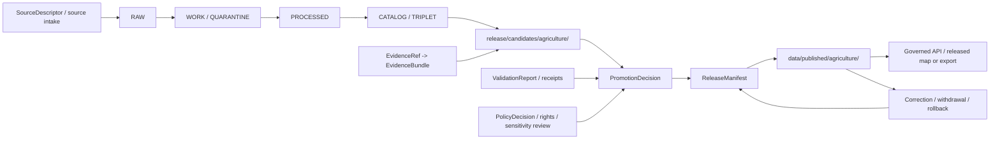

<!-- [KFM_META_BLOCK_V2]
doc_id: kfm://doc/release-agriculture-readme
title: release/agriculture/ — Agriculture Release Governance Index
type: per-domain-release-governance-readme
version: v2
status: draft
contract_version: "3.0.0"
owners:
  - bartytime4life
created: 2026-07-03
updated: 2026-07-18
policy_label: public
truth_posture: cite-or-abstain
responsibility_root: release/
path_posture: existing-domain-index-and-router; not-a-parallel-release-record-home
related:
  - ../README.md
  - ../candidates/agriculture/README.md
  - ../candidates/agriculture/county_year_panel_v0/README.md
  - ../manifests/agriculture/README.md
  - ../promotion_decisions/README.md
  - ../correction_notices/README.md
  - ../rollback_cards/README.md
  - ../withdrawal_notices/README.md
  - ../changelog/README.md
  - ../../data/processed/agriculture/README.md
  - ../../data/published/agriculture/README.md
  - ../../data/registry/sources/agriculture/README.md
  - ../../docs/domains/agriculture/DOMAIN.md
  - ../../docs/domains/agriculture/CANONICAL_PATHS.md
  - ../../docs/domains/agriculture/POLICY.md
  - ../../docs/runbooks/agriculture/ROLLBACK_RUNBOOK.md
  - ../../docs/doctrine/directory-rules.md
  - ../../docs/adr/ADR-0001-schema-home--schemas-contracts-v1-is-canonical.md
  - ../../docs/registers/DRIFT_REGISTER.md
  - ../../.github/CODEOWNERS
  - ../../.github/workflows/domain-agriculture.yml
  - ../../.github/workflows/release-dry-run.yml
tags:
  - kfm
  - release
  - agriculture
  - candidates
  - manifests
  - promotion
  - correction
  - rollback
  - withdrawal
  - evidence
  - policy
  - public-safe
notes:
  - "This README is the Agriculture release-governance index and authority router. It is not a ReleaseManifest, PromotionDecision, CorrectionNotice, RollbackCard, WithdrawalNotice, release approval, or published artifact."
  - "CODEOWNERS routes /release/ review to @bartytime4life. That route is not proof of stewardship assignment, independent review, release approval, or publication authority."
  - "The repository currently carries unresolved manifest, correction, and rollback-lane naming/semantics drift. This README preserves the conflict and does not decide it."
  - "No concrete Agriculture release approval or released artifact was established by the bounded evidence inspection for this revision."
[/KFM_META_BLOCK_V2] -->

<a id="top"></a>

# `release/agriculture/` — Agriculture Release Governance Index

> Route Agriculture release work to the correct shared release lane, preserve source/evidence/policy/validation closure, and prevent this directory from becoming a parallel home for manifests, decisions, notices, rollback records, or published data.


> [!IMPORTANT]
> **Safe conclusion from the inspected repository state:** this path is best treated as an Agriculture-specific release **index and router**, not as a separate release-record authority. The inspected candidate `county_year_panel_v0` remains `PROPOSED` and `BLOCKED_FOR_EVIDENCE_AND_VALIDATION`; the inspected plural Agriculture manifest lane remains draft; and no inspected record proves an Agriculture release is approved or published.
>
> This conclusion is bounded. Other unindexed records, runtime behavior, branch-protection settings, or external publication state remain **UNKNOWN** unless separately verified.

---

## Quick navigation

- [Purpose](#purpose)
- [Status and evidence boundary](#status-and-evidence-boundary)
- [Placement and authority](#placement-and-authority)
- [Current repository snapshot](#current-repository-snapshot)
- [Release authority routing](#release-authority-routing)
- [What belongs here](#what-belongs-here)
- [What does not belong here](#what-does-not-belong-here)
- [Agriculture bounded context](#agriculture-bounded-context)
- [Rights, sensitivity, and source-role controls](#rights-sensitivity-and-source-role-controls)
- [Lifecycle and trust chain](#lifecycle-and-trust-chain)
- [Finite outcomes](#finite-outcomes)
- [Minimum release-support contract](#minimum-release-support-contract)
- [Candidate and manifest posture](#candidate-and-manifest-posture)
- [Validation](#validation)
- [Review and separation of duties](#review-and-separation-of-duties)
- [Automation posture](#automation-posture)
- [Correction, withdrawal, and rollback](#correction-withdrawal-and-rollback)
- [Maintenance and definition of done](#maintenance-and-definition-of-done)
- [Evidence ledger](#evidence-ledger)
- [Open verification](#open-verification)
- [Changelog](#changelog)
- [Rollback for this README](#rollback-for-this-readme)

---

## Purpose

`release/agriculture/` provides an Agriculture-specific orientation surface inside the `release/` responsibility root.

It should help maintainers and reviewers answer:

1. Which release lane owns the record being prepared?
2. What Agriculture candidate, artifact family, geography, time slice, or public surface is affected?
3. Which source, evidence, validation, rights, sensitivity, policy, review, correction, and rollback records support the proposed release action?
4. Which finite outcome currently applies?
5. What remains unresolved before a governed release decision can occur?

This README does **not** approve a candidate, create a manifest, authorize promotion, publish an artifact, correct a claim, withdraw a release, execute rollback, or replace any record in the shared release lanes.

The lifecycle law remains:

```text
RAW -> WORK / QUARANTINE -> PROCESSED -> CATALOG / TRIPLET -> PUBLISHED
```

Promotion is a governed state transition, not a file move, commit, pull request, merge, changelog entry, or README update.

[Back to top](#top)

---

## Status and evidence boundary

| Field | Current posture |
|---|---|
| Document type | Per-domain release-governance index and authority router |
| Owning root | `release/` |
| Domain segment | `agriculture` |
| Repository snapshot used for this revision | `main` at the immutable base recorded in the implementing pull request |
| Current path | **CONFIRMED** existing path and README |
| Current path role | **PROPOSED** index/router interpretation derived from current shared release lanes, Directory Rules, and the absence of a verified Agriculture record family assigned directly here |
| Release implementation maturity | **UNKNOWN** beyond the exact records and README surfaces inspected |
| Current inspected candidate | **CONFIRMED file / PROPOSED candidate** — `county_year_panel_v0` |
| Current inspected candidate decision | `BLOCKED_FOR_EVIDENCE_AND_VALIDATION` |
| Inspected Agriculture manifest lane | **CONFIRMED file / draft lane** — `release/manifests/agriculture/` |
| Verified GitHub review route | `/release/ @bartytime4life` in `CODEOWNERS` |
| Stewardship and independent approval | **NEEDS VERIFICATION**; CODEOWNERS routing is not a stewardship assignment or release decision |
| Public or release effect of this README | None |
| Default posture | Hold, narrow, deny, abstain, or report an error rather than infer release readiness |

### Truth labels

| Label | Meaning in this README |
|---|---|
| `CONFIRMED` | Verified from the cited repository path, blob/ref, or generated remote artifact in this work session |
| `PROPOSED` | A documentation interpretation, future contract, routing rule, or implementation direction not yet accepted or proven in runtime |
| `UNKNOWN` | Not established by the bounded inspection |
| `NEEDS VERIFICATION` | Checkable, but not checked strongly enough to act as fact |

Runtime and release outcomes such as `PROMOTE_TO_MANIFEST`, `HOLD_FOR_EVIDENCE`, `DENY`, `ABSTAIN`, and `ERROR` are operational states, not substitutes for these authoring labels.

[Back to top](#top)

---

## Placement and authority

Directory Rules separate release decisions from published artifacts:

| Responsibility | Owning home |
|---|---|
| Release candidates, manifests, promotion decisions, rollback/correction/withdrawal records, signatures, and release changelog | `release/` |
| Released public-safe Agriculture carriers | `data/published/agriculture/` |
| Processed but unreleased Agriculture material | `data/processed/agriculture/` |
| Agriculture source-admission and source-role records | `data/registry/sources/agriculture/` |
| Evidence and proof support | `data/proofs/` and accepted child lanes |
| Process memory and generated-work provenance | `data/receipts/` |
| Semantic meaning | `contracts/` |
| Machine-checkable shape | `schemas/` |
| Admissibility, rights, sensitivity, access, and release policy | `policy/` |
| Validators and executable proof | `tools/validators/`, `tests/`, and fixtures |

### Why this path remains

`release/agriculture/` already exists under the correct responsibility root. This revision does not move or rename it.

The repository also has shared, record-type-specific release lanes. To avoid parallel authority, this directory should:

- index Agriculture release work;
- route records to their owning shared lanes;
- explain Agriculture-specific review burdens;
- identify current blockers and open verification;
- avoid storing record types already owned elsewhere; and
- remain reversible if a future accepted ADR assigns a different role.

### Unresolved placement conflicts

The repository currently exposes unresolved release topology:

- singular and plural manifest lanes;
- singular and plural correction lanes;
- multiple rollback/review-card surfaces;
- a draft Agriculture manifest sublane even though Agriculture canonical-path guidance proposes unsegmented shared manifests;
- multiple Directory Rules copies and location claims; and
- a proposed, not accepted, schema-home ADR.

This README does not decide those conflicts. A future path move, authority reassignment, lane consolidation, or parallel-home retirement requires the applicable ADR and migration discipline.

[Back to top](#top)

---

## Current repository snapshot

| Surface | Inspected observation | Status |
|---|---|---|
| [`release/README.md`](../README.md) | Defines `release/` as the release-governance root and distinguishes it from `data/published/` | `CONFIRMED file / draft guidance` |
| This path | Existing README under `release/agriculture/` | `CONFIRMED` |
| [`release/candidates/agriculture/`](../candidates/agriculture/README.md) | Agriculture pre-publication candidate lane | `CONFIRMED file / draft guidance` |
| [`county_year_panel_v0`](../candidates/agriculture/county_year_panel_v0/README.md) | Candidate shell; artifact, source, evidence, policy, validation, manifest, correction, and rollback pointers unresolved | `CONFIRMED file / PROPOSED candidate` |
| [`release/manifests/agriculture/`](../manifests/agriculture/README.md) | Draft Agriculture sublane under the plural manifest collection | `CONFIRMED file / canonicality NEEDS VERIFICATION` |
| [`release/promotion_decisions/`](../promotion_decisions/README.md) | Shared promotion-decision lane; only a hydrology sublane is indexed by its parent README | `CONFIRMED file / Agriculture sublane UNKNOWN` |
| [`release/correction_notices/`](../correction_notices/README.md) | Shared correction-notice communication lane | `CONFIRMED file / Agriculture sublane UNKNOWN` |
| [`release/rollback_cards/`](../rollback_cards/README.md) | Existing parent currently describes compact release review cards | `CONFIRMED file / rollback semantics CONFLICTED` |
| [`release/withdrawal_notices/`](../withdrawal_notices/README.md) | Shared withdrawal-notice communication lane | `CONFIRMED file / Agriculture sublane UNKNOWN` |
| [`release/changelog/`](../changelog/README.md) | Human-readable release-history lane | `CONFIRMED file / Agriculture entries UNKNOWN` |
| [`data/processed/agriculture/`](../../data/processed/agriculture/README.md) | Processed-stage README; not a public or release surface | `CONFIRMED file / child artifact inventory UNKNOWN` |
| [`data/published/agriculture/`](../../data/published/agriculture/README.md) | Published Agriculture carrier lane; README explicitly says path presence does not prove release wiring | `CONFIRMED file / emitted artifacts UNKNOWN` |
| [`data/registry/sources/agriculture/`](../../data/registry/sources/agriculture/README.md) | Source-registry control lane with no-public-path and fail-closed posture | `CONFIRMED file / concrete descriptors UNKNOWN` |
| [`CODEOWNERS`](../../.github/CODEOWNERS) | Routes `/release/` review to `@bartytime4life` | `CONFIRMED routing / enforcement NEEDS VERIFICATION` |
| Agriculture and release workflows | Ordinary PR-triggered TODO-only scaffolds | `CONFIRMED files / no substantive proof` |

### Safe repository-state conclusion

The inspected files establish documentation and lane scaffolding. They do not establish:

- a released Agriculture artifact;
- an approved Agriculture ReleaseManifest;
- an Agriculture PromotionDecision;
- a completed Agriculture rollback;
- a public Agriculture API, map layer, export, or Focus Mode release;
- complete source, evidence, rights, policy, validation, review, correction, or rollback closure; or
- branch-protection enforcement.

[Back to top](#top)

---

## Release authority routing

Use the narrowest verified lane that owns the record type.

| Release concern | Current route | Authority boundary |
|---|---|---|
| Agriculture candidate dossier | [`release/candidates/agriculture/`](../candidates/agriculture/README.md) | Pre-publication review only; candidate is not a release |
| Agriculture candidate instance | [`release/candidates/agriculture/<candidate>/`](../candidates/agriculture/county_year_panel_v0/README.md) | Holds candidate-specific readiness and decision history; no payload copies |
| Agriculture manifest | [`release/manifests/agriculture/`](../manifests/agriculture/README.md) for the current draft sublane | Singular/plural and domain-segmentation conventions remain `NEEDS VERIFICATION` |
| Promotion decision | [`release/promotion_decisions/`](../promotion_decisions/README.md) | Decision record may authorize manifest preparation; it does not publish by itself |
| Correction notice | [`release/correction_notices/`](../correction_notices/README.md) | Communication record; does not alter release state by prose alone |
| Rollback or review card | [`release/rollback_cards/`](../rollback_cards/README.md) | Existing lane semantics are conflicted; require governed decision, manifest, evidence, and review support |
| Withdrawal notice | [`release/withdrawal_notices/`](../withdrawal_notices/README.md) | Communication record; requires a governing decision |
| Release changelog entry | [`release/changelog/`](../changelog/README.md) | Narrative index; never sovereign release truth |
| Published Agriculture artifact | [`data/published/agriculture/`](../../data/published/agriculture/README.md) | Released public-safe carrier only; not decision authority |
| Data-plane revert receipt | `data/rollback/agriculture/<release_id>/` per current Agriculture path guidance | Path and runtime behavior remain `NEEDS VERIFICATION` |
| Agriculture release orientation | `release/agriculture/` | This README and future pointer-only indexes; not a duplicate record home |

> [!CAUTION]
> Do not create an Agriculture-specific manifest, promotion decision, correction, withdrawal, or rollback record directly under `release/agriculture/` merely for convenience. Use the owning shared lane unless an accepted decision explicitly assigns a record family here.

[Back to top](#top)

---

## What belongs here

Accepted contents are intentionally narrow:

- this README;
- pointer-only indexes to Agriculture release candidates, manifests, decisions, notices, changelog entries, and public artifact targets;
- Agriculture-specific release review guidance that does not duplicate canonical contracts, schemas, policy, validators, or runbooks;
- bounded repository-status notes with immutable evidence references;
- migration or deprecation notes if an accepted ADR changes this path's role; and
- a local changelog for this README's documentation revisions.

A future machine-readable index may live here only after its meaning, schema, validator, source of truth, update process, and rollback behavior are accepted and tested.

[Back to top](#top)

---

## What does not belong here

Do not store the following under `release/agriculture/`:

- RAW, WORK, QUARANTINE, PROCESSED, CATALOG, TRIPLET, or PUBLISHED payloads;
- source data, datasets, tables, imagery, rasters, vectors, GeoParquet, COG, PMTiles, API dumps, or map-ready artifacts;
- candidate payload copies;
- ReleaseManifest records already owned by a manifest lane;
- PromotionDecision or PromotionReceipt records already owned by promotion-decision lanes;
- CorrectionNotice, WithdrawalNotice, RollbackCard, signature, or changelog records already owned by shared release lanes;
- source descriptors or source-intake records;
- EvidenceBundle, EvidenceRef, ProofPack, validation reports, or citation-validation records;
- semantic contracts or machine schemas;
- executable policy;
- validator, pipeline, connector, watcher, API, UI, or runtime code;
- credentials, tokens, private endpoints, exact sensitive locations, private farm/operator/parcel details, restricted source payloads, or confidential business data;
- generated prose presented as evidence, approval, or publication authority; or
- a silent shortcut from candidate or processed material to public release.

[Back to top](#top)

---

## Agriculture bounded context

The Agriculture domain governs the meaning of crop, field-candidate, rotation, yield, irrigation-context, conservation-context, suitability, stress, agriculture-economy, supply-chain, and aggregation objects.

The release lane does not redefine those meanings.

### Explicit non-ownership

| Concern | Owning lane | Release obligation |
|---|---|---|
| Soil map units, horizons, pedons, and soil-property truth | Soil | Preserve source and EvidenceBundle references; do not relabel as Agriculture-owned truth |
| Streamflow, groundwater, flood, and hydrology observations | Hydrology | Preserve hydrology source role, valid time, and correction lineage |
| Weather, climate, smoke, and air observations | Atmosphere / Air | Preserve observed versus modeled distinctions |
| Hazard events and official warning context | Hazards / official authorities | Do not turn Agriculture release material into alert or emergency authority |
| Parcels, ownership, title, living-person, operator, tenant, or worker identity | People / DNA / Land and privacy policy | Fail closed; do not publish person-parcel or operator-resolved joins |
| Habitat, rare species, rare plants, archaeology, sacred/burial places, or sensitive infrastructure | Owning domain and sensitivity policy | Require the most restrictive applicable public-safe transform and review |
| Regulatory status or compliance | Source authority and policy | Do not infer or extend beyond the registered source role |

Cross-lane references must preserve the owning domain's identity, evidence, source role, time semantics, policy posture, and correction lineage.

[Back to top](#top)

---

## Rights, sensitivity, and source-role controls

Agriculture release review must account for privacy, commercial harm, operational exposure, source limitations, and false precision.

### Default posture

Field-level or operator-resolved Agriculture material defaults to:

```text
DENY exact public exposure
  -> GENERALIZE or REDACT
  -> REQUIRE rights and sensitivity review
  -> REQUIRE AggregationReceipt or RedactionReceipt where applicable
  -> REQUIRE release and rollback support
```

### Risk controls

| Risk | Required release posture |
|---|---|
| Farm, ranch, operator, tenant, worker, or landowner identity | Restricted by default; require explicit lawful/rights basis, minimization, review, and release authority |
| Field, parcel, facility, storage, chemical, livestock, irrigation, equipment, or logistics detail | Avoid exact public exposure unless already public, rights-cleared, sensitivity-cleared, evidence-supported, and release-approved |
| Private yield, production, market, or business-sensitive detail | Aggregate or deny; do not reconstruct suppressed or confidential values |
| Compliance, inspection, disease, pest, contamination, animal-health, or pesticide records | Require source authority, effective time, rights, policy, sensitivity, and materiality review |
| Classified imagery or remote-sensing inference | Preserve `modeled` or derived role, model/run identity, uncertainty, resolution, and validation state |
| County, district, watershed, grid, or survey aggregates | Keep aggregation unit, suppression, vintage, revision, and uncertainty visible; never downscale into field or operator truth |
| Crop-year or seasonal claim | Preserve observed, valid, source, retrieval, release, and correction times where material |
| Cross-domain join | Apply both lanes' constraints; the most restrictive applicable policy wins |
| Historic record | Preserve source vintage, georeference uncertainty, transcription limits, and rights posture |
| Rights or source terms unclear | Hold or deny release; do not infer permission from public accessibility |

### Source-role anti-collapse

Promotion does not strengthen a source role.

- `modeled` remains modeled;
- `aggregate` remains aggregate;
- `administrative` remains administrative;
- `candidate` cannot become public truth without review and evidence closure;
- `context` cannot independently prove a consequential claim;
- `restricted` does not become public because a derivative was generated; and
- `synthetic` requires an explicit reality boundary and cannot be mixed with observed evidence.

[Back to top](#top)

---

## Lifecycle and trust chain

A governed Agriculture release should be reconstructable as a chain of pointers:



### Trust rules

1. A connector or watcher must not publish.
2. Processed data is not public merely because it validates.
3. Catalog or triplet presence is not release approval.
4. A candidate is not a release.
5. A PromotionDecision does not make a payload public without manifest and release closure.
6. A manifest is not the payload.
7. A published artifact remains downstream of evidence, policy, review, correction, and rollback.
8. Public clients use governed interfaces and released artifacts, not candidate or internal stores.
9. AI may explain released evidence; it may not decide truth, rights, sensitivity, or release.
10. Correction and rollback create new governed records; they do not silently overwrite history.

[Back to top](#top)

---

## Finite outcomes

Use finite outcomes rather than ambiguous prose.

| Outcome | Meaning for Agriculture release work |
|---|---|
| `PROMOTE_TO_MANIFEST` | Candidate may proceed to manifest preparation; public release is not yet implied |
| `HOLD_FOR_SOURCE` | Source identity, role, rights, terms, cadence, or source-head state is unresolved |
| `HOLD_FOR_EVIDENCE` | EvidenceRef/EvidenceBundle closure is incomplete, stale, conflicted, or revoked |
| `HOLD_FOR_VALIDATION` | Schema, contract, geometry, temporal, quality, citation, aggregation, redaction, or integrity validation is incomplete |
| `HOLD_FOR_POLICY` | Rights, sensitivity, access, audience, public-safe transform, or review obligations are unresolved |
| `GENERALIZATION_REQUIRED` | A less precise public representation is required |
| `REDACTION_REQUIRED` | Fields or geometry require irreversible public-safe redaction with receipt |
| `REPAIR_REQUIRED` | Candidate or release-support records must be corrected before proceeding |
| `ABSTAIN` | A consequential claim cannot be supported within the requested scope |
| `DENY` | Policy, rights, sensitivity, or release state prohibits the requested exposure |
| `ERROR` | Operational or contract failure prevents a reliable decision |
| `NO_ACTION` | Review authorizes no release-state change |
| `WITHDRAW` | Current public use must stop through governed withdrawal |
| `SUPERSEDE` | A new governed release replaces the prior release while preserving lineage |

Outcome vocabulary must align with the owning record contract. This table is a cross-lane reading aid, not a replacement for machine schemas or executable policy.

[Back to top](#top)

---

## Minimum release-support contract

Before an Agriculture release may be treated as ready, the release chain should answer every row below.

| Support area | Minimum evidence | Fail-closed result when unresolved |
|---|---|---|
| Release identity | Stable release/candidate/manifest/decision IDs and version | `ERROR` or `HOLD_FOR_VALIDATION` |
| Scope | Domain, artifact family, geography, time slice, audience, and release-facing effect | `HOLD_FOR_VALIDATION` |
| Artifact pointer | Immutable or content-addressed pointer to processed/candidate and proposed published target | `HOLD_FOR_VALIDATION` |
| Source closure | SourceDescriptor/source-intake references, source role, authority, rights, cadence, vintage, and citation | `HOLD_FOR_SOURCE` |
| Evidence closure | Consequential claims resolve `EvidenceRef -> EvidenceBundle` | `HOLD_FOR_EVIDENCE` or `ABSTAIN` |
| Rights | License, attribution, redistribution, automated-use, and source-terms posture | `HOLD_FOR_POLICY` or `DENY` |
| Sensitivity | Audience, exactness, private-join, inference, reconstruction, and cross-domain review | `GENERALIZATION_REQUIRED`, `REDACTION_REQUIRED`, or `DENY` |
| Time | Observed, valid, source, retrieval, release, stale, and correction time where material | `HOLD_FOR_VALIDATION` |
| Geometry | CRS, validity, scale/support, aggregation/generalization, and sensitive-geometry checks | `HOLD_FOR_VALIDATION` or `DENY` |
| Aggregation/redaction | AggregationReceipt or RedactionReceipt when public safety depends on the transform | `HOLD_FOR_POLICY` |
| Validation | Contract/schema, identity, temporal, quality, citation, integrity, and public-surface checks | `HOLD_FOR_VALIDATION` |
| Policy | PolicyDecision with finite outcome, reason, evaluated policy version, and audience class | `HOLD_FOR_POLICY` or `DENY` |
| Review | Required domain, data, release, rights, sensitivity, and cross-domain reviews | `HOLD_FOR_POLICY` |
| Promotion | Governed PromotionDecision/PromotionReceipt where required | `NO_ACTION` or hold |
| Manifest | ReleaseManifest identifies included records, digests, support pointers, public targets, and release effect | `HOLD_FOR_VALIDATION` |
| Published target | Public-safe artifact path and governed-consumer posture | Hold upstream |
| Correction | Correction path, notice requirements, derivative invalidation, and source re-evaluation | Hold release |
| Rollback | Prior safe target or withdraw-only plan, rollback card/decision, and verification steps | Hold release |
| Withdrawal/supersession | Communication and lineage plan | Hold release |
| Changelog | Human-readable companion linked to governed records | Hold release-history update |
| Integrity | Content digest, signature/attestation where required, and reproducibility pointers | `HOLD_FOR_VALIDATION` |
| Audit | Recorded actor, date, review state, receipts, and follow-up | Hold or `ERROR` |

A release record may use `N/A` only with a reason. Missing support must never be hidden behind empty fields or polished prose.

[Back to top](#top)

---

## Candidate and manifest posture

### `county_year_panel_v0`

The inspected candidate dossier currently records:

- candidate ID `county_year_panel_v0`;
- status `PROPOSED`;
- release state `Not released`;
- artifact pointer `NEEDS VERIFICATION`;
- proposed published target `NEEDS VERIFICATION`;
- ReleaseManifest `NEEDS VERIFICATION`; and
- current decision `BLOCKED_FOR_EVIDENCE_AND_VALIDATION`.

This README must not upgrade that state.

### Agriculture manifest lane

The inspected `release/manifests/agriculture/README.md` is a draft lane. It explicitly leaves the singular/plural manifest convention unresolved.

The Agriculture canonical-path document separately proposes shared unsegmented manifests. That is a live documentation conflict, not permission to silently move files or invent authority.

Until resolved:

1. preserve existing paths;
2. treat manifest placement as `NEEDS VERIFICATION`;
3. avoid duplicate manifest records;
4. link the exact governing decision and schema;
5. record any migration or supersession; and
6. require remote readback and review before release-state changes.

[Back to top](#top)

---

## Validation

### Documentation validation for this README

A revision should pass:

- one H1;
- one closed KFM Meta Block;
- unique explicit anchors;
- balanced fenced code blocks;
- valid internal navigation fragments;
- verified repository-relative links;
- no trailing whitespace;
- final newline;
- no credentials, private keys, tokens, restricted payloads, or exact sensitive coordinates;
- current repository claims tied to exact evidence;
- no proposed path or behavior stated as implemented;
- exact remote readback and content hash;
- bounded changed-path comparison; and
- generated-work receipt validation when AI-authored.

### Release-review validation

An Agriculture release review should include, as applicable:

| Validation family | Required question |
|---|---|
| Contract/schema | Does every record match the accepted semantic contract and machine shape? |
| Identity | Are candidate, release, source, evidence, artifact, and correction identities stable and closed? |
| Source role | Can any aggregate, model, context, administrative, candidate, or synthetic source be mistaken for observation? |
| Evidence | Does every consequential claim resolve to admissible evidence? |
| Time | Is the crop year, survey year, growing season, valid time, stale state, and correction time explicit? |
| Geometry | Is the geometry valid, appropriately scaled, public-safe, and free of forbidden reconstruction risk? |
| Aggregation/redaction | Is the public-safe transform deterministic, reviewed, and receipt-backed? |
| Rights/policy | Is the requested audience allowed under source terms and policy? |
| Cross-domain | Are other domains cited without authority collapse or sensitivity leakage? |
| Catalog | Are discovery/provenance records closed without replacing evidence? |
| Integrity | Do digests, manifests, and signatures match the referenced artifact set? |
| Public interface | Do governed API/map/export/AI surfaces use only released, policy-filtered inputs and finite outcomes? |
| Correction/rollback | Can the release be corrected, withdrawn, superseded, and rolled back without destroying lineage? |

### What a passing check does not prove

A green Markdown check, TODO-only workflow, schema validation, candidate review, or pull-request merge does not by itself prove:

- source admissibility;
- evidence sufficiency;
- public safety;
- policy permission;
- steward approval;
- release completion;
- publication;
- runtime correctness; or
- successful rollback.

[Back to top](#top)

---

## Review and separation of duties

### Verified routing versus governance roles

`CODEOWNERS` currently routes `/release/` to `@bartytime4life`. That is a verified GitHub review route only.

The following governance roles remain role descriptions until assigned and verified:

- Agriculture domain steward;
- data steward;
- source/rights steward;
- evidence/proof steward;
- policy/sensitivity reviewer;
- release steward;
- correction/rollback owner;
- security reviewer;
- docs steward; and
- affected cross-domain steward.

### Review burden

| Change | Minimum review posture |
|---|---|
| README wording only | Responsible-root reviewer and docs review |
| New Agriculture candidate dossier | Agriculture and release review |
| Candidate with processed data or public target | Agriculture, data, source/evidence, and release review |
| Candidate involving private/field/operator/facility or restricted-source detail | Rights, policy/sensitivity, Agriculture, and release review |
| Candidate involving ecology, archaeology, sacred/burial, infrastructure, or living-person adjacency | Affected domain plus policy/sensitivity and release review |
| Promotion decision | Release authority distinct from the generator/author where materiality requires separation |
| Manifest preparation | Release, data, evidence/validation, and domain review |
| Correction, withdrawal, supersession, or rollback | Release, domain, correction/rollback, and affected policy/evidence reviewers |
| Exception to normal gates | Accepted ADR or governed risk acceptance with explicit scope and rollback |

The generator, validator, workflow, receipt emitter, or changelog author is not automatically the approver. Merge approval is separate from release and publication authority.

[Back to top](#top)

---

## Automation posture

The inspected workflows:

- [`.github/workflows/domain-agriculture.yml`](../../.github/workflows/domain-agriculture.yml); and
- [`.github/workflows/release-dry-run.yml`](../../.github/workflows/release-dry-run.yml)

both run on ordinary pull requests and pushes to `main`.

At the inspected base, both are explicit greenfield scaffolds whose jobs only check out the repository and echo TODO messages.

Consequences:

- a green run is not Agriculture validation;
- a green run is not a proof build;
- a green run is not a publish dry run;
- a green run is not candidate assembly;
- a green run is not promotion-gate closure;
- a green run is not rollback-card validation; and
- neither workflow authorizes release or publication.

Additional bounded threat findings:

| Surface | Finding | Status |
|---|---|---|
| Event model | Ordinary `pull_request` and `push` | `CONFIRMED` |
| Privileged PR event | `pull_request_target` not present in the two inspected workflows | `CONFIRMED bounded inspection` |
| Runner | `ubuntu-latest` | `CONFIRMED` |
| Third-party action | `actions/checkout@v7` floating major tag | `CONFIRMED / pinning NEEDS VERIFICATION` |
| Token permissions | No explicit workflow-level permissions in the two inspected files | `UNKNOWN effective permission` |
| Secrets/OIDC/deployment/publication | Not present in the two inspected files | `CONFIRMED bounded inspection` |
| Executable domain/release enforcement | TODO-only echoes | `CONFIRMED absent in inspected files` |
| Branch-protection coupling | Not inspected | `NEEDS VERIFICATION` |

No workflow change is made by this README revision.

[Back to top](#top)

---

## Correction, withdrawal, and rollback

Agriculture correction and rollback must remain governed, visible, and reversible.

### Trigger examples

- broken or unresolved EvidenceRef;
- source-role collapse;
- changed source terms or rights;
- private farm/operator/parcel/facility exposure;
- wrong crop year, survey year, growing season, geography, or aggregation level;
- model/observation confusion;
- schema or contract drift;
- policy regression;
- release-manifest digest or rollback-target defect;
- public API/map/export/AI carrier derived from a withdrawn release; or
- newly discovered cross-domain sensitivity.

### Required posture

1. Identify the affected release, artifact, claims, and downstream derivatives.
2. Preserve the original records and audit receipts.
3. Decide whether correction-only, withdrawal, supersession, generalization, redaction, or rollback is required.
4. Open the governing decision/review record.
5. Link evidence, validation, policy, manifest, and prior safe target.
6. Disable unsafe public surfaces when necessary.
7. Emit new correction/withdrawal/rollback records; do not mutate release history in place.
8. Invalidate or re-derive dependent catalog records, tiles, API payloads, graph projections, search indexes, Evidence Drawer content, and AI receipts.
9. Re-publish only through the governed release path.
10. Verify public state, stale/withdrawn indicators, citations, and rollback completion.

The Agriculture rollback runbook is [`docs/runbooks/agriculture/ROLLBACK_RUNBOOK.md`](../../docs/runbooks/agriculture/ROLLBACK_RUNBOOK.md). Its paths and runtime mechanics remain draft where the repository does not provide executable proof.

[Back to top](#top)

---

## Maintenance and definition of done

### Maintenance triggers

Re-review this README when any of the following changes:

- `release/` lane topology;
- manifest singular/plural decision;
- correction or rollback semantics;
- an Agriculture-specific release record family;
- first concrete Agriculture PromotionDecision or ReleaseManifest;
- first released Agriculture carrier;
- Agriculture candidate state;
- source-role, rights, sensitivity, policy, or aggregation requirements;
- release schema or validator;
- CODEOWNERS or branch-protection enforcement;
- domain or release workflow behavior;
- public governed-API, map, export, or AI surface;
- correction, withdrawal, supersession, or rollback drill; or
- accepted ADR affecting this path.

### Definition of done for this index

- [x] Existing path is documented without inventing a new root.
- [x] Index/router role is explicit.
- [x] Shared release record lanes are linked.
- [x] Published data and release decisions are separated.
- [x] Current candidate and manifest maturity are bounded.
- [x] Agriculture source-role, rights, privacy, aggregation, and cross-domain controls are explicit.
- [x] Lifecycle, evidence, policy, review, correction, and rollback remain visible.
- [x] TODO-only workflow results are not overstated.
- [x] CODEOWNERS routing is separated from stewardship and approval.
- [ ] Manifest/correction/rollback topology is resolved by accepted governance.
- [ ] Concrete Agriculture release schemas, validators, fixtures, tests, and CI are verified.
- [ ] First proof-bearing Agriculture release is independently reviewed.
- [ ] Correction and rollback are exercised against a real release.
- [ ] Branch-protection and required-check semantics are verified.

[Back to top](#top)

---

## Evidence ledger

| Evidence | Status | Supports | Does not prove |
|---|---|---|---|
| [`release/README.md`](../README.md) | `CONFIRMED file / draft guidance` | Release root owns release governance; data/published owns carriers | Final lane topology or release completion |
| Current `release/agriculture/README.md` base blob | `CONFIRMED` | Existing path, prior content, and rollback target | Runtime behavior |
| [`release/candidates/agriculture/README.md`](../candidates/agriculture/README.md) | `CONFIRMED file / draft guidance` | Candidate lane and required review pointers | Candidate approval |
| [`county_year_panel_v0`](../candidates/agriculture/county_year_panel_v0/README.md) | `CONFIRMED file` | Candidate state and unresolved support pointers | Artifact existence or release readiness |
| [`release/manifests/agriculture/README.md`](../manifests/agriculture/README.md) | `CONFIRMED file / draft lane` | Current Agriculture manifest sublane and unresolved convention | Canonical manifest home or manifest instance |
| [`release/promotion_decisions/README.md`](../promotion_decisions/README.md) | `CONFIRMED file / draft guidance` | Shared decision lane and finite outcomes | Agriculture decision instance |
| Correction, rollback-card, withdrawal, and changelog READMEs | `CONFIRMED files / draft guidance` | Current shared release-support lanes | Executed correction, rollback, withdrawal, or release history |
| [`data/processed/agriculture/README.md`](../../data/processed/agriculture/README.md) | `CONFIRMED file` | Processed lane is not public or release authority | Child artifacts or validation |
| [`data/published/agriculture/README.md`](../../data/published/agriculture/README.md) | `CONFIRMED file` | Published carrier boundary and release prerequisites | Emitted public artifacts or release wiring |
| [`data/registry/sources/agriculture/README.md`](../../data/registry/sources/agriculture/README.md) | `CONFIRMED file` | Source admission, role, rights, sensitivity, and no-public-path posture | Concrete source descriptors |
| [`DOMAIN.md`](../../docs/domains/agriculture/DOMAIN.md) | `CONFIRMED file / draft doctrine realization` | Bounded context, aggregate-default, no operator surveillance, cross-domain humility | Runtime implementation |
| [`CANONICAL_PATHS.md`](../../docs/domains/agriculture/CANONICAL_PATHS.md) | `CONFIRMED file / proposed paths` | Agriculture lane fan and proposed release routing | Accepted lane topology |
| [`POLICY.md`](../../docs/domains/agriculture/POLICY.md) | `CONFIRMED file / policy intent` | Deny-by-default field/operator posture and release policy obligations | Executable policy or CI enforcement |
| [`ROLLBACK_RUNBOOK.md`](../../docs/runbooks/agriculture/ROLLBACK_RUNBOOK.md) | `CONFIRMED file / draft runbook` | Correction/rollback flow and Agriculture defect classes | Executed rollback |
| [`directory-rules.md`](../../docs/doctrine/directory-rules.md) | `CONFIRMED repository doctrine artifact` | Responsibility-root and release/data separation | Resolution of duplicate Directory Rules locations |
| [`ADR-0001`](../../docs/adr/ADR-0001-schema-home--schemas-contracts-v1-is-canonical.md) | `CONFIRMED file / proposed ADR` | Intended contract/schema split | Accepted decision |
| [`DRIFT_REGISTER.md`](../../docs/registers/DRIFT_REGISTER.md) | `CONFIRMED file` | Existing recorded drift items | Resolution of release topology conflicts |
| [`CODEOWNERS`](../../.github/CODEOWNERS) | `CONFIRMED file` | Verified GitHub review routing | Stewardship assignment, independent approval, or branch-protection enforcement |
| Agriculture and release workflows | `CONFIRMED files / TODO-only scaffolds` | Trigger and current command posture | Domain validation, release proof, or publication |

[Back to top](#top)

---

## Open verification

### Authority and placement

- [ ] Decide whether `release/agriculture/` remains a permanent index/router, becomes a compatibility lane, or is retired through an ADR and migration.
- [ ] Resolve singular/plural manifest lanes and Agriculture manifest domain segmentation.
- [ ] Resolve singular/plural correction lanes.
- [ ] Reconcile `release/rollback/`, `release/rollback_cards/`, and review-card versus rollback-decision semantics.
- [ ] Confirm the authoritative Directory Rules repository location and supersession graph.
- [ ] Confirm whether the proposed schema-home ADR is accepted, superseded, or still pending.

### Release records and implementation

- [ ] Confirm Agriculture release record ID and filename conventions.
- [ ] Confirm canonical ReleaseManifest, PromotionDecision/Receipt, CorrectionNotice, RollbackCard, and WithdrawalNotice schemas.
- [ ] Confirm concrete validators, fixtures, tests, and repository-native commands.
- [ ] Confirm source, evidence, policy, rights, sensitivity, review, manifest, correction, withdrawal, and rollback pointer formats.
- [ ] Confirm whether any unindexed Agriculture release records already exist.
- [ ] Confirm concrete artifacts, source descriptors, EvidenceBundles, validation receipts, and policy decisions for `county_year_panel_v0`.
- [ ] Confirm actual emitted artifacts under `data/published/agriculture/`.
- [ ] Confirm catalog/triplet closure and governed API/map/export consumers.
- [ ] Confirm signature, attestation, digest, and integrity requirements.

### Review and automation

- [ ] Confirm stewardship assignments and independent review enforcement.
- [ ] Confirm branch protection and required-check names.
- [ ] Replace or graduate TODO-only Agriculture/release workflows through reviewed repository-native commands and deterministic positive/negative fixtures.
- [ ] Review floating action tags and effective `GITHUB_TOKEN` permissions.
- [ ] Confirm no privileged workflow can publish or mutate release state from untrusted pull-request code.

### Rights, sensitivity, and rollback

- [ ] Confirm source-specific rights and public-use terms.
- [ ] Confirm aggregation and suppression thresholds.
- [ ] Confirm field/operator/facility/irrigation/public-geometry policy.
- [ ] Confirm cross-domain escalation for ecology, archaeology, sacred/burial, infrastructure, and living-person adjacency.
- [ ] Execute a proof-bearing Agriculture correction/withdrawal/rollback drill and retain the resulting records.

[Back to top](#top)

---

## Changelog

### v2 — 2026-07-18

- Reframed the path from a generic domain release-record lane into a repository-grounded Agriculture release index and authority router.
- Preserved the existing path while preventing parallel authority.
- Added a current repository snapshot and bounded safe conclusion.
- Routed candidates, manifests, promotion decisions, correction notices, rollback/review cards, withdrawal notices, changelog entries, and published artifacts to their owning lanes.
- Recorded the blocked state of `county_year_panel_v0`.
- Surfaced manifest, correction, rollback, Directory Rules, and proposed-ADR conflicts.
- Replaced placeholder GitHub ownership claims with the verified CODEOWNERS route and explicit governance limits.
- Added Agriculture-specific source-role, rights, sensitivity, aggregation, cross-domain, correction, and rollback controls.
- Added workflow threat posture, validation, maintenance, evidence ledger, definition of done, and open verification.

### v1 — 2026-07-03

- Replaced the prior blank file with an initial Agriculture release-governance README.

[Back to top](#top)

---

## Rollback for this README

This revision changes documentation only.

Before merge, close the pull request or delete the scoped branch.

After merge, revert the README commit and the paired generated-receipt commit in reverse order. Restore the previous README blob recorded in the implementing pull request and generated receipt.

Rollback does not require:

- data restoration;
- release-state reversal;
- candidate withdrawal;
- public artifact rollback;
- schema or policy rollback;
- workflow disablement; or
- runtime correction.

No Agriculture release or publication action is performed by this README revision.

[Back to top](#top)
