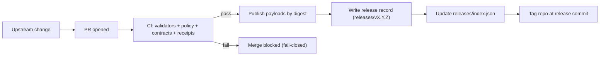

<!--
GOVERNED ARTIFACT NOTICE
This README defines KFM release records. Releases are immutable shipping evidence.
If you change meaning (not just phrasing), route through governance review (CODEOWNERS + CI gates).
-->

# `releases/` — KFM Releases (Immutable Shipping Records) 📦🧾🔒


> [!IMPORTANT]
> This folder is the canonical, versioned record of **what KFM shipped**.
>
> It contains release notes, a release manifest, checksums, and evidence (catalog snapshots, receipts, and optional supply-chain proofs).  
> **Nothing in an existing release folder is ever edited.** If something changes, ship a **new release**.

---

## Governance header

| Field | Value |
|---|---|
| Document | `releases/README.md` |
| Status | **Governed** |
| Applies to | release record format, immutability rules, verification expectations |
| Version | `v2.0.0-draft` |
| Effective date | 2026-02-15 |
| Owners | `.github/CODEOWNERS` *(required; if missing, treat as governance gap)* |
| Review triggers | changes to required artifacts, manifest schema, verification rules, or immutability semantics |

> [!WARNING]
> **Fail-closed rule:** missing/invalid required artifacts must block release publication.

---

## Table of contents

- [What belongs here](#what-belongs-here)
- [Release invariants](#release-invariants)
- [Directory layout](#directory-layout)
- [Required artifact contract](#required-artifact-contract)
- [Canonical addressing and digest pinning](#canonical-addressing-and-digest-pinning)
- [Release lifecycle](#release-lifecycle)
- [How to cut a release](#how-to-cut-a-release)
- [How to verify a release](#how-to-verify-a-release)
- [Hotfixes, rollbacks, and deprecations](#hotfixes-rollbacks-and-deprecations)
- [Governance and sensitive data](#governance-and-sensitive-data)
- [References](#references)
- [Appendix A — Example release manifest](#appendix-a--example-release-manifest)
- [Appendix B — Example checksums file](#appendix-b--example-checksums-file)

---

## What belongs here

`releases/` exists to support reproducibility, auditability, and governed distribution.

A KFM release is an immutable snapshot of one or more governed components such as:

- processed dataset versions (or pointers to immutable digests)
- catalog snapshots (DCAT always; STAC conditional; PROV required)
- policy snapshot (policy bundle used to enforce governance)
- API contracts (OpenAPI + optional GraphQL schema)
- release evidence:
  - checksums for everything stored in `releases/<release_id>/`
  - receipts references (run manifests / run records) for included datasets
  - optional supply-chain proofs (SBOM, attestations, signatures)

> [!NOTE]
> This folder is not for “latest build output,” dev artifacts, or temporary exports.
> Those belong in CI artifacts, registries/object storage, or governed data zones (`data/raw`, `data/work`, `data/processed`).

---

## Release invariants

These invariants are non-negotiable for official KFM releases.

1) **Immutability**
- existing releases are append-only: add a new release folder; update `releases/index.json`
- never modify or delete files under `releases/<release_id>/` once published

2) **Fail-closed**
- missing/invalid required artifacts block publication
- verification failures mean the release is untrusted

3) **Promotion Contract compliance**
- datasets referenced by a release must have passed Raw → Work → Processed with:
  - receipts (run manifest)
  - deterministic checksums
  - catalogs (DCAT always; STAC conditional; PROV required)

4) **Trust membrane safety**
- releases must not contain secrets, credentials, or artifacts enabling bypass of governed API/policy boundary

5) **Evidence-first**
- every shipped component is traceable via manifest + catalogs + provenance chain
- citations and evidence refs remain resolvable

---

## Directory layout

### Top-level contract

```text
releases/                                           # Immutable release ledger (what shipped, with proofs)
├─ README.md                                        # How releases are built/verified + what “required” means
├─ index.json                                       # Release index (latest pointer + list of versions + metadata)
│
└─ vX.Y.Z/                                          # One immutable release directory per version (semantic or repo-defined)
   ├─ release-notes.md                              # Human-readable notes (changes, risks, migrations)
   ├─ manifest.release.json                         # Release manifest (contents, digests, policy IDs, compatibility)
   │
   ├─ checksums/                                    # Integrity checks for on-repo artifacts
   │  └─ SHA256SUMS.txt                             # SHA-256 sums for files shipped in this release folder
   │
   ├─ catalogs/                                     # REQUIRED: catalogs shipped/declared by this release
   │  ├─ dcat/                                      # REQUIRED: DCAT records for datasets/distributions
   │  ├─ prov/                                      # REQUIRED: PROV lineage bundles/refs for included datasets
   │  └─ stac/                                      # REQUIRED when spatial assets are shipped/referenced
   │
   ├─ receipts/                                     # REQUIRED when any dataset is included
   │  ├─ run_manifests/                             # REQUIRED: run_manifest.json snapshots or immutable pointers
   │  └─ run_records/                               # Optional: run_record.json snapshots or immutable pointers
   │
   ├─ policy/                                       # Policy bundle used to validate/promote this release
   │  ├─ bundle.tar.gz                              # Built OPA bundle (deployable)
   │  └─ bundle.meta.json                           # Bundle metadata (version, commit, build inputs, digests)
   │
   ├─ api/                                          # API contract snapshots for this release
   │  ├─ openapi.yaml                               # OpenAPI snapshot (REST boundary)
   │  └─ graphql.schema.graphql                     # Optional: GraphQL schema snapshot (SDL)
   │
   ├─ sbom/                                         # Optional (recommended for software releases)
   │  └─ sbom.spdx.json                             # SBOM (SPDX JSON; normalized)
   │
   ├─ attestations/                                 # Optional (recommended when supply-chain is enabled)
   │  ├─ provenance.intoto.jsonl                    # in-toto/SLSA provenance (append-only JSONL)
   │  └─ signatures.json                            # Signature material/refs (e.g., cosign payload summaries)
   │
   └─ artifacts/                                    # Payload references (do not rely on mutable tags/paths)
      ├─ pointers.json                              # REQUIRED: immutable payload refs (OCI digests, object URIs)
      └─ small/                                     # Optional: tiny safe artifacts bundled in git (strict size cap)
```

### Naming rules
- `release_id` is SemVer with leading `v` (e.g., `v1.2.3`)
- directory name must match `release_id`
- do not use ambiguous identifiers like `latest`, `prod`, `final`

---

## Required artifact contract

Minimum requirements for an official release:

| Path | Required | Purpose | Gate / validator |
|---|---:|---|---|
| `releases/index.json` | ✅ | machine-discoverable release index | JSON schema + link-check |
| `releases/<release_id>/release-notes.md` | ✅ | human release notes | markdown lint + link-check |
| `releases/<release_id>/manifest.release.json` | ✅ | canonical release manifest | JSON schema + referential integrity |
| `releases/<release_id>/checksums/SHA256SUMS.txt` | ✅ | integrity for every file in release folder | checksum verification |
| `releases/<release_id>/catalogs/dcat/` | ✅ | dataset discovery + license + restrictions | DCAT validation |
| `releases/<release_id>/catalogs/prov/` | ✅ | lineage for promoted artifacts | PROV validation |
| `releases/<release_id>/catalogs/stac/` | ◻︎ conditional | spatial asset catalogs | STAC validation |
| `releases/<release_id>/receipts/run_manifests/` | ✅* | Promotion Contract receipts for included datasets | receipt schema validation |
| `releases/<release_id>/policy/bundle.tar.gz` | ✅ | policy snapshot used for governance | OPA/Conftest tests |
| `releases/<release_id>/api/openapi.yaml` | ✅ | governed API contract | OpenAPI validation + diff gate |
| `releases/<release_id>/artifacts/pointers.json` | ✅ | immutable payload references | digest/address format validation |
| `releases/<release_id>/sbom/sbom.spdx.json` | ◻︎ recommended | SBOM for shipped software | SPDX validation |
| `releases/<release_id>/attestations/provenance.intoto.jsonl` | ◻︎ recommended | build/publish provenance | verification where enabled |

\* Required whenever the release includes or references dataset versions.

---

## Canonical addressing and digest pinning

KFM prefers immutable, digest-addressed references for provenance roots.

### Address hierarchy (recommended)
1) digest address (OCI digest or content hash)  
2) stable gateway URL derived from digest (when applicable)  
3) storage location (implementation detail)

### `pointers.json` expectations
`pointers.json` should reference payloads by immutable identifiers:
- OCI subject digests (`...@sha256:...`)
- content-addressed object references (or versioned immutable URIs)

Mutable tags may exist as aliases, but must not be provenance roots.

---

## Release lifecycle



Key idea: publish by digest, attach evidence, and record the immutable release proof.

---

## How to cut a release

> [!IMPORTANT]
> Official releases must be produced via PR + CI so gates and evidence are enforced. No hand-edits in `releases/` after publication.

### Step-by-step

1) Decide the version (SemVer):
- MAJOR: breaking API/contract/policy semantics changes
- MINOR: additive changes (new datasets, endpoints, optional fields)
- PATCH: bug fixes with identical contract meaning

2) Ensure promotion prerequisites:
- all datasets referenced are processed and cataloged
- receipts exist (run manifests)
- checksums exist
- sensitivity labels and redactions are finalized

3) Run release build in CI:
- validate catalogs (DCAT/STAC/PROV)
- validate receipts (run manifests)
- run policy tests (default deny preserved)
- validate OpenAPI (and diff gate for `/api/v1`)
- compute checksums for release folder
- optionally generate SBOM/attestations and verify signatures when enabled

4) Create `releases/<release_id>/` and populate required artifacts.

5) Update `releases/index.json` (append new release entry; do not remove old ones).

6) Write release notes:
- what changed
- migration notes (if any)
- governance notes (redaction/sensitivity changes)
- exact dataset versions/digests referenced

7) Publish by merging PR; tag repo at release commit. Do not rebuild the same `release_id`.

### Release Definition of Done
- [ ] manifest schema-valid + referential integrity passes
- [ ] SHA256SUMS covers every file in release folder
- [ ] DCAT snapshot present and validates
- [ ] PROV snapshot present and validates
- [ ] STAC snapshot present when spatial assets are referenced
- [ ] run manifests present for included datasets and validate
- [ ] policy bundle present and tests pass
- [ ] OpenAPI present and validates; `/api/v1` diff gate passes
- [ ] pointers are immutable (digests)
- [ ] index updated
- [ ] no modifications to prior releases

---

## How to verify a release

### Quick verification (human)
1) locate release in `releases/index.json`
2) open `manifest.release.json` and confirm:
   - pointers are immutable (digests)
   - catalogs/receipts paths exist
   - policy bundle present
3) recompute SHA256 for all files and compare to `SHA256SUMS.txt`

### Full verification (consumer/deploy gate)
- validate manifest schema + referential integrity
- validate DCAT (license/rights/restrictions)
- validate STAC when present
- validate PROV (lineage completeness)
- validate receipts (run manifests) for included datasets
- verify OpenAPI + compatibility gate for `/api/v1`
- verify policy bundle tests pass (or are attested)
- verify SBOM/attestations/signatures when enabled

> [!NOTE]
> If any verification fails, treat the release as untrusted and do not deploy.

---

## Hotfixes, rollbacks, and deprecations

### Hotfix (preferred)
- ship a new patch release: `vX.Y.(Z+1)`
- reference corrected artifacts by new digests/versions
- explain the change and consumer action in release notes

### Rollback
- never delete release records
- rollback by redeploying a prior `release_id` whose verification passes

### Deprecation
- do not remove problematic releases
- record deprecation in next release notes and (optionally) an external advisory log
- keep old release for audit traceability

---

## Governance and sensitive data

Releases are governed artifacts:
- never ship secrets, credentials, private keys
- ensure license/attribution are present in DCAT for any dataset
- ensure restrictions are enforced by policy and that redaction/generalization is applied before promotion
- sensitive-location releases must include only approved generalized representations (public) and policy constraints

---

## References

- `.github/README.md` — repo governance + required CI gates
- KFM Next-Gen Blueprint & Primary Guide — promotion gates, audit/evidence expectations
- KFM Comprehensive Data Source Integration Blueprint — receipts/catalog requirements
- Feb-2026 integration patterns — digest pinning, evidence bundles/referrers, spec_hash semantics
- Standards: STAC, DCAT (W3C), PROV (W3C), RFC 8785 (JCS)

---

## Appendix A — Example release manifest

<details>
<summary><strong>Example: <code>releases/v1.2.0/manifest.release.json</code></strong></summary>

```json
{
  "schema": "kfm.schema.release_manifest.v1",
  "release_id": "v1.2.0",
  "created_at": "2026-02-14T00:00:00Z",
  "git": { "tag": "v1.2.0", "commit": "9f2c2a2b2d7a4c0f..." },
  "release_type": ["data", "api", "policy"],
  "components": {
    "datasets": [
      {
        "dataset_id": "kfm.example_dataset",
        "dataset_version": "sha256:...",
        "receipts": {
          "run_manifest": "receipts/run_manifests/run_2026-02-14T18:02:11Z.json"
        },
        "catalogs": {
          "dcat": "catalogs/dcat/kfm.example_dataset.json",
          "prov": "catalogs/prov/kfm.example_dataset/run_2026-02-14T18:02:11Z.json",
          "stac": "catalogs/stac/kfm.example_dataset/collection.json"
        },
        "distribution": {
          "oci_subject": "ghcr.io/kfm/datasets/example@sha256:aaaaaaaa...",
          "notes": "Published by digest; referrers attach evidence where supported."
        }
      }
    ],
    "policy": { "bundle": "policy/bundle.tar.gz", "meta": "policy/bundle.meta.json" },
    "api": { "openapi": "api/openapi.yaml", "graphql_schema": "api/graphql.schema.graphql" }
  },
  "evidence": {
    "checksums_sha256": "checksums/SHA256SUMS.txt",
    "sbom_spdx": "sbom/sbom.spdx.json",
    "provenance_attestation": "attestations/provenance.intoto.jsonl",
    "signatures": "attestations/signatures.json"
  }
}
```

</details>

---

## Appendix B — Example checksums file

<details>
<summary><strong>Example: <code>releases/v1.2.0/checksums/SHA256SUMS.txt</code></strong></summary>

```text
b1946ac92492d2347c6235b4d2611184a8a2b8d7c6a5b4c3d2e1f0a9b8c7d6e  manifest.release.json
8d969eef6ecad3c29a3a629280e686cf0c3f5d5a86aff3ca12020c923adc6c92  release-notes.md
2c26b46b68ffc68ff99b453c1d30413413422f1643c6aa3f8b6f0a1b6b1d9f2a  sbom/sbom.spdx.json
```

</details>
