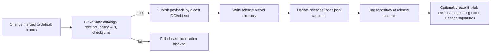

<!--
GOVERNED ARTIFACT NOTICE
This README defines the canonical KFM release record contract for `releases/`.

A “release record” is immutable shipping evidence. Once published, it is append-only:
- You MAY add a new release directory.
- You MAY update `releases/index.json` to point to the new release.
- You MUST NOT modify or delete any file under an already-published `releases/<release_id>/`.

If you change semantics (not just wording), route through governance review (CODEOWNERS + CI gates).
-->

# `releases/` — KFM Release Ledger 📦🧾🔒


> [!IMPORTANT]
> **This folder is the canonical, versioned record of what KFM shipped.**
>
> If a build, dataset, policy bundle, or API contract is not captured here (or referenced immutably from here),
> it is not considered a published KFM release.

---

## Governance Header

| Field | Value |
|---|---|
| Document | `releases/README.md` |
| Status | **Governed** |
| Applies to | Release record format, immutability rules, verification gates, publication semantics |
| Version | `v3.0.0` |
| Effective date | 2026-02-16 |
| Owners | `.github/CODEOWNERS` *(required; if missing, treat as a governance gap)* |
| Review triggers | Changes to: required artifacts, schema versions, verification rules, immutability semantics, publication workflow |

> [!WARNING]
> **Fail-closed is mandatory.** If required artifacts are missing/invalid, the release MUST NOT publish.

---

## How To Read This Document

This README is a **normative contract**. The keywords **MUST**, **MUST NOT**, **SHOULD**, and **MAY**
are used intentionally:

- **MUST / MUST NOT**: a hard requirement enforced by CI and policy.
- **SHOULD**: strongly recommended; deviations require justification in release notes.
- **MAY**: optional, allowed when safe and justified.

---

## Table of Contents

- [Purpose and Scope](#purpose-and-scope)
- [Release Invariants](#release-invariants)
- [Release Identity and Versioning](#release-identity-and-versioning)
- [Directory Layout](#directory-layout)
- [Required Artifact Contract](#required-artifact-contract)
- [Manifest Contract](#manifest-contract)
- [Index Contract](#index-contract)
- [Digest Pinning and Canonical Addressing](#digest-pinning-and-canonical-addressing)
- [Publication Workflow](#publication-workflow)
- [Verification Workflow](#verification-workflow)
- [Hotfixes, Rollbacks, Deprecations](#hotfixes-rollbacks-deprecations)
- [Security and Supply Chain](#security-and-supply-chain)
- [Governance and Sensitive Data](#governance-and-sensitive-data)
- [References](#references)
- [Appendix A — Minimal Release Manifest Example](#appendix-a--minimal-release-manifest-example)
- [Appendix B — Minimal Pointers File Example](#appendix-b--minimal-pointers-file-example)
- [Appendix C — Minimal Release Index Example](#appendix-c--minimal-release-index-example)
- [Appendix D — Checksums File Example](#appendix-d--checksums-file-example)
- [Appendix E — CI Gate Checklist](#appendix-e--ci-gate-checklist)

---

## Purpose and Scope

`releases/` exists to make KFM **reproducible**, **auditable**, and **governed**.

A **KFM release** is a frozen snapshot of one or more governed components, such as:

- dataset versions (processed outputs) or immutable pointers to them
- catalog snapshots:
  - **DCAT** (always required for dataset-level publishability)
  - **PROV** (always required for lineage)
  - **STAC** (required when spatial assets are shipped or referenced)
- policy snapshot (the exact policy bundle used for enforcement)
- API contract snapshot (OpenAPI required; GraphQL optional)
- integrity and evidence:
  - checksums for on-repo release record files
  - receipts (run manifests / run records) for included datasets
  - optional SBOM and provenance attestations

> [!NOTE]
> `releases/` is **not** a build output folder.
>
> Large payloads belong in governed storage (object store, OCI registry, etc.). This folder stores:
> **records, manifests, catalogs, receipts, and immutable pointers** — not bulk data.

---

## Release Invariants

These are the non-negotiable invariants for official releases.

### 1) Immutability

- A published release directory `releases/<release_id>/` is **immutable**.
- Publication means:
  - `releases/<release_id>/` is added to the default branch, **and**
  - `releases/index.json` references it, **and**
  - the repository is tagged at the release commit *(tagging requirements described below)*.
- After publication:
  - You MUST NOT modify or delete any file under `releases/<release_id>/`.
  - Corrections happen via a **new release**.

### 2) Fail-closed validation

- Missing required artifacts MUST block publication.
- Invalid manifests, invalid catalogs, invalid checksums, or unresolved pointers MUST block publication.
- “We’ll fix it later” is not a valid release state.

### 3) Promotion Contract compliance

If a release includes or references dataset versions, those datasets MUST have:

- receipts (run manifest at minimum)
- deterministic checksums
- catalog metadata:
  - DCAT record(s)
  - PROV lineage bundle(s)
  - STAC collection/items when spatial assets are involved

### 4) Trust membrane safety

Release records MUST NOT contain:

- secrets, credentials, private keys, access tokens
- artifacts that enable bypassing governed APIs/policy
- “convenience exports” of restricted data

### 5) Evidence-first

Every shipped component MUST be traceable:

- from release manifest → to receipts/catalogs → to immutable payload pointers
- with a resolvable provenance chain

---

## Release Identity and Versioning

### Release ID

A release directory name MUST equal `release_id`.

- Format: `vMAJOR.MINOR.PATCH` (SemVer with a leading `v`)
  - Examples: `v1.0.0`, `v2.3.7`
- Pre-release identifiers are allowed for candidates:
  - `v1.4.0-rc.1`, `v1.4.0-rc.2`

### When to bump versions

- **MAJOR**: breaking contract changes (API surface, policy semantics, manifest schema, evidence rules)
- **MINOR**: additive changes (new datasets, new endpoints, new optional schema fields)
- **PATCH**: bug fixes with identical contract meaning

> [!CAUTION]
> If you change what a release *means* (not just formatting), that is not a patch.
> Prefer honesty over convenience: bump versions.

---

## Directory Layout

### Top-level layout

```text
releases/                                           # Immutable release ledger
├─ README.md                                        # This governed contract
├─ index.json                                       # Machine-discoverable index (latest + list)
│
└─ vX.Y.Z/                                          # One immutable directory per release_id
   ├─ release-notes.md                              # Human notes: changes, risks, migrations
   ├─ manifest.release.json                         # Canonical machine manifest for the release
   │
   ├─ checksums/
   │  ├─ SHA256SUMS.txt                             # SHA-256 sums for ALL files in this directory
   │  └─ SHA256SUMS.sig                             # Optional signature for checksums file
   │
   ├─ catalogs/
   │  ├─ dcat/                                      # REQUIRED
   │  ├─ prov/                                      # REQUIRED
   │  └─ stac/                                      # REQUIRED when spatial assets are shipped/referenced
   │
   ├─ receipts/
   │  ├─ run_manifests/                             # REQUIRED if any dataset is included
   │  └─ run_records/                               # Optional (recommended for deeper audit)
   │
   ├─ policy/
   │  ├─ bundle.tar.gz                              # REQUIRED policy snapshot (deployable)
   │  └─ bundle.meta.json                           # REQUIRED policy metadata (inputs + digests)
   │
   ├─ api/
   │  ├─ openapi.yaml                               # REQUIRED (REST boundary contract)
   │  └─ graphql.schema.graphql                     # Optional (SDL snapshot)
   │
   ├─ sbom/
   │  └─ sbom.spdx.json                             # Optional (recommended for software releases)
   │
   ├─ attestations/
   │  ├─ provenance.intoto.jsonl                    # Optional (recommended when enabled)
   │  └─ signatures.json                            # Optional (recommended when enabled)
   │
   └─ artifacts/
      ├─ pointers.json                              # REQUIRED immutable payload references
      └─ small/                                     # Optional tiny safe artifacts (STRICT size cap)
```

### Repository size and safety rules

- `releases/<release_id>/artifacts/small/` MUST stay small (recommend: ≤ 10 MB total per release).
- Large artifacts MUST be referenced via `pointers.json` by immutable digest or immutable URI.
- **Never** store raw restricted datasets in git.

> [!TIP]
> If you need to ship a “sample” for reproducibility docs or tests, ship a **redacted, minimal** sample
> and document the redaction transformation in PROV.

---

## Required Artifact Contract

This table defines the minimum publishable contract for an official release.

| Path | Required | Purpose | Gate / validator |
|---|---:|---|---|
| `releases/index.json` | ✅ | Discoverability: list of releases + latest pointer | JSON schema validation |
| `releases/<release_id>/release-notes.md` | ✅ | Human changes, risks, migrations | markdown lint + link checks |
| `releases/<release_id>/manifest.release.json` | ✅ | Canonical release contents + evidence | JSON schema + referential integrity |
| `releases/<release_id>/checksums/SHA256SUMS.txt` | ✅ | Integrity for release record files | checksum verification |
| `releases/<release_id>/catalogs/dcat/` | ✅ | Dataset discovery, licensing, restrictions | DCAT profile validation |
| `releases/<release_id>/catalogs/prov/` | ✅ | Lineage for promoted outputs | PROV validation |
| `releases/<release_id>/catalogs/stac/` | ◻︎ conditional | Spatial asset metadata | STAC validation |
| `releases/<release_id>/receipts/run_manifests/` | ✅* | Promotion receipts for included datasets | receipt schema validation |
| `releases/<release_id>/policy/bundle.tar.gz` | ✅ | Policy snapshot used for enforcement | policy bundle tests |
| `releases/<release_id>/policy/bundle.meta.json` | ✅ | Policy bundle metadata + digests | schema validation |
| `releases/<release_id>/api/openapi.yaml` | ✅ | Governed API contract | OpenAPI validation + diff gate |
| `releases/<release_id>/artifacts/pointers.json` | ✅ | Immutable payload references | pointer schema + digest validation |
| `releases/<release_id>/sbom/sbom.spdx.json` | ◻︎ recommended | Software bill of materials | SPDX validation |
| `releases/<release_id>/attestations/provenance.intoto.jsonl` | ◻︎ recommended | Build/publish provenance | attestation verification (if enabled) |

\* Required whenever the release includes or references dataset versions.

---

## Manifest Contract

### Manifest role

`manifest.release.json` is the **authoritative machine-readable statement** of:

- what is included in the release
- how it is immutably referenced
- which evidence artifacts prove promotability and integrity
- which policy + API contracts define the trust boundary for that release

### Manifest invariants

The manifest MUST:

- declare `release_id` and match directory name
- point to catalogs/receipts/policy/api by **repo-relative paths**
- list payload pointers by digest (or explicitly immutable URI)
- provide enough information for a verifier to:
  - validate structure
  - resolve required files
  - verify checksums
  - validate catalogs and receipts

### Deterministic identity

KFM SHOULD compute a deterministic `spec_hash` (or equivalent field) for:

- `manifest.release.json`
- policy bundle metadata
- receipts and catalogs that are JSON-based

This supports: stable signatures, stable auditing, and consistent evidence resolution.

> [!NOTE]
> The hashing and canonicalization mechanism is defined elsewhere in KFM standards.
> If it changes, that is a MAJOR release rule change.

---

## Index Contract

### Why `releases/index.json` exists

`releases/index.json` is the machine-discoverable release registry:

- enables tools to find latest stable release
- provides metadata for consumers without scanning directories
- can drive UI “Release History” panels and deployment automation

### Index invariants

`index.json` MUST:

- list all published releases (append-only)
- not remove older releases
- optionally mark releases as deprecated (without deleting them)
- point to `manifest.release.json` for each release

> [!CAUTION]
> The index is a convenience. The manifest is the truth.
> If index and manifest disagree, treat the release as **suspicious** and fail verification.

---

## Digest Pinning and Canonical Addressing

### Priority order for addresses

KFM prefers immutable, content-addressed references.

Recommended hierarchy:

1. **Digest address** (OCI digest or content hash)
2. **Stable gateway URL derived from digest** (optional convenience)
3. **Storage location** (implementation detail; not provenance-root)

### `pointers.json` requirements

`pointers.json` MUST contain immutable references for all non-git payloads, such as:

- OCI artifacts published by digest: `registry.example/kfm/datasets/foo@sha256:...`
- content-addressed object references: `s3://bucket/path?versionId=...`
- immutable archive IDs (where a trusted upstream provides them)

`pointers.json` MUST NOT rely on mutable identifiers as provenance roots:

- ❌ `:latest` tags
- ❌ branch names
- ❌ “current” or “prod” URLs

Mutable aliases MAY exist, but MUST be clearly labeled as aliases and MUST NOT be used for verification.

---

## Publication Workflow

### Release lifecycle overview



### Required publication rules

1. **Create via PR**
   - Official releases MUST be produced via pull request + CI gates.
   - No “direct edits” on published releases.

2. **One release ID, one commit**
   - Do not re-cut the same `release_id`.
   - If anything changes, bump version and ship a new release record.

3. **Tagging**
   - The repo SHOULD be tagged at the release commit.
   - Tag signing SHOULD be enabled when feasible.

4. **Release notes**
   - Must include:
     - what changed
     - migration notes (if any)
     - governance notes (rights, restrictions, sensitivity)
     - the dataset versions/digests included

---

## Verification Workflow

### Human quick-check

1. Find the release in `releases/index.json`.
2. Open `releases/<release_id>/manifest.release.json`.
3. Confirm:
   - required paths exist
   - pointers are immutable (digests)
   - catalogs and receipts exist
4. Verify checksums:
   - recompute SHA-256 for all files under `releases/<release_id>/`
   - compare against `checksums/SHA256SUMS.txt`

> [!IMPORTANT]
> If any check fails, treat the release as untrusted.

### Full verification gate

A verifier (CI, deployment pipeline, or consumer) SHOULD perform:

- manifest schema validation + referential integrity checks
- checksum verification for release record files
- DCAT validation (licenses/rights/restrictions resolvable)
- PROV validation (lineage present and linkable)
- STAC validation when present
- receipts validation (run manifests) for included datasets
- OpenAPI validation + compatibility diff gate (for the governed API boundary)
- policy bundle presence + policy tests (default deny preserved)
- optional:
  - SBOM validation
  - attestation verification + signature verification

---

## Hotfixes, Rollbacks, Deprecations

### Hotfix

Preferred: ship a new patch release:

- from: `vX.Y.Z`
- to: `vX.Y.(Z+1)`

Hotfix release notes MUST include:

- the defect
- the consumer action (upgrade/redeploy)
- what changed in evidence (new digests, new receipts, new catalogs)

### Rollback

- Never delete release records.
- Rollback by redeploying a prior `release_id` that still verifies.

### Deprecation

- Do not remove problematic releases.
- Mark them deprecated in `releases/index.json` (and optionally add an advisory entry).
- Deprecation notes MUST say:
  - why it is deprecated
  - which release supersedes it
  - whether consumers must take action

---

## Security and Supply Chain

Release records are a high-value supply-chain surface. KFM’s release process SHOULD include repository
and CI hardening practices such as:

- protected release branch rules and required reviews
- signed commits and/or signed tags for provenance
- secret scanning and push protection to prevent credential leakage
- pinning CI dependencies (e.g., GitHub Actions) to immutable versions/SHAs
- least-privilege CI tokens (default read-only unless explicitly needed)
- dependency vulnerability scanning and code scanning gates

Optional (recommended where feasible):

- generate and ship an SBOM (SPDX JSON)
- produce build provenance attestations (in-toto/SLSA predicate forms)
- record signatures in a transparency log

> [!NOTE]
> The release record itself MUST NOT include secrets. If a secret leak is detected, it must be rotated and
> remediated immediately — and the incident should be documented in a follow-up release/advisory.

---

## Governance and Sensitive Data

Releases are governed artifacts and must honor:

- licensing/attribution requirements
- sensitivity classes (e.g., culturally restricted locations, endangered species, private individuals)
- publish-safe generalization rules for sensitive geospatial layers

Rules:

- Sensitive location datasets MUST be generalized/redacted prior to promotion.
- Release notes MUST describe any redaction/generalization transformations at a high level.
- The policy bundle included in the release MUST enforce restrictions at query time.

> [!WARNING]
> If policy cannot prove “allowed,” the system must deny. This applies to releases too:
> uncertain rights/sensitivity = not publishable.

---

## References

- Repo governance and gates: `.github/README.md`
- Promotion Contract and catalogs: KFM standards docs in `docs/standards/`
- Release security hardening baseline (internal): *Software Security Guide for Developers (2026 Edition) – Expanded Sections* :contentReference[oaicite:0]{index=0}

---

## Appendix A — Minimal Release Manifest Example

<details>
<summary><strong>Example: <code>releases/v1.2.0/manifest.release.json</code></strong></summary>

```json
{
  "schema": "kfm.schema.release_manifest.v1",
  "release_id": "v1.2.0",
  "created_at": "2026-02-14T00:00:00Z",
  "git": {
    "tag": "v1.2.0",
    "commit": "9f2c2a2b2d7a4c0f..."
  },
  "release_type": ["data", "api", "policy"],
  "components": {
    "datasets": [
      {
        "dataset_id": "kfm.example_dataset",
        "dataset_version": "sha256:aaaaaaaaaaaaaaaaaaaaaaaaaaaaaaaaaaaaaaaaaaaaaaaaaaaaaaaaaaaaaaaa",
        "receipts": {
          "run_manifest": "receipts/run_manifests/run_2026-02-14T18:02:11Z.json"
        },
        "catalogs": {
          "dcat": "catalogs/dcat/kfm.example_dataset.json",
          "prov": "catalogs/prov/kfm.example_dataset/run_2026-02-14T18:02:11Z.json",
          "stac": "catalogs/stac/kfm.example_dataset/collection.json"
        }
      }
    ],
    "policy": {
      "bundle": "policy/bundle.tar.gz",
      "meta": "policy/bundle.meta.json"
    },
    "api": {
      "openapi": "api/openapi.yaml",
      "graphql_schema": "api/graphql.schema.graphql"
    }
  },
  "evidence": {
    "checksums_sha256": "checksums/SHA256SUMS.txt",
    "sbom_spdx": "sbom/sbom.spdx.json",
    "provenance_attestation": "attestations/provenance.intoto.jsonl",
    "signatures": "attestations/signatures.json"
  }
}
```

</details>

---

## Appendix B — Minimal Pointers File Example

<details>
<summary><strong>Example: <code>releases/v1.2.0/artifacts/pointers.json</code></strong></summary>

```json
{
  "schema": "kfm.schema.release_pointers.v1",
  "release_id": "v1.2.0",
  "pointers": [
    {
      "name": "dataset.kfm.example_dataset",
      "type": "oci",
      "subject": "ghcr.io/kfm/datasets/example@sha256:bbbbbbbbbbbbbbbbbbbbbbbbbbbbbbbbbbbbbbbbbbbbbbbbbbbbbbbbbbbbbbbb",
      "notes": "Published by digest; do not use tags as provenance roots."
    },
    {
      "name": "policy.bundle",
      "type": "object",
      "uri": "s3://kfm-artifacts/policy/bundle.tar.gz?versionId=3HL4kqtJlcpXroDTDmjVBH40Nrjfkd",
      "digest": "sha256:cccccccccccccccccccccccccccccccccccccccccccccccccccccccccccccccc"
    }
  ]
}
```

</details>

---

## Appendix C — Minimal Release Index Example

<details>
<summary><strong>Example: <code>releases/index.json</code></strong></summary>

```json
{
  "schema": "kfm.schema.release_index.v1",
  "latest": "v1.2.0",
  "releases": [
    {
      "release_id": "v1.2.0",
      "created_at": "2026-02-14T00:00:00Z",
      "manifest": "v1.2.0/manifest.release.json",
      "notes": "v1.2.0/release-notes.md",
      "deprecated": false
    },
    {
      "release_id": "v1.1.0",
      "created_at": "2026-01-20T00:00:00Z",
      "manifest": "v1.1.0/manifest.release.json",
      "notes": "v1.1.0/release-notes.md",
      "deprecated": false
    }
  ]
}
```

</details>

---

## Appendix D — Checksums File Example

<details>
<summary><strong>Example: <code>releases/v1.2.0/checksums/SHA256SUMS.txt</code></strong></summary>

```text
b1946ac92492d2347c6235b4d2611184a8a2b8d7c6a5b4c3d2e1f0a9b8c7d6e  manifest.release.json
8d969eef6ecad3c29a3a629280e686cf0c3f5d5a86aff3ca12020c923adc6c92  release-notes.md
2c26b46b68ffc68ff99b453c1d30413413422f1643c6aa3f8b6f0a1b6b1d9f2a  sbom/sbom.spdx.json
```

</details>

---

## Appendix E — CI Gate Checklist

The following gates SHOULD exist and MUST be merge-blocking for official releases:

### Required gates

- [ ] **No edits to prior releases**: PR must not modify any file in a release directory already listed in `releases/index.json`
- [ ] **Schema validation**: `index.json`, `manifest.release.json`, `pointers.json`, policy metadata, receipts, catalogs
- [ ] **Referential integrity**: manifest and index paths resolve to existing files
- [ ] **Checksum verification**: `SHA256SUMS.txt` covers every file under `releases/<release_id>/`
- [ ] **Catalog validation**: DCAT + PROV, and STAC when required
- [ ] **Receipt validation**: run manifest required when datasets are included
- [ ] **OpenAPI validation**: `api/openapi.yaml` is valid
- [ ] **Compatibility diff gate**: contract breaking changes require MAJOR bump
- [ ] **Policy gate**: policy bundle tests pass; default-deny preserved
- [ ] **Secret scanning**: fail build if secrets are detected in release files

### Recommended gates

- [ ] **SBOM validation**: SPDX JSON schema check
- [ ] **Attestation verification**: verify in-toto/SLSA predicates if present
- [ ] **Signature verification**: if checksums or tags are signed, verify signatures in CI
