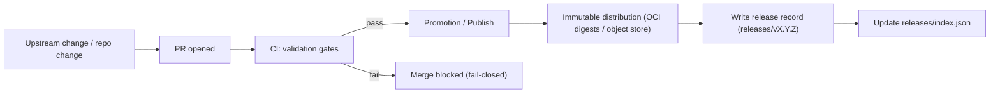

# releases/ — KFM Releases (Immutable Shipping Records)


> [!IMPORTANT]
> **This folder is the canonical, versioned record of _what KFM shipped_.**
>
> It contains **packaged release artifacts**, a **release manifest**, and **release evidence** (e.g., checksums, catalogs, SBOM, provenance/attestations, signatures).  
> **Nothing in an existing release folder is ever edited.** If something changes, ship a **new release**.

---

## Table of contents

- [What belongs here](#what-belongs-here)
- [Release invariants](#release-invariants)
- [Directory layout](#directory-layout)
- [Required artifact contract](#required-artifact-contract)
- [Release lifecycle](#release-lifecycle)
- [How to cut a release](#how-to-cut-a-release)
- [How to verify a release](#how-to-verify-a-release)
- [Hotfixes, rollbacks, and deprecations](#hotfixes-rollbacks-and-deprecations)
- [Governance and sensitive data](#governance-and-sensitive-data)
- [References](#references)
- [Appendix A — Example release manifest](#appendix-a--example-release-manifest)
- [Appendix B — Example checksums file](#appendix-b--example-checksums-file)

---

## What belongs here

This `releases/` directory exists to support **reproducibility, auditability, and governed distribution**.

A **KFM release** is an **immutable snapshot** of one or more governed components such as:

- **Processed datasets** (or pointers to their immutable published form)
- **Catalog snapshots** (DCAT always; STAC/PROV as applicable)
- **Policy pack snapshot** (OPA/Rego bundle used to enforce governance)
- **API contracts** (OpenAPI / GraphQL schema / client contracts)
- **Release evidence**:
  - file checksums
  - SBOM (SPDX)
  - provenance / in-toto attestations
  - signatures and verification metadata

> [!NOTE]
> This folder is **not** for “latest build output,” dev artifacts, or temporary exports.
> Those belong in CI artifacts, registries/object storage, or the governed data zones (`raw/`, `work/`, `processed/`).

---

## Release invariants

These invariants are **non-negotiable** for “official” KFM releases:

1. **Immutability**
   - Existing releases are **append-only**: you may add a new release folder; you may update `releases/index.json` to reference it.
   - You may **not** modify or delete files under `releases/<release_id>/` once published.

2. **Fail-closed**
   - Any missing or invalid required artifacts, catalogs, checksums, policies, or attestations must **block release publication**.

3. **Promotion gates**
   - Any dataset included in a release must have passed the governed promotion path **Raw → Work → Processed** and must have:
     - deterministic checksums
     - required catalogs (DCAT always; STAC/PROV when applicable)

4. **Trust membrane safety**
   - Releases must not contain secrets, credentials, or any artifact that would enable bypassing the governed API/policy boundary.

5. **Evidence-first**
   - Every shipped component is traceable via the release manifest + catalogs + provenance chain.

---

## Directory layout

### Top-level contract

```text
releases/
├── README.md
├── index.json
└── vX.Y.Z/
    ├── release-notes.md
    ├── manifest.release.json
    ├── checksums/
    │   └── SHA256SUMS.txt
    ├── catalogs/
    │   ├── dcat/              # REQUIRED (always)
    │   ├── prov/              # REQUIRED if lineage exists / recommended always
    │   └── stac/              # REQUIRED when shipping spatial assets
    ├── policy/
    │   ├── bundle.tar.gz
    │   └── bundle.meta.json
    ├── api/
    │   ├── openapi.yaml
    │   └── graphql.schema.graphql
    ├── sbom/
    │   └── sbom.spdx.json
    ├── attestations/
    │   ├── provenance.intoto.jsonl
    │   └── signatures.json
    └── artifacts/
        ├── pointers.json      # references to immutable published payloads (OCI digests, object URIs)
        └── small/             # optional: small bundled artifacts safe for git
```

### Naming

- `release_id` is **SemVer** with a leading `v`:
  - Examples: `v0.1.0`, `v1.2.3`, `v2.0.0`
- Directory name must match `release_id`.
- Do **not** use ambiguous identifiers like `latest`, `prod`, `final`.

---

## Required artifact contract

The table below is the **minimum** for an official release.

| Path | Required | Purpose | Gate / validator |
|---|---:|---|---|
| `releases/index.json` | ✅ | Machine-discoverable list of releases | JSON schema + link-check |
| `releases/<release_id>/release-notes.md` | ✅ | Human readable “what changed / why” | Markdown lint + link-check |
| `releases/<release_id>/manifest.release.json` | ✅ | Canonical release manifest (all pointers + evidence) | JSON schema + referential integrity |
| `releases/<release_id>/checksums/SHA256SUMS.txt` | ✅ | Deterministic integrity for every file in the release folder | checksum verification |
| `releases/<release_id>/catalogs/dcat/` | ✅ | Dataset discovery + rights/license + distributions | JSON-LD validation |
| `releases/<release_id>/catalogs/prov/` | ✅* | Lineage for promoted artifacts | PROV validation |
| `releases/<release_id>/catalogs/stac/` | ✅** | Spatial asset catalogs | STAC validation |
| `releases/<release_id>/policy/bundle.tar.gz` | ✅ | Policy snapshot used during promotion + serving | OPA/Conftest tests |
| `releases/<release_id>/api/openapi.yaml` | ✅ | Governed API contract shipped with release | OpenAPI validation |
| `releases/<release_id>/sbom/sbom.spdx.json` | ✅ | SBOM for shipped software artifacts | SPDX validation |
| `releases/<release_id>/attestations/provenance.intoto.jsonl` | ✅ | Provenance attestation for release build/publish | in-toto/SLSA verification |
| `releases/<release_id>/artifacts/pointers.json` | ✅ | Immutable payload references (e.g., OCI digests) | digest format validation |

\* **PROV** is strongly recommended for all releases and required whenever any shipped artifact has a transformation lineage.  
\** **STAC** is required for releases that ship or reference spatial assets intended for map/timeline rendering.

---

## Release lifecycle



Key idea: **publish by digest**, not by mutable tag, and attach evidence as referrers/attestations where supported.

---

## How to cut a release

> [!IMPORTANT]
> Official releases must be produced via a **PR + CI** workflow so that policy gates and attestations are enforced.
> No hand-edits in `releases/` after publication.

### Step-by-step

1. **Decide the version**
   - **MAJOR**: breaking changes to API contracts, policy semantics, or data schemas
   - **MINOR**: additive changes (new datasets, new endpoints, new non-breaking fields)
   - **PATCH**: fixes (bug fixes, backfill corrections, doc fixes that do not change contracts)

2. **Ensure governed promotion prerequisites**
   - All included datasets are in **Processed** and have:
     - deterministic checksums
     - DCAT emitted
     - STAC/PROV emitted as applicable
   - Policy labels and redaction rules are finalized for any sensitive fields.

3. **Run the release build in CI (required for official)**
   CI must:
   - validate catalogs (DCAT/STAC/PROV)
   - run policy tests (OPA/Rego)
   - build API contracts (OpenAPI/GraphQL) and validate them
   - generate SBOM (SPDX)
   - generate provenance attestation (SLSA / in-toto)
   - compute SHA-256 checksums for the release folder

4. **Create the release folder**
   - Add `releases/<release_id>/` with the required structure.
   - Ensure the manifest references only **immutable** payload addresses (e.g., `@sha256:` digests).

5. **Update `releases/index.json`**
   - Append the new release entry (latest first recommended).
   - Do not remove existing entries.

6. **Write `release-notes.md`**
   Must include:
   - summary of what changed
   - any migration notes
   - any governance notes (e.g., redaction changes)
   - exact referenced dataset versions / digests

7. **Publish**
   - Merge the PR after CI passes.
   - Tag the repo at the release commit (`vX.Y.Z`) and publish via the standard release channel.
   - Do not “rebuild” a release with the same ID.

### Release Definition of Done (DoD)

- [ ] `releases/<release_id>/manifest.release.json` exists and is schema-valid
- [ ] `releases/<release_id>/checksums/SHA256SUMS.txt` covers **every** file under the release folder
- [ ] DCAT snapshot is present and passes validation
- [ ] STAC snapshot is present **when** spatial assets are shipped/referenced
- [ ] PROV snapshot is present for all transformed artifacts (recommended always)
- [ ] Policy bundle included + policy tests pass (fail-closed)
- [ ] API contract included + contract validation passes
- [ ] SBOM present (SPDX) + validator passes
- [ ] Provenance attestation present + verification passes
- [ ] `releases/index.json` updated and points to the new manifest
- [ ] No modifications to previously published releases

---

## How to verify a release

### Quick verification (human)

1. Open `releases/index.json` and locate the target `release_id`.
2. Open `releases/<release_id>/manifest.release.json` and confirm:
   - all referenced payloads use immutable addresses (digests)
   - catalogs paths exist
   - policy bundle is present
3. Verify checksums:
   - recompute SHA-256 for all files in the release folder
   - confirm they match `checksums/SHA256SUMS.txt`

### Full verification (consumer / deployment gate)

A consumer (CI deploy job, downstream system, or audit process) should:

- Validate manifest schema + referential integrity
- Validate DCAT (rights/license, distributions, provenance links)
- Validate STAC collections/items if present
- Validate PROV if present
- Verify SBOM is present and matches shipped images/artifacts
- Verify provenance attestation and signatures using the approved toolchain
- Confirm policy bundle is present and that policy tests pass (or were attested)

> [!NOTE]
> If any verification step fails, treat the release as **untrusted** and do not deploy.

---

## Hotfixes, rollbacks, and deprecations

### Hotfix (preferred)

- Ship a **new patch release**: `vX.Y.(Z+1)`
- Reference the corrected artifacts by new digests/versions
- Add a note in `release-notes.md` explaining:
  - what was wrong
  - why the hotfix is safe
  - any consumer action required

### Rollback

- Never delete a release record.
- Rollback by redeploying a prior `release_id` whose verification passes.
- Add an operational note in your deployment logs / incident record (outside this folder).

### Deprecation

- If a release is later found to be problematic, do **not** remove it.
- Add a deprecation notice in the next release notes and (optionally) in an external advisory log.
- Keep the old release for audit traceability.

---

## Governance and sensitive data

Releases are governed artifacts.

- Do not ship secrets, credentials, private keys, or raw unredacted sensitive exports.
- Ensure **license + attribution** are present in DCAT metadata for any dataset.
- Ensure **restrictions** are enforced through policy bundles and that redaction/generalization is applied before promotion/publish.
- When a dataset is “sensitive-location” or similar, the release must only include the **approved generalized** representation and the policy constraints that enforce it.

---

## References

These documents define the release expectations and gating philosophy:

- **KFM Comprehensive Data Source Integration Blueprint v1.0 (2026-02-12)**  
  Trust membrane + fail-closed + promotion gates Raw→Work→Processed and required catalogs/checksums.

- **MASTER_GUIDE v13 (Canonical pipeline & structure reference)**  
  Repository structure and the expectation that `releases/` contains packaged release artifacts (versioned bundles, manifest, SBOM).

- **KFM Next-Gen Blueprint (Appendix: CI Hardening Checklist)**  
  CI should validate stories/catalogs/policies and generate SBOM (SPDX) + SLSA/in-toto provenance attestations.

- **Integrating “New Ideas Feb-2026” Into Knowledge-First Management**  
  Promotion contract, run manifests/receipts, provenance guard policies, and digest-pinning/OCI referrers patterns.

---

## Appendix A — Example release manifest

<details>
<summary><strong>Example: <code>releases/v1.2.0/manifest.release.json</code></strong></summary>

```json
{
  "schema": "kfm.schema.release_manifest.v1",
  "release_id": "v1.2.0",
  "created_at": "2026-02-14T00:00:00Z",
  "git": {
    "tag": "v1.2.0",
    "commit": "9f2c2a2b2d7a4c0f9d9f4c2a1b0e8d7c6a5b4c3d"
  },
  "release_type": ["data", "api", "policy"],
  "components": {
    "datasets": [
      {
        "dataset_id": "kfm.hazards.fema_disaster_declarations",
        "dataset_version": "sha256:2c26b46b68ffc68ff99b453c1d30413413422f1643c6aa3f8b6f0a1b6b1d9f2a",
        "zone": "processed",
        "catalogs": {
          "dcat": "catalogs/dcat/kfm.hazards.fema_disaster_declarations.jsonld",
          "prov": "catalogs/prov/kfm.hazards.fema_disaster_declarations.prov.json",
          "stac": "catalogs/stac/kfm.hazards.fema_disaster_declarations/collection.json"
        },
        "distribution": {
          "oci_subject": "ghcr.io/kfm/datasets/fema_disaster_declarations@sha256:aaaaaaaaaaaaaaaaaaaaaaaaaaaaaaaaaaaaaaaaaaaaaaaaaaaaaaaaaaaaaaaa",
          "notes": "Published by digest; referrers attach SBOM/PROV/QA as supported by registry."
        }
      }
    ],
    "policy": {
      "bundle": "policy/bundle.tar.gz",
      "meta": "policy/bundle.meta.json"
    },
    "api": {
      "openapi": "api/openapi.yaml",
      "graphql_schema": "api/graphql.schema.graphql"
    }
  },
  "evidence": {
    "checksums_sha256": "checksums/SHA256SUMS.txt",
    "sbom_spdx": "sbom/sbom.spdx.json",
    "provenance_attestation": "attestations/provenance.intoto.jsonl",
    "signatures": "attestations/signatures.json"
  },
  "governance": {
    "fail_closed": true,
    "policy_labels": ["public"],
    "notes": "Any restricted/sensitive-location datasets must be redacted/generalized prior to promotion."
  }
}
```

</details>

---

## Appendix B — Example checksums file

<details>
<summary><strong>Example: <code>releases/v1.2.0/checksums/SHA256SUMS.txt</code></strong></summary>

```text
b1946ac92492d2347c6235b4d2611184a8a2b8d7c6a5b4c3d2e1f0a9b8c7d6e  manifest.release.json
8d969eef6ecad3c29a3a629280e686cf0c3f5d5a86aff3ca12020c923adc6c92  release-notes.md
2c26b46b68ffc68ff99b453c1d30413413422f1643c6aa3f8b6f0a1b6b1d9f2a  sbom/sbom.spdx.json
```

</details>

