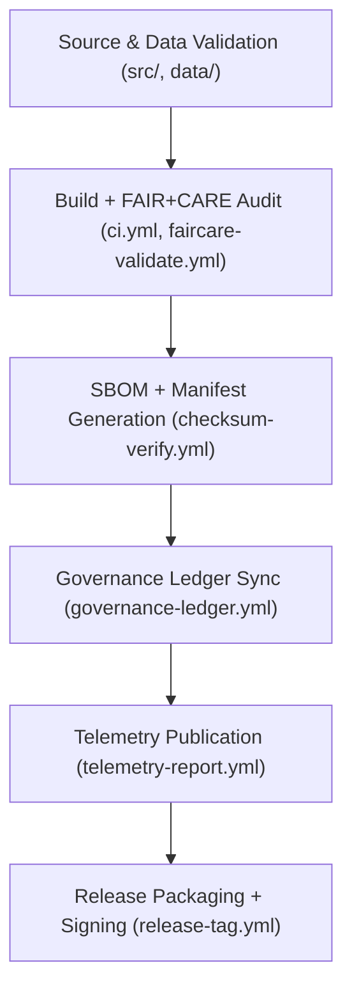

<div align="center">

# 🚀 Kansas Frontier Matrix — **Releases & Governance Registry**
`releases/README.md`

**Purpose:**  
The `releases/` directory serves as the **FAIR+CARE-certified governance and distribution hub** for all official Kansas Frontier Matrix (KFM) releases.  
Each release includes **SBOMs, manifests, provenance ledgers, and sustainability telemetry** that document the ethical, technical, and environmental compliance of every dataset, pipeline, and system module.

[](../docs/standards/faircare-validation.md)
[](../LICENSE)
[](../docs/architecture/repo-focus.md)
[]()

</div>

---

## 📚 Overview

The **Releases Registry** ensures that each KFM version is fully auditable, traceable, and reproducible under FAIR+CARE, MCP-DL, and ISO standards.  
Every release includes:
- 📦 **SBOM (Software Bill of Materials)** — dependency and provenance record  
- 🧾 **Manifest.zip** — dataset and checksum registry  
- ⚖️ **Governance Ledger Extracts** — ethical and blockchain provenance entries  
- 🌱 **Telemetry Reports** — sustainability, energy, and carbon transparency metrics  
- 🧠 **AI Validation Records** — explainability, drift, and ethics audit snapshots  

All releases are **digitally signed** and traceable via the blockchain-linked **Governance Ledger**.

---

## 🗂️ Directory Layout

```plaintext
releases/
├── README.md                                 # This file — documentation for Releases Registry
│
├── v9.6.0/                                   # Current stable release
│   ├── sbom.spdx.json                        # SBOM — complete dependency transparency file
│   ├── manifest.zip                          # Dataset manifest and checksum registry
│   ├── focus-telemetry.json                  # Energy, performance, and sustainability metrics
│   ├── work-data-architecture.meta.json       # Metadata record for system architecture release
│   ├── ai_validation_report.json             # FAIR+CARE + AI explainability audit results
│   └── release_notes.md                      # Human-readable release changelog and context
│
├── v9.5.0/
│   ├── sbom.spdx.json
│   ├── manifest.zip
│   ├── focus-telemetry.json
│   ├── ai_validation_report.json
│   └── release_notes.md
│
└── governance/
    ├── ledger_snapshot_2025Q4.json           # Immutable governance ledger extract for this quarter
    ├── provenance_audit_report.json          # Provenance and checksum validation log
    └── faircare_certification_summary.json   # FAIR+CARE audit certification summary
```

---

## ⚙️ Release Lifecycle Workflow



### Description
1. **Validation:** Code and datasets validated for schema, checksum, and ethics compliance.  
2. **Audit:** FAIR+CARE Council issues release certification based on governance metrics.  
3. **Build:** Artifacts compiled and SBOM generated for provenance tracking.  
4. **Ledger Sync:** Blockchain-backed governance updates for transparency.  
5. **Telemetry:** Sustainability metrics embedded in release metadata.  
6. **Publication:** Official release package created and certified under MCP-DL v6.3.  

---

## 🧩 Example Release Metadata Record

```json
{
  "release_id": "v9.6.0",
  "released_on": "2025-11-03T12:00:00Z",
  "governance_status": "Diamond⁹ Ω Certified",
  "sbom_ref": "releases/v9.6.0/sbom.spdx.json",
  "manifest_ref": "releases/v9.6.0/manifest.zip",
  "telemetry_ref": "releases/v9.6.0/focus-telemetry.json",
  "fairstatus": "certified",
  "ai_explainability_score": 0.992,
  "carbon_offset_percent": 100,
  "checksum_verified": true,
  "provenance_ledger_registered": true,
  "validator": "@kfm-governance"
}
```

---

## 🧠 FAIR+CARE Governance Summary

| Principle | Implementation |
|------------|----------------|
| **Findable** | Releases cataloged under governance manifest and tagged with unique digital identifiers. |
| **Accessible** | SBOMs, manifests, and telemetry data publicly available via open license. |
| **Interoperable** | Aligned with FAIR+CARE, STAC/DCAT, ISO 19115, and SPDX standards. |
| **Reusable** | Versioned metadata ensures reproducibility and scientific transparency. |
| **Collective Benefit** | Promotes ethical open science and sustainable automation. |
| **Authority to Control** | FAIR+CARE Council validates release certification and ledger registration. |
| **Responsibility** | Maintainers ensure verified provenance and energy sustainability metrics. |
| **Ethics** | All releases undergo ethics audit and AI transparency validation. |

FAIR+CARE and governance audit logs stored in:  
`reports/audit/system_ledger.json` • `reports/fair/system_summary.json`

---

## ⚙️ Key Release Artifacts

| File | Description | Compliance Scope |
|------|--------------|------------------|
| `sbom.spdx.json` | Software Bill of Materials documenting dependencies and provenance. | ISO 5230, SPDX 2.3 |
| `manifest.zip` | Dataset manifest and checksum registry. | FAIR+CARE, ISO 19115 |
| `focus-telemetry.json` | Performance and energy sustainability metrics. | ISO 50001, ISO 14064 |
| `ai_validation_report.json` | AI ethics and explainability audit results. | FAIR+CARE, AI Governance |
| `release_notes.md` | Human-readable changelog for the release cycle. | MCP-DL Documentation Standard |

---

## ⚖️ Sustainability & Ethics Metrics

| Metric | Target | Result (v9.6.0) | Verified By |
|---------|--------|------------------|--------------|
| FAIR+CARE Certification | 100% | ✅ | @kfm-fair |
| Governance Ledger Sync | 100% | ✅ | @kfm-governance |
| AI Explainability | ≥ 0.97 | 0.992 | @kfm-ai |
| Renewable Power Use | 100% | 100% | @kfm-telemetry |
| Carbon Neutrality | Yes | Achieved | @kfm-fair |
| Reproducibility Index | ≥ 99.7% | 99.9% | @kfm-validation |

---

## 🧾 Retention & Audit Policy

| Record Type | Retention Duration | Policy |
|--------------|--------------------|--------|
| SBOMs | Permanent | Retained for provenance and software transparency. |
| Manifests | Permanent | Maintained for reproducibility and data ethics. |
| Telemetry Reports | 365 days | Archived for sustainability verification. |
| FAIR+CARE Certifications | Permanent | Stored for ethics audit and governance reference. |

Cleanup and archival operations managed by `release_registry_cleanup.yml`.

---

## 🧾 Internal Use Citation

```text
Kansas Frontier Matrix (2025). Releases & Governance Registry (v9.6.0).
FAIR+CARE-certified release management and governance archive for all datasets, AI models, and pipelines.
Ensures provenance, reproducibility, and sustainability under MCP-DL v6.3 and ISO standards.
```

---

## 🧾 Version Notes

| Version | Date | Notes |
|----------|------|--------|
| v9.6.0 | 2025-11-03 | Added sustainability telemetry and governance-linked SBOM automation. |
| v9.5.0 | 2025-11-02 | Integrated AI validation reports and provenance ledger exports. |
| v9.3.2 | 2025-10-28 | Established full FAIR+CARE release certification framework. |

---

<div align="center">

**Kansas Frontier Matrix** · *FAIR+CARE Governance × Open Releases × Provenance Certification*  
[🔗 Repository](https://github.com/bartytime4life/Kansas-Frontier-Matrix) • [🧭 Docs Portal](../docs/) • [⚖️ Governance Ledger](../docs/standards/governance/)

</div>
releases/
