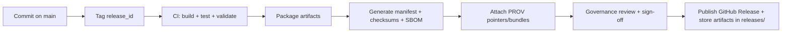

# releases/ — KFM Release Artifacts (Manifest + SBOM + Provenance)

<kbd>Governed</kbd> <kbd>CI-Ready</kbd> <kbd>Reproducible</kbd> <kbd>Manifest+SBOM</kbd> <kbd>FAIR+CARE</kbd>

> **Governed document.** This README defines the *packaging and verification contract* for KFM release artifacts.
> Changes here can affect downstream release automation, verification, and auditability.

---

## 📘 Overview

### Purpose

The `releases/` directory is the canonical home for **packaged release artifacts** (e.g., versioned bundles) and the **release metadata needed to verify, audit, and reproduce** those artifacts later. At minimum, releases are expected to include a **manifest** and an **SBOM**. [^kfm-structure]

This aligns with KFM’s architecture goals:
- **Governed access + traceability** across system components and datasets (trust membrane).
- **Reproducibility** of builds and data bundles (so a past release can be recreated and audited). [^kfm-impl] [^release-mgmt]

### Scope

This README covers:
- What belongs in `releases/`
- A recommended directory layout per release
- Minimum required metadata (manifest + checksums + SBOM + provenance pointers)
- Release gates (CI + governance review expectations)

Out of scope:
- Detailed CI workflow YAML specifics (those live under `.github/workflows/` if present)
- The full STAC/DCAT/PROV schemas (those live under `schemas/` and data catalogs under `data/`)

### Audience

- Maintainers cutting a release (code, data, narrative bundles)
- Reviewers performing governance checks (FAIR/CARE, sensitivity)
- Contributors troubleshooting “what shipped in release X?”

### Definitions

| Term | Meaning |
|---|---|
| Release | A versioned, distributable snapshot of KFM code+config and/or data+metadata bundles. |
| Release ID | A stable identifier for a release (often a Git tag). |
| Manifest | Machine-readable index of what’s included in the release (artifacts, hashes, inputs, build info). [^kfm-structure] |
| SBOM | Software Bill of Materials for shipped software artifacts (format e.g., SPDX or CycloneDX). [^kfm-structure] |
| PROV | Provenance bundle(s) describing how data outputs were derived (inputs → transforms → outputs). |
| Trust membrane | Architectural rule: clients never bypass the governed API; core logic never bypasses repository interfaces. [^kfm-impl] [^kfm-blueprint] |

---

## 🗂️ Directory Layout

### This document

- **Path:** `releases/README.md`

### Directory intent

`releases/` is intended for **immutable, versioned** bundles plus the metadata needed to validate them (manifest, SBOM, checksums, provenance pointers). [^kfm-structure]

> [!IMPORTANT]
> Treat release folders as **append-only**. Do not “edit history” by mutating already-published release bundles.
> If a correction is needed, cut a new patch release and document the change.

### Recommended structure

```text
releases/
├── README.md
└── <release_id>/                        # one folder per release (e.g., v1.2.3)
    ├── manifest.yaml                    # or manifest.json (choose one convention)
    ├── sbom.spdx.json                   # SBOM (format must be declared in manifest)
    ├── checksums.sha256                 # checksums for all artifacts in this folder
    ├── notes.md                         # human-readable release notes (optional but recommended)
    ├── prov/                            # provenance bundles OR pointers to canonical PROV outputs
    │   └── prov_bundle.json
    └── artifacts/                       # packaged binaries / bundles / exports
        ├── kfm_api_container.tar         # example
        ├── kfm_web_build.zip             # example
        ├── data_bundle.tar.zst           # example
        └── graph_export.cypher.zst       # example
```

> [!NOTE]
> Exact artifact types (containers, zips, dumps) depend on the release type. The invariants are:
> **manifest + SBOM + checksums + provenance pointers**.

---

## 🧭 Context

### Why releases are “governed”

KFM is designed around:
- clean layered architecture (Domain → Use Case → Integration → Infrastructure), and
- a strict trust membrane where all data access is mediated by governed interfaces and the unified API boundary. [^kfm-impl] [^kfm-blueprint]

Releases must therefore be packaged in a way that:
- preserves API boundaries (e.g., UI is configured to call the governed API; no direct DB coupling),
- includes enough metadata to explain **what shipped** and **how it was produced**, and
- supports audits, reproducibility, and safety review.

### Release ID convention

**Preferred (recommended):** Semantic Versioning `vMAJOR.MINOR.PATCH`  
**Optional:** pre-releases like `-alpha.N`, `-beta.N`, `-rc.N` when testing is needed.

> [!CAUTION]
> The authoritative versioning policy is **(not confirmed in repo)**.
> If your repo already defines version rules (e.g., in `CHANGELOG.md` or governance docs), follow that and update this README accordingly.

---

## 🗺️ Diagrams



> [!NOTE]
> KFM’s documentation guidance emphasizes CI validation, provenance, and review gates. [^kfm-markdown]

---

## 📦 Data & Metadata

### Minimum required files (per release folder)

| File | Required | Purpose |
|---|---:|---|
| `manifest.yaml` (or `.json`) | ✅ | Canonical index of artifacts and their hashes; ties release to source commit(s). |
| `checksums.sha256` | ✅ | Verifies artifact integrity (and helps detect tampering). |
| `sbom.*` | ✅ | Software dependency transparency for shipped software artifacts. [^kfm-structure] |
| `prov/*` | ✅ | Provenance bundles or pointers to canonical PROV outputs for released data. |
| `notes.md` | ➕ | Human-readable release notes (recommended). |

### Manifest content (minimum fields)

Choose YAML or JSON and keep it consistent repo-wide.

```yaml
release_id: "vX.Y.Z"
release_date_utc: "YYYY-MM-DDTHH:MM:SSZ"

source:
  git:
    tag: "vX.Y.Z"
    commit: "<sha>"            # exact commit used to build artifacts
    dirty: false               # must be false for published releases (recommended)

artifacts:
  - name: "data_bundle.tar.zst"
    type: "data-bundle"
    sha256: "<sha256>"
    bytes: 123456789
  - name: "sbom.spdx.json"
    type: "sbom"
    sha256: "<sha256>"
  - name: "kfm_web_build.zip"
    type: "ui-bundle"
    sha256: "<sha256>"

provenance:
  prov_bundles:
    - path: "prov/prov_bundle.json"
  stac:
    # either pointers or packaged snapshots (choose one approach)
    collections: ["<stac-collection-id>"]     # (not confirmed in repo)
    items: ["<stac-item-id>"]                 # (not confirmed in repo)
  dcat:
    datasets: ["<dcat-dataset-id>"]           # (not confirmed in repo)

security:
  checksums_file: "checksums.sha256"
  signatures:
    enabled: false                            # (not confirmed in repo)
    # if enabled: include signature paths + key metadata

build:
  runner: "CI"                                # or "local" (discouraged for published releases)
  toolchain:
    # record enough to reproduce (OS, compilers, libraries, etc.)
    os: "<os-version>"
    python: "<python-version>"
    node: "<node-version>"
    docker: "<docker-version>"
```

This matches standard release-management guidance: to reproduce a release, record the **exact versions of source components, build tools, platform, and configuration** used. [^release-mgmt]

---

## 🌐 STAC, DCAT & PROV Alignment

KFM expects structured metadata outputs (e.g., STAC/DCAT/PROV) to support findability, interoperability, and auditability. [^kfm-markdown]

For a release that includes data products:
- Include **PROV bundles** (or stable pointers to PROV stored under the canonical `data/prov/` structure).
- Include either:
  - a **snapshot** of STAC/DCAT outputs shipped with the release, *or*
  - stable identifiers/pointers that resolve inside the repo at the tagged commit.

> [!IMPORTANT]
> If the release includes Story Nodes or narrative content, ensure all narrative claims remain evidence-backed and properly cited.

---

## 🧱 Architecture

### Boundary invariants (must hold in every release)

- **Frontend never accesses databases directly**; it must go through the governed API.
- **Core backend logic never bypasses repository interfaces** to talk directly to storage. [^kfm-impl] [^kfm-blueprint]

These invariants should be reflected in how release artifacts are packaged and configured (e.g., environment variables point UI → API, not UI → DB).

### What “software artifacts” may include

Depending on your release type, `artifacts/` may contain:
- API server build artifacts (e.g., container images or build tarballs)
- UI bundles (e.g., a compiled web build)
- Data bundles (processed datasets and metadata exports)
- Graph exports for knowledge graph builds (format depends on graph pipeline)

> [!CAUTION]
> Do not include secrets (API keys, DB passwords, private tokens) in any release bundle.

---

## 🧠 Story Node & Focus Mode Integration

If a release includes curated narratives (Story Nodes) for Focus Mode:
- Ensure they follow the appropriate Story Node template and list provenance pointers (dataset IDs, STAC/DCAT IDs, graph node IDs where applicable).
- Ensure sensitivity handling (redactions/generalization) is applied for culturally sensitive or vulnerable locations. [^kfm-markdown]

Recommended: include Story Node releases as a separate artifact type (e.g., `story_nodes_bundle.tar.zst`) so they can be independently audited and versioned.

---

## 🧪 Validation & CI/CD

KFM documentation standards call for automated validation (pre-commit + PR CI), including markdown linting, structure validation, link checks, provenance/sensitivity scans, and accessibility checks. [^kfm-markdown]

### Release gates (minimum)

#### ✅ Required gates (published releases)

- [ ] All unit/integration tests pass (if applicable to release contents)
- [ ] Markdown lint + structure validation pass for any changed docs
- [ ] No broken internal links (and **no hot-linked external images**) in governed Markdown
- [ ] Provenance/sensitivity scan passes (or explicit governance exception is recorded)
- [ ] `checksums.sha256` generated and verified
- [ ] SBOM generated for shipped software artifacts
- [ ] Manifest present and includes: commit SHA + artifact hashes + provenance pointers

#### ➕ Recommended gates

- [ ] Reproducibility check (re-build artifacts from tag and match checksums)
- [ ] Artifact signing + signature verification (**not confirmed in repo**)
- [ ] “Dry run” install/launch test in a clean environment

### Local workflow tip

If your repo uses pre-commit, run:

```bash
pre-commit run --all-files
```

(Exact hooks are repo-specific.) [^kfm-markdown]

---

## ⚖️ FAIR+CARE & Governance

KFM documentation and data handling should align with **FAIR + CARE** principles, including sensitivity handling and “authority to control” considerations for culturally sensitive content. [^kfm-markdown]

### Governance checklist (release reviewer)

- [ ] Release does not expose culturally restricted or vulnerable-site precise locations
- [ ] Sensitive content is generalized/redacted where required
- [ ] Provenance pointers are complete (inputs → transforms → outputs)
- [ ] Manifest includes enough information to reproduce and audit the release
- [ ] Any AI-generated summaries/content are disclosed where applicable (recommended)

> [!IMPORTANT]
> If governance reviewers require additional review gates for a specific release (e.g., sensitive datasets),
> record that requirement in `notes.md` and ensure the release folder includes the review record or pointer.

---

## 🕰️ Version History

| Version | Date | Summary of Changes | Author |
|---:|---|---|---|
| v1.0.0 | 2026-02-10 | Initial governed README for `releases/` packaging contract (manifest + SBOM + provenance + CI gates). | KFM AI assistant (human review required) |

---

## 🔖 Provenance & References

[^kfm-structure]: Repository structure guidance identifies `releases/` as the location for “packaged release artifacts (versioned data bundles, manifest, SBOM).”  [oai_citation:1‡MARKDOWN_GUIDE_v13.md.gdoc](file-service://file-UYVruFXfueR8veHMUKeugU)  
[^kfm-markdown]: KFM Markdown governance + CI expectations (linting, structure validation, link checks, provenance/sensitivity scan, accessibility checks; and FAIR+CARE guidance).  [oai_citation:2‡KFM Markdown Guide.docx.pdf](sediment://file_000000007d1c71f5827af1abdbf2b2fa)  
[^kfm-impl]: KFM System Implementation Guide (clean layered architecture; trust membrane; UI must consume governed API; core logic uses repository interfaces).  [oai_citation:3‡Kansas Frontier Matrix (KFM) System Implementation Guide.pdf](sediment://file_00000000fca871f890bb5ef3aa2e9a93)  
[^kfm-blueprint]: KFM System Implementation Blueprint & Capabilities Guide (layer responsibilities; trust membrane enforcement).  [oai_citation:4‡Kansas Frontier Matrix (KFM) System Implementation Blueprint & Capabilities Guide.pdf](sediment://file_00000000bb9071f596e5cb45d384df0b)  
[^github-release]: KFM Unified Technical Blueprint notes GitHub release patterns (tags/releases + attaching artifacts) as a distribution mechanism.  [oai_citation:5‡Kansas Frontier Matrix (KFM) - Unified Technical Bluprint & Supporting Ideas.pdf](sediment://file_00000000e6e07230834be9e2958cb309)  
[^release-mgmt]: Release management guidance: document exact source/tool/platform versions and keep artifacts/config so releases can be recreated.  [oai_citation:6‡Various Programming Concepts.pdf](sediment://file_00000000e86c71fd9eceb7eec4bba22e)