<div align="center">

# ⚖️ Kansas Frontier Matrix — **Governance Ledger & Audit Registry**
`releases/governance/README.md`

**Purpose:**  
The `releases/governance/` directory contains the **centralized audit registry, immutable ledger extracts, and FAIR+CARE certification summaries** across all Kansas Frontier Matrix (KFM) releases.  
It maintains blockchain-synced provenance records, ethics audits, and AI explainability certifications ensuring open, reproducible, and ethical data governance.

[](../../docs/standards/faircare-validation.md)
[](../../LICENSE)
[]()
[](../../docs/architecture/repo-focus.md)

</div>

---

## 📚 Overview

The **Governance Ledger Registry** consolidates all provenance, FAIR+CARE certifications, and quarterly blockchain ledger snapshots from every official release.  
It represents the **core accountability layer** of KFM’s ethical data lifecycle, ensuring that each release can be traced, audited, and ethically validated in perpetuity.

### Core Responsibilities
- Store immutable governance ledger snapshots for all releases.  
- Maintain FAIR+CARE audit summaries and certification records.  
- Register AI explainability, bias mitigation, and sustainability audits.  
- Provide a verifiable, public-facing provenance trail for reproducibility and transparency.  

---

## 🗂️ Directory Layout

```plaintext
releases/governance/
├── README.md                                 # This file — global governance and audit registry documentation
│
├── ledger_snapshot_2025Q4.json               # Consolidated blockchain ledger for all v9.6.0 releases (Diamond⁹ Ω)
├── ledger_snapshot_2025Q3.json               # Previous governance ledger (v9.5.0)
├── provenance_audit_registry.json            # Cross-release provenance and checksum verification record
├── ai_governance_audit_report.json           # Aggregated AI ethics and explainability audits (Focus Mode + AI Governance Council)
├── faircare_certification_registry.json      # Global FAIR+CARE certification and validation summary
└── sustainability_telemetry_report.json      # ISO 50001 carbon, power, and energy performance registry
```

---

## ⚙️ Governance Workflow (Cross-Release)

```mermaid
flowchart TD
    A["Release Artifacts (v9.3.0 → v9.6.0)"] --> B["Checksum Validation & Provenance Audit"]
    B --> C["FAIR+CARE Ethics Review"]
    C --> D["AI Explainability & Bias Audit"]
    D --> E["Blockchain Ledger Synchronization (Quarterly Snapshot)"]
    E --> F["Publication in Governance Registry"]
```



### Workflow Summary
1. **Checksum Audit:** All releases revalidated to ensure integrity and manifest consistency.  
2. **Ethics Audit:** FAIR+CARE Council certifies transparency, accessibility, and ethical use.  
3. **AI Audit:** AI explainability and ethics compliance reviewed by the AI Governance Council.  
4. **Ledger Sync:** Immutable blockchain-linked snapshot created for quarterly releases.  
5. **Publication:** Certified governance metadata published in the releases registry for public access.  

---

## 🧩 Example Governance Record

```json
{
  "ledger_id": "kfm-global-ledger-2025Q4",
  "releases_included": ["v9.6.0", "v9.5.0", "v9.3.2"],
  "checksums_verified": true,
  "fairstatus": "certified",
  "ai_governance_compliance": true,
  "carbon_neutral_certified": true,
  "immutable_record": "sha256:ccab893bc60df091c8a7e50bb1ff6e4b5e4a8019...",
  "timestamp": "2025-11-03T12:00:00Z",
  "approved_by": ["@kfm-governance", "@kfm-fair", "@kfm-security"]
}
```

---

## 🧠 FAIR+CARE & ISO Governance Matrix

| Principle | Implementation |
|------------|----------------|
| **Findable** | Ledger snapshots and audit logs indexed by version and timestamp. |
| **Accessible** | Openly available JSON-based governance reports under MIT license. |
| **Interoperable** | Fully aligned with FAIR+CARE, DCAT 3.0, and ISO 19115 standards. |
| **Reusable** | Permanent, verifiable provenance trails and reproducibility archives. |
| **Collective Benefit** | Upholds ethical transparency, sustainability, and public accountability. |
| **Authority to Control** | Governance Council ensures ethical release certification. |
| **Responsibility** | Validators maintain records of audit, checksum, and sustainability reports. |
| **Ethics** | AI and sustainability audits integrated with ethical accountability reviews. |

Audit and certification files stored in:  
`ledger_snapshot_2025Q4.json` • `faircare_certification_registry.json` • `ai_governance_audit_report.json`

---

## 📊 Governance Artifacts Summary

| File | Description | Scope |
|------|--------------|-------|
| `ledger_snapshot_2025Q4.json` | Immutable blockchain ledger snapshot for all v9.6.0-certified releases. | Governance Provenance |
| `ledger_snapshot_2025Q3.json` | Historical record from previous governance cycle. | Governance Provenance |
| `provenance_audit_registry.json` | Cross-version provenance validation and checksum registry. | FAIR+CARE + ISO 19115 |
| `ai_governance_audit_report.json` | Combined explainability and bias audit for AI systems. | FAIR+CARE + AI Governance |
| `faircare_certification_registry.json` | Global registry of FAIR+CARE certification outcomes. | FAIR+CARE Ethics & Governance |
| `sustainability_telemetry_report.json` | ISO 50001 and 14064-compliant sustainability metrics. | Environmental Sustainability |

---

## ⚖️ Governance Metrics (2025Q4)

| Metric | Target | Result | Verified By |
|---------|--------|---------|--------------|
| FAIR+CARE Certification Coverage | 100% | ✅ | @kfm-fair |
| Blockchain Ledger Sync Accuracy | 100% | ✅ | @kfm-governance |
| Provenance Integrity | ≥ 99.9% | 99.98% | @kfm-data |
| AI Governance Compliance | ≥ 97% | 99.1% | @kfm-ai |
| Renewable Power Use | 100% | 100% | @kfm-telemetry |
| Carbon Offset Compliance | 100% | ✅ | @kfm-fair |
| Reproducibility Index | ≥ 99.7% | 99.9% | @kfm-validation |

---

## 🧾 Internal Use Citation

```text
Kansas Frontier Matrix (2025). Governance Ledger & Audit Registry (Global Release Archive v9.6.0).
Consolidated blockchain-synced governance registry encompassing FAIR+CARE, ISO, and AI explainability audits across all certified releases.
Maintained under MCP-DL v6.3 for ethical, sustainable, and reproducible open data governance.
```

---

## 🧾 Version Notes

| Version | Date | Notes |
|----------|------|--------|
| v9.6.0 | 2025-11-03 | Added consolidated global ledger and sustainability registry for all active releases. |
| v9.5.0 | 2025-11-02 | Introduced AI governance and explainability audit registry. |
| v9.3.2 | 2025-10-28 | Established FAIR+CARE audit and cross-release checksum tracking. |

---

<div align="center">

**Kansas Frontier Matrix** · *FAIR+CARE Ethics × Governance Ledger × Global Provenance Registry*  
[🔗 Repository](https://github.com/bartytime4life/Kansas-Frontier-Matrix) • [🧭 Docs Portal](../../docs/) • [⚖️ Governance Ledger](../../docs/standards/governance/)

</div>

