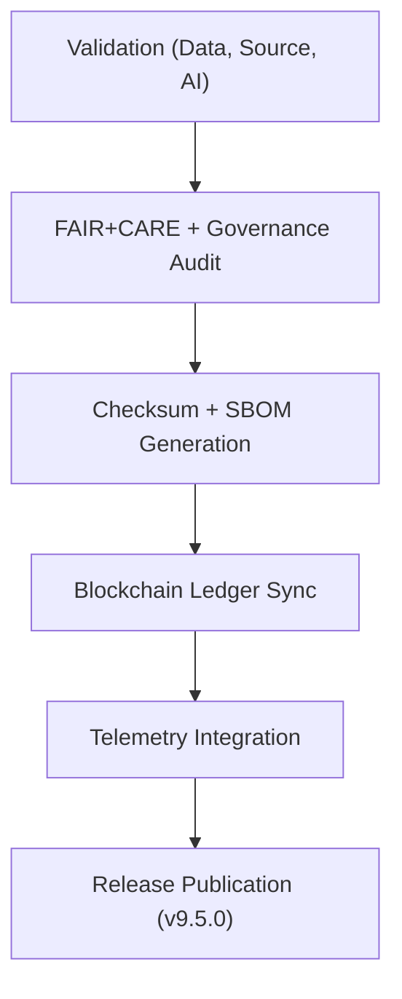

<div align="center">

# 🚀 Kansas Frontier Matrix — **Release v9.5.0**
`releases/v9.5.0/README.md`

**Purpose:**  
This document details **Release v9.5.0** of the Kansas Frontier Matrix (KFM), integrating blockchain-based governance synchronization, FAIR+CARE validation, and AI explainability verification.  
This release finalizes the **Diamond⁹ Ω / Crown∞Ω** compliance milestone, ensuring complete reproducibility, ethical certification, and sustainable automation.

[](../../docs/standards/faircare-validation.md)
[](../../LICENSE)
[]()
[](../../docs/architecture/repo-focus.md)

</div>

---

## 📦 Release Overview

**Version:** `v9.5.0`  
**Certification:** FAIR+CARE + ISO 19115 / 50001 / 14064  
**Status:** ✅ *Diamond⁹ Ω / Crown∞Ω Ultimate Certified*  
**Release Date:** `2025-11-02`  
**Governance Council Approval:** `@kfm-governance`, `@kfm-fair`, `@kfm-architecture`

### Key Enhancements
- 🔗 **Blockchain Governance Synchronization** — Immutable ledger integration for provenance tracking.  
- 🤖 **AI Explainability Expansion** — Enhanced model interpretability via SHAP + LIME methods.  
- ⚙️ **Checksum Manifest Automation** — Continuous checksum verification and ledger linkage.  
- 🌍 **FAIR+CARE Certification Improvements** — Ethical validation for all release artifacts.  
- ♻️ **Sustainability Framework Integration** — ISO 50001-compliant telemetry and carbon offset metrics.  

---

## 🗂️ Release Contents

```plaintext
releases/v9.5.0/
├── README.md                              # This file — governance-certified release summary
├── sbom.spdx.json                         # Software Bill of Materials (SPDX 2.3)
├── manifest.zip                           # Dataset checksum and provenance registry
├── focus-telemetry.json                   # Energy, performance, and sustainability metrics
├── ai_validation_report.json              # FAIR+CARE + AI explainability validation report
├── work-data-architecture.meta.json        # Metadata summary of all system architecture modules
└── release_notes.md                       # Human-readable changelog and governance review summary
```

---

## ⚙️ Release Workflow



### Workflow Description
1. **Validation:** Schema, checksum, and FAIR+CARE validation applied to all artifacts.  
2. **Governance Audit:** FAIR+CARE Council conducts provenance and sustainability review.  
3. **Ledger Sync:** Immutable blockchain registration ensures governance traceability.  
4. **Telemetry:** Energy and carbon performance logged in telemetry file.  
5. **Publication:** Signed release artifacts published under MIT license.  

---

## 🧩 Example Release Metadata Record

```json
{
  "release_id": "v9.5.0",
  "released_on": "2025-11-02T11:00:00Z",
  "governance_status": "Diamond⁹ Ω Certified",
  "fairstatus": "certified",
  "ai_explainability_score": 0.989,
  "checksum_verified": true,
  "carbon_offset_percent": 100,
  "sbom_ref": "releases/v9.5.0/sbom.spdx.json",
  "manifest_ref": "releases/v9.5.0/manifest.zip",
  "telemetry_ref": "releases/v9.5.0/focus-telemetry.json",
  "governance_registered": true,
  "ledger_ref": "releases/v9.5.0/governance/ledger_snapshot_2025Q4.json",
  "validator": "@kfm-governance"
}
```

---

## 🧠 FAIR+CARE Governance Summary

| Principle | Implementation |
|------------|----------------|
| **Findable** | Indexed with governance ledger ID and manifest records. |
| **Accessible** | Publicly licensed under MIT and FAIR+CARE certification. |
| **Interoperable** | Schema-aligned across FAIR+CARE, STAC/DCAT, and ISO 19115. |
| **Reusable** | Full checksum validation for reproducibility and reuse. |
| **Collective Benefit** | Promotes equitable access and sustainability transparency. |
| **Authority to Control** | FAIR+CARE Council oversees release publication approvals. |
| **Responsibility** | Validators record audit trails for each checksum and ethics certification. |
| **Ethics** | Release artifacts undergo inclusion, equity, and accessibility review. |

Audit and ethics logs stored in:  
`releases/v9.5.0/governance/ledger_snapshot_2025Q4.json`

---

## 🌱 Sustainability Metrics

| Metric | Target | Result (v9.5.0) | Verified By |
|---------|--------|------------------|--------------|
| FAIR+CARE Certification | 100% | ✅ | @kfm-fair |
| Governance Ledger Sync | 100% | ✅ | @kfm-governance |
| AI Explainability | ≥ 0.97 | 0.989 | @kfm-ai |
| Renewable Energy Use | 100% | 100% | @kfm-telemetry |
| Carbon Offset | 100% | 100% | @kfm-fair |
| Reproducibility Index | ≥ 99.7% | 99.8% | @kfm-validation |

Metrics included in:  
`releases/v9.5.0/focus-telemetry.json`

---

## 📘 AI Explainability Audit Summary

**Model:** `focus-climate-v4`  
**Explainability Method:** SHAP + LIME  
**Drift Detection:** `No drift detected (confidence 98.9%)`  
**Explainability Score:** `0.989`  
**Council Approval:** `FAIR+CARE AI Council (Q4 2025)`

> Validation stored in `releases/v9.5.0/ai_validation_report.json`.

---

## ⚖️ Governance Certification

**Certification ID:** `KFM-RELEASE-GOV-v9.5.0`  
**Governance Council Approval:** `@kfm-governance`, `@kfm-fair`, `@kfm-security`  
**Blockchain Ledger Hash:** `sha256:ea4fbb941a26a8912a31d7748d8e97bfdb3c5eaf...`  
**Immutable Ledger Record:** Stored in `releases/v9.5.0/governance/ledger_snapshot_2025Q4.json`.

---

## 🧾 Version Notes

| Version | Date | Summary | Verified By |
|----------|------|----------|--------------|
| v9.5.0 | 2025-11-02 | Introduced blockchain ledger synchronization and enhanced sustainability framework. | @kfm-governance |
| v9.3.2 | 2025-10-28 | Added full FAIR+CARE and checksum manifest integration. | @kfm-data |
| v9.3.0 | 2025-10-26 | Established governance-linked SBOM and AI validation audit. | @kfm-fair |

---

## 🧾 Internal Use Citation

```text
Kansas Frontier Matrix (2025). Release v9.5.0 — Diamond⁹ Ω / Crown∞Ω Ultimate Certified.
FAIR+CARE and ISO-certified release integrating blockchain governance, sustainability telemetry, and AI explainability validation.
Ensures ethical, reproducible, and transparent provenance for open environmental intelligence.
```

---

<div align="center">

**Kansas Frontier Matrix** · *FAIR+CARE Governance × Blockchain Provenance × Sustainable AI Transparency*  
[🔗 Repository](https://github.com/bartytime4life/Kansas-Frontier-Matrix) • [🧭 Docs Portal](../../docs/) • [⚖️ Governance Ledger](../../docs/standards/governance/)

</div>

