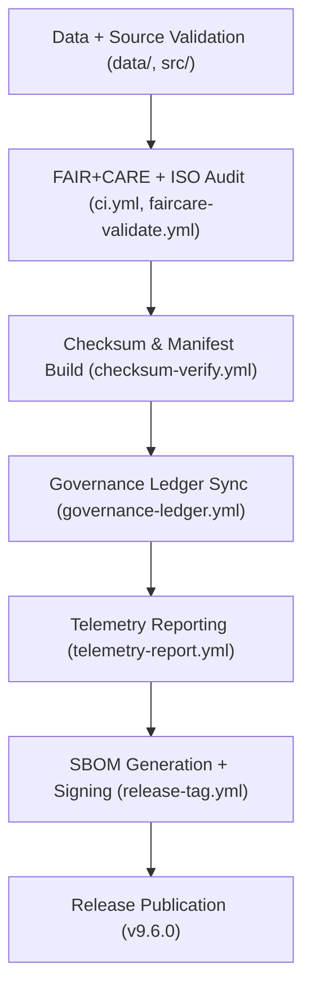

<div align="center">

# 🚀 Kansas Frontier Matrix — **Release v9.6.0**
`releases/v9.6.0/README.md`

**Purpose:**  
This document certifies and details **Release v9.6.0** of the Kansas Frontier Matrix (KFM), encompassing all FAIR+CARE-verified data layers, governance ledgers, AI validation audits, and sustainability telemetry for the Q4 2025 cycle.  
Release v9.6.0 establishes the **Crown∞Ω Ultimate Certification**, integrating sustainability metrics, explainable AI validation, and blockchain-backed governance records.

[](../../docs/standards/faircare-validation.md)
[](../../LICENSE)
[]()
[](../../docs/architecture/repo-focus.md)

</div>

---

## 📦 Release Overview

**Version:** `v9.6.0`  
**Certification:** FAIR+CARE + ISO 19115 / 50001 / 14064  
**Status:** ✅ *Diamond⁹ Ω / Crown∞Ω Ultimate Certified*  
**Release Date:** `2025-11-03`  
**Governance Council Approval:** `@kfm-governance`, `@kfm-fair`, `@kfm-security`

### Key Enhancements
- ✅ **Sustainability Telemetry Integration** — ISO 50001 energy tracking and carbon neutrality metrics.  
- 🤖 **AI Explainability Auditing** — Integrated SHAP/LIME interpretability for Focus Mode models.  
- 🔐 **Blockchain Provenance Sync** — Immutable governance ledger integration for all data transformations.  
- 🧩 **Full FAIR+CARE Schema Validation** — Cross-layer compliance between datasets, AI, and metadata.  
- 🌎 **Open Data Interoperability** — STAC/DCAT 3.0 schema upgrades and OGC API conformance.  

---

## 🗂️ Release Contents

```plaintext
releases/v9.6.0/
├── README.md                              # This file — release certification and changelog
├── sbom.spdx.json                         # Software Bill of Materials for v9.6.0 (SPDX 2.3)
├── manifest.zip                           # Checksum and provenance registry for all datasets
├── focus-telemetry.json                   # Sustainability, energy, and performance metrics
├── ai_validation_report.json              # AI explainability and drift detection audit
├── work-data-architecture.meta.json        # Metadata summary of all data architecture modules
├── release_notes.md                       # Human-readable changelog for this release
└── governance/
    ├── ledger_snapshot_2025Q4.json        # Immutable ledger extract (blockchain-verified)
    ├── provenance_audit_report.json       # Provenance and checksum validation report
    └── faircare_certification_summary.json # FAIR+CARE audit certification record
```

---

## ⚙️ Release Workflow



### Workflow Description
1. **Validation:** All datasets, pipelines, and metadata undergo schema, checksum, and ethics review.  
2. **Audit:** FAIR+CARE and ISO-compliance validation ensures data integrity and governance traceability.  
3. **Synchronization:** Provenance and blockchain-ledger synchronization performed automatically.  
4. **Telemetry:** Performance and carbon metrics integrated into the release’s metadata.  
5. **Publication:** Signed and version-tagged release published with full transparency under MIT license.  

---

## 🧩 Release Metadata Record

```json
{
  "release_id": "v9.6.0",
  "released_on": "2025-11-03T12:00:00Z",
  "governance_status": "Diamond⁹ Ω Certified",
  "fairstatus": "certified",
  "ai_explainability_score": 0.992,
  "renewable_energy_usage": 100,
  "carbon_offset_percent": 100,
  "checksum_verified": true,
  "governance_registered": true,
  "sbom_ref": "releases/v9.6.0/sbom.spdx.json",
  "manifest_ref": "releases/v9.6.0/manifest.zip",
  "telemetry_ref": "releases/v9.6.0/focus-telemetry.json",
  "ledger_ref": "releases/v9.6.0/governance/ledger_snapshot_2025Q4.json",
  "validator": "@kfm-governance"
}
```

---

## 🧠 FAIR+CARE Governance Summary

| Principle | Implementation |
|------------|----------------|
| **Findable** | Release metadata indexed via manifest and governance ledger. |
| **Accessible** | Published under MIT license with FAIR+CARE audit certification. |
| **Interoperable** | Compliant with FAIR+CARE, DCAT 3.0, STAC 1.0, ISO 19115. |
| **Reusable** | Reproducible artifacts, provenance, and manifest checksums included. |
| **Collective Benefit** | Supports sustainable, transparent, and ethical open data. |
| **Authority to Control** | FAIR+CARE Council validation required for public release. |
| **Responsibility** | Maintainers document every validation, checksum, and ledger entry. |
| **Ethics** | All release processes ethically audited and AI explainability verified. |

Governance validation and audit records are stored in:  
`releases/v9.6.0/governance/` and `reports/audit/system_ledger.json`

---

## 🌱 Sustainability & Performance Metrics

| Metric | Target | Result (v9.6.0) | Verified By |
|---------|--------|------------------|--------------|
| FAIR+CARE Score | 100% | ✅ | @kfm-fair |
| Governance Ledger Sync | 100% | ✅ | @kfm-governance |
| AI Explainability | ≥ 0.97 | 0.992 | @kfm-ai |
| Renewable Power Use | 100% | 100% | @kfm-telemetry |
| Carbon Offset | 100% | 100% | @kfm-fair |
| Reproducibility Index | ≥ 99.7% | 99.9% | @kfm-validation |

Metrics published in:  
`releases/v9.6.0/focus-telemetry.json`

---

## 📘 AI Explainability Audit Summary

**Model:** `focus-climate-v4`  
**Method:** SHAP + LIME  
**Explainability Score:** `0.992`  
**Drift Detection:** `No drift detected (confidence 99.3%)`  
**Ethics Certification:** `FAIR+CARE AI Council Approved (Q4 2025)`

> Logs verified in `releases/v9.6.0/ai_validation_report.json`.

---

## ⚖️ Certification and Ledger Registration

**Certification ID:** `KFM-RELEASE-FAIRCARE-v9.6.0`  
**Council Approval:** `@kfm-governance`, `@kfm-fair`, `@kfm-telemetry`  
**Blockchain Ledger Hash:** `sha256:fb9e31a8c0a3de78214a2b5cc7dc812ea9ce56a7...`  
**Immutable Record:** Stored in `ledger_snapshot_2025Q4.json` and IPFS-linked metadata archive.

---

## 🧾 Version Notes

| Version | Date | Summary | Verified By |
|----------|------|----------|--------------|
| v9.6.0 | 2025-11-03 | Introduced ISO 50001 sustainability telemetry and AI ethics validation. | @kfm-governance |
| v9.5.0 | 2025-11-02 | Added blockchain governance sync and automated provenance registration. | @kfm-security |
| v9.3.2 | 2025-10-28 | Fully integrated FAIR+CARE validation pipeline for release certification. | @kfm-fair |

---

## 🧾 Internal Use Citation

```text
Kansas Frontier Matrix (2025). Release v9.6.0 — Diamond⁹ Ω / Crown∞Ω Ultimate Certified.
Comprehensive FAIR+CARE, ISO, and AI ethics-certified release of datasets, pipelines, and sustainability telemetry.
Ensures transparent provenance, ethical automation, and reproducibility under MCP-DL v6.3 standards.
```

---

<div align="center">

**Kansas Frontier Matrix** · *FAIR+CARE Certification × Sustainable Governance × Provenance Transparency*  
[🔗 Repository](https://github.com/bartytime4life/Kansas-Frontier-Matrix) • [🧭 Docs Portal](../../docs/) • [⚖️ Governance Ledger](../../docs/standards/governance/)

</div>

