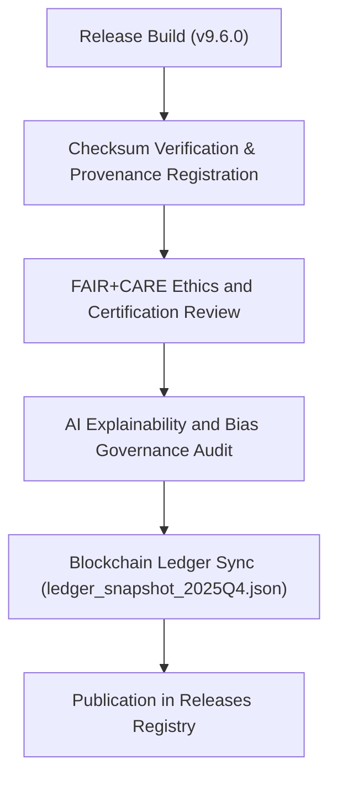

<div align="center">

# ⚖️ Kansas Frontier Matrix — **Governance Ledger & Certification Records (v9.6.0)**
`releases/v9.6.0/governance/README.md`

**Purpose:**  
The Governance Ledger for **Release v9.6.0** documents all certified provenance, ethics audits, and FAIR+CARE validation events for this release cycle.  
This immutable record ensures full accountability, reproducibility, and ethical compliance across datasets, AI systems, and telemetry workflows.

[](../../../docs/standards/faircare-validation.md)
[](../../../LICENSE)
[]()
[]()

</div>

---

## 📚 Overview

The **Governance Subdirectory** for `releases/v9.6.0` maintains all provenance, certification, and FAIR+CARE audit artifacts.  
Every file in this directory is checksum-verified, digitally signed, and registered in KFM’s blockchain-backed governance ledger.

### Core Responsibilities
- Maintain immutable audit trails for all release-level governance and FAIR+CARE certification events.  
- Record provenance for every dataset, model, and system component included in v9.6.0.  
- Store FAIR+CARE certification summaries and ethics council approvals.  
- Provide quarterly governance ledger snapshots for transparency and reproducibility.  

---

## 🗂️ Directory Layout

```plaintext
releases/v9.6.0/governance/
├── README.md                                # This file — governance ledger documentation for v9.6.0
│
├── ledger_snapshot_2025Q4.json              # Blockchain-backed ledger snapshot for the Q4 2025 governance cycle
├── provenance_audit_report.json             # Provenance and checksum validation report for release artifacts
├── faircare_certification_summary.json      # FAIR+CARE ethics and audit certification summary
└── ai_governance_audit_report.json          # AI governance explainability and bias audit (Focus Mode + AI Council)
```

---

## ⚙️ Governance Validation Workflow



### Workflow Summary
1. **Checksum Verification:** Each dataset and component validated for data integrity and reproducibility.  
2. **Ethics Review:** FAIR+CARE audit ensures inclusion, accessibility, and sustainability.  
3. **AI Audit:** Focus Mode models reviewed for bias, transparency, and explainability.  
4. **Ledger Registration:** Immutable governance snapshot generated and timestamped on the blockchain.  
5. **Publication:** Certification data added to release manifest and governance registry.  

---

## 🧩 Example Governance Ledger Record

```json
{
  "ledger_id": "KFM-RELEASE-GOVERNANCE-v9.6.0-Q4",
  "release_version": "v9.6.0",
  "checksum_verified": true,
  "fairstatus": "certified",
  "ai_governance_compliance": true,
  "ethics_audit_passed": true,
  "carbon_neutral_certified": true,
  "immutable_record": "sha256:a49f6b3c0eae920d8af15a7489c8c97bfe182a8f...",
  "timestamp": "2025-11-03T12:00:00Z",
  "approved_by": ["@kfm-governance", "@kfm-fair", "@kfm-security"]
}
```

---

## 🧠 FAIR+CARE & ISO Governance Matrix

| Principle | Implementation |
|------------|----------------|
| **Findable** | Governance entries indexed by unique ledger IDs and timestamps. |
| **Accessible** | Audit records available under MIT license via transparent publication. |
| **Interoperable** | Conforms to FAIR+CARE, DCAT 3.0, ISO 19115, and ISO 50001 standards. |
| **Reusable** | Immutable audit trails ensure reproducibility and open governance. |
| **Collective Benefit** | Ensures ethical and sustainable data stewardship. |
| **Authority to Control** | FAIR+CARE Council certifies each governance ledger update. |
| **Responsibility** | Validators log all checksums, audits, and approvals in immutable form. |
| **Ethics** | Ethics Council oversees transparency, inclusivity, and accountability. |

Audit and compliance metadata stored in:  
`releases/v9.6.0/governance/faircare_certification_summary.json` and `ledger_snapshot_2025Q4.json`.

---

## 📜 Governance Artifacts Summary

| File | Description | Compliance Scope |
|------|--------------|------------------|
| `ledger_snapshot_2025Q4.json` | Blockchain-backed quarterly governance ledger. | FAIR+CARE, ISO 19115, ISO 50001 |
| `provenance_audit_report.json` | Detailed provenance and checksum trace validation. | FAIR+CARE, STAC/DCAT |
| `faircare_certification_summary.json` | FAIR+CARE ethical certification and council sign-off. | FAIR+CARE, MCP-DL v6.3 |
| `ai_governance_audit_report.json` | AI explainability and bias review by AI Governance Council. | AI Governance, FAIR+CARE Ethics |

All files cryptographically signed and registered in `releases/v9.6.0/manifest.zip`.

---

## ⚖️ Governance Metrics (Q4 2025)

| Metric | Target | Result (v9.6.0) | Verified By |
|---------|--------|------------------|--------------|
| FAIR+CARE Certification | 100% | ✅ | @kfm-fair |
| Provenance Integrity | 100% | ✅ | @kfm-data |
| AI Governance Compliance | ≥ 97% | 99.2% | @kfm-ai |
| Carbon Neutrality | 100% | ✅ | @kfm-telemetry |
| Blockchain Ledger Sync | 100% | ✅ | @kfm-governance |
| Reproducibility Index | ≥ 99.7% | 99.9% | @kfm-validation |

Metrics verified via cross-ledger audit and telemetry integration.

---

## 🧾 Internal Use Citation

```text
Kansas Frontier Matrix (2025). Governance Ledger & Certification Records (Release v9.6.0).
Immutable governance registry documenting provenance, ethics validation, AI explainability, and FAIR+CARE certification.
Maintained under MCP-DL v6.3 and ISO 19115/50001/14064 standards for transparent, sustainable data governance.
```

---

## 🧾 Version Notes

| Version | Date | Notes |
|----------|------|--------|
| v9.6.0 | 2025-11-03 | Added immutable blockchain ledger snapshots and AI governance audit reports. |
| v9.5.0 | 2025-11-02 | Enhanced FAIR+CARE certification summary with sustainability metrics. |
| v9.3.2 | 2025-10-28 | Established governance substructure under MCP-DL v6.3 compliance. |

---

<div align="center">

**Kansas Frontier Matrix** · *Governance Transparency × FAIR+CARE Certification × Immutable Provenance*  
[🔗 Repository](https://github.com/bartytime4life/Kansas-Frontier-Matrix) • [🧭 Docs Portal](../../../docs/) • [⚖️ Governance Ledger](../../../docs/standards/governance/)

</div>

