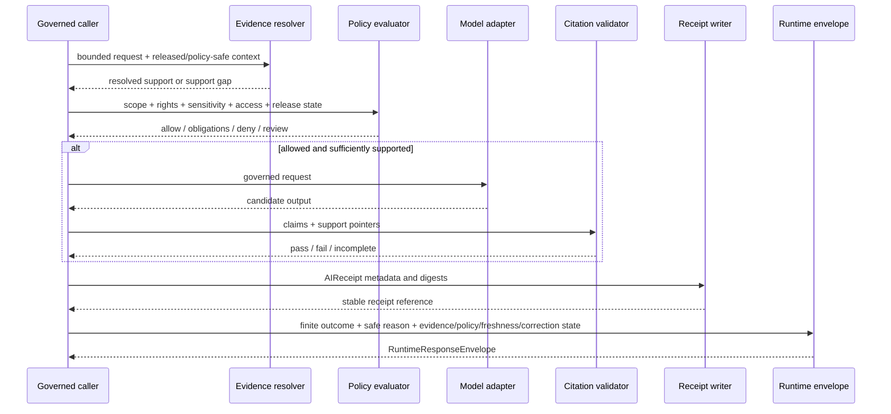

<!-- [KFM_META_BLOCK_V2]
doc_id: kfm://doc/runtime-ai-readme
title: runtime/AI/ — Governed AI Runtime Compatibility and Index Lane
type: readme; directory-readme; compatibility-index; governed-ai-runtime-boundary
version: v1.1
status: draft; compatibility-index; implementation-mixed; NEEDS VERIFICATION
policy_label: public
owners: OWNER_TBD — Runtime steward · Governed-AI steward · Policy steward · Evidence steward · Security steward · API steward · Test steward · Docs steward
created: NEEDS VERIFICATION — blank file was replaced by v1 on 2026-07-03
updated: 2026-07-15
current_path: runtime/AI/README.md
truth_posture: CONFIRMED target file, runtime responsibility root, adjacent runtime lanes, runtime contracts, paired AIReceipt and RuntimeResponseEnvelope schemas, runtime fixture-family index, and common schema fixture harness at the pinned evidence snapshot / CONFLICTED path canonicality because Directory Rules name lower-level runtime lanes but do not name capitalized runtime/AI as canonical / UNKNOWN executable children below runtime/AI, deployed model services, adapter implementations, policy enforcement, citation validation, receipt persistence, public-client wiring, CI results, and release state / NEEDS VERIFICATION retention or migration decision, CODEOWNERS enforcement, policy/ai path, validator wiring, model approvals, service exposure, correction propagation, and runtime-specific tests
evidence_snapshot:
  repository: bartytime4life/Kansas-Frontier-Matrix
  visibility: public
  base_ref: main
  base_commit: df9c0bd89191525e482d3ce7cec995adf172d2ee
  prior_blob: e92e1bdff164e46ac26cbd67bd6e37f234a65526
  prepared_under_prompt: KFM GitHub Repository Documentation Implementation Agent v3.1.0
related:
  - ../README.md
  - ../model_adapters/README.md
  - ../model_adapters/AdapterContract.md
  - ../mock/README.md
  - ../ollama/README.md
  - ../envelopes/README.md
  - ../../contracts/runtime/README.md
  - ../../contracts/runtime/ai_receipt.md
  - ../../contracts/runtime/runtime_response_envelope.md
  - ../../schemas/contracts/v1/runtime/ai_receipt.schema.json
  - ../../schemas/contracts/v1/runtime/runtime_response_envelope.schema.json
  - ../../fixtures/contracts/v1/runtime/README.md
  - ../../tests/schemas/test_common_contracts.py
  - ../../policy/runtime/README.md
  - ../../docs/doctrine/directory-rules.md
  - ../../docs/registers/DRIFT_REGISTER.md
tags: [kfm, runtime, ai, governed-ai, compatibility-index, evidence-bundle, policy, cite-or-abstain, model-adapters, ai-receipt, runtime-response-envelope, finite-outcomes, mock-first, no-direct-public-model]
notes:
  - "v1.1 applies the v3.1 repository-documentation implementation prompt and preserves the prior README's substantive boundaries."
  - "runtime/ is the confirmed responsibility root; runtime/AI remains a compatibility/index surface pending a governed placement decision."
  - "This README does not activate a model, approve a provider, expose an endpoint, establish policy, close evidence, validate citations, prove receipt persistence, authorize public rendering, or publish KFM material."
[/KFM_META_BLOCK_V2] -->

<a id="top"></a>

# `runtime/AI/` — Governed AI Runtime Compatibility and Index Lane

> **One-line purpose.** Route governed-AI runtime work to the responsibility lane that owns it while preserving one visible index for evidence, policy, adapters, receipts, envelopes, tests, security, correction, and public-client boundaries.

<p>
  
  
  
  
  
  
</p>

> [!IMPORTANT]
> `runtime/AI/` is **not** the canonical home for all AI implementation. It is a draft compatibility and navigation lane. New work should use the verified responsibility lane that owns it—normally [`runtime/model_adapters/`](../model_adapters/), [`runtime/mock/`](../mock/), [`runtime/ollama/`](../ollama/), [`runtime/envelopes/`](../envelopes/), [`contracts/runtime/`](../../contracts/runtime/), [`schemas/contracts/v1/runtime/`](../../schemas/contracts/v1/runtime/), [`policy/runtime/`](../../policy/runtime/), fixtures, tests, validators, receipt/proof roots, or release roots.

## Quick navigation

[Status](#status-and-evidence-boundary) · [Purpose](#purpose-and-bounded-scope) · [Placement](#repository-fit-and-placement) · [Routing](#responsibility-routing) · [Operating law](#governed-ai-runtime-operating-law) · [Flow](#governed-runtime-flow) · [Contracts](#verified-contract-and-schema-surfaces) · [Outcomes](#finite-runtime-outcomes) · [Security](#security-privacy-and-exposure) · [Testing](#testing-validation-and-no-network-posture) · [Runtime note](#minimal-runtime-note) · [Done](#definition-of-done) · [Maintenance](#maintenance-correction-and-rollback) · [Open verification](#open-verification-backlog) · [Evidence](#evidence-basis)

---

## Status and evidence boundary

| Surface | Status at the pinned snapshot | Consequence |
|---|---|---|
| `runtime/AI/README.md` | **CONFIRMED** | Target file exists; prior blob is recorded in the metadata block. |
| `runtime/` | **CONFIRMED canonical root** | Owns local runtime wiring, adapters, mocks, local model runtimes, service configuration notes, and envelope helpers. |
| Capitalized `runtime/AI/` | **CONFLICTED / NEEDS VERIFICATION** | The path exists and is indexed by `runtime/README.md`, but Directory Rules v1.4 do not name it as a canonical runtime sublane. Treat it as compatibility/index pending ADR, migration note, or maintainer decision. |
| `runtime/model_adapters/`, `mock/`, `ollama/`, `envelopes/` | **CONFIRMED documentation surfaces** | These lanes define the current lower-level runtime boundaries. |
| Runtime contracts and paired schemas | **CONFIRMED present; status PROPOSED** | `AIReceipt` and `RuntimeResponseEnvelope` have semantic contracts and JSON Schemas. Presence does not prove runtime execution. |
| Runtime fixtures and schema harness | **CONFIRMED present; NOT RUN for this edit** | Fixture-family docs and a schema test exist. No test or CI success is claimed here. |
| `policy/runtime/README.md` | **CONFIRMED stub** | No accepted runtime-policy implementation is established by the stub. |
| `policy/ai/README.md` | **UNKNOWN at the inspected path** | Some documents reference `policy/ai/`; do not treat it as accepted authority without inventory and placement review. |
| Executable AI services, adapters, receipt persistence, citation validation, client enforcement, CI, deployment, release | **UNKNOWN** | Documentation and schema presence are not operational proof. |

**Document authority:** runtime orientation only. Contracts, schemas, policy, EvidenceBundles, validation artifacts, receipts, tests, implementation code, release records, correction records, and steward decisions outrank this README.

---

## Purpose and bounded scope

This README helps maintainers answer two questions:

1. **Where does a governed-AI runtime artifact belong?**
2. **What evidence and controls are required before an AI-mediated result may reach a governed client?**

It covers placement, adapter modes, finite outcomes, evidence and citation posture, receipts, envelopes, safe failure, no-network testing, security, correction, and rollback.

It does **not** define model behavior, canonical object meaning, JSON Schema, policy rules, source authority, evidence admissibility, release approval, public API routes, UI behavior, provider terms, or a final migration decision for `runtime/AI/`.

---

## Repository fit and placement

Directory Rules assign local runtime wiring to `runtime/` and identify these canonical sublanes:

```text
runtime/
├── README.md
├── AI/                  # this file; compatibility/index lane
├── local/               # local runtime wiring
├── model_adapters/      # provider-neutral adapter boundary
├── mock/                # deterministic mock runtime
├── ollama/              # local Ollama runtime
├── service_configs/     # non-secret service configuration notes
└── envelopes/           # finite-outcome envelope helpers
```

> [!WARNING]
> Do not expand `runtime/AI/` into a parallel home for adapters, contracts, schemas, policy, fixtures, receipts, proofs, release objects, or public endpoints. A move, rename, or retirement requires inventory, inbound-link checks, a reversible migration plan, and an ADR or drift action when authority changes.

### Placement determination

| Question | Determination |
|---|---|
| Is `runtime/` the correct responsibility root? | **CONFIRMED.** |
| Is `runtime/AI/` confirmed canonical? | **No. CONFLICTED / NEEDS VERIFICATION.** |
| Does this README create a new authority root? | **No.** It routes to existing roots. |
| Does this update require an ADR? | **No** for a README-only compatibility clarification. **Yes or NEEDS VERIFICATION** for migration, rename, deletion, or authority reassignment. |
| Is the drift register already decisive? | **No.** The inspected register does not resolve this path. |

---

## Responsibility routing

| Work item | Correct home | Role of this lane |
|---|---|---|
| Provider-neutral adapter card or port note | [`runtime/model_adapters/`](../model_adapters/) | Link and summarize only. |
| Descriptive adapter boundary | [`runtime/model_adapters/AdapterContract.md`](../model_adapters/AdapterContract.md) until canonical contracts settle naming | Explain compatibility status only. |
| Deterministic mock runtime note | [`runtime/mock/`](../mock/) or accepted mock-adapter sublane | Route readers; do not duplicate. |
| Local Ollama runtime note | [`runtime/ollama/`](../ollama/) | Route readers; no model weights or secrets. |
| Envelope implementation note | [`runtime/envelopes/`](../envelopes/) | Route readers; do not redefine envelopes. |
| Semantic meaning | [`contracts/runtime/`](../../contracts/runtime/) | Link canonical contract. |
| Machine-checkable shape | [`schemas/contracts/v1/runtime/`](../../schemas/contracts/v1/runtime/) | Link canonical schema. |
| Allow, deny, restrict, or abstain rules | [`policy/runtime/`](../../policy/runtime/) or accepted policy family | Link policy authority; do not author policy here. |
| Valid and invalid examples | [`fixtures/contracts/v1/runtime/`](../../fixtures/contracts/v1/runtime/) | Link fixture family. |
| Executable schema tests | [`tests/schemas/`](../../tests/schemas/) | Link test and report actual result. |
| Validator implementation | `tools/validators/` | Link only after path and wiring are verified. |
| Receipt instance | accepted `data/receipts/` family | Link by stable reference; do not copy payloads here. |
| EvidenceBundle or proof | accepted evidence/proof roots | Link through governed references. |
| Release, correction, withdrawal, rollback | `release/` | Never decide or store authority here. |
| Public API, UI, map, or Focus Mode behavior | governed app/API/UI/package roots | Clients use governed interfaces only. |
| Migration or supersession note for `AI/` | `runtime/AI/` while retained | Appropriate compatibility content. |

### What belongs here

- This compatibility/index README.
- A bounded, evidence-pinned migration or supersession note.
- A non-authoritative inventory of linked runtime surfaces.
- Correction notes for links, status, or role descriptions in this lane.

### What does not belong here

- Adapter implementations, model weights, runtime binaries, or provider SDK forks.
- Canonical contracts, schemas, policy rules, fixtures, tests, or validator code.
- RAW, WORK, QUARANTINE, PROCESSED, CATALOG, TRIPLET, or PUBLISHED payloads.
- Source records, EvidenceBundles, receipts, proofs, catalogs, release manifests, or correction records.
- API keys, tokens, `.env` files, private URLs, signing material, private prompts, protected retrieved content, chain-of-thought, or model internals.
- Direct model endpoints, public API routes, UI components, MapLibre layers, graph projections, or search indexes.
- Generated text presented as evidence, policy, review, release, correction, rollback, legal conclusion, or public truth.

---

## Governed AI runtime operating law

1. **AI is interpretive.** Model output is never root truth, evidence, policy, review, release, correction, rollback, or publication authority.
2. **Evidence comes first.** Evidence-dependent claims require governed support; unresolved `EvidenceRef` support routes to `ABSTAIN` or another safe outcome.
3. **Policy precedes execution.** Rights, sensitivity, access, release, freshness, and correction posture may deny or narrow a request before an adapter runs.
4. **Adapters remain provider-neutral where practical.** Mock, local, and provider-backed runtimes preserve a stable governed boundary.
5. **Mock-first is the default.** Deterministic fixtures prove outcomes and negative paths before live model integration is treated as usable.
6. **Cite-or-abstain is mandatory.** Citation validation is separate from model generation.
7. **Outcomes are finite.** Runtime results use `ANSWER`, `ABSTAIN`, `DENY`, or `ERROR`; free text alone is not a governed response.
8. **AI-mediated runs are receipted.** `AIReceipt` records accountable run metadata and digests without storing private reasoning or protected payloads.
9. **Clients receive an envelope.** `RuntimeResponseEnvelope` carries outcome, reason, evidence refs, policy state, freshness, and correction state.
10. **No direct public model traffic.** Local and provider-backed models stay behind the governed API/trust membrane.
11. **Private reasoning is not proof.** Do not store chain-of-thought, hidden prompts, private model internals, or sensitive retrieved content as evidence.
12. **Publication remains separate.** A successful run, receipt, envelope, commit, pull request, or deployment does not publish a KFM claim.

---

## Governed runtime flow



Safe short form:

```text
bounded request
  -> resolve governed evidence
  -> evaluate policy
  -> run allowed adapter, if permitted
  -> validate citations, if answer-like
  -> emit ANSWER | ABSTAIN | DENY | ERROR
  -> emit AIReceipt
  -> emit RuntimeResponseEnvelope
  -> governed caller decides what may be rendered
```

---

## Verified contract and schema surfaces

### `AIReceipt`

The verified schema requires:

```text
id
run_id
adapter
model_ref
inputs_digest
outputs_digest
policy_decision_ref
citation_validation_ref
outcome
```

`inputs_digest` and `outputs_digest` use `sha256:<64 lowercase hex>`; `outcome` is `ANSWER | ABSTAIN | DENY | ERROR`; additional properties are closed.

`AIReceipt` records accountability for an AI-mediated step. It does not prove that output is true, cited, policy-safe, released, or publishable, and it must not store raw prompts, protected evidence, secrets, credentials, or chain-of-thought.

### `RuntimeResponseEnvelope`

The verified schema requires:

```text
id
spec_hash
version
issued_at
outcome
reason_code
evidence_refs
policy_state
freshness
correction_state
```

The envelope is the governed client-facing trust boundary. It does not store raw evidence or grant permission beyond its finite outcome and obligations. Clients must not invent an answer after `ABSTAIN`, render restricted payload after `DENY`, or infer truth from `ERROR`.

### Contract limits

- Contract and schema status is currently **PROPOSED**.
- Validator paths named by schemas require wiring verification.
- Runtime policy is not established by the current policy stub.
- Fixture presence does not prove complete coverage.
- No runtime implementation, receipt persistence, client enforcement, or CI success is claimed by this README.

---

## Finite runtime outcomes

| Outcome | Use when | Required behavior |
|---|---|---|
| `ANSWER` | Scope is allowed, evidence is sufficient, policy permits response, and required citation validation passes. | Return only supported content with evidence, obligations, receipt, and correction posture. |
| `ABSTAIN` | Evidence, citation, source authority, freshness, scope, or confidence is insufficient. | Explain the support gap safely; do not guess. |
| `DENY` | Policy, rights, sensitivity, access, consent, release, or governance forbids response. | Return safe reason codes without exposing protected content. |
| `ERROR` | Adapter, dependency, validation, configuration, envelope, or runtime failure prevents safe completion. | Fail closed, preserve audit linkage, and do not imply truth or permission. |

Unknown, missing, or malformed outcome values must not be treated as success.

---

## Security, privacy, and exposure

> [!CAUTION]
> Local execution is not automatically safe. Local and provider-backed runtimes require the same evidence, policy, citation, finite-outcome, receipt, access, and correction controls.

Required posture:

- no direct public model endpoint;
- no ordinary public-path access to RAW, WORK, QUARANTINE, unpublished candidates, canonical/internal stores, credentials, or direct source-system side effects;
- least-privilege adapter tools and explicit tool allowlists;
- deny-by-default handling for sensitive, restricted, or unsupported requests;
- no secrets, tokens, private `.env`, model weights, signing keys, or private URLs in Git;
- no chain-of-thought or hidden reasoning in receipts, logs, fixtures, or public diagnostics;
- safe reason codes that do not leak protected content or precise sensitive locations;
- timeouts, bounded retries, circuit breaking, and explicit degraded-state behavior;
- provider privacy, retention, egress, attribution, rights, and incident posture reviewed before activation;
- logs treated as operational aids, not the only trust record.

A runtime is not public-callable until the governed API boundary, policy checks, evidence resolution, citation checks, receipt and envelope emission, client enforcement, security review, and release posture are verified together.

---

## Testing, validation, and no-network posture

The confirmed schema fixture harness includes the `runtime` family and validates matching valid/invalid fixtures under:

```text
schemas/contracts/v1/runtime/*.schema.json
fixtures/contracts/v1/runtime/<schema_name>/{valid,invalid}/
```

Repository-grounded command:

```bash
python -m pytest -q tests/schemas/test_common_contracts.py
```

**Status for this README change:** `NOT RUN`. This is a Markdown-only API implementation; no executable repository test was run in the authoring environment.

Minimum test layers for an active governed-AI runtime:

| Layer | Minimum proof |
|---|---|
| Schema | Valid and invalid `AIReceipt` and `RuntimeResponseEnvelope` fixtures. |
| Finite outcomes | Deterministic `ANSWER`, `ABSTAIN`, `DENY`, and `ERROR` cases. |
| Evidence | Unresolved, stale, corrected, withdrawn, and insufficient-support cases. |
| Policy | Allow, allow-with-obligations, deny, restricted, and missing-policy fail-closed cases. |
| Citation | Valid, missing, mismatched, unsupported, and overbroad citation cases. |
| Adapter | Mock/local/provider parity at the governed boundary. |
| Security | Prompt injection, unauthorized tools, secret leakage, protected data, timeout, retry, and direct-endpoint denial. |
| Client boundary | UI/API/map honors envelope outcomes, obligations, freshness, and correction state. |
| Receipts | Digests, refs, immutability/supersession, retrieval, and sensitive-field exclusion. |
| Correction and rollback | Affected responses and receipts become visibly stale, superseded, withdrawn, or rollback-affected. |

No-network fixtures are the default for pull-request validation. Live provider tests, when allowed, must be separately activated, rate-limited, secret-safe, non-publishing, and clearly excluded from deterministic baseline claims.

A passing schema suite proves shape-level fixture behavior only. It does not prove policy correctness, evidence resolution, citation validity, provider behavior, safe public exposure, receipt persistence, release readiness, or operational security.

---

## Minimal runtime note

Use lower-case filenames even while this compatibility lane remains capitalized:

```text
<YYYY-MM-DD>_<runtime-scope>_runtime-note.md
```

Template:

```markdown
# <runtime-note-id>

## Status
DRAFT / READY_FOR_REVIEW / ACTIVE / HELD / SUPERSEDED / RETIRED

## Canonical home
<runtime/model_adapters/ | runtime/mock/ | runtime/ollama/ | runtime/envelopes/ | other verified path>

## Runtime scope and mode
<bounded purpose> · <mock | local | provider-backed | other>

## Governed support pointers
- Contract: <verified path or N/A>
- Schema: <verified path or N/A>
- Policy: <verified path or N/A>
- EvidenceRef / EvidenceBundle: <stable ref or N/A>
- Citation validation: <stable ref or N/A>
- AIReceipt: <stable ref or N/A>
- RuntimeResponseEnvelope: <stable ref or N/A>
- Fixture / test / validator: <verified path or N/A>

## Expected finite outcomes
ANSWER / ABSTAIN / DENY / ERROR / N/A

## Security and boundary notes
<no secrets; exposure posture; allowed tools; what this runtime must not become>

## Reviewer and date
<verified steward or OWNER_TBD> · <YYYY-MM-DD>

## Follow-up
<open verification items or none>
```

Do not store operational payloads, secrets, protected evidence, or private reasoning in runtime notes.

---

## Definition of done

A governed-AI runtime integration is not done until:

- [ ] its canonical lane is confirmed and no parallel authority is created;
- [ ] bounded input and output contracts and schemas are identified;
- [ ] evidence support and cite-or-abstain behavior are enforced;
- [ ] policy, rights, sensitivity, access, release, freshness, and correction posture are enforced;
- [ ] all four finite outcomes have deterministic negative and positive coverage;
- [ ] mock-first behavior passes before live/provider behavior is relied on;
- [ ] adapter/model references and configuration are reviewable without exposing secrets;
- [ ] citation validation is separate and failure routes safely;
- [ ] `AIReceipt` and `RuntimeResponseEnvelope` are emitted, validated, retrievable, and non-authoritative;
- [ ] clients enforce envelope outcomes and obligations;
- [ ] no direct public model or raw/canonical-store path exists;
- [ ] observability is useful without storing protected content or private reasoning;
- [ ] correction, supersession, deactivation, incident, and rollback behavior is documented and tested;
- [ ] repository-native checks and trusted CI pass, or exceptions are explicitly reviewed;
- [ ] release review remains separate from runtime implementation review.

---

## Maintenance, correction, and rollback

Review this README when Directory Rules, runtime lane inventory, adapter naming, runtime contracts/schemas, policy, evidence resolution, citation validation, fixtures/tests/validators, model admission, public-client integration, receipt persistence, security/exposure, correction, or rollback changes.

When this README is wrong or stale:

1. identify the affected claim, link, role, or path;
2. verify controlling repository evidence and doctrine;
3. update the compatibility map without redefining canonical authority here;
4. preserve forward and backward links for superseded paths or objects;
5. add a drift entry or ADR when placement or authority changes;
6. update verified inbound indexes within scope;
7. record validation and rollback in the pull request or accepted correction record.

If `runtime/AI/` is retired, inventory every child, classify its authority, use history-preserving moves, update inbound links, leave a bounded compatibility pointer when required, and document rollback. Do not create a second AI root or delete the lane without explicit authority.

Rollback for this revision is a transparent revert of the single documentation commit or restoration of prior blob `e92e1bdff164e46ac26cbd67bd6e37f234a65526` on the review branch. Rollback does not decide the final canonical path.

---

## Open verification backlog

### Placement and ownership

- [ ] Decide whether `runtime/AI/` remains an index, becomes pointer-only, or is migrated.
- [ ] Determine whether the conflict needs a drift entry, migration note, or ADR.
- [ ] Confirm CODEOWNERS enforcement and actual reviewer teams.
- [ ] Inventory all children and inbound links before any move.

### Contracts, schemas, and policy

- [ ] Settle canonical input naming and the relationship among `DecisionEnvelope`, `RuntimeResponseEnvelope`, and `PolicyDecision`.
- [ ] Verify every runtime schema against its contract, fixtures, validators, and tests.
- [ ] Verify named validator files and CI wiring.
- [ ] Replace the runtime-policy stub only through the policy root's review process.
- [ ] Determine whether `policy/ai/` is accepted, missing, or stale.
- [ ] Define controlled reason, policy, freshness, correction, and obligation vocabularies.

### Runtime, evidence, and security

- [ ] Inventory executable adapters, provider integrations, service configs, model references, and deployment paths.
- [ ] Confirm approved models and uses; availability is not approval.
- [ ] Verify no direct public model or ordinary raw/canonical-store path exists.
- [ ] Verify prompt-injection, tool authorization, secret hygiene, sensitive-output, timeout, retry, and fallback controls.
- [ ] Verify EvidenceRef-to-EvidenceBundle resolution and citation-validation negative cases.
- [ ] Verify receipt persistence, immutability/supersession, correction propagation, and client enforcement.

### Tests, CI, and operations

- [ ] Run the common schema fixture suite and record the exact commit/result.
- [ ] Inventory runtime, API, policy, security, integration, client-boundary, and correction tests.
- [ ] Verify workflow triggers, permissions, branch-protection checks, and generated reports for runtime/AI changes.
- [ ] Define activation, deactivation, incident, correction, and rollback runbooks for live adapters.

---

## Evidence basis

| Evidence | Status | Supports | Limitation |
|---|---|---|---|
| [`Directory Rules`](../../docs/doctrine/directory-rules.md) | **CONFIRMED doctrine** | `runtime/` responsibility, canonical sublanes, governed API boundary, no direct public model traffic or raw/canonical access. | Does not prove implementation. |
| [`runtime/README.md`](../README.md) | **CONFIRMED repository documentation** | Current root and `AI/` compatibility/index posture. | Does not prove runtime behavior. |
| Adjacent runtime READMEs and adapter note | **CONFIRMED repository documentation** | Adapter, mock, Ollama, envelope, and interface boundaries. | Draft documentation; implementation remains mixed/unverified. |
| Runtime contracts and paired schemas | **CONFIRMED present; object status PROPOSED** | `AIReceipt` and `RuntimeResponseEnvelope` meaning and machine shape. | Does not prove policy or execution. |
| Runtime fixture README and schema test | **CONFIRMED code/docs; NOT RUN** | Fixture layout and schema harness. | Does not prove integration, security, or client behavior. |
| Runtime policy README | **CONFIRMED stub** | Placeholder exists. | No accepted policy behavior. |
| Drift register | **CONFIRMED current register** | No inspected entry resolves this path. | Absence does not settle the conflict. |
| Attached v3.1 prompt | **CONFIRMED task input** | Repository preflight, evidence labels, README profile, validation, PR, concurrency, correction, and no-truncation discipline. | Does not prove implementation. |

---

## Changelog

### v1.1 — 2026-07-15

- Preserved the prior AI-is-interpretive, finite-outcome, receipt, envelope, evidence, policy, and no-chain-of-thought boundaries.
- Clarified `runtime/AI/` as a compatibility/index lane rather than a parallel implementation authority.
- Added pinned evidence, Directory Rules placement, responsibility routing, verified schema fields, mock-first testing, security, failure, definition-of-done, correction, supersession, rollback, and verification guidance.
- Kept executable runtime, policy, citation, receipt persistence, CI, public-client, and release claims explicitly unverified.

### v1 — 2026-07-03

- Replaced a blank file with the initial governed-AI runtime README.

## Last reviewed

| Field | Value |
|---|---|
| Last reviewed | 2026-07-15 |
| Review status | Draft compatibility/index README; implementation and canonical-path decision remain under verification. |
| Next review trigger | Placement decision, runtime lane migration, adapter inventory, contract/schema/policy update, citation validator, receipt persistence, security/exposure, client integration, correction/rollback, or first verified live runtime activation. |
| Rollback target | Prior blob `e92e1bdff164e46ac26cbd67bd6e37f234a65526` on the scoped review branch. |

<p align="right"><a href="#top">Back to top</a></p>
