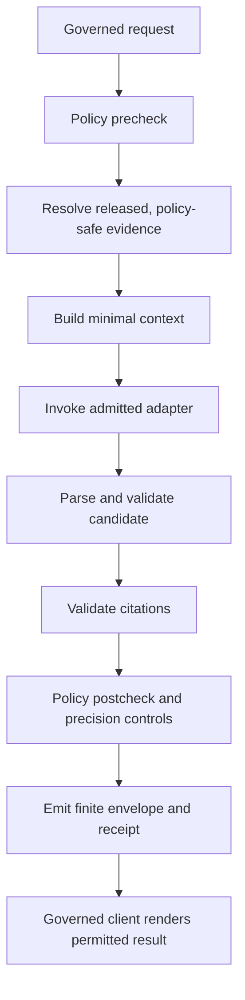

<!-- [KFM_META_BLOCK_V2]
doc_id: kfm://doc/runtime-ai-readme
title: runtime/AI/ — Governed AI Runtime Compatibility Index
type: readme
version: v1.2
status: draft; compatibility-index; bounded-component-evidence; end-to-end-hold
policy_label: public
owners:
  - "@bartytime4life — confirmed CODEOWNERS review route for runtime/"
  - "NEEDS VERIFICATION — independent runtime, governed-AI, policy, evidence, citation, security, privacy, test, and operations stewards"
created: 2026-07-03
updated: 2026-09-02
current_path: runtime/AI/README.md
owning_root: runtime/
responsibility: "Preserve a compatibility and navigation index for governed-AI runtime concerns without becoming a second architecture, contract, schema, policy, evidence, receipt, release, application, or publication authority."
canonical_relationship: "runtime/AI/ is a non-normalized compatibility lane. Human subsystem architecture belongs under docs/architecture/governed-ai/; provider-neutral runtime adapter implementation belongs under runtime/model_adapters/; all other artifacts route by responsibility."
directory_authority: "docs/doctrine/directory-rules.md v2.0.0-draft.1, adopted by ADR-0029"
truth_posture: "CONFIRMED runtime/ is a canonical internal root; runtime/AI contains only this README and .gitkeep and is documented as a compatibility/index lane; a bounded deterministic MockAdapter, runtime envelope helpers, AIReceipt candidate builders, and component tests exist; the Ollama adapter and AI worker remain placeholders; the inspected Governed API route registry has no AI or Focus route; and no end-to-end governed-AI operation or public answer path is established / PROPOSED the linked request flow and future integration gates / UNKNOWN deployed private services, provider credentials, operational policy/evidence/citation composition, durable receipt storage, correction propagation, and runtime release state / NEEDS VERIFICATION the final runtime/AI disposition and independent stewardship"
evidence_snapshot: "bartytime4life/Kansas-Frontier-Matrix main@d7199eb20f9b470413ecaf48e9a9a03695202917; target_prior_blob=f2d38470f458ebe8775e069d251c88757dab07e5; runtime_root_blob=e6843df941a57ca09159083d89ed5952c464ae72; directory_rules_blob=fd49a0b83e55cef52c1124281f093e263526898d; architecture_blob=e043c58f7cf65fa8a6d729e7f7cf33607235b70a; mock_adapter_blob=04d37e59b14c9e3b85126cb3380b6221b44e26d1; ollama_adapter_blob=1769a719d6a6df53e001abbc4c67ad486ab5c944"
inspection_boundary: "Read the complete target; runtime and runtime/AI inventories; Directory Rules v2 and ADR-0029; the runtime root and machine projection; governed-AI architecture and compatibility pages; adapter code and docs; runtime contracts, schemas, fixtures, policy docs, Governed API routes and stubs; AIReceipt candidate construction; CODEOWNERS; and open-PR search. No model daemon, provider endpoint, credential, deployed service, live policy evaluator, authoritative evidence service, composed citation service, durable receipt store, release environment, rollback drill, or public AI operation was exercised."
related:
  - ../README.md
  - ../model_adapters/README.md
  - ../model_adapters/AdapterContract.md
  - ../mock/README.md
  - ../ollama/README.md
  - ../envelopes/README.md
  - ../../docs/architecture/governed-ai/README.md
  - ../../docs/governed-ai/README.md
  - ../../docs/doctrine/ai-as-assistant.md
  - ../../contracts/runtime/README.md
  - ../../contracts/runtime/decision_envelope.md
  - ../../contracts/runtime/ai_receipt.md
  - ../../contracts/runtime/runtime_response_envelope.md
  - ../../schemas/contracts/v1/runtime/README.md
  - ../../policy/runtime/README.md
  - ../../fixtures/contracts/v1/runtime/README.md
  - ../../apps/governed-api/src/ai/README.md
  - ../../release/README.md
tags: [kfm, runtime, ai, governed-ai, compatibility-index, model-adapters, finite-outcomes, evidence, policy, citations, ai-receipt, runtime-response-envelope, mock-first, no-direct-public-model]
notes:
  - "v1.2 replaces stale Directory Rules v1.4 and July 2026 evidence claims with current Directory Rules v2 placement and bounded component evidence."
  - "This README does not activate a provider, expose an endpoint, validate a live citation, establish policy, emit or persist a receipt, release a capability, or publish KFM material."
[/KFM_META_BLOCK_V2] -->

<a id="top"></a>

# `runtime/AI/` — Governed AI Runtime Compatibility Index

`runtime/AI/` is a compatibility and navigation lane. It helps contributors find
the current owner of each governed-AI concern; it is not a home for new runtime
implementation or a second governed-AI architecture authority.

> [!IMPORTANT]
> Start with the [governed-AI architecture landing page](../../docs/architecture/governed-ai/)
> for subsystem design and [`runtime/model_adapters/`](../model_adapters/) for
> provider-neutral runtime adapter work. Route contracts, schemas, policy,
> evidence, receipts, applications, tests, and release records to their owning
> responsibility roots.

## Quick navigation

[Status and placement](#status-and-placement) ·
[Purpose](#purpose-audience-and-non-goals) ·
[Routing](#responsibility-routing) ·
[Current evidence](#current-bounded-repository-evidence) ·
[Flow](#governed-runtime-flow) ·
[Contracts](#contracts-schemas-and-finite-outcomes) ·
[Security](#security-rights-sensitivity-and-exposure) ·
[Validation](#validation-and-test-posture) ·
[Change guide](#contributor-change-guide) ·
[Maintenance](#maintenance-correction-and-rollback) ·
[Open work](#open-verification) ·
[References](#reference-map)

## Status and placement

| Surface | Current repository-grounded state | Consequence |
|---|---|---|
| `runtime/` | Canonical, internal, versioned responsibility root under Directory Rules v2 and the `root.runtime` machine projection | Runtime composition and local adapters belong under this root; deployable applications, data instances, and release decisions do not |
| `runtime/AI/` | Contains only `.gitkeep` and this README | No executable AI implementation exists in this lane |
| Placement class | Existing non-normalized compatibility/index lane | Keep it discoverable, but do not add independent canonical authority |
| Human subsystem architecture | [`docs/architecture/governed-ai/`](../../docs/architecture/governed-ai/) is the active architecture landing page | Architecture guidance should be maintained there |
| Provider-neutral adapters | [`runtime/model_adapters/`](../model_adapters/) is the canonical adapter lane | New adapter implementation and adapter-local documentation go there |
| Review routing | [CODEOWNERS](../../.github/CODEOWNERS) routes `/runtime/` to `@bartytime4life` | Routing is confirmed; independent stewardship, approval, and effective protection remain separate verification questions |
| End-to-end governed AI | Not established | Do not claim a public AI answer path, admitted provider, operational policy/evidence/citation composition, or release |

Directory Rules v2 names the normalized runtime children `local/`,
`model_adapters/`, `mock/`, `ollama/`, `envelopes/`, `service_configs/`, and
`health/`. The current runtime root documents `AI/` as compatibility-only and
records the missing `health/` lane as a separate conformance gap. Neither fact
authorizes this README update to move, delete, or create runtime paths.

## Purpose, audience, and non-goals

This README is for maintainers reviewing or extending governed-AI runtime work.
It answers:

1. Which responsibility root owns a proposed artifact?
2. What bounded implementation evidence exists today?
3. Which evidence, policy, citation, receipt, security, and release gates remain
   necessary before a result can reach a governed client?

This README does not:

- define AI doctrine or subsystem architecture;
- define semantic contracts, JSON Schema, policy rules, or source authority;
- select or approve a provider, model, prompt, tool, or network capability;
- create an API route, adapter, worker, evidence service, citation service, or
  receipt store;
- decide promotion, review, release, deployment, correction, withdrawal,
  rollback, or publication;
- prove operational behavior from documentation, schemas, fixtures, tests,
  commits, pull requests, merges, or deployments alone.

## Responsibility routing

| Concern | Owning surface | Rule for this lane |
|---|---|---|
| Human governed-AI architecture | [`docs/architecture/governed-ai/`](../../docs/architecture/governed-ai/) | Link; do not duplicate |
| Compatibility entry from `docs/governed-ai/` | [`docs/governed-ai/`](../../docs/governed-ai/) | Preserve the forward route to active architecture |
| AI operating doctrine | [`docs/doctrine/ai-as-assistant.md`](../../docs/doctrine/ai-as-assistant.md) and accepted doctrine | Link status accurately; do not rewrite doctrine here |
| Provider-neutral adapter implementation | [`runtime/model_adapters/`](../model_adapters/) | Canonical runtime adapter lane |
| Legacy adapter discovery | [`runtime/adapters/`](../adapters/) | Compatibility and migration only |
| Deterministic mock runtime | [`runtime/mock/`](../mock/) and the bounded [`MockAdapter`](../model_adapters/MockAdapter.py) | Keep no-network proofs distinct from provider integration |
| Local Ollama binding | [`runtime/ollama/`](../ollama/) and [`OllamaAdapter.py`](../model_adapters/OllamaAdapter.py) | Local provider seam; current adapter file is a placeholder |
| Envelope implementation helpers | [`runtime/envelopes/`](../envelopes/) and [`packages/envelopes/`](../../packages/envelopes/) | Implement accepted shapes; do not redefine meaning |
| Semantic meaning | [`contracts/runtime/`](../../contracts/runtime/) and other accepted contract families | Contracts own meaning |
| Machine-checkable shape | [`schemas/contracts/v1/runtime/`](../../schemas/contracts/v1/runtime/) | Schemas own shape |
| Allow, deny, restrict, hold, or abstain rules | [`policy/`](../../policy/) | Policy rule source owns admissibility |
| Evidence resolution and citation validation | Accepted evidence contracts, resolvers, validators, and services | Model output and references do not establish support |
| Runtime accountability records | Governed [`data/receipts/`](../../data/receipts/) lanes | Receipts record process; they are not proof or release |
| Server-side orchestration and public routes | [`apps/governed-api/`](../../apps/governed-api/) | Governed application boundary; never direct browser-to-model |
| Fixtures and executable conformance | [`fixtures/`](../../fixtures/) and [`tests/`](../../tests/) | Synthetic proof only, scoped to what ran |
| Release, correction, withdrawal, and rollback | [`release/`](../../release/) | Separate decision plane |

### Allowed content here

- this compatibility/index README;
- a bounded migration, deprecation, or supersession note after a reviewed
  placement decision;
- a non-authoritative inventory of links and status corrections.

### Prohibited content here

- adapter or provider code, model weights, binaries, prompts, credentials,
  environment files, private endpoints, or signing material;
- contracts, schemas, policy rules, evidence objects, source payloads, fixtures,
  tests, receipts, proofs, catalogs, or release objects;
- canonical, RAW, WORK, QUARANTINE, PROCESSED, CATALOG, TRIPLET, or PUBLISHED
  payloads;
- public routes, UI components, maps, tiles, graphs, indexes, or direct model
  access;
- generated text presented as truth, evidence, policy, review, release,
  correction, rollback, or publication authority.

## Current bounded repository evidence

The repository contains useful components, but they do not yet form one
governed-AI transaction.

| Surface | Confirmed bounded evidence | Limit |
|---|---|---|
| `MockAdapter` | Deterministic, no-I/O selection of isolated synthetic envelopes for `ANSWER`, `ABSTAIN`, `DENY`, and `ERROR` | Does not interpret requests, invoke a model, resolve evidence, evaluate policy, validate citations, or emit receipts |
| `OllamaAdapter.py` | Tracked local-provider seam | One-line placeholder; no provider is admitted or invoked |
| Governed API route registry | Registers `/bootstrap`, `/layers`, and `/evidence` | No AI or Focus route is registered |
| Governed API stubs | Fail-closed `ABSTAIN / NOT_IMPLEMENTED` and safe `ERROR` envelope builders | Not an AI orchestration path |
| `RuntimeResponseEnvelope` | Proposed closed schema, helpers, fixtures, validators, and bounded tests | Shape and candidate-building proof only |
| `AIReceipt` | Proposed closed schema, validator, candidate builder, and bounded tests | No runtime emitter, durable store, resolver, retention, or replay proof |
| Internal evidence resolver | Bounded, non-authoritative candidate documented as `authoritative: false` | No public or canonical evidence authority and no composed AI transaction |
| `CitationValidationReport` | Proposed contract/schema/validator and deterministic fixture profile | Validates declared-state consistency; it does not authenticate sources, evidence, policy, review, or release |
| Runtime policy | Rule-source surfaces and fail-closed stubs exist | No accepted effective bundle, evaluator binding, or end-to-end AI policy proof |
| Focus request/response schemas | Proposed scaffolds exist | Current architecture records them as permissive; no stable wire contract is established |
| `ai_focus_worker` | Tracked worker seam | Placeholder only |

The correct whole-system classification is **PARTIAL / HOLD**:

- bounded no-network component proofs exist;
- operational evidence, policy, citation, adapter, envelope, and receipt
  composition is not established;
- no live provider is admitted by the inspected evidence;
- no governed public AI answer path, release, deployment, or publication is
  established.

## Governed runtime flow

The intended flow keeps evidence and policy outside model authority:


```mermaid
flowchart TD
    A["Governed request"] --> B["Policy precheck"]
    B --> C["Resolve released, policy-safe evidence"]
    C --> D["Build minimal context"]
    D --> E["Invoke admitted adapter"]
    E --> F["Parse and validate candidate"]
    F --> G["Validate citations"]
    G --> H["Policy postcheck and precision controls"]
    H --> I["Emit finite envelope and receipt"]
    I --> J["Governed client renders permitted result"]
```

Every arrow is a control boundary, not proof that the current repository
implements the whole sequence. Missing, stale, conflicted, restricted, or
unsupported inputs must route to a finite safe outcome instead of a plausible
guess.

## Contracts, schemas, and finite outcomes

The current runtime contract family includes three distinct proposed objects:

| Object | Purpose | Important boundary |
|---|---|---|
| [`DecisionEnvelope`](../../contracts/runtime/decision_envelope.md) | Records a finite decision, policy family, reasons, obligations, evaluation time, and optional evidence refs | A decision object is not evidence, execution, review, or release |
| [`AIReceipt`](../../contracts/runtime/ai_receipt.md) | Records accountable AI-step identity, adapter/model refs, input/output digests, policy/citation refs, and outcome | A receipt records process; it does not prove truth or authorization |
| [`RuntimeResponseEnvelope`](../../contracts/runtime/runtime_response_envelope.md) | Carries the client-facing finite outcome, safe reason, evidence refs, policy state, freshness, and correction state | A client must honor the envelope and must not reconstruct a broader answer |

Their paired schemas are currently marked `PROPOSED` and close additional
properties. Presence, schema validity, or fixture success does not prove
runtime use.

| Outcome | Use when | Required behavior |
|---|---|---|
| `ANSWER` | Evidence is sufficient, policy permits the bounded response, required citation validation passes, and all outward obligations are met | Return only supported, permitted content with visible support and correction posture |
| `ABSTAIN` | Evidence, authority, freshness, citation support, scope, or confidence is insufficient | State the support gap safely; do not guess |
| `DENY` | Rights, sensitivity, privacy, consent, sovereignty, access, capability, release, or other policy forbids the operation or disclosure | Return only a safe reason; do not reveal protected detail |
| `ERROR` | Runtime, dependency, validation, configuration, timeout, cancellation, receipt, or envelope failure prevents safe completion | Fail closed and preserve audit linkage without implying truth or permission |

Unknown or malformed outcomes are not success. Lifecycle terms such as
`READY`, `APPROVED`, `RELEASED`, or `PUBLISHED` are not runtime answer outcomes.

## Security, rights, sensitivity, and exposure

Required posture:

- no direct public model, provider, local daemon, runtime port, or internal
  store path;
- no ordinary public access to RAW, WORK, QUARANTINE, unpublished candidates,
  canonical stores, protected evidence, or private source systems;
- precheck rights, sensitivity, privacy, consent, sovereignty, access, release,
  freshness, correction, and harmful precision before provider invocation;
- minimize context and allowlist tools, files, networks, models, and providers;
- disable uncontrolled browsing, tool use, subprocess, filesystem mutation, and
  network egress;
- keep credentials in an approved secret store and load them by reference;
- set bounded input, output, token, time, memory, retry, concurrency, and
  cancellation limits;
- treat retrieved and user-supplied content as untrusted; instructions inside
  evidence are data, not runtime authority;
- do not persist private chain-of-thought, hidden reasoning, raw prompts,
  protected context, or secrets in receipts, logs, fixtures, examples, errors,
  traces, or telemetry;
- generalize, quarantine, delay, deny, or abstain for archaeology, cultural or
  sacred places, rare species, living-person or genomic data, private land,
  critical infrastructure, hazards, and unclear-rights material;
- preserve correction, supersession, withdrawal, and rollback state in every
  permitted outward response.

Local execution is not automatically trusted. It requires the same evidence,
policy, citation, receipt, security, and client-boundary controls as a remote
provider.

## Validation and test posture

For documentation-only changes to this file, run the repository's bounded
metadata and no-network local-link validators:

```bash
python tools/validators/docs/meta-block/check_meta_blocks.py \
  --repo-root . \
  --profile required \
  runtime/AI/README.md

python tools/validators/docs/link-check/check_links.py \
  --repo-root . \
  runtime/AI/README.md
```

When current component claims change, run the relevant bounded executable
checks as well:

```bash
python -m pytest -q tests/schemas/test_common_contracts.py
python -m unittest tests.runtime_proof.test_mock_adapter_finite_outcomes --verbose
python -m unittest tests.runtime_proof.test_envelope_finite_outcomes --verbose
python -m pytest -q \
  tests/packages/envelopes/test_ai_receipt_candidate.py \
  tests/validators/test_validate_ai_receipt.py
```

Interpret results narrowly:

| Passing layer | Establishes | Does not establish |
|---|---|---|
| Metadata and links | README structure, registered metadata posture where applicable, local targets, and fragments | Current runtime behavior |
| Schema fixtures | Reviewed valid/invalid machine shapes | Semantic correctness or integration |
| Mock adapter tests | Deterministic finite-outcome selection and no-I/O behavior | Live provider behavior or correct outcome selection |
| Envelope and receipt tests | Bounded candidate construction and validation | Evidence truth, policy authorization, storage, or release |
| Hosted CI | Exact-head execution of named jobs | Human review, provider admission, deployment, or publication |

No general Markdown-lint profile is claimed. External links remain unverified by
the local-only link checker.

## Contributor change guide

1. Pin the default-branch commit, target blob, current child inventory,
   Directory Rules, accepted ADRs, applicable contracts/schemas/policy, and
   open pull-request overlap.
2. Identify the responsibility root before adding an artifact. Do not put new
   canonical work in `runtime/AI/`.
3. Keep the change dependency-closed: update directly affected contracts,
   schemas, fixtures, validators, tests, security notes, and compatibility links
   when behavior actually changes.
4. Start with deterministic no-network fixtures and negative cases.
5. Preserve finite outcomes; never fall back from `DENY`, `ABSTAIN`, or `ERROR`
   to an unsupported `ANSWER`.
6. Keep secrets and protected content out of Git and validation artifacts.
7. Report exact commands and outcomes. Distinguish local from hosted checks and
   introduced from inherited failures.
8. Deliver on a feature branch and draft pull request. Merge, release,
   deployment, provider activation, promotion, and publication require separate
   authority.

### Minimum integration acceptance evidence

A real governed-AI integration should prove:

- accepted, non-permissive request, decision, receipt, and response contracts;
- evidence resolution and cite-or-abstain behavior;
- policy precheck and postcheck with negative cases;
- provider/model identity and admission, context minimization, and capability
  allowlists;
- structured output parsing and citation validation that fail closed;
- deterministic coverage for all four outcomes, timeouts, cancellation,
  malformed output, unavailable dependencies, and disallowed tools;
- receipt emission without private reasoning or protected payloads;
- governed clients honor outcomes, obligations, precision, freshness, and
  correction state;
- no browser-to-model or client-to-internal-store bypass;
- observable kill switch, rollback, correction, and withdrawal behavior;
- separate security, privacy, review, release, and operations evidence.

## Maintenance, correction, and rollback

Review this README when any of the following changes:

- the `runtime/` direct-child inventory or `runtime/AI/` disposition;
- Directory Rules, ADR-0029, root registry, or CODEOWNERS routing;
- governed-AI architecture, Governed API routes, adapters, providers, workers,
  contracts, schemas, policy, evidence/citation services, receipts, fixtures,
  tests, security posture, client enforcement, correction, or rollback;
- an operational provider, end-to-end flow, or public capability is proposed.

To correct stale guidance:

1. verify current controlling evidence;
2. update the owning canonical document or implementation first;
3. update this index only as needed to keep routing and bounded status accurate;
4. preserve meaningful migration and correction lineage;
5. validate links, metadata, claims, and directly related component tests;
6. deliver the correction through a reviewable feature branch.

Rollback for this documentation revision is a normal Git revert or restoration
of prior blob `f2d38470f458ebe8775e069d251c88757dab07e5` on a review branch.
Do not rewrite shared history. A documentation rollback does not alter runtime,
provider, data, receipt, deployment, release, or publication state.

If `runtime/AI/` is retired, first inventory every producer, consumer, link,
import, and child; classify each artifact by responsibility; use
history-preserving moves; maintain a compatibility pointer where required; run
affected tests; and document rollback. Deletion or migration requires explicit
placement authority and is outside this README-only update.

## Open verification

- [ ] Decide whether `runtime/AI/` remains an index, becomes pointer-only, or is
  retired after inbound-link closure.
- [ ] Assign and verify independent governed-AI, runtime, evidence, policy,
  citation, security, privacy, test, and operations stewards.
- [ ] Resolve the missing normalized `runtime/health/` lane in its own reviewed
  change.
- [ ] Establish accepted non-permissive Focus and adapter request/candidate
  contracts.
- [ ] Prove a composed evidence, policy, adapter, citation, envelope, and receipt
  transaction before claiming governed-AI runtime availability.
- [ ] Define provider/model admission, tool/network permissions, secret
  handling, retention, kill switch, incident, correction, withdrawal, and
  rollback controls.
- [ ] Verify durable receipt storage, reference resolution, supersession, and
  correction propagation without storing private reasoning.
- [ ] Prove governed client behavior and the absence of direct public model or
  internal-store bypass.

## Reference map

### Placement and architecture

- [Runtime root contract](../README.md)
- [Directory Rules v2](../../docs/doctrine/directory-rules.md)
- [ADR-0029 — adopt Directory Rules v2](../../docs/adr/ADR-0029-adopt-directory-governance-standard-v2.md)
- [Machine root registry](../../control_plane/root_registry.yaml)
- [Governed-AI architecture landing page](../../docs/architecture/governed-ai/)
- [Governed-AI compatibility page](../../docs/governed-ai/)

### Runtime and application boundaries

- [Provider-neutral model adapters](../model_adapters/)
- [Legacy adapter compatibility index](../adapters/)
- [Deterministic mock runtime](../mock/)
- [Local Ollama runtime](../ollama/)
- [Runtime envelope helpers](../envelopes/)
- [Governed API AI source boundary](../../apps/governed-api/src/ai/)
- [Governed API root](../../apps/governed-api/)

### Meaning, shape, policy, evidence, and accountability

- [Runtime semantic contracts](../../contracts/runtime/)
- [Runtime schemas](../../schemas/contracts/v1/runtime/)
- [Runtime policy](../../policy/runtime/)
- [Runtime fixtures](../../fixtures/contracts/v1/runtime/)
- [Evidence resolver](../../packages/evidence-resolver/)
- [Citation validator](../../tools/validators/citation/)
- [Receipt root](../../data/receipts/)
- [Release decision root](../../release/)

## Changelog

### v1.2 — 2026-09-02

- Replaced stale Directory Rules v1.4 and July evidence with adopted Directory
  Rules v2, ADR-0029, current root projection, and current-main inventory.
- Clarified `runtime/AI/` as a non-normalized compatibility index with no
  executable children.
- Added the active architecture landing page and current responsibility routing.
- Reconciled bounded component evidence for `MockAdapter`, the Ollama and worker
  placeholders, Governed API routes/stubs, runtime envelopes, AIReceipt
  candidates, evidence resolution, citation reports, policy, and Focus
  scaffolds.
- Added focused documentation and component validation commands, interpretation
  limits, contributor guidance, migration controls, rollback, and open
  verification.
- Removed the decorative badge wall and repeated status boilerplate.

### v1.1 — 2026-07-15

- Established the compatibility/index posture and documented the evidence,
  policy, citation, finite-outcome, receipt, envelope, security, correction, and
  public-boundary model against an earlier repository snapshot.

### v1 — 2026-07-03

- Replaced a blank file with the initial governed-AI runtime README.

## Last reviewed

| Field | Value |
|---|---|
| Last reviewed | 2026-09-02 |
| Evidence base | `main@d7199eb20f9b470413ecaf48e9a9a03695202917` |
| Review status | Draft compatibility/index documentation; end-to-end governed AI remains `PARTIAL / HOLD` |
| Next trigger | Placement, route, adapter/provider, contract/schema/policy, evidence/citation, receipt, client, security, correction, rollback, or release change |
| Rollback target | Prior blob `f2d38470f458ebe8775e069d251c88757dab07e5` |

[Back to top](#top)
