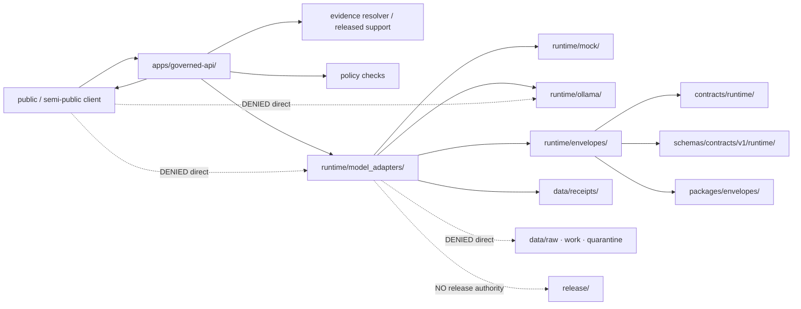

<!-- [KFM_META_BLOCK_V2]
doc_id: kfm://doc/runtime-readme
title: runtime/ — Governed Runtime Wiring and Handoff Root
type: readme; root-readme; canonical-runtime-root; trust-boundary-index; compatibility-drift-index
version: v0.3
status: draft; repository-grounded; canonical-root-confirmed; mixed-maturity; compatibility-drift-visible; implementation-mixed-scaffold; deployment-unverified; non-authoritative
owners: OWNER_TBD — Runtime steward · Governed-AI steward · Governed-API steward · Contract steward · Schema steward · Policy steward · Evidence steward · Citation steward · Security steward · Configuration steward · Infrastructure steward · Test steward · Release steward · Migration steward · Docs steward
created: NEEDS VERIFICATION — compact root stub existed before v0.2 expansion
updated: 2026-07-15
supersedes: v0.2 runtime wiring root guide
policy_label: "public-doctrine; runtime-root; internal-execution-support; governed-api-subordinate; evidence-subordinate; policy-subordinate; release-subordinate; finite-outcomes; cite-or-abstain; mock-first; no-direct-public-runtime; no-secrets; no-lifecycle-authority; compatibility-drift-visible; rollback-aware"
current_path: runtime/README.md
truth_posture: >
  CONFIRMED target v0.2 README; Directory Rules v1.4 canonical runtime root and six named
  sublanes; current repository-present canonical and compatibility runtime READMEs; canonical
  model-adapter lane plus legacy adapters compatibility lane; local, mock, Ollama, envelope,
  and service-configuration boundaries; one-line OllamaAdapter placeholder; schema-paired
  draft/PROPOSED DecisionEnvelope, RuntimeResponseEnvelope, and AIReceipt families; envelope
  validators and minimal fixture/test harness; kfm-envelopes 0.0.0 package scaffold with empty
  initializer; mock-first loopback .env.example; governed-api documentation; runtime-policy
  stub; and bounded absence or incompleteness recorded by the child lane evidence /
  PROPOSED governed runtime operating flow, root-level admission checklist, status progression,
  caller obligations, deterministic replay posture, compatibility disposition process, and
  cross-lane validation matrix /
  CONFLICTED runtime/adapters versus canonical runtime/model_adapters naming; repository-present
  runtime/AI, runtime/people, runtime/pipelines, and runtime/release paths versus their omission
  from the Directory Rules canonical runtime tree; runtime/people naming versus canonical
  people-dna-land domain segment; governed-api envelope architecture prose versus current paired
  schemas; AdapterContract stale evidence note; and reusable envelope implementation ownership
  between runtime handoff notes and packages/envelopes /
  UNKNOWN executable adapter inventory beyond verified placeholders and scaffolds, accepted
  request contracts, approved providers/models, runtime policy execution, EvidenceRef resolution,
  citation validation, receipt persistence, service loaders, health checks, network/tool
  permissions, public-client enforcement, deployment topology, production behavior, and
  operational health /
  NEEDS VERIFICATION accepted owners, CODEOWNERS coverage, compatibility-lane disposition,
  canonical envelope profiles, contract/schema acceptance, reason/state registries, first
  governed consumer, dedicated runtime tests, CI enforcement, secret-store integration,
  correction propagation, migration receipts, and rollback automation
evidence_snapshot:
  repository: bartytime4life/Kansas-Frontier-Matrix
  repository_id: "1059091169"
  visibility: public
  base_ref: main
  base_commit: e22efab7b729bb6abfcac8b2b7cdcf9f437a853e
  prior_blob: c8a0854af5c6ac4854ad5dcc880eb81251a211c3
  directory_rules_blob: 2affb080e6f0043867c64c7f06c1ca52030fbd55
  local_readme_blob: 39772916a3fc25e7899570344d5c70a1cb2939c9
  model_adapters_readme_blob: 16456452e03884dabb24c670c41c9e359f679769
  adapters_compatibility_readme_blob: 3b881e773f7283971fc4cc66f7e6ccbe92a5966d
  adapter_contract_note_blob: e371e5ca008ecbd0775bea9c2a31ef76131e7575
  ollama_adapter_placeholder_blob: 1769a719d6a6df53e001abbc4c67ad486ab5c944
  model_adapters_mock_readme_blob: 18fdd7034f1e8768f813acc38209eef8688b78d3
  mock_readme_blob: b48aa917319fd4b3fc458c7b5575eaaafcdc800d
  ollama_readme_blob: b0708364fa002760383882f18843e31c6c4209c7
  envelopes_readme_blob: ec0d621cdfd342176fe20f7237ff113ace49e2a7
  service_configs_readme_blob: 90ffda75759b5b62db86aef190f2be19a8853915
  ai_compatibility_readme_blob: f2d38470f458ebe8775e069d251c88757dab07e5
  people_compatibility_readme_blob: 56401e30b25479a0ba5492e5d9edb4c79a59838f
  pipelines_compatibility_readme_blob: 08d50e84b9df765f564f92e6e7d4d9627ce90818
  release_compatibility_readme_blob: ddfde419d5e47568b169431bbf2950d3521cc602
  envelopes_package_readme_blob: 3f0150f7133693ae0bfb655fb082d76ad57f5ddd
  governed_api_readme_blob: 4f21150852f133ba919b11f4f8792185fa870dae
  decision_envelope_contract_blob: b5120a208910f5e2907874b03af1fc8c7f43363d
  runtime_response_envelope_contract_blob: b81d67dccdd8470e066ab8247eb93c5df67a6679
  decision_envelope_schema_blob: 349782c8760f77e432ed1e9239d5ddc2ffe1f9b8
  runtime_response_envelope_schema_blob: 5105d419432a27176a8ee10870d75400cfa2ab8c
  ai_receipt_contract_blob: f4d8183dbed38f83144f6d9dbde30ae02a01edb8
  ai_receipt_schema_blob: 2e0bebdb3a38acbc3c58a919db46970c6e829b4a
  runtime_policy_readme_blob: b9bfee731553c504b514f07a6862ef3e68328f02
  env_example_blob: 50e972a4c5c009ed89097753932fc328039c1aec
  adr_0019_blob: db55defa15fa709b20c613cf595adc334fe785ba
related:
  - ./local/README.md
  - ./model_adapters/README.md
  - ./model_adapters/AdapterContract.md
  - ./model_adapters/OllamaAdapter.py
  - ./model_adapters/mock/README.md
  - ./mock/README.md
  - ./ollama/README.md
  - ./envelopes/README.md
  - ./service_configs/README.md
  - ./adapters/README.md
  - ./AI/README.md
  - ./people/README.md
  - ./pipelines/README.md
  - ./release/README.md
  - ../apps/governed-api/README.md
  - ../packages/envelopes/README.md
  - ../contracts/runtime/README.md
  - ../contracts/runtime/decision_envelope.md
  - ../contracts/runtime/runtime_response_envelope.md
  - ../contracts/runtime/ai_receipt.md
  - ../schemas/contracts/v1/runtime/README.md
  - ../schemas/contracts/v1/runtime/decision_envelope.schema.json
  - ../schemas/contracts/v1/runtime/runtime_response_envelope.schema.json
  - ../schemas/contracts/v1/runtime/ai_receipt.schema.json
  - ../fixtures/contracts/v1/runtime/README.md
  - ../tests/schemas/test_common_contracts.py
  - ../tools/validators/validate_decision_envelope.py
  - ../tools/validators/validate_runtime_response_envelope.py
  - ../policy/runtime/README.md
  - ../data/receipts/README.md
  - ../release/README.md
  - ../configs/README.md
  - ../infra/README.md
  - ../.env.example
  - ../docs/doctrine/directory-rules.md
  - ../docs/adr/ADR-0008-ollama-subordinate-to-governed-api.md
  - ../docs/adr/ADR-0019-ai-adapter-contract-and-finite-envelopes.md
  - ../docs/security/SECRETS.md
  - ../docs/registers/DRIFT_REGISTER.md
tags: [kfm, runtime, canonical-root, local-runtime, model-adapters, mock-first, ollama, envelopes, service-configs, finite-outcomes, governed-api, evidence, policy, citations, receipts, security, compatibility, migration, rollback]
notes:
  - "This revision changes only runtime/README.md."
  - "The root remains canonical; compatibility and handoff lanes are documented rather than silently promoted."
  - "No adapter, service, model, config, contract, schema, policy, fixture, test, workflow, receipt, deployment, release, or public route is created or modified."
  - "The prior root README is preserved as lineage through the recorded prior blob and the changelog below."
[/KFM_META_BLOCK_V2] -->

<a id="top"></a>

# `runtime/` — Governed Runtime Wiring and Handoff Root

> **One-line purpose.** Own KFM's internal runtime wiring, provider-neutral adapter handoffs, deterministic mocks, provider-specific local-runtime integration, finite-outcome envelope coordination, and runtime service-binding notes while remaining subordinate to governed evidence, policy, validation, citation, review, release, correction, rollback, and public-client controls.

<p>
  
  
  
  
  
  
  
</p>

> [!IMPORTANT]
> **`runtime/` is an internal execution-support root, not a truth or release authority.** A runtime result, successful provider call, valid JSON object, green test, service configuration, generated summary, adapter output, or deployed process does not create evidence, authorize disclosure, promote lifecycle state, approve release, or establish public truth.

> [!CAUTION]
> **Public and semi-public clients must not call runtime providers directly.** Governed clients use the accepted application trust membrane, resolve policy-safe evidence, receive finite response envelopes, and render only permitted outcomes and obligations. Direct browser-to-model, browser-to-runtime, browser-to-secret-store, or browser-to-canonical-store paths are denied.

> [!WARNING]
> **Real secrets and protected context do not belong in this root.** Credentials, tokens, private endpoints, signing material, secret-bearing `.env` files, private model paths, raw prompts, protected coordinates, restricted EvidenceBundle content, and private chain-of-thought must not be committed here or exposed through logs, screenshots, examples, fixtures, PR bodies, or diagnostics.

**Quick links:** [Purpose](#purpose) · [Authority](#authority-level) · [Status](#status) · [Belongs](#what-belongs-here) · [Does not](#what-does-not-belong-here) · [Inputs](#inputs) · [Outputs](#outputs) · [Validation](#validation) · [Review](#review-burden) · [Related](#related-folders) · [ADRs](#adrs) · [Last reviewed](#last-reviewed)

---

## Purpose

`runtime/` is the canonical KFM responsibility root for runtime-specific wiring and handoff concerns that should not become public application authority, shared package authority, policy authority, or lifecycle storage.

It exists to answer these questions:

1. Which internal runtime mode or provider-specific service is being used?
2. Which provider-neutral adapter boundary does the caller depend on?
3. Which evidence, policy, rights, sensitivity, citation, freshness, correction, and release obligations were checked outside the provider?
4. Which finite outcome may the governed caller render?
5. Which receipt, envelope, health, and rollback references make the runtime path inspectable?
6. How can a runtime binding be disabled, replaced, superseded, or rolled back without changing the public contract?

### Operating model

The intended governed flow is:

```text
public or semi-public client
  -> apps/governed-api/ or another accepted trust-membrane caller
  -> scope, access, rights, sensitivity, release, freshness, and correction checks
  -> EvidenceRef resolution to admissible released or policy-safe support
  -> provider-neutral runtime request
  -> deterministic mock, local runtime, or admitted provider-specific binding
  -> candidate result
  -> schema / citation / policy postcheck
  -> DecisionEnvelope and/or RuntimeResponseEnvelope
  -> AIReceipt or other governed receipt pointer when applicable
  -> client renders ANSWER, ABSTAIN, DENY, or ERROR
```

This is a **PROPOSED operating flow**, not a claim that every arrow is implemented.

### Keystone invariants

Runtime changes must preserve all of the following:

- `EvidenceBundle` and source authority outrank generated language.
- Policy, rights, sensitivity, consent, access, release, freshness, and correction posture remain outside model or provider discretion.
- Public clients use governed interfaces, not runtime internals.
- Runtime inputs are bounded, minimized, and policy-safe.
- Runtime results use finite outcomes; negative states are first-class.
- Missing or unresolved support produces `ABSTAIN`, `DENY`, or `ERROR`, not fluent fallback.
- Mock-first and no-network testing precede live-provider reliance.
- Provider-specific details remain replaceable behind provider-neutral boundaries.
- Receipts preserve traceability without storing private reasoning.
- Runtime output cannot promote `RAW`, `WORK`, `QUARANTINE`, `PROCESSED`, `CATALOG`, `TRIPLET`, or `PUBLISHED` state.
- Publication, correction, withdrawal, and rollback remain governed transitions outside this root.

[Back to top](#top)

---

## Authority level

**Canonical implementation-support root / non-authoritative internal boundary.**

Directory Rules identify `runtime/` as a canonical root for local runtime adapters and harnesses. The canonical runtime tree names six sublanes:

```text
runtime/
├── local/
├── model_adapters/
├── ollama/
├── mock/
├── service_configs/
└── envelopes/
```

Repository evidence also confirms additional runtime paths. Those paths are **not silently promoted** by this README.

### Responsibility routing

| Concern | Owning surface | Runtime role |
|---|---|---|
| Local runtime wiring and harness notes | `runtime/local/` | Own local execution handoff and operator-facing runtime notes. |
| Provider-neutral adapter boundary | `runtime/model_adapters/` | Own adapter cards, interface handoffs, and provider substitution posture. |
| Deterministic runtime behavior | `runtime/mock/` | Own broader mock-runtime notes and deterministic runtime posture. |
| Mock adapter specialization | `runtime/model_adapters/mock/` | Bridge mock runtime and provider-neutral adapter concerns; currently README-only. |
| Provider-specific local Ollama wiring | `runtime/ollama/` | Own Ollama-specific local runtime and daemon handoff posture. |
| Finite-outcome runtime helper coordination | `runtime/envelopes/` | Own envelope wiring, handoff, profile-selection, and drift coordination. |
| Runtime service binding and activation notes | `runtime/service_configs/` | Own runtime-specific configuration handoff; shared templates stay under `configs/`. |
| Reusable runtime/envelope code | `packages/` | Runtime references shared code; it does not duplicate package authority. |
| Public or semi-public serving | `apps/governed-api/` or accepted app root | Runtime is called behind the trust membrane; it does not own public routes. |
| Semantic object meaning | `contracts/` | Runtime consumes contracts; it does not define meaning here. |
| Machine-checkable object shape | `schemas/` | Runtime consumes schemas; it does not create parallel schema authority. |
| Allow, deny, restrict, abstain, obligations | `policy/` | Runtime obeys policy; configuration or model output cannot override it. |
| Evidence and source authority | `data/proofs/`, registries, governed resolvers | Runtime receives bounded references or approved context only. |
| Fixtures, executable tests, validators | `fixtures/`, `tests/`, `tools/validators/` | Runtime behavior claims require independent proof. |
| Receipts and proofs | `data/receipts/`, `data/proofs/` | Runtime emits or links governed records through accepted tooling. |
| Release, correction, withdrawal, rollback | `release/` | Runtime cannot approve or execute release authority by itself. |
| Shared safe defaults and templates | `configs/` | Runtime service profiles reference them; they do not duplicate them. |
| Deployment, firewall, service manager, network exposure | `infra/` | Runtime states requirements; infrastructure owns deployment controls. |
| Real secret values | approved external secret system | Runtime stores references-by-name only. |

### Canonical versus compatibility posture

| Runtime path | Current classification | Rule |
|---|---|---|
| `local/` | Canonical runtime lane | New local wiring may land here only with bounded scope and proof. |
| `model_adapters/` | Canonical runtime lane | New provider-neutral adapter work lands here. |
| `mock/` | Canonical runtime lane | Deterministic mock runtime posture. |
| `ollama/` | Canonical runtime lane | Provider-specific local Ollama posture; live binding remains deferred. |
| `envelopes/` | Canonical runtime lane | Runtime handoff and envelope coordination; reusable code belongs in `packages/envelopes/`. |
| `service_configs/` | Canonical runtime lane | Runtime binding handoff only; reusable defaults remain under `configs/`. |
| `adapters/` | Compatibility and migration index | Do not accumulate new adapter authority; route to `model_adapters/`. |
| `AI/` | Compatibility and navigation index | Do not use as a catch-all AI implementation root. |
| `people/` | Compatibility and restricted guardrail index | Canonical domain segment is `people-dna-land`; placement remains unresolved. |
| `pipelines/` | Compatibility and runtime-to-pipeline handoff | Executable logic stays in `pipelines/`; intent stays in `pipeline_specs/`. |
| `release/` | Compatibility and runtime-to-release handoff | Canonical release authority remains root `release/`. |

A move, rename, deletion, or retirement of any compatibility path requires current inventory, inbound-link review, migration planning, rollback, and the ADR or drift action appropriate to the change. This README authorizes none of those mutations.

[Back to top](#top)

---

## Status

### Evidence boundary

The repository now has substantially stronger runtime documentation than the v0.2 root README recorded, but implementation maturity remains mixed.

| Surface | Current evidence | Safe conclusion |
|---|---|---|
| `runtime/README.md` | Existing v0.2 target | The canonical root is documented, but its lane index and maturity statements are stale. |
| Canonical six-lane tree | Directory Rules plus current child READMEs | Placement is documented; implementation is not uniformly established. |
| `runtime/local/` | Detailed draft README | Local wiring responsibilities are described; executable inventory remains unverified. |
| `runtime/model_adapters/` | Detailed v1.1 README | Canonical provider-neutral lane is confirmed; executable providers and accepted request contract remain unverified. |
| `runtime/mock/` | Detailed draft README | Mock-first posture is documented; executable mock runtime is not established by the README. |
| `runtime/ollama/` | Detailed v1.1 README | Canonical provider-specific lane is confirmed; live binding is deferred and operational state is unknown. |
| `runtime/envelopes/` | Detailed v1.1 README | Runtime handoff lane, validators, schemas, fixtures, package scaffold, and drift are documented. |
| `runtime/service_configs/` | Repository-grounded v0.2 README | Runtime binding handoff is clarified; the lane is README-only. |
| `runtime/model_adapters/OllamaAdapter.py` | One-line greenfield placeholder | File presence does not prove an importable adapter or provider call. |
| Runtime contracts and paired schemas | `DecisionEnvelope`, `RuntimeResponseEnvelope`, `AIReceipt` present with draft/PROPOSED status | Concrete shapes exist; acceptance and runtime emission remain unverified. |
| Envelope validators and schema fixtures | Validator entry points, minimal valid/invalid fixtures, common schema harness | Some machine validation exists; coverage is narrow and does not prove runtime integration. |
| `packages/envelopes/` | `kfm-envelopes` `0.0.0` scaffold, empty initializer, no supported consumers | Reusable implementation home is visible but not implemented as a stable library. |
| `.env.example` | Mock selected by default; governed API and Ollama examples are loopback | Public example is safe-looking and mock-first; it is not activation or deployment proof. |
| `policy/runtime/README.md` | Greenfield stub | Runtime policy implementation is not established. |
| `apps/governed-api/README.md` | Draft trust-membrane documentation | Intended public boundary is documented; exact runtime wiring and enforcement remain bounded. |
| Deployment, service health, models, receipts, logs, public-client enforcement | No sufficient current evidence in this edit | Remain `UNKNOWN` or `NEEDS VERIFICATION`. |

### Current root map

```text
runtime/
├── README.md                         # this file; canonical root contract
├── local/                            # canonical local runtime wiring
├── model_adapters/                   # canonical provider-neutral adapter lane
│   ├── README.md
│   ├── AdapterContract.md            # descriptive note; not canonical contract authority
│   ├── OllamaAdapter.py              # confirmed one-line placeholder
│   └── mock/                         # mock-adapter child; README-only in checked evidence
├── mock/                             # canonical deterministic mock runtime lane
├── ollama/                           # canonical provider-specific local runtime lane
├── envelopes/                        # canonical finite-outcome handoff/helper lane
├── service_configs/                  # canonical runtime service-binding handoff
├── adapters/                         # compatibility/migration index
├── AI/                               # compatibility/navigation index
├── people/                           # compatibility/restricted guardrail index
├── pipelines/                        # compatibility runtime-to-pipeline handoff
└── release/                          # compatibility runtime-to-release handoff
```

This map is an evidence-grounded orientation surface, not authorization to add new child lanes or treat every present lane as canonical.

### Lane maturity index

| Lane | Placement | Documentation | Implementation posture | Highest-priority next proof |
|---|---|---:|---|---|
| `local/` | Canonical | Detailed draft | UNKNOWN | Name one consumer/harness and add bounded tests. |
| `model_adapters/` | Canonical | Detailed v1.1 | Mixed; placeholder and descriptive notes | Ratify request/adapter contract, implement deterministic mock first. |
| `mock/` | Canonical | Detailed draft | Documentation-only in checked evidence | Executable deterministic adapter plus four-outcome fixtures. |
| `ollama/` | Canonical | Detailed v1.1 | Scaffold-only; live binding deferred | Security/admission review after mock/evidence/citation/receipt gates. |
| `envelopes/` | Canonical | Detailed v1.1 | Mixed schemas/validators/package scaffold | Resolve contract/schema/architecture profile conflict. |
| `service_configs/` | Canonical | Repository-grounded v0.2 | README-only | Accepted profile shape, loader, validator, secret-reference contract. |
| `adapters/` | Compatibility | Detailed v1.1 | Migration/index only | Inventory inbound links and plan governed disposition. |
| `AI/` | Compatibility | Detailed v1.1 | Navigation/index only | Decide retention or migration; do not add catch-all implementation. |
| `people/` | Compatibility | Detailed v1.1 | README-only guardrail | Resolve naming/placement; preserve deny-by-default controls. |
| `pipelines/` | Compatibility | Repository-grounded v0.2 | README-only handoff | Decide retention; define request/handoff only if justified. |
| `release/` | Compatibility | Detailed v1.1 | Handoff/index only | Resolve placement; keep all release authority at root `release/`. |

### Confirmed drift and conflicts

1. **Adapter path duplication.** `runtime/adapters/` and `runtime/model_adapters/` coexist; only `model_adapters/` is canonical.
2. **Capitalized AI lane.** `runtime/AI/` exists but is not named in the Directory Rules canonical tree.
3. **Domain and cross-root handoff lanes.** `runtime/people/`, `runtime/pipelines/`, and `runtime/release/` exist but are not canonical runtime sublanes.
4. **People-domain naming.** `runtime/people/` conflicts with the canonical `people-dna-land` domain segment.
5. **Envelope profile conflict.** Governed-API envelope architecture prose and paired runtime schemas differ in fields and vocabularies; hybrid emission is not authorized.
6. **Adapter note staleness.** `runtime/model_adapters/AdapterContract.md` contains an older evidence note that does not reflect the now-present canonical `DecisionEnvelope` contract/schema.
7. **Reusable implementation split.** `runtime/envelopes/` owns runtime handoff coordination, while reusable code belongs in `packages/envelopes/`; accepted API ownership remains unproved.
8. **Runtime policy maturity.** `policy/runtime/README.md` remains a greenfield stub.
9. **Root documentation drift.** The prior root README treated service templates as belonging here broadly and did not classify all compatibility lanes; current child evidence narrows those statements.

These conflicts are visible governance work. They must not be resolved by silently choosing whichever path is convenient.

### Status progression

A runtime capability should advance through explicit states:

```text
PROPOSED
  -> DOCUMENTED
  -> CONTRACT_PAIRED
  -> FIXTURE_BACKED
  -> MOCK_VALIDATED
  -> SECURITY_REVIEWED
  -> PROVIDER_ADMITTED
  -> INTEGRATION_VALIDATED
  -> RELEASE_ELIGIBLE
  -> ACTIVE
  -> SUPERSEDED / DISABLED / RETIRED
```

The state names above are **PROPOSED** and do not replace canonical contract or policy vocabularies. A missing or unknown gate must fail closed.

[Back to top](#top)

---

## What belongs here

The root and its canonical lanes may contain:

- this root README and child-lane READMEs;
- local runtime wiring and service-harness implementation that is truly runtime-specific;
- provider-neutral adapter handoff code and adapter cards in the accepted canonical lane;
- deterministic mock runtime code and mock-adapter specialization;
- provider-specific local runtime integration such as Ollama wiring;
- finite-outcome envelope wiring and runtime profile selection;
- runtime-specific service-binding and activation handoff notes;
- non-secret references to shared configuration, contracts, schemas, policy, fixtures, tests, validators, receipts, evidence, and release records;
- safe health, readiness, timeout, retry, cancellation, idempotency, resource-limit, circuit-breaker, and kill-switch handling;
- migration, supersession, deactivation, and rollback notes for runtime-specific behavior;
- compatibility indexes that preserve discoverability while clearly routing new work to canonical homes.

Every implementation-bearing addition must identify:

| Required field family | Why it is required |
|---|---|
| Stable identity and version | Enables replay, correction, migration, and rollback. |
| Owning lane and owner | Prevents authority ambiguity. |
| Named caller and consumer | Prevents hidden or accidental activation. |
| Adapter/provider mode | Preserves provider neutrality and replaceability. |
| Contract and schema profile | Prevents shape guessing and hybrid envelopes. |
| Evidence and policy prerequisites | Keeps runtime subordinate to governed support and obligations. |
| Network, tool, secret, and data posture | Defines the security boundary. |
| Timeouts, retries, cancellation, idempotency | Prevents uncontrolled execution and duplicate side effects. |
| Resource limits | Bounds context, output, concurrency, memory, CPU/GPU, and queues. |
| Finite outcomes and safe reasons | Makes failure explicit and client-safe. |
| Fixture, test, validator, and CI evidence | Separates documentation from proof. |
| Receipt and observability pointers | Supports audit without private reasoning. |
| Activation, fallback, kill switch, rollback | Preserves reversible operation. |

[Back to top](#top)

---

## What does NOT belong here

| Prohibited or misplaced material | Correct home or posture |
|---|---|
| `RAW`, `WORK`, `QUARANTINE`, `PROCESSED`, `CATALOG`, `TRIPLET`, or `PUBLISHED` payloads | `data/` lifecycle roots |
| Canonical EvidenceBundle contents, SourceDescriptors, registries, proofs, or catalogs | Governed `data/` and registry/proof roots |
| Semantic object meaning | `contracts/` |
| JSON Schema authority | `schemas/` |
| Policy rules, consent rules, access decisions, rights decisions, sensitivity decisions | `policy/` and governed decision records |
| Reusable cross-application libraries | `packages/` |
| Deployable public or semi-public API/UI services | `apps/` |
| General shared defaults and reusable templates | `configs/` |
| Workstation-local overrides | ignored `configs/local/` files |
| Deployment, firewall, reverse proxy, service manager, VPN, container, or host definitions | `infra/` |
| Pipeline execution logic | `pipelines/` |
| Declarative pipeline intent | `pipeline_specs/` |
| Fixtures and golden outputs | `fixtures/` |
| Executable tests | `tests/` |
| Validator source | `tools/validators/` |
| Receipts and proofs | `data/receipts/`, `data/proofs/` |
| Release manifests, PromotionDecisions, corrections, withdrawals, rollback cards, release signatures | root `release/` |
| Real credentials, API keys, tokens, private URLs, signing keys, passwords, private `.env`, secret-bearing config | Never in the repository; use approved external secret handling |
| Model binaries, weights, caches, private model paths, unrestricted provider payloads | External runtime/model storage under approved controls |
| Protected exact locations, living-person data, DNA/genomic material, consent-sensitive joins | Deny, minimize, generalize, or route through governed domain/policy controls |
| Private chain-of-thought or hidden reasoning | Do not persist as KFM evidence, proof, receipt, or truth |
| Generated text treated as evidence, policy, review, release, correction, rollback, or publication authority | Nowhere |
| Direct browser or public-client model/runtime endpoints | Denied; use the governed application trust membrane |
| New catch-all `ai/`, `models/`, `providers/`, `services/`, or parallel runtime root | Requires placement review and ADR; normally route to an existing responsibility lane |

[Back to top](#top)

---

## Inputs

Runtime may receive only bounded, governed inputs from an accepted caller.

### Permitted input classes

- stable request, run, trace, or audit identity;
- bounded task type and declared use case;
- released or otherwise policy-safe context assembled by a governed caller;
- resolved `EvidenceRef` pointers or approved deterministic fixtures;
- applicable PolicyDecision, rights, sensitivity, consent, release, freshness, and correction state;
- explicit citation/support requirements;
- admitted adapter/provider/model profile references;
- reviewed tool and network permissions;
- non-secret configuration references;
- time, token, memory, CPU/GPU, queue, concurrency, retry, and cancellation limits;
- receipt/audit context and replay metadata;
- safe fallback or disabled-mode instructions.

### Forbidden normal inputs

- direct dumps of `data/raw/`, `data/work/`, `data/quarantine/`, or canonical/internal stores;
- unresolved or unreviewed sensitive geometry;
- unbounded internal documents or unrestricted repository context;
- credentials, tokens, secret values, private endpoints, or signing material;
- hidden policy bypass flags;
- browser-supplied system instructions treated as authority;
- prompt-like text embedded in evidence treated as trusted instruction;
- private chain-of-thought;
- arbitrary filesystem, shell, network, or tool authority;
- model weights or binaries committed to the repository;
- stale, withdrawn, corrected, or superseded context without explicit state handling.

### Input admission checklist

Before a runtime call that may influence a governed response:

- [ ] Caller identity and scope are known.
- [ ] Public/direct runtime access is denied.
- [ ] Evidence support is resolved or the outcome is already `ABSTAIN`.
- [ ] Policy, rights, sensitivity, consent, access, release, freshness, and correction prechecks are complete.
- [ ] Adapter, provider, model, and configuration profiles are admitted for the task.
- [ ] Context is minimized and free of secrets or prohibited material.
- [ ] Network and tool permissions are explicitly bounded.
- [ ] Resource limits, timeouts, retries, cancellation, and idempotency are explicit.
- [ ] Receipt and finite-outcome obligations are known.
- [ ] A safe fallback, disable path, or negative outcome exists.

Missing or unknown prerequisites must not be converted into an implicit allow.

[Back to top](#top)

---

## Outputs

Runtime outputs are **candidates and governed handoff objects**, not sovereign truth.

### Permitted output classes

- provider-specific internal candidate response;
- normalized adapter candidate;
- `DecisionEnvelope` candidate under the selected contract/schema profile;
- `RuntimeResponseEnvelope` candidate for governed client handoff;
- `AIReceipt` or other accepted receipt pointer;
- safe citation-validation, policy, freshness, correction, and release-state references;
- safe health/readiness state;
- bounded metrics and diagnostics;
- deterministic mock result;
- explicit `ABSTAIN`, `DENY`, or `ERROR` result;
- migration, supersession, deactivation, and rollback record pointers.

### Finite outcomes

The paired runtime schemas currently confirm four client/runtime outcomes:

| Outcome | Runtime meaning | Required caller posture |
|---|---|---|
| `ANSWER` | The runtime path completed and the governed caller may present a bounded response under current evidence, policy, rights, sensitivity, citation, freshness, correction, and release constraints. | Render only with required support and obligations; do not infer broader authority. |
| `ABSTAIN` | Evidence, citation, freshness, context, model fitness, or scope is insufficient. | Show a safe support-gap reason; do not fabricate or silently broaden. |
| `DENY` | Policy, rights, sensitivity, consent, access, release, or security posture forbids delivery. | Do not expose restricted payloads or infrastructure details. |
| `ERROR` | Adapter, service, dependency, configuration, timeout, schema, citation, receipt, or other failure prevents safe completion. | Return a safe error; do not infer truth, permission, or availability. |

Pipeline, validation, or release workflows may use other state vocabularies such as `HOLD`, `PASS`, or `FAIL`. Those caller-level states do not expand the public runtime envelope enum unless an accepted contract/schema change says so.

### Output invariants

- Raw provider responses are not the public contract.
- Unknown fields or unknown outcomes fail closed.
- Citation validation failure cannot become `ANSWER`.
- A schema-valid object does not prove evidence closure or disclosure permission.
- A runtime receipt is process memory, not release approval.
- A response envelope is not a ReleaseManifest.
- A generated explanation cannot approve policy or promotion.
- Safe diagnostics must omit prompts, secrets, restricted context, protected coordinates, and private reasoning.
- Output identity, profile, adapter, provider, and digest information should support replay without leaking sensitive content.
- Corrections, withdrawals, supersession, stale state, and rollback effects must propagate when material.

[Back to top](#top)

---

## Validation

Validation must separate **file presence**, **shape**, **behavior**, **integration**, **security**, and **release readiness**.

### Static and documentation checks

```bash
find runtime -maxdepth 5 -type f | sort
grep -RInE '(^|/)(api[_-]?key|token|secret|password)[[:space:]]*[:=]' runtime || true
grep -RInE 'localhost:11434|127\.0\.0\.1:11434|0\.0\.0\.0' runtime apps packages configs infra || true
```

Interpretation:

- inventory output proves only tracked path presence;
- secret-pattern output requires human review because documentation may contain safe examples;
- endpoint-pattern output is an exposure-boundary audit, not automatic proof of a defect;
- replace advisory `|| true` behavior with accepted fail-closed checks only after scope and false-positive handling are reviewed.

### Contract and schema checks

```bash
python tools/validators/validate_decision_envelope.py --fixtures
python tools/validators/validate_runtime_response_envelope.py --fixtures
pytest -q tests/schemas/test_common_contracts.py
make schemas
```

These checks prove only the behavior they actually execute. Passing schema fixtures does not prove runtime adapters, policy execution, evidence resolution, citation validation, receipt persistence, public-client enforcement, or deployment.

### Required test families

| Test family | Minimum negative cases |
|---|---|
| Placement and import boundary | Compatibility lane used as new authority; public app imports provider directly; runtime reads lifecycle stores. |
| Adapter contract | Unknown request profile; unsupported provider; malformed provider result; provider substitution changes public contract. |
| Finite outcomes | Unknown outcome; missing reason; negative outcome rendered as answer; hidden exception treated as success. |
| Evidence and citation | Unresolved EvidenceRef; fabricated citation; stale/withdrawn support; citation validator unavailable. |
| Policy, rights, sensitivity, consent | Policy unavailable; protected location; denied scope; revoked consent; missing obligations. |
| Configuration and secrets | Secret in tracked file; public bind; private endpoint leaked; hidden bypass flag; unknown profile field. |
| Reliability | Timeout; retry exhaustion; duplicate request; cancellation; circuit open; queue saturation. |
| Receipts and replay | Missing receipt; mismatched profile hash; output digest mismatch; replay with changed contract. |
| Correction and rollback | Corrected evidence; withdrawn release; superseded model/profile; kill-switch activation; stale cache. |
| Compatibility and migration | `runtime/adapters/` authority accumulation; broken inbound links; legacy profile silently mapped to new profile. |

### Current proof boundary

| Proof layer | Current posture |
|---|---|
| Root and child README boundaries | CONFIRMED documentation |
| Core runtime contracts and paired schemas | CONFIRMED present; status draft/PROPOSED |
| Envelope validators and minimal schema fixtures | CONFIRMED files; coverage bounded |
| Reusable envelope package | CONFIRMED `0.0.0` scaffold; implementation not established |
| Mock runtime implementation | UNKNOWN in checked evidence |
| Ollama adapter implementation | CONFIRMED one-line placeholder only |
| Runtime policy engine | Stub/documentation only in checked evidence |
| Evidence/citation integration | UNKNOWN |
| Receipt persistence | UNKNOWN |
| Dedicated runtime integration tests | NEEDS VERIFICATION |
| CI enforcement | Workflow definitions exist; complete runtime enforcement and current run status require separate verification |
| Deployment and operational health | UNKNOWN |

### Definition of done for a new runtime capability

- [ ] Correct canonical lane selected; no compatibility root gains new authority.
- [ ] Named owner and governed caller.
- [ ] Accepted semantic contract and paired schema/profile.
- [ ] Deterministic mock implementation and four-outcome fixtures.
- [ ] Evidence, policy, rights, sensitivity, citation, freshness, correction, and release negative paths.
- [ ] Secret, network, tool, logging, and data-minimization review.
- [ ] Timeouts, retries, cancellation, idempotency, circuit breaker, and resource limits.
- [ ] Receipt and safe-observability behavior.
- [ ] Dedicated tests and CI execution evidence.
- [ ] Provider/model/config admission where applicable.
- [ ] Public-client boundary test.
- [ ] Activation, fallback, kill switch, supersession, migration, and rollback verified.
- [ ] Documentation and open verification register updated.
- [ ] No claim upgraded beyond the evidence produced.

[Back to top](#top)

---

## Review burden

### Review classes

| Change class | Minimum review burden |
|---|---|
| Root or child README wording only | Runtime maintainer + docs steward; additional steward when a material boundary changes. |
| Compatibility-lane move, rename, retirement, or redirect | Runtime + migration + docs stewards; inbound-link inventory; drift/ADR review; rollback plan. |
| Adapter interface or request/response shape | Runtime + API + contract + schema + policy + evidence + test stewards. |
| Provider/model admission | Runtime + model-risk + security + rights/license + policy + evidence + test stewards. |
| Service profile, bind, network, or secret-reference change | Runtime + configuration + infrastructure + security + operations stewards. |
| Evidence, citation, policy, rights, sensitivity, consent, or correction behavior | Owning governance/domain steward plus runtime/API/test reviewers. |
| Receipt, proof, release, correction, withdrawal, or rollback linkage | Receipt/proof/release/correction stewards; runtime cannot self-approve. |
| Public-client or governed-API integration | Governed-API + security + policy + evidence + runtime + test reviewers. |
| Sensitive People/DNA/Land runtime behavior | People/DNA/Land domain + consent + privacy + sensitivity + security + release reviewers. |

### Separation of duties

A runtime author must not be the sole approver when the change can affect:

- disclosure permission;
- living-person, DNA/genomic, archaeology, rare-species, cultural, sovereignty, or infrastructure sensitivity;
- public endpoint exposure;
- provider/model admission;
- policy-significant behavior;
- release eligibility;
- correction, withdrawal, or rollback.

### CODEOWNERS posture

Repository ownership placeholders and current CODEOWNERS coverage remain `NEEDS VERIFICATION`. Do not infer that a GitHub review request proves the correct stewards reviewed a material runtime change.

[Back to top](#top)

---

## Related folders

### Runtime lanes

| Path | Relationship |
|---|---|
| [`local/`](./local/) | Canonical local runtime wiring. |
| [`model_adapters/`](./model_adapters/) | Canonical provider-neutral adapter lane. |
| [`model_adapters/mock/`](./model_adapters/mock/) | Mock-adapter specialization; currently README-only in checked evidence. |
| [`mock/`](./mock/) | Canonical deterministic mock runtime lane. |
| [`ollama/`](./ollama/) | Canonical provider-specific local Ollama lane. |
| [`envelopes/`](./envelopes/) | Canonical runtime envelope handoff/helper lane. |
| [`service_configs/`](./service_configs/) | Canonical runtime service-binding handoff. |
| [`adapters/`](./adapters/) | Compatibility/migration index; route new work to `model_adapters/`. |
| [`AI/`](./AI/) | Compatibility/navigation index; not a catch-all authority. |
| [`people/`](./people/) | Compatibility/restricted guardrail index; canonical domain segment differs. |
| [`pipelines/`](./pipelines/) | Compatibility runtime-to-pipeline handoff. |
| [`release/`](./release/) | Compatibility runtime-to-release handoff. |

### Authority and implementation counterparts

| Root | Relationship to runtime |
|---|---|
| [`apps/governed-api/`](../apps/governed-api/) | Intended public/semi-public trust membrane. |
| [`packages/envelopes/`](../packages/envelopes/) | Reusable envelope helper package scaffold. |
| [`contracts/runtime/`](../contracts/runtime/) | Semantic runtime object meaning. |
| [`schemas/contracts/v1/runtime/`](../schemas/contracts/v1/runtime/) | Machine-checkable runtime shapes. |
| [`policy/runtime/`](../policy/runtime/) | Runtime admissibility and obligations. |
| [`fixtures/contracts/v1/runtime/`](../fixtures/contracts/v1/runtime/) | Deterministic contract fixtures. |
| [`tests/`](../tests/) | Executable proof. |
| [`tools/validators/`](../tools/validators/) | Validator implementation. |
| [`configs/`](../configs/) | Shared safe configuration defaults and templates. |
| [`infra/`](../infra/) | Deployment, host, network, and exposure controls. |
| [`data/receipts/`](../data/receipts/) | Receipt instances through governed tooling. |
| [`data/proofs/`](../data/proofs/) | Evidence and proof objects. |
| [`release/`](../release/) | Release decisions, correction, withdrawal, and rollback authority. |
| [`docs/security/`](../docs/security/) | Secrets, exposure, threat, and incident doctrine. |
| [`docs/registers/DRIFT_REGISTER.md`](../docs/registers/DRIFT_REGISTER.md) | Placement and implementation drift tracking. |

### Dependency direction



The diagram is a governance and dependency-direction model, not verified deployment topology.

[Back to top](#top)

---

## ADRs

### Relevant decisions

| Record | Current posture | Runtime consequence |
|---|---|---|
| [`docs/doctrine/directory-rules.md`](../docs/doctrine/directory-rules.md) | CONFIRMED doctrine | Establishes `runtime/` and the canonical six-lane tree. |
| [`ADR-0008 — Ollama and Local AI Runtimes Are Subordinate to the Governed API`](../docs/adr/ADR-0008-ollama-subordinate-to-governed-api.md) | Present; proposed/draft | Pins no-direct-public-model, governed caller, evidence/policy, finite outcomes, and receipt posture if accepted. |
| [`ADR-0019 — AI Adapter Contract and Finite Envelopes`](../docs/adr/ADR-0019-ai-adapter-contract-and-finite-envelopes.md) | Present; proposed/draft; number verification note remains | Proposes provider-neutral adapters and four public/runtime outcomes. |
| Governed API trust-membrane decision | Referenced by app docs; acceptance and implementation depth require verification | Runtime must remain behind an accepted public boundary. |

### Decisions still needed

- disposition of `runtime/adapters/`;
- retention or migration of `runtime/AI/`;
- placement and naming resolution for `runtime/people/`;
- retention or migration of `runtime/pipelines/`;
- retention or migration of `runtime/release/`;
- canonical runtime request and adapter-contract profile;
- accepted envelope profile resolving architecture/contract/schema drift;
- reason-code, obligation, policy-state, freshness, and correction-state registries;
- reusable envelope implementation ownership and package API;
- runtime service-profile schema and loader;
- provider/model admission and deactivation process;
- runtime receipt persistence and retention;
- dedicated runtime test and CI contract;
- public-client boundary enforcement;
- correction, cache invalidation, migration, and rollback automation.

Do not create a new parallel authority path while these decisions remain open.

[Back to top](#top)

---

## Last reviewed

| Field | Value |
|---|---|
| Last reviewed | 2026-07-15 |
| Evidence base | `main@e22efab7b729bb6abfcac8b2b7cdcf9f437a853e` |
| Target prior blob | `c8a0854af5c6ac4854ad5dcc880eb81251a211c3` |
| Review mode | Repository-grounded documentation revision; one-file scope |
| Implementation effect | None — documentation only |
| Rollback | Revert the update commit or restore the prior blob; no runtime state, config, secret, deployment, data, or release object changes |

### Maintenance triggers

Re-review this README when any of the following occurs:

- a runtime lane is added, moved, renamed, retired, or promoted;
- a compatibility path receives implementation;
- a request, adapter, envelope, receipt, or service-profile contract changes;
- an adapter/provider/model becomes executable or admitted;
- `packages/envelopes/` gains a supported API;
- runtime policy becomes executable;
- a governed API route begins calling runtime code;
- secret, network, tool, logging, or data-handling posture changes;
- a dedicated runtime test or workflow is introduced;
- receipt persistence, correction propagation, or rollback becomes implemented;
- a public-client boundary test changes;
- Directory Rules or an accepted ADR changes runtime placement.

### Open verification register

| Item | Evidence needed |
|---|---|
| Exact recursive runtime inventory | Commit-pinned tree listing and file classification. |
| Accepted owners and CODEOWNERS | Current ownership rules plus steward confirmation. |
| Canonical request/adapter profile | Accepted contract, schema, fixtures, validator, tests, and ADR. |
| Envelope profile conflict | Accepted compatibility/profile decision plus parity tests. |
| Executable mock runtime | Code, deterministic fixtures, four-outcome tests, current CI evidence. |
| Ollama or other provider activation | Adapter implementation, model profile, rights/security review, integration tests, receipts, kill switch. |
| Runtime policy enforcement | Executable policy bundle, evaluator wiring, negative tests, audit records. |
| Evidence and citation integration | Resolver/citation code, failure tests, runtime receipts, governed API integration. |
| Service configuration | Accepted profile format, loader, validator, secret-reference integration, health checks. |
| Runtime receipts | Accepted persistence location, schema/profile, join behavior, retention, redaction. |
| Deployment and public boundary | Infra config, route inventory, network tests, public-client denial tests. |
| Compatibility-lane disposition | Inbound-link inventory, ADR or migration record, deprecation and rollback plan. |
| Correction and rollback | Invalidation, cache propagation, supersession, kill-switch, and rollback test evidence. |
| Operational health | Current logs, metrics, dashboards, incident hooks, and service-level objectives. |

### v0.2 → v0.3 change summary

- Grounds the root README against the current child-lane evidence.
- Corrects the service-configuration boundary: shared templates remain under `configs/`.
- Adds the repository-present `adapters/` compatibility lane omitted from v0.2.
- Classifies `AI/`, `people/`, `pipelines/`, and `release/` as compatibility or handoff lanes rather than implied canonical lanes.
- Records current contract/schema/package scaffolding and the envelope profile conflict.
- Records the one-line Ollama adapter placeholder and mock-first operational boundary.
- Adds explicit inputs, outputs, finite outcomes, validation, review burden, ADR backlog, compatibility migration, and rollback posture.
- Preserves the prior README's central rule: runtime remains subordinate to evidence, policy, validation, release, correction, rollback, and public-client governance.

<p align="right"><a href="#top">Back to top</a></p>
