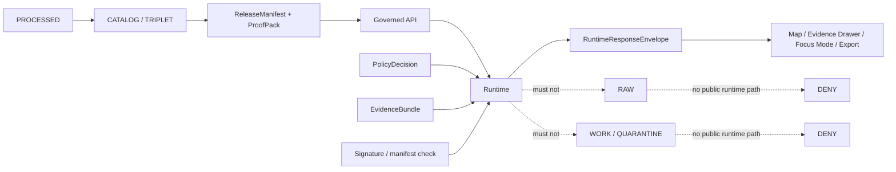
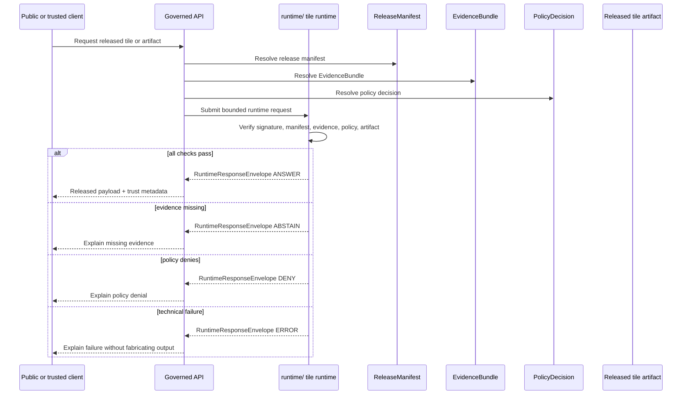

<!-- [KFM_META_BLOCK_V2]
doc_id: kfm://doc/NEEDS-VERIFICATION-runtime-readme
title: Runtime
type: standard
version: v1
status: draft
owners: @bartytime4life // NEEDS VERIFICATION: broad CODEOWNERS fallback, runtime-specific owner not confirmed
created: 2026-05-02
updated: 2026-05-02
policy_label: public
related: [../README.md, ../apps/, ../web/, ../ui/, ../data/, ../schemas/, ../contracts/, ../policy/, ../release/, ../tools/, ../tests/]
tags: [kfm, runtime, governed-api, evidence, tiles, policy, release, local-exposure]
notes: [Public repo evidence confirms runtime/ exists; runtime behavior, tests, CI enforcement, deployment, and platform settings remain NEEDS VERIFICATION]
[/KFM_META_BLOCK_V2] -->

# Runtime

Runtime is the governed execution boundary for KFM request handling, released artifact verification, finite response envelopes, and runtime-adjacent tile delivery.

> [!IMPORTANT]
> **Status:** experimental  
> **Owners:** `@bartytime4life` broad fallback; runtime-specific owner `NEEDS VERIFICATION`  
> **Path:** `runtime/README.md`  
> **Evidence posture:** public repo path observed / local checkout unavailable / runtime behavior not proven  
> **Truth posture:** CONFIRMED directory presence · PARTIALLY_VERIFIED tile-runtime source files · PROPOSED boundary contract · UNKNOWN deployment/runtime maturity


**Quick jumps:** [Scope](#scope) · [Repo fit](#repo-fit) · [Accepted inputs](#accepted-inputs) · [Exclusions](#exclusions) · [Current snapshot](#current-snapshot) · [Runtime law](#runtime-law) · [Request flow](#request-flow) · [Validation](#validation) · [Rollback](#rollback) · [Done](#definition-of-done)

---

## Scope

`runtime/` is for execution-facing KFM surfaces that operate **after** evidence, policy, release, and review constraints have been made explicit.

It may support:

- released tile or artifact request handling;
- runtime response envelopes;
- policy-aware runtime decisions;
- signature, manifest, and evidence-bundle checks;
- local no-network runtime fixtures;
- runtime-adjacent documentation and inspection helpers.

It must not become the source of truth.

> [!WARNING]
> Runtime code may verify, mediate, and deliver released artifacts. It must not publish by file move, read RAW/WORK/QUARANTINE for public clients, expose direct model traffic, or convert generated output into evidence.

[Back to top](#runtime)

---

## Repo fit

`runtime/` sits beside the application, policy, schema, data, release, and test surfaces.

| Relationship | Neighboring surface | Runtime dependency |
|---|---|---|
| Upstream truth path | `../data/`, `../release/` | Receives released or release-candidate artifacts only after lifecycle gates. |
| Machine meaning | `../schemas/`, `../contracts/` | Runtime envelopes and fixtures should validate against shared contracts. |
| Policy | `../policy/` | Runtime decisions must reflect policy outcomes; runtime should not redefine policy semantics. |
| Application surfaces | `../apps/`, `../web/`, `../ui/` | UI and public clients consume governed runtime outputs, not internal stores. |
| Verification | `../tests/`, `../tools/` | Runtime behavior should be fixture-tested and validator-backed. |
| Review routing | `../.github/CODEOWNERS` | Current broad owner fallback is known; runtime-specific stewardship remains open. |

### One-screen boundary

| Runtime may coordinate | Runtime must not own |
|---|---|
| Request-time checks over released artifacts. | Canonical data, source authority, or publication approval. |
| Finite `ANSWER` / `ABSTAIN` / `DENY` / `ERROR` outcomes. | Unbounded model output or informal exception paths. |
| Policy-aware access decisions. | Policy truth, rights interpretation, or steward approval. |
| Signature, manifest, and evidence checks. | Release proof, catalog closure, or correction lineage. |
| Redacted runtime logs and access-decision records. | Secrets, private prompts, sensitive exact locations, or raw source payloads. |

[Back to top](#runtime)

---

## Accepted inputs

Place material in `runtime/` only when it directly supports governed execution or runtime inspection.

| Input family | Belongs here when… | Required posture |
|---|---|---|
| Runtime modules | They mediate released artifacts, finite envelopes, or runtime decisions. | Must be testable without public source activation. |
| Tile-runtime helpers | They verify or read tile artifacts under release and policy constraints. | Must not bypass `ReleaseManifest`, evidence, or policy checks. |
| Runtime README files | They document execution boundaries and current evidence state. | Must separate source-file presence from deployed behavior. |
| Fixtures | They exercise runtime envelopes, negative states, signatures, manifests, or tile requests. | Prefer no-network fixtures first. |
| Health or inspection helpers | They report safe runtime status without leaking secrets or sensitive data. | Must not imply platform enforcement without proof. |
| Adapter registration notes | They describe provider-neutral runtime adapters. | Model or service adapters stay behind governed APIs. |

[Back to top](#runtime)

---

## Exclusions

Do not use `runtime/` as a shortcut around KFM governance.

| Do not put here | Use instead | Why |
|---|---|---|
| RAW, WORK, QUARANTINE, or PROCESSSED datasets | `../data/` lifecycle surfaces | Preserves the trust membrane and review path. |
| Catalogs, proof packs, release bundles, correction notices, rollback records | `../data/`, `../release/`, or repo-confirmed homes | Runtime may reference them; it does not own them. |
| Canonical schema or contract authority | `../schemas/` or `../contracts/` after ADR-backed convention | Avoids parallel machine authority. |
| Policy semantics | `../policy/` | Runtime may call policy; it must not redefine policy. |
| UI components | `../apps/`, `../web/`, `../ui/` | Runtime delivers governed outputs; UI renders them. |
| Secrets, tokens, private endpoints, API keys, or credentials | Secret manager / deployment environment | Prevents repository and prompt leakage. |
| Model weights or direct public model endpoints | Provider-specific deployment outside public repo; governed API adapter inside KFM | AI is interpretive and evidence-subordinate. |
| Production logs containing sensitive data | Redacted receipt/log home after policy review | Logs must be useful without exposing private facts. |

[Back to top](#runtime)

---

## Current snapshot

> [!NOTE]
> This snapshot reflects public repository evidence available during this README draft. Local checkout, branch state, tests, workflow execution, runtime logs, deployment configuration, and platform settings were not verified in this session.

```text
runtime/
├── README.md
└── tiles/
    ├── README.md
    ├── pmtiles_reader.py
    ├── policy_gate.py
    ├── verified_runtime.py
    └── verify_signature_stub.py
```

| Surface | Observed role | Current confidence |
|---|---|---|
| `runtime/README.md` | Directory landing page to be completed by this file. | CONFIRMED path; prior content not treated as substantive. |
| `runtime/tiles/README.md` | Tile-runtime subdirectory landing page. | CONFIRMED path; content needs completion. |
| `runtime/tiles/verified_runtime.py` | Runtime request processor that emits `RuntimeResponseEnvelope`-shaped output and finite outcomes. | PARTIALLY_VERIFIED source file; execution not run here. |
| `runtime/tiles/policy_gate.py` | Policy decision helper for tile runtime. | PARTIALLY_VERIFIED source file; policy parity not proven. |
| `runtime/tiles/pmtiles_reader.py` | Fixture-style PMTiles reader helper. | PARTIALLY_VERIFIED source file; production PMTiles compatibility NEEDS VERIFICATION. |
| `runtime/tiles/verify_signature_stub.py` | Deterministic signature-check stub. | PARTIALLY_VERIFIED source file; real signing integration NEEDS VERIFICATION. |

[Back to top](#runtime)

---

## Runtime law

Runtime is downstream of governed evidence.



### Runtime invariants

- Public clients use governed runtime outputs, not internal lifecycle stores.
- A missing `ReleaseManifest` returns `DENY` or `ABSTAIN`, not a partial release.
- A missing `EvidenceBundle` returns `ABSTAIN`, not an uncited answer.
- A denied policy decision returns `DENY`, not a hidden filter.
- A corrupted or missing tile returns `ERROR`, not a fabricated tile.
- Runtime logs must support audit without exposing secrets or sensitive facts.
- Runtime verification is not the same thing as publication approval.

[Back to top](#runtime)

---

## Request flow

The current tile-runtime surface should converge on this flow unless a stronger repo contract supersedes it.



### Finite envelope expectation

Illustrative only. Confirm the canonical schema home before treating this as a contract.

```json
{
  "object_type": "RuntimeResponseEnvelope",
  "outcome": "ABSTAIN",
  "reason": "missing_evidence_bundle",
  "verification_status": "unknown",
  "policy_result": "deny",
  "release_manifest_id": "release_manifest_id_tbd",
  "evidence_bundle_id": "",
  "decision_ref": "policy_decision_ref_tbd",
  "spec_hash": "SPEC_HASH_TBD"
}
```

[Back to top](#runtime)

---

## Tile-runtime notes

`runtime/tiles/` is currently the clearest child surface under `runtime/`.

| Module | Boundary rule |
|---|---|
| `verified_runtime.py` | Keep finite outcomes explicit and keep returned metadata inspectable. |
| `policy_gate.py` | Treat as a helper or mirror; canonical policy belongs in `../policy/`. |
| `pmtiles_reader.py` | Treat as fixture or early runtime support until production PMTiles behavior is verified. |
| `verify_signature_stub.py` | Treat as deterministic stub; do not represent it as release-grade signing. |

> [!CAUTION]
> A signature stub is not a signing system. A fixture PMTiles reader is not production tile infrastructure. A passing helper function is not deployment evidence.

[Back to top](#runtime)

---

## Quickstart

Use these commands for safe inspection in a real checkout. They do not prove deployed runtime behavior.

```bash
# From repository root.
git status --short
git branch --show-current

# Inspect runtime surface.
find runtime -maxdepth 3 -type f | sort

# Inspect adjacent trust surfaces without assuming authority.
find schemas contracts policy tests tools release data apps web ui -maxdepth 2 -type f 2>/dev/null | sort | sed -n '1,240p'
```

Optional fixture smoke probe after checkout verification:

```python
from pathlib import Path
from tempfile import TemporaryDirectory

from runtime.tiles.verified_runtime import _hash_obj, process_tile_request

release_manifest = {
    "release_manifest_id": "rel_fixture_runtime_tiles_001",
    "contains_sensitive_geometry": False,
    "sensitive_geometry_transformed": False
}

signature_bundle = {
    "status": "valid",
    "manifest_hash": _hash_obj(release_manifest)
}

evidence_bundle = {
    "evidence_bundle_id": "evb_fixture_runtime_tiles_001"
}

decision_envelope = {
    "decision_ref": "dec_fixture_runtime_tiles_001",
    "decision": "allow"
}

policy_profile = {
    "posture": "public_safe"
}

with TemporaryDirectory() as td:
    archive = Path(td) / "fixture.pmtiles.txt"
    archive.write_text(
        'PMTILESv1\n'
        '{"directory_offset":0,"directory_length":1}\n'
        '{"tiles":{"0/0/0":"fixture_tile_payload"}}\n',
        encoding="utf-8",
    )

    result = process_tile_request(
        pmtiles_uri=str(archive),
        release_manifest=release_manifest,
        evidence_bundle=evidence_bundle,
        decision_envelope=decision_envelope,
        signature_bundle=signature_bundle,
        request_tile=(0, 0, 0),
        runtime_policy_profile=policy_profile,
    )

print(result["runtime_response_envelope"]["outcome"])
```

> [!WARNING]
> Do not use this fixture probe as production readiness evidence. Production readiness requires schema fixtures, policy parity tests, release manifests, proof-pack closure, runtime logs, and deployment controls.

[Back to top](#runtime)

---

## Validation

Runtime validation should prove both positive and negative paths.

| Validation family | Minimum check | Failure outcome |
|---|---|---|
| Manifest closure | Missing release manifest is denied. | `DENY` |
| Signature check | Missing signature abstains; invalid signature denies. | `ABSTAIN` / `DENY` |
| Manifest hash check | Mismatched manifest hash denies. | `DENY` |
| Evidence closure | Missing EvidenceBundle abstains. | `ABSTAIN` |
| Policy parity | Denied or unknown policy posture denies. | `DENY` |
| Sensitive geometry | Sensitive geometry without transform denies. | `DENY` |
| Tile existence | Missing tile reports technical failure. | `ERROR` |
| Corrupt tile archive | Invalid header or directory reports technical failure. | `ERROR` |
| Public path guard | Runtime cannot read RAW/WORK/QUARANTINE for public clients. | `DENY` |
| Secret hygiene | No secrets appear in fixtures, logs, receipts, or examples. | `DENY` / quarantine |

### Candidate tests

```text
tests/runtime/tiles/test_verified_runtime_answer_fixture.py
tests/runtime/tiles/test_missing_release_manifest_denied.py
tests/runtime/tiles/test_missing_signature_abstains.py
tests/runtime/tiles/test_invalid_signature_denied.py
tests/runtime/tiles/test_missing_evidence_bundle_abstains.py
tests/runtime/tiles/test_policy_denied.py
tests/runtime/tiles/test_sensitive_geometry_without_transform_denied.py
tests/runtime/tiles/test_corrupt_pmtiles_archive_errors.py
tests/runtime/tiles/test_missing_tile_errors.py
tests/runtime/tiles/test_no_raw_work_quarantine_public_path.py
```

[Back to top](#runtime)

---

## Security and exposed-local posture

KFM may be locally hosted and exposed through a home firewall, reverse proxy, or VPN for trusted third-party access. Runtime is therefore security-relevant.

| Risk | Runtime control |
|---|---|
| Direct public access to internal stores | No public route to RAW, WORK, QUARANTINE, canonical stores, unpublished candidates, or raw model outputs. |
| Reverse proxy overexposure | Prefer VPN or allowlisted reverse proxy with TLS, auth, rate limits, audit logs, and least privilege. |
| Model endpoint exposure | No direct browser or LAN-wide model calls; model adapters stay behind governed API. |
| Secret leakage | No secrets in runtime examples, fixtures, prompts, screenshots, logs, receipts, or envelopes. |
| Sensitive exact location exposure | Fail closed unless release manifest, policy decision, and transform receipt support release. |
| Runtime drift | Record version, spec hash, manifest hash, policy profile, and verification report. |
| Stub mistaken for enforcement | Label stubs and fixture readers clearly until replaced by verified production controls. |

[Back to top](#runtime)

---

## Runtime object map

| Object family | Runtime role | Authority note |
|---|---|---|
| `ReleaseManifest` | Identifies released artifact scope. | Release authority stays outside runtime. |
| `EvidenceBundle` | Supports consequential claims or runtime delivery. | Evidence resolution outranks runtime response. |
| `DecisionEnvelope` / `PolicyDecision` | Carries allow/deny posture. | Canonical policy lives under policy homes. |
| `RuntimeResponseEnvelope` | Public-safe bounded response surface. | Runtime owns emission, not truth. |
| `RunReceipt` / `AccessDecisionLog` | Process memory and audit trail. | Must be redacted and queryable. |
| `VerificationReport` | Records signature, manifest, evidence, and artifact checks. | Not a publication proof by itself. |
| `CorrectionNotice` / `RollbackPlan` | Supports recovery after bad release or runtime drift. | Needed when public or semi-public state was affected. |

[Back to top](#runtime)

---

## Rollback

Rollback is required when runtime weakens the trust membrane, leaks sensitive information, serves unsupported artifacts, diverges from policy, or emits unsupported claims.

| Trigger | Response |
|---|---|
| Bad runtime release | Disable runtime route or tile surface; restore prior manifest-backed behavior. |
| Policy mismatch | Deny affected path; re-run policy tests; preserve failure receipt. |
| Signature or manifest bug | Block affected artifact family; invalidate runtime cache; require new verification report. |
| Sensitive exposure | Remove or restrict public path; emit correction/redaction record where required. |
| Broken public tile delivery | Return `ERROR` or staged fallback; do not fabricate payloads. |
| Evidence closure failure | Return `ABSTAIN`; create review task for missing bundle. |

Rollback target: `ROLLBACK_TARGET_TBD_AFTER_RELEASE_MANIFEST_INSPECTION`

[Back to top](#runtime)

---

## Definition of done

Runtime is not “done” because a module exists. Runtime is done enough for stronger claims only when the following are true.

- [ ] `runtime/README.md` and `runtime/tiles/README.md` are populated and linked.
- [ ] Runtime owner is confirmed beyond broad fallback ownership or explicitly retained as fallback.
- [ ] Runtime envelope schema home is confirmed.
- [ ] Tile-runtime positive and negative fixtures exist.
- [ ] Policy parity tests prove runtime decisions match canonical policy posture.
- [ ] EvidenceBundle closure is tested.
- [ ] ReleaseManifest and signature/manifest checks are fixture-backed.
- [ ] Public clients cannot access RAW, WORK, QUARANTINE, internal stores, direct model endpoints, or unpublished candidates.
- [ ] Sensitive geometry and unknown rights fail closed.
- [ ] Logs and receipts are redacted and reviewable.
- [ ] Runtime code has rollback notes and no-network smoke tests.
- [ ] Production exposure requires VPN/reverse proxy/auth/TLS/rate-limit/audit verification.
- [ ] Documentation updates accompany behavior changes.

[Back to top](#runtime)

---

## Related docs

| Link | Status | Why it matters |
|---|---|---|
| [Root README](../README.md) | CONFIRMED public repo surface | Project identity, lifecycle, map/AI boundaries, and validation posture. |
| [CODEOWNERS](../.github/CODEOWNERS) | CONFIRMED public repo surface | Broad fallback ownership and future owner placeholders. |
| [Data lifecycle](../data/README.md) | NEEDS VERIFICATION | Runtime must not bypass lifecycle stores. |
| [Schemas](../schemas/README.md) | NEEDS VERIFICATION | Runtime envelope and fixture schema authority. |
| [Contracts](../contracts/README.md) | NEEDS VERIFICATION | Interface and object-family authority. |
| [Policy](../policy/README.md) | NEEDS VERIFICATION | Policy semantics and deny/abstain behavior. |
| [Release](../release/) | NEEDS VERIFICATION | Release manifests, proofs, rollback, and correction. |
| [Tests](../tests/) | NEEDS VERIFICATION | Fixture-backed runtime proof. |
| [Tools](../tools/) | NEEDS VERIFICATION | Validators and reusable checks. |
| [Apps](../apps/) | NEEDS VERIFICATION | Governed API homes and application integration. |
| [Web](../web/) / [UI](../ui/) | NEEDS VERIFICATION | Evidence Drawer, map shell, and Focus Mode consumption surfaces. |

[Back to top](#runtime)

---

## Placeholder register

| Placeholder | Reason |
|---|---|
| `kfm://doc/NEEDS-VERIFICATION-runtime-readme` | Document registry ID was not verified. |
| `OWNER_TBD` / runtime-specific owner | Broad fallback owner exists; runtime-specific owner remains unconfirmed. |
| `SPEC_HASH_TBD` | Runtime contract hash should come from schema/contract authority. |
| `ROLLBACK_TARGET_TBD_AFTER_RELEASE_MANIFEST_INSPECTION` | Rollback target depends on release manifest convention. |
| `NEEDS VERIFICATION` related links | Adjacent README/file existence and stable anchors should be checked in the real checkout before relying on them. |

