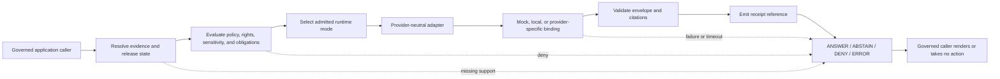

<!-- [KFM_META_BLOCK_V2]
doc_id: kfm://doc/runtime-readme
title: runtime/ — Bounded Runtime Composition Root
type: readme; root-readme; canonical-runtime-root; internal-composition-boundary; compatibility-drift-index
version: v0.5
status: proposed-update; canonical-root-confirmed; root-contract-current-at-target; implementation-mixed; deployment-unverified
owners:
  - "@bartytime4life — repository owner and current machine-projected review route"
  - "NEEDS VERIFICATION — independent runtime, governed-AI, governed-API, policy, evidence, security, test, and operations stewards"
created: "NEEDS VERIFICATION — compact root stub existed before v0.2 expansion"
updated: 2026-08-09
supersedes: "v0.4 upon merge"
policy_label: public-documentation; internal-runtime-boundary; no-direct-public-runtime; no-secrets; evidence-subordinate; policy-subordinate; release-subordinate
current_path: runtime/README.md
root_registry_id: root.runtime
readme_profile: ROOT_FULL
directory_authority:
  path: docs/doctrine/directory-rules.md
  version: 2.0.0-draft.1
  adopted_by: ADR-0029
truth_posture: >
  CONFIRMED runtime/ is a canonical, internal, versioned responsibility root at the pinned
  repository state; ADR-0029 is accepted; Directory Rules v2 governs placement; the current
  machine projection declares root.runtime; the current direct-child tree contains the lanes
  listed in this README; provider-neutral adapter, local, mock, Ollama, envelope, and service
  configuration documentation surfaces exist; and runtime/adapters, runtime/AI, and
  runtime/release identify themselves as compatibility or handoff surfaces /
  PROPOSED this ROOT_FULL modernization, the normalized health-lane closure, and future
  reconciliation of extra direct children through separately reviewed changes /
  CONFLICTED current direct children that are absent from the normalized Directory Rules
  runtime tree, including capitalized AI, domain-named lanes, runtime-local pipelines,
  runtime-local release, and log naming /
  UNKNOWN complete executable adapter behavior, accepted provider and model inventory,
  runtime policy execution, EvidenceRef resolution, citation validation, receipt persistence,
  service health implementation, deployment topology, network and tool permissions,
  production observability, public-client enforcement, and operational readiness /
  NEEDS VERIFICATION independent steward assignments, CODEOWNERS closure, full consumer and
  producer inventories for compatibility paths, current hosted-check outcomes, complete
  runtime test coverage, secret-store integration, retention policy, correction propagation,
  rollback automation, and the final disposition of non-normalized child lanes
evidence_snapshot:
  repository: bartytime4life/Kansas-Frontier-Matrix
  visibility: public
  base_ref: main
  base_commit: 7da777a8cd87130406bbcb081738e21f92f1c932
  prior_blob: 520097cf14639e41191a399c84f080c2c6cfb30f
  directory_rules_blob: fd49a0b83e55cef52c1124281f093e263526898d
  adr_0029_blob: b01322ef64f8c2b1ecb41de7ef4685b97cfa2a62
  root_registry_blob: 024f668b5f0a9239bafa4f8b09e2afd86300ff8c
  validator_entrypoint_blob: c308015da780d7b72f56277b521fb0e42317651e
related:
  - ./local/README.md
  - ./model_adapters/README.md
  - ./model_adapters/AdapterContract.md
  - ./mock/README.md
  - ./ollama/README.md
  - ./envelopes/README.md
  - ./service_configs/README.md
  - ./adapters/README.md
  - ./AI/README.md
  - ./flora/README.md
  - ./log/README.md
  - ./people/README.md
  - ./pipelines/README.md
  - ./release/README.md
  - ../apps/governed-api/README.md
  - ../packages/envelopes/README.md
  - ../contracts/runtime/README.md
  - ../contracts/runtime/decision_envelope.md
  - ../contracts/runtime/runtime_response_envelope.md
  - ../contracts/runtime/ai_receipt.md
  - ../schemas/contracts/v1/runtime/README.md
  - ../policy/runtime/README.md
  - ../fixtures/contracts/v1/runtime/README.md
  - ../tests/schemas/test_common_contracts.py
  - ../tools/validate_all.py
  - ../tools/validators/validate_decision_envelope.py
  - ../tools/validators/validate_runtime_response_envelope.py
  - ../data/receipts/README.md
  - ../release/README.md
  - ../configs/README.md
  - ../infra/README.md
  - ../docs/doctrine/directory-rules.md
  - ../docs/adr/ADR-0029-adopt-directory-governance-standard-v2.md
  - ../docs/adr/ADR-0008-ollama-subordinate-to-governed-api.md
  - ../docs/adr/ADR-0019-ai-adapter-contract-and-finite-envelopes.md
  - ../docs/security/SECRETS.md
  - ../docs/registers/DRIFT_REGISTER.md
  - ../control_plane/root_registry.yaml
tags: [kfm, runtime, canonical-root, root-full, internal-composition, local-runtime, model-adapters, mock-first, ollama, envelopes, service-configs, finite-outcomes, governed-api, evidence, policy, citations, receipts, security, compatibility, migration, rollback]
notes:
  - "This update changes runtime/README.md only. It does not create, move, rename, or delete a runtime child."
  - "It does not activate a model, provider, source, connector, public route, deployment, release, or publication path."
  - "Root conformance and runtime implementation maturity remain separate claims."
[/KFM_META_BLOCK_V2] -->

<a id="top"></a>

# `runtime/` — Bounded Runtime Composition Root

> **One-line purpose.** `runtime/` owns KFM's internal runtime composition, provider bindings, deterministic mocks, finite-outcome handoffs, health and kill-switch behavior, and non-secret service wiring without becoming a public API, evidence authority, policy authority, source authority, release authority, or publication path.

<p>
  <a href="#purpose"></a>
  <a href="#root-class-and-authority-owner"></a>
  <a href="#public-exposure-and-sensitivity-posture"></a>
  <a href="#adoption-and-conformance-status"></a>
  <a href="#validation-and-negative-checks"></a>
  <a href="#what-belongs-and-what-is-prohibited"></a>
</p>

> [!IMPORTANT]
> **The runtime is downstream of trust.** It may execute bounded internal behavior only after the governing caller supplies the evidence, policy, rights, sensitivity, freshness, release, and correction context required for that operation. A provider response, model output, valid envelope, green test, service configuration, health response, receipt, commit, pull request, or deployed process does not establish truth, authorize disclosure, promote lifecycle state, approve release, or publish KFM material.

> [!CAUTION]
> **No direct public runtime path.** Browser-to-model, browser-to-provider, browser-to-runtime, browser-to-secret-store, and browser-to-canonical-store paths are denied. Public and semi-public clients use a governed application boundary and receive only policy-safe, released, finite response envelopes.

**Quick navigation**

[Purpose](#purpose) · [Root class](#root-class-and-authority-owner) · [Status](#adoption-and-conformance-status) · [Boundaries](#what-belongs-and-what-is-prohibited) · [I/O](#inputs-outputs-and-permitted-writers) · [Exposure](#public-exposure-and-sensitivity-posture) · [Storage](#mutability-retention-generation-and-physical-storage) · [Validation](#validation-and-negative-checks) · [Review](#owner-reviewers-and-escalation-path) · [ADRs and migration](#governing-adrs-migrations-aliases-and-canonical-target-if-noncanonical) · [Child map](#direct-child-directory-map) · [Evidence review](#last-evidence-review-and-review-trigger) · [Operating model](#operating-model-and-finite-outcomes) · [Security](#secure-defaults-kill-switch-and-fallback-discipline) · [Contributing](#contributor-workflow) · [Rollback](#rollback-and-correction) · [Changelog](#changelog)

---

<a id="purpose"></a>

## Purpose

`runtime/` is the canonical KFM responsibility root for **bounded internal runtime composition**. It connects accepted application callers to provider-neutral adapters, deterministic mocks, provider-specific local runtime bindings, response-envelope helpers, health behavior, kill switches, and non-secret service configuration.

This root exists to answer six operational questions without taking over another authority surface:

1. Which internal runtime mode and adapter binding is selected?
2. Which bounded request contract does the caller provide?
3. Which evidence, policy, rights, sensitivity, freshness, correction, and release conditions have already been established?
4. Which finite outcome may the caller receive and render?
5. Which health, receipt, correlation, and diagnostic references make the run inspectable without exposing protected content?
6. How can the binding be disabled, replaced, replayed, corrected, or rolled back without changing public truth or bypassing review?

The root is intentionally narrower than an application, package, pipeline, policy bundle, data store, or release plane. Reusable provider-independent logic belongs in [`packages/`](../packages/); deployable public or internal service boundaries belong in [`apps/`](../apps/); normative admissibility rules belong in [`policy/`](../policy/); lifecycle data belongs in [`data/`](../data/); and release decisions belong in [`release/`](../release/).

### Operating law

```text
governed caller
  -> resolve evidence and current release/correction state
  -> evaluate policy, rights, sensitivity, and obligations
  -> select an admitted runtime mode and bounded adapter
  -> execute with timeout, cancellation, budgets, and network/tool limits
  -> validate citations and response-envelope semantics
  -> emit a finite outcome and authorized receipt reference
  -> return through the governed application boundary
```

At every step, failure remains bounded. Missing evidence produces `ABSTAIN`; prohibited use produces `DENY`; operational failure produces `ERROR`; and only supported, policy-safe results may produce `ANSWER`.

[Back to top](#top)

---

<a id="authority-level"></a>

## Root class and authority owner

| Field | Current repository-grounded posture |
|---|---|
| Root ID | `root.runtime` |
| Path | `runtime/` |
| Root class | `canonical` |
| Lifecycle state | Active responsibility root; no separate data-lifecycle phase |
| Primary responsibility | Bounded runtime composition, provider harnesses, deterministic mocks, and local adapters |
| Allowed artifact kind in the machine projection | `runtime_adapter` |
| Exposure | `internal` |
| Mutability | `versioned` |
| Retention | `repository_lifetime` for tracked runtime definitions; runtime state follows its owning external policy |
| Current named owner and review route | `@bartytime4life` in the machine projection |
| Independent runtime steward | `NEEDS VERIFICATION` |
| Authority level | Internal execution support only; subordinate to evidence, contracts, schemas, policy, applications, release decisions, and public interfaces |

The machine root registry is a projection of adopted governance, not a second doctrine source. It may help validators and contributors route work, but it does not create runtime authority, approve a provider, grant network access, make a route public, or override the accepted Directory Rules.

### Responsibility signature

| Dimension | Runtime answer |
|---|---|
| Responsibility | Compose and execute bounded internal runtime behavior. |
| Execution role | Internal adapter and provider-binding layer. |
| Scope | Cross-domain only where the runtime concern is shared; domain semantics remain in owning domain contracts and packages. |
| Exposure | Internal by default; public clients never call it directly. |
| Mutability | Versioned code, documentation, and non-secret configuration declarations. |
| Retention | Repository lifetime for tracked definitions; ephemeral operational state stays outside Git. |
| Prohibited authority | Source, evidence, policy, review, release, correction, rollback, and publication authority. |

[Back to top](#top)

---

<a id="status"></a>

## Adoption and conformance status

The root contract and implementation maturity are separate claims.

| Surface | Status | Evidence-bounded conclusion |
|---|---|---|
| `runtime/` responsibility root | `CONFIRMED` | Directory Rules v2 and the current machine projection classify it as canonical and internal. |
| Directory Rules authority | `CONFIRMED / ACCEPTED` | ADR-0029 adopts `docs/doctrine/directory-rules.md` as the single writable human-readable authority. |
| This README's ROOT_FULL structure | `PROPOSED UPDATE` until merge | The first twelve H2 sections follow the adopted root-README profile. |
| Current direct-child inventory | `CONFIRMED` at `main@7da777a8cd87130406bbcb081738e21f92f1c932` | Fourteen entries are present, including this README and thirteen directories. |
| Normalized canonical child set | `PARTIAL CONFORMANCE` | `local/`, `model_adapters/`, `mock/`, `ollama/`, `envelopes/`, and `service_configs/` exist; the normalized `health/` lane is absent. |
| Compatibility or unresolved children | `CONFIRMED PRESENT / NEEDS VERIFICATION` | `AI/`, `adapters/`, `flora/`, `log/`, `people/`, `pipelines/`, and `release/` require retained compatibility or object-by-object disposition; this README does not move them. |
| Provider-neutral adapter documentation | `CONFIRMED` | `runtime/model_adapters/README.md` defines the provider-neutral lane; presence is not execution proof. |
| Legacy adapter alias | `CONFIRMED COMPATIBILITY` | `runtime/adapters/README.md` routes new adapter work to `runtime/model_adapters/`. |
| Runtime contracts, schemas, validators, and fixtures | `CONFIRMED MIXED MATURITY` | Relevant surfaces exist; acceptance, complete coverage, and operational enforcement remain bounded. |
| Executable providers and model calls | `UNKNOWN / MIXED` | Documentation and placeholders do not prove usable provider execution. |
| Runtime policy, citation validation, evidence resolution, receipts, health, deployment, and production isolation | `UNKNOWN or NEEDS VERIFICATION` | Current-session runtime evidence was not exercised. |
| Public runtime route | `DENIED BY CONTRACT` | No direct public runtime path is allowed; any observed route would be a defect requiring investigation. |

### Conformance gaps recorded, not silently repaired

- `health/` is named by the normalized Directory Rules runtime tree but is absent from the current direct-child tree.
- `runtime/adapters/` duplicates the canonical `runtime/model_adapters/` concept and remains compatibility-only.
- `runtime/AI/` is a capitalized compatibility/index lane, not a canonical all-AI authority.
- `runtime/flora/` and `runtime/people/` are domain-named runtime lanes whose object-level placement and sensitivity posture remain `NEEDS VERIFICATION`.
- `runtime/log/` must remain a compatibility or routing surface; it must not become a committed operational log store.
- `runtime/pipelines/` must not compete with the canonical [`pipelines/`](../pipelines/) and [`pipeline_specs/`](../pipeline_specs/) roots.
- `runtime/release/` must not compete with the canonical [`release/`](../release/) decision plane.

A conformance gap is not permission to delete or relocate a path. Structural changes require a current inventory, producer and consumer closure, authority review, link and import repair, validation, migration evidence, and rollback.

[Back to top](#top)

---

<a id="what-belongs-here"></a>
<a id="what-does-not-belong-here"></a>

## What belongs and what is prohibited

### What belongs in `runtime/`

- Provider-neutral adapter implementations and handoff notes whose primary responsibility is runtime composition.
- Provider-specific local bindings that remain behind the provider-neutral boundary.
- Deterministic mocks and no-network runtime harnesses.
- Runtime envelope helpers that implement accepted contracts without redefining their meaning.
- Non-secret service configuration declarations and environment-variable documentation.
- Internal health, readiness, liveness, cancellation, timeout, circuit-breaker, and kill-switch behavior.
- Runtime correlation, bounded diagnostics, and receipt-emission adapters that write through the accepted accountability path.
- Compatibility indexes and migration notes for existing runtime child lanes while their disposition remains open.
- Root and child READMEs that state authority, evidence, negative paths, validation, and rollback limits.

### Prohibited from `runtime/`

| Prohibited material or behavior | Correct responsibility or disposition |
|---|---|
| A public API or user-facing deployable application | [`apps/`](../apps/) with a governed boundary |
| Direct browser-to-model, browser-to-provider, or browser-to-runtime access | Denied; route through the governed application trust membrane |
| Source admission or connector authority | [`connectors/`](../connectors/), source registry, policy, and review surfaces |
| Evidence truth, EvidenceBundle storage, or citation authority | Accepted evidence contracts and lifecycle/accountability roots |
| Normative allow, deny, hold, restrict, or abstain rules | [`policy/`](../policy/) |
| Semantic contract authority | [`contracts/`](../contracts/) |
| Machine schema authority | [`schemas/`](../schemas/) |
| Reusable provider-independent library ownership | [`packages/`](../packages/) |
| Canonical pipeline or pipeline-spec ownership | [`pipelines/`](../pipelines/) or [`pipeline_specs/`](../pipeline_specs/) |
| RAW, WORK, QUARANTINE, PROCESSED, CATALOG, TRIPLET, PUBLISHED, receipt, proof, or registry instances | The correct [`data/`](../data/) lane |
| Release, promotion, correction, withdrawal, rollback, or signature decisions | [`release/`](../release/) |
| Model weights, caches, downloaded corpora, bulk logs, session stores, vector indexes, or provider state | Governed external storage or the owning data/infra service; never Git-tracked runtime authority |
| Secrets, tokens, API keys, private keys, credentials, secret-bearing `.env` files, or private endpoints | Approved secret management and deployment configuration; never committed |
| Private chain-of-thought, hidden model reasoning, protected prompts, or raw restricted context | Do not persist or expose; retain bounded receipts and public-safe reason codes only |
| Domain truth or sensitive domain records inside `runtime/flora/` or `runtime/people/` | Route by object responsibility and lifecycle; default deny until classified |
| Generated prose presented as evidence, policy, review, release, or public truth | Denied; generated language remains interpretive |

### Root-level exception

`runtime/README.md` is the allowed root-level human contract for this responsibility root. New root-level runtime files require an explicit responsibility and placement check; do not use the root as a convenience bucket.

[Back to top](#top)

---

<a id="inputs"></a>
<a id="outputs"></a>

## Inputs, outputs, and permitted writers

### Inputs

A bounded runtime invocation should receive stable, minimal references and explicit constraints rather than unrestricted internal state.

| Input family | Required posture | Fail-safe behavior |
|---|---|---|
| Request | Validated caller contract, bounded scope, correlation ID, actor class, and permitted operation | `ERROR`, `DENY`, or validation failure |
| Evidence context | Resolved or resolvable evidence support appropriate to the claim; no assumption that a provider can create evidence | `ABSTAIN` |
| Policy context | Current decision, obligations, sensitivity, access, rights, and disclosure limits | `DENY` or narrowed scope |
| Release and correction context | Current released state, stale state, correction, withdrawal, and supersession signals where material | `ABSTAIN`, `DENY`, or hold |
| Runtime mode | Admitted mock, local, or provider-backed mode selected through non-secret configuration | `ERROR` or safe fallback |
| Adapter binding | Versioned provider-neutral interface and a declared implementation identity | `ERROR` |
| Execution budget | Timeout, cancellation, concurrency, token/size, network, tool, and retry limits | Cancel, trip circuit breaker, or `ERROR` |
| Citation obligations | Expected references, allowed evidence classes, and validation requirements | `ABSTAIN` if unsupported |
| Configuration | Non-secret profile plus references to secret-store bindings supplied outside Git | Fail closed if required binding is absent |

### Outputs

The root may produce or coordinate:

- a finite `DecisionEnvelope` or `RuntimeResponseEnvelope` conforming to the accepted contract/schema version;
- `ANSWER`, `ABSTAIN`, `DENY`, or `ERROR` with stable reason codes and obligations;
- evidence and citation references that were supplied or resolved by governed services, never invented as authority by the model;
- bounded health, readiness, liveness, timeout, cancellation, circuit-breaker, and provider-availability state;
- sanitized metrics and diagnostics that exclude secrets, protected payloads, harmful precision, and private reasoning;
- an `AIReceipt` or other runtime receipt candidate written through the accepted `data/receipts/` path by an authorized writer;
- safe proposed client actions that remain subject to the governed application's policy and interaction rules.

A runtime output does not promote data, approve a release, change public state, mutate a map, execute a publication action, or become evidence merely because it validates.

### Permitted writers

The current machine projection names `@bartytime4life` as owner, permitted writer, and reviewer for the repository root. That is a routing fact, not proof of complete operational separation of duties.

| Writer class | Permitted effect |
|---|---|
| Repository owner or authorized runtime maintainer | Change versioned runtime code, docs, and non-secret declarations through reviewed Git changes. |
| CI or validation automation | Read and validate runtime surfaces; emit bounded test or receipt artifacts; never approve itself. |
| Deployment automation | Materialize admitted configuration and secret references outside Git when separately authorized and audited. |
| Runtime process | Produce bounded ephemeral state and authorized accountability records; never write source, evidence, policy, or release authority. |
| Watcher or AI agent | Propose, inspect, classify, validate, or draft; never self-admit, self-approve, self-release, or publish. |
| Public client | **Forbidden writer and forbidden direct caller.** |

No runtime process may write directly to canonical evidence, policy, source, release, or published stores unless a separately accepted interface explicitly grants a narrow operation and emits the required decision and receipt trail. This README establishes no such grant.

[Back to top](#top)

---

## Public exposure and sensitivity posture

The root registry classifies `runtime/` as **internal**. Runtime endpoints, provider bindings, model daemons, tool executors, health details, prompts, and diagnostics are not ordinary public interfaces.

### Exposure rules

- Public and semi-public clients call a governed application or API boundary, not `runtime/` directly.
- Local providers bind to loopback or a private network by default; external exposure requires an accepted app/infra design, authentication, authorization, rate limits, auditability, and a deny-by-default policy.
- A public health summary, if later required, belongs to the deployable application boundary and must disclose only coarse, non-sensitive status.
- Runtime error bodies must use stable public-safe codes and must not reveal stack traces, filesystem paths, secret names, provider credentials, internal topology, protected reasons, or restricted evidence.
- Model/provider identity may be disclosed only when policy and product requirements permit it; disclosure never substitutes for evidence or citation.
- Tool and network access is denied unless explicitly admitted, bounded, logged, and covered by the caller's policy decision.

### Sensitive material

Unknown or unresolved rights, sovereignty, cultural sensitivity, living-person data, DNA/genomics, rare-species locations, archaeology, infrastructure, private-land/title information, private wells, or harmful geographic precision fails closed.

The runtime must not:

- persist protected context merely for debugging convenience;
- include precise restricted locations in logs, traces, examples, screenshots, or error messages;
- expose policy-denial internals that would reveal the protected fact;
- pass a broader context window to a provider than the accepted purpose requires;
- retain private chain-of-thought or provider-internal reasoning as evidence;
- downgrade a `DENY` or `ABSTAIN` to a fluent answer when an adapter or policy service is unavailable.

Redaction, generalization, minimization, staged access, and delayed release are governed transformations. They require reasoned policy and receipt support outside this README.

[Back to top](#top)

---

## Mutability, retention, generation, and physical storage

| Concern | Root contract |
|---|---|
| Tracked runtime definitions | Versioned in Git and retained for repository lifetime. |
| Runtime configuration | Only non-secret defaults, schemas, templates, and variable names may be tracked. Effective secret values remain external. |
| Adapter/provider state | Ephemeral or externally managed; not a Git-tracked truth store. |
| Model weights and downloaded assets | External governed storage with provenance, integrity, license, retention, and access controls; not committed under `runtime/`. |
| Logs and traces | External observability storage with minimization, redaction, access, retention, and deletion policy; `runtime/log/` must not become a bulk log store. |
| Caches and session state | Ephemeral or externally governed; never treated as evidence, catalog, or release state. |
| Receipts | Durable instances belong under the accepted `data/receipts/` family or approved external accountability store, not in `runtime/`. |
| Generated types or clients | Belong to declared generated projections under their owning schema/package process; do not accumulate undeclared generated authority here. |
| Health state | Ephemeral; health contracts and helpers may be versioned, but live status is operational data. |
| README maintenance | Correct in place while preserving `doc_id`, legacy anchors, evidence snapshot, changelog, and rollback path. |
| Compatibility paths | Retain until producer, consumer, identity, link, import, validation, and rollback closure proves a safe migration. |

### Physical storage rule

Logical runtime ownership does not imply that every byte lives under `runtime/`. Runtime code and contracts of implementation may be tracked here; secrets, model assets, logs, caches, temporary responses, session state, and protected context must use the accepted external store for their object family and risk class.

### Generation rule

Generated output is never authoritative merely because a runtime produced it. Any generated candidate that may affect evidence, policy, public claims, maps, release state, correction, or rollback must enter the appropriate governed lifecycle and review path.

[Back to top](#top)

---

<a id="validation"></a>

## Validation and negative checks

Validation must distinguish documentation conformance, contract/schema shape, deterministic runtime behavior, evidence support, policy execution, security posture, operational readiness, and public release. A pass in one layer does not prove another.

### Repository-native validation surfaces

| Surface | What it can establish | What it cannot establish by itself |
|---|---|---|
| `python tools/validate_all.py` | Runs the current aggregate validator entrypoint configured by the repository. | Production runtime behavior, provider admission, security isolation, evidence support, policy authority, or release. |
| `tools/validators/validate_decision_envelope.py` | Bounded no-network schema and semantic conformance for DecisionEnvelope inputs and fixtures. | Evidence resolution, policy evaluation, authenticated review, release, publication, or public use. |
| `tools/validators/validate_runtime_response_envelope.py` | Bounded runtime-response shape and local semantic checks where configured. | Provider correctness, citation truth, receipt persistence, deployment, or public safety. |
| Contract/schema fixture tests | Positive and negative shape coverage for the tested object version. | Complete application flow or operational control enforcement. |
| Mock-first tests | Deterministic finite outcomes, failure polarity, and no-network behavior. | Live-provider readiness or permission to activate a model. |
| Hosted CI | Changed-area workflow evidence at a specific commit. | Human review, policy approval, release, deployment, or publication. |

### Required README checks

- exactly one H1;
- the first twelve H2 headings match Directory Rules v2 §16.2 in the required order;
- `kfm://doc/runtime-readme` and legacy anchors remain stable;
- metadata and fenced code blocks are balanced;
- custom anchors are unique and internal fragment links resolve;
- the direct-child map matches the pinned `runtime/` tree;
- repository-relative links used as current evidence resolve at the pinned base;
- truth labels distinguish root conformance from implementation maturity;
- no invented owner, approval, provider, model, route, deployment, test, rights, policy, release, or publication claim;
- no credential, private key, secret value, protected personal data, DNA/genomic data, harmful precise location, or private reasoning;
- remote branch bytes and changed-path set match the reviewed packet.

### Runtime acceptance checks

A runtime implementation is not ready merely because this README is current. Applicable changes should prove:

1. accepted request and response contract versions;
2. deterministic mock behavior and negative fixtures;
3. finite outcome polarity for evidence-missing, policy-denied, provider-unavailable, timeout, malformed-output, citation-failure, and cancellation cases;
4. no-network unit tests and explicit network/tool admission tests;
5. timeout, cancellation, retry, circuit-breaker, and kill-switch behavior;
6. secret loading by reference without logging or committing values;
7. sanitized errors, logs, traces, metrics, and health summaries;
8. evidence and citation references cannot be invented, widened, or silently dropped;
9. public clients cannot bypass the governed application boundary;
10. receipts bind effective adapter, provider/model identity where permitted, input/output digests, policy state, and failure reason without private reasoning;
11. correction, withdrawal, stale-state, and rollback behavior propagate through the caller;
12. replay and rollback are deterministic for the tested envelope and configuration version.

### Negative checks

A review must fail or hold when:

- a direct public model/provider/runtime endpoint is added;
- a runtime module decides source, evidence, policy, release, correction, or publication authority;
- secrets, protected payloads, raw prompts, chain-of-thought, or precise restricted locations appear in tracked files or diagnostics;
- a provider is activated with unknown terms, license, model identity, network behavior, or retention posture;
- a compatibility path accumulates new canonical authority;
- `runtime/pipelines/` competes with canonical pipeline roots or `runtime/release/` competes with `release/`;
- a health endpoint leaks internal topology or protected failure reasons;
- a fallback converts `DENY`, `ABSTAIN`, or `ERROR` into an unsupported `ANSWER`;
- a map, tile, graph, index, model output, receipt, test, PR, merge, or deployment is presented as sovereign truth or release proof.

[Back to top](#top)

---

<a id="review-burden"></a>

## Owner, reviewers, and escalation path

| Role or question | Current posture |
|---|---|
| Repository owner and current machine-projected route | `@bartytime4life` — `CONFIRMED` |
| Runtime steward | `NEEDS VERIFICATION` |
| Governed API steward | Required for caller boundary, route, authentication, response, or public exposure changes; named assignment `NEEDS VERIFICATION` |
| Governed-AI/model steward | Required for adapter/provider/model behavior; named assignment `NEEDS VERIFICATION` |
| Evidence and citation reviewer | Required when evidence resolution, citation validation, or claim support changes |
| Policy, rights, sensitivity, and privacy reviewer | Required when admissibility, disclosure, protected context, or domain sensitivity changes |
| Security and infrastructure reviewer | Required for network, secret, sandbox, tool, process, health, observability, or deployment changes |
| Contract/schema reviewer | Required for request, response, receipt, health, or adapter-interface shape changes |
| Test/CI reviewer | Required for validator, fixture, workflow, or required-check changes |
| Release/correction/rollback reviewer | Required when runtime changes affect released behavior, correction propagation, or rollback |
| Independent approval | `NEEDS VERIFICATION`; current single-owner routing is not independent review |

### Escalation rules

- Hold the change when the primary responsibility root is ambiguous.
- Open or update a bounded drift or verification record when a compatibility lane lacks a safe disposition.
- Require an ADR when authority, root class, canonical target, public boundary, contract meaning, or dependency direction changes.
- Escalate to policy/security review before adding network or tool capability, provider retention, sensitive context, or public exposure.
- Escalate to release/correction review before changing behavior already consumed by a released public surface.
- Prefer `ABSTAIN`, `DENY`, or a narrowed implementation slice over guessing an owner, policy, provider approval, or release state.

A green workflow, CODEOWNER route, generated receipt, or mergeability result is not independent approval by itself.

[Back to top](#top)

---

<a id="related-folders"></a>
<a id="adrs"></a>

## Governing ADRs, migrations, aliases, and canonical target if noncanonical

### Governing and related decisions

| Decision or source | Status | Runtime consequence |
|---|---|---|
| [ADR-0029 — Adopt Directory Governance Standard v2](../docs/adr/ADR-0029-adopt-directory-governance-standard-v2.md) | `accepted` | Establishes the current Directory Rules authority and canonical `runtime/` responsibility boundary. |
| [Directory Rules v2](../docs/doctrine/directory-rules.md) | adopted exact bytes via ADR-0029 | Defines runtime composition, prohibited authority, normalized child lanes, dependency direction, and ROOT_FULL README profile. |
| [Machine root registry](../control_plane/root_registry.yaml) | active projection, not authority | Declares `root.runtime` canonical, internal, versioned, and limited to runtime adapters. |
| [ADR-0008 — Ollama subordinate to governed API](../docs/adr/ADR-0008-ollama-subordinate-to-governed-api.md) | `draft / proposed` | Useful design evidence; it does not activate Ollama or establish accepted runtime policy. |
| [ADR-0019 — AI adapter contract and finite envelopes](../docs/adr/ADR-0019-ai-adapter-contract-and-finite-envelopes.md) | `draft / proposed` | Useful design evidence; it does not make the current adapter contract or envelopes adopted authority. |

### Canonical root and child aliases

`runtime/` is already canonical. It has no replacement root and no authorized root alias.

Current child-level compatibility relationships are narrower:

| Existing path | Current posture | Canonical target or exit condition |
|---|---|---|
| `runtime/adapters/` | Compatibility and migration index | New provider-neutral work routes to `runtime/model_adapters/`; retire only after zero-producer/zero-consumer and link/import closure. |
| `runtime/AI/` | Compatibility and navigation index | Route each artifact to its owning runtime, contract, schema, policy, fixture, test, receipt, release, app, or package surface; final path disposition remains open. |
| `runtime/log/` | Compatibility/no-log-store posture | Runtime definitions may remain; live logs use governed external observability storage. Final child disposition remains open. |
| `runtime/pipelines/` | Runtime-to-pipeline handoff only | Canonical pipeline implementation and specs remain under `pipelines/` and `pipeline_specs/`. |
| `runtime/release/` | Runtime-to-release handoff only | Canonical release decisions remain under `release/`. |
| `runtime/flora/`, `runtime/people/` | Existing domain-coupled lanes | Object-by-object classification required; no blanket canonical target is asserted here. |

### Migration discipline

This README does not move, rename, delete, mirror, or create any child. A future migration must:

1. freeze the current authority, path, object family, identifiers, and base commit;
2. inventory all bytes, producers, consumers, imports, links, workflows, fixtures, generated outputs, and external callers;
3. choose one writable canonical target by responsibility;
4. record old-to-new mappings, compatibility mode, deprecation window, and exit conditions;
5. move through a feature branch with history preservation where practical;
6. repair references and validate positive, negative, replay, and rollback behavior;
7. prove zero independent writers before compatibility retirement;
8. retain a correction or migration receipt appropriate to the change.

[Back to top](#top)

---

<a id="repo-fit"></a>
<a id="current-lane-index"></a>

## Direct-child directory map

Verified against the GitHub contents view for `runtime/` at `main@7da777a8cd87130406bbcb081738e21f92f1c932`.

```text
runtime/
├── AI/
├── README.md
├── adapters/
├── envelopes/
├── flora/
├── local/
├── log/
├── mock/
├── model_adapters/
├── ollama/
├── people/
├── pipelines/
├── release/
└── service_configs/
```

### Direct-child classification

| Direct child | Current class | Responsibility and boundary | Canonical target or open disposition |
|---|---|---|---|
| `README.md` | Root-level exception | This ROOT_FULL human contract | Same path |
| `AI/` | Compatibility/index | Governed-AI runtime navigation only; no parallel AI authority | Route by object responsibility; final path `NEEDS VERIFICATION` |
| `adapters/` | Compatibility/migration | Legacy adapter discovery and migration index | `model_adapters/` for new provider-neutral adapter work |
| `envelopes/` | Canonical functional lane | Runtime envelope implementation helpers; contract/schema meaning remains elsewhere | Same path |
| `flora/` | Existing non-normalized domain lane | Runtime-coupled flora support only; must not own flora truth, source, policy, or published data | Object-level classification `NEEDS VERIFICATION` |
| `local/` | Canonical functional lane | Local runtime wiring and loopback-first integration | Same path |
| `log/` | Compatibility/routing lane | Log semantics and safe routing only; no committed bulk runtime logs | External observability / object-level disposition `NEEDS VERIFICATION` |
| `mock/` | Canonical functional lane | Deterministic no-network runtime behavior | Same path |
| `model_adapters/` | Canonical functional lane | Provider-neutral model adapter boundary | Same path |
| `ollama/` | Canonical functional lane | Local Ollama-specific runtime binding behind the adapter and governed caller | Same path |
| `people/` | Existing non-normalized sensitive domain lane | Runtime-coupled people support only; living-person and genomic concerns fail closed | Object-level classification `NEEDS VERIFICATION` |
| `pipelines/` | Compatibility/handoff | Runtime-to-pipeline coordination only | Canonical implementation/spec roots are `pipelines/` and `pipeline_specs/` |
| `release/` | Compatibility/handoff | Runtime-to-release readiness support only; never release authority | Canonical decision root is `release/` |
| `service_configs/` | Canonical functional lane | Non-secret runtime service configuration declarations | Same path |

### Normalized target closure

Directory Rules names the following normalized runtime child set:

```text
runtime/
├── local/
├── model_adapters/
├── mock/
├── ollama/
├── envelopes/
├── service_configs/
└── health/
```

`health/` is currently absent. Its absence is a documented conformance gap, not authority for this README change to create it. Any health-lane implementation must define its contract, exposure, information-disclosure limits, tests, ownership, and rollback before admission.

[Back to top](#top)

---

<a id="last-reviewed"></a>

## Last evidence review and review trigger

| Field | Value |
|---|---|
| Last documentation evidence review | 2026-08-09 |
| Repository | `bartytime4life/Kansas-Frontier-Matrix` |
| Pinned base | `main@7da777a8cd87130406bbcb081738e21f92f1c932` |
| Prior README blob | `520097cf14639e41191a399c84f080c2c6cfb30f` |
| Directory Rules blob | `fd49a0b83e55cef52c1124281f093e263526898d` |
| ADR-0029 blob | `b01322ef64f8c2b1ecb41de7ef4685b97cfa2a62` |
| Root registry blob | `024f668b5f0a9239bafa4f8b09e2afd86300ff8c` |
| Evidence reviewed | Target README, adopted directory authority, accepted ADR, machine projection, current direct-child tree, selected child READMEs, runtime contracts/schemas/validators referenced by the current root, and sibling ROOT_FULL patterns |
| Runtime exercised | No live model, provider, evidence resolver, policy engine, receipt store, deployment, health endpoint, or public client was exercised for this documentation update |

### Review triggers

Re-review this root contract when any of the following occurs:

- a direct child is added, moved, renamed, deleted, deprecated, or reclassified;
- the Directory Rules, ADR-0029, root registry, path aliases, or README profile changes;
- a provider, model, network tool, execution sandbox, or adapter mode is admitted;
- a request, response, receipt, health, or adapter contract/schema changes materially;
- a public or semi-public route is proposed or detected;
- secret loading, logs, traces, metrics, model storage, cache, session, or retention behavior changes;
- runtime policy, evidence resolution, citation validation, or receipt persistence becomes executable;
- a compatibility child starts receiving new writes or is proposed for retirement;
- a released consumer changes finite-outcome, correction, withdrawal, stale-state, or rollback behavior;
- a security incident, provider-term change, model change, test regression, or drift finding affects this boundary.

The evidence snapshot is a checkpoint, not a claim that the root remains unchanged indefinitely.

[Back to top](#top)

---

## Operating model and finite outcomes

### Trust-preserving runtime sequence


```mermaid
flowchart LR
    A[Governed application caller] --> B[Resolve evidence and release state]
    B --> C[Evaluate policy, rights, sensitivity, and obligations]
    C --> D[Select admitted runtime mode]
    D --> E[Provider-neutral adapter]
    E --> F[Mock, local, or provider-specific binding]
    F --> G[Validate envelope and citations]
    G --> H[Emit receipt reference]
    H --> I[ANSWER / ABSTAIN / DENY / ERROR]
    I --> J[Governed caller renders or takes no action]

    C -. deny .-> I
    B -. missing support .-> I
    F -. failure or timeout .-> I
```

The diagram is explanatory, not implementation proof. Each arrow requires a verified contract or service before it may be claimed as executable.

### Finite outcome vocabulary

| Outcome | Runtime meaning | Required posture |
|---|---|---|
| `ANSWER` | A bounded result is supported, policy-safe, citation-valid where required, and within the released/current scope supplied by the caller. | Evidence and policy closure appropriate to consequence; no unsupported widening. |
| `ABSTAIN` | Evidence is missing, stale, conflicted, unresolved, out of scope, or citation validation failed without a policy denial. | Explain with a stable public-safe reason; do not guess. |
| `DENY` | Policy, rights, sensitivity, access, source terms, public precision, or prohibited capability blocks execution or disclosure. | Preserve protected reasons internally and return only the allowed public-safe reason. |
| `ERROR` | Runtime, adapter, provider, validator, policy service, evidence resolver, receipt writer, timeout, cancellation, or dependency failed. | Fail closed; never convert to an unsupported answer. |

`HOLD`, `READY`, `APPROVED`, `RELEASED`, and similar lifecycle/release terms are not runtime answer outcomes. Do not collapse runtime status with review, promotion, release, or publication state.

### Reason-code expectations

Reason codes should be stable, uppercase, machine-readable, and specific enough for correction without exposing protected detail. Examples include `EVIDENCE_UNRESOLVED`, `CITATION_INVALID`, `POLICY_DENIED`, `SENSITIVE_SCOPE`, `PROVIDER_UNAVAILABLE`, `TIMEOUT`, `CANCELLED`, `MALFORMED_PROVIDER_OUTPUT`, `RECEIPT_WRITE_FAILED`, and `NOT_IMPLEMENTED`. The accepted registry and exact vocabulary remain `NEEDS VERIFICATION`; examples here are descriptive, not a new authority list.

[Back to top](#top)

---

## Runtime component boundaries and modes

### Responsibility map

| Component family | Owns | Must not own |
|---|---|---|
| Governed application | Authentication, authorization, public routes, orchestration, client-safe response behavior | Canonical evidence or policy meaning by itself |
| Runtime composition | Mode selection, adapter wiring, timeouts, cancellation, health, kill switch, provider handoff | Public API authority, evidence, policy, release, or publication |
| Provider-neutral adapter | Stable invocation boundary and normalized provider result | Source truth, policy decisions, or direct public rendering |
| Mock runtime | Deterministic no-network outcomes and failure fixtures | Claims of live-provider parity without tests |
| Local provider binding | Local daemon/process integration behind the adapter | Public exposure, secret storage, or release approval |
| Envelope helper | Implement accepted finite response shapes | Redefine contract or schema meaning |
| Policy service | Normative allow/deny/hold/restrict/abstain decision | Runtime provider behavior or public prose |
| Evidence and citation services | Resolve support and validate references | Provider selection or release approval |
| Receipt writer | Append accountable run records in the accepted store | Proof, evidence, review, or release authority |
| Release plane | Promotion, release, correction, withdrawal, rollback, signatures | Runtime execution details as sovereign truth |

### Runtime modes

| Mode | Intended use | Admission posture |
|---|---|---|
| Deterministic mock | Default development and CI path for finite outcomes and negative cases | Preferred first; no network; reproducible fixtures |
| Local provider | Bounded local inference or processing behind loopback/private networking | Requires provider/model identity, resource limits, secret posture, tests, and kill switch |
| Remote provider | External service through an admitted adapter | Requires terms, rights, retention, security, network, cost, audit, and policy review |
| Disabled | Explicit runtime-off state | Must return a stable finite outcome without unsafe fallback |

A fallback chain must be explicit. It may move from a remote provider to a local provider or mock only when the caller's policy and semantics allow equivalent behavior. It must never convert a deny, missing evidence, unsupported claim, or citation failure into an answer.

[Back to top](#top)

---

## Secure defaults, kill switch, and fallback discipline

### Default security posture

- Bind local model and provider services to loopback or an explicitly private interface.
- Use deny-by-default firewall, reverse-proxy, origin, and authentication rules.
- Keep provider credentials and signing material in an approved secret store; load by reference.
- Minimize context sent to providers and remove fields not required for the declared purpose.
- Disable tool and network access unless explicitly admitted for the operation.
- Set hard input, output, time, token, memory, process, and concurrency limits.
- Sanitize logs, traces, metrics, health output, screenshots, examples, and test artifacts.
- Pin adapter and provider dependencies; verify integrity and license posture before activation.
- Separate development fixtures from production data and keep tests no-network by default.
- Preserve correlation and receipt references without exposing protected payloads.

### Kill-switch contract

Every provider-backed path should support a bounded disable mechanism that:

1. stops new provider calls;
2. cancels or drains in-flight work according to the accepted safety policy;
3. returns a deterministic finite outcome;
4. does not silently route to a less governed provider or broader capability;
5. emits an operational receipt or incident reference where required;
6. leaves public release state unchanged unless a separate correction/withdrawal decision is made;
7. is testable without production secrets.

The existence of a documented kill switch is not proof that an implementation exists. Current implementation remains `NEEDS VERIFICATION` until code, config, tests, and runtime evidence are inspected together.

### Fallback matrix

| Trigger | Allowed fallback | Forbidden fallback |
|---|---|---|
| Provider unavailable | Another admitted equivalent provider or deterministic mock, when semantics and policy permit | Unreviewed provider, raw model endpoint, or unsupported answer |
| Evidence unresolved | `ABSTAIN` | Generate plausible evidence or citations |
| Policy denied | `DENY` | Retry through a weaker policy path |
| Citation validation failure | `ABSTAIN` or `ERROR` | Return uncited answer as authoritative |
| Receipt writer unavailable for a receipt-required operation | `ERROR` or hold | Execute silently without accountability |
| Timeout/cancellation | `ERROR` or explicit cancelled outcome | Continue in background without authorization |
| Runtime disabled | Stable unavailable/not-implemented outcome | Direct client access to provider |

[Back to top](#top)

---

## Root conformance versus implementation maturity

A current README can establish the root contract without proving the runtime is complete.

### Conformance dimensions

| Dimension | Current posture |
|---|---|
| Responsibility-root classification | `CONFIRMED` canonical |
| ROOT_FULL documentation structure | `PROPOSED UPDATE` until merge |
| Current child inventory | `CONFIRMED` at pinned base |
| Normalized child parity | `PARTIAL`; `health/` absent and extra compatibility lanes present |
| No direct public route in doctrine | `CONFIRMED` requirement |
| No direct public route in every deployed environment | `UNKNOWN` without deployment inspection |
| Provider-neutral adapter lane | `CONFIRMED` documentation surface |
| Deterministic mock lane | `CONFIRMED` documentation surface; execution coverage remains bounded |
| Finite contracts/schemas | `CONFIRMED` present with mixed/proposed maturity |
| Runtime policy execution | `UNKNOWN` |
| Evidence and citation integration | `UNKNOWN` |
| Durable receipt persistence | `UNKNOWN` |
| Health and kill-switch implementation | `UNKNOWN / NEEDS VERIFICATION` |
| Production security and observability | `UNKNOWN` |
| Released consumer behavior | `NEEDS VERIFICATION` per consumer and commit |

### Maturity labels

Use these labels for runtime capabilities:

- `DOCUMENTED` — boundary or intended behavior is described.
- `SCHEMA_PRESENT` — machine shape exists but acceptance and enforcement may remain open.
- `FIXTURE_PROVEN` — bounded positive/negative fixtures pass at a pinned commit.
- `INTEGRATION_PROVEN` — the governed caller, adapter, policy/evidence services, receipt writer, and finite response are exercised together.
- `OPERATIONALLY_PROVEN` — deployment, security, health, observability, incident, correction, and rollback evidence exists in the target environment.
- `RELEASED` — a separate governed release decision covers the behavior.

Do not skip levels through persuasive prose. A README, schema, test, workflow, PR, merge, or deployment is evidence for its own layer only.

[Back to top](#top)

---

## Contributor workflow

1. **Freeze the target.** Record the base commit, current file/blob, applicable ADRs, Directory Rules, root registry entry, and path-scoped instructions.
2. **Classify the change.** Decide whether it is documentation, runtime implementation, contract/schema, policy, security, structural migration, or a dependency-closed combination.
3. **Identify the owning root.** Keep runtime-only behavior here; route packages, apps, policy, data, release, pipelines, fixtures, tests, and docs to their owning roots.
4. **Close direct dependencies.** Update every directly required contract, schema, fixture, validator, test, configuration declaration, runbook, and compatibility note in the same review boundary or disclose a bounded follow-up.
5. **Keep tests no-network first.** Add deterministic valid, invalid, denied, abstained, error, timeout, and cancellation cases before live integration.
6. **Preserve finite outcomes.** Do not introduce free-text-only responses or unsafe fallback.
7. **Protect secrets and sensitive data.** Use synthetic public-safe fixtures and references, never real credentials or protected records.
8. **Validate proportionally.** Run changed-area checks, negative tests, link/anchor checks, and hosted CI appropriate to risk.
9. **Deliver through a feature branch and draft PR.** Do not write directly to the default branch, force-push, self-approve, merge, release, deploy, or publish.
10. **Record rollback.** State how to revert code, config, contracts, schemas, migrations, and runtime state without losing audit history.

### Pull-request evidence packet

A material runtime PR should identify:

- goal, non-goals, and observable acceptance boundary;
- base and head commits;
- changed paths and owning roots;
- truth labels and implementation maturity;
- affected request/response/receipt versions;
- provider/model/network/tool and secret posture;
- evidence, policy, citation, release, correction, and rollback dependencies;
- local checks and exact outcomes;
- hosted checks as `PASS`, `FAIL`, `PENDING`, or `NOT RUN`;
- compatibility impact, migration plan, and rollback command or commit.

[Back to top](#top)

---

## Anti-patterns

Do not:

- expose a model, provider, local daemon, or runtime port directly to a browser or ordinary public client;
- place a deployable public API under `runtime/`;
- let a provider response stand in for EvidenceBundle support or citation truth;
- embed policy decisions in adapter conditionals without the accepted policy surface and tests;
- store secrets, private keys, provider credentials, protected context, or real sensitive fixtures in Git;
- persist private chain-of-thought or hidden reasoning as an evidence object;
- use `runtime/log/` as an operational log warehouse;
- create new canonical adapter work under `runtime/adapters/`;
- create canonical pipeline logic under `runtime/pipelines/` or release decisions under `runtime/release/`;
- turn domain-named runtime lanes into domain truth stores;
- treat a health check as evidence that policy, citations, release, or public safety is correct;
- treat a receipt as proof, a test as approval, a merge as release, or a deployment as publication;
- silently fall back from denied, unsupported, stale, or uncited states to an answer;
- add a compatibility alias without an owner, canonical target, exit condition, and zero-independent-writes rule;
- remove a legacy lane before producer, consumer, link, import, fixture, workflow, and rollback closure.

[Back to top](#top)

---

## Related documentation and authority surfaces

### Primary authority and governance

- [Directory Rules v2](../docs/doctrine/directory-rules.md)
- [ADR-0029 — Adopt Directory Governance Standard v2](../docs/adr/ADR-0029-adopt-directory-governance-standard-v2.md)
- [Machine root registry](../control_plane/root_registry.yaml)
- [Drift register](../docs/registers/DRIFT_REGISTER.md)

### Runtime and caller boundaries

- [Local runtime lane](./local/README.md)
- [Provider-neutral model adapters](./model_adapters/README.md)
- [Adapter boundary note](./model_adapters/AdapterContract.md)
- [Deterministic mock runtime](./mock/README.md)
- [Ollama runtime binding](./ollama/README.md)
- [Runtime envelope helpers](./envelopes/README.md)
- [Non-secret service configuration](./service_configs/README.md)
- [Governed API](../apps/governed-api/README.md)
- [Reusable envelope package](../packages/envelopes/README.md)

### Meaning, shape, policy, evidence, and accountability

- [Runtime semantic contracts](../contracts/runtime/README.md)
- [DecisionEnvelope contract](../contracts/runtime/decision_envelope.md)
- [RuntimeResponseEnvelope contract](../contracts/runtime/runtime_response_envelope.md)
- [AIReceipt contract](../contracts/runtime/ai_receipt.md)
- [Runtime schemas](../schemas/contracts/v1/runtime/README.md)
- [Runtime policy surface](../policy/runtime/README.md)
- [Runtime fixtures](../fixtures/contracts/v1/runtime/README.md)
- [Receipt accountability root](../data/receipts/README.md)
- [Release decision root](../release/README.md)

### Related proposed ADRs

- [ADR-0008 — Ollama subordinate to the governed API](../docs/adr/ADR-0008-ollama-subordinate-to-governed-api.md) — draft/proposed
- [ADR-0019 — AI adapter contract and finite envelopes](../docs/adr/ADR-0019-ai-adapter-contract-and-finite-envelopes.md) — draft/proposed

The related documents do not all have equal authority or maturity. Read their metadata and current status before relying on them.

[Back to top](#top)

---

## Rollback and correction

### Documentation-only rollback for this README

This v0.5 update changes one Markdown file and no runtime behavior. Rollback is therefore:

1. revert the feature-branch commit or the eventual merge commit;
2. restore prior blob `520097cf14639e41191a399c84f080c2c6cfb30f` at `runtime/README.md` if a byte-exact restoration is required;
3. rerun README structure, anchors, direct-child parity, links, and hosted documentation checks;
4. preserve the revert commit and PR history rather than rewriting shared history.

No runtime state, data, model, secret, deployment, release, or publication rollback is required for this documentation-only change.

### Runtime change rollback expectations

A behavioral runtime change should identify:

- the prior adapter/provider/configuration version;
- affected callers and public-safe outcomes;
- state or receipt compatibility;
- kill-switch and fallback behavior;
- cache/session/process cleanup;
- correction or withdrawal effects for already released outputs;
- verification that the public client still receives finite, policy-safe behavior;
- the rollback receipt and incident/correction reference appropriate to consequence.

Rollback does not erase receipts, prior decisions, or correction lineage. A rollback is an accountable transition, not a file copy or undocumented provider switch.

[Back to top](#top)

---

## Changelog

### v0.5 — 2026-08-09

- Reorganized the root README to the adopted Directory Rules v2 `ROOT_FULL` profile.
- Updated the evidence baseline to `main@7da777a8cd87130406bbcb081738e21f92f1c932`.
- Replaced stale Directory Rules v1.4 framing with the exact v2 bytes adopted by ADR-0029.
- Bound the README to machine projection `root.runtime` without treating the projection as doctrine.
- Clarified `runtime/` as an internal, canonical, versioned, repository-lifetime composition root.
- Added explicit inputs, outputs, permitted writers, exposure, storage, validation, review, migration, and review-trigger contracts.
- Reconciled the current direct-child tree with the normalized target set and recorded missing `health/` as a conformance gap.
- Preserved `runtime/adapters/`, `runtime/AI/`, and `runtime/release/` as compatibility or handoff surfaces rather than parallel authorities.
- Kept `flora/`, `people/`, `log/`, and `pipelines/` visible as unresolved non-normalized lanes without authorizing structural changes.
- Strengthened finite-outcome, secret, sensitive-data, no-direct-public-runtime, kill-switch, fallback, correction, and rollback boundaries.
- Preserved legacy anchors used by the v0.4 quick navigation.
- Changed documentation only; no runtime child, code, contract, schema, policy, fixture, test, workflow, provider, model, route, deployment, release, or public artifact was created or modified.

### v0.4 — 2026-07-23

- Expanded the earlier runtime root guide with repository-grounded child-lane evidence, compatibility drift, finite outcomes, and security boundaries.
- Used Directory Rules v1.4 and an earlier repository snapshot; both are superseded for current placement claims by the v0.5 evidence baseline and accepted Directory Rules v2 decision.

### Earlier editions

- v0.3 and earlier established the root's internal wiring, mock-first, provider-neutral, governed-API-subordinate, and no-direct-public-runtime posture.
- Prior editions remain available through Git history and are not rewritten as current implementation proof.

[Back to top](#top)

---

## Glossary

| Term | Meaning in this root contract |
|---|---|
| Adapter | A bounded implementation that translates an accepted runtime request to a provider or deterministic mock and normalizes the result. |
| Provider | A local or remote model/service implementation invoked behind an admitted adapter. |
| Runtime composition | Internal wiring among callers, adapters, providers, envelopes, health, budgets, and receipts. |
| Governed caller | An application/service boundary that has already applied authentication, authorization, evidence, policy, release, and client-safety controls appropriate to the operation. |
| Finite outcome | `ANSWER`, `ABSTAIN`, `DENY`, or `ERROR`, plus stable reason and obligation fields. |
| Receipt | An accountable record of what ran, under which versions and constraints; not evidence, proof, review, release, or publication authority. |
| Health | Operational liveness/readiness state; not truth, policy, release, or public-safety proof. |
| Kill switch | A bounded mechanism that disables provider-backed execution and returns a safe deterministic outcome. |
| Compatibility lane | An existing path retained for discovery, link preservation, or migration; it may not accumulate independent canonical authority. |
| Trust membrane | The governed application boundary separating public clients from canonical/internal stores, policy internals, and runtime providers. |

---

**Final operating rule:** keep `runtime/` small, internal, provider-bounded, mock-first, finite-outcome, secret-safe, evidence-subordinate, policy-subordinate, release-subordinate, inspectable, and reversible. When evidence, authority, placement, rights, sensitivity, or implementation maturity is unclear, narrow the operation, mark the status, and fail closed.
