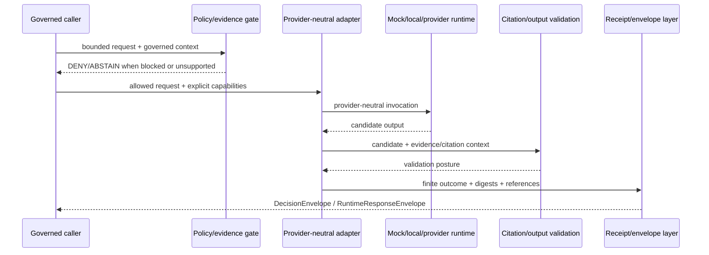

<!-- [KFM_META_BLOCK_V2]
doc_id: kfm://doc/runtime-adapters-readme
title: runtime/adapters/ — Runtime Adapter Compatibility and Migration Index
type: readme; directory-readme; compatibility-index; adapter-migration-boundary
version: v1.1
status: draft; compatibility-index; canonical-lane-confirmed; implementation-mixed; NEEDS VERIFICATION
policy_label: public
owners: OWNER_TBD — Runtime steward · Governed-AI steward · API steward · Policy steward · Evidence steward · Security steward · Test steward · Migration steward · Docs steward
created: NEEDS VERIFICATION — blank file was replaced by v1 on 2026-07-03
updated: 2026-07-15
current_path: runtime/adapters/README.md
canonical_adapter_lane: runtime/model_adapters/
truth_posture: CONFIRMED target README, runtime responsibility root, canonical provider-neutral adapter lane, descriptive AdapterContract note, adjacent mock/Ollama/envelope/AI lanes, runtime contracts, paired AIReceipt and RuntimeResponseEnvelope schemas, runtime fixture-family index, and common schema fixture harness at the pinned evidence snapshot / CONFLICTED duplicate naming because runtime/adapters and runtime/model_adapters coexist while Directory Rules name only runtime/model_adapters as canonical / UNKNOWN child inventory below runtime/adapters, executable adapter implementations, provider integrations, approved model inventory, policy enforcement, citation validation, receipt persistence, network/tool permissions, public-client wiring, CI results, deployment, and release state / NEEDS VERIFICATION migration decision, inbound-link inventory, CODEOWNERS enforcement, canonical adapter semantic contract, validator wiring, adapter-card registry, provider admission, correction propagation, and runtime-specific tests
evidence_snapshot:
  repository: bartytime4life/Kansas-Frontier-Matrix
  visibility: public
  base_ref: main
  base_commit: df4a37b0a6779827baa02e6cc99d9315154bb831
  prior_blob: b7cf6e61a9520579c854cfd6b1b3b892b08d5641
  prepared_under_prompt: KFM GitHub Repository Documentation Implementation Agent v3.1.0
related:
  - ../README.md
  - ../model_adapters/README.md
  - ../model_adapters/AdapterContract.md
  - ../model_adapters/mock/README.md
  - ../mock/README.md
  - ../ollama/README.md
  - ../envelopes/README.md
  - ../AI/README.md
  - ../../contracts/runtime/README.md
  - ../../contracts/runtime/decision_envelope.md
  - ../../contracts/runtime/ai_receipt.md
  - ../../contracts/runtime/runtime_response_envelope.md
  - ../../schemas/contracts/v1/runtime/ai_receipt.schema.json
  - ../../schemas/contracts/v1/runtime/runtime_response_envelope.schema.json
  - ../../fixtures/contracts/v1/runtime/README.md
  - ../../tests/schemas/test_common_contracts.py
  - ../../policy/runtime/README.md
  - ../../docs/doctrine/directory-rules.md
  - ../../docs/registers/DRIFT_REGISTER.md
tags: [kfm, runtime, adapters, compatibility-index, model-adapters, provider-neutral, migration, finite-outcomes, ai-receipt, runtime-response-envelope, cite-or-abstain, no-direct-public-adapter]
notes:
  - "v1.1 applies the v3.1 repository-documentation implementation prompt and preserves the prior README's useful adapter boundaries."
  - "runtime/model_adapters is the confirmed provider-neutral adapter lane; runtime/adapters is retained only as a compatibility, discovery, and migration surface."
  - "This README does not activate an adapter, approve a provider or model, define a canonical contract, grant network or tool access, establish policy, close evidence, validate citations, prove receipt persistence, authorize public rendering, or publish KFM material."
[/KFM_META_BLOCK_V2] -->

<a id="top"></a>

# `runtime/adapters/` — Runtime Adapter Compatibility and Migration Index

> **One-line purpose.** Preserve discoverability for the legacy `runtime/adapters/` name while routing every adapter artifact to the canonical provider-neutral lane or another responsibility root without creating parallel adapter authority.

<p>
  
  
  
  
  
  
</p>

> [!IMPORTANT]
> `runtime/adapters/` is **not** the canonical adapter implementation or documentation lane. New provider-neutral adapter cards, port notes, interface notes, and adapter handoff records belong under [`runtime/model_adapters/`](../model_adapters/). This path is retained only for compatibility, inventory, migration, supersession, and link-preservation work until maintainers complete a governed disposition.

## Quick navigation

[Status](#status-and-evidence-boundary) · [Purpose](#purpose-and-bounded-scope) · [Placement](#repository-fit-and-placement) · [Routing](#responsibility-routing) · [Authority](#authority-and-anti-collapse-rules) · [Adapter boundary](#provider-neutral-adapter-boundary) · [Modes](#adapter-modes-and-admission-posture) · [Flow](#governed-adapter-flow) · [Outcomes](#finite-runtime-outcomes) · [Receipts](#receipts-envelopes-and-traceability) · [Security](#security-privacy-network-and-tool-boundary) · [Testing](#testing-validation-and-no-network-posture) · [Status mapping](#status-vocabulary-reconciliation) · [Migration](#migration-and-supersession-discipline) · [Pointer record](#minimal-compatibility-pointer-record) · [Done](#definition-of-done) · [Maintenance](#maintenance-correction-and-rollback) · [Open](#open-verification-backlog) · [Evidence](#evidence-basis)

---

## Status and evidence boundary

| Surface | Status at the pinned snapshot | Consequence |
|---|---|---|
| `runtime/adapters/README.md` | **CONFIRMED** | Target README exists; prior blob is recorded in the metadata block. |
| `runtime/` | **CONFIRMED canonical root** | Owns local runtime wiring and adapter/runtime handoff documentation. |
| `runtime/model_adapters/` | **CONFIRMED canonical adapter lane** | Directory Rules and the current lane README identify it as the provider-neutral model-adapter home. |
| `runtime/adapters/` | **CONFLICTED / compatibility only** | The path exists beside the canonical lane. It must not accumulate new adapter authority. |
| `runtime/model_adapters/AdapterContract.md` | **CONFIRMED descriptive runtime note** | Documents `FocusRequest` → `DecisionEnvelope` and cite-or-abstain, but explicitly is not canonical semantic contract authority. |
| `runtime/mock/`, `runtime/ollama/`, `runtime/envelopes/`, `runtime/AI/` | **CONFIRMED documentation surfaces** | Own mock, local-Ollama, envelope-helper, and compatibility-index concerns respectively. |
| Runtime contracts and paired schemas | **CONFIRMED present; status PROPOSED** | `AIReceipt` and `RuntimeResponseEnvelope` have semantic contracts and JSON Schemas. Presence does not prove runtime execution. |
| Runtime fixtures and common schema harness | **CONFIRMED present; NOT RUN for this edit** | Schema fixtures and test discovery exist. No test or CI success is claimed here. |
| `policy/runtime/README.md` | **CONFIRMED stub** | No accepted runtime-policy implementation is established by the stub. |
| Child inventory under `runtime/adapters/` | **UNKNOWN** | This update does not claim that no historical files or inbound references exist. Inventory is required before migration or deletion. |
| Executable adapters, provider/model approvals, network/tool permissions, citation validation, receipts, public-client enforcement, CI, deployment, release | **UNKNOWN** | Documentation and schema presence are not operational proof. |

**Document authority:** compatibility and migration guidance only. Canonical contracts, schemas, policy, evidence, validation artifacts, adapter code, receipts, runtime envelopes, tests, release records, correction records, and steward decisions outrank this README.

---

## Purpose and bounded scope

This README answers three narrow questions:

1. **What does the legacy `runtime/adapters/` path mean now?**
2. **Where should adapter-related work be placed?**
3. **How should existing records move or point to the accepted lane without losing history or creating duplicate authority?**

It covers:

- canonical-lane routing;
- provider-neutral adapter boundaries;
- mock, local, provider-backed, and compatibility postures;
- evidence, policy, citation, finite-outcome, receipt, and envelope obligations;
- safe network, tool, secret, and public-exposure boundaries;
- no-network testing and validation expectations;
- status-vocabulary reconciliation;
- reversible migration, supersession, and rollback.

It does **not** define:

- a canonical adapter semantic contract;
- JSON Schema;
- provider terms or model approvals;
- runtime policy;
- source or evidence authority;
- executable adapter behavior;
- public API or UI behavior;
- a release decision;
- permission to delete or rename this path.

---

## Repository fit and placement

Directory Rules assign local runtime wiring to `runtime/` and identify `runtime/model_adapters/` as the provider-neutral adapter lane.

```text
runtime/
├── README.md
├── adapters/             # this file; compatibility and migration index
├── model_adapters/       # canonical provider-neutral adapter lane
│   ├── README.md
│   ├── AdapterContract.md
│   └── mock/
├── mock/                 # deterministic mock runtime notes
├── ollama/               # local Ollama runtime notes
├── envelopes/            # finite-outcome envelope helpers
├── AI/                   # governed-AI compatibility/index lane
├── local/                # local runtime wiring
└── service_configs/      # non-secret service configuration notes
```

### Placement determination

| Question | Determination |
|---|---|
| Is `runtime/` the correct responsibility root? | **CONFIRMED.** |
| Is `runtime/model_adapters/` the canonical adapter lane? | **CONFIRMED by Directory Rules and current repository documentation.** |
| Is `runtime/adapters/` a second canonical lane? | **No.** Treat it as compatibility/index only. |
| Does this README authorize a move or deletion? | **No.** Inventory, link analysis, reversible migration, and review remain required. |
| Does this update create a new authority root? | **No.** |
| Does this README-only clarification require an ADR? | **No.** A later authority reassignment, rename, retirement, or parallel-home decision may require an ADR or migration note. |
| Is the drift register decisive for this alias? | **No.** The inspected register does not resolve this path. |

> [!WARNING]
> Do not create new adapter cards, provider integrations, canonical interfaces, policy rules, schemas, fixtures, tests, receipts, or executable code under `runtime/adapters/`. Use the responsibility routing table below.

---

## Responsibility routing

| Work item | Correct home | Role of `runtime/adapters/` |
|---|---|---|
| Provider-neutral adapter card or port note | [`runtime/model_adapters/`](../model_adapters/) | Point to canonical record. |
| Descriptive runtime adapter boundary | [`runtime/model_adapters/AdapterContract.md`](../model_adapters/AdapterContract.md) until canonical contract meaning is settled | Link and label its non-canonical status. |
| Deterministic adapter implementation note | [`runtime/model_adapters/mock/`](../model_adapters/mock/) or [`runtime/mock/`](../mock/) according to responsibility | Point to accepted mock lane. |
| Local Ollama adapter/runtime note | [`runtime/ollama/`](../ollama/) plus canonical adapter card | Link only; no weights or secrets. |
| Runtime response-envelope helper | [`runtime/envelopes/`](../envelopes/) | Link; do not redefine envelope meaning. |
| Governed-AI navigation | [`runtime/AI/`](../AI/) | Cross-link only. |
| Runtime object semantic meaning | [`contracts/runtime/`](../../contracts/runtime/) | Link canonical contract. |
| Machine-checkable shape | `schemas/contracts/v1/runtime/` | Link canonical schema. |
| Runtime allow/deny/restrict/abstain rules | [`policy/runtime/`](../../policy/runtime/) or accepted policy family | Link policy authority. |
| Valid and invalid runtime examples | [`fixtures/contracts/v1/runtime/`](../../fixtures/contracts/v1/runtime/) | Link fixture family. |
| Executable schema tests | [`tests/schemas/`](../../tests/schemas/) | Link test and report actual result. |
| Validator implementation | `tools/validators/` | Link only after path and wiring are verified. |
| Receipt instance | accepted `data/receipts/` family | Link by stable reference; do not copy payloads here. |
| EvidenceBundle or proof | accepted evidence/proof roots | Resolve through governed references. |
| Release, correction, withdrawal, rollback | `release/` | Never decide or store authority here. |
| Public API, UI, map, or Focus Mode behavior | governed application/API/UI/package roots | Public clients use governed interfaces only. |
| Alias inventory, pointer, migration, supersession note | `runtime/adapters/` while retained | Appropriate compatibility content. |

### What belongs here

- This compatibility and migration README.
- A bounded inventory of historical paths or inbound links.
- Pointer-only records that direct readers to canonical adapter cards.
- Migration, supersession, deprecation, and correction notes.
- A rollback note for changes to this compatibility surface.

### What does not belong here

- New adapter-card authority or adapter registries.
- Adapter implementations, provider SDK wrappers, model binaries, or model weights.
- Canonical contracts, schemas, policy rules, fixtures, tests, or validator code.
- Credentials, tokens, API keys, private URLs, private configuration, or signing material.
- Raw prompts, private chain-of-thought, hidden reasoning, or private model internals.
- RAW, WORK, QUARANTINE, PROCESSED, CATALOG, TRIPLET, or PUBLISHED payloads.
- Source descriptors, EvidenceBundles, receipts, proofs, catalogs, release manifests, or correction records.
- Direct public model or adapter endpoints.
- Generated output treated as evidence, policy, review, release, correction, rollback, or publication authority.

---

## Authority and anti-collapse rules

1. **One canonical adapter lane.** `runtime/model_adapters/` owns provider-neutral adapter documentation.
2. **Compatibility is not authority.** A path surviving for links or history does not gain semantic or executable ownership.
3. **Contracts own meaning.** Runtime notes may describe a boundary but do not replace accepted contracts.
4. **Schemas own shape.** Adapter notes do not invent machine-required fields.
5. **Policy owns admissibility.** An adapter cannot grant itself tool, network, model, source, evidence, or public-output permission.
6. **Evidence outranks generation.** Adapter output is interpretive or operational output, not factual support.
7. **Finite outcomes are required where runtime decisions reach clients.**
8. **Receipts record accountability; they do not create truth.**
9. **Tests and runtime evidence prove behavior.** README language does not.
10. **Release remains separate.** Adapter execution cannot promote, publish, correct, withdraw, or roll back KFM material.
11. **Public clients use governed interfaces.** They do not call provider adapters or local model endpoints directly.
12. **Compatibility changes remain reversible.** Preserve history, forward links, correction notes, and rollback targets.

---

## Provider-neutral adapter boundary

The current descriptive adapter note states a compact target boundary:

```text
FocusRequest
  -> provider-neutral adapter
  -> DecisionEnvelope
  -> cite-or-abstain
```

That boundary is **PROPOSED / NEEDS VERIFICATION** as a canonical object model. The runtime note explicitly does not own semantic contract authority.

A provider-neutral adapter should keep caller-facing obligations stable across mock, local, and provider-backed implementations.

| Boundary | Required posture |
|---|---|
| Input | Bounded request and governed context only; no normal public-path RAW/WORK/QUARANTINE dump. |
| Evidence | Receive resolvable evidence pointers or approved fixtures, not infer authority from retrieved prose. |
| Policy | Evaluate or consume an accepted policy decision before restricted capability use. |
| Provider/model | Identify adapter family and model/provider reference without treating either as authority. |
| Tools | Use only explicitly allowed tools and capabilities. |
| Network | Deny by default unless the runtime profile authorizes a bounded endpoint and purpose. |
| Generation | Produce candidate interpretation only. |
| Citation | Validate support for evidence-dependent answer-like output; otherwise abstain. |
| Output | Return a finite envelope or handoff object, not free text alone. |
| Audit | Emit or link appropriate receipt, run, validation, and envelope references. |
| Correction | Allow stale, corrected, withdrawn, or superseded support to flow into runtime posture. |
| Release | Never publish or approve client exposure. |

### Canonical contract gap

The repository contains a descriptive runtime adapter note, but this update does not confirm a final canonical semantic adapter contract or paired adapter schema.

Until that gap is resolved:

- do not advertise `FocusRequest` or `DecisionEnvelope` as final names without truth labels;
- do not create a second contract under this compatibility lane;
- route proposed semantic work through `contracts/` and schema work through `schemas/`;
- use fixtures and tests before claiming adapter conformance;
- record naming or shape conflicts in the appropriate drift/ADR process.

---

## Adapter modes and admission posture

| Mode | Intended use | Minimum gate | Public posture |
|---|---|---|---|
| `MOCK_ONLY` | Deterministic fixture-backed behavior and negative-path tests. | Contract/schema/fixture alignment and expected outcome coverage. | Never public truth. |
| `LOCAL_ONLY` | Local development runtime, including approved Ollama experiments. | Security, local exposure, model reference, adapter boundary, fixtures/tests, policy posture. | No direct public traffic. |
| `PROVIDER_NEUTRAL` | Stable interface independent of a specific provider. | Accepted interface semantics, schema or typed boundary where applicable, policy and receipt obligations. | Reached only through governed caller. |
| `PROVIDER_BOUND` | Provider-specific implementation behind the neutral boundary. | Provider terms, model/version identity, network/tool policy, secret handling, resilience, tests, receipts. | No direct public endpoint. |
| `HELD` | Incomplete or conflicted adapter candidate. | Missing evidence, policy, tests, security, placement, rights, or approval remains unresolved. | Deny activation. |
| `RETIRED` | Adapter no longer accepted. | Supersession, correction, migration, and rollback references. | No execution. |

Admission should fail closed when any load-bearing item is missing:

- canonical home;
- owner and reviewer;
- allowed use;
- adapter and model/provider identity;
- evidence input boundary;
- policy decision or policy family;
- citation-validation posture;
- network and tool permissions;
- secret/config handling;
- finite-outcome behavior;
- receipt and envelope linkage;
- fixtures and negative cases;
- implementation tests;
- correction and supersession handling;
- public exposure review.

---

## Governed adapter flow



Operational sequence:

```text
bounded request
  -> scope and access check
  -> evidence/support resolution
  -> policy, rights, sensitivity, release, freshness, and correction check
  -> adapter admission check
  -> mock/local/provider runtime execution only if allowed
  -> citation and output validation
  -> ANSWER / ABSTAIN / DENY / ERROR
  -> AIReceipt / RunReceipt and RuntimeResponseEnvelope as applicable
  -> governed caller decides rendering or next action
```

The adapter never decides canonical truth, evidence admissibility, source authority, rights, sensitivity, release, correction, rollback, or publication state.

---

## Finite runtime outcomes

| Outcome | Use when | Required behavior |
|---|---|---|
| `ANSWER` | Request is in scope, policy permits it, evidence support is sufficient, citation posture is valid, and output passes applicable validation. | Return bounded content with required evidence and receipt/envelope references. |
| `ABSTAIN` | Evidence, citation, source authority, freshness, correction state, scope, or confidence is insufficient. | Return safe reason codes; do not fill gaps with plausible text. |
| `DENY` | Policy, rights, sensitivity, access, release, network, tool, model, or governance posture forbids execution or disclosure. | Do not expose protected inputs, outputs, or reason detail. |
| `ERROR` | Adapter, provider, configuration, validation, dependency, timeout, envelope, or receipt generation fails. | Fail safely, preserve traceability where possible, and do not convert failure into an answer. |

Missing or unknown outcome is not success.

---

## Receipts, envelopes, and traceability

### Verified runtime trust objects

| Object | Verified repository surface | Confirmed shape or role | Boundary |
|---|---|---|---|
| `AIReceipt` | [`contracts/runtime/ai_receipt.md`](../../contracts/runtime/ai_receipt.md) + paired schema | Requires adapter/model refs, input/output digests, policy decision ref, citation validation ref, and finite outcome. | Accountability receipt; not evidence or publication authority. |
| `RuntimeResponseEnvelope` | [`contracts/runtime/runtime_response_envelope.md`](../../contracts/runtime/runtime_response_envelope.md) + paired schema | Requires finite outcome, reason code, evidence refs, policy state, freshness, and correction state. | Client-facing trust membrane; not payload storage or release approval. |
| `DecisionEnvelope` | [`contracts/runtime/decision_envelope.md`](../../contracts/runtime/decision_envelope.md) | Runtime decision semantics are present in the contract lane. | Distinct from release promotion decisions. |
| Adapter contract note | [`runtime/model_adapters/AdapterContract.md`](../model_adapters/AdapterContract.md) | Descriptive `FocusRequest` → `DecisionEnvelope` boundary. | Not canonical semantic contract authority. |

### `AIReceipt` minimum verified schema surface

The paired schema requires:

- `id`;
- `run_id`;
- `adapter`;
- `model_ref`;
- `inputs_digest`;
- `outputs_digest`;
- `policy_decision_ref`;
- `citation_validation_ref`;
- `outcome`.

The schema closes additional properties and restricts `outcome` to:

```text
ANSWER | ABSTAIN | DENY | ERROR
```

### `RuntimeResponseEnvelope` minimum verified schema surface

The paired schema requires:

- `id`;
- `spec_hash`;
- `version`;
- `issued_at`;
- `outcome`;
- `reason_code`;
- `evidence_refs`;
- `policy_state`;
- `freshness`;
- `correction_state`.

The schema closes additional properties and uses the same finite outcome enum.

> [!NOTE]
> Schema presence and contract prose do not prove adapter execution, policy correctness, citation correctness, receipt persistence, or client enforcement.

### Digest and log posture

- Prefer stable canonicalization before computing input or output digests.
- Never place secrets, raw private prompts, protected evidence, or chain-of-thought in receipt fields.
- Treat digests as integrity hooks, not proof of truth.
- Preserve safe run identifiers, adapter/model references, reason codes, validation references, and correction linkage.
- Keep operational logs separate from durable receipts and proofs.
- Avoid logging full prompts, full generated responses, exact sensitive locations, credentials, tokens, or protected source content.

---

## Security, privacy, network, and tool boundary

### Required controls

- No direct public traffic to mock, local, Ollama, provider, or compatibility adapter paths.
- No credentials, tokens, private `.env`, provider keys, cookies, signing material, or private endpoints in the repository.
- No model weights or large downloaded model files in the repository.
- No unbounded network access by default.
- No undeclared tools, plugins, code execution, shell access, file writes, or external side effects.
- No unrestricted reads from canonical/internal stores.
- No normal public-path reads from RAW, WORK, QUARANTINE, or unpublished candidates.
- No prompt or retrieved-content instruction may broaden scope, weaken policy, reveal secrets, or authorize unrelated mutation.
- No private chain-of-thought or hidden model internals stored as evidence.
- No generated answer exposed when policy, citation, evidence, freshness, correction, or release posture blocks it.
- No provider/model capability used as a substitute for access approval or source authority.

### Provider-bound review

A provider-bound adapter remains `HELD` until reviewers can inspect:

- provider and model identity;
- version or digest posture;
- approved use case;
- data retention and training-use posture;
- request/response minimization;
- network endpoint allowlist;
- timeout, retry, circuit-breaker, and rate-limit behavior;
- secret injection and redaction;
- tool/capability allowlist;
- prompt-injection defenses;
- output/citation validation;
- receipt and envelope behavior;
- incident, correction, disable, and rollback path.

Version-sensitive provider facts require current authoritative verification before activation.

---

## Testing, validation, and no-network posture

### Default test order

1. JSON Schema and fixture validation.
2. Deterministic mock-adapter outcome coverage.
3. Contract/schema/policy alignment.
4. Citation-validation positive and negative cases.
5. Receipt and envelope generation.
6. Security and prompt-injection negative cases.
7. Timeout, retry, malformed-response, unavailable-provider, and circuit-breaker cases.
8. Local runtime integration.
9. Provider-bound integration only after explicit admission.
10. Public-client boundary tests proving no direct adapter access.

### Grounded schema-fixture command

The repository contains a common schema fixture harness for runtime families:

```bash
python -m pytest -q tests/schemas/test_common_contracts.py
```

This documentation update does not claim that command was run.

### Required negative cases

At minimum, adapter testing should cover:

- missing or invalid required contract fields;
- unsupported outcome;
- unresolved EvidenceRef or EvidenceBundle support;
- missing policy decision;
- failed citation validation;
- stale, corrected, superseded, or withdrawn support;
- forbidden source or lifecycle input;
- restricted/sensitive request;
- unapproved model or provider;
- network or tool not allowed;
- timeout, malformed provider response, rate limit, or dependency failure;
- receipt or envelope generation failure;
- prompt-injection attempt;
- secret-like output;
- direct public adapter invocation;
- attempted publication or release side effect.

### Validation results for this README change

| Check | Result |
|---|---|
| Target path and prior blob resolved | PASS |
| Canonical lane relationship verified | PASS |
| One H1 | PASS |
| Heading hierarchy | PASS |
| Code fences | PASS |
| Internal quick-navigation anchors | PASS |
| Duplicate headings | PASS |
| Trailing whitespace | PASS |
| Secret-like pattern scan | PASS |
| Relative links | PASS / bounded to inspected repository surfaces |
| Mermaid | Static plausibility only; renderer not executed |
| Repository tests | NOT RUN |
| CI / required checks | UNKNOWN until reported by GitHub |

---

## Status vocabulary reconciliation

The previous compatibility README defined a local adapter-status vocabulary. The canonical [`runtime/model_adapters/README.md`](../model_adapters/) now owns the adapter-card guidance.

Do not maintain a competing enum here.

| Prior compatibility value | Canonical lane value | Disposition |
|---|---|---|
| `DRAFT` | `DRAFT` | Same meaning. |
| `READY_FOR_REVIEW` | `READY_FOR_REVIEW` | Same meaning. |
| `ACTIVE` | `ACTIVE_ADAPTER` | Use canonical value. |
| `MOCK_ONLY` | `MOCK_ONLY` | Same meaning. |
| `LOCAL_ONLY` | `LOCAL_ONLY` | Same meaning. |
| `PROVIDER_BOUND` | `PROVIDER_BOUND` | Canonical lane explicitly supports it. |
| `VALIDATION_REQUIRED` | `VALIDATION_REQUIRED` | Canonical value. |
| `HELD` | `HELD` | Same meaning. |
| `MIGRATE_TO_MODEL_ADAPTERS` | `MIGRATE` | Use canonical value and name target path. |
| `SUPERSEDED` | `SUPERSEDED` | Same meaning. |
| `RETIRED` | `RETIRED` | Same meaning. |

A compatibility pointer may add pointer-specific state outside an adapter payload:

```text
POINTER_ONLY
INVENTORY_PENDING
MIGRATION_PLANNED
LINKS_UPDATED
READY_FOR_RETIREMENT
```

These are documentation/migration states, not runtime adapter outcomes or canonical adapter-card statuses.

---

## Migration and supersession discipline

No move, rename, deletion, or bulk rewrite occurs in this README update.

A later migration should follow this order:

1. **Pin the base.** Record repository, branch, commit, and current blob hashes.
2. **Inventory the alias lane.** List every file, generated artifact, symlink, and case-variant path under `runtime/adapters/`.
3. **Find inbound references.** Inspect docs, code, configs, tests, schemas, contracts, policy, fixtures, workflows, issues, and open PRs.
4. **Classify each item.**
   - canonical adapter card;
   - pointer;
   - duplicate;
   - historical record;
   - implementation file;
   - misplaced contract/schema/policy/fixture/test/receipt;
   - unknown/held.
5. **Choose the owning root.** Apply Directory Rules and current ADRs.
6. **Create or update canonical records.** Use `runtime/model_adapters/` or another responsibility root.
7. **Preserve history.** Prefer history-preserving moves when a move is approved.
8. **Leave forward pointers.** Where links or external references justify them, retain a bounded compatibility note.
9. **Update inbound links.** Avoid split-brain references.
10. **Validate.** Run Markdown checks, schema/fixture tests, adapter tests, and any path/drift checks.
11. **Record supersession.** Name canonical target, effective commit, reviewer, and rollback.
12. **Retire only after proof.** Delete the compatibility path only when inbound references and governance obligations are closed.

### Migration stop conditions

Stop and mark the work `BLOCKED`, `PARTIAL`, or `NEEDS VERIFICATION` when:

- the canonical target is disputed;
- child files or inbound references cannot be inventoried;
- a move would create a parallel contract/schema/policy/source/receipt/release home;
- generated or mirrored content lacks a synchronization rule;
- path casing could break clients on case-sensitive systems;
- branch or PR metadata moved unexpectedly;
- required tests fail;
- the migration changes authority without ADR/review;
- rollback cannot be stated.

---

## Minimal compatibility pointer record

Use this only for alias discovery, migration, or supersession. Do not use it as an adapter card.

```markdown
# <legacy-adapter-pointer-id>

## Status
POINTER_ONLY / INVENTORY_PENDING / MIGRATION_PLANNED / LINKS_UPDATED / READY_FOR_RETIREMENT / SUPERSEDED

## Legacy path
runtime/adapters/<name>

## Canonical target
runtime/model_adapters/<name> / another verified responsibility path / NEEDS VERIFICATION

## Record type
pointer / migration note / supersession note / historical index

## Prior status mapping
<legacy value> -> <canonical value or N/A>

## Evidence snapshot
- Repository: bartytime4life/Kansas-Frontier-Matrix
- Base ref: <ref>
- Base commit: <sha>
- Prior blob: <sha or N/A>

## Inbound references
<verified paths, count, or NEEDS VERIFICATION>

## Migration state
<what moved, what remains, and why>

## Validation
<commands and actual results; do not claim unrun checks>

## Rollback
<prior blob/commit and reversal procedure>

## Reviewer
<steward or maintainer>

## Review date
<YYYY-MM-DD>
```

Canonical adapter cards belong in [`runtime/model_adapters/`](../model_adapters/) and should use that lane's current template and status vocabulary.

---

## Review checklist

### Compatibility boundary

- [ ] `runtime/adapters/` is described as compatibility/index only.
- [ ] `runtime/model_adapters/` is named as canonical provider-neutral adapter lane.
- [ ] No duplicate adapter-card template or enum is introduced.
- [ ] Legacy values are mapped to canonical values.
- [ ] Child inventory and inbound links are not guessed.
- [ ] Any migration note includes a reversible path.

### Adapter governance

- [ ] Adapter family, runtime mode, owner, allowed use, and canonical home are explicit in the canonical record.
- [ ] Evidence input posture is explicit.
- [ ] Policy, rights, sensitivity, release, freshness, and correction posture are explicit where material.
- [ ] Network and tool permissions are explicit and deny-by-default.
- [ ] Provider/model identity and version posture are explicit when provider-bound.
- [ ] Citation validation is linked for evidence-dependent generated text.
- [ ] Finite outcomes are covered.
- [ ] AIReceipt, RunReceipt, DecisionEnvelope, or RuntimeResponseEnvelope linkage is explicit where applicable.
- [ ] Fixtures, tests, validators, or runtime evidence support behavior claims.
- [ ] No generated output is treated as truth or release authority.
- [ ] No direct public adapter/model endpoint is normalized.

### Documentation quality

- [ ] KFM Meta Block v2 is current.
- [ ] Internal links resolve.
- [ ] Truth labels distinguish presence from implementation.
- [ ] No credentials, sensitive payloads, private prompts, or chain-of-thought are included.
- [ ] Validation claims report actual run status.
- [ ] Correction and rollback are visible.

---

## Definition of done

This compatibility README is complete for its current role when:

- `runtime/model_adapters/` is clearly identified as canonical;
- new adapter work is routed away from `runtime/adapters/`;
- authority boundaries are explicit;
- provider-neutral, evidence, policy, citation, receipt, envelope, security, and public-client rules are visible;
- prior useful status vocabulary is reconciled without a competing enum;
- migration is bounded, reversible, and non-destructive;
- unknown child inventory and implementation maturity remain labeled honestly;
- Markdown structure and links pass static review;
- the remote branch contains only the intended file change;
- a draft pull request records validation, base drift, workflow posture, and rollback.

This README does not complete adapter implementation, migration, provider admission, policy enforcement, testing, deployment, or release.

---

## Maintenance, correction, and rollback

Update this README when:

- Directory Rules change the runtime lane map;
- `runtime/model_adapters/` changes its contract, template, or status vocabulary;
- a canonical adapter contract/schema is accepted;
- alias-lane inventory is completed;
- a migration or retirement decision is approved;
- inbound links or compatibility requirements change;
- adapter security, network, tool, receipt, envelope, or correction obligations change;
- this README overstates implementation.

### Correction rules

- Correct path or authority errors through a reviewable commit.
- Preserve prior claims in Git history.
- Mark superseded guidance rather than silently reinterpreting it.
- Do not hide failed tests, unresolved links, or migration blockers.
- Update cross-links in `runtime/README.md`, `runtime/model_adapters/README.md`, and `runtime/AI/README.md` when role language changes materially.

### Rollback

Before merge, rollback means leaving the draft pull request unmerged or restoring prior blob:

```text
b7cf6e61a9520579c854cfd6b1b3b892b08d5641
```

After merge, use a transparent revert commit or revert pull request. Do not reset or rewrite shared history.

A rollback of this README does not authorize adapter rollback, provider deactivation, policy rollback, receipt deletion, evidence mutation, or release rollback; those actions belong to their owning systems.

---

## Open verification backlog

- [ ] Inventory every child under `runtime/adapters/`.
- [ ] Inventory case-variant and generated/mirrored adapter paths.
- [ ] Find all inbound references to `runtime/adapters/`.
- [ ] Confirm whether maintainers intend pointer retention, migration, or retirement.
- [ ] Confirm CODEOWNERS for `runtime/adapters/` and `runtime/model_adapters/`.
- [ ] Confirm canonical adapter-card ID and filename rules.
- [ ] Confirm whether a canonical adapter semantic contract exists or must be proposed under `contracts/`.
- [ ] Confirm paired adapter schema and typed interface strategy.
- [ ] Confirm relationship among `FocusRequest`, `DecisionEnvelope`, and `RuntimeResponseEnvelope`.
- [ ] Confirm model/provider admission register and approved runtime modes.
- [ ] Confirm policy package and policy-decision references.
- [ ] Confirm citation-validation implementation and report contract.
- [ ] Confirm AIReceipt and RunReceipt persistence paths.
- [ ] Confirm validator files named by schemas exist and are wired.
- [ ] Confirm fixture coverage for adapter-specific cases.
- [ ] Run the common schema fixture harness.
- [ ] Confirm adapter-specific tests and CI required checks.
- [ ] Confirm network/tool permission enforcement.
- [ ] Confirm direct-public-adapter denial tests.
- [ ] Confirm stale, corrected, superseded, and withdrawn evidence propagation.
- [ ] Confirm incident, disable, deactivation, and rollback procedures.
- [ ] Decide whether the alias belongs in `docs/registers/DRIFT_REGISTER.md`.
- [ ] Update this README after the canonical disposition is approved.

---

## Evidence basis

| Evidence | Status | Supports | Does not prove |
|---|---|---|---|
| Previous `runtime/adapters/README.md` | **CONFIRMED** | Existing compatibility intent, prior status vocabulary, adapter-card guidance, migration concern, and exclusions. | Child inventory, canonical implementation, tests, or migration completion. |
| [`runtime/README.md`](../README.md) | **CONFIRMED** | `runtime/` responsibility root and current lane index. | Executable services or deployment. |
| [`runtime/model_adapters/README.md`](../model_adapters/) | **CONFIRMED** | Canonical provider-neutral adapter lane, canonical status guidance, evidence/policy/citation/receipt/test obligations. | Adapter implementation or acceptance of individual cards. |
| [`runtime/model_adapters/AdapterContract.md`](../model_adapters/AdapterContract.md) | **CONFIRMED descriptive note** | `FocusRequest` → `DecisionEnvelope`, cite-or-abstain, provider-neutral obligation. | Canonical semantic contract or paired schema. |
| [`runtime/mock/README.md`](../mock/) | **CONFIRMED** | Deterministic mock-first posture and finite-outcome testing. | Mock implementation or test success. |
| [`runtime/ollama/README.md`](../ollama/) | **CONFIRMED** | Local-only model runtime boundary and no-direct-public-model posture. | Ollama installation, approved models, or adapter execution. |
| [`runtime/envelopes/README.md`](../envelopes/) | **CONFIRMED** | Runtime envelope helper role and finite-outcome handoff. | Envelope implementation or client enforcement. |
| [`runtime/AI/README.md`](../AI/) | **CONFIRMED** | Governed-AI compatibility routing, evidence/policy/citation/security/public-boundary posture. | Live AI service or policy enforcement. |
| [`contracts/runtime/README.md`](../../contracts/runtime/) | **CONFIRMED** | Contracts own meaning; schemas own shape; policy owns admissibility; implementation owns execution. | Runtime behavior. |
| [`contracts/runtime/ai_receipt.md`](../../contracts/runtime/ai_receipt.md) | **CONFIRMED schema-paired contract** | AIReceipt meaning and required schema surface. | Receipt persistence or operational emission. |
| [`contracts/runtime/runtime_response_envelope.md`](../../contracts/runtime/runtime_response_envelope.md) | **CONFIRMED schema-paired contract** | Client-facing finite outcome, evidence refs, policy, freshness, and correction posture. | Public-client enforcement. |
| [`fixtures/contracts/v1/runtime/README.md`](../../fixtures/contracts/v1/runtime/) | **CONFIRMED** | Runtime fixture families and schema-harness pattern. | Test execution or complete fixture coverage. |
| [`tests/schemas/test_common_contracts.py`](../../tests/schemas/test_common_contracts.py) | **CONFIRMED / NOT RUN** | Schema/fixture discovery and positive/negative expectations. | Passing repository state. |
| [`policy/runtime/README.md`](../../policy/runtime/) | **CONFIRMED stub** | Runtime policy path exists. | Accepted runtime policy behavior. |
| [`Directory Rules`](../../docs/doctrine/directory-rules.md) | **CONFIRMED doctrine** | Runtime placement and `model_adapters/` canonical-lane basis. | Adapter implementation. |
| [`DRIFT_REGISTER.md`](../../docs/registers/DRIFT_REGISTER.md) | **CONFIRMED inspected** | Current drift-register content was checked. | A resolved decision for this alias. |
| Attached v3.1 implementation prompt | **CONFIRMED task input** | API-only implementation discipline, acceptance matrix, concurrency, placement, PR, correction, and no-truncation requirements. | Repository behavior by itself. |

---

## Last reviewed

| Field | Value |
|---|---|
| Last reviewed | 2026-07-15 |
| Review status | Draft compatibility/index rewrite prepared from pinned repository evidence |
| Current disposition | Retain as compatibility and migration index; route canonical adapter work to `runtime/model_adapters/` |
| Next review trigger | Alias inventory, inbound-link scan, migration/retirement decision, canonical adapter contract/schema, first accepted adapter card, provider admission, policy/citation/receipt wiring, adapter tests, or public-client integration review |

<p align="right"><a href="#top">Back to top</a></p>
