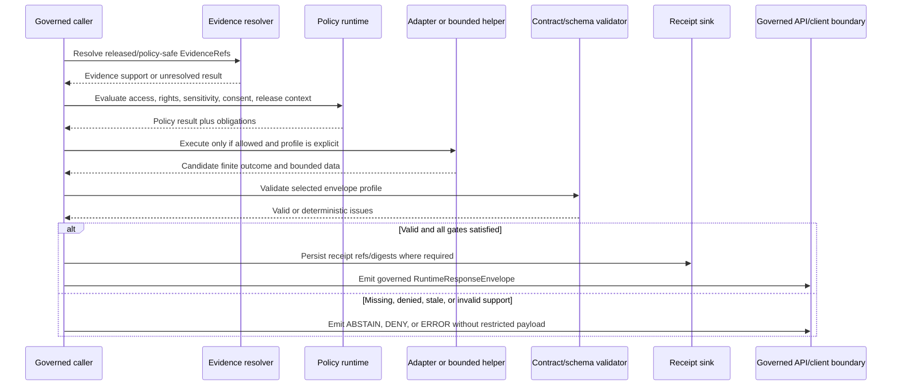

<!-- [KFM_META_BLOCK_V2]
doc_id: kfm://doc/runtime-envelopes-readme
title: runtime/envelopes/ — Canonical Runtime Envelope Helper and Handoff Lane
type: readme; directory-readme; canonical-runtime-lane; envelope-helper-boundary; contract-schema-drift-index
version: v1.1
status: draft; canonical-lane-confirmed; implementation-mixed; contract-schema-drift-visible; NEEDS VERIFICATION
policy_label: public
owners: OWNER_TBD — Runtime steward · Governed API steward · Envelope package steward · Contract steward · Schema steward · Policy steward · Evidence steward · Citation steward · Correction steward · Release steward · Security steward · Test steward · Migration steward · Docs steward
created: NEEDS VERIFICATION — greenfield stub was replaced by v1 on 2026-07-03
updated: 2026-07-15
current_path: runtime/envelopes/README.md
implementation_package: packages/envelopes/
truth_posture: CONFIRMED target README, runtime responsibility root, canonical runtime/envelopes helper lane, current runtime root index, RuntimeResponseEnvelope and DecisionEnvelope contracts and paired closed schemas, AIReceipt contract/schema family, dedicated envelope validator entry points, minimal valid and invalid fixture families, common schema fixture harness, schema-validation workflow, governed API README, kfm-envelopes 0.0.0 package metadata, empty package initializer, and package/module README evidence at the pinned snapshot / CONFLICTED governed-api envelope architecture prose versus current paired RuntimeResponseEnvelope and DecisionEnvelope schema fields and vocabularies, plus unresolved implementation ownership between runtime handoff notes and the shared package / UNKNOWN executable runtime envelope helpers, supported package exports, package consumers, governed API serialization, runtime adapter wiring, policy execution, EvidenceRef resolution, citation validation, receipt persistence, controlled reason/state vocabularies, public-client enforcement, deployment, and production behavior / NEEDS VERIFICATION accepted envelope profiles, contract/schema acceptance, compatibility and migration policy, validator execution results, package-specific tests, runtime/API integration tests, correction invalidation, release binding, CODEOWNERS enforcement, and rollback integration
evidence_snapshot:
  repository: bartytime4life/Kansas-Frontier-Matrix
  visibility: public
  base_ref: main
  base_commit: faefb1f451cd0e5185b975ba8e78e69970680cb9
  prior_blob: 74350a241ce2a50cac1a4825b961c0356ded4216
  prepared_under_prompt: KFM GitHub Repository Documentation Implementation Agent v3.1.0
related:
  - ../README.md
  - ../AI/README.md
  - ../model_adapters/README.md
  - ../mock/README.md
  - ../ollama/README.md
  - ../local/README.md
  - ../service_configs/README.md
  - ../../packages/envelopes/README.md
  - ../../packages/envelopes/src/envelopes/README.md
  - ../../apps/governed-api/README.md
  - ../../contracts/runtime/decision_envelope.md
  - ../../contracts/runtime/runtime_response_envelope.md
  - ../../contracts/runtime/ai_receipt.md
  - ../../schemas/contracts/v1/runtime/README.md
  - ../../schemas/contracts/v1/runtime/decision_envelope.schema.json
  - ../../schemas/contracts/v1/runtime/runtime_response_envelope.schema.json
  - ../../schemas/contracts/v1/runtime/ai_receipt.schema.json
  - ../../fixtures/contracts/v1/runtime/README.md
  - ../../fixtures/contracts/v1/runtime/decision_envelope/README.md
  - ../../fixtures/contracts/v1/runtime/runtime_response_envelope/README.md
  - ../../tools/validators/validate_decision_envelope.py
  - ../../tools/validators/validate_runtime_response_envelope.py
  - ../../tests/schemas/test_common_contracts.py
  - ../../docs/architecture/governed-api/ENVELOPES.md
  - ../../docs/adr/ADR-0019-ai-adapter-contract-and-finite-envelopes.md
  - ../../docs/doctrine/directory-rules.md
  - ../../policy/runtime/README.md
  - ../../data/receipts/README.md
  - ../../release/README.md
tags: [kfm, runtime, envelopes, canonical-lane, runtime-response-envelope, decision-envelope, ai-receipt, finite-outcomes, governed-api, evidence-ref, policy-state, freshness, correction-state, cite-or-abstain, contract-schema-drift, no-parallel-authority]
notes:
  - "v1.1 applies the v3.1 repository-documentation implementation prompt and preserves the prior README's useful finite-outcome and handoff guidance."
  - "runtime/envelopes is a confirmed canonical runtime helper and handoff lane; reusable envelope implementation belongs under packages/envelopes rather than accumulating duplicate code here."
  - "The package is currently a 0.0.0 scaffold with an empty initializer; no supported helper API or production consumer is established."
  - "Current governed-api architecture prose and paired schemas disagree on envelope fields and DecisionEnvelope vocabulary. No silent compatibility mapping is authorized."
  - "This README does not execute policy, resolve evidence, validate citations, create receipts, approve release, expose a route, or make an envelope public truth."
[/KFM_META_BLOCK_V2] -->

<a id="top"></a>

# `runtime/envelopes/` — Canonical Runtime Envelope Helper and Handoff Lane

> **One-line purpose.** Define the canonical runtime lane for finite-outcome envelope wiring, runtime handoff notes, profile selection, and implementation coordination while keeping semantic meaning, machine shape, reusable code, policy, evidence, receipts, public serving, and release authority in their owning roots.

<p>
  
  
  
  
  
  
</p>

> [!IMPORTANT]
> `runtime/envelopes/` is the canonical **runtime wiring and handoff lane** for finite-outcome envelope behavior. It is not the semantic-contract home, JSON Schema authority, reusable package implementation root, policy engine, EvidenceBundle resolver, receipt store, public API, release authority, or publication path. Reusable helper code belongs under `packages/envelopes/`; public serialization belongs behind the governed API.

> [!WARNING]
> The current repository contains a real contract/schema disagreement. The governed-API architecture document describes fields and nesting that the paired `RuntimeResponseEnvelope` and `DecisionEnvelope` schemas do not currently permit, and it uses a different DecisionEnvelope decision vocabulary. Until an accepted profile or ADR resolves the mismatch, do **not** merge the shapes, guess aliases, or emit a hybrid envelope.

## Quick navigation

[Status](#status-and-evidence-boundary) · [Purpose](#purpose-and-bounded-scope) · [Placement](#repository-fit-and-placement) · [Routing](#responsibility-routing) · [Authority](#authority-and-anti-collapse-rules) · [Families](#envelope-object-family-boundary) · [Profiles](#contract-schema-and-architecture-profile-conflict) · [Outcomes](#finite-runtime-outcomes) · [Composition](#composition-and-invariant-rules) · [Flow](#governed-envelope-flow) · [Evidence](#evidence-policy-citation-freshness-and-release-posture) · [Receipts](#receipts-traceability-and-persistence-boundary) · [Package](#runtime-lane-versus-shared-package) · [Security](#security-privacy-and-data-minimization) · [Testing](#testing-validation-and-current-proof-boundary) · [Helper note](#minimal-envelope-helper-note) · [Done](#definition-of-done) · [Migration](#compatibility-migration-and-supersession) · [Maintenance](#maintenance-correction-and-rollback) · [Open](#open-verification-backlog) · [Evidence basis](#evidence-basis)

---

## Status and evidence boundary

| Surface | Status at the pinned snapshot | Safe conclusion |
|---|---|---|
| `runtime/envelopes/README.md` | **CONFIRMED** | Target README exists; prior blob is recorded in metadata. |
| `runtime/` | **CONFIRMED canonical root** | Owns local runtime wiring, adapters, service harnesses, and finite-outcome handoffs subordinate to evidence, policy, and release. |
| `runtime/envelopes/` | **CONFIRMED canonical lane** | Directory Rules explicitly name it as the finite-outcome envelope-helper lane. |
| `contracts/runtime/decision_envelope.md` | **CONFIRMED contract; status PROPOSED** | Defines semantic meaning for `DecisionEnvelope`; presence does not prove executable behavior. |
| `schemas/contracts/v1/runtime/decision_envelope.schema.json` | **CONFIRMED concrete closed schema; status PROPOSED** | Requires finite outcome, policy family, reasons, obligations, and evaluation time. |
| `contracts/runtime/runtime_response_envelope.md` | **CONFIRMED contract; status PROPOSED** | Defines the governed client-facing runtime envelope. |
| `schemas/contracts/v1/runtime/runtime_response_envelope.schema.json` | **CONFIRMED concrete closed schema; status PROPOSED** | Requires id, spec hash, version, issued time, outcome, reason code, evidence refs, policy state, freshness, and correction state. |
| `AIReceipt` contract/schema | **CONFIRMED concrete closed family; status PROPOSED** | Records AI-run accountability; it is distinct from an envelope and does not make generated output true. |
| Dedicated validator entry points | **CONFIRMED files** | Thin wrappers invoke the common JSON Schema runner for paired schema/fixture roots. |
| Runtime envelope fixtures | **CONFIRMED minimal coverage** | Each principal envelope family has one documented valid and one invalid case; coverage is narrow and schema-only. |
| Common schema fixture harness | **CONFIRMED test code** | Discovers runtime schemas with matching fixture directories and checks valid/invalid examples. |
| Schema-validation workflow | **CONFIRMED workflow definition** | Installs the repository and runs `make schemas`; this does not prove package or runtime integration. |
| `packages/envelopes/` | **CONFIRMED Python package scaffold** | Declares `kfm-envelopes` version `0.0.0`; reusable implementation belongs there if admitted. |
| `packages/envelopes/src/envelopes/__init__.py` | **CONFIRMED empty** | No supported exports or executable helper API are established. |
| `apps/governed-api/README.md` | **CONFIRMED trust-membrane documentation** | Describes governed envelope serving; exact route handlers and serializers remain unverified. |
| Governed-API envelope architecture | **CONFIRMED draft doc; CONFLICTED with schemas** | It names fields/nesting and DecisionEnvelope vocabulary that differ from current schemas. |
| `runtime/envelopes/` child inventory beyond this README | **UNKNOWN** | Do not infer helper code, profiles, configs, or additional notes without recursive inventory. |
| Executable helper code, package consumers, API serializers, policy/evidence integration, receipt persistence, deployment | **UNKNOWN** | Documentation, schemas, validators, and fixtures are not operational proof. |

**Document authority:** canonical runtime-lane guidance and index only. Directory Rules, accepted ADRs, canonical contracts, schemas, executable policy, EvidenceBundles, validators, tests, implementation code, emitted receipts, release records, correction records, and steward decisions outrank this README.

---

## Purpose and bounded scope

This lane answers six questions:

1. **Which runtime concerns belong in the envelope lane?**
2. **Which object profile is being used for a specific handoff?**
3. **Which finite outcome and obligations must be preserved?**
4. **Where do reusable implementation, contracts, schemas, policy, evidence, receipts, and public serialization live?**
5. **How is current contract/schema/architecture drift prevented from becoming accidental compatibility?**
6. **What proof is required before envelope behavior is described as active?**

This README covers:

- runtime envelope wiring and handoff notes;
- explicit profile and version selection;
- finite `ANSWER`, `ABSTAIN`, `DENY`, and `ERROR` posture;
- DecisionEnvelope, RuntimeResponseEnvelope, and AIReceipt relationships;
- evidence, policy, citation, freshness, correction, release, and receipt handoffs;
- reusable-package coordination;
- validation, test, no-network, correction, migration, and rollback expectations.

This README does **not** define:

- semantic contract meaning;
- JSON Schema fields;
- policy rules or policy results;
- reason-code, obligation, policy-state, freshness, or correction-state registries;
- EvidenceRef resolution or EvidenceBundle closure;
- citation-validation behavior;
- reusable package APIs;
- governed API routes or serializers;
- receipt persistence;
- release approval or publication state.

---

## Repository fit and placement

Directory Rules explicitly assign finite-outcome envelope helpers to `runtime/envelopes/`.

```text
runtime/
├── README.md
├── envelopes/                   # this lane; runtime wiring and handoff coordination
├── model_adapters/              # provider-neutral adapter handoffs
├── mock/                        # deterministic runtime behavior
├── ollama/                      # provider-specific local runtime
├── local/                       # local service wiring
└── service_configs/             # non-secret runtime configuration notes

packages/
└── envelopes/                   # reusable Python helper implementation; currently scaffolded

contracts/runtime/               # semantic meaning
schemas/contracts/v1/runtime/    # machine-checkable shape
policy/runtime/                  # runtime admissibility and obligations
fixtures/contracts/v1/runtime/   # deterministic schema examples
tests/                           # executable proof
tools/validators/                # validation implementation
apps/governed-api/               # public/semi-public trust membrane
data/receipts/                   # emitted receipts
release/                         # release, correction, withdrawal, rollback authority
```

### Placement determination

| Question | Determination |
|---|---|
| Is `runtime/` the correct responsibility root? | **CONFIRMED.** |
| Is `runtime/envelopes/` a canonical runtime sublane? | **CONFIRMED by Directory Rules.** |
| Should reusable envelope code accumulate here? | **No.** Shared code belongs under `packages/envelopes/` after implementation admission. |
| Do contracts or schemas belong here? | **No.** Link them; do not duplicate them. |
| Does a schema-valid envelope prove runtime execution? | **No.** |
| Does this lane own public serialization? | **No.** The governed application boundary does. |
| Does this update create a new root or require a placement ADR? | **No.** |
| Is an ADR/profile decision needed for the current shape conflict? | **NEEDS VERIFICATION; likely yes before a stable API is declared.** |

---

## Responsibility routing

| Work item | Correct home | Role of this lane |
|---|---|---|
| Runtime envelope handoff note | `runtime/envelopes/` | Canonical home. |
| Runtime-specific assembly/wiring note | `runtime/envelopes/` | Document profile, caller, validator, obligations, and failure posture. |
| Reusable pure helper implementation | [`packages/envelopes/`](../../packages/envelopes/) | Link and coordinate; do not duplicate code here. |
| Provider-neutral adapter handoff | [`runtime/model_adapters/`](../model_adapters/) | Consume/emit selected envelope profile; do not redefine it. |
| Deterministic runtime scenario | [`runtime/mock/`](../mock/) and fixtures/tests | Exercise outcomes without network/provider dependencies. |
| Semantic object meaning | [`contracts/runtime/`](../../contracts/runtime/) | Contract authority. |
| Machine-checkable object shape | [`schemas/contracts/v1/runtime/`](../../schemas/contracts/v1/runtime/) | Schema authority. |
| Runtime policy | [`policy/runtime/`](../../policy/runtime/) and accepted policy families | Policy authority. |
| Evidence resolution | governed evidence resolver and proof roots | Consume result; do not resolve truth here. |
| Citation validation | accepted citation validator/proof lane | Consume result; do not claim citation closure here. |
| Valid/invalid schema examples | [`fixtures/contracts/v1/runtime/`](../../fixtures/contracts/v1/runtime/) | Fixture authority. |
| Schema fixture test harness | [`tests/schemas/test_common_contracts.py`](../../tests/schemas/test_common_contracts.py) | Executable schema proof. |
| Dedicated validation wrapper | [`tools/validators/`](../../tools/validators/) | Validator authority. |
| Governed public serialization | [`apps/governed-api/`](../../apps/governed-api/) | Trust membrane. |
| Emitted AI/run/validation receipts | [`data/receipts/`](../../data/receipts/) or accepted receipt home | Durable process memory. |
| Release/correction/rollback state | [`release/`](../../release/) | Release authority. |

---

## Authority and anti-collapse rules

1. **An envelope is not evidence.** `EvidenceRef` must resolve through governed evidence systems; the envelope does not become an EvidenceBundle.
2. **An envelope is not policy.** It may carry policy-family, policy-state, reasons, and obligations, but it does not execute or author policy.
3. **An envelope is not a receipt.** A receipt records an event; an envelope communicates a bounded runtime posture. Link them explicitly.
4. **An envelope is not release approval.** `ANSWER` does not replace a ReleaseManifest, PromotionDecision, review, rights, sensitivity, or release gate.
5. **A helper is not a trust membrane.** Package/runtime helpers assemble candidates; the governed application validates and serves them.
6. **Schema validity is not semantic or operational validity.** Contract, policy, evidence, correction, release, and implementation proof remain separate.
7. **No silent profile merge.** Incompatible field sets and vocabularies require an explicit accepted adapter/profile, migration note, or ADR.
8. **Negative outcomes are first-class.** `ABSTAIN`, `DENY`, and `ERROR` must not be hidden as nulls, empty payloads, exceptions, or free-text success.
9. **References are not the referenced objects.** Resolve refs before relying on them for trust-bearing behavior.
10. **Generated language remains interpretive.** It cannot set outcome, policy, evidence, correction, or release state without governed inputs and validation.

---

## Envelope object family boundary

### `DecisionEnvelope`

Current paired schema requires:

- `decision_id`;
- `outcome`;
- `policy_family`;
- `reasons`;
- `obligations`;
- `evaluated_at`.

Optional schema fields include `id`, compatibility `decision`, `reason_code`, `evidence_refs`, `spec_hash`, `version`, and `issued_at`.

The current schema closes:

```text
outcome = ANSWER | ABSTAIN | DENY | ERROR
policy_family = promotion | access | render | capability | consent | sensitivity
additionalProperties = false
```

Safe role:

- record one finite runtime decision posture;
- preserve reasons and obligations;
- identify the policy family and evaluation time;
- optionally carry evidence refs and lineage fields.

It is not:

- `PolicyDecision`;
- `PromotionDecision`;
- `RuntimeResponseEnvelope`;
- policy execution;
- public answer permission;
- release approval.

### `RuntimeResponseEnvelope`

Current paired schema requires:

- `id`;
- `spec_hash`;
- `version`;
- `issued_at`;
- `outcome`;
- `reason_code`;
- `evidence_refs`;
- `policy_state`;
- `freshness`;
- `correction_state`.

The current schema closes:

```text
outcome = ANSWER | ABSTAIN | DENY | ERROR
spec_hash = sha256:<64 lowercase hex characters>
additionalProperties = false
```

Safe role:

- communicate one governed client-facing runtime posture;
- carry EvidenceRef objects;
- carry policy, freshness, and correction summaries;
- bind response identity, version, issue time, and spec lineage.

It is not:

- a payload store;
- an evidence store;
- a policy result by itself;
- a release manifest;
- a public truth object.

### `AIReceipt`

`AIReceipt` is an accountability record for an AI-mediated event. Its paired schema requires adapter/model identity, input/output digests, policy-decision and citation-validation refs, and a finite outcome.

Relationship:

```text
DecisionEnvelope          = finite decision posture
RuntimeResponseEnvelope   = governed client response posture
AIReceipt                 = accountable AI event record
```

These objects may reference or correspond to one another, but none substitutes for the others.

### `RunReceipt` and other receipts

Runtime or pipeline receipts record execution. They may be linked from an envelope or audit context, but they remain process memory, not response permission or evidence truth.

---

## Contract, schema, and architecture profile conflict

### Conflict 1 — `RuntimeResponseEnvelope`

The governed-API architecture document describes fields such as:

- `object_type`;
- `schema_version`;
- `policy_decision`;
- `release_ref`;
- `citation_validation`;
- `payload`;
- structured `reason`;
- structured `trace`.

The paired current schema instead permits only:

- `id`;
- `spec_hash`;
- `version`;
- `issued_at`;
- `outcome`;
- `reason_code`;
- `evidence_refs`;
- `policy_state`;
- `freshness`;
- `correction_state`.

Because `additionalProperties` is `false`, the architecture-only fields are not compatible with the current schema.

### Conflict 2 — `DecisionEnvelope`

The governed-API architecture document describes a decision vocabulary:

```text
allow | deny | restrict | hold | abstain
```

and fields such as `policy_ref`, `policy_bundle_hash`, `audience_class`, `sensitivity_posture`, and `release_state_at_decision`.

The paired schema instead requires:

```text
ANSWER | ABSTAIN | DENY | ERROR
```

plus `policy_family`, `reasons`, `obligations`, and `evaluated_at`.

### Required posture

Until an accepted decision resolves these differences:

- select one explicit profile for each runtime/API boundary;
- name the contract and schema version/hash used;
- validate against that selected schema;
- do not emit architecture-only fields into a closed schema;
- do not map `allow/restrict/hold` to runtime outcomes without a reviewed normalization contract;
- do not use the optional schema `decision` alias as permission to import the architecture vocabulary;
- treat compatibility adapters as **PROPOSED** until they have fixtures, tests, migration notes, and reviewers;
- fail closed when the caller does not name a supported profile.

### Suggested profile record

```yaml
profile_id: runtime-response-envelope.schema-v1-current
contract_ref: contracts/runtime/runtime_response_envelope.md
schema_ref: schemas/contracts/v1/runtime/runtime_response_envelope.schema.json
schema_digest: NEEDS_VERIFICATION
status: PROPOSED
architecture_compatibility: CONFLICTED
normalizer: none
```

This is documentation guidance, not a new canonical registry.

---

## Finite runtime outcomes

| Outcome | Use when | Must not become |
|---|---|---|
| `ANSWER` | Governed evidence, policy, rights, sensitivity, freshness, correction, release, and citation posture support the response. | Implicit disclosure permission or release approval. |
| `ABSTAIN` | Support is missing, stale, conflicted, unresolved, insufficient, or outside bounded scope. | A guessed answer, empty success, or hidden exception. |
| `DENY` | Policy, rights, sensitivity, consent, audience, access, export, or release state blocks the response. | An `ERROR` used to hide a governance decision. |
| `ERROR` | Shape, adapter, validator, dependency, timeout, serialization, or internal process failure prevents safe completion. | Partial payload leakage or an inferred answer. |

Rules:

- exactly one outcome is emitted;
- unknown or missing outcome fails closed;
- negative outcomes carry safe reason information;
- `ANSWER` does not erase obligations;
- `ABSTAIN`, `DENY`, and `ERROR` must be testable and observable without exposing restricted details.

---

## Composition and invariant rules

### Core invariants

- Envelope profile and version are explicit.
- Required schema fields are present.
- Additional fields are rejected unless the selected profile permits them.
- Reason codes and state strings are safe to expose for the target audience.
- Evidence refs are typed and resolvable where trust-bearing use requires them.
- `ANSWER` is unavailable when mandatory evidence/citation/policy/release support is unresolved.
- `DENY` does not include the denied payload.
- `ERROR` does not leak stack traces, filesystem paths, credentials, prompts, raw provider payloads, or protected facts.
- Times preserve their actual semantics; issuance time does not overwrite evaluation, observation, source, release, or correction time.
- Corrections, withdrawals, supersession, and rollback affect cached or previously emitted envelopes through explicit invalidation or reevaluation.
- Receipts preserve digests and refs without storing private chain-of-thought.

### Cross-object consistency

Where objects are linked:

- envelope outcome and receipt outcome should agree;
- DecisionEnvelope and RuntimeResponseEnvelope outcomes should not conflict without an explicit aggregation rule;
- `spec_hash` must identify the selected profile/spec lineage;
- evidence refs should refer to the same governed support set or document any transformation;
- policy state and obligations should match the governing PolicyDecision or normalized policy result;
- correction state should match release/correction/withdrawal records;
- stale or withdrawn support must not remain cached as `ANSWER`.

### No implicit payload rule

The current RuntimeResponseEnvelope schema has no `payload` field. Therefore:

- do not embed substantive payloads and claim current-schema conformance;
- use a separately governed payload carrier or await an accepted schema/profile change;
- do not smuggle payload content into `reason_code`, state strings, ids, or evidence refs;
- public API composition requires an explicit accepted contract, not an undocumented serializer convention.

---

## Governed envelope flow



The envelope lane coordinates this handoff. It does not own the evidence resolver, policy engine, adapter, validator implementation, receipt store, or public API.

---

## Evidence, policy, citation, freshness, and release posture

### Evidence

- EvidenceBundle outranks envelope prose.
- An `EvidenceRef` is a pointer, not closure.
- Missing or unresolvable required support yields `ABSTAIN`, `DENY`, or `ERROR`.
- Envelopes must not carry raw evidence payloads as a shortcut.
- Evidence transformations and public-safe projections must remain traceable.

### Policy and obligations

- Policy is evaluated outside this lane.
- Envelopes preserve policy-family/state and obligations supplied by governed policy results.
- Callers must enforce every obligation or fail closed.
- Unknown policy state must not default to `ANSWER`.
- Controlled vocabularies for policy state and obligations remain **NEEDS VERIFICATION**.

### Citation

- Claim-bearing generated or synthesized answers follow cite-or-abstain.
- Citation-validation refs belong in receipts or accepted response profiles when required.
- The current RuntimeResponseEnvelope schema does not include a citation-validation field; do not invent one without a profile/schema decision.
- Citation failure yields `ABSTAIN` or a safe failure outcome, not unsupported prose.

### Freshness

- `freshness` is required by the current RuntimeResponseEnvelope schema but unconstrained as a string.
- Do not claim a stable vocabulary until contract/schema/policy registers accept one.
- Stale, pending-refresh, or unknown support must be interpreted by explicit caller policy.
- Never rewrite timestamps or freshness labels to preserve an old `ANSWER`.

### Correction, withdrawal, and release

- `correction_state` is required by the current schema but unconstrained as a string.
- Envelope correction posture must derive from governed correction/release records.
- Withdrawn or superseded evidence/release state must invalidate or reevaluate dependent cached envelopes.
- An envelope cannot approve release, correction, withdrawal, or rollback.
- Public clients remain bound to governed released state.

---

## Receipts, traceability, and persistence boundary

### Envelope versus receipt

| Object | Primary role | Durable instance home |
|---|---|---|
| `DecisionEnvelope` | finite runtime decision posture | accepted runtime/audit record home, NEEDS VERIFICATION |
| `RuntimeResponseEnvelope` | governed client response posture | accepted API/runtime record or audit home, NEEDS VERIFICATION |
| `AIReceipt` | accountable AI-mediated event | `data/receipts/` or accepted receipt home |
| `RunReceipt` | accountable runtime/pipeline execution | `data/receipts/` or accepted receipt home |
| Validation receipt/report | validation result | accepted receipt/proof home |
| ReleaseManifest | released artifact-set binding | `release/` |
| EvidenceBundle | evidence closure | accepted proof/evidence home |

This README does not establish emitted-instance paths that are unresolved elsewhere.

### Minimum traceability

Where material, preserve:

- request/run id;
- envelope id;
- selected profile id and schema/spec digest;
- DecisionEnvelope or PolicyDecision ref;
- evidence refs and EvidenceBundle refs;
- citation-validation ref;
- AIReceipt or RunReceipt ref;
- release manifest/correction/rollback refs;
- issue/evaluation/issuance times;
- output digest or response digest;
- safe reason codes and obligations.

### Chain-of-thought prohibition

Do not store:

- private model reasoning;
- hidden chain-of-thought;
- raw prompts containing restricted material;
- provider internal traces;
- secrets or credentials;
- raw protected evidence.

Use digests, references, safe summaries, and finite reason codes.

---

## Runtime lane versus shared package

### `runtime/envelopes/` owns

- runtime wiring and integration notes;
- selected profile records;
- runtime caller/consumer handoffs;
- service-specific assembly notes;
- deployment-local or adapter-local coordination notes;
- migration, supersession, correction, and rollback notes;
- links to tests, validators, receipts, and governed API behavior.

### `packages/envelopes/` may own

After implementation admission:

- reusable deterministic candidate builders;
- finite outcome constants bound to explicit profiles;
- local invariant checks;
- typed issue/result carriers;
- explicit versioned compatibility adapters;
- generated schema adapters with provenance;
- no-network helper tests.

### Current package boundary

Confirmed:

- distribution name `kfm-envelopes`;
- version `0.0.0`;
- minimal `[project]` metadata;
- empty `src/envelopes/__init__.py`;
- no supported exports established.

Therefore:

- do not document a package API as active;
- do not import hypothetical helpers in production examples;
- do not duplicate future package code under `runtime/envelopes/`;
- do not treat package installability, build backend, dependencies, or Python support as confirmed;
- resolve contract/schema profile conflicts before declaring stable builders.

### Dependency direction

```text
contracts + schemas + accepted profiles
                  ↓
packages/envelopes reusable helpers
                  ↓
runtime/envelopes integration and handoff
                  ↓
apps/governed-api validation and serialization
                  ↓
public/semi-public clients
```

Policy, evidence, receipts, and release remain independent side inputs/authorities; they are not absorbed into the package or runtime lane.

---

## Security, privacy, and data minimization

Envelope helpers and notes must:

- fail closed on unknown profile, outcome, policy state, evidence support, or correction state;
- reject extra fields under closed schemas;
- avoid arbitrary code, network, filesystem, tool, or provider access;
- avoid logging raw payloads by default;
- avoid PII, precise protected locations, DNA/genomic values, credentials, tokens, signing keys, and private URLs;
- avoid stack traces or internal paths in public reason text;
- avoid chain-of-thought and raw provider internals;
- use bounded sizes for reasons, obligations, evidence refs, and serialized output;
- preserve audience-specific redaction/generalization obligations;
- keep direct runtime internals away from browser/public clients;
- treat malformed evidence refs and unrecognized state strings as safe failure conditions.

Recommended hard limits remain **PROPOSED / NEEDS VERIFICATION** until contracts and implementation define them:

- maximum reason/obligation count;
- maximum string length;
- maximum evidence-ref count;
- serialization size ceiling;
- recursion/nesting depth;
- timeout for validation/assembly;
- cache lifetime by correction/freshness posture.

---

## Testing, validation, and current proof boundary

### Confirmed schema-level surfaces

- `tools/validators/validate_decision_envelope.py`;
- `tools/validators/validate_runtime_response_envelope.py`;
- paired closed schemas;
- valid and invalid fixture lanes;
- common schema fixture harness;
- schema-validation workflow.

The validator wrappers call the common JSON Schema runner with the paired schema and fixture root. Their presence is implementation evidence for **schema validation entry points**, not runtime/API integration.

### Current fixture depth

Confirmed minimal examples include:

- a valid `DecisionEnvelope` with `ABSTAIN`;
- an invalid DecisionEnvelope missing `decision_id`;
- a valid `RuntimeResponseEnvelope` with `ABSTAIN`, empty evidence refs, and unconstrained state strings;
- an invalid RuntimeResponseEnvelope missing `id`.

This does not prove:

- every outcome;
- every policy family;
- pattern/date-time/digest failures;
- extra-property rejection;
- EvidenceRef resolution;
- outcome/state cross-field consistency;
- architecture/profile compatibility;
- package builders;
- API serialization;
- policy/citation/correction/release behavior;
- receipt persistence;
- cache invalidation.

### Grounded commands

```bash
python -m pytest -q tests/schemas/test_common_contracts.py

python tools/validators/validate_decision_envelope.py --fixtures
python tools/validators/validate_runtime_response_envelope.py --fixtures
```

**Execution status for this README change:** NOT RUN. Static Markdown validation and remote content verification are reported separately.

### Required negative cases before active runtime use

- missing or unknown profile;
- missing required field;
- invalid outcome;
- invalid policy family;
- invalid id pattern;
- invalid spec hash;
- invalid date-time;
- extra property;
- malformed EvidenceRef;
- `ANSWER` without required evidence/citation/release support;
- conflicting DecisionEnvelope and RuntimeResponseEnvelope outcomes;
- receipt outcome mismatch;
- stale/withdrawn/corrected support still emitted as `ANSWER`;
- unsupported architecture-only field under current closed schema;
- unsupported `allow/restrict/hold` normalization;
- reason or obligation leaking protected data;
- oversized envelope;
- serializer exception or timeout;
- missing correction/cache invalidation support.

### Definition of proof

| Claim | Required evidence |
|---|---|
| Schema accepts/rejects fixture | Validator or common harness result. |
| Package helper works | Package code plus package tests. |
| Runtime integration works | Runtime implementation plus integration tests. |
| Governed API emits profile | Route/serializer code plus response-schema tests. |
| Policy obligations are enforced | Executable policy and obligation-interpreter tests. |
| Evidence/citations are valid | Resolver/citation-validator results and refs. |
| Receipt persists | Emitted receipt plus storage/readback test. |
| Public client handles outcomes | Client tests for all finite outcomes and obligations. |
| Correction invalidates response | Correction/cache/replay test and records. |
| Production behavior is active | Deployment/config/log/receipt/release evidence. |

---

## Helper-note status and naming guidance

Use finite documentation status values:

| Status | Meaning |
|---|---|
| `DRAFT` | Note exists but is incomplete. |
| `READY_FOR_REVIEW` | Placement, profile, and evidence basis are ready for reviewer inspection. |
| `ACTIVE_HELPER` | Referenced implementation and required tests are accepted for the named bounded use. |
| `VALIDATION_REQUIRED` | Implementation exists but proof is incomplete or stale. |
| `HELD` | Profile, evidence, policy, security, correction, or placement issue blocks use. |
| `MIGRATE` | Responsibility belongs in another confirmed lane. |
| `SUPERSEDED` | A newer note/profile replaces this one. |
| `RETIRED` | The handoff is no longer supported. |

Recommended filename pattern:

```text
<YYYY-MM-DD>_<envelope-family-or-scope>_envelope-note.md
```

Examples:

```text
2026-07-15_runtime-response-envelope_api-handoff_envelope-note.md
2026-07-15_decision-envelope_adapter-handoff_envelope-note.md
2026-07-15_schema-profile-migration_envelope-note.md
```

Use lowercase filenames, hyphenated scope names, stable ids inside the note, and explicit supersession links. A filename or `ACTIVE_HELPER` label does not establish implementation without code, tests, profile acceptance, and reviewer evidence.

---

## Minimal envelope helper note

```markdown
# <envelope-helper-note-id>

## Status
DRAFT / READY_FOR_REVIEW / ACTIVE_HELPER / VALIDATION_REQUIRED / HELD / MIGRATE / SUPERSEDED / RETIRED

## Runtime scope
<adapter handoff / API serialization / local service / mock / review support / other>

## Envelope family
DecisionEnvelope / RuntimeResponseEnvelope / AIReceipt handoff / RunReceipt handoff / other

## Selected profile
- Profile ID: <explicit id>
- Contract: <path>
- Schema: <path>
- Version: <version>
- Schema/spec digest: <digest or NEEDS VERIFICATION>
- Architecture compatibility: ALIGNED / CONFLICTED / N/A

## Outcome posture
ANSWER / ABSTAIN / DENY / ERROR / N/A

## Governed inputs
- EvidenceRef / EvidenceBundle: <refs or N/A>
- PolicyDecision / DecisionEnvelope: <refs or N/A>
- Citation validation: <ref or N/A>
- Release / correction / rollback: <refs or N/A>
- Freshness posture: <value or N/A>

## Obligations
<controlled obligations, safe summary, or N/A>

## Receipt and audit
- AIReceipt / RunReceipt: <ref or N/A>
- Request/run ID: <safe id>
- Output digest: <digest or N/A>

## Validation
- Validator: <path>
- Fixture/test: <path>
- Result: PASS / FAIL / NOT RUN / NEEDS VERIFICATION

## Security and privacy
<no secrets, no protected payloads, no private reasoning, safe reason-code posture>

## Boundary notes
<what this helper supports and what it must not become>

## Reviewer
<steward or maintainer>

## Review date
<YYYY-MM-DD>

## Follow-up
<open items or none>
```

A note is not activation. `ACTIVE_HELPER` requires implementation, tests, owner/reviewer acceptance, explicit profile support, and integration evidence.

---

## Definition of done

An envelope helper or handoff is not complete until:

- [ ] Responsibility home is confirmed.
- [ ] Envelope family is named.
- [ ] Explicit profile, contract, schema, version, and digest posture are recorded.
- [ ] Contract/schema/architecture conflicts are resolved or the helper is held.
- [ ] Required finite outcomes are implemented.
- [ ] Evidence, policy, citation, freshness, correction, and release inputs are explicit.
- [ ] Reasons and obligations use accepted safe vocabularies.
- [ ] Negative outcomes contain no restricted payload.
- [ ] Reusable logic is in `packages/envelopes/`, not duplicated here.
- [ ] Runtime integration validates before emitting.
- [ ] Valid and invalid fixtures cover required fields, enums, patterns, refs, extra fields, and cross-object consistency.
- [ ] Package, runtime, API, policy, evidence, receipt, and client tests pass where applicable.
- [ ] Receipt/audit refs are emitted and resolvable where required.
- [ ] Correction, withdrawal, supersession, cache invalidation, and rollback behavior are tested.
- [ ] No secret, private reasoning, protected payload, internal path, or provider internals leak.
- [ ] Owners and reviewers are accepted.
- [ ] Documentation, migration notes, and rollback target are current.

---

## Compatibility migration and supersession

### Migration triggers

Open a migration or ADR-backed change when:

- architecture prose and schema must be reconciled;
- a new envelope profile is introduced;
- fields or outcome vocabularies change;
- optional aliases are retired;
- package builders become public API;
- reason/obligation/state vocabularies become controlled;
- emitted-instance storage is standardized;
- public clients change their supported envelope profile.

### Safe migration sequence

1. Inventory producers, consumers, fixtures, schemas, contracts, validators, and cached records.
2. Freeze the old profile and name its compatibility status.
3. Accept the new contract/schema/profile through the governed review path.
4. Add explicit conversion rules; never infer them from field similarity.
5. Add valid, invalid, round-trip, downgrade, and rejection fixtures.
6. Add producer and consumer compatibility tests.
7. Add correction/cache invalidation behavior.
8. Emit migration receipts or records where material.
9. Update runtime notes and package/API documentation.
10. Deprecate or retire only after readback and rollback proof.

### Stop conditions

Hold migration when:

- field semantics are ambiguous;
- outcome normalization is lossy;
- evidence/citation/release obligations could be dropped;
- public clients could interpret `ANSWER` differently;
- correction/withdrawal invalidation is untested;
- old records cannot be replayed or safely rejected;
- rollback target is absent.

---

## Maintenance, correction, and rollback

### Maintenance triggers

Review this README when:

- a contract or schema changes;
- an ADR accepts an envelope profile;
- package implementation lands;
- a runtime/API consumer is verified;
- reason/state/obligation vocabularies are accepted;
- fixture or validator coverage changes;
- receipt storage is standardized;
- correction or rollback behavior changes;
- a security or privacy incident involves an envelope.

### Correction rules

- Correct misleading runtime status through a new commit; do not silently rewrite history.
- Supersede obsolete helper notes with explicit links.
- When a field/profile error reached public clients, link correction/withdrawal/release records and invalidate affected caches.
- Reevaluate dependent receipts and responses when evidence, policy, release, or correction state changes.
- Preserve the prior envelope/profile and explain why it is no longer valid unless separate retention policy requires withholding.

### Rollback

For this README update:

- before merge: leave the draft PR unmerged or restore prior blob `74350a241ce2a50cac1a4825b961c0356ded4216` in a transparent follow-up commit;
- after merge: revert the implementation commit/PR;
- do not reset or rewrite shared history.

For runtime envelope behavior:

- disable the affected producer/profile;
- fall back to a previously accepted profile or safe finite failure;
- invalidate cached responses;
- preserve receipts and audit records;
- restore the prior tested serializer/helper;
- record correction and rollback refs where public behavior changed.

---

## Open verification backlog

| Item | Status |
|---|---|
| Confirm accepted owners and CODEOWNERS for `runtime/envelopes/` | NEEDS VERIFICATION |
| Resolve governed-api architecture versus paired RuntimeResponseEnvelope schema | NEEDS VERIFICATION / ADR or profile decision likely |
| Resolve governed-api DecisionEnvelope vocabulary versus paired schema | NEEDS VERIFICATION / ADR or normalization contract likely |
| Decide whether `DecisionEnvelope.decision` compatibility alias should remain | NEEDS VERIFICATION |
| Define accepted reason-code registry | NEEDS VERIFICATION |
| Define obligation registry and interpreter | NEEDS VERIFICATION |
| Define `policy_state` vocabulary | NEEDS VERIFICATION |
| Define `freshness` vocabulary | NEEDS VERIFICATION |
| Define `correction_state` vocabulary | NEEDS VERIFICATION |
| Accept contract/schema status beyond PROPOSED | NEEDS VERIFICATION |
| Confirm package build backend, Python versions, dependencies, exports, and installability | NEEDS VERIFICATION |
| Implement and test reusable package helpers | UNKNOWN / not established |
| Confirm package consumers | UNKNOWN |
| Confirm runtime producer and governed API serializer paths | UNKNOWN |
| Expand fixtures beyond one positive and one negative case | NEEDS VERIFICATION |
| Add package-specific tests | NEEDS VERIFICATION |
| Add runtime/API integration and client outcome tests | NEEDS VERIFICATION |
| Verify policy, evidence, citation, receipt, release, and correction integration | UNKNOWN |
| Decide durable emitted-envelope storage/audit posture | NEEDS VERIFICATION |
| Test correction, withdrawal, supersession, replay, cache invalidation, and rollback | NEEDS VERIFICATION |
| Confirm CI required-check and branch-protection enforcement | UNKNOWN |

---

## Evidence basis

| Evidence | Status | Supports | Limit |
|---|---|---|---|
| Current target README | **CONFIRMED** | Existing lane purpose and prior guidance. | Did not ground package maturity or profile conflicts. |
| Directory Rules runtime tree | **CONFIRMED** | `runtime/envelopes/` canonical placement. | Does not prove implementation. |
| Runtime root README | **CONFIRMED** | Runtime authority and lane index. | Root status is mixed maturity. |
| DecisionEnvelope contract/schema | **CONFIRMED / PROPOSED** | Required fields, finite outcomes, policy families, closed shape. | Runtime use and acceptance unproved. |
| RuntimeResponseEnvelope contract/schema | **CONFIRMED / PROPOSED** | Required fields, evidence refs, state fields, closed shape. | Public serialization and vocabularies unproved. |
| AIReceipt contract/schema | **CONFIRMED / PROPOSED** | Receipt/envelope distinction and finite outcomes. | Persistence and runtime emission unproved. |
| Dedicated validator wrappers | **CONFIRMED files** | Concrete schema validation entry points. | Execution results not claimed. |
| Runtime fixture root and examples | **CONFIRMED minimal** | One valid/invalid lane for principal envelope families. | Narrow schema-only coverage. |
| Common schema harness | **CONFIRMED code** | Fixture discovery and valid/invalid assertions. | Not run for this edit. |
| Schema-validation workflow | **CONFIRMED definition** | CI path runs repository schema validation. | Package/runtime-specific coverage unknown. |
| `packages/envelopes/` metadata and empty initializer | **CONFIRMED scaffold** | Reusable implementation home and current maturity. | No supported API or consumer. |
| Governed API README | **CONFIRMED documentation** | Trust-membrane and finite-outcome intent. | Routes/serializers/deployment unverified. |
| Governed API envelope architecture | **CONFIRMED draft / CONFLICTED** | Intended composition, reason-code and payload concepts. | Conflicts with current closed schemas. |

---

## Last reviewed

| Field | Value |
|---|---|
| Last reviewed | 2026-07-15 |
| Review status | Draft v1.1 canonical-lane rewrite with implementation and drift boundaries |
| Next review trigger | Accepted envelope profile, contract/schema change, package implementation, API serializer, policy/evidence/citation integration, fixture expansion, correction incident, or rollback event |

[Back to top](#top)
