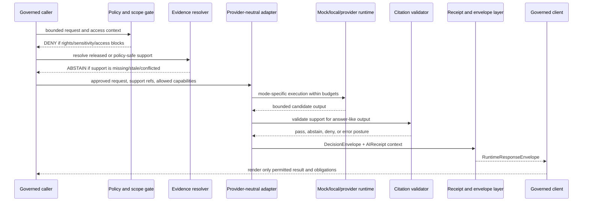

<!-- [KFM_META_BLOCK_V2]
doc_id: kfm://doc/runtime-model-adapters-readme
title: runtime/model_adapters/ — Canonical Provider-Neutral Model Adapter Lane
type: readme; directory-readme; canonical-runtime-lane; provider-neutral-adapter-boundary
version: v1.1
status: draft; canonical-lane-confirmed; implementation-mixed; NEEDS VERIFICATION
policy_label: public
owners: OWNER_TBD — Runtime steward · Governed-AI steward · API steward · Contracts steward · Schema steward · Policy steward · Evidence steward · Security steward · Test steward · Migration steward · Docs steward
created: NEEDS VERIFICATION — greenfield stub was replaced by v1 on 2026-07-03
updated: 2026-07-15
current_path: runtime/model_adapters/README.md
compatibility_path: runtime/adapters/
truth_posture: CONFIRMED target README, runtime responsibility root, canonical provider-neutral adapter lane, compatibility adapters lane, descriptive AdapterContract note, mock child lane, adjacent mock/Ollama/envelope/AI lanes, canonical DecisionEnvelope contract and paired schema, AIReceipt and RuntimeResponseEnvelope contracts and paired schemas, runtime fixture-family index, and common schema fixture harness at the pinned evidence snapshot / CONFLICTED AdapterContract evidence note because it says canonical DecisionEnvelope was not confirmed while current repository evidence confirms contracts/runtime/decision_envelope.md and its paired schema / UNKNOWN executable adapter implementations, child inventory beyond inspected README surfaces, provider integrations, approved model inventory, adapter registry, policy enforcement, evidence resolution, citation validation, receipt persistence, network and tool permissions, public-client wiring, CI results, deployment, and release state / NEEDS VERIFICATION canonical FocusRequest contract and schema, canonical adapter semantic contract and schema, adapter-card identity scheme, provider admission process, validator wiring, CODEOWNERS enforcement, correction propagation, and runtime-specific tests
evidence_snapshot:
  repository: bartytime4life/Kansas-Frontier-Matrix
  visibility: public
  base_ref: main
  base_commit: a8cf7411b3ba865495734fb0e9173a717585a488
  prior_blob: ab3ad9b3be29a7cdbdc4d77e751c5e5b2134451e
  prepared_under_prompt: KFM GitHub Repository Documentation Implementation Agent v3.1.0
related:
  - ../README.md
  - ../adapters/README.md
  - ./AdapterContract.md
  - ./mock/README.md
  - ../mock/README.md
  - ../ollama/README.md
  - ../envelopes/README.md
  - ../AI/README.md
  - ../../contracts/runtime/README.md
  - ../../contracts/runtime/decision_envelope.md
  - ../../contracts/runtime/ai_receipt.md
  - ../../contracts/runtime/runtime_response_envelope.md
  - ../../schemas/contracts/v1/runtime/decision_envelope.schema.json
  - ../../schemas/contracts/v1/runtime/ai_receipt.schema.json
  - ../../schemas/contracts/v1/runtime/runtime_response_envelope.schema.json
  - ../../fixtures/contracts/v1/runtime/README.md
  - ../../tests/schemas/test_common_contracts.py
  - ../../policy/runtime/README.md
  - ../../docs/doctrine/directory-rules.md
  - ../../docs/registers/DRIFT_REGISTER.md
tags: [kfm, runtime, model-adapters, canonical-lane, provider-neutral, adapter-contract, decision-envelope, ai-receipt, runtime-response-envelope, finite-outcomes, cite-or-abstain, mock-first, no-direct-public-model]
notes:
  - "v1.1 applies the v3.1 repository-documentation implementation prompt and preserves the prior README's useful provider-neutral adapter guidance."
  - "runtime/model_adapters is the confirmed canonical adapter documentation and handoff lane; runtime/adapters is compatibility and migration only."
  - "DecisionEnvelope is confirmed as a canonical snake_case semantic contract with a paired schema. FocusRequest and an adapter-contract schema remain unresolved at the checked paths."
  - "This README does not activate an adapter, approve a provider or model, define policy, grant network or tool access, close evidence, validate citations, prove receipt persistence, authorize public rendering, or publish KFM material."
[/KFM_META_BLOCK_V2] -->

<a id="top"></a>

# `runtime/model_adapters/` — Canonical Provider-Neutral Model Adapter Lane

> **One-line purpose.** Define the canonical runtime lane for provider-neutral model-adapter cards, interface handoffs, mode-specific bindings, and migration records while keeping evidence, policy, contracts, schemas, receipts, testing, public clients, and release authority in their owning roots.

<p>
  
  
  
  
  
  
</p>

> [!IMPORTANT]
> `runtime/model_adapters/` is the canonical runtime documentation and handoff lane for provider-neutral model adapters. It is **not** canonical contract meaning, JSON Schema authority, policy authority, model-provider authority, EvidenceBundle storage, receipt/proof storage, public API authority, or release authority. Public clients must reach model-mediated behavior only through governed interfaces and finite response envelopes.

## Quick navigation

[Status](#status-and-evidence-boundary) · [Purpose](#purpose-and-bounded-scope) · [Placement](#repository-fit-and-placement) · [Routing](#responsibility-routing) · [Authority](#authority-and-anti-collapse-rules) · [Operating law](#model-adapter-operating-law) · [Interface](#provider-neutral-adapter-interface) · [Contracts](#verified-contract-and-schema-surfaces) · [Modes](#adapter-modes-and-admission-posture) · [Flow](#governed-adapter-flow) · [Outcomes](#finite-runtime-outcomes) · [Evidence](#evidence-policy-citation-and-release-posture) · [Receipts](#receipts-envelopes-and-traceability) · [Security](#security-privacy-network-and-tool-boundary) · [Testing](#testing-validation-and-no-network-posture) · [Adapter card](#minimal-model-adapter-card) · [Done](#definition-of-done) · [Migration](#compatibility-migration-and-supersession) · [Maintenance](#maintenance-correction-and-rollback) · [Open](#open-verification-backlog) · [Evidence basis](#evidence-basis)

---

## Status and evidence boundary

| Surface | Status at the pinned snapshot | Consequence |
|---|---|---|
| `runtime/model_adapters/README.md` | **CONFIRMED** | Target README exists; prior blob is recorded in the metadata block. |
| `runtime/` | **CONFIRMED canonical root** | Owns local runtime wiring and adapter/runtime handoff documentation. |
| `runtime/model_adapters/` | **CONFIRMED canonical adapter lane** | Directory Rules and current repository documentation identify this as the provider-neutral model-adapter home. |
| `runtime/adapters/` | **CONFIRMED compatibility and migration lane** | Legacy discovery path; new adapter authority must not accumulate there. |
| `runtime/model_adapters/AdapterContract.md` | **CONFIRMED descriptive runtime note** | Documents `FocusRequest` → `DecisionEnvelope` and cite-or-abstain; explicitly not canonical semantic contract authority. |
| `contracts/runtime/decision_envelope.md` | **CONFIRMED canonical snake_case contract; status PROPOSED** | Defines `DecisionEnvelope` meaning and pairs to a runtime schema. |
| `schemas/contracts/v1/runtime/decision_envelope.schema.json` | **CONFIRMED paired schema; status PROPOSED** | Requires finite outcome, policy family, reasons, obligations, and evaluation time. |
| `contracts/runtime/focus_request.md` | **UNKNOWN / absent at checked path** | Do not claim a canonical `FocusRequest` semantic contract from this README. |
| `schemas/contracts/v1/runtime/adapter_contract.schema.json` | **UNKNOWN / absent at checked path** | Do not claim a canonical adapter-contract machine shape. |
| `runtime/model_adapters/mock/` | **CONFIRMED README surface; implementation UNKNOWN** | Mock-first child lane is documented; executable mock adapter code is not established here. |
| `runtime/mock/`, `runtime/ollama/`, `runtime/envelopes/`, `runtime/AI/` | **CONFIRMED documentation surfaces** | Own broader mock runtime, local Ollama, envelope-helper, and governed-AI compatibility concerns. |
| `AIReceipt` and `RuntimeResponseEnvelope` contracts/schemas | **CONFIRMED present; status PROPOSED** | Accountability and client-facing envelope shapes exist; presence does not prove runtime execution. |
| Runtime fixtures and common schema harness | **CONFIRMED present; NOT RUN for this edit** | Fixture-family documentation and schema test discovery exist. No test or CI success is claimed here. |
| `policy/runtime/README.md` | **CONFIRMED stub** | No accepted runtime-policy implementation is established by the stub. |
| Executable adapters, provider approvals, model approvals, network/tool permissions, evidence resolution, citation validation, receipt persistence, client enforcement, CI, deployment, release | **UNKNOWN** | Documentation and schema presence are not operational proof. |

> [!WARNING]
> `AdapterContract.md` contains an older evidence note saying canonical `DecisionEnvelope` was not confirmed in that authoring session. Current repository evidence confirms `contracts/runtime/decision_envelope.md` and its paired schema. Treat that sentence as stale documentation evidence, not current repository truth. Correct it in a separate scoped edit rather than silently importing it here.

**Document authority:** canonical runtime-lane guidance and index only. Contracts, schemas, policy, EvidenceBundles, validators, tests, implementation code, receipts, runtime envelopes, release records, correction records, and steward decisions outrank this README.

---

## Purpose and bounded scope

This lane answers five questions:

1. **What is the stable provider-neutral adapter boundary?**
2. **Which runtime mode implements that boundary?**
3. **Which evidence, policy, citation, receipt, and envelope obligations apply?**
4. **Which proof is required before an adapter status advances?**
5. **How do legacy or mode-specific records migrate without creating parallel authority?**

This README covers:

- provider-neutral adapter cards and interface handoffs;
- mock, local, provider-backed, and disabled runtime modes;
- bounded input and finite output posture;
- contract/schema/policy/fixture/test routing;
- evidence, citation, freshness, correction, and release constraints;
- provider/model admission and version pinning;
- network, tool, secret, and public-exposure controls;
- deterministic mock-first validation;
- AIReceipt, DecisionEnvelope, and RuntimeResponseEnvelope handoffs;
- status progression, supersession, deactivation, and rollback.

This README does **not** define:

- canonical `FocusRequest` meaning or machine shape;
- a canonical adapter-contract schema;
- provider terms, pricing, availability, or model fitness;
- runtime policy or access decisions;
- EvidenceBundle content or evidence admissibility;
- adapter implementation behavior without code and tests;
- public API/UI/map/Focus Mode behavior;
- release approval, correction authority, or publication state.

---

## Repository fit and placement

Directory Rules assign local runtime wiring to `runtime/` and explicitly name `runtime/model_adapters/` as the provider-neutral adapter lane.

```text
runtime/
├── README.md
├── model_adapters/          # this file; canonical provider-neutral adapter lane
│   ├── README.md
│   ├── AdapterContract.md   # descriptive interface note; not canonical contract authority
│   └── mock/                # mock-only model-adapter child lane
├── adapters/                # compatibility and migration index only
├── mock/                    # broader deterministic mock-runtime lane
├── ollama/                  # local Ollama runtime lane
├── envelopes/               # finite-outcome envelope-helper lane
├── AI/                      # governed-AI compatibility/index lane
├── local/                   # local runtime wiring
└── service_configs/         # non-secret service configuration notes

contracts/runtime/           # semantic runtime-object meaning
schemas/contracts/v1/runtime/# machine-checkable runtime shapes
policy/runtime/              # runtime admissibility and obligations
fixtures/contracts/v1/runtime/# valid and invalid schema fixtures
tests/                       # executable proof
tools/validators/            # validator implementation
data/receipts/               # receipt instances, subject to accepted data layout
release/                     # release, correction, withdrawal, and rollback authority
```

### Placement determination

| Question | Determination |
|---|---|
| Is `runtime/` the correct responsibility root? | **CONFIRMED.** |
| Is `runtime/model_adapters/` the canonical provider-neutral adapter lane? | **CONFIRMED by Directory Rules and current repository documentation.** |
| Is `runtime/adapters/` a second canonical adapter lane? | **No.** It is compatibility and migration only. |
| Is `AdapterContract.md` canonical contract authority? | **No.** It is a descriptive runtime note. |
| Is `DecisionEnvelope` contract/schema presence confirmed? | **Yes; status remains PROPOSED.** |
| Is `FocusRequest` contract/schema presence confirmed? | **No at the checked canonical-looking paths.** |
| Does this README authorize provider/model activation? | **No.** Activation needs policy, security, tests, receipts, ownership, and review. |
| Does this update create a new authority root or require a root ADR? | **No.** |

---

## Responsibility routing

| Work item | Correct home | Role of this lane |
|---|---|---|
| Provider-neutral adapter card | `runtime/model_adapters/` | Canonical home. |
| Descriptive adapter boundary note | [`AdapterContract.md`](AdapterContract.md) until canonical semantics are accepted | Link and preserve its non-canonical status. |
| Canonical adapter semantic contract | accepted `contracts/runtime/` or ADR-approved contract family | Link only; do not define in this README. |
| Adapter or request JSON Schema | `schemas/contracts/v1/runtime/` after contract acceptance | Link only; do not invent shape here. |
| Mock model-adapter card | [`runtime/model_adapters/mock/`](mock/) | Canonical mock-adapter child lane. |
| Broader deterministic runtime notes | [`runtime/mock/`](../mock/) | Coordinate; do not duplicate. |
| Local Ollama runtime wiring | [`runtime/ollama/`](../ollama/) plus a provider-neutral adapter card here | Keep runtime-specific details in Ollama lane. |
| Envelope-helper implementation notes | [`runtime/envelopes/`](../envelopes/) | Link; do not redefine envelope meaning. |
| Governed-AI navigation | [`runtime/AI/`](../AI/) | Cross-link only. |
| Legacy adapter references | [`runtime/adapters/`](../adapters/) | Compatibility pointer or migration record only. |
| Runtime object semantic meaning | [`contracts/runtime/`](../../contracts/runtime/) | Contract authority. |
| Runtime machine shape | [`schemas/contracts/v1/runtime/`](../../schemas/contracts/v1/runtime/) | Schema authority. |
| Runtime policy | [`policy/runtime/`](../../policy/runtime/) or accepted policy family | Policy authority. |
| Valid and invalid runtime examples | [`fixtures/contracts/v1/runtime/`](../../fixtures/contracts/v1/runtime/) | Fixture authority. |
| Schema fixture tests | [`tests/schemas/`](../../tests/schemas/) | Executable schema proof. |
| Adapter implementation code | accepted package/app/runtime implementation path verified by repo evidence | Do not guess or create a parallel code home. |
| Validator implementation | `tools/validators/` | Link only after path and wiring are verified. |
| Receipt instance | accepted `data/receipts/` family | Link by stable reference; do not store instances here. |
| EvidenceBundle or proof | accepted evidence/proof roots | Resolve through governed references. |
| Release, correction, withdrawal, rollback | `release/` | Never decide or store authority here. |
| Public API/UI/map/Focus Mode behavior | governed app/API/UI/package roots | Clients use governed interfaces only. |

---

## Authority and anti-collapse rules

1. **Provider neutrality is an interface property, not a claim that all providers behave identically.** Mode-specific differences must be explicit and tested.
2. **Adapter output is not evidence.** `EvidenceBundle` and admissible source records outrank model output.
3. **Adapter capability is not permission.** Policy, rights, sensitivity, access, release, freshness, and correction state control what may happen.
4. **A model name is not an approval.** Provider/model admission requires explicit review and version/digest posture.
5. **A receipt is not truth.** `AIReceipt` records accountability; it does not make output factual or publishable.
6. **An envelope is not a payload store.** `DecisionEnvelope` and `RuntimeResponseEnvelope` carry finite posture and support pointers.
7. **Generated citations are not validated citations.** Answer-like output must pass citation validation or abstain.
8. **Local execution is not automatically safe.** Local models remain behind governed interfaces and deny-by-default controls.
9. **Mocks are test material.** Mock output must never masquerade as provider output, released evidence, or public truth.
10. **Public clients never call model adapters directly.** They consume governed API/runtime envelopes and released, policy-safe support.
11. **Compatibility paths do not become authority by repetition.** `runtime/adapters/` remains a pointer and migration surface.
12. **No silent fallback.** Provider or model failure must resolve to an explicit bounded fallback, `ABSTAIN`, `DENY`, or `ERROR`—never an ungoverned alternate path.

---

## Model-adapter operating law

Every adapter record and implementation claim should preserve these invariants:

| Invariant | Required posture |
|---|---|
| Bounded scope | The adapter receives a request whose domain, geography, time, user role, purpose, evidence scope, and allowed capabilities are bounded. |
| Provider-neutral boundary | Mock, local, and provider-backed modes implement the same accepted semantic boundary where practical. |
| Evidence first | Claim-bearing output uses governed evidence pointers; missing support produces `ABSTAIN`. |
| Policy first | Rights, sensitivity, access, release, stale, correction, and capability policy are checked before model execution or display. |
| Finite outcomes | Results resolve to `ANSWER`, `ABSTAIN`, `DENY`, or `ERROR`. |
| Citation validation | Answer-like output cites admissible support or abstains. |
| Receipted execution | AI-mediated runs emit or link `AIReceipt` and relevant run/validation records when required. |
| Client envelope | Client-facing behavior uses `RuntimeResponseEnvelope` or another accepted governed envelope. |
| Deterministic testing | Mock-first fixtures cover positive and negative paths without live network dependence. |
| Secret hygiene | Credentials, tokens, private configuration, model weights, private prompts, and chain-of-thought stay out of the repository. |
| Correction propagation | Stale, corrected, superseded, withdrawn, or rollback-affected support changes downstream response posture. |
| No publication authority | Adapters never promote, release, correct, withdraw, or authorize rollback. |

---

## Provider-neutral adapter interface

The current descriptive runtime note uses this compatibility boundary:

```text
FocusRequest in
  -> governed adapter checks allowed context
  -> DecisionEnvelope out
  -> cite-or-abstain by default
```

### Current determination

| Surface | Determination |
|---|---|
| `FocusRequest` name | **PROPOSED compatibility name.** A canonical contract/schema was not confirmed at the checked paths. |
| `DecisionEnvelope` name | **CONFIRMED canonical snake_case contract and paired schema; status PROPOSED.** |
| `AdapterContract` name | **Descriptive runtime-note name.** Canonical semantic contract and machine shape remain unresolved. |
| Provider-neutral input shape | **NEEDS VERIFICATION.** Do not implement undocumented fields as settled authority. |
| Provider-neutral output shape | `DecisionEnvelope` is the confirmed finite-decision object; client delivery may additionally require `RuntimeResponseEnvelope`. |

### Minimum input obligations

Until a canonical request contract is accepted, an adapter card must describe—without pretending to define canonical fields:

- request identity and trace context;
- bounded task or capability;
- user/access role and purpose;
- domain, geography, time, feature, layer, or claim scope;
- evidence references or approved fixture context;
- policy, rights, sensitivity, freshness, correction, and release context;
- allowed tools, network access, and adapter capabilities;
- citation requirement;
- receipt and logging requirement;
- timeout, size, token, or resource budgets;
- safe fallback and finite-outcome behavior.

A normal governed input must not contain direct RAW/WORK/QUARANTINE dumps, unpublished candidate payloads, credentials, provider secrets, private chain-of-thought, unrestricted exact sensitive locations, or hidden public-client bypasses.

### Minimum output obligations

An adapter result must provide or support:

- finite outcome;
- safe reasons and obligations;
- evidence/citation support actually used or checked;
- policy-family or policy-decision linkage;
- adapter and model/version reference;
- freshness and correction posture where material;
- receipt linkage;
- safe public diagnostics only;
- explicit failure or abstention instead of invented content.

---

## Verified contract and schema surfaces

### `DecisionEnvelope`

The verified contract and paired schema establish:

| Field | Required by schema | Confirmed posture |
|---|---:|---|
| `decision_id` | yes | Stable runtime decision identifier. |
| `outcome` | yes | `ANSWER`, `ABSTAIN`, `DENY`, or `ERROR`. |
| `policy_family` | yes | `promotion`, `access`, `render`, `capability`, `consent`, or `sensitivity`. |
| `reasons` | yes | Array of safe decision reasons. |
| `obligations` | yes | Array of runtime/client obligations. |
| `evaluated_at` | yes | Date-time of evaluation. |
| `evidence_refs` | optional | Evidence pointers; refs alone are not evidence closure. |
| compatibility fields | optional | `id`, `decision`, `reason_code`, `spec_hash`, `version`, and `issued_at`. |

The schema closes additional properties. Adapter implementations must not append unreviewed fields and call the result contract-valid.

### `AIReceipt`

The verified contract/schema require an accountable AI-mediated run record with:

- stable receipt and run identifiers;
- adapter and model reference;
- canonicalized input and output digests;
- policy-decision reference;
- citation-validation reference;
- finite outcome.

`AIReceipt` must not store raw prompts, raw evidence, credentials, private model internals, or chain-of-thought. It records the AI step; it does not establish truth.

### `RuntimeResponseEnvelope`

The verified contract/schema require a client-facing finite response envelope with:

- identifier, version, spec hash, and issuance time;
- `ANSWER`, `ABSTAIN`, `DENY`, or `ERROR`;
- safe reason code;
- evidence references;
- policy state;
- freshness state;
- correction state.

Clients must render only what the governed envelope permits.

### Unresolved surfaces

| Surface | Status | Required next evidence |
|---|---|---|
| Canonical `FocusRequest` contract | UNKNOWN / absent at checked path | Accepted contract or ADR-backed alternative. |
| Canonical adapter semantic contract | NEEDS VERIFICATION | Contract under accepted `contracts/` family. |
| Adapter-contract JSON Schema | UNKNOWN / absent at checked path | Schema paired to accepted contract. |
| Adapter registry schema | UNKNOWN | Registry design, deterministic identity, owner, and tests. |
| Provider/model admission record | UNKNOWN | Policy-backed contract, schema, fixtures, review, and deactivation path. |
| Tool-permission envelope | UNKNOWN | Accepted contract/policy and negative tests. |

---

## Adapter modes and admission posture

| Mode | Purpose | Minimum admission posture | Must not become |
|---|---|---|---|
| `mock` | Deterministic fixtures and negative-path proof. | Fixed inputs/outputs, no-network default, schema-valid envelopes, finite outcomes, tests. | Production truth or provider evidence. |
| `local` | Local development runtime such as Ollama. | Explicit local-only status, model ref/digest where available, security review, bounded tools/network, mock parity, tests. | Direct public endpoint or automatic approval. |
| `provider-backed` | Remote or hosted model runtime. | Provider terms, data handling, endpoint, authentication, model/version, cost/rate limits, retention, security, policy, tests, receipts, kill switch. | Source authority, evidence authority, or hidden fallback. |
| `disabled` | Registered but unavailable or deactivated. | Reason, date, owner, affected surfaces, migration/fallback, correction impact. | Silent routing target. |
| `held` | Candidate blocked pending evidence or review. | Explicit blockers and next evidence. | Active adapter. |

### Provider and model admission checklist

Before a provider-backed or local model adapter is marked active:

- [ ] Provider and model identifiers are explicit and version-pinned where possible.
- [ ] Model reference is specific enough for audit.
- [ ] Provider terms, data retention, training-use posture, region, and subprocessor posture are reviewed when applicable.
- [ ] Authentication and secrets use approved secret stores, never repository files.
- [ ] Network destinations, protocols, timeouts, retries, and circuit-breaking are bounded.
- [ ] Tool access is allowlisted and scoped.
- [ ] Input/output size, cost, token, and resource budgets are defined.
- [ ] Sensitive-domain, living-person, DNA, archaeology, rare-species, infrastructure, and precise-location handling fail closed.
- [ ] Mock parity and no-network tests cover finite outcomes.
- [ ] Citation validation and evidence-resolution behavior are tested where answers cite support.
- [ ] AIReceipt and RuntimeResponseEnvelope handoffs are verified where required.
- [ ] Deactivation, incident response, correction propagation, and rollback paths are documented.
- [ ] Steward approvals and review dates are recorded.

---

## Governed adapter flow



The adapter is one bounded step. It does not own policy, evidence, citation authority, release state, correction authority, or client permission.

---

## Finite runtime outcomes

| Outcome | Adapter meaning | Required downstream posture |
|---|---|---|
| `ANSWER` | Scope is permitted, evidence support is sufficient, policy allows response, and citation requirements pass. | Attach support, obligations, receipt/envelope linkage, freshness, and correction posture. |
| `ABSTAIN` | Evidence, citation, source authority, freshness, scope, confidence, or request definition is insufficient. | Return safe reasons; do not invent or infer the answer. |
| `DENY` | Policy, rights, sensitivity, access, consent, release state, tool permission, or capability policy forbids execution or display. | Do not expose restricted content; preserve safe reason codes and obligations. |
| `ERROR` | Adapter, model, dependency, validation, timeout, configuration, contract, receipt, or envelope failure prevents safe completion. | Fail safely, preserve traceability, and do not fall through to ungoverned output. |

A timeout, provider error, malformed response, missing policy decision, unresolved evidence ref, citation failure, or envelope failure must never be converted silently into `ANSWER`.

---

## Evidence, policy, citation, and release posture

### Evidence

- Adapters consume governed evidence references or approved fixtures, not canonical stores as a normal public path.
- Evidence refs must resolve through governed interfaces when factual claims depend on them.
- Retrieved context, vector results, graph projections, tiles, and summaries remain derivatives or carriers.
- Generated output must not be appended to an EvidenceBundle as source evidence without a separate governed admission process.

### Policy

- Policy controls whether the adapter may run, which capabilities it may use, what may be returned, and which obligations apply.
- Missing, stale, mismatched, or unresolved policy state fails closed.
- Provider/model capability never overrides rights, sensitivity, consent, access, release, or correction constraints.

### Citation

- Citation-like text generated by a model is not validated support.
- Answer-like output must map claims to resolvable support or return `ABSTAIN`.
- Citation validation results are separate objects/reports; `AIReceipt` links them but does not perform validation.

### Release and correction

- Adapters operate downstream of released or explicitly policy-safe support for public responses.
- Stale, corrected, superseded, withdrawn, or rollback-affected evidence must propagate into finite response posture.
- Adapter output cannot approve release, correct canonical records, withdraw publications, or authorize rollback.

---

## Receipts, envelopes, and traceability

A mature adapter run should be traceable across these surfaces:

```text
bounded request/context
  -> policy decision
  -> evidence-resolution result
  -> adapter/model run
  -> citation-validation result
  -> DecisionEnvelope
  -> AIReceipt or RunReceipt
  -> RuntimeResponseEnvelope
  -> client rendering decision
```

### Minimum trace links

| Link | Why it matters |
|---|---|
| Adapter card ID and version | Identifies the provider-neutral boundary used. |
| Runtime mode | Distinguishes mock, local, provider-backed, disabled, or held behavior. |
| Model/provider reference | Supports reproducibility and incident review. |
| Input/output digests | Detects content drift without storing sensitive payloads in receipts. |
| Policy-decision reference | Shows which policy posture governed execution. |
| Evidence-resolution references | Shows which support was available and used. |
| Citation-validation reference | Shows whether answer support was checked. |
| DecisionEnvelope reference | Records finite decision, reasons, obligations, and evaluation time. |
| AIReceipt/RunReceipt reference | Records accountable runtime activity. |
| RuntimeResponseEnvelope reference | Records what the governed client may render. |
| Correction or supersession linkage | Prevents stale adapter results from appearing current. |

Receipts and logs must be data-minimized. Do not put raw prompts, raw retrieved documents, credentials, protected locations, private data, or chain-of-thought into a public receipt.

---

## Security, privacy, network, and tool boundary

### Secrets and provider configuration

Never commit:

- API keys, bearer tokens, client secrets, service-account keys, or signing material;
- `.env` values, private endpoints, internal hostnames, or unredacted account identifiers;
- model weights or large downloaded model artifacts;
- private prompts, raw protected evidence, or chain-of-thought;
- provider configuration that exposes credentials or unrestricted network access.

### Network posture

- No-network is the default for tests and documentation examples.
- Live network use requires an approved adapter/provider record and explicit configuration.
- Destination hosts, redirects, proxies, certificate posture, timeouts, retries, concurrency, and rate limits must be bounded.
- Provider failures use bounded backoff and circuit-breaking.
- Fallback adapters must be explicit, policy-approved, receipt-visible, and test-covered.

### Tool posture

- Tools are deny-by-default and allowlisted per request/use case.
- Read, write, execute, network, filesystem, database, map-action, and external-service capabilities must be separately bounded.
- Public clients must not smuggle unrestricted tool instructions through adapter prompts.
- Tool results remain external/derived inputs subject to source, evidence, policy, and citation review.
- High-impact actions require separate governed action contracts and review; model text alone never authorizes execution.

### Privacy and sensitive domains

Adapters must fail closed for unclear handling of:

- living-person and family data;
- DNA/genomic or health-adjacent data;
- precise archaeology or cultural/sacred locations;
- rare species and rare plants;
- critical infrastructure and security-sensitive facilities;
- private landowner joins;
- protected source terms, restricted archives, or unclear rights;
- precise location requests whose exposure risk exceeds policy.

---

## Testing, validation, and no-network posture

### Test tiers

| Tier | Network | Purpose | Promotion consequence |
|---|---|---|---|
| Schema fixtures | off | Validate contract-shaped examples and negative cases. | Required before shape claims. |
| Mock adapter | off | Prove deterministic mode parity and finite outcomes. | Required before live mode admission. |
| Policy/citation integration | off by default | Prove deny, abstain, obligation, and citation-failure behavior. | Required before answer claims. |
| Local runtime integration | local only | Verify local model binding and budgets. | Local-only until reviewed. |
| Provider integration | controlled | Verify endpoint, auth, versions, errors, rate limits, retention, and receipts. | Requires explicit activation and secrets posture. |
| Governed client boundary | controlled/no-network fixtures | Prove clients honor envelopes and cannot bypass runtime gates. | Required before public exposure. |
| Rollback/correction drill | off or controlled | Prove deactivation, stale support, correction, and fallback behavior. | Required before mature operational use. |

### Required negative cases

Tests should cover at least:

- missing or unresolved evidence references;
- stale, corrected, superseded, withdrawn, or rollback-affected support;
- missing or mismatched policy state;
- rights, sensitivity, access, consent, capability, or render denial;
- citation validation failure;
- unsupported request scope;
- malformed model/provider response;
- schema-invalid DecisionEnvelope, AIReceipt, or RuntimeResponseEnvelope;
- timeout, rate limit, connection failure, provider outage, and circuit open;
- tool request outside the allowlist;
- secret-like output or protected-detail leakage;
- prompt injection in retrieved or user-supplied content;
- direct public adapter/model endpoint attempts;
- fallback to an unapproved provider or model;
- output without required receipt/envelope linkage.

### Grounded repository checks

```bash
find runtime/model_adapters -maxdepth 5 -type f | sort
find runtime/adapters runtime/mock runtime/ollama runtime/envelopes runtime/AI -maxdepth 5 -type f 2>/dev/null | sort
find contracts/runtime schemas/contracts/v1/runtime fixtures/contracts/v1/runtime -maxdepth 5 -type f | sort
python -m pytest -q tests/schemas/test_common_contracts.py
```

The final command is grounded in a confirmed repository test file. It was **not run** during this API-only README edit. Do not report it as passing without execution evidence.

---

## Adapter status lifecycle

Use the canonical lane vocabulary consistently:

| Status | Meaning | Minimum transition evidence |
|---|---|---|
| `DRAFT` | Card exists but is incomplete. | Identity and scope. |
| `READY_FOR_REVIEW` | Documentation is complete enough for review. | Required fields and links populated. |
| `MOCK_ONLY` | Deterministic test adapter only. | Fixtures, finite outcomes, tests, no-network posture. |
| `LOCAL_ONLY` | Local runtime binding only. | Local security, model ref, mock parity, tests. |
| `PROVIDER_BOUND` | Depends on a named provider/model binding. | Provider/model admission evidence and tests. |
| `VALIDATION_REQUIRED` | Missing executable proof or required validation. | Named blockers and expected checks. |
| `HELD` | Blocked by policy, rights, sensitivity, security, contract, schema, ownership, or placement. | Hold reasons and reviewer. |
| `ACTIVE_ADAPTER` | Accepted for its explicitly bounded use and mode. | Contract/policy/security/test/receipt review and approval. |
| `MIGRATE` | Record or implementation must move to an accepted lane or version. | Target, mapping, link plan, rollback. |
| `SUPERSEDED` | Replaced by a newer adapter card/version. | Forward link and correction/impact notes. |
| `RETIRED` | No longer active. | Deactivation evidence and downstream impact review. |

`ACTIVE_ADAPTER` is not equivalent to evidence authority, public availability, or release approval. It applies only to the card's accepted mode and use case.

---

## Required adapter-card fields

Every adapter card should record:

### Identity and ownership

- adapter card ID;
- adapter name and family;
- version and spec/content hash when available;
- owner and required reviewers;
- status, effective date, and supersession lineage.

### Mode and runtime

- mode: mock, local, provider-backed, disabled, or held;
- implementation reference and version/digest;
- provider/model reference;
- allowed use cases and prohibited uses;
- input/output size and resource budgets;
- timeout, retry, rate-limit, and circuit-breaker posture;
- network destinations and tool allowlist.

### Trust and governance

- evidence posture;
- policy family and policy-decision linkage;
- rights, sensitivity, access, consent, release, freshness, and correction posture;
- citation-validation requirement;
- finite-outcome behavior;
- AIReceipt, RunReceipt, DecisionEnvelope, and RuntimeResponseEnvelope linkage;
- data minimization and secret-handling posture.

### Proof and operations

- contract and schema pointers;
- fixtures, tests, validators, and last verified result;
- mock parity and provider/local parity notes;
- observability and safe diagnostic posture;
- deactivation and rollback plan;
- open blockers and follow-up work.

---

## Minimal model adapter card

```markdown
<!-- [KFM_META_BLOCK_V2]
doc_id: kfm://runtime/model-adapter/<adapter-id>
title: <adapter name> model adapter card
type: runtime-note; model-adapter-card
version: <version or NEEDS VERIFICATION>
status: DRAFT
owners: OWNER_TBD
updated: <YYYY-MM-DD>
policy_label: <public / restricted / NEEDS VERIFICATION>
[/KFM_META_BLOCK_V2] -->

# <Adapter name> model adapter card

## Status

DRAFT / READY_FOR_REVIEW / MOCK_ONLY / LOCAL_ONLY / PROVIDER_BOUND / VALIDATION_REQUIRED / HELD / ACTIVE_ADAPTER / MIGRATE / SUPERSEDED / RETIRED

## Identity

- Adapter card ID: <stable id>
- Adapter family: <provider-neutral family>
- Version/spec hash: <value or NEEDS VERIFICATION>
- Owner: <steward or OWNER_TBD>

## Runtime mode

- Mode: <mock / local / provider-backed / disabled / held>
- Implementation ref: <path/version/digest or UNKNOWN>
- Provider/model ref: <value or N/A>
- Allowed use: <bounded use case>
- Prohibited use: <explicit exclusions>

## Governed interface

- Input contract: <accepted contract or NEEDS VERIFICATION>
- Output contract: <DecisionEnvelope contract or accepted alternative>
- Client envelope: <RuntimeResponseEnvelope or N/A>
- Finite outcomes: ANSWER / ABSTAIN / DENY / ERROR

## Evidence and policy

- Evidence posture: <refs/resolution/fixture posture>
- Policy decision: <ref or NEEDS VERIFICATION>
- Rights/sensitivity/access: <posture>
- Freshness/correction/release: <posture>
- Citation validation: <ref/requirement or N/A>

## Security and capabilities

- Network allowlist: <hosts or none>
- Tool allowlist: <capabilities or none>
- Secrets source: <approved secret-store reference or N/A>
- Timeout/retry/rate limit: <values or NEEDS VERIFICATION>
- Data minimization: <notes>

## Receipts and proof

- DecisionEnvelope: <ref or N/A>
- AIReceipt / RunReceipt: <ref or N/A>
- Fixtures: <path or N/A>
- Tests: <path and last result or NOT RUN>
- Validators: <path/wiring or NEEDS VERIFICATION>

## Deactivation and rollback

<kill switch, fallback, correction impact, and rollback target>

## Review

- Reviewer: <steward or maintainer>
- Review date: <YYYY-MM-DD>
- Open blockers: <items or none>
- Follow-up: <items or none>
```

Do not store credentials, private prompts, raw protected evidence, sensitive exact locations, model weights, chain-of-thought, or operational receipt payloads in an adapter card.

---

## Definition of done

An adapter is not done because a README or class exists.

| Acceptance criterion | Required result |
|---|---|
| Placement | Card and implementation references use accepted responsibility roots. |
| Canonical boundary | Input/output semantics link accepted contracts or explicitly remain `NEEDS VERIFICATION`. |
| Machine shape | Implemented payloads validate against accepted schemas. |
| Provider neutrality | Mock/local/provider modes preserve the accepted boundary or document reviewed differences. |
| Finite outcomes | `ANSWER`, `ABSTAIN`, `DENY`, and `ERROR` are explicit and tested. |
| Evidence | Claim-bearing output uses resolvable governed support or abstains. |
| Policy | Rights, sensitivity, access, consent, capability, release, freshness, and correction gates fail closed. |
| Citations | Answer-like output is citation-validated or abstains. |
| Receipts | Required AIReceipt/RunReceipt/DecisionEnvelope/RuntimeResponseEnvelope links are emitted and validated. |
| Security | Secrets, network, tools, provider terms, retention, and data minimization are reviewed. |
| Tests | No-network mock fixtures and negative cases pass. |
| Public boundary | No direct public adapter/model endpoint exists. |
| Operations | Timeouts, retries, rate limits, circuit breaking, observability, deactivation, and rollback are documented and tested where material. |
| Correction | Stale/corrected/withdrawn/rollback-affected support changes downstream posture. |
| Review | Required stewards approve the bounded use and mode. |

Each criterion should be reported as `PASS`, `FAIL`, `PARTIAL`, `NOT RUN`, `NOT APPLICABLE`, or `UNKNOWN`. A commit or deployed service is not completion by itself.

---

## Compatibility, migration, and supersession

### `runtime/adapters/` compatibility path

New adapter authority belongs here under `runtime/model_adapters/`, not in `runtime/adapters/`.

A later migration or retirement of the compatibility path must:

1. inventory every file and subdirectory under `runtime/adapters/`;
2. inventory inbound links, documentation references, CI references, import paths, and generated indexes;
3. classify each item as pointer, duplicate, implementation, generated output, or unknown;
4. select the correct responsibility root;
5. preserve history with transparent moves or replacement pointers;
6. add forward links and supersession notes;
7. run path, link, schema, test, and client-boundary checks;
8. document rollback and correction steps;
9. use an ADR or migration note when authority or canonical naming changes;
10. avoid deleting unresolved files merely because the README labels the lane compatibility-only.

### Adapter version supersession

When one adapter version replaces another:

- retain the old card with `SUPERSEDED` or `RETIRED` status;
- link old and new IDs/versions;
- state why the change occurred;
- identify contract/schema/policy/model/provider changes;
- record affected receipts, clients, cached responses, and correction obligations;
- state whether replay remains possible;
- define deactivation and rollback targets;
- never mutate historical receipt records to make an old run appear new.

---

## Maintenance, correction, and rollback

Update this README when:

- Directory Rules change runtime placement;
- `runtime/adapters/` compatibility disposition changes;
- canonical adapter contracts or schemas are accepted;
- `FocusRequest` naming or shape is settled;
- DecisionEnvelope, AIReceipt, or RuntimeResponseEnvelope contracts change;
- provider/model admission rules are accepted;
- adapter registry or identity rules are introduced;
- policy, citation validation, receipt persistence, or client enforcement becomes verifiable;
- mock/local/provider adapter cards are added;
- runtime tests or CI become accepted and executable;
- a correction, incident, deactivation, or rollback reveals missing guidance.

### Documentation correction

If this README overstates implementation:

1. narrow the claim immediately;
2. label the surface `UNKNOWN` or `NEEDS VERIFICATION`;
3. link the missing evidence or failed check;
4. update affected adapter cards and indexes;
5. preserve prior text in Git history;
6. add a correction or drift record when the error affected implementation or review decisions.

### Rollback

Before merge, rollback is leaving the draft PR unmerged or restoring the prior blob in a transparent follow-up commit.

After merge, use a revert commit or revert PR. Do not reset or rewrite shared history. Rollback of documentation does not automatically reactivate a retired adapter, restore a provider integration, or reverse policy/release state; those require their own governed actions.

---

## Open verification backlog

### Placement and ownership

- [ ] Confirm CODEOWNERS for `runtime/model_adapters/` and child lanes.
- [ ] Inventory all children under `runtime/model_adapters/` beyond the inspected README and mock surfaces.
- [ ] Inventory all children and inbound links under `runtime/adapters/` before migration or retirement.
- [ ] Confirm the implementation-code home for provider-neutral and provider-specific adapters.

### Contracts and schemas

- [ ] Decide the canonical semantic contract for the adapter boundary.
- [ ] Decide whether `FocusRequest` is final, compatibility-only, or replaced by another request object.
- [ ] Create or identify the accepted request schema only after contract meaning is settled.
- [ ] Decide whether an adapter registry and adapter-card schema are needed.
- [ ] Correct the stale evidence sentence in `AdapterContract.md` concerning canonical `DecisionEnvelope` discovery.
- [ ] Verify validator files named by runtime schemas and their CI wiring.

### Policy and security

- [ ] Define provider/model admission policy and reviewer roles.
- [ ] Define network and tool-permission contracts/policies.
- [ ] Define secrets, retention, privacy, regional, cost, rate-limit, and incident requirements.
- [ ] Confirm sensitive-domain denial and redaction behavior.
- [ ] Confirm prompt-injection and retrieved-content isolation tests.

### Runtime proof

- [ ] Add or verify deterministic mock adapters and fixtures.
- [ ] Prove mode parity and reviewed mode-specific differences.
- [ ] Verify evidence resolution and citation validation for `ANSWER`.
- [ ] Verify `ABSTAIN`, `DENY`, and `ERROR` negative paths.
- [ ] Verify AIReceipt, DecisionEnvelope, and RuntimeResponseEnvelope emission/persistence.
- [ ] Verify timeout, retry, rate-limit, circuit-breaking, and fallback behavior.
- [ ] Verify correction, withdrawal, stale, supersession, deactivation, and rollback propagation.
- [ ] Verify public clients cannot call adapters/models directly.
- [ ] Identify accepted CI jobs and branch-protection checks.

---

## Evidence basis

| Source | Status | Supports | Limits |
|---|---|---|---|
| Previous `runtime/model_adapters/README.md` | CONFIRMED | Prior purpose, provider-neutral posture, adapter statuses, card fields, review checklist, naming guidance. | Did not fully distinguish verified contracts from proposed compatibility names or define provider admission and operational controls. |
| [`runtime/adapters/README.md`](../adapters/) | CONFIRMED | Compatibility and migration status of the legacy adapter lane. | Does not prove child inventory or migration readiness. |
| [`AdapterContract.md`](AdapterContract.md) | CONFIRMED descriptive note | `FocusRequest` → `DecisionEnvelope`, cite-or-abstain, provider-neutral obligations. | Not canonical contract authority; one older evidence note is stale against current repo evidence. |
| [`mock/README.md`](mock/) | CONFIRMED README surface | Mock-first adapter child-lane boundary. | Does not prove executable mock adapters or tests. |
| [`runtime/mock/README.md`](../mock/) | CONFIRMED README surface | Broader deterministic mock-runtime boundary. | Does not prove implementation. |
| [`runtime/ollama/README.md`](../ollama/) | CONFIRMED README surface | Local-only model-runtime boundary. | Does not prove installed models or adapter code. |
| [`runtime/envelopes/README.md`](../envelopes/) | CONFIRMED README surface | Runtime envelope-helper boundary. | Not contract/schema authority. |
| [`runtime/AI/README.md`](../AI/) | CONFIRMED compatibility/index surface | Governed-AI routing, no direct public model access. | Not implementation or policy proof. |
| [`contracts/runtime/decision_envelope.md`](../../contracts/runtime/decision_envelope.md) | CONFIRMED canonical snake_case contract; PROPOSED status | DecisionEnvelope meaning, finite outcomes, policy families, obligations, evidence refs. | Does not execute policy or runtime behavior. |
| [`schemas/contracts/v1/runtime/decision_envelope.schema.json`](../../schemas/contracts/v1/runtime/decision_envelope.schema.json) | CONFIRMED paired schema; PROPOSED status | Required fields, enums, closed additional properties. | Validator wiring and runtime use remain unverified. |
| [`contracts/runtime/ai_receipt.md`](../../contracts/runtime/ai_receipt.md) and paired schema | CONFIRMED present; PROPOSED status | AI run accountability, digests, policy and citation references, finite outcome. | Does not establish truth or receipt persistence. |
| [`contracts/runtime/runtime_response_envelope.md`](../../contracts/runtime/runtime_response_envelope.md) and paired schema | CONFIRMED present; PROPOSED status | Governed client-facing finite response posture, evidence, policy, freshness, correction. | Does not prove API/client enforcement. |
| [`fixtures/contracts/v1/runtime/README.md`](../../fixtures/contracts/v1/runtime/) | CONFIRMED | Runtime fixture-family organization and schema-harness expectations. | Tests were not run for this edit. |
| [`tests/schemas/test_common_contracts.py`](../../tests/schemas/test_common_contracts.py) | CONFIRMED test file | Discovers runtime schemas and matching valid/invalid fixtures. | Execution and CI status are not established here. |
| [`policy/runtime/README.md`](../../policy/runtime/) | CONFIRMED stub | Confirms policy responsibility root exists. | Does not establish accepted runtime-policy rules. |
| [`Directory Rules`](../../docs/doctrine/directory-rules.md) | CONFIRMED doctrine | `runtime/` responsibility root and `model_adapters/` placement. | Does not prove executable implementation. |
| [`DRIFT_REGISTER.md`](../../docs/registers/DRIFT_REGISTER.md) | CONFIRMED register | Existing repository drift context. | Inspected entries do not settle adapter contract/request naming or provider admission. |

---

## Last reviewed

| Field | Value |
|---|---|
| Last reviewed | 2026-07-15 |
| Review status | Draft v1.1 canonical-lane clarification |
| Implementation status | Mixed / largely UNKNOWN beyond confirmed documentation, contracts, schemas, fixtures, and test discovery |
| Next review trigger | Accepted adapter contract/request schema, first adapter card, mock/local/provider implementation, provider/model admission policy, validator wiring, test/CI result, receipt persistence, client integration, compatibility-lane migration, correction, incident, deactivation, or rollback |
| Rollback target | Prior blob `ab3ad9b3be29a7cdbdc4d77e751c5e5b2134451e` |

<p align="right"><a href="#top">Back to top</a></p>
