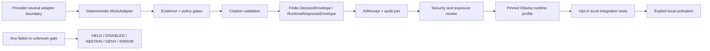

<!-- [KFM_META_BLOCK_V2]
doc_id: kfm://doc/runtime-ollama-readme
title: runtime/ollama/ — Governed Local Ollama Runtime Lane
type: readme; directory-readme; canonical-runtime-lane; provider-specific-local-runtime-boundary
version: v1.1
status: draft; canonical-lane-confirmed; scaffold-only; live-binding-deferred; NEEDS VERIFICATION
policy_label: public
owners: OWNER_TBD — Runtime steward · Governed-AI steward · API steward · Security steward · Policy steward · Evidence steward · Model-risk steward · Test steward · Operations steward · Docs steward
created: NEEDS VERIFICATION — greenfield stub was replaced by v0.1 on 2026-07-05
updated: 2026-07-15
current_path: runtime/ollama/README.md
canonical_adapter_lane: runtime/model_adapters/
truth_posture: CONFIRMED target README, runtime responsibility root, canonical Ollama runtime lane, canonical provider-neutral adapter lane, one-line OllamaAdapter placeholder, loopback Ollama environment example with mock as the selected default runtime, proposed Ollama ADR and integration architecture, advisory governed-API boundary grep, DecisionEnvelope contract and paired schema, AIReceipt and RuntimeResponseEnvelope contract/schema families, and adjacent local/mock/service-config/envelope lanes at the pinned evidence snapshot / PROPOSED ADR-0008 acceptance, ADR-0019 acceptance, Ollama integration sequencing, model-admission fields, runtime profile format, and operational gates / UNKNOWN installed Ollama daemon, Ollama version, available or approved models, executable Ollama adapter, service unit, live configuration, health checks, model digests, model rights, policy enforcement, evidence resolution, citation validation, receipt persistence, public-client enforcement, runtime logs, CI results, deployment, and release state / NEEDS VERIFICATION canonical governed request contract, accepted adapter semantic contract, model registry, provider admission review, security approval, fail-closed boundary tests, CODEOWNERS enforcement, correction propagation, and runtime-specific tests
evidence_snapshot:
  repository: bartytime4life/Kansas-Frontier-Matrix
  visibility: public
  base_ref: main
  base_commit: 617ebd26fa362dfe3eeb501a155beebfae663914
  prior_blob: 7746e4346fe41317830c39800b97867ac4ab6657
  prepared_under_prompt: KFM GitHub Repository Documentation Implementation Agent v3.1.0
related:
  - ../README.md
  - ../model_adapters/README.md
  - ../model_adapters/AdapterContract.md
  - ../model_adapters/OllamaAdapter.py
  - ../model_adapters/mock/README.md
  - ../mock/README.md
  - ../local/README.md
  - ../service_configs/README.md
  - ../envelopes/README.md
  - ../AI/README.md
  - ../../.env.example
  - ../../Makefile
  - ../../docs/adr/ADR-0008-ollama-subordinate-to-governed-api.md
  - ../../docs/adr/ADR-0019-ai-adapter-contract-and-finite-envelopes.md
  - ../../docs/architecture/governed-ai/OLLAMA_INTEGRATION.md
  - ../../docs/doctrine/directory-rules.md
  - ../../docs/registers/DRIFT_REGISTER.md
  - ../../contracts/runtime/decision_envelope.md
  - ../../contracts/runtime/ai_receipt.md
  - ../../contracts/runtime/runtime_response_envelope.md
  - ../../schemas/contracts/v1/runtime/decision_envelope.schema.json
  - ../../schemas/contracts/v1/runtime/ai_receipt.schema.json
  - ../../schemas/contracts/v1/runtime/runtime_response_envelope.schema.json
  - ../../fixtures/contracts/v1/runtime/README.md
  - ../../tests/schemas/test_common_contracts.py
  - ../../policy/runtime/README.md
tags: [kfm, runtime, ollama, local-model, canonical-lane, model-adapters, governed-api, loopback-only, mock-first, finite-outcomes, decision-envelope, ai-receipt, runtime-response-envelope, cite-or-abstain, no-direct-public-model]
notes:
  - "v1.1 applies the v3.1 repository-documentation implementation prompt and preserves the prior README's useful local-runtime guardrails."
  - "runtime/ollama is the confirmed provider-specific local runtime lane; provider-neutral adapter meaning remains under runtime/model_adapters."
  - "runtime/model_adapters/OllamaAdapter.py is confirmed as a one-line greenfield placeholder, not an executable adapter."
  - ".env.example selects mock by default and documents a loopback Ollama host; configuration presence does not activate Ollama."
  - "ADR-0008 and the Ollama integration architecture are draft/proposed and do not prove runtime deployment."
  - "This README does not install Ollama, pull a model, approve a model, activate a provider, grant network or tool access, establish policy, close evidence, validate citations, prove receipt persistence, expose a public endpoint, or publish KFM material."
[/KFM_META_BLOCK_V2] -->

<a id="top"></a>

# `runtime/ollama/` — Governed Local Ollama Runtime Lane

> **One-line purpose.** Define the provider-specific, local-only Ollama runtime boundary behind KFM's governed API while preserving provider-neutral adapters, evidence-first truth, finite outcomes, receipted execution, mock-first tests, deny-by-default exposure, and reversible deactivation.

<p>
  
  
  
  
  
  
</p>

> [!IMPORTANT]
> `runtime/ollama/` is the canonical **provider-specific local runtime lane** for Ollama-related wiring and operational handoff notes. It is not the provider-neutral adapter contract, not a model registry, not a model-weight store, not a public model endpoint, not an evidence or policy authority, and not a release path. Public and semi-public clients must use the governed API and finite response envelopes; they must never call Ollama directly.

## Quick navigation

[Status](#status-and-evidence-boundary) · [Purpose](#purpose-and-bounded-scope) · [Placement](#repository-fit-and-placement) · [Routing](#responsibility-routing) · [Authority](#authority-and-anti-collapse-rules) · [Inventory](#verified-repository-inventory) · [Sequencing](#mock-first-admission-sequencing) · [Runtime boundary](#provider-specific-runtime-boundary) · [Configuration](#configuration-and-environment-posture) · [Models](#model-profile-and-admission-posture) · [Flow](#governed-ollama-flow) · [Outcomes](#finite-runtime-outcomes) · [Evidence](#evidence-policy-citation-and-release-posture) · [Receipts](#receipts-reproducibility-and-observability) · [Security](#security-privacy-network-and-tool-boundary) · [Testing](#testing-validation-and-no-network-posture) · [Runtime profile](#minimal-ollama-runtime-profile) · [Activation](#activation-deactivation-and-kill-switch) · [Done](#definition-of-done) · [Maintenance](#maintenance-correction-and-rollback) · [Open](#open-verification-backlog) · [Evidence basis](#evidence-basis)

---

## Status and evidence boundary

| Surface | Status at the pinned snapshot | Consequence |
|---|---|---|
| `runtime/ollama/README.md` | **CONFIRMED** | Target README exists; prior blob is recorded in the metadata block. |
| `runtime/` | **CONFIRMED canonical root** | Owns local runtime wiring, provider-neutral adapters, provider-specific local runtimes, mocks, service configuration notes, and envelope helpers. |
| `runtime/ollama/` | **CONFIRMED canonical Ollama lane** | Directory Rules assign Ollama-specific local runtime wiring here. |
| `runtime/model_adapters/` | **CONFIRMED canonical adapter lane** | Owns provider-neutral adapter cards, handoffs, and mode-independent boundaries. |
| `runtime/model_adapters/OllamaAdapter.py` | **CONFIRMED one-line greenfield placeholder** | File presence does not prove an importable adapter, network client, model invocation, finite outcomes, tests, receipts, or policy enforcement. |
| `.env.example` | **CONFIRMED public template** | Sets `KFM_MODEL_RUNTIME=mock` and documents `OLLAMA_HOST=http://127.0.0.1:11434`; this is a safe-looking example, not activation or deployment proof. |
| `Makefile` governed-API verification | **CONFIRMED advisory check** | A grep checks for direct `maplibre`, `cesium`, or `ollama` imports under the governed API, but `|| true` means the grep is not fail-closed enforcement. |
| ADR-0008 | **CONFIRMED present; status proposed/draft** | Restates that Ollama and local AI runtimes remain subordinate to the governed API. It is not accepted implementation proof. |
| Ollama integration architecture | **CONFIRMED present; status PROPOSED** | Specifies mock-first sequencing and defers a live Ollama binding until contract, evidence, citation, receipt, and security gates pass. |
| ADR-0019 | **CONFIRMED present; status proposed/draft** | Proposes a provider-neutral adapter and finite envelopes; does not authorize a live runtime. |
| `DecisionEnvelope` contract and schema | **CONFIRMED present; status PROPOSED** | Finite runtime outcomes and policy-family context have a semantic contract and paired schema. |
| `AIReceipt` and `RuntimeResponseEnvelope` contract/schema families | **CONFIRMED present; status PROPOSED** | Accountability and governed-client response shapes exist; presence does not prove runtime use. |
| Direct Ollama imports or endpoint calls | **No implementation found in the scoped repository searches** | This is bounded search evidence, not proof of universal absence. Continue enforcing explicit boundary tests. |
| Ollama daemon, models, versions, adapter code, service configs, tests, receipts, logs, deployment | **UNKNOWN** | Documentation, placeholders, and environment examples are not operational proof. |

> [!WARNING]
> The prior README said no Ollama adapter file was confirmed. Current repository evidence confirms `runtime/model_adapters/OllamaAdapter.py`, but its entire content is a one-line greenfield placeholder. The correct maturity statement is therefore **CONFIRMED placeholder; executable implementation UNKNOWN**, not "file absent" and not "adapter implemented."

**Document authority:** provider-specific local-runtime lane guidance and index only. Directory Rules, accepted ADRs, canonical contracts, schemas, policy, EvidenceBundles, validators, tests, implementation code, receipts, runtime envelopes, security reviews, release records, correction records, and steward decisions outrank this README.

---

## Purpose and bounded scope

This lane answers six questions:

1. **Where do Ollama-specific runtime details belong?**
2. **How does Ollama remain behind the provider-neutral adapter boundary?**
3. **What must be true before a local Ollama binding can be activated?**
4. **Which evidence, policy, citation, receipt, security, and release controls remain outside the model?**
5. **How are local configuration, model identity, resource limits, and network exposure recorded without storing secrets or weights?**
6. **How can Ollama be disabled or rolled back without changing public contracts?**

This README covers:

- Ollama-specific local runtime wiring and handoff documentation;
- loopback-only and deny-by-default exposure posture;
- provider-neutral adapter integration;
- mock-first admission sequencing;
- model-profile and runtime-profile documentation;
- non-secret configuration pointers;
- finite outcomes and governed envelope handoffs;
- evidence, policy, citation, freshness, correction, and release constraints;
- receipts, model identity, digests, reproducibility, observability, and safe diagnostics;
- resource limits, timeouts, retries, circuit breaking, and fail-safe deactivation;
- no-network default tests and opt-in local integration tests;
- rollback, supersession, and kill-switch expectations.

This README does **not**:

- define canonical adapter semantics or request DTOs;
- define JSON Schema;
- approve an Ollama version, model, quantization, license, or model use case;
- install the Ollama daemon or pull models;
- store model binaries, weights, manifests, caches, or private paths;
- establish runtime policy or evidence admissibility;
- authorize public API, UI, map, or Focus Mode access;
- prove receipt persistence, citation validation, security review, or release readiness;
- define provider pricing, availability, or fitness;
- make generated text into evidence, policy, review, correction, release, or publication authority.

---

## Repository fit and placement

Directory Rules assign local runtime wiring to `runtime/` and distinguish provider-neutral adapters from provider-specific local runtimes.

```text
runtime/
├── README.md
├── ollama/                    # this file; provider-specific local Ollama runtime lane
│   └── README.md
├── model_adapters/            # canonical provider-neutral adapter lane
│   ├── README.md
│   ├── AdapterContract.md     # descriptive note; not canonical contract authority
│   ├── OllamaAdapter.py       # confirmed one-line placeholder
│   └── mock/                  # mock-only model-adapter child lane
├── mock/                      # broader deterministic mock-runtime lane
├── local/                     # general local runtime wiring
├── service_configs/           # non-secret runtime configuration templates
├── envelopes/                 # finite-outcome envelope helpers
└── AI/                        # governed-AI compatibility/index lane

contracts/runtime/             # semantic runtime-object meaning
schemas/contracts/v1/runtime/  # machine-checkable runtime shapes
policy/runtime/                # runtime admissibility and obligations
fixtures/contracts/v1/runtime/ # valid and invalid contract fixtures
tests/                         # executable proof
tools/validators/              # validator implementation
data/receipts/                 # receipt instances, subject to accepted data layout
release/                       # release, correction, withdrawal, and rollback authority
```

### Placement determination

| Question | Determination |
|---|---|
| Is `runtime/` the correct responsibility root? | **CONFIRMED.** |
| Is `runtime/ollama/` the correct Ollama-specific lane? | **CONFIRMED by Directory Rules.** |
| Is `runtime/model_adapters/` the provider-neutral adapter lane? | **CONFIRMED.** |
| Should the provider-neutral Ollama adapter implementation live under `runtime/ollama/`? | **No by default.** Provider-neutral interface and adapter-card meaning remain under `runtime/model_adapters/`; provider-specific daemon/config/runtime notes belong here. |
| Does `OllamaAdapter.py` prove implementation? | **No.** It is a one-line placeholder. |
| Does `.env.example` activate Ollama? | **No.** It selects `mock` and provides a loopback example. |
| Does this README authorize a public endpoint? | **No.** Direct public model traffic remains denied. |
| Does this update create a new authority root or require a root ADR? | **No.** |
| Would moving code or changing authority require more review? | **Yes.** Inventory, inbound-link analysis, an ADR or migration note when authority changes, tests, and reversible rollback would be required. |

---

## Responsibility routing

| Work item | Correct home | Role of `runtime/ollama/` |
|---|---|---|
| Provider-neutral adapter card and interface handoff | [`runtime/model_adapters/`](../model_adapters/) | Link the canonical adapter record; do not redefine it. |
| Descriptive adapter boundary note | [`runtime/model_adapters/AdapterContract.md`](../model_adapters/AdapterContract.md) | Link and preserve its non-canonical status. |
| Ollama-specific daemon, local binding, runtime behavior, or provider quirks | `runtime/ollama/` | Canonical documentation lane. |
| Ollama adapter implementation | Accepted implementation path under the provider-neutral adapter responsibility, subject to current code architecture | Do not move the placeholder in this README-only change. |
| Deterministic mock behavior | [`runtime/model_adapters/mock/`](../model_adapters/mock/) and [`runtime/mock/`](../mock/) | Use before any live binding. |
| General local harness wiring | [`runtime/local/`](../local/) | Link when Ollama participates in a broader local harness. |
| Non-secret service configuration template | [`runtime/service_configs/`](../service_configs/) or accepted `configs/` lane | Link; do not duplicate templates or secrets here. |
| Finite response-envelope helper | [`runtime/envelopes/`](../envelopes/) | Link implementation notes; do not redefine envelope meaning. |
| Governed-AI navigation | [`runtime/AI/`](../AI/) | Cross-link only. |
| Semantic contract meaning | [`contracts/runtime/`](../../contracts/runtime/) | Contract authority. |
| Machine-checkable shape | [`schemas/contracts/v1/runtime/`](../../schemas/contracts/v1/runtime/) | Schema authority. |
| Runtime allow/deny/restrict/abstain rules | [`policy/runtime/`](../../policy/runtime/) or accepted policy family | Policy authority. |
| Valid and invalid examples | [`fixtures/contracts/v1/runtime/`](../../fixtures/contracts/v1/runtime/) | Fixture authority. |
| Executable tests | `tests/` or accepted package/app test root | Report actual results; do not imply coverage here. |
| Validator implementation | `tools/validators/` | Link only after path and wiring are verified. |
| Model weights and caches | Local Ollama storage or approved external artifact storage | Never commit to this repository. |
| Secrets and production/private configuration | Secret manager or local ignored configuration | Never commit. |
| Receipt instance | Accepted receipt root | Link by stable reference; do not copy payloads here. |
| EvidenceBundle or proof | Accepted evidence/proof roots | Resolve through governed references. |
| Release, correction, withdrawal, rollback | `release/` | Never decide or store authority here. |

---

## Authority and anti-collapse rules

The Ollama lane must preserve the following separations.

### Local runtime is not trusted runtime

Running locally may reduce some external-provider exposure, but it does not establish:

- source authority;
- evidence sufficiency;
- rights or sensitivity clearance;
- policy permission;
- citation validity;
- model fitness;
- response correctness;
- release approval;
- public safety;
- reproducibility;
- receipt completeness.

### Runtime is not adapter authority

Ollama-specific request/response fields, daemon options, model tags, and transport details must not leak into the public contract. The provider-neutral adapter boundary should absorb provider differences.

### Adapter output is not evidence

Model output may be a bounded interpretation candidate. It must not:

- become an `EvidenceBundle`;
- replace source records;
- promote lifecycle data;
- approve a claim;
- resolve rights or sensitivity;
- determine review state;
- determine release state;
- publish map, API, UI, export, or story content.

### Configuration is not policy

Environment variables and service templates may select a runtime mode or endpoint. They must not silently encode authority decisions, bypass policy, or convert a disabled provider into an approved provider.

### Receipts are not private reasoning

Receipts may preserve hashes, model identity, adapter identity, timing, outcome, evidence references, policy references, and validation references. They must not store private chain-of-thought, hidden prompts, raw credentials, unrestricted source payloads, or provider debug dumps as proof.

### Public clients never become model clients

Browser, mobile, embed, map, story, export, review, and external client surfaces must call governed interfaces. They must not hold model credentials, import a direct Ollama client, call port `11434`, or render raw model output.

---

## Verified repository inventory

The current repository exposes a mixed documentation-and-scaffold state.

| Path or surface | Verified content | Maturity consequence |
|---|---|---|
| `runtime/ollama/README.md` | Existing v0.1 local-runtime guardrail | Documentation surface exists. |
| `runtime/model_adapters/OllamaAdapter.py` | One comment line: local model runtime, subordinate, greenfield placeholder | **Scaffold only.** No executable adapter is established. |
| `.env.example` | `KFM_MODEL_RUNTIME=mock`; `OLLAMA_HOST=http://127.0.0.1:11434` | Safe-looking local example; default mode is mock. No live runtime proof. |
| `Makefile` | Governed-API verification includes grep for direct `ollama` imports | Boundary intent is visible, but `|| true` prevents fail-closed enforcement. |
| `docs/adr/ADR-0008-ollama-subordinate-to-governed-api.md` | Proposed ADR; local runtimes behind governed API, finite outcomes, no direct public path | Strong design evidence; acceptance and implementation remain unverified. |
| `docs/architecture/governed-ai/OLLAMA_INTEGRATION.md` | Proposed integration architecture; mock-first, live binding deferred | Sequencing guidance; not deployment proof. |
| `docs/adr/ADR-0019-ai-adapter-contract-and-finite-envelopes.md` | Proposed provider-neutral adapter and finite public envelope | Contract direction; not accepted provider activation. |
| `runtime/model_adapters/README.md` | Canonical provider-neutral adapter lane | Ollama-specific runtime must conform to that boundary. |
| `runtime/service_configs/README.md` | README-only non-secret configuration lane | No Ollama service template was verified there in this pass. |
| `runtime/local/README.md` | General local runtime wiring lane | Ollama-specific notes stay here only when broader harness context is needed. |

### Current maturity statement

**CONFIRMED:**

- the canonical responsibility lanes exist;
- the Ollama README exists;
- a placeholder adapter file exists;
- a public environment template defaults to mock and names a loopback host;
- proposed architecture and ADR documents exist;
- finite runtime contract/schema families exist.

**UNKNOWN or NEEDS VERIFICATION:**

- an installed Ollama daemon;
- an importable and conforming Ollama adapter;
- installed or approved model tags;
- exact model digests;
- accepted model licenses and use restrictions;
- local service configuration;
- health and readiness checks;
- resource budgets;
- runtime tests;
- boundary-test enforcement;
- policy evaluation;
- evidence and citation integration;
- receipts and observability;
- security review;
- deployment and release state.

---

## Mock-first admission sequencing

Ollama must not be the first proof of the adapter boundary.



### Sequencing posture at the pinned snapshot

| Gate | Evidence state | Required posture |
|---|---|---|
| Provider-neutral adapter documentation | **CONFIRMED documentation** | Implementation and accepted semantic contract still need verification. |
| Deterministic mock lane | **CONFIRMED documentation surface** | Executable mock implementation and coverage remain UNKNOWN. |
| Evidence/policy/citation gates | **Doctrine and documentation confirmed** | Runtime wiring and tests remain UNKNOWN. |
| Finite envelopes | **Contract/schema families confirmed; status PROPOSED** | Runtime emission remains UNKNOWN. |
| AIReceipt | **Contract/schema family confirmed; status PROPOSED** | Persistence and joining remain UNKNOWN. |
| Security review | **NEEDS VERIFICATION** | Live binding remains held. |
| Ollama adapter | **CONFIRMED placeholder only** | Live binding remains held. |
| Approved model profile | **UNKNOWN** | No model is approved by this README. |
| Local integration tests | **UNKNOWN** | No successful run is claimed. |
| Activation | **NOT AUTHORIZED by documentation** | Default remains mock or another explicitly governed non-live posture. |

> [!CAUTION]
> The presence of an Ollama daemon on a developer machine, a successful `curl`, or a model response is not sufficient admission evidence. The provider-neutral boundary, negative cases, policy/evidence/citation gates, receipts, security review, and reversible deactivation must be demonstrable.

---

## Provider-specific runtime boundary

Ollama is an internal implementation detail behind the provider-neutral adapter lane.

### Input posture

A local Ollama binding may receive only a bounded adapter request assembled by a governed caller after applicable checks.

The request should include only what the adapter needs, such as:

- traceable request or run identity;
- bounded task type;
- release-scoped and policy-safe context;
- resolved evidence references or approved deterministic fixtures;
- explicit citation requirements;
- approved tool and network permissions;
- model profile reference;
- time, token, and resource limits;
- receipt/audit context.

The request must not include as normal input:

- direct RAW, WORK, QUARANTINE, or canonical-store dumps;
- unrestricted internal documents;
- unresolved sensitive coordinates;
- credentials or secret-bearing configuration;
- hidden policy bypass flags;
- browser-supplied system instructions;
- private chain-of-thought;
- arbitrary tool or filesystem authority.

### Output posture

Ollama may return a provider-specific candidate response to the adapter implementation. That internal response must be normalized before any governed caller or public client uses it.

Normalization must preserve:

- finite outcome mapping;
- safe reason codes;
- citations or evidence references where required;
- policy and obligation references;
- model and adapter identity;
- truncation, timeout, and error state;
- receipt linkage;
- freshness and correction posture where material;
- safe diagnostics without private reasoning.

Raw Ollama response objects, provider debug traces, and unrestricted generated text must not become the public KFM response contract.

### Provider-neutrality test

A governed caller should be able to replace Ollama with a deterministic mock or another admitted provider without changing:

- the public request route;
- the public outcome vocabulary;
- evidence and policy semantics;
- citation requirements;
- receipt families;
- release behavior;
- correction and rollback behavior.

---

## Configuration and environment posture

### Verified public example

The repository-level `.env.example` currently documents:

```dotenv
KFM_MODEL_RUNTIME=mock
OLLAMA_HOST=http://127.0.0.1:11434
```

Interpretation:

- `KFM_MODEL_RUNTIME=mock` is the visible default runtime selection in the example.
- `OLLAMA_HOST` points to loopback.
- Neither line proves that Ollama is installed, running, admitted, or used.
- A configuration value enables connection details; it does not grant policy or release authority.

### Configuration rules

- Keep real `.env` files, credentials, tokens, private URLs, machine paths, and secrets out of Git.
- Prefer `127.0.0.1` or another explicitly reviewed private binding.
- Do not use `0.0.0.0`, public DNS, public reverse proxy, browser-visible endpoint variables, or CDN-style exposure without a separately approved architecture and security change.
- Store reusable non-secret service templates under the accepted configuration responsibility lane.
- Record timeout, concurrency, context-window, token, memory, CPU/GPU, queue, and retry classes explicitly.
- Do not auto-pull or auto-upgrade models as a side effect of serving a governed request.
- Do not let environment variables silently bypass evidence, policy, citation, receipt, or release gates.
- Treat configuration drift as reviewable operational state.
- Redact endpoint details from public diagnostics when they reveal protected infrastructure.

### Suggested configuration categories

These categories are **PROPOSED documentation fields**, not accepted environment-variable names:

| Category | Examples of values to record |
|---|---|
| Runtime mode | mock, local-ollama, disabled |
| Host posture | loopback-only, private allowlist, disabled |
| Model profile | stable profile ID, exact local model reference |
| Resource budget | maximum context, output tokens, memory, concurrency |
| Reliability | connect timeout, read timeout, retry count, circuit-breaker state |
| Network | no outbound tools by default; explicit allowlist if reviewed |
| Logging | safe metadata only; no prompt or protected context by default |
| Receipt | required receipt family and persistence target |
| Kill switch | explicit disable path and expected finite outcome |

---

## Model profile and admission posture

No Ollama model is approved by this README.

Before a model profile advances beyond scaffold or held status, record and review:

| Field | Requirement |
|---|---|
| Profile ID | Stable, non-secret identifier. |
| Runtime family | Ollama local runtime. |
| Exact model reference | Exact tag or immutable digest where Ollama supports it. |
| Model artifact digest | Record when available; do not commit the model artifact. |
| Quantization/build | Record exact variant when it can affect behavior. |
| License and usage rights | Verify redistribution, commercial, research, and derivative-use posture. |
| Source and acquisition | Document approved acquisition channel and date. |
| Model size and resource needs | CPU/GPU, RAM/VRAM, disk, context, concurrency. |
| Approved tasks | Narrow task list; no open-ended authority. |
| Prohibited tasks | Sensitive, unsupported, policy-restricted, or high-risk uses. |
| Context and output limits | Explicit bounded values. |
| Sampling posture | Temperature, seed support, deterministic constraints, and variability notes. |
| Tool/network posture | Disabled by default unless explicitly reviewed. |
| Data handling | What context may be sent; what must never be sent. |
| Evaluation evidence | Fixtures, negative cases, benchmark notes, and reviewer sign-off. |
| Security review | Prompt injection, model file provenance, exposure, logging, and denial behavior. |
| Receipt posture | Model and adapter references, hashes, outcomes, validation links. |
| Supersession | Replacement profile and migration date. |
| Deactivation | Kill-switch and rollback instructions. |

### Model changes are behavioral changes

Changing any of the following should trigger review and revalidation:

- model tag or digest;
- quantization;
- Ollama version;
- context window;
- system prompt or prompt template;
- sampling parameters;
- tool availability;
- network availability;
- evidence-context assembler;
- citation validator;
- timeout/retry behavior;
- adapter mapping;
- finite-outcome mapping.

Do not treat a model update as an invisible local convenience change when its outputs influence governed responses.

---

## Governed Ollama flow

```mermaid
sequenceDiagram
    participant Client as Public or semi-public client
    participant API as Governed API
    participant Evidence as Evidence resolver
    participant Policy as Policy checks
    participant Adapter as Provider-neutral adapter
    participant Ollama as Local Ollama binding
    participant Daemon as Ollama daemon
    participant Citation as Citation validator
    participant Receipt as Receipt/audit join

    Client->>API: Governed request
    API->>Evidence: Resolve allowed EvidenceRefs
    Evidence-->>API: Policy-safe EvidenceBundles or support gap
    API->>Policy: Precheck scope, access, rights, sensitivity, release
    Policy-->>API: Allow, restrict, abstain, or deny

    alt Ollama is explicitly admitted and request is allowed
        API->>Adapter: Bounded adapter request
        Adapter->>Ollama: Provider-neutral call mapped to Ollama
        Ollama->>Daemon: Loopback/private invocation
        Daemon-->>Ollama: Candidate output or provider error
        Ollama-->>Adapter: Normalized candidate + runtime metadata
        Adapter->>Citation: Validate support when required
        Citation-->>Adapter: Citation result
        Adapter->>Receipt: Join model, adapter, inputs/outputs digests, policy, validation, outcome
        Adapter-->>API: Finite governed envelope
    else Gate fails, runtime disabled, or support insufficient
        API->>Receipt: Record safe finite outcome when required
        API-->>Client: ABSTAIN, DENY, or ERROR
    end

    API-->>Client: RuntimeResponseEnvelope; never raw Ollama response
```

### Flow invariants

1. Public clients do not know the Ollama endpoint.
2. The governed API resolves evidence and policy before model invocation.
3. The adapter receives bounded, policy-safe context.
4. Ollama does not read canonical or lifecycle stores directly.
5. Candidate output is validated and normalized.
6. The public response uses a finite envelope.
7. Receipts preserve traceability without private reasoning.
8. Release and publication remain separate governed transitions.

---

## Finite runtime outcomes

The public or governed caller must receive a finite outcome, not raw free text as the only result.

| Outcome | Use when | Ollama-specific examples | Required posture |
|---|---|---|---|
| `ANSWER` | Scope, evidence, policy, citation, runtime, and model-profile gates pass. | Local model returns a bounded candidate and validation succeeds. | Include support, obligations, adapter/model refs, and receipt/envelope posture. |
| `ABSTAIN` | Evidence, citation, freshness, model fitness, context, or support is insufficient. | Context would exceed safe limits; citations do not resolve; model profile is not approved for the task. | Explain the support gap safely; do not invent an answer or silently switch to ungoverned text. |
| `DENY` | Policy, rights, sensitivity, access, release, or security posture forbids the request. | Protected location exposure; prohibited data; public client attempts direct runtime access. | Return safe reason codes without leaking protected content or infrastructure. |
| `ERROR` | Adapter, daemon, timeout, model load, configuration, schema, citation, receipt, or dependency failure prevents completion. | Ollama unavailable; model missing; response malformed; circuit open. | Return safe diagnostics and preserve audit linkage where possible. |

`ABSTAIN`, `DENY`, and `ERROR` are first-class results. They must not be hidden behind empty text, generic success, silent retry loops, or provider-specific exception strings.

---

## Evidence, policy, citation, and release posture

### Evidence

- `EvidenceBundle` outranks generated language.
- Evidence references should resolve before model invocation when the task depends on evidence.
- Missing, stale, withdrawn, corrected, restricted, or unresolved support should narrow scope or produce a finite negative outcome.
- Ollama must not browse lifecycle roots or canonical stores directly.
- Source content is data, not instruction. Prompt-like text inside evidence must not gain system authority.

### Policy

- Policy prechecks and postchecks remain outside the model.
- Model fluency cannot override access, rights, sensitivity, consent, source role, release, or correction posture.
- Hidden configuration must not become a policy bypass.
- Sensitive domains should fail closed when rules or model fitness are unclear.

### Citation

- Answer-like output that depends on evidence should cite or abstain.
- Citations must resolve to governed support, not fabricated identifiers or raw URLs generated by the model.
- Citation validation failure must not be converted into `ANSWER`.
- The model may propose citations; a validator or governed resolver decides whether they are usable.

### Release

- Ollama output is not publication.
- A response envelope is not a release manifest.
- A successful local run does not authorize map, API, UI, export, story, or public knowledge publication.
- Correction, withdrawal, and rollback state must be preserved when relevant to the answer.

---

## Receipts, reproducibility, and observability

Every material Ollama-backed invocation should emit or join the accepted runtime receipt family when required by policy or architecture.

### Minimum traceability intent

Record enough to reconstruct the governed path without storing private reasoning:

- request or run identity;
- adapter identity and version;
- Ollama runtime identity and version, when available;
- model profile and exact model reference;
- model artifact digest, when available;
- input/context digest;
- output digest;
- evidence references or evidence-bundle references;
- policy decision reference;
- citation-validation reference;
- finite outcome;
- timing, timeout, retry, truncation, and circuit state;
- safe error classification;
- response-envelope reference;
- correction or supersession linkage when applicable.

### Proposed Ollama-specific reproducibility fields

The following are useful but remain **PROPOSED** until accepted contracts or receipt extensions define them:

- context-window setting;
- output token limit;
- temperature and sampling values;
- seed, when supported and meaningful;
- model quantization/build;
- prompt-template or system-instruction digest;
- Ollama daemon version;
- local model manifest digest;
- hardware class;
- deterministic/non-deterministic flag.

### What not to record

Do not persist as proof or public diagnostics:

- private chain-of-thought;
- unrestricted raw prompts;
- protected evidence payloads;
- secrets or credentials;
- full provider debug dumps;
- sensitive filesystem paths;
- raw model binaries;
- precise protected locations;
- browser-supplied hidden instructions.

### Observability

Operational metrics should prefer bounded, aggregate, non-sensitive signals:

- calls by adapter/model profile;
- finite outcomes;
- latency and timeout classes;
- model-load failures;
- citation-validation result classes;
- policy deny/abstain classes;
- receipt-write failures;
- circuit-breaker state;
- resource-pressure events.

Observability must not become a second evidence, policy, or publication surface.

---

## Security, privacy, network, and tool boundary

### Network exposure

- Bind to loopback by default.
- Do not expose Ollama through public reverse proxy, ingress, firewall rule, CDN, browser-accessible URL, or public DNS.
- Do not place `OLLAMA_HOST` or port `11434` in browser bundles or public runtime configuration.
- Keep direct developer access outside normal public and reviewer workflows.
- Document any private/VPN access route and its owner.
- Default outbound network access and model tools to disabled.
- Require explicit allowlists for any network or tool capability.
- Do not permit arbitrary filesystem, shell, database, or canonical-store access.

### Secrets and model artifacts

- Do not commit `.env`, credentials, private URLs, tokens, signing keys, or machine-specific paths.
- Do not commit model weights, Ollama blobs, caches, or large manifests.
- Verify model provenance and rights before use.
- Treat model files as supply-chain inputs requiring review.
- Scan logs and receipts for accidental prompt, evidence, secret, and path leakage.

### Prompt injection

- Treat retrieved source content, user content, metadata, citations, HTML, Markdown, and documents as untrusted data.
- System and policy instructions must come from governed code/configuration, not retrieved content.
- Do not let a model grant itself more tools, network access, data scope, or output authority.
- Preserve deny/abstain behavior when instructions conflict.

### Reliability and abuse controls

- Bound request size, context size, output tokens, concurrency, queue depth, and execution time.
- Use explicit connect and read timeouts.
- Keep retries bounded and idempotent where possible.
- Use circuit breaking for repeated runtime failures.
- Reject unknown model profiles and unapproved configuration.
- Avoid silent fallback to a different model or provider.
- Rate-limit governed entry points rather than exposing the daemon.
- Return safe diagnostics without internal host, path, prompt, or model-file leakage.

---

## Testing, validation, and no-network posture

Default repository tests should not require a running Ollama daemon or network access.

### Required proof families before activation

| Proof family | Minimum expectation |
|---|---|
| Adapter contract | Same bounded provider-neutral input/output semantics as mock mode. |
| Mock-first behavior | Deterministic `ANSWER`, `ABSTAIN`, `DENY`, and `ERROR` cases. |
| Configuration | Loopback-only default, explicit runtime selection, no secrets, fail-safe missing config. |
| Model profile | Exact identity, rights, resource limits, approved tasks, prohibited tasks. |
| Evidence | Resolved support only; missing/stale/withdrawn/corrected cases. |
| Policy | Allow, restrict, deny, consent, sensitivity, and access cases as applicable. |
| Citation | Valid, invalid, missing, fabricated, stale, and restricted citation cases. |
| Envelope | DecisionEnvelope and RuntimeResponseEnvelope validation. |
| Receipt | Required references, digests, finite outcome, safe non-retention. |
| Security | Direct-client denial, endpoint non-exposure, prompt injection, tool/network denial. |
| Reliability | Timeout, unavailable daemon, missing model, malformed response, truncation, circuit open. |
| Rollback | Disable Ollama and return to mock/null/finite negative outcome without public-contract change. |

### Negative cases

At minimum, tests should cover:

- Ollama is not installed;
- daemon is unavailable;
- model is absent;
- model profile is unknown or held;
- endpoint is non-loopback without approval;
- configuration contains forbidden public exposure;
- request exceeds context or resource limits;
- response is malformed or unparseable;
- response lacks required support;
- citation validation fails;
- policy denies;
- evidence is missing, stale, corrected, withdrawn, or restricted;
- receipt persistence fails;
- timeout or circuit breaker opens;
- prompt injection attempts to override policy or tools;
- a public client attempts direct model access;
- a runtime error cannot silently become `ANSWER`.

### Grounded repository checks

The following commands are grounded in current repository surfaces, but they were **not run for this README-only API edit**:

```bash
python -m pytest -q tests/schemas/test_common_contracts.py
make boundary-guards
make governed-api-smoke
make governed-api-verify
git grep -nE 'OLLAMA_HOST|11434|OllamaAdapter|import ollama|from ollama' -- \
  . ':!docs/**' ':!runtime/ollama/README.md'
```

Important limitations:

- `make governed-api-verify` currently uses an import grep followed by `|| true`; it is advisory, not fail-closed.
- Search results do not prove absence across generated artifacts, ignored files, deployments, or developer machines.
- A live Ollama integration test should be opt-in, local-only, separately marked, and never required for deterministic default CI unless the CI environment is explicitly governed.

### Acceptance evidence

Do not mark Ollama active from prose alone. Require:

- test command;
- test commit;
- fixture or test IDs;
- model profile;
- configuration profile;
- security review;
- reviewer;
- date;
- result;
- receipt or artifact references;
- rollback target.

---

## Minimal Ollama runtime profile

Use a profile or note like the following only after its identity and placement conventions are accepted.

```markdown
# <ollama-runtime-profile-id>

## Status
DRAFT / SCAFFOLD_ONLY / MOCK_BLOCKED / SECURITY_REVIEW_REQUIRED / LOCAL_VALIDATION / LOCAL_APPROVED / HELD / DISABLED / SUPERSEDED / RETIRED

## Runtime
- Family: Ollama
- Mode: local-ollama
- Ollama version: <exact version or NEEDS VERIFICATION>
- Host posture: loopback-only / private-allowlist / disabled
- Endpoint: <non-secret local reference or N/A>

## Model profile
- Profile ID: <stable id>
- Exact model reference: <tag or immutable digest>
- Artifact digest: <digest or NEEDS VERIFICATION>
- Quantization/build: <value or N/A>
- License and rights: <review reference or NEEDS VERIFICATION>
- Approved tasks: <narrow list>
- Prohibited tasks: <list>

## Resource limits
- Context window: <bounded value>
- Output limit: <bounded value>
- Concurrency: <bounded value>
- Memory/VRAM budget: <value or N/A>
- Connect timeout: <value>
- Read timeout: <value>
- Retries: <bounded value>
- Circuit breaker: <policy or N/A>

## Adapter boundary
- Provider-neutral adapter card: <runtime/model_adapters path>
- Descriptive adapter note: <path or N/A>
- Governed request contract: <path or UNKNOWN>
- DecisionEnvelope: <path>
- RuntimeResponseEnvelope: <path>

## Governed support
- Evidence scope: <released, policy-safe support or fixture>
- Policy: <path or decision ref>
- Citation validation: <path or report ref>
- AIReceipt: <path or family>
- Fixture: <path or N/A>
- Tests: <paths and results>
- Validators: <paths and results>

## Network and tools
- Public exposure: none
- Outbound network: disabled / allowlist
- Tools: disabled / explicit allowlist
- Filesystem access: none / bounded
- Canonical-store access: none

## Security and privacy
- Secret handling: <external mechanism; no secret values>
- Prompt retention: <safe policy>
- Protected-data handling: <policy>
- Injection controls: <tests and review>
- Security review: <review ref or NEEDS VERIFICATION>

## Activation
- Activation owner: <steward>
- Activation date: <YYYY-MM-DD or N/A>
- Kill switch: <documented action>
- Fallback: mock / null / finite negative outcome
- Rollback target: <profile, commit, or config ref>

## Review
- Reviewer: <steward or maintainer>
- Review date: <YYYY-MM-DD>
- Open blockers: <items or none>
```

This profile is documentation, not a substitute for implementation, tests, policy, security review, receipts, or release evidence.

---

## Activation, deactivation, and kill switch

### Activation conditions

Ollama may move from scaffold/held to an explicitly approved local mode only when:

- the provider-neutral adapter boundary is implemented and tested;
- deterministic mock tests pass;
- the selected model profile is reviewed;
- configuration is loopback/private and non-secret;
- evidence, policy, citation, envelope, and receipt integration is demonstrated;
- negative cases pass;
- security review approves exposure and tool/network posture;
- owners and rollback targets are recorded;
- activation is explicit, reviewable, and reversible.

Configuration alone must not activate the runtime.

### Safe default

The repository's current `.env.example` selects `mock`. Preserve a safe default until a separately reviewed change authorizes another mode.

### Kill switch behavior

A kill switch should:

1. stop new Ollama calls;
2. preserve the public contract;
3. return `ABSTAIN`, `DENY`, or `ERROR` as appropriate;
4. optionally route to an admitted deterministic mock or null adapter only when the caller expects test behavior;
5. preserve receipts and safe diagnostics;
6. avoid data loss or lifecycle writes;
7. avoid silent provider substitution;
8. remain auditable and reversible.

### Deactivation triggers

Deactivate or hold the runtime when:

- model identity changes unexpectedly;
- digest or license posture is unknown;
- security posture changes;
- endpoint exposure is detected;
- evidence/policy/citation gates fail open;
- receipt persistence fails where required;
- model output bypasses finite envelopes;
- tests regress;
- correction or release state cannot propagate;
- resource exhaustion threatens availability;
- logs expose protected content;
- rollback cannot be demonstrated.

---

## Definition of done

An Ollama local-runtime slice is not done until all applicable items are evidenced.

### Placement and ownership

- [ ] `runtime/ollama/` remains the provider-specific local runtime lane.
- [ ] Provider-neutral adapter records remain under `runtime/model_adapters/`.
- [ ] Owners and reviewers are confirmed.
- [ ] No parallel root or duplicate contract/schema/policy authority is created.

### Adapter and contracts

- [ ] `OllamaAdapter.py` is more than a placeholder and conforms to the accepted provider-neutral boundary.
- [ ] Governed request semantics are accepted or explicitly compatibility-bounded.
- [ ] DecisionEnvelope and RuntimeResponseEnvelope mappings are tested.
- [ ] Provider-specific response shape does not leak to public clients.

### Evidence and policy

- [ ] Inputs are release-scoped and policy-safe.
- [ ] No direct RAW, WORK, QUARANTINE, canonical-store, or internal-store access exists.
- [ ] Cite-or-abstain behavior is tested.
- [ ] Rights, sensitivity, consent, stale, corrected, withdrawn, and restricted cases are handled.

### Model and configuration

- [ ] Exact Ollama and model identities are pinned.
- [ ] Model rights and approved tasks are reviewed.
- [ ] Resource limits are bounded.
- [ ] Loopback/private binding is verified.
- [ ] No secrets, private config, weights, or caches are committed.
- [ ] No automatic model pull or upgrade occurs on governed requests.

### Testing and security

- [ ] Mock-first tests pass without network.
- [ ] Opt-in local integration tests pass.
- [ ] Negative cases pass.
- [ ] Direct public/browser model traffic is denied by fail-closed tests.
- [ ] Prompt-injection, tool, filesystem, and network boundaries are tested.
- [ ] Timeouts, retries, truncation, and circuit breaking are tested.
- [ ] Security review is recorded.

### Receipts and operations

- [ ] AIReceipt or accepted runtime receipt linkage is demonstrated.
- [ ] Model, adapter, inputs, outputs, policy, citation, and outcome are traceable.
- [ ] Safe logs and metrics exist without protected payloads or private reasoning.
- [ ] Health/readiness checks are local and governed.
- [ ] Kill switch and rollback are demonstrated.

### Public and release boundaries

- [ ] Public clients receive only governed finite envelopes.
- [ ] Generated text is not treated as evidence or release authority.
- [ ] Correction and withdrawal state propagate.
- [ ] No release or publication action is implied by runtime success.

---

## Maintenance, correction, and rollback

### Maintenance triggers

Review this README when any of the following changes:

- Directory Rules or runtime responsibility placement;
- ADR-0008 or ADR-0019 status;
- Ollama integration architecture;
- provider-neutral adapter contract;
- `OllamaAdapter.py`;
- `.env.example` runtime defaults;
- service configuration;
- model profile or model digest;
- Ollama version;
- finite envelope contracts or schemas;
- AIReceipt contract or schema;
- policy/runtime;
- evidence or citation resolver;
- boundary tests;
- security/exposure posture;
- deployment topology;
- correction or release behavior.

### Correction

When this README conflicts with implementation:

1. identify the exact file, contract, schema, policy, test, log, or artifact;
2. mark the conflicting statement `CONFLICTED` or `NEEDS VERIFICATION`;
3. do not hide the conflict with generic prose;
4. correct this README or the owning implementation in a scoped review;
5. update related ADRs, integration docs, and runtime indexes when behavior changes;
6. preserve supersession and correction lineage.

### Documentation rollback

For this README-only change:

- before merge, leave the draft PR unmerged or restore the prior blob in a transparent follow-up commit;
- after merge, use a revert commit or revert PR;
- do not reset or rewrite shared history;
- preserve the prior blob and implementation commit in the handoff.

### Runtime rollback

For a future live Ollama binding:

- disable the Ollama runtime selection;
- restore an admitted mock/null/finite-negative posture;
- stop or isolate the local service as required;
- preserve public request and response contracts;
- emit safe finite outcomes;
- retain receipt, incident, correction, and rollback references;
- verify that no public client can still reach the daemon;
- record the model profile and configuration that were withdrawn.

---

## Open verification backlog

### Repository and ownership

- [ ] Confirm CODEOWNERS for `runtime/ollama/`.
- [ ] Confirm child inventory below `runtime/ollama/`.
- [ ] Confirm the intended implementation home for provider-specific adapter code.
- [ ] Confirm whether the placeholder `runtime/model_adapters/OllamaAdapter.py` follows the accepted language/package layout.
- [ ] Confirm whether `runtime/README.md` should index this v1.1 boundary explicitly.

### ADRs and architecture

- [ ] Confirm acceptance state of ADR-0008.
- [ ] Confirm acceptance state and numbering of ADR-0019.
- [ ] Reconcile proposed integration paths with current repository evidence.
- [ ] Confirm mock-first sequencing as an enforced gate rather than documentation only.
- [ ] Confirm the accepted governed request object; `FocusRequest` remains unresolved at canonical-looking paths.

### Runtime and models

- [ ] Confirm whether Ollama is installed in any governed development environment.
- [ ] Confirm approved Ollama version range.
- [ ] Confirm approved model profiles, exact references, digests, quantizations, and licenses.
- [ ] Confirm model storage, provenance, scanning, and update controls.
- [ ] Confirm CPU/GPU, RAM/VRAM, context, token, concurrency, and timeout budgets.
- [ ] Confirm health/readiness behavior and service ownership.

### Configuration and exposure

- [ ] Confirm accepted service-config format and location.
- [ ] Confirm how `KFM_MODEL_RUNTIME` is parsed and enforced.
- [ ] Confirm how `OLLAMA_HOST` is validated as loopback/private.
- [ ] Convert advisory boundary grep to fail-closed enforcement if accepted.
- [ ] Confirm firewall, reverse-proxy, CORS, VPN, and browser-bundle controls.
- [ ] Confirm that no public UI/API path calls port `11434` or imports a direct model client.
- [ ] Confirm secrets, logging, and prompt-retention policy.

### Contracts, policy, evidence, and receipts

- [ ] Confirm accepted provider-neutral adapter semantic contract and schema.
- [ ] Confirm DecisionEnvelope/RuntimeResponseEnvelope mapping.
- [ ] Confirm evidence resolution and citation-validation wiring.
- [ ] Confirm runtime policy implementation and decision references.
- [ ] Confirm AIReceipt persistence, joins, and safe non-retention.
- [ ] Confirm correction, withdrawal, stale-state, and release-state propagation.

### Testing and operations

- [ ] Confirm deterministic mock implementation and tests.
- [ ] Confirm opt-in local Ollama integration tests.
- [ ] Confirm negative-case fixtures.
- [ ] Confirm prompt-injection, tool, filesystem, network, and public-exposure tests.
- [ ] Confirm CI workflow and required-check enforcement.
- [ ] Confirm observability and safe diagnostics.
- [ ] Confirm kill switch, incident response, deactivation, and rollback runbooks.
- [ ] Record an actual validated local run before upgrading maturity.

---

## Evidence basis

| Evidence | What it supports | Boundary |
|---|---|---|
| `docs/doctrine/directory-rules.md` | `runtime/` responsibility root and Ollama/model-adapter/mock/envelope/service-config separation | Doctrine; does not prove runtime execution. |
| `runtime/README.md` | Runtime root remains subordinate to evidence, policy, and release | Documentation authority only. |
| `runtime/model_adapters/README.md` | Canonical provider-neutral adapter lane, finite outcomes, admission and testing posture | Does not prove executable adapters. |
| `runtime/model_adapters/OllamaAdapter.py` | An Ollama adapter path exists | Content proves only a one-line greenfield placeholder. |
| `.env.example` | Mock default and loopback Ollama host example | Template only; no activation, security review, or daemon proof. |
| `Makefile` | Governed-API smoke/verification and boundary-guard commands exist | Ollama import grep is advisory because it uses `|| true`. |
| ADR-0008 | Proposed no-direct-public-runtime and governed-API subordination decision | Proposed/draft; acceptance and enforcement need verification. |
| ADR-0019 | Proposed provider-neutral adapter and finite envelope decision | Proposed/draft; does not authorize live Ollama. |
| Ollama integration architecture | Mock-first and deferred-live-binding design | Proposed architecture; many old path claims require current verification. |
| `DecisionEnvelope` contract/schema | Finite decision object and machine shape | Status PROPOSED; runtime emission unverified. |
| `AIReceipt` contract/schema | Runtime accountability intent and machine shape | Status PROPOSED; persistence unverified. |
| `RuntimeResponseEnvelope` contract/schema | Governed client response shape | Status PROPOSED; client wiring unverified. |
| `runtime/service_configs/README.md` | Non-secret runtime configuration responsibility | README-only; no Ollama template confirmed. |
| `runtime/local/README.md` | General local harness responsibility | Documentation surface only. |
| Scoped repository searches | Ollama references and absence of discovered direct implementation imports/calls | Bounded by search index and query; not proof of universal absence. |

---

## Last reviewed

| Field | Value |
|---|---|
| Last reviewed | 2026-07-15 |
| Review status | v1.1 canonical-lane hardening; implementation remains scaffold-only and live binding remains deferred |
| Evidence snapshot | `617ebd26fa362dfe3eeb501a155beebfae663914` |
| Next review trigger | Ollama adapter implementation, model profile approval, config change, ADR status change, mock test evidence, security review, live integration test, boundary enforcement change, receipt wiring, public-client change, or runtime activation proposal |

[Back to top](#top)
