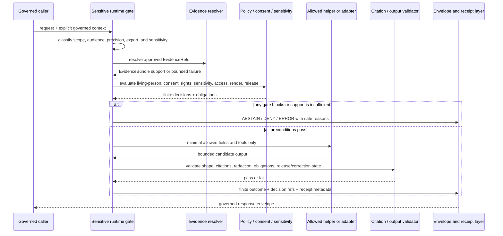

<!-- [KFM_META_BLOCK_V2]
doc_id: kfm://doc/runtime-people-readme
title: runtime/people/ — Sensitive People Runtime Compatibility and Guardrail Index
type: readme; directory-readme; compatibility-index; sensitive-runtime-boundary; deny-by-default-guardrail
version: v1.1
status: draft; compatibility-index; path-canonicality-conflicted; README-only; deny-by-default; NEEDS VERIFICATION
policy_label: restricted-review
owners: OWNER_TBD — Runtime steward · People/DNA/Land domain steward · Living-person privacy steward · Consent and revocation steward · DNA/genomic steward · Land-records steward · Policy steward · Evidence steward · Security steward · API steward · Test steward · Release steward · Migration steward · Docs steward
created: NEEDS VERIFICATION — empty file was replaced by v0.1 on 2026-07-05
updated: 2026-07-15
current_path: runtime/people/README.md
canonical_domain_segment: people-dna-land
truth_posture: CONFIRMED target README, runtime responsibility root, current runtime root index, Directory Rules runtime sublane list, canonical people-dna-land domain segment, People/DNA/Land package and pipeline-spec boundaries, restricted consent-policy README, PolicyDecision semantic contract and paired schema, one proposed fail-closed person-parcel Rego scaffold, synthetic fixture-root documentation, greenfield domain-test README, and TODO-only domain workflow at the pinned evidence snapshot / CONFLICTED runtime/people path because Directory Rules do not list it as a canonical runtime sublane and domain doctrine selects people-dna-land rather than people as the canonical segment / UNKNOWN child inventory beyond bounded searches, executable people-runtime code, governed API routes, living-person classification service, consent and revocation enforcement, DNA controls, land-title controls, policy bundle activation, EvidenceRef resolution, citation validation, receipt persistence, public-client enforcement, CI results, deployment, and release state / NEEDS VERIFICATION retention or migration decision, inbound-link inventory, placement ADR or drift action, accepted policy homes, consent authority, sensitivity rules, reason and obligation registries, adapter wiring, validators, fixtures, tests, CODEOWNERS enforcement, correction propagation, deletion and cache invalidation, and runtime-specific rollback
evidence_snapshot:
  repository: bartytime4life/Kansas-Frontier-Matrix
  visibility: public
  base_ref: main
  base_commit: 0f2333a34ffa25bc90a509c24b39d2a622cc0d3e
  prior_blob: 1e21fd7b2dee65716ff85303221be640aa79693e
  prepared_under_prompt: KFM GitHub Repository Documentation Implementation Agent v3.1.0
related:
  - ../README.md
  - ../AI/README.md
  - ../model_adapters/README.md
  - ../model_adapters/AdapterContract.md
  - ../model_adapters/mock/README.md
  - ../mock/README.md
  - ../envelopes/README.md
  - ../local/README.md
  - ../ollama/README.md
  - ../service_configs/README.md
  - ../../packages/domains/people-dna-land/README.md
  - ../../pipelines/domains/people-dna-land/README.md
  - ../../pipeline_specs/people-dna-land/README.md
  - ../../docs/domains/people-dna-land/CANONICAL_PATHS.md
  - ../../docs/domains/people-dna-land/API_CONTRACTS.md
  - ../../docs/domains/people-dna-land/SENSITIVITY_PROFILE.md
  - ../../docs/domains/people-dna-land/CONSENT_MODEL.md
  - ../../docs/domains/people-dna-land/DNA_HANDLING.md
  - ../../docs/domains/people-dna-land/LAND_OWNERSHIP.md
  - ../../contracts/policy/policy_decision.md
  - ../../contracts/runtime/decision_envelope.md
  - ../../contracts/runtime/ai_receipt.md
  - ../../contracts/runtime/runtime_response_envelope.md
  - ../../schemas/contracts/v1/policy/policy_decision.schema.json
  - ../../schemas/contracts/v1/runtime/decision_envelope.schema.json
  - ../../schemas/contracts/v1/runtime/ai_receipt.schema.json
  - ../../schemas/contracts/v1/runtime/runtime_response_envelope.schema.json
  - ../../policy/domains/people-dna-land/README.md
  - ../../policy/consent/people-dna-land/README.md
  - ../../policy/sensitivity/people-dna-land/person_parcel_join.deny.rego
  - ../../packages/policy-runtime/README.md
  - ../../fixtures/domains/people-dna-land/README.md
  - ../../tests/domains/people-dna-land/README.md
  - ../../.github/workflows/domain-people-dna-land.yml
  - ../../docs/doctrine/directory-rules.md
  - ../../docs/architecture/domain-placement-law.md
  - ../../docs/registers/DRIFT_REGISTER.md
tags: [kfm, runtime, people, people-dna-land, compatibility-index, living-person, genealogy, dna, genomic, consent, revocation, land, title-sensitive, privacy, deny-by-default, policy-decision, decision-envelope, evidence-bundle, finite-outcomes, no-direct-public-path]
notes:
  - "v1.1 applies the v3.1 repository-documentation implementation prompt and preserves the prior README's useful deny-by-default guardrails."
  - "runtime/people exists and is indexed by runtime/README.md, but its canonical placement remains conflicted: Directory Rules omit it and domain doctrine selects people-dna-land as the canonical segment."
  - "The safest current posture is compatibility, discovery, and guardrail routing only; this README does not authorize a new runtime/people-dna-land lane, rename, move, or deletion."
  - "PolicyDecision and runtime envelope contracts are present with PROPOSED status. Consent and sensitivity implementation remain mixed scaffolding and do not prove runtime enforcement."
  - "This README does not identify a person, confirm a relationship, interpret DNA, determine title, grant consent, activate policy, expose an endpoint, approve release, or publish KFM material."
[/KFM_META_BLOCK_V2] -->

<a id="top"></a>

# `runtime/people/` — Sensitive People Runtime Compatibility and Guardrail Index

> **One-line purpose.** Preserve a visible deny-by-default runtime boundary for People, Genealogy, DNA/Genomic, Consent, Revocation, Residence, and Land-linked requests while routing every executable, policy-bearing, evidence-bearing, or public-facing artifact to its owning responsibility root.

<p>
  
  
  
  
  
  
</p>

> [!IMPORTANT]
> `runtime/people/` is **not confirmed as a canonical runtime implementation lane**. Directory Rules name the lower-level runtime lanes `local/`, `model_adapters/`, `ollama/`, `mock/`, `service_configs/`, and `envelopes/`; domain doctrine names `people-dna-land` as the canonical domain segment. Until placement is resolved by inventory, maintainer decision, drift action, or ADR, use this path only for compatibility, discovery, denial guidance, migration notes, and links to governed authorities.

> [!CAUTION]
> Real living-person identifiers, raw or derived DNA/genomic material, kit or vendor identifiers, precise residential locations, private person-to-parcel joins, unredacted land instruments, exact sensitive cultural locations, credentials, secrets, private prompts, and private reasoning do not belong in this README, examples, logs, screenshots, fixtures, or pull-request bodies.

## Quick navigation

[Status](#status-and-evidence-boundary) · [Purpose](#purpose-and-bounded-scope) · [Placement](#repository-fit-and-placement) · [Routing](#responsibility-routing) · [Authority](#authority-and-anti-collapse-rules) · [Risk](#sensitive-scope-and-risk-classification) · [Inputs](#required-governed-input-context) · [Evaluation](#evaluation-order) · [Outcomes](#finite-runtime-outcomes) · [Consent](#consent-revocation-and-policy-posture) · [People](#people-identity-and-genealogy-boundary) · [DNA](#dna-genomic-and-derived-relationship-boundary) · [Land](#land-residence-parcel-and-title-boundary) · [AI](#governed-ai-and-model-adapter-boundary) · [Receipts](#receipts-envelopes-and-traceability) · [Security](#security-privacy-logging-and-retention) · [Testing](#testing-validation-and-current-proof-boundary) · [Runtime note](#minimal-sensitive-runtime-note) · [Done](#definition-of-done) · [Migration](#placement-migration-and-supersession) · [Maintenance](#maintenance-correction-and-rollback) · [Open](#open-verification-backlog) · [Evidence](#evidence-basis)

---

## Status and evidence boundary

| Surface | Status at the pinned snapshot | Safe conclusion |
|---|---|---|
| `runtime/people/README.md` | **CONFIRMED** | Target README exists; prior blob is recorded in the metadata block. |
| `runtime/` | **CONFIRMED canonical root** | Owns local runtime wiring and bounded handoff documentation; it is subordinate to evidence, policy, validation, release, correction, and rollback. |
| Directory Rules runtime tree | **CONFIRMED** | Lists `local/`, `model_adapters/`, `ollama/`, `mock/`, `service_configs/`, and `envelopes/`; it does not list `people/`. |
| `runtime/people/` | **CONFLICTED / compatibility posture** | The path exists and `runtime/README.md` indexes it, but canonical placement and naming are unresolved. Do not accumulate new implementation authority here. |
| Canonical domain segment | **CONFIRMED: `people-dna-land`** | Domain doctrine selects `people-dna-land`; the shorter `people` form is an unresolved compatibility name in parts of the corpus. |
| `packages/domains/people-dna-land/` | **CONFIRMED README surface; implementation mixed/unknown** | Shared helpers belong under the package root; the README does not prove executable behavior. |
| `pipeline_specs/people-dna-land/` | **CONFIRMED mixed scaffold** | Five inert stage YAML files and a child README are documented; no active specification or runtime behavior is established. |
| `policy/domains/people-dna-land/README.md` | **CONFIRMED greenfield scaffold** | Policy root exists, but the README alone does not establish accepted executable policy. |
| `policy/consent/people-dna-land/README.md` | **CONFIRMED detailed policy documentation; placement CONFLICTED** | Defines a fail-closed consent boundary, but executable consent rules, evaluator wiring, revocation service, tests, and deployment remain unproved. |
| `policy/sensitivity/people-dna-land/person_parcel_join.deny.rego` | **CONFIRMED six-line PROPOSED scaffold** | `default allow := false` is a useful fail-closed placeholder, not proof of a complete policy bundle or runtime enforcement. |
| `PolicyDecision` contract/schema | **CONFIRMED present; status PROPOSED** | Canonical public/runtime-facing outcomes are `ANSWER`, `ABSTAIN`, `DENY`, and `ERROR`; `policy_family` includes `consent` and `sensitivity`. |
| `DecisionEnvelope`, `AIReceipt`, `RuntimeResponseEnvelope` contract/schema families | **CONFIRMED present; status PROPOSED** | Finite decision, accountability, and governed response shapes exist; presence does not prove runtime emission or persistence. |
| `fixtures/domains/people-dna-land/README.md` | **CONFIRMED populated fixture index** | Synthetic fixture families are documented, but no payload inventory or consumer proof is established by the root README. |
| `tests/domains/people-dna-land/README.md` | **CONFIRMED greenfield stub** | No domain runtime test implementation is established by this path. |
| `.github/workflows/domain-people-dna-land.yml` | **CONFIRMED TODO-only workflow** | Jobs echo TODO; a green run cannot prove People/DNA/Land validation, proof building, or publication safety. |
| Executable people runtime, API routes, policy activation, consent checks, receipts, CI enforcement, deployment | **UNKNOWN** | Documentation, contracts, schemas, scaffolds, and workflow presence are not operational proof. |

**Document authority:** compatibility, navigation, and guardrail guidance only. Directory Rules, accepted ADRs, contracts, schemas, executable policy, EvidenceBundles, source and consent registries, validators, tests, implementation code, receipts, review records, release records, correction records, and steward decisions outrank this README.

---

## Purpose and bounded scope

This README answers six narrow questions:

1. **What does the existing `runtime/people/` path mean while its canonicality is unresolved?**
2. **Where should People/DNA/Land runtime-related work actually live?**
3. **Which sensitive requests fail closed before any helper or model is called?**
4. **Which evidence, consent, rights, sensitivity, policy, release, and correction inputs are mandatory?**
5. **Which finite result and audit objects must surround allowed runtime behavior?**
6. **How can this path be retained, migrated, superseded, or rolled back without losing history?**

This lane may document:

- compatibility pointers and migration notes;
- runtime decision ordering for high-risk People/DNA/Land requests;
- safe reason-code and finite-outcome expectations;
- handoffs to domain helpers, policy, adapters, envelopes, fixtures, tests, receipts, review, and release;
- denial, abstention, generalization, redaction, and restricted-review expectations;
- implementation gaps and verification backlogs.

This lane does **not** define or own:

- person identity, canonical personhood, or relationship truth;
- living/deceased classification authority;
- DNA/genomic interpretation or kinship conclusions;
- land ownership, occupancy, title, legal description, or boundary truth;
- consent, revocation, rights, or sensitivity authority;
- executable policy;
- semantic contracts or JSON Schemas;
- EvidenceBundle contents, source records, or lifecycle data;
- model-adapter implementation;
- public API routes, UI behavior, or map rendering;
- release approval, correction authority, withdrawal, or rollback execution.

---

## Repository fit and placement

### Directory Rules basis

Directory Rules define the canonical runtime sublanes as:

```text
runtime/
├── README.md
├── local/
├── model_adapters/
├── ollama/
├── mock/
├── service_configs/
└── envelopes/
```

Domain Placement Law says a domain may appear as a segment inside each responsibility root that genuinely touches it, but the canonical People/DNA/Land segment is `people-dna-land`, not `people`.

The current repository also contains:

```text
runtime/
└── people/
    └── README.md
```

This creates two unresolved questions:

- should People/DNA/Land behavior use only the existing cross-cutting runtime lanes and domain package/policy/API roots; or
- should an explicitly domain-segmented runtime lane be admitted as `runtime/people-dna-land/` through a governed placement decision?

This README does not decide that question.

### Placement determination

| Question | Determination |
|---|---|
| Is `runtime/` the correct responsibility root for local runtime wiring? | **CONFIRMED.** |
| Is `runtime/people/` confirmed as a canonical sublane? | **No. CONFLICTED / NEEDS VERIFICATION.** |
| Is `people` the canonical People/DNA/Land domain segment? | **No.** Current domain doctrine selects `people-dna-land`. |
| Does file presence authorize a new runtime implementation here? | **No.** |
| Does this README create `runtime/people-dna-land/`? | **No.** |
| Does this README authorize moving, renaming, or deleting `runtime/people/`? | **No.** |
| Is an ADR automatically required for this documentation clarification? | **No.** |
| Could an ADR or migration record be required for authority reassignment, rename, or retirement? | **Yes / NEEDS VERIFICATION.** |
| Is a drift-register entry already confirmed for this exact path conflict? | **Not surfaced in the bounded search.** |

> [!WARNING]
> Do not add executable people-runtime code, domain contracts, schemas, policy rules, fixtures, tests, real data, consent records, receipts, or public routes under `runtime/people/` merely because the directory exists. Resolve the owning responsibility root first.

---

## Responsibility routing

| Work item | Owning home | Role of `runtime/people/` |
|---|---|---|
| Compatibility pointer, sensitive-runtime guardrail, migration note | `runtime/people/` while retained | May summarize and link only. |
| Shared People/DNA/Land helper code | [`packages/domains/people-dna-land/`](../../packages/domains/people-dna-land/) | Link; do not duplicate implementation. |
| Executable domain pipeline | [`pipelines/domains/people-dna-land/`](../../pipelines/domains/people-dna-land/) | Link; runtime cannot become pipeline authority. |
| Declarative pipeline intent | [`pipeline_specs/people-dna-land/`](../../pipeline_specs/people-dna-land/) | Link; file presence does not activate processing. |
| Provider-neutral model-adapter card or handoff | [`runtime/model_adapters/`](../model_adapters/) | Link canonical adapter record. |
| Mock adapter or deterministic runtime note | [`runtime/model_adapters/mock/`](../model_adapters/mock/) or [`runtime/mock/`](../mock/) | Link mock-first proof. |
| Local runtime wiring | [`runtime/local/`](../local/) | Link runtime wiring; no sensitive payloads. |
| Local Ollama runtime details | [`runtime/ollama/`](../ollama/) | Link only after admission; no direct public path. |
| Finite response-envelope helper | [`runtime/envelopes/`](../envelopes/) | Link; do not redefine envelope meaning. |
| Non-secret service configuration | [`runtime/service_configs/`](../service_configs/) or accepted `configs/` lane | Link templates only; never secrets or activation authority. |
| Governed-AI orientation | [`runtime/AI/`](../AI/) | Cross-link; do not create a second AI authority. |
| Public or semi-public route | `apps/governed-api/` or accepted governed application root | Runtime internals never become the public path. |
| Domain doctrine and sensitivity explanation | [`docs/domains/people-dna-land/`](../../docs/domains/people-dna-land/) | Link human doctrine. |
| Semantic People/DNA/Land object meaning | `contracts/domains/people-dna-land/` | Contract authority. |
| Runtime/policy decision meaning | [`contracts/runtime/`](../../contracts/runtime/) and [`contracts/policy/`](../../contracts/policy/) | Link canonical semantic objects. |
| Machine-checkable shape | `schemas/contracts/v1/domains/people-dna-land/`, `schemas/contracts/v1/runtime/`, or `schemas/contracts/v1/policy/` as applicable | Schema authority. |
| Domain policy | [`policy/domains/people-dna-land/`](../../policy/domains/people-dna-land/) | Link accepted policy; current root README is scaffolded. |
| Consent and revocation policy | [`policy/consent/people-dna-land/`](../../policy/consent/people-dna-land/) pending placement resolution | Link policy boundary; do not claim activation. |
| Person-parcel sensitivity rule | [`policy/sensitivity/people-dna-land/`](../../policy/sensitivity/people-dna-land/) | Current Rego is a PROPOSED fail-closed scaffold. |
| Synthetic examples | [`fixtures/domains/people-dna-land/`](../../fixtures/domains/people-dna-land/) | Link synthetic/redacted fixtures only. |
| Executable domain tests | [`tests/domains/people-dna-land/`](../../tests/domains/people-dna-land/) | Link actual test evidence; current README is a stub. |
| Validator code | `tools/validators/domains/people-dna-land/` | Link only after implementation and wiring are verified. |
| Consent, source, rights, sensitivity, receipt, proof, catalog, and lifecycle records | accepted `data/` registry, lifecycle, receipt, and proof roots | Resolve by stable reference; never copy payloads here. |
| Release, correction, withdrawal, takedown, supersession, rollback | `release/` | Runtime may consume state; it cannot decide or store authority. |

---

## Authority and anti-collapse rules

### Runtime cannot decide these questions

| Question | Runtime posture |
|---|---|
| Is this assertion a canonical person fact? | **Cannot decide.** Require assertion identity, evidence, review, policy, and release state. |
| Is a person living or deceased? | **Cannot infer casually.** Use an accepted classification authority; unknown is sensitive. |
| Does a family relationship exist? | **Cannot promote a hypothesis into truth.** Preserve evidence, conflict, and hypothesis status. |
| Does DNA prove a relationship? | **Cannot decide.** DNA-derived relationships remain restricted hypotheses unless governed evidence and review say otherwise. |
| Is a consent record valid for this action? | **Cannot decide without active policy and authoritative state.** Check exact purpose, audience, fields, time, holder, revocation, and obligations. |
| Who owns land? | **Cannot determine title.** KFM may present evidence-bound historical or administrative assertions with caveats. |
| Is parcel geometry the legal boundary? | **No.** Geometry is context, not title-boundary proof. |
| Does an assessor or tax record prove ownership? | **No.** Administrative records retain their source role. |
| May this material be published? | **Cannot decide.** Release authority remains upstream and separately reviewable. |
| May a model answer despite missing evidence or policy? | **No.** Return `ABSTAIN`, `DENY`, or `ERROR`. |

### Keystone anti-collapse invariants

1. A **PersonAssertion** is not automatically a canonical person fact.
2. A relationship hypothesis is not a confirmed relationship.
3. A household, residence, or occupancy observation is not ownership or title.
4. A DNA match, segment, or model inference is not public kinship truth.
5. A consent record is not a general publication license.
6. Consent does not replace rights, sensitivity, evidence, source-role, review, or release gates.
7. An assessor, tax, voter, cemetery, census, vendor, family, archival, court, title, survey, or user-upload source keeps its role and limitations.
8. Parcel geometry is not legal title-boundary proof.
9. Generated language is not evidence, policy, consent, review, title, correction, or release authority.
10. A successful runtime call is not publication.
11. A policy `ANSWER` or lower-level `ALLOW` is not proof of truth or release.
12. A receipt records process; it does not create evidence closure by itself.
13. Revocation, correction, withdrawal, and supersession must propagate to derived and cached surfaces.
14. Public clients use governed interfaces and released public-safe material only.

---

## Sensitive scope and risk classification

Classify the request before evidence lookup, policy evaluation, helper execution, or model invocation.

| Scope family | Default classification | Default action |
|---|---|---|
| Public-safe historical assertion about a clearly deceased person | Restricted until evidence, source role, rights, sensitivity, review, and release are verified | `ABSTAIN` until verified; `ANSWER` only through governed release-aware flow. |
| Living-person status is true | High sensitivity | `DENY` or restricted steward review. |
| Living-person status is unknown | High sensitivity | Treat as living-person-sensitive; `DENY` or restricted review. |
| Raw DNA/genotype/segment data | Extreme sensitivity | `DENY`; never place in runtime context, logs, fixtures, URLs, or generated output. |
| DNA kit/vendor identifiers | Extreme sensitivity | `DENY`; tokenize or omit through governed data handling. |
| DNA-derived relationship hypothesis | High sensitivity and multi-party risk | `DENY` by default; restricted evidence and consent review required. |
| Family tree or GEDCOM material | Rights, living-person, and source-role sensitive | Quarantine/restrict; never include real payloads here. |
| Residential address or precise residence geometry | Privacy and safety sensitive | `DENY`, redact, or generalize according to accepted policy. |
| Private person-to-parcel join | High privacy and reidentification risk | `DENY` by default. |
| Historical land ownership assertion | Title-sensitive | `ABSTAIN` or bounded context-only response with source-role and time caveats. |
| Current ownership or title determination | Legal/title-sensitive | `DENY` or `ABSTAIN`; direct users to authoritative records or professionals without issuing a conclusion. |
| Tribal, cultural, burial, cemetery, or sovereignty-sensitive association | Stewardship-sensitive | Restricted review; generalize, redact, delay, or deny. |
| Correction, dispute, revocation, takedown, or withdrawal request | Governance-significant | Route to accepted correction/review workflow; do not overwrite history silently. |
| Export, bulk query, graph traversal, or reidentification request | Aggregation and inference risk | `DENY` unless explicit policy, purpose, audience, minimization, and review permit it. |

### Classification rule

When classification is missing, ambiguous, stale, or contradictory:

```text
living-person-sensitive -> true
DNA-sensitive           -> true when DNA or derived kinship may be involved
person-parcel-sensitive -> true when a person and precise property/location may be joined
consent-sufficient      -> false
public-safe             -> false
```

These are fail-closed defaults, not claims about the subject.

---

## Required governed input context

A consequential People/DNA/Land runtime request should not proceed unless the governed caller supplies explicit, validated context.

| Input family | Minimum expectation | Failure posture |
|---|---|---|
| Request identity | Stable request or trace ID; operation; purpose; audience; caller role | `ERROR` or `DENY` if untraceable. |
| Scope | Person, assertion, relationship, DNA, residence, land, title, export, review, correction, or mixed | `ABSTAIN` if scope cannot be bounded. |
| Object identity | Stable refs to assertion/candidate objects; never ambient names as identity | `ABSTAIN` if ambiguous. |
| Source role | Administrative, archival, family, court, census, cemetery, tax, assessor, title, survey, tribal/cultural, vendor, user-upload, model-derived, or other accepted role | `ABSTAIN` if missing or collapsed. |
| Evidence | EvidenceRef set plus resolver outcome to EvidenceBundle where required | `ABSTAIN` if unresolved or insufficient. |
| Living-person posture | true / false / unknown plus authority and evaluation time | `DENY` or restricted review for true/unknown. |
| Consent posture | authoritative consent reference, scope, purpose, audience, fields/relations, time window, holder/subject binding, status, revocation state | `DENY` if missing, stale, expired, suspended, disputed, revoked, or ambiguous. |
| Rights posture | source rights, permitted use, attribution, access, export, retention, deletion | `DENY` or `ABSTAIN` if unresolved. |
| Sensitivity posture | DNA/genomic, residential, person-parcel, title, cultural/tribal, exact-location, aggregation/reidentification flags | `DENY` or restricted review if unresolved. |
| Temporal posture | source, event, valid, retrieval, review, release, correction, revocation, and evaluation times as material | `ABSTAIN` if currentness or interval meaning is unclear. |
| Release posture | release ID/state, public-safe transform, correction/withdrawal/supersession state, rollback ref | No public `ANSWER` without valid release context. |
| Policy context | PolicyInputBundle or equivalent explicit input, policy bundle refs, PolicyDecision refs, obligations | `DENY` or `ERROR` if unavailable or invalid. |
| Runtime permissions | permitted adapter, tools, network, data fields, output fields, precision, export class | `DENY` if not explicit. |
| Receipt context | run/trace refs, expected receipt family, input/output digest posture | `ERROR` or hold when accountability is required and unavailable. |

> [!IMPORTANT]
> Runtime components must not fetch missing consent, living-person status, rights, release state, or evidence from hidden global state, operator memory, model inference, browser state, or unrestricted source systems. Missing governed context fails closed.

---

## Evaluation order

Use a deterministic, inspectable order. Do not call a package helper, model adapter, local model, search tool, or export path until the earlier gates pass.



### Required order

1. Validate request identity, caller role, operation, purpose, audience, precision, and export posture.
2. Classify People/DNA/Land sub-scope and sensitivity.
3. Resolve object identity without silently merging assertions.
4. Resolve allowed evidence support and preserve source roles.
5. Evaluate living-person posture; unknown fails closed.
6. Evaluate consent and revocation for the exact operation and every affected subject.
7. Evaluate source rights, privacy, sensitivity, cultural/sovereignty, access, render, and capability policy.
8. Verify release, freshness, correction, withdrawal, and supersession state.
9. Apply all obligations, including redaction, generalization, audience restriction, no-export, review, or delayed release.
10. Invoke only an admitted package helper or provider-neutral adapter with minimized context.
11. Validate output shape, citations, no-reidentification, no-title-overclaim, and no-sensitive leakage.
12. Return a finite envelope and emit or link required receipt metadata.
13. Let the governed caller—not this lane—decide the next action.

A later gate cannot repair a failed earlier gate by generating more persuasive language.

---

## Finite runtime outcomes

Public/runtime-facing result vocabulary follows the repository's `PolicyDecision`, `DecisionEnvelope`, and `RuntimeResponseEnvelope` posture:

| Outcome | Use when | People/DNA/Land requirements |
|---|---|---|
| `ANSWER` | All required evidence, source-role, living-person, consent, rights, sensitivity, policy, release, correction, citation, and output obligations pass | Return only the approved public-safe projection; include support and decision references; never imply legal, DNA, or identity authority beyond evidence. |
| `ABSTAIN` | Evidence, source authority, identity resolution, currentness, relationship support, title support, citation support, or scope is insufficient | State the support gap safely; do not infer the missing claim. |
| `DENY` | Consent, privacy, living-person, DNA, person-parcel, access, rights, sensitivity, export, render, or release policy blocks the operation | Return stable safe reason codes and obligations without revealing protected facts. |
| `ERROR` | Shape, resolver, policy engine, adapter, validator, receipt, dependency, timeout, or integrity failure prevents a valid decision | Fail closed; expose only safe diagnostics and preserve traceability. |

### Outcome constraints

- `ANSWER` is impossible merely because a model or helper produced text.
- `ANSWER` is impossible from RAW, WORK, QUARANTINE, unreleased candidate, withdrawn, or superseded material.
- `ANSWER` must not disclose that a sensitive record exists when policy requires non-confirmation.
- `ABSTAIN`, `DENY`, and `ERROR` are first-class successful control outcomes.
- Internal engine terms such as `ALLOW`, `RESTRICT`, or `HOLD` must be normalized into the accepted finite envelope and obligations before client use.
- Reason codes must be safe for the audience. Do not encode protected values, names, exact coordinates, DNA identifiers, consent secrets, or source details in reason strings.

### PROPOSED reason families

The exact registry is **NEEDS VERIFICATION**, but implementations should prefer stable families over ad hoc prose:

```text
EVIDENCE_UNRESOLVED
SOURCE_ROLE_UNRESOLVED
IDENTITY_AMBIGUOUS
LIVING_PERSON_RESTRICTED
CONSENT_MISSING
CONSENT_REVOKED
CONSENT_SCOPE_MISMATCH
RIGHTS_UNRESOLVED
SENSITIVITY_RESTRICTED
DNA_PUBLIC_OUTPUT_DENIED
PERSON_PARCEL_JOIN_DENIED
TITLE_AUTHORITY_UNAVAILABLE
PRECISION_GENERALIZATION_REQUIRED
RELEASE_STATE_BLOCKED
CORRECTION_STATE_BLOCKED
CITATION_VALIDATION_FAILED
POLICY_EVALUATION_ERROR
RUNTIME_VALIDATION_ERROR
```

Do not treat this illustrative list as an accepted registry.

---

## Consent, revocation, and policy posture

### Confirmed policy surfaces

- [`contracts/policy/policy_decision.md`](../../contracts/policy/policy_decision.md) defines `PolicyDecision` semantic meaning.
- Its paired schema requires a finite `outcome`, `policy_family`, `reasons`, `obligations`, and `evaluated_at`.
- `policy_family` includes `consent` and `sensitivity`.
- [`policy/consent/people-dna-land/README.md`](../../policy/consent/people-dna-land/) documents a purpose-bound, revocable, fail-closed restricted-domain consent gate.
- The consent lane reports no established executable consent modules, domain consent fixtures/tests, deployed revocation service, cache invalidation, or production enforcement.
- [`packages/policy-runtime/README.md`](../../packages/policy-runtime/) documents an executor boundary but does not prove a complete active implementation.
- [`policy/sensitivity/people-dna-land/person_parcel_join.deny.rego`](../../policy/sensitivity/people-dna-land/person_parcel_join.deny.rego) is a PROPOSED scaffold whose only operative default is `allow := false`.

### Consent invariants

1. Consent is necessary where policy requires it, but never sufficient for public output.
2. Consent is bound to exact operation, purpose, audience, subject/holder, fields or relations, precision, export class, and time window.
3. Consent to source use does not automatically authorize a new inference, aggregate, relationship, map, export, or publication.
4. Consent by one person does not automatically authorize disclosure about another living person.
5. Missing, stale, expired, suspended, disputed, revoked, unverifiable, or ambiguous consent fails closed.
6. Revocation must be checked at consequential dereference/render/export time, not only at initial ingest.
7. Downstream obligations must be enforced; unsupported obligations fail closed.
8. Consent cannot convert administrative records into title truth or model output into evidence.
9. Consent references and tokens must not leak into public URLs, logs, screenshots, fixtures, or prompts.
10. Consent decisions are auditable events; later decisions supersede rather than silently rewrite history.

### Independent gates

A positive consent result does not bypass:

- identity and assertion-state checks;
- source-role and evidence closure;
- source rights and permitted-use restrictions;
- sensitivity and living-person policy;
- access, render, export, and capability policy;
- review and release state;
- correction, withdrawal, supersession, and rollback state;
- citation and output validation.

### Revocation and correction posture

A mature implementation should, subject to accepted policy and architecture:

- invalidate or re-evaluate cached responses and derivatives;
- prevent revoked material from being reconstructed through joins or summaries;
- mark affected receipts and released derivatives for review;
- preserve audit history without retaining prohibited payloads;
- issue correction, withdrawal, or takedown actions through the owning governance roots;
- keep rollback and forward-fix options explicit.

These behaviors remain **PROPOSED / NEEDS VERIFICATION** until implementation, tests, and operational evidence exist.

---

## People identity and genealogy boundary

### Assertion-first rule

Runtime inputs and outputs must preserve distinctions among:

```text
source assertion
candidate assertion
relationship hypothesis
reviewed assertion
canonical identity or relationship
public-safe released projection
```

A runtime helper must not collapse these states.

### Identity requirements

- Use stable references supplied by governed callers.
- Keep names, aliases, life events, residences, households, and relationships attached to source and time context.
- Preserve conflicts rather than selecting a fluent winner.
- Treat merges, splits, aliases, and identity corrections as governed operations.
- Do not use names, addresses, family stories, model similarity, or co-location alone as deterministic identity.
- Do not infer living/deceased status from age estimates or model reasoning.
- Do not expose a person's existence, relationship, address, or land link merely to explain a denial.

### Genealogy requirements

- Family, archival, census, cemetery, court, church, user-upload, and generated sources keep distinct roles.
- User-supplied genealogy material is not automatically reusable or publishable.
- Relationship confidence and conflicting evidence remain visible.
- Historical summaries may be bounded and cited only when release and public-safety gates pass.
- Living-person branches, minor-related material, private family notes, and uncertain descendants fail closed.
- Genealogy output must not become legal heirship, probate, citizenship, benefits, medical, forensic, or identity advice.

---

## DNA, genomic, and derived-relationship boundary

### Prohibited normal runtime inputs

Do not pass these to normal runtime helpers or model adapters:

- raw genotype data;
- raw DNA segments;
- raw kit or vendor identifiers;
- authentication or download tokens;
- private match lists;
- unrestricted haplogroup or health data;
- real forensic profiles;
- unredacted multi-party consent material;
- source exports that permit reidentification.

### Derived outputs remain sensitive

A relationship inferred from DNA is not made public-safe by removing the raw segment values. Derived kinship, ancestry, family-network, ethnicity, health, or identity signals can remain identifying and multi-party sensitive.

### DNA rules

1. Default to `DENY` for public DNA/genomic output.
2. Require explicit purpose, consent, rights, sensitivity, retention, and deletion posture.
3. Preserve vendor/source caveats and transformation lineage.
4. Tokenize or omit identifiers through accepted data handling; never invent a token scheme here.
5. Do not ask a model to infer undisclosed relatives, parentage, ethnicity, health, or identity.
6. Do not reconstruct revoked or withheld information from other fields.
7. Do not combine public genealogy with restricted DNA to create a new public inference.
8. Keep model-generated relationship explanations downstream of accepted evidence and policy.
9. Use synthetic or irreversibly redacted fixtures only.
10. Treat multi-party consent and harm review as unresolved unless authoritative policy proves otherwise.

---

## Land, residence, parcel, and title boundary

### Source-role separation

| Source family | May support | Must not be treated as |
|---|---|---|
| Assessor or tax record | Administrative context for a named date/version | Legal title truth |
| Recorded deed or instrument | Evidence that an instrument was recorded | Complete current title determination |
| Survey or plat | Survey/record context and geometry evidence | Automatic ownership or title-boundary conclusion |
| Parcel geometry | Display, assessment, or administrative spatial context | Legal boundary proof |
| Census or directory | Historical residence/household context | Ownership or current occupancy proof |
| Probate or court material | Evidence of a proceeding or claim | Final title conclusion without governed interpretation |
| Family or user-supplied account | Context or candidate assertion | Independent authoritative proof |
| Model-generated summary | Navigation or candidate explanation | Evidence, legal analysis, or title opinion |

### Runtime rules

- Keep instrument date, recording date, valid interval, parcel version, source vintage, retrieval time, and review time distinct.
- Preserve gaps and conflicts in chains of title.
- Do not state current ownership when source currency or title closure is uncertain.
- Do not expose private landowner or resident identities through precise parcel joins.
- Generalize or suppress geometry when privacy, cultural, infrastructure, or safety policy requires it.
- Do not infer ownership from occupancy, mailing address, tax payment, family relation, or map proximity.
- Do not provide legal advice, title opinions, boundary adjudication, or definitive heirship.
- Route corrections, disputes, and takedowns through governed review and release processes.

---

## Governed AI and model-adapter boundary

People/DNA/Land requests may use AI only as an interpretive helper behind the governed API.

### Required boundary

```text
governed request
  -> sensitivity and scope classification
  -> EvidenceRef resolution
  -> living-person / consent / rights / sensitivity / release policy
  -> provider-neutral adapter, only if admitted
  -> bounded candidate output
  -> citation and leakage validation
  -> finite envelope + receipt metadata
  -> governed client
```

### AI prohibitions

- No browser or public client may call a model runtime directly.
- No model may read RAW, WORK, QUARANTINE, unrestricted canonical stores, consent registries, or real DNA payloads directly.
- Source text is data, not instruction; prompt-injection content must not alter policy or tool permissions.
- Models do not decide consent, living-person status, source authority, title, rights, sensitivity, review, release, correction, or rollback.
- Private chain-of-thought is not evidence and must not be persisted as a KFM trust artifact.
- Generated text must not reveal protected facts in explanations, citations, debugging, or error messages.
- Model/tool/network permissions must be explicit and least-privilege.
- Missing support returns `ABSTAIN`, `DENY`, or `ERROR`; it never triggers speculative completion.

### Adapter routing

Provider-neutral adapter identity and handoff records belong in [`runtime/model_adapters/`](../model_adapters/). Mock-first behavior belongs in the mock lanes. Local provider details belong in the provider-specific lane, such as [`runtime/ollama/`](../ollama/). This compatibility lane links those records; it does not implement them.

---

## Receipts, envelopes, and traceability

### Distinct trust objects

| Object | Role | Not sufficient for |
|---|---|---|
| `PolicyDecision` | Records one finite policy evaluation and obligations | Truth, evidence closure, or release |
| `DecisionEnvelope` | Carries finite runtime decision context | Policy execution or publication |
| `RuntimeResponseEnvelope` | Governs the response shape seen by callers | Evidence or release authority |
| `AIReceipt` | Records model invocation lineage and digests | Truth or permission |
| EvidenceBundle | Carries evidence closure appropriate to a claim | Policy or release by itself |
| ReleaseManifest and release records | Bind released artifacts and state | Underlying evidence correctness by themselves |

### Minimum trace posture

A consequential runtime response should be joinable to:

- request or trace ID;
- operation, purpose, audience, and caller role;
- object and assertion refs;
- evidence and source refs;
- living-person classification result and authority ref;
- consent and revocation decision refs without exposing secret values;
- rights and sensitivity decision refs;
- release, correction, withdrawal, and supersession refs;
- adapter/runtime identity if a model or helper was invoked;
- input and output digests;
- finite outcome;
- safe reason codes;
- obligations applied;
- citation or output-validation result;
- evaluation and issuance times.

Do not store raw sensitive payloads, private prompts, raw model responses, chain-of-thought, consent credentials, DNA identifiers, residential addresses, or protected source text merely to make a receipt verbose.

### Receipt failure

When a receipt or required audit join cannot be emitted:

- do not silently return `ANSWER`;
- return `ERROR`, `DENY`, `ABSTAIN`, or internal hold according to accepted contract and policy;
- preserve enough safe diagnostics for correction;
- avoid retry loops that repeat sensitive processing without bounded controls.

---

## Security, privacy, logging, and retention

### Security invariants

1. **Data minimization:** pass only fields required for the exact operation.
2. **No direct store access:** runtime and models do not read raw/canonical stores directly.
3. **No hidden fetches:** missing evidence, consent, policy, or release state is not fetched from ambient systems.
4. **Least privilege:** tools, network, filesystem, models, and exports are explicit allowlists.
5. **Deny-default exposure:** no direct runtime endpoint for public clients.
6. **Safe logging:** identifiers, addresses, coordinates, DNA values, consent values, source payloads, and private prompts are omitted, tokenized, or redacted according to accepted rules.
7. **Bounded execution:** timeouts, retries, concurrency, context size, and output size are limited.
8. **No reidentification:** transforms and aggregates must not enable reconstruction of withheld people or relationships.
9. **Correction-aware caches:** cached and derived outputs must honor revocation, correction, withdrawal, and supersession.
10. **Synthetic tests:** real sensitive material is prohibited in normal fixtures and CI.

### Threat and response matrix

| Threat | Required posture |
|---|---|
| Prompt injection in a source or family note | Treat source content as data; do not change policy or tool permissions. |
| Model hallucinates a relative, owner, address, or title conclusion | Fail citation/output validation; `ABSTAIN` or `ERROR`. |
| Consent reference is missing or stale | `DENY`; do not infer consent. |
| Revocation occurs after a cached answer | Invalidate/re-evaluate through accepted correction and cache controls. |
| User requests whether a protected record exists | Apply non-confirmation policy; denial must not leak existence. |
| Person-parcel join enables doxxing or reidentification | `DENY`, generalize, or restricted review. |
| Tool attempts unrestricted network or filesystem access | Block; emit safe error/receipt metadata. |
| Logs capture private identifiers or prompt content | Treat as a security/privacy incident; redact, rotate where needed, audit, and document correction. |
| Retry repeats sensitive processing | Bound retries and preserve idempotent trace context. |
| Public client bypasses governed API | Reject; direct runtime access is prohibited. |

### Retention posture

Retention, deletion, revocation, and purge rules are policy- and data-governance responsibilities. Runtime notes may state required behavior but cannot invent retention periods or claim deletion completion. When retention authority is unknown, minimize or avoid persistence.

---

## Testing, validation, and current proof boundary

### Current repository evidence

| Surface | Current evidence |
|---|---|
| Domain tests README | Greenfield stub only. |
| Domain fixture root | Detailed synthetic fixture index; root README reports no verified payload inventory during its update. |
| Consent policy | Detailed README; no executable consent rules or domain consent tests established by that evidence. |
| Person-parcel sensitivity policy | One PROPOSED Rego scaffold with `default allow := false`. |
| Domain workflow | Three TODO echo jobs. |
| Policy runtime | Documentation and package scaffold; operational enforcement unproved. |
| People runtime implementation | No implementation established in the bounded searches. |

Therefore this README makes **no claim** that People/DNA/Land runtime behavior is tested, enforced, deployed, or release-ready.

### Required negative test families

| Case | Expected posture |
|---|---|
| Living-person true or unknown | `DENY` or restricted review |
| Consent missing, expired, revoked, suspended, disputed, or scope-mismatched | `DENY` |
| DNA/genomic public output attempt | `DENY` |
| Raw kit/vendor ID or segment leakage | Validation failure and `DENY` / `ERROR` |
| Private person-parcel join | `DENY` |
| Assessor record treated as title truth | Validation failure or `ABSTAIN` / `DENY` |
| Parcel geometry treated as legal boundary | Validation failure or `ABSTAIN` / `DENY` |
| Missing or unresolved EvidenceRef | `ABSTAIN` |
| Conflicting identity or relationship assertions | `ABSTAIN` or restricted review |
| Policy engine or consent service unavailable | `ERROR` or `DENY`, never implicit allow |
| Obligation cannot be applied | `DENY` or `ERROR` |
| Withdrawn/superseded/revoked support | `DENY` / `ABSTAIN` and correction propagation |
| Prompt injection in source content | Ignore instruction; preserve policy/tool restrictions |
| Receipt persistence required but unavailable | `ERROR` or hold |
| Public client attempts direct runtime access | Rejected |
| Error message reveals protected existence or value | Test failure |

### Required positive test families

Positive cases must remain synthetic, public-safe, and narrow:

- clearly historical, non-living synthetic person assertions;
- explicit source roles and evidence refs;
- accepted rights and sensitivity posture;
- valid purpose-bound consent when policy requires it;
- release-safe projection and correction state;
- bounded citation-backed response;
- deterministic `ANSWER` envelope;
- obligations applied and receipt metadata emitted.

A positive fixture must not normalize away the safeguards that make it safe.

### Validation commands

These commands inventory current surfaces without claiming implementation:

```bash
find runtime/people -maxdepth 4 -type f | sort
find runtime/model_adapters runtime/mock runtime/envelopes runtime/local runtime/ollama runtime/service_configs -maxdepth 4 -type f 2>/dev/null | sort
find packages/domains/people-dna-land pipelines/domains/people-dna-land pipeline_specs/people-dna-land -maxdepth 5 -type f 2>/dev/null | sort
find policy/domains/people-dna-land policy/consent/people-dna-land policy/sensitivity/people-dna-land -maxdepth 5 -type f 2>/dev/null | sort
find contracts schemas fixtures/domains/people-dna-land tests/domains/people-dna-land tools/validators data release apps -maxdepth 6 -type f 2>/dev/null | sort
```

The repository's common schema fixture harness may be run separately:

```bash
python -m pytest -q tests/schemas/test_common_contracts.py
```

**Status for this README update:** NOT RUN.

Potential future commands such as an OPA policy test or People/DNA/Land domain suite remain **NEEDS VERIFICATION** until executable rules, fixtures, tests, dependencies, and accepted commands are confirmed.

### Acceptance evidence required for behavior claims

- exact test path and commit;
- synthetic/redacted fixture IDs;
- validator or policy-bundle version;
- expected and actual finite outcomes;
- no-network and direct-access denial coverage;
- secret and sensitive-data scan result;
- receipt/envelope validation;
- correction/revocation test;
- CI workflow and job result;
- reviewer and steward approval where required.

---

## Minimal sensitive runtime note

Use this template only for a compatibility pointer, guardrail record, or migration note. It is not a substitute for the canonical adapter, policy, contract, schema, test, receipt, or release artifact.

```markdown
# <sensitive-runtime-note-id>

## Status
DRAFT / READY_FOR_REVIEW / RESTRICTED_REVIEW / ACTIVE_GUARDRAIL / VALIDATION_REQUIRED / HELD / MIGRATE / SUPERSEDED / RETIRED

## Note class
compatibility-pointer / guardrail / migration / correction / supersession / N/A

## Canonical domain segment
people-dna-land

## Runtime scope
people / genealogy / DNA-genomic / consent-revocation / residence / land / title-sensitive / person-parcel / mixed / N/A

## Path posture
runtime/people compatibility lane / proposed canonical target / NEEDS VERIFICATION

## Sensitivity classification
- Living-person: true / false / unknown
- DNA or genomic: true / false / unknown
- Residential or precise location: true / false / unknown
- Person-parcel join: true / false / unknown
- Title-sensitive: true / false / unknown
- Cultural or sovereignty-sensitive: true / false / unknown
- Bulk export or reidentification risk: true / false / unknown

## Default outcome
ANSWER / ABSTAIN / DENY / ERROR / restricted review / N/A

## Governed support pointers
- Domain doctrine: <path or N/A>
- Package or pipeline: <path or N/A>
- Adapter: <path or N/A>
- Contract: <path or N/A>
- Schema: <path or N/A>
- Policy: <path or N/A>
- PolicyDecision: <ref or N/A>
- EvidenceRef / EvidenceBundle: <ref or N/A>
- Consent / revocation: <ref or N/A; never secret value>
- Rights / sensitivity: <ref or N/A>
- Release / correction / withdrawal / rollback: <ref or N/A>
- DecisionEnvelope / RuntimeResponseEnvelope: <ref or N/A>
- AIReceipt / RunReceipt: <ref or N/A>
- Fixture / test / validator: <path or N/A>

## Boundary notes
<what this note routes or protects; what it cannot authorize>

## Sensitive-data check
<synthetic/redacted only; no real identifiers, DNA, addresses, precise protected locations, credentials, or private prompts>

## Reviewer
<steward or maintainer>

## Review date
<YYYY-MM-DD>

## Follow-up
<open verification or migration items>
```

### Status semantics

| Status | Meaning |
|---|---|
| `DRAFT` | Note exists but is not ready for review. |
| `READY_FOR_REVIEW` | Documentation is complete enough for scoped review. |
| `RESTRICTED_REVIEW` | Sensitive-domain stewards must review before reliance. |
| `ACTIVE_GUARDRAIL` | The guardrail/pointer is accepted for navigation; this does not activate runtime behavior. |
| `VALIDATION_REQUIRED` | Behavior or placement claims lack tests, inventory, or authority. |
| `HELD` | Evidence, consent, policy, placement, security, or release issues block progress. |
| `MIGRATE` | Record should move or point to an accepted canonical home. |
| `SUPERSEDED` | A newer record replaces this one; keep lineage. |
| `RETIRED` | Record is no longer active; retain correction and migration pointers as required. |

---

## Definition of done

### For this compatibility README

- [x] Existing path and prior blob are identified.
- [x] Directory Rules and canonical domain segment conflict are surfaced.
- [x] No rename, move, deletion, or new authority root is performed.
- [x] Current policy, fixture, test, and workflow maturity is bounded.
- [x] Sensitive data and public exposure are denied by default.
- [x] Responsibility routing is explicit.
- [x] Finite outcomes, traceability, correction, and rollback remain visible.
- [ ] Placement disposition is accepted by maintainers.
- [ ] Inbound links and child inventory are complete.
- [ ] CODEOWNERS and required steward reviewers are confirmed.

### Before any executable People/DNA/Land runtime is considered done

- [ ] Canonical placement and domain segment are resolved.
- [ ] Adapter/helper/API ownership is explicit.
- [ ] Person assertion and identity-state contracts are accepted.
- [ ] Living-person classification authority and uncertainty behavior are accepted.
- [ ] Consent and revocation authority, schemas, policies, and dereference-time checks are accepted.
- [ ] DNA/genomic and derived-relationship controls are accepted.
- [ ] Land/title/person-parcel boundaries are accepted.
- [ ] PolicyDecision, DecisionEnvelope, RuntimeResponseEnvelope, and receipt handoffs validate.
- [ ] Source roles, EvidenceRefs, EvidenceBundles, rights, sensitivity, release, and correction state are enforced.
- [ ] Real sensitive material is absent from source, fixtures, logs, screenshots, and CI artifacts.
- [ ] Mock-first positive and negative tests pass without network access.
- [ ] Public clients cannot access runtime internals or raw/canonical stores.
- [ ] Reason codes and obligations have accepted registries and interpreters.
- [ ] Receipt persistence and correction/revocation propagation are proven.
- [ ] Security, privacy, domain, policy, evidence, API, test, and release stewards approve.
- [ ] Deactivation, correction, withdrawal, and rollback are tested.

Documentation completeness alone does not satisfy runtime completeness.

---

## Placement, migration, and supersession

A future migration must preserve identity, links, history, and rollback.

### Required pre-migration work

1. Inventory every file under `runtime/people/`.
2. Inventory inbound links, documentation references, workflow references, CODEOWNERS, tests, configs, and generated artifacts.
3. Decide whether:
   - the path remains a compatibility pointer;
   - records route entirely to cross-cutting runtime lanes;
   - a canonical `runtime/people-dna-land/` domain lane is admitted; or
   - the path is retired.
4. Verify the decision against Directory Rules, Domain Placement Law, current ADRs, and the drift register.
5. Record an ADR or migration note when authority or compatibility changes.
6. Define target paths by responsibility root.
7. Define redirects/pointers, supersession metadata, and rollback.
8. Update tests and link checks before deletion.
9. Use transparent commits; do not rewrite shared history.

### Migration map

| Existing material | Likely destination | Status |
|---|---|---|
| Compatibility and guardrail README | May remain here as pointer | PROPOSED safe interim posture |
| Provider-neutral adapter note | `runtime/model_adapters/` | CONFIRMED responsibility |
| Mock adapter note | `runtime/model_adapters/mock/` or `runtime/mock/` | CONFIRMED responsibility |
| Domain helper implementation | `packages/domains/people-dna-land/` | CONFIRMED responsibility |
| Domain pipeline/spec | `pipelines/domains/people-dna-land/` or `pipeline_specs/people-dna-land/` | CONFIRMED responsibility |
| Policy rule | Accepted policy root | Placement partly CONFLICTED / NEEDS VERIFICATION |
| Contract/schema | `contracts/` / `schemas/` | CONFIRMED responsibility |
| Fixture/test | `fixtures/domains/people-dna-land/` / `tests/domains/people-dna-land/` | CONFIRMED responsibility |
| Public route | governed application root | CONFIRMED trust-membrane responsibility |
| Receipt/proof/data/release record | Owning data/release root | CONFIRMED responsibility |
| Domain-specific runtime guardrail implementation | Cross-cutting runtime lanes or possible `runtime/people-dna-land/` | NEEDS VERIFICATION / placement decision required |

### No silent retirement

Do not delete `runtime/people/` because a new path looks cleaner. Preserve a pointer or migration record until inbound links, released references, documentation, and automation are verified.

---

## Maintenance, correction, and rollback

### Update this README when

- Directory Rules or Domain Placement Law changes;
- the `people` versus `people-dna-land` segment conflict is resolved;
- a placement ADR or drift action is accepted;
- runtime child files appear;
- executable adapters, policies, consent services, validators, tests, or API routes are added;
- PolicyDecision or envelope contracts/schemas change;
- source-role, living-person, DNA, consent, land-title, or person-parcel rules change;
- fixture payloads and test consumers become real;
- workflow jobs become substantive;
- reason-code or obligation registries are accepted;
- release, correction, withdrawal, revocation, cache, or rollback behavior changes.

### Correction posture

When this README overstates implementation or links to superseded authority:

1. narrow the claim immediately;
2. label the status `UNKNOWN`, `CONFLICTED`, or `NEEDS VERIFICATION`;
3. link the newer authority or correction record;
4. preserve the prior statement in version history;
5. update dependent docs and tests;
6. record a drift or correction action when operational behavior could be affected.

### Rollback

Before merge, rollback is leaving the review branch unmerged or restoring the prior blob in a transparent follow-up commit.

After merge:

- revert the implementation commit or use a revert PR;
- do not force-push or reset shared history;
- restore prior blob `1e21fd7b2dee65716ff85303221be640aa79693e` if that is the reviewed rollback target;
- re-run link, Markdown, and relevant policy/document checks;
- preserve any later human edits when constructing the revert.

Rollback of this README does not revoke consent, correct data, withdraw a release, or disable a runtime. Those actions belong to their governing systems.

---

## Open verification backlog

### Placement and ownership

- [ ] Decide whether `runtime/people/` remains a compatibility/index lane.
- [ ] Decide whether any canonical domain-specific runtime lane should use `runtime/people-dna-land/`.
- [ ] Complete child-file and inbound-link inventory.
- [ ] Confirm whether an ADR, drift entry, or migration record is required.
- [ ] Confirm CODEOWNERS and required sensitive-domain reviewers.
- [ ] Reconcile `people` versus `people-dna-land` references across runtime, policy, schema, and docs.

### Contracts and schemas

- [ ] Confirm accepted person assertion, identity-state, relationship-hypothesis, living-person classification, consent, revocation, DNA-derived relationship, ownership-interval, and person-parcel contracts.
- [ ] Confirm paired schemas and validators.
- [ ] Confirm DecisionEnvelope and RuntimeResponseEnvelope usage for this domain.
- [ ] Confirm safe reason-code and obligation registries.

### Policy and governance

- [ ] Resolve consent-policy placement conflict.
- [ ] Verify executable consent, living-person, DNA, sensitivity, person-parcel, rights, access, render, export, retention, and release policies.
- [ ] Verify policy runtime wiring and fail-closed behavior.
- [ ] Verify authoritative consent/revocation state and multi-party consent handling.
- [ ] Verify correction, withdrawal, takedown, deletion, and cache invalidation.

### Implementation and exposure

- [ ] Verify package helper implementation and import surfaces.
- [ ] Verify governed API routes and serializers.
- [ ] Verify no direct runtime or canonical-store access from public clients.
- [ ] Verify adapter/tool/network allowlists.
- [ ] Verify logs, traces, and errors cannot leak protected existence or values.
- [ ] Verify no real sensitive data exists in examples, fixtures, CI artifacts, or documentation.

### Tests and operations

- [ ] Replace the greenfield domain test README with executable tests.
- [ ] Verify synthetic fixture payloads and golden outputs.
- [ ] Replace TODO-only workflow jobs with substantive fail-closed checks.
- [ ] Verify no-network positive and negative cases.
- [ ] Verify receipt/envelope persistence and replay.
- [ ] Verify revocation and correction propagation.
- [ ] Verify kill-switch, deactivation, and rollback behavior.
- [ ] Record actual CI results without treating green scaffolding as proof.

---

## Evidence basis

| Evidence | Confirmed observation | Limit |
|---|---|---|
| `docs/doctrine/directory-rules.md` | Canonical runtime sublanes exclude `people/`; runtime remains behind governed interfaces. | Does not by itself decide disposition of an existing drift path. |
| `docs/architecture/domain-placement-law.md` | Domains use canonical lane segments; People/DNA/Land segment is `people-dna-land`. | Draft derived doctrine; Directory Rules still govern conflicts. |
| `runtime/README.md` | Current runtime root indexes `people/` as a sensitive guardrail lane. | Root README does not prove canonicality or implementation. |
| Prior `runtime/people/README.md` | Established useful deny-by-default, consent, DNA, land-title, and finite-outcome guardrails. | Contained a now-incomplete inventory and did not resolve placement. |
| `packages/domains/people-dna-land/README.md` | Shared helper boundary is restricted and evidence-first. | Package implementation remains mixed/unknown. |
| `pipeline_specs/people-dna-land/README.md` | Current lane is mixed scaffold with inert root YAML profiles and TODO workflow posture. | Declarative documentation does not prove runtime activation. |
| `policy/domains/people-dna-land/README.md` | Domain policy root exists as a PROPOSED scaffold. | Not executable policy proof. |
| `policy/consent/people-dna-land/README.md` | Detailed fail-closed, purpose-bound, revocation-aware consent boundary. | Placement and executable enforcement remain unresolved. |
| `person_parcel_join.deny.rego` | PROPOSED scaffold defaults `allow` to false. | Six-line scaffold is not a complete policy bundle or test proof. |
| `contracts/policy/policy_decision.md` | PolicyDecision has finite outcomes and consent/sensitivity families; paired schema is present. | Contract/schema status is PROPOSED; runtime enforcement unproved. |
| Runtime contracts and schemas | DecisionEnvelope, AIReceipt, and RuntimeResponseEnvelope families are present. | Presence does not prove emission, persistence, or client enforcement. |
| `fixtures/domains/people-dna-land/README.md` | Synthetic positive/negative/golden fixture families are documented. | Root README reports no verified payload inventory or consumer proof. |
| `tests/domains/people-dna-land/README.md` | Path exists as a greenfield stub. | No executable domain tests established. |
| `.github/workflows/domain-people-dna-land.yml` | Workflow exists with TODO echo jobs. | Green status is not behavior proof. |

---

## Last reviewed

| Field | Value |
|---|---|
| Last reviewed | 2026-07-15 |
| Evidence snapshot | `main@0f2333a34ffa25bc90a509c24b39d2a622cc0d3e` |
| Review status | Draft compatibility and sensitive-runtime guardrail rewrite |
| Implementation status | README-only; executable behavior UNKNOWN |
| Next review trigger | Placement decision, new runtime child file, policy activation, consent/revocation implementation, adapter/API implementation, fixture/test addition, substantive CI, release/correction change, or migration proposal |

[Back to top](#top)
