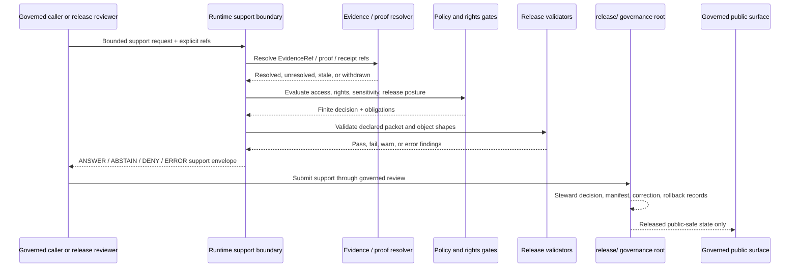

<!-- [KFM_META_BLOCK_V2]
doc_id: kfm://doc/runtime-release-readme
title: runtime/release/ — Runtime-to-Release Compatibility and Handoff Index
type: readme; directory-readme; compatibility-index; runtime-release-handoff-boundary
version: v1.1
status: draft; compatibility-index; path-canonicality-conflicted; mixed-release-support; NEEDS VERIFICATION
policy_label: public
owners: OWNER_TBD — Runtime steward · Release steward · Promotion steward · Evidence steward · Policy steward · Rights steward · Sensitivity steward · Review steward · Correction steward · Rollback steward · Security steward · Test steward · Migration steward · Docs steward
created: NEEDS VERIFICATION — empty file was replaced by v0.1 on 2026-07-05
updated: 2026-07-15
current_path: runtime/release/README.md
canonical_release_root: release/
truth_posture: CONFIRMED target README, runtime responsibility root, current runtime root index, Directory Rules runtime sublane list, canonical release root, ReleaseManifest/PromotionDecision/RollbackCard contracts and paired schemas, mixed release schema maturity, PromotionDecision validator wrapper and fixture lanes, release validator index, release test README, TODO-only release-dry-run workflow, partially executable promotion-gate workflow, and missing checked ReleaseManifest/RollbackCard validator scripts at the pinned evidence snapshot / CONFLICTED runtime/release path because Directory Rules do not list it as a canonical runtime sublane while release/ is the explicit release-decision authority / UNKNOWN child inventory beyond bounded searches, executable runtime-release service, release support API routes, accepted release policy bundles, complete validators, fixture payload coverage, receipt persistence, attestation/signature enforcement, public-client cache invalidation, deployment, branch protection, and production release state / NEEDS VERIFICATION retention or migration decision, inbound-link inventory, placement ADR or drift action, accepted handoff DTO, reason and obligation registries, review separation enforcement, release validator wiring, correction/withdrawal propagation, rollback execution, CODEOWNERS enforcement, and runtime-specific tests
evidence_snapshot:
  repository: bartytime4life/Kansas-Frontier-Matrix
  visibility: public
  base_ref: main
  base_commit: d1a3d4ff7bdaa6ac79bbdb5b7495f5d2cbbf977e
  prior_blob: 077cd408eb91288d2ebcf9d5f501171056ddefe9
  prepared_under_prompt: KFM GitHub Repository Documentation Implementation Agent v3.1.0
related:
  - ../README.md
  - ../AI/README.md
  - ../model_adapters/README.md
  - ../envelopes/README.md
  - ../mock/README.md
  - ../local/README.md
  - ../../release/README.md
  - ../../contracts/release/release_manifest.md
  - ../../contracts/release/promotion_decision.md
  - ../../contracts/release/rollback_card.md
  - ../../contracts/release/withdrawal_notice.md
  - ../../contracts/correction/correction_notice.md
  - ../../contracts/runtime/decision_envelope.md
  - ../../contracts/runtime/runtime_response_envelope.md
  - ../../contracts/runtime/ai_receipt.md
  - ../../schemas/contracts/v1/release/README.md
  - ../../schemas/contracts/v1/release/release_manifest.schema.json
  - ../../schemas/contracts/v1/release/promotion_decision.schema.json
  - ../../schemas/contracts/v1/release/rollback_card.schema.json
  - ../../schemas/contracts/v1/runtime/decision_envelope.schema.json
  - ../../schemas/contracts/v1/runtime/runtime_response_envelope.schema.json
  - ../../schemas/contracts/v1/runtime/ai_receipt.schema.json
  - ../../tools/validators/release/README.md
  - ../../tools/validators/release/validate_promotion_decision.py
  - ../../fixtures/release/promotion_decision/README.md
  - ../../tests/release/README.md
  - ../../.github/workflows/release-dry-run.yml
  - ../../.github/workflows/promotion-gate.yml
  - ../../docs/doctrine/directory-rules.md
  - ../../docs/registers/DRIFT_REGISTER.md
tags: [kfm, runtime, release, compatibility-index, release-handoff, release-manifest, promotion-decision, rollback-card, correction, withdrawal, finite-outcomes, receipts, evidence-bundle, policy, review, no-release-authority]
notes:
  - "v1.1 applies the v3.1 repository-documentation implementation prompt and preserves the prior README's useful release-authority guardrails."
  - "runtime/release exists and is indexed by runtime/README.md, but Directory Rules omit it from the canonical runtime tree; release/ is the confirmed release-governance root."
  - "The safest current posture is compatibility, discovery, and handoff guidance only; this README does not authorize a rename, move, deletion, new runtime lane, release decision, or publication."
  - "PromotionDecision is the most concrete inspected release schema family and has a validator wrapper; ReleaseManifest and RollbackCard shapes remain permissive and their named validator scripts were not found at the checked paths."
  - "This README does not approve promotion, emit a manifest, execute rollback, correct or withdraw a release, publish data, grant public access, or make generated language release authority."
[/KFM_META_BLOCK_V2] -->

<a id="top"></a>

# `runtime/release/` — Runtime-to-Release Compatibility and Handoff Index

> **One-line purpose.** Preserve a visible runtime-to-release handoff boundary while routing every release decision, manifest, promotion record, correction, withdrawal, rollback, proof, receipt, test, and public artifact to its owning responsibility root.

<p>
  
  
  
  
  
  
</p>

> [!IMPORTANT]
> `runtime/release/` is **not confirmed as a canonical runtime implementation lane** and is never release authority. Directory Rules name `release/` as the release-decision root and list only `local/`, `model_adapters/`, `ollama/`, `mock/`, `service_configs/`, and `envelopes/` in the canonical runtime tree. Until placement is resolved, use this path only for compatibility, discovery, bounded runtime handoff guidance, migration notes, and links to governed release records.

> [!WARNING]
> A runtime answer, validator pass, green workflow, schema-valid object, generated summary, merged pull request, deployed artifact, copied file, or `APPROVE`-looking string is **not a release**. Release requires the governed records and gates appropriate to the material: evidence closure, policy, review, rights, sensitivity, validation, PromotionDecision, ReleaseManifest, receipts/proofs, correction and withdrawal posture, rollback target, and release-steward authority.

## Quick navigation

[Status](#status-and-evidence-boundary) · [Purpose](#purpose-and-bounded-scope) · [Placement](#repository-fit-and-placement) · [Routing](#responsibility-routing) · [Authority](#authority-and-anti-collapse-rules) · [Vocabulary](#decision-and-state-vocabulary) · [Contracts](#verified-contract-and-schema-surfaces) · [Packet](#minimum-runtime-release-support-packet) · [Flow](#governed-runtime-to-release-flow) · [Promotion](#promotion-and-publication-boundary) · [Receipts](#receipts-proofs-manifests-and-catalog-separation) · [Correction](#correction-withdrawal-supersession-and-rollback) · [AI](#runtime-ai-and-generated-language-boundary) · [Security](#security-access-and-public-surface-boundary) · [Testing](#testing-validation-and-current-proof-boundary) · [Handoff note](#minimal-runtime-release-handoff-note) · [Done](#definition-of-done) · [Migration](#placement-migration-and-supersession) · [Maintenance](#maintenance-correction-and-rollback) · [Open](#open-verification-backlog) · [Evidence](#evidence-basis)

---

## Status and evidence boundary

| Surface | Status at the pinned snapshot | Safe conclusion |
|---|---|---|
| `runtime/release/README.md` | **CONFIRMED** | Target README exists; prior blob is recorded in the metadata block. |
| `runtime/` | **CONFIRMED canonical root** | Owns local runtime wiring and bounded runtime handoffs; it remains subordinate to evidence, policy, validation, review, and release. |
| Directory Rules runtime tree | **CONFIRMED** | Lists `local/`, `model_adapters/`, `ollama/`, `mock/`, `service_configs/`, and `envelopes/`; it does not list `release/`. |
| `runtime/release/` | **CONFLICTED / compatibility posture** | Path exists and is indexed by `runtime/README.md`, but it must not accumulate release or implementation authority. |
| `release/` | **CONFIRMED canonical release root** | Owns release candidates, manifests, promotion decisions, rollback cards, corrections, withdrawals, signatures, and changelog records. |
| `contracts/release/release_manifest.md` | **CONFIRMED contract; status PROPOSED** | Defines ReleaseManifest meaning; paired schema is thin and permissive. |
| `contracts/release/promotion_decision.md` | **CONFIRMED contract; status PROPOSED** | Defines a governed transition decision with concrete paired schema requirements. |
| `contracts/release/rollback_card.md` | **CONFIRMED contract; status PROPOSED** | Defines rollback-target meaning; paired schema is thin and permissive. |
| `schemas/contracts/v1/release/` | **CONFIRMED mixed maturity** | PromotionDecision is concrete; ReleaseManifest/RollbackCard/WithdrawalNotice are permissive; other release schemas include empty scaffolds. |
| `tools/validators/release/validate_promotion_decision.py` | **CONFIRMED wrapper** | Runs the common JSON Schema runner against the PromotionDecision schema and fixture root. |
| ReleaseManifest and RollbackCard named validators | **ABSENT at checked paths** | Contract/schema references do not prove validator implementation. |
| `tools/validators/release/README.md` | **CONFIRMED documentation surface** | Defines validator routing and fail-closed expectations; executable inventory remains incomplete. |
| `fixtures/release/promotion_decision/` | **CONFIRMED README lanes** | Valid/invalid fixture documentation exists; full payload and pass-rate evidence remains bounded. |
| `tests/release/README.md` | **CONFIRMED documentation surface** | Defines expected release-test families; executable test inventory and runner bindings remain unverified. |
| `.github/workflows/release-dry-run.yml` | **CONFIRMED TODO-only workflow** | Jobs only echo TODO; a green run cannot prove release readiness. |
| `.github/workflows/promotion-gate.yml` | **CONFIRMED partially executable workflow** | Runs doctrine-artifact checks, PromotionDecision fixture validation, and a hydrology promotion command; success/failure is not general release approval. |
| Runtime release support service, release API, receipt persistence, signing, cache invalidation, deployment, production release state | **UNKNOWN** | Documentation and scaffolds are not operational proof. |

**Document authority:** compatibility, navigation, and handoff guidance only. Directory Rules, accepted ADRs, release records, semantic contracts, schemas, executable policy, EvidenceBundles, validators, tests, receipts, proofs, signatures, correction records, rollback records, release-steward decisions, and governed public interfaces outrank this README.

---

## Purpose and bounded scope

This README answers six narrow questions:

1. **What does the existing `runtime/release/` path mean while its canonicality is unresolved?**
2. **Where should runtime-to-release work actually live?**
3. **Which release-support inputs may a runtime consume without becoming release authority?**
4. **Which finite runtime result may be returned to a release reviewer?**
5. **How are runtime outcomes kept separate from PromotionDecision and release-state vocabularies?**
6. **How can this path be retained, migrated, superseded, or rolled back without losing history?**

This lane may document:

- compatibility pointers and migration notes;
- runtime handoff order for release-readiness support;
- safe reason-code and finite-outcome expectations;
- links to ReleaseManifest, PromotionDecision, RollbackCard, CorrectionNotice, WithdrawalNotice, EvidenceBundle, PolicyDecision, receipts, proofs, tests, and validators;
- mock or review-support behavior that cannot mutate release state;
- current implementation gaps and verification backlog.

This lane does **not** define or own:

- release candidates, reviews, manifests, decisions, corrections, withdrawals, signatures, changelog entries, or rollback cards;
- publication, promotion, correction, withdrawal, supersession, or rollback authority;
- semantic contracts or JSON Schemas;
- policy source, policy activation, reviewer authority, or separation-of-duties decisions;
- lifecycle data, receipts, proofs, catalogs, triplets, published artifacts, or release payloads;
- public API routes, UI components, map layers, exports, screenshots, or AI answers;
- an executable runtime-release service unless implementation and tests are separately verified.

---

## Repository fit and placement

Directory Rules assign release decisions to `release/` and identify the canonical runtime sublanes without `runtime/release/`.

```text
runtime/
├── README.md
├── release/                 # this file; compatibility and handoff index only
├── local/                   # canonical local runtime wiring
├── model_adapters/          # canonical provider-neutral adapter lane
├── ollama/                  # canonical provider-specific local model runtime
├── mock/                    # canonical deterministic mock lane
├── service_configs/         # canonical non-secret runtime configuration lane
└── envelopes/               # canonical finite-outcome envelope helper lane

release/                     # canonical release-decision authority
├── candidates/
├── manifests/
├── promotion_decisions/
├── rollback_cards/
├── correction_notices/
├── withdrawal_notices/
├── signatures/
└── changelog/

contracts/release/           # semantic meaning
schemas/contracts/v1/release/# machine-checkable shape
policy/release/              # release policy
policy/promotion/            # promotion policy
tools/validators/release/    # release validation adapters
fixtures/release/            # synthetic release fixtures
tests/release/               # executable release-governance proof
data/receipts/               # process memory
data/proofs/                 # proof and evidence closure
data/published/              # released public-safe artifacts
```

### Placement determination

| Question | Determination |
|---|---|
| Is `runtime/` the correct responsibility root for bounded runtime handoffs? | **CONFIRMED.** |
| Is `runtime/release/` listed as a canonical runtime sublane? | **No.** |
| Is `release/` the canonical release-governance root? | **CONFIRMED.** |
| Does `runtime/README.md` index this path? | **Yes.** Repository presence does not establish canonical authority. |
| Should new release records land here? | **No.** |
| Does this README authorize creating a new runtime release implementation? | **No.** |
| Does this README authorize moving, renaming, deleting, or retiring this path? | **No.** Inventory, inbound-link review, migration notes, and an ADR or drift action may be required. |
| Does this documentation-only clarification create a new authority root? | **No.** |

> [!CAUTION]
> Do not create new ReleaseManifest instances, PromotionDecision records, rollback cards, correction notices, withdrawal notices, signatures, release receipts, policy rules, validators, fixture payloads, executable tests, or release code under `runtime/release/`. Route them through the responsibility table below.

---

## Responsibility routing

| Work item | Correct home | Role of `runtime/release/` |
|---|---|---|
| Runtime-to-release compatibility note | `runtime/release/` while retained | May document links and handoff boundaries. |
| Provider-neutral runtime adapter | [`runtime/model_adapters/`](../model_adapters/) | Link only. |
| Finite runtime response helper | [`runtime/envelopes/`](../envelopes/) | Link only; do not redefine envelope meaning. |
| Deterministic runtime mock | [`runtime/mock/`](../mock/) or accepted mock-adapter lane | Link mock evidence. |
| Release candidate or review record | [`release/`](../../release/) | Release root owns the record. |
| ReleaseManifest semantic meaning | [`contracts/release/release_manifest.md`](../../contracts/release/release_manifest.md) | Link canonical contract. |
| PromotionDecision semantic meaning | [`contracts/release/promotion_decision.md`](../../contracts/release/promotion_decision.md) | Link canonical contract. |
| RollbackCard semantic meaning | [`contracts/release/rollback_card.md`](../../contracts/release/rollback_card.md) | Link canonical contract. |
| CorrectionNotice semantic meaning | `contracts/correction/` | Link canonical contract after path verification. |
| Release object machine shape | [`schemas/contracts/v1/release/`](../../schemas/contracts/v1/release/) | Link schema; do not copy shape. |
| Runtime response machine shape | `schemas/contracts/v1/runtime/` | Link schema; do not copy shape. |
| Release/promotion policy | `policy/release/`, `policy/promotion/`, accepted policy families | Consume finite decisions; do not author here. |
| Evidence closure | `data/proofs/` and accepted EvidenceBundle homes | Resolve refs; do not copy evidence. |
| Run/validation/release receipts | `data/receipts/` | Link immutable receipt refs. |
| Release validator | [`tools/validators/release/`](../../tools/validators/release/) | Validator implementation and routing. |
| Promotion-gate validator | `tools/validators/promotion_gate/` | Specialized transition checks. |
| Synthetic release fixtures | `fixtures/release/` | Fixture payload authority. |
| Executable release tests | [`tests/release/`](../../tests/release/) | Enforce behavior. |
| Published public-safe payload | `data/published/` | Runtime must never store or serve internal candidates directly. |
| Public API/UI/map/AI response | Governed application interfaces | Consume released state and finite envelopes only. |
| Correction, withdrawal, supersession, rollback execution | `release/`, accepted tooling, runbooks, receipts, and public invalidation paths | Link status; never execute from this README. |

---

## Authority and anti-collapse rules

### Runtime may support release review

A bounded runtime may:

- summarize already governed release records;
- compare explicit manifest candidates;
- surface missing support;
- normalize validator findings into a finite runtime envelope;
- produce a review aid from released or review-authorized context;
- link evidence, policy, validation, receipt, correction, withdrawal, and rollback references;
- return safe `ABSTAIN`, `DENY`, or `ERROR` results when support is insufficient.

### Runtime may not become release governance

A runtime must not:

- emit an authoritative release record merely because it generated JSON;
- convert a validator pass into `RELEASED`;
- convert runtime `ANSWER` into PromotionDecision `APPROVE`;
- copy an artifact into `data/published/`;
- move a candidate through lifecycle phases;
- sign or attest a release without the accepted signing process;
- approve rights, sensitivity, consent, access, or public-surface policy;
- mutate a ReleaseManifest, PromotionDecision, RollbackCard, CorrectionNotice, or WithdrawalNotice in place;
- set or change the public `current` alias;
- execute rollback or invalidate caches without the governed release process;
- treat generated prose as evidence, review, policy, or release authority.

### Anti-collapse matrix

| Do not collapse | Why separation matters |
|---|---|
| Runtime outcome ↔ PromotionDecision | Runtime outcome describes one request; PromotionDecision records a governed lifecycle transition. |
| PromotionDecision ↔ ReleaseManifest | Decision permits/blocks transition; manifest binds a released artifact set. |
| ReleaseManifest ↔ EvidenceBundle | Manifest references evidence closure; it does not replace evidence. |
| ReleaseManifest ↔ published payload | Manifest identifies artifacts; `data/published/` stores released artifacts. |
| Receipt ↔ proof | Receipt records process memory; proof closes evidence/integrity claims. |
| Validator pass ↔ policy approval | Validator checks conformance; policy decides admissibility. |
| PolicyDecision ↔ release approval | PolicyDecision covers a policy family; release still requires review and release records. |
| RollbackCard ↔ rollback execution | Card records target and plan; execution requires receipts, validation, and release process. |
| CorrectionNotice ↔ silent mutation | Notice preserves public correction lineage; old records remain inspectable where policy permits. |
| Changelog ↔ release truth | Changelog is a human companion; governed records remain authoritative. |

---

## Decision and state vocabulary

KFM uses multiple finite vocabularies for different responsibilities. They must not be silently translated into one another.

### Runtime response vocabulary

| Runtime outcome | Meaning |
|---|---|
| `ANSWER` | Runtime produced bounded support material under current evidence, policy, validation, and access context. |
| `ABSTAIN` | Required support is insufficient, unresolved, stale, conflicted, or outside scope. |
| `DENY` | Policy, rights, sensitivity, access, release state, or governance rules forbid the requested support. |
| `ERROR` | Runtime, adapter, schema, validator, dependency, envelope, or receipt failure prevents a valid result. |

### PromotionDecision vocabulary

| Promotion decision | Meaning |
|---|---|
| `APPROVE` | The evaluated transition may proceed through the governed release process, subject to all required release artifacts and gates. |
| `DENY` | A blocking condition prevents the transition. |
| `ABSTAIN` | The gate cannot decide safely because context is unresolved or insufficient. |

### Release record state vocabulary

| Release state | Meaning |
|---|---|
| `DRAFT` | Record exists but is not review-ready. |
| `READY_FOR_REVIEW` | Record is ready for steward review. |
| `HELD` | Blocked on evidence, policy, review, validation, rights, sensitivity, correction, or rollback. |
| `READY_FOR_MANIFEST` | Candidate or review may support manifest preparation. |
| `APPROVED` | Steward-approved record; not automatically published payload. |
| `RELEASED` | Governed release state is complete for the referenced target. |
| `CORRECTED` | Superseded or amended through governed correction. |
| `SUPERSEDED` | A newer governed record replaces the prior state. |
| `WITHDRAWN` | Removed from active release through governed process. |
| `NO_ACTION` | Review authorizes no release-state change. |

### Translation rule

A runtime may report or carry release vocabulary as data, but it must not invent a release-state transition.

| Observed runtime result | Permitted interpretation | Forbidden interpretation |
|---|---|---|
| `ANSWER` | Support material was returned. | Release approved or published. |
| `ABSTAIN` | Runtime cannot support the request. | Promotion denied unless a PromotionDecision says so. |
| `DENY` | Runtime/policy blocks the request. | Release withdrawn unless release records say so. |
| `ERROR` | Runtime failed safely. | Candidate is permanently invalid without governed review. |
| PromotionDecision `APPROVE` | Transition may proceed through release gates. | Artifact is automatically `RELEASED`. |
| Schema validation pass | Object shape passed the checked schema. | Governance completeness or publication approval. |

---

## Verified contract and schema surfaces

### ReleaseManifest

**CONFIRMED:**

- semantic contract exists;
- paired schema exists;
- schema requires only `id`;
- optional `spec_hash` and `version` exist;
- additional properties are allowed.

**Consequence:** schema validity is not release completeness. A mature manifest still needs explicit contents, digests, evidence, source roles, policy, promotion, rights, sensitivity, review, attestations, receipts/proofs, correction lineage, rollback, and time posture as required by policy and materiality.

### PromotionDecision

**CONFIRMED:**

- semantic contract exists;
- paired schema is the most concrete inspected release schema;
- required fields include `id`, `version`, `domain`, `run_id`, `decision`, `evidence_ref`, `evidence_bundle_uri`, `rollback_card_uri`, `policy_bundle`, `decided_at`, and `review`;
- `decision` is `APPROVE | DENY | ABSTAIN`;
- `review` requires `reviewer` and `ticket`;
- additional properties are disallowed;
- a validator wrapper exists and points to the paired schema and fixture root.

**Consequence:** PromotionDecision is currently the strongest machine-shaped release object inspected, but schema/fixture validation still does not establish policy correctness, evidence truth, release approval, publication, or rollback execution.

### RollbackCard

**CONFIRMED:**

- semantic contract exists;
- paired schema exists;
- schema requires only `id`;
- optional `spec_hash` and `version` exist;
- additional properties are allowed.

**Consequence:** a schema-valid rollback card may still lack affected release, rollback target, correction link, invalidation plan, restoration plan, evidence, policy, review, or execution receipts.

### Mixed release schema family

The release schema index reports:

- concrete `promotion_decision.schema.json`;
- permissive ReleaseManifest, RollbackCard, and WithdrawalNotice schemas;
- empty or highly permissive ReleaseState, CorrectionNotice, redaction-receipt, and publication-transform-receipt scaffolds;
- release/policy/governance/receipt overlap and namespace drift requiring review.

### Runtime contracts

Runtime handoff may link:

- `DecisionEnvelope` for finite runtime decisions;
- `RuntimeResponseEnvelope` for governed caller responses;
- `AIReceipt` when model-mediated support contributes to a result.

These runtime objects remain separate from release records.

---

## Minimum runtime-release support packet

A runtime-support request should be explicit, bounded, and reference-driven.

| Context family | Minimum expectation | Fail-closed condition |
|---|---|---|
| Request identity | Stable request/run/audit id and caller identity. | Missing or ambiguous request identity. |
| Scope | Candidate, manifest, release id, artifact family, domain, time, and requested operation. | Scope cannot be bounded. |
| Lifecycle state | Current phase and proposed transition. | Phase is missing or public request targets RAW/WORK/QUARANTINE. |
| Release records | Candidate/review/PromotionDecision/ReleaseManifest refs as applicable. | Required record is absent or unresolved. |
| Evidence | EvidenceRef plus resolvable EvidenceBundle/proof refs. | Evidence cannot resolve or is stale/withdrawn. |
| Validation | Schema, validator, validation-report, and fixture/test refs as required. | Required validation missing or failed. |
| Policy | PolicyDecision/policy bundle id, version/digest, reasons, obligations. | Policy absent, stale, unsupported, or deny. |
| Rights/sensitivity | Rights, license, attribution, embargo, access, sensitivity, redaction/generalization state. | Unclear or blocking posture. |
| Review | Reviewer roles, ticket, materiality, separation-of-duties state. | Required review missing or self-approval prohibited. |
| Integrity | Artifact/manifests/spec hashes, signatures/attestations where required. | Digest mismatch or signature/attestation failure. |
| Receipts/proofs | Run, validation, transformation, release, proof, and audit refs. | Required receipt/proof missing. |
| Correction/withdrawal | Stale, corrected, superseded, withdrawn, dispute, reevaluation state. | Active state cannot be trusted. |
| Rollback | RollbackCard, prior safe release, invalidation/restoration plan. | No safe rollback posture where required. |
| Public surface | Requested audience, API/UI/map/export/AI surface, cache and derivative scope. | Direct internal-store or unreleased access requested. |

A missing field must never be guessed from folder location, filenames, generated prose, operator memory, or a previous successful run.

---

## Governed runtime-to-release flow



Key rule:

> The runtime stops at a support envelope. Only the governed release process may create or change release state.

### Safe support examples

- “The candidate is missing a resolvable rollback card reference.”
- “The PromotionDecision fixture validates against the current schema.”
- “The manifest schema is permissive; governance completeness remains unproved.”
- “Policy denied public rendering because sensitivity obligations are unresolved.”
- “The release record is marked superseded; do not use it as current.”

### Unsafe support examples

- “Release approved” based only on a validator pass.
- “Published” because a file exists under `data/published/`.
- “Safe to expose” because a schema validated.
- “Rollback complete” because a RollbackCard exists.
- “Corrected” because prose was edited.
- “Current” based on a mutable alias without manifest and rollback lineage.

---

## Promotion and publication boundary

### Promotion is a governed transition

The lifecycle remains:

```text
RAW -> WORK / QUARANTINE -> PROCESSED -> CATALOG / TRIPLET -> PUBLISHED
```

Promotion is not:

- a file move;
- a copy;
- a merge;
- a deployment;
- a generated manifest draft;
- a successful test;
- a release-dry-run workflow;
- a model answer;
- a human sentence saying “approved.”

### A runtime may support a promotion review

Runtime support may:

- identify missing PromotionDecision fields;
- summarize validator findings;
- surface unresolved EvidenceBundle refs;
- report missing rollback support;
- list policy obligations;
- compare explicit candidate and prior release digests;
- return a finite support result.

Runtime support may not:

- select `APPROVE`;
- fabricate a reviewer or ticket;
- substitute a generated rollback target;
- set `PUBLISHED`;
- publish artifacts;
- sign a release;
- change the active release alias.

### Publication is separate

| Concern | Authority |
|---|---|
| Transition decision | PromotionDecision and governed release review |
| Release binding | ReleaseManifest |
| Published payload | `data/published/` |
| Evidence closure | EvidenceBundle/proofs |
| Policy | Accepted policy bundle and PolicyDecision |
| Review | Review record/steward decision |
| Integrity | Digests/signatures/attestations |
| Correction/withdrawal | Governed release records and notices |
| Rollback | RollbackCard plus execution receipts and validation |
| Runtime summary | Runtime envelope only |

---

## Receipts, proofs, manifests, and catalog separation

| Object family | Owns | Does not prove by itself |
|---|---|---|
| Receipt | Process memory: what ran, with which inputs/outputs/digests/decisions. | Truth, evidence closure, or release approval. |
| Proof / EvidenceBundle | Evidence and integrity closure for a bounded claim or artifact set. | Policy permission or release approval. |
| ReleaseManifest | Binding of the released artifact set and release lineage. | Evidence truth, policy approval, or artifact storage. |
| PromotionDecision | Decision on a governed lifecycle transition. | Publication or manifest emission. |
| PolicyDecision | Outcome of one policy-family evaluation. | Release approval or evidence truth. |
| Catalog record | Discovery and metadata projection. | Release approval or canonical truth. |
| Published artifact | Released public-safe payload. | The release process that authorized it. |
| Runtime envelope | Bounded response for a caller. | Release-state change. |

### Receipt expectations for runtime support

When runtime support contributes materially to a release review, the accepted receipt family should capture or reference:

- request/run/audit id;
- caller and runtime mode;
- adapter/model/tool profile where applicable;
- input and output digests;
- evidence/proof refs;
- policy decision refs;
- validator findings and versions;
- release candidate/manifest/decision refs;
- correction/withdrawal/rollback refs;
- finite runtime outcome;
- safe reason codes;
- timestamp;
- no private chain-of-thought or secret-bearing payloads.

The accepted receipt path and schema remain **NEEDS VERIFICATION** for runtime-release support.

---

## Correction, withdrawal, supersession, and rollback

### Correction

A correction must:

- preserve the prior record where policy permits;
- emit or link a correction notice;
- identify affected release and public surfaces;
- bind corrected evidence, policy, review, and manifest state;
- invalidate stale derivatives and caches;
- preserve a rollback target;
- create new immutable records rather than silently rewriting history.

### Withdrawal

Withdrawal is appropriate when:

- no safe corrected release is available;
- rights or source authority is withdrawn;
- sensitivity or security risk requires removal from active use;
- evidence closure fails materially;
- policy requires the release to stop being served.

Runtime may report withdrawal state. It cannot withdraw a release.

### Supersession

Supersession must:

- identify the prior record;
- identify the new authoritative record;
- preserve lineage and reason;
- update governed aliases through the release process;
- invalidate stale caches and derived surfaces;
- avoid deleting prior meaning.

### Rollback

A rollback must:

- identify the affected release;
- identify a safe target or explicit withdrawn/null state;
- link a RollbackCard;
- link the correction/withdrawal pathway;
- list invalidation and restoration operations;
- validate the target;
- emit receipts/proofs of execution;
- preserve public auditability;
- avoid silent erasure.

### Runtime behavior during correction or rollback

| Situation | Runtime posture |
|---|---|
| Release marked stale or corrected | Do not answer from stale state; route to superseding record. |
| Release withdrawn | `DENY` or `ABSTAIN`; do not reconstruct withdrawn content. |
| Rollback target unresolved | `ABSTAIN` or `ERROR`. |
| Policy blocks disclosure of correction reason | Return safe reason code without protected details. |
| Cache invalidation unverified | Treat affected public state as unsafe/held. |
| Conflicting manifests | `ABSTAIN`; require steward resolution. |
| Emergency hold | `DENY` public use; preserve audit refs. |

---

## Runtime, AI, and generated-language boundary

Generated language may help:

- summarize explicit validator findings;
- explain missing release support;
- draft reviewer-facing notes;
- compare explicitly supplied manifest fields;
- produce public-safe explanations from already released evidence;
- route a request to the correct release record.

Generated language must not:

- invent evidence, release ids, manifests, promotion decisions, reviewers, policy bundles, signatures, receipts, proofs, rollback targets, or correction records;
- infer `APPROVE` from positive prose;
- infer `RELEASED` from a path or workflow status;
- redact sensitive facts without an accepted transform and receipt;
- generate a title, rights, consent, or legal conclusion;
- publish or mutate release records;
- serve as the only basis for correction, withdrawal, supersession, or rollback.

### Cite-or-abstain

When runtime support makes a release-related factual statement, it should cite the explicit governed record or abstain.

Examples:

- Cite the ReleaseManifest when naming release contents.
- Cite the PromotionDecision when describing transition posture.
- Cite the RollbackCard and execution receipt when describing rollback.
- Cite the CorrectionNotice when describing corrected public state.
- Cite EvidenceBundle/proof refs when describing evidence support.
- Cite PolicyDecision when describing policy outcome.

---

## Security, access, and public-surface boundary

### Deny by default

Runtime release support must deny or abstain when:

- caller lacks the required role;
- request targets internal or unreleased material;
- rights or sensitivity is unresolved;
- evidence/proof refs do not resolve;
- release state is stale, corrected, withdrawn, superseded, or conflicted;
- the request seeks direct RAW/WORK/QUARANTINE access;
- public rendering obligations cannot be enforced;
- rollback/correction status is unknown for material content;
- runtime tries to bypass the governed API.

### Data minimization

Do not log or persist in runtime-release notes:

- source credentials;
- private URLs or tokens;
- raw sensitive data;
- unreleased candidate payloads;
- exact protected locations;
- living-person or genomic material;
- private review discussions;
- signing keys;
- private chain-of-thought;
- full provider payloads;
- unredacted incident details;
- release artifacts duplicated from owning roots.

### Public clients

Public and semi-public clients must:

- consume released public-safe artifacts;
- use governed APIs;
- bind to explicit release manifests or released aliases controlled by rollback/correction discipline;
- receive finite runtime envelopes;
- never call runtime-release internals directly;
- never infer release state from a filename, branch, workflow, or model response.

### Tool and network posture

Runtime support should use:

- explicit allowlisted tools;
- bounded timeouts and retries;
- no-network deterministic defaults for tests;
- read-only access where possible;
- least privilege;
- fail-safe cancellation;
- audited calls;
- no signing or release-state mutation capability by default.

---

## Testing, validation, and current proof boundary

### Current verified maturity

| Surface | Current evidence |
|---|---|
| PromotionDecision schema | Concrete and closed; required fields verified. |
| PromotionDecision validator | Wrapper exists and invokes common schema runner. |
| PromotionDecision fixture lanes | README lanes exist for valid and invalid fixtures. |
| ReleaseManifest schema | Thin/permissive; governance completeness not enforced. |
| RollbackCard schema | Thin/permissive; governance completeness not enforced. |
| ReleaseManifest validator | Not found at named checked path. |
| RollbackCard validator | Not found at named checked path. |
| Release tests | README defines expected families; executable inventory remains unverified. |
| Release-dry-run workflow | TODO-only echo jobs. |
| Promotion-gate workflow | Partially executable; depends on doctrine artifact prerequisites and includes hydrology-specific promotion command. |
| Runtime-release service | Not established. |

### Minimum positive cases

| Case | Expected posture |
|---|---|
| Complete synthetic PromotionDecision | Schema pass; still not release approval. |
| Bounded release-readiness summary with resolved refs | Runtime `ANSWER` support envelope. |
| Superseded release query | `ANSWER` with successor ref and stale warning. |
| Corrected release query | `ANSWER` from corrected released state with correction ref. |
| Valid rollback target query | `ANSWER` describing target only when card and execution state are explicit. |

### Minimum negative cases

| Case | Expected posture |
|---|---|
| Candidate treated as released | Validation failure / `DENY`. |
| Schema-valid thin manifest treated as complete | Governance failure / `ABSTAIN`. |
| PromotionDecision missing rollback card | Schema or governance failure. |
| Runtime `ANSWER` translated to promotion `APPROVE` | `DENY` / test failure. |
| Validator pass translated to release approval | `DENY` / test failure. |
| Missing EvidenceBundle | `ABSTAIN`. |
| Policy deny or unresolved rights/sensitivity | `DENY`. |
| Withdrawn release requested | `DENY` or safe `ABSTAIN`. |
| Conflicting active manifests | `ABSTAIN`. |
| RollbackCard exists but execution unproved | `ABSTAIN`; do not claim rollback completed. |
| Direct RAW/WORK/QUARANTINE request | `DENY`. |
| Direct model/runtime public endpoint | `DENY`. |
| Missing receipt where required | `ERROR` or `HELD` support posture. |
| Workflow only echoes TODO | Must not count as proof. |

### Grounded commands

These commands are examples grounded in inspected repository paths. They were **not run for this documentation edit**.

```bash
python tools/validators/release/validate_promotion_decision.py --fixtures
python -m pytest -q tests/release
python -m pytest -q tests/schemas tests/contracts
```

> [!NOTE]
> The current `tests/release/README.md` says the executable runner and inventory remain unverified. Do not claim the `pytest tests/release` command succeeds until an actual run proves it.

### Workflow interpretation

| Workflow | Safe interpretation |
|---|---|
| `release-dry-run` | Current jobs echo TODO; success only proves the echo steps ran. |
| `promotion-gate` | Current jobs exercise doctrine artifact prerequisites, PromotionDecision fixtures, and a hydrology promotion command. Results are scoped evidence, not universal release approval. |
| Other schema/policy/release workflows | Inspect exact job steps and artifacts before interpreting. |

---

## Minimal runtime-release handoff note

Use a note only when a compatibility or review-support record is genuinely needed under this retained path.

```markdown
# <runtime-release-handoff-id>

## Status
DRAFT / READY_FOR_REVIEW / SUPPORT_ONLY / HELD / SUPERSEDED / RETIRED

## Compatibility posture
runtime/release compatibility index; not release authority

## Request identity
- Request ID: <stable id>
- Run or audit ref: <ref or N/A>
- Caller role: <role>
- Requested operation: <readiness summary / compare / explain blocker / N/A>

## Release scope
- Domain or surface: <scope>
- Candidate ref: <ref or N/A>
- Release ref: <ref or N/A>
- ReleaseManifest ref: <ref or N/A>
- PromotionDecision ref: <ref or N/A>
- Prior release ref: <ref or N/A>

## Governed support
- EvidenceRef: <ref or N/A>
- EvidenceBundle or proof: <ref or N/A>
- Validation report: <ref or N/A>
- PolicyDecision or policy bundle: <ref or N/A>
- Review record or ticket: <ref or N/A>
- Receipt: <ref or N/A>
- Signature or attestation: <ref or N/A>
- Correction or withdrawal notice: <ref or N/A>
- RollbackCard: <ref or N/A>

## Runtime result
ANSWER / ABSTAIN / DENY / ERROR

## Safe reason codes
<stable reason codes; no protected details>

## Obligations
<citation / redaction / restricted audience / review required / cache invalidation / N/A>

## Authority statement
This note is support material only. It does not approve promotion, publish artifacts,
correct or withdraw a release, execute rollback, or establish public release state.

## Reviewer
<runtime/release/docs steward or N/A>

## Review date
<YYYY-MM-DD>

## Supersession or follow-up
<new canonical record, migration action, or none>
```

### Naming guidance

A compatibility note may use:

```text
<YYYY-MM-DD>_<scope>_runtime-release-handoff.md
```

Do not use filenames that imply authority such as:

```text
release-approved.md
published.md
final-release-manifest.md
rollback-complete.md
```

unless the file is in the canonical owning lane and the name is supported by accepted records.

---

## Definition of done

A runtime-release handoff is not done because this README is complete.

### Documentation-level done

- [ ] Path status is explicit: compatibility/index, not release authority.
- [ ] Canonical `release/` record refs are linked.
- [ ] Runtime outcome is finite and distinct from release vocabularies.
- [ ] Evidence, policy, validation, review, receipt, correction, withdrawal, and rollback posture is explicit.
- [ ] No release object or payload is duplicated here.
- [ ] No unsupported implementation claim is made.
- [ ] Supersession and rollback of the note are described.

### Implementation-level done

A future executable runtime-release support path requires:

- [ ] accepted placement and owner;
- [ ] explicit request and response contract;
- [ ] machine schemas;
- [ ] policy and role enforcement;
- [ ] EvidenceRef-to-EvidenceBundle resolution;
- [ ] release-record lookup through governed interfaces;
- [ ] immutable receipt emission;
- [ ] no release-state write permission by default;
- [ ] deterministic mock-first tests;
- [ ] negative tests for every authority-collapse case;
- [ ] public-surface deny tests;
- [ ] correction/withdrawal/rollback propagation tests;
- [ ] cache and derivative invalidation tests where applicable;
- [ ] observability without sensitive leakage;
- [ ] reviewed kill switch and rollback;
- [ ] CI evidence and branch protection;
- [ ] docs updated with verified paths and commands.

### Release-level done

Only the canonical release process may determine that a release is done, using the required:

- ReleaseManifest;
- PromotionDecision;
- evidence/proof closure;
- policy and rights/sensitivity decisions;
- validation;
- review and separation of duties;
- receipts/attestations/signatures;
- correction and withdrawal posture;
- rollback target;
- published artifact binding;
- public-surface controls.

---

## Placement, migration, and supersession

### Current posture

`runtime/release/` is retained because it exists and is indexed, but its canonicality is unresolved.

### Do not migrate blindly

Before any move, rename, deletion, or retirement:

1. inventory all child files;
2. find inbound links and references;
3. identify generated or external consumers;
4. classify each artifact by responsibility;
5. move canonical records to `release/`, contracts to `contracts/`, schemas to `schemas/`, policy to `policy/`, validators to `tools/validators/`, fixtures to `fixtures/`, tests to `tests/`, and runtime adapter/envelope notes to canonical runtime lanes;
6. add compatibility pointers;
7. update indexes and CODEOWNERS;
8. record the ADR, migration note, or drift action;
9. verify links and consumers;
10. preserve rollback.

### Possible governed outcomes

| Outcome | Meaning |
|---|---|
| Retain as compatibility index | Keep only README/pointers/migration notes; freeze new authority. |
| Fold into `runtime/README.md` | Move navigation into root index; preserve redirect/migration note. |
| Move runtime-specific support to canonical runtime lanes | Adapter logic to `model_adapters/`, envelopes to `envelopes/`, local notes to `local/`. |
| Move release support tooling to `tools/release/` or validators | Only after responsibility and implementation evidence confirm. |
| Retire path | Requires inbound-link inventory, migration record, and reversible removal. |

No outcome is selected by this README.

---

## Maintenance, correction, and rollback

### Update triggers

Review this README when:

- Directory Rules change the runtime tree;
- an ADR resolves `runtime/release/`;
- `runtime/README.md` changes lane status;
- release contracts or schemas change;
- a ReleaseManifest or RollbackCard validator lands;
- PromotionDecision schema or validator behavior changes;
- release workflows become executable;
- a runtime-release support service is implemented;
- release receipt families are accepted;
- correction/withdrawal/rollback propagation is implemented;
- public clients bind to manifests or release aliases;
- CODEOWNERS or separation-of-duties rules change.

### Documentation correction

If this README overstates implementation:

1. mark the claim `UNKNOWN` or `NEEDS VERIFICATION`;
2. identify the evidence conflict;
3. correct the text in a transparent commit;
4. link the superseding evidence;
5. update the verification backlog;
6. do not rewrite release records.

### Rollback of this README change

Before merge:

- leave the draft PR unmerged; or
- restore prior blob `077cd408eb91288d2ebcf9d5f501171056ddefe9` in a transparent follow-up commit.

After merge:

- revert the implementation commit through normal Git history;
- do not force-push, reset shared history, or delete audit context;
- re-run link and documentation checks;
- verify the canonical `release/` root was not changed by the revert.

---

## Open verification backlog

### Placement and ownership

- [ ] Decide whether `runtime/release/` remains a compatibility index, folds into `runtime/README.md`, or is retired.
- [ ] Inventory all child files and inbound links.
- [ ] Confirm CODEOWNERS and required reviewers.
- [ ] Decide whether an ADR or drift-register entry is required.
- [ ] Confirm whether `runtime/pipelines/`, `runtime/people/`, and `runtime/release/` follow one compatibility-lane policy.

### Contracts and schemas

- [ ] Harden ReleaseManifest schema beyond `id`.
- [ ] Harden RollbackCard schema beyond `id`.
- [ ] Resolve CorrectionNotice, ReleaseState, and receipt-like release schema scaffolds.
- [ ] Confirm canonical runtime-release handoff DTO, if one is needed.
- [ ] Define stable reason-code and obligation registries.
- [ ] Resolve namespace drift across release schemas.
- [ ] Confirm singular/plural release lane conventions.

### Policy, review, and authority

- [ ] Confirm accepted `policy/release/` and `policy/promotion/` bundles.
- [ ] Verify rights, sensitivity, access, embargo, and public-surface policy behavior.
- [ ] Verify separation-of-duties enforcement.
- [ ] Confirm emergency override and post-facto review rules.
- [ ] Confirm signing/attestation policy and key custody.
- [ ] Confirm release alias authority and rollback control.

### Validation and testing

- [ ] Implement or locate ReleaseManifest validator.
- [ ] Implement or locate RollbackCard validator.
- [ ] Verify PromotionDecision fixture payload inventory.
- [ ] Establish executable release tests and runner.
- [ ] Add negative authority-collapse tests.
- [ ] Add correction, withdrawal, supersession, and rollback tests.
- [ ] Add cache/tile/API/map/AI invalidation tests.
- [ ] Make release-dry-run workflow substantive or label it non-gating.
- [ ] Bound promotion-gate workflow scope and branch-protection role.
- [ ] Verify CI artifacts, receipts, and pass rates.

### Runtime and operations

- [ ] Confirm whether a runtime-release support service exists or is needed.
- [ ] Define read-only release lookup permissions.
- [ ] Define receipt emission and storage.
- [ ] Define observability without leaking candidates or protected review details.
- [ ] Define kill switch and degraded-mode behavior.
- [ ] Verify no direct public runtime-release endpoint exists.
- [ ] Verify public clients bind only to released, governed state.
- [ ] Verify correction and rollback propagate to caches, indexes, tiles, exports, and AI answer caches.

---

## Evidence basis

### CONFIRMED repository evidence

| Evidence | Supports |
|---|---|
| `docs/doctrine/directory-rules.md` | Canonical `release/` root and canonical runtime sublane list. |
| `runtime/README.md` | Repository-present `runtime/release/` index entry and runtime subordination boundary. |
| `release/README.md` | Canonical release-governance role and lane inventory. |
| `contracts/release/release_manifest.md` | ReleaseManifest semantic boundary and thin schema status. |
| `contracts/release/promotion_decision.md` | PromotionDecision semantics and concrete paired schema fields. |
| `contracts/release/rollback_card.md` | RollbackCard semantics and thin schema status. |
| `schemas/contracts/v1/release/README.md` | Mixed release-schema maturity and overlap/drift risks. |
| `tools/validators/release/README.md` | Release-validator routing boundary. |
| `tools/validators/release/validate_promotion_decision.py` | Existing PromotionDecision validator wrapper. |
| PromotionDecision fixture README lanes | Documented valid/invalid fixture families. |
| `tests/release/README.md` | Expected release-test families and unverified executable inventory. |
| `.github/workflows/release-dry-run.yml` | TODO-only dry-run workflow. |
| `.github/workflows/promotion-gate.yml` | Partially executable promotion workflow and doctrine-artifact prerequisite. |

### PROPOSED

- compatibility retention as the near-term disposition;
- minimum runtime-release support packet;
- note template and naming convention;
- future runtime support service requirements;
- reason-code and obligation registries;
- migration sequence;
- complete test matrix.

### UNKNOWN

- executable runtime-release implementation;
- accepted placement and ownership;
- active release/promotion policy bundles;
- production release-service behavior;
- complete validator and fixture inventory;
- receipt persistence and signing;
- cache invalidation and rollback execution;
- deployment, branch protection, and production release state.

### NEEDS VERIFICATION

- inbound links and path consumers;
- accepted handoff contract/schema;
- public-client release binding;
- release alias control;
- separation of duties;
- correction/withdrawal propagation;
- workflow gate status;
- CI results and artifacts;
- CODEOWNERS;
- rollback and deactivation procedures.

---

[Back to top](#top)
