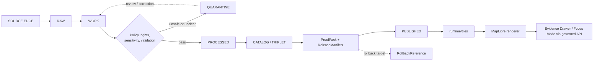

<!-- [KFM_META_BLOCK_V2]
doc_id: kfm://doc/NEEDS-VERIFICATION-runtime-tiles-readme
title: Runtime Tiles
type: standard
version: v1
status: draft
owners: OWNER_TBD
created: 2026-05-02
updated: 2026-05-02
policy_label: NEEDS VERIFICATION
related: [PATH_TBD_AFTER_REPO_INSPECTION, kfm://doc/NEEDS-VERIFICATION-layer-manifest, kfm://doc/NEEDS-VERIFICATION-release-manifest, kfm://doc/NEEDS-VERIFICATION-evidence-bundle]
tags: [kfm, runtime, tiles, maplibre, pmtiles, release, publication, evidence]
notes: [Target path is PROPOSED until mounted repo inspection, Current implementation depth is UNKNOWN, Public release defaults fail closed]
[/KFM_META_BLOCK_V2] -->

# Runtime Tiles

Released, public-safe tile delivery lives here as a downstream runtime surface; tiles are rebuildable delivery artifacts, not KFM truth.


> [!IMPORTANT]
> **Status:** experimental / PROPOSED placement  
> **Owners:** `OWNER_TBD`  
> **Target path:** `runtime/tiles/` — PROPOSED until repo inspection confirms this directory exists  
> **Truth posture:** CONFIRMED KFM doctrine / PROPOSED directory contract / UNKNOWN implementation depth

**Quick jumps:** [Scope](#scope) · [Repo fit](#repo-fit) · [Inputs](#accepted-inputs) · [Exclusions](#exclusions) · [Lifecycle](#tile-lifecycle) · [Tile families](#tile-families) · [Manifests](#manifest-requirements) · [Validation](#validation-checklist) · [Rollback](#rollback)

---

## Scope

`runtime/tiles/` is the proposed home for **runtime-facing tile delivery artifacts, tile manifests, and delivery metadata** used by KFM map clients after data has already passed through governed lifecycle, evidence, policy, validation, review, and release gates.

Tiles in this directory are for rendering, navigation, inspection, and public-safe spatial communication. They are not canonical records, not source truth, not policy decisions, not review decisions, and not evidence by themselves.

> [!CAUTION]
> Do not place `RAW`, `WORK`, `QUARANTINE`, unpublished candidate data, direct canonical-store dumps, secrets, credentials, sensitive exact-location tiles, or unreviewed generated outputs here.

---

## Repo fit

Target path: `runtime/tiles/`

Implementation depth: **UNKNOWN** until the mounted repository is inspected.

| Relationship | PROPOSED path or object | Role | Verification status |
| --- | --- | --- | --- |
| Upstream lifecycle | `data/processed/` | Validated records and derived objects that can feed tiles | NEEDS VERIFICATION |
| Upstream catalog | `data/catalog/` or catalog service | Catalog closure and release metadata | NEEDS VERIFICATION |
| Upstream proof | `release/proofs/` or proof-pack store | Validation, integrity, and policy proof objects | NEEDS VERIFICATION |
| Release control | `release/manifests/` | ReleaseManifest and rollback target | NEEDS VERIFICATION |
| Policy | `policy/` | Rights, sensitivity, public-release, and no-raw-public-path decisions | NEEDS VERIFICATION |
| Contracts | `schemas/contracts/v1/` or repo-native schema home | TileManifest, LayerManifest, EvidenceBundle, ReleaseManifest contracts | CONFLICTED / NEEDS VERIFICATION |
| Runtime delivery | `runtime/tiles/` | Released tile bundles, pointers, and runtime tile metadata | PROPOSED |
| Map shell | MapLibre runtime adapter | Renders released sources and layers | NEEDS VERIFICATION |
| Trust UI | Evidence Drawer / Focus Mode | Resolves clicked features and claims through governed APIs | NEEDS VERIFICATION |
| Public clients | Governed API + released artifacts | Normal public path | CONFIRMED doctrine / UNKNOWN implementation |

Relative links are intentionally not activated in this draft because adjacent repo paths have not been confirmed.

---

## Accepted inputs

The following may belong in `runtime/tiles/` **only after release gates pass**:

| Input | Accepted when | Required support |
| --- | --- | --- |
| `*.pmtiles` | Public-safe semistatic snapshots, offline bundles, or immutable release artifacts | TileManifest, ReleaseManifest, content hash, rights and sensitivity decision |
| Vector tile endpoints or descriptors | Dynamic or server-mediated delivery is required | Server policy, access controls, LayerManifest, cache rules |
| Raster tile descriptors | Raster delivery is derived from validated raster products | Source raster reference, transform receipt, raster policy decision |
| `*.mbtiles` | Local, server-side, or workstation packaging is needed | Not browser-direct by default; must have storage and access decision |
| Tile manifest JSON/YAML | Every tile bundle or endpoint needs inspectable delivery metadata | Schema validation, hashes, release state, rollback target |
| Small public-safe fixtures | Tests or examples need no-network runtime proof | Fixture label, no-sensitive-data proof, test scope |
| Alias files or pointers | Runtime needs stable names such as `current.pmtiles` | Alias receipt, previous target, rollback target |

> [!NOTE]
> Large production tile archives should not be committed to Git unless the mounted repo explicitly supports that storage model. Prefer immutable artifact storage or object storage with manifest pointers when repo policy requires it.

---

## Exclusions

| Do not place here | Why | Put it here instead |
| --- | --- | --- |
| Raw source bytes | Breaks lifecycle separation | `RAW` source store — PATH_TBD_AFTER_REPO_INSPECTION |
| Normalization work products | Not public or release-ready | `WORK` or `PROCESSED` store |
| Quarantined data | Policy, rights, support, or sensitivity unresolved | `QUARANTINE` store |
| Canonical/internal records | Tiles are delivery artifacts, not truth | Canonical domain store or governed API |
| Source descriptors | Source authority belongs in source registry | Source registry path TBD |
| Schemas/contracts | Avoid parallel schema authority | Repo-native schema home TBD |
| Rego/policy files | Policy must not be hidden inside runtime assets | Policy home TBD |
| Secrets, tokens, keys | Runtime tiles may be public/cacheable | Secret manager or infra config |
| Exact sensitive-location tiles | Fails closed by default | Restricted steward surface after policy review |
| Model-generated summaries | Generated language is not evidence | Governed AI envelope and audit receipt |
| Style doctrine | Styles are governed assets, but not evidence | Style registry path TBD |
| Proof packs and receipts | Separate object families preserve auditability | Proof/receipt/release stores TBD |

---

## Tile lifecycle



Runtime tiles enter public or semi-public use only after `PUBLISHED` release state. Any path that serves tiles directly from `RAW`, `WORK`, `QUARANTINE`, or unpublished candidate state is a policy failure.

---

## Tile families

KFM selects tile delivery forms by evidence burden, scale, access class, offline needs, and rollback expectations.

| Family | Best use | KFM posture |
| --- | --- | --- |
| PMTiles | Immutable public-safe snapshots, offline packaging, browser-direct public bundles | Preferred for released semistatic archives when Range/CORS/cache behavior is verified |
| Vector tiles | Large thematic layers where per-feature interaction matters | Default public map pattern when linked back to layer metadata and evidence routes |
| Raster tiles | Imagery-like products, hillshade, classified rasters, heatmaps, flood extent surfaces | Derived delivery surface; not stronger than the raster master |
| COG-backed raster delivery | DEM, remote sensing, flood depth, climate anomaly, or other large raster sources | Keep COG or processed raster object as stronger source; derive tiles with receipts |
| MBTiles | Server-local or workstation-local packaging | Useful behind a tile server; not default browser-direct public path |
| WMS-like overlays | Transitional or external authoritative overlays | Reference use only unless catalog, policy, and evidence route are closed |
| Hybrid static + dynamic | Released tiles plus governed API evidence, dossier, review, or precision overlays | Recommended KFM operating pattern |

---

## Runtime boundary

Map rendering follows this order:

```text
released source -> delivery artifact -> style/source/layer reference -> renderer -> governed UX
```

The renderer may display a feature, but it does not prove that the feature is true, current, rights-cleared, or publishable. Consequential feature claims must route through governed evidence resolution.

### Required runtime rules

1. Use a KFM-owned runtime adapter or equivalent boundary.
2. Treat tiles, style JSON, sprites, glyphs, icons, and fonts as versioned governed assets when they affect public output.
3. Keep business meaning in contracts and metadata registries, not hidden in paint expressions.
4. Preserve source/layer/style separation.
5. Prefer self-controlled delivery where release and policy mediation matter.
6. Use plugins and protocol adapters only from an explicit allow-list.
7. Never let runtime tile paths expose canonical stores or unpublished lifecycle stages.

---

## Manifest requirements

Every tile bundle, endpoint, or alias must be backed by a manifest or manifest-equivalent record.

Required fields may evolve after schema-home verification, but the manifest must answer these questions before publication:

| Question | Required answer |
| --- | --- |
| What is this tile artifact? | `tile_bundle_id`, name, family, version, status |
| What release allows it? | `release_manifest_id`, release state, publication timestamp |
| What generated it? | generator name/version, transform receipts, input artifact IDs |
| What evidence can it support? | supported layer IDs, EvidenceBundle route, source role limits |
| What is its scope? | bounds, CRS/tile matrix, minzoom/maxzoom, temporal scope |
| What is its policy posture? | rights class, sensitivity posture, public/steward/offline class |
| How is integrity checked? | content hash, spec hash, optional signature or proof reference |
| How is it rolled back? | previous bundle, alias target, rollback reference |
| How is it delivered? | URL or storage pointer, cache policy, Range/CORS expectations |
| What must not be inferred? | unsupported claims, precision limits, stale/superseded notes |

### Illustrative manifest sketch

This is illustrative only. Do not treat it as an implemented schema until repo contracts are inspected.

```json
{
  "schema_version": "runtime_tiles.tile_manifest.v1",
  "tile_bundle_id": "tile_RUNTIME_TILES_EXAMPLE_NEEDS_VERIFICATION",
  "status": "RELEASE_CANDIDATE",
  "tile_family": "pmtiles",
  "delivery_class": "public_safe_snapshot",
  "artifact": {
    "path_or_uri": "PATH_TBD_AFTER_RELEASE_MANIFEST",
    "content_hash": "HASH_TBD",
    "size_bytes": "NEEDS_VERIFICATION"
  },
  "scope": {
    "bounds": "BOUNDS_TBD",
    "crs": "EPSG:3857",
    "minzoom": 0,
    "maxzoom": 12,
    "time_basis": "TIME_SCOPE_TBD"
  },
  "governance": {
    "source_descriptor_ids": ["SOURCE_ID_TBD"],
    "processed_artifact_ids": ["PROCESSED_ARTIFACT_ID_TBD"],
    "catalog_record_ids": ["CATALOG_RECORD_ID_TBD"],
    "layer_manifest_ids": ["LAYER_MANIFEST_ID_TBD"],
    "release_manifest_id": "RELEASE_MANIFEST_ID_TBD",
    "proof_pack_id": "PROOF_PACK_ID_TBD",
    "policy_decision_id": "POLICY_DECISION_ID_TBD",
    "rollback_reference_id": "ROLLBACK_REFERENCE_ID_TBD"
  },
  "policy": {
    "rights_class": "NEEDS_VERIFICATION",
    "sensitivity_posture": "NEEDS_VERIFICATION",
    "public_release_allowed": false
  },
  "runtime": {
    "range_requests_required": true,
    "cors_required": true,
    "cache_policy": "CACHE_POLICY_TBD",
    "evidence_route": "GOVERNED_API_ROUTE_TBD"
  },
  "limits": [
    "Tiles are delivery artifacts, not canonical truth.",
    "Feature claims require EvidenceBundle resolution.",
    "Exact sensitive locations are denied unless policy and review allow release."
  ]
}
```

---

## Naming and identity

PROPOSED naming pattern until repo convention is confirmed:

```text
<domain_or_layer>.<scope>.<release_or_date>.<public_class>.<family>
```

Examples:

| Example | Meaning |
| --- | --- |
| `hydrology.huc12.ks.release-YYYYMMDD.public.pmtiles` | Released Kansas HUC12 public-safe snapshot |
| `hazards.flood_context.ks.release-YYYYMMDD.public.pmtiles` | Released public flood-context tiles |
| `habitat.public_generalized.ks.release-YYYYMMDD.public.pmtiles` | Generalized public habitat surface |

Do not use filenames to encode authority. Authority comes from source role, catalog closure, policy decision, review state, ReleaseManifest, and EvidenceBundle routes.

---

## Access posture

| Surface | Default |
| --- | --- |
| Public browser-direct tiles | Allow only released, public-safe, rights-cleared, cache-safe artifacts |
| Steward-only tiles | Require authenticated governed delivery and explicit policy decision |
| Restricted or sensitive tiles | DENY public release; serve only through approved restricted surfaces if policy allows |
| Exact sensitive-location tiles | DENY by default |
| Unpublished candidates | DENY public path |
| RAW / WORK / QUARANTINE | DENY public path |
| Alias changes | Require receipt and rollback target |

---

## Maintainer quickstart

No package-manager, test-runner, or tile-build command is listed because repo tooling is **UNKNOWN**.

Before activating this directory:

1. Confirm `runtime/tiles/` exists or create it through the repo’s normal PR process.
2. Confirm whether large tile artifacts belong in Git, object storage, release assets, or another artifact store.
3. Confirm schema home for `TileManifest` and `LayerManifest`.
4. Confirm policy engine and validator runner.
5. Confirm MapLibre adapter path and public delivery mechanism.
6. Confirm PMTiles Range/CORS behavior if browser-direct delivery is used.
7. Confirm release, proof, receipt, catalog, and rollback object locations.
8. Add only a no-network public-safe fixture first.
9. Validate manifests, hashes, rights, sensitivity, and rollback.
10. Wire one released layer to Evidence Drawer through governed API resolution.

---

## Validation checklist

- [ ] Target path `runtime/tiles/` confirmed in mounted repo.
- [ ] Owners confirmed.
- [ ] Large-artifact storage policy confirmed.
- [ ] Schema home confirmed; no parallel schema authority created.
- [ ] TileManifest or equivalent schema exists.
- [ ] LayerManifest or equivalent schema exists.
- [ ] ReleaseManifest and rollback target exist before publication.
- [ ] ProofPack or equivalent validation record exists.
- [ ] Rights class allows the intended release class.
- [ ] Sensitivity review allows the intended precision and public surface.
- [ ] No `RAW`, `WORK`, `QUARANTINE`, or canonical-store path is exposed.
- [ ] Hashes are stable and recorded.
- [ ] PMTiles Range/CORS/cache behavior is verified when browser-direct.
- [ ] MapLibre source/layer/style references are versioned.
- [ ] Evidence Drawer can resolve clicked features through a governed API.
- [ ] Focus Mode returns `ANSWER`, `ABSTAIN`, `DENY`, or `ERROR` with citation/audit behavior.
- [ ] Exported artifacts preserve trust cues, policy context, freshness, correction, and provenance.
- [ ] Rollback drill successfully restores the previous alias or delivery pointer.

---

## Rollback

Rollback is required when a tile artifact:

- exposes restricted or sensitive geometry,
- serves from `RAW`, `WORK`, `QUARANTINE`, or unpublished state,
- loses evidence or policy linkage,
- has broken hash or manifest integrity,
- ships with wrong rights or attribution posture,
- silently changes public meaning,
- strips trust cues from export or story surfaces,
- bypasses governed API resolution,
- or cannot be mapped to a prior release state.

Rollback target: `ROLLBACK_TARGET_TBD_AFTER_RELEASE_MANIFEST`

Preferred rollback action:

1. Stop serving the affected alias or route.
2. Repoint to the previous released manifest target.
3. Preserve the failed manifest, validation report, and rollback receipt.
4. Emit a `CorrectionNotice` when public state or public claims were affected.
5. Rebuild only after the defect is fixed and promotion gates pass again.

---

## Anti-patterns

- Treating PMTiles as authoritative truth.
- Letting style paint expressions encode business meaning that belongs in contracts.
- Shipping a layer without release, proof, policy, and rollback records.
- Serving sensitive exact locations through public browser-direct tiles.
- Creating a second schema home inside `runtime/tiles/`.
- Using tile availability as evidence support.
- Allowing MapLibre click results to answer consequential claims without EvidenceBundle resolution.
- Letting cache convenience outrank correction, withdrawal, or rollback.
- Publishing fixture tiles as if they were production release artifacts.

---

## Evidence boundary

| Source | Status | Supports | Limits |
| --- | --- | --- | --- |
| KFM Pipeline Living Implementation Manual v0.3 | CONFIRMED doctrine / UNKNOWN implementation | Lifecycle law, public clients through governed APIs, derivative-not-truth rule, release and rollback posture | Does not prove this directory exists |
| KFM MapLibre UI Architecture and Governed Interaction Design | CONFIRMED doctrine / PROPOSED realization | MapLibre runtime boundary, Evidence Drawer, Focus Mode, layer/source/style governance, PMTiles use cases | Does not prove implementation files, routes, or package pins |
| KFM MapLibre Operating Architecture Manual | CONFIRMED doctrine / PROPOSED implementation | Renderer boundary, delivery strategy, plugin governance, security and verification backlog | Does not prove current runtime behavior |
| KFM Components Pass lineage | LINEAGE / CORPUS-CONFIRMED doctrine | Inspectable-claim center, artifactization pressure, proof-object vocabulary | Repetition is continuity, not implementation proof |
| Current workspace inspection | CONFIRMED no mounted repo | Implementation claims must remain bounded | Cannot verify target repo conventions |

---

## FAQ

### Are tiles evidence?

No. Tiles can point to evidence, carry feature identifiers, and render released spatial products, but consequential claims require EvidenceBundle resolution.

### Can public clients read tile archives directly?

Only when the tile archive is released, public-safe, rights-cleared, cache-safe, and backed by a manifest. Evidence, dossier, Focus, review, and export functions still go through governed APIs.

### Can this directory contain generated tiles before release?

Only as clearly labeled fixtures or release candidates with no public path. Anything unsafe, rights-unclear, or unsupported belongs in `WORK` or `QUARANTINE`, not public runtime delivery.

### What is the smallest safe first slice?

A single public-safe no-network fixture with a manifest, hash, release-candidate record, denied-publication default, and rollback target. The first real published slice should prove source-to-public trust continuity before adding more layers.

---

## Open verification items

- [ ] Confirm `runtime/tiles/README.md` is the correct target path.
- [ ] Confirm owner or owning team.
- [ ] Confirm whether this README should also be indexed by the documentation control plane.
- [ ] Confirm tile artifact storage policy.
- [ ] Confirm TileManifest and LayerManifest schema names.
- [ ] Confirm release/proof/receipt/catalog object homes.
- [ ] Confirm MapLibre runtime adapter path.
- [ ] Confirm PMTiles protocol adapter and plugin allow-list.
- [ ] Confirm public/steward/restricted access classes.
- [ ] Confirm rollback and correction notice workflow.

[Back to top](#runtime-tiles)
