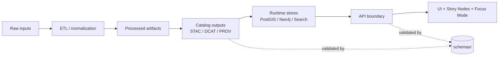

# 📐 `schemas/` — Contract Artifacts (KFM)

**JSON Schema + SHACL shapes that define KFM’s machine-verifiable boundaries**  
<sub><em>Contract-first • Evidence-first • Fail-closed validation</em></sub>

<br/>


</div>

---

## 🔗 Quick links

- [What belongs here](#-what-belongs-here)
- [Directory layout](#-directory-layout)
- [Contract surfaces](#-contract-surfaces)
- [Validation & CI gates](#-validation--ci-gates)
- [How to add or change a schema](#-how-to-add-or-change-a-schema)
- [Versioning rules](#-versioning-rules)
- [Design principles](#-design-principles)

---

## 🎯 Why `schemas/` exists

`schemas/` is the **canonical home for contract artifacts** that make KFM’s pipeline and interfaces **machine-checkable**.

If metadata or structured outputs do not validate against these contracts, KFM treats it as a **hard failure**: the system **fails closed** and blocks promotion/publication until fixed.

> [!IMPORTANT]
> In KFM, schemas are **boundary artifacts**:
> - producers must emit conforming objects
> - consumers may trust the shape (and still apply governance/policy)
> - breaking schema changes must be versioned intentionally

---

## ✅ What belongs here

### In scope
- **JSON Schema** for structured JSON / JSON-LD artifacts (preferred default)
- **SHACL shapes** for graph-aligned constraints and RDF/linked-data validation (when appropriate)
- Contracts for:
  - STAC Items/Collections
  - DCAT datasets / catalog views
  - PROV lineage bundles
  - Story Node structured payloads (and/or front-matter-as-data projections)
  - UI configuration payloads
  - Telemetry event envelopes and event types

### Out of scope
- pipeline code → `src/pipelines/`
- graph ingest/migrations → `src/graph/`
- server implementation → `src/server/`
- UI source code → `web/`
- generated artifacts (validated outputs) → `data/**`

---

## 🗂️ Directory layout

```text
schemas/
├── stac/         # STAC Items/Collections (profiles + extensions)
├── dcat/         # DCAT dataset/cat views (JSON-LD constraints)
├── prov/         # W3C PROV lineage bundle constraints
├── storynodes/   # Story Node data contracts (structured payloads)
├── ui/           # UI config contracts (layers, registries, feature flags)
└── telemetry/    # Audit/telemetry event contracts (envelopes + types)
```

<details>
<summary><strong>📎 Naming conventions</strong> (click to expand)</summary>

- Prefer stable, explicit filenames: `kfm_<domain>_<artifact>__v<MAJOR>.schema.json`
  - Example: `kfm_stac_item__v1.schema.json`
- Keep schemas **small and composable**:
  - use `$id`, `$ref`, and shared `defs/` (if you introduce a `defs/` folder, do so consistently per domain)
- If a schema enforces a KFM “profile” over a community standard:
  - include a short README in that folder explaining the delta and why it exists

</details>

---

## 🧩 Contract surfaces

The table below is a quick “map” of what these contracts guard.

| Domain | Contract protects | Typical producer | Typical consumer |
|---|---|---|---|
| `stac/` | STAC Item/Collection shape, required KFM fields, links to assets | `src/pipelines/**` | graph ingest, API catalog endpoints, UI discovery |
| `dcat/` | DCAT dataset discovery payloads | `src/pipelines/**` | API catalog endpoints, external catalog exporters |
| `prov/` | lineage bundle structure, run/process linking | pipeline runners / ETL | governance audits, reproducibility tooling |
| `storynodes/` | Story Node structured payloads + publishable metadata | story tooling / docs pipeline | UI Story mode, Focus Mode context bundles |
| `ui/` | layer registries, map configs, feature flags | UI build tooling / API | web UI runtime |
| `telemetry/` | event envelopes/types for audit trails | API + UI | governance review, monitoring |

---

## 🧭 Where schemas sit in the “truth path”



---

## 🧪 Validation & CI gates

Schemas are referenced by validation tooling and CI gates. Expected behaviors:

- **Documentation front-matter validation**: docs may be required to include valid YAML front-matter.
- **Structured output validation**: STAC/DCAT/PROV and other structured payloads must validate against schemas before merge/promotion.
- **Fail-closed behavior**: missing required fields, invalid enums, or malformed shapes should break the build.

> [!TIP]
> Treat schema validation errors like compilation errors: fix the contract mismatch *or* explicitly version a new contract.

---

## 🛠️ How to add or change a schema

### 1) Choose the correct domain
- STAC → `schemas/stac/`
- DCAT → `schemas/dcat/`
- PROV → `schemas/prov/`
- Story Nodes → `schemas/storynodes/`
- UI config → `schemas/ui/`
- Telemetry → `schemas/telemetry/`

### 2) Add the schema file(s)
Checklist:
- [ ] `$id` is set and stable (do not reuse `$id` across versions)
- [ ] `title`/`description` clearly state what is being constrained
- [ ] Examples exist (fixtures or documented example payloads)
- [ ] References use `$ref` rather than copy/paste duplication

### 3) Wire it into validation
- Ensure the validator (in `tools/` and/or pipeline code) points to the new schema.
- Ensure CI jobs validate the relevant artifact type against the schema.

### 4) Add/update tests
- Include at least:
  - one **valid** fixture
  - one **invalid** fixture that fails for the intended reason

---

## 🔁 Versioning rules

### Non-breaking changes (allowed within same major)
- adding optional fields
- widening enums safely (only if downstream logic can tolerate it)
- relaxing constraints without changing meaning

### Breaking changes (requires new major)
- renaming/removing required fields
- tightening constraints such that previously valid artifacts become invalid
- semantic meaning changes that impact downstream interpretation

> [!WARNING]
> Schema changes are API-adjacent changes. If it can break ingestion, publishing, or UI rendering, version it.

---

## 🧠 Design principles

1. **Contracts before convenience**  
   Schemas are the “law” of structured payloads — tools and pipelines conform.

2. **Provenance-first**  
   Where applicable, require fields that support traceability (source refs, run ids, lineage links).

3. **Governance-aware**  
   Contracts should carry classification/sensitivity hooks where the system must enforce policy.

4. **Composable, not monolithic**  
   Prefer small schemas with shared definitions; avoid one giant schema per domain.

5. **Humans still matter**  
   A schema being valid does not mean it is *ethical* or *publishable* — policy gates still apply.

---

