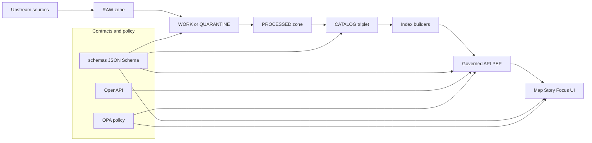

<!-- [KFM_META_BLOCK_V2]
doc_id: kfm://doc/2f0a2b0a-7b4e-4c66-9b4f-8de9f03213ae
title: schemas — governed contract artifacts (JSON Schema)
type: standard
version: v2
status: draft
owners: TBD
created: 2026-02-28
updated: 2026-03-01
policy_label: public
related:
  # NOTE: Paths are repo-relative and MUST be verified against the live repo tree.
  - docs/standards/KFM_MARKDOWN_WORK_PROTOCOL.md # verify
  - docs/standards/KFM_DCAT_PROFILE.md # verify
  - docs/standards/KFM_STAC_PROFILE.md # verify
  - docs/standards/KFM_PROV_PROFILE.md # verify
  - policy/opa/ # verify
  - contracts/openapi/ # verify
tags: [kfm, schemas, contracts, governance]
notes:
  - Contract-first: schemas are first-class artifacts; changes must be versioned and tested.
  - Promotion Contract: schema + contract tests are part of the fail-closed promotion gates.
[/KFM_META_BLOCK_V2] -->

# KFM Schemas
Machine-validated **JSON Schema contracts** that make KFM pipelines, catalogs, policy gates, and governed APIs **testable, fail-closed, and evidence-first**.


 <!-- TODO: replace with real workflow badge -->

> **Why this folder exists**
>
> KFM governance is enforced by construction: **write contracts first**, then enforce them via **policy + CI gates**, then surface them in **API/UI evidence drawers**.
>
> If it’s not validated, it’s not promotable. If it’s not promotable, it’s not publishable.

---

## Quick navigation
- [What lives here](#what-lives-here)
- [Where this fits in KFM](#where-this-fits-in-kfm)
- [Directory layout](#directory-layout)
- [Naming and versioning](#naming-and-versioning)
- [Schema authoring rules](#schema-authoring-rules)
- [Promotion Contract mapping](#promotion-contract-mapping)
- [Validation and CI wiring](#validation-and-ci-wiring)
- [Schema registry](#schema-registry)
- [Adding or changing a schema](#adding-or-changing-a-schema)
- [Exclusions](#exclusions)
- [Minimum verification steps](#minimum-verification-steps)

---

## What lives here
This directory contains **canonical JSON Schemas** for **cross-boundary payloads** in KFM.

A payload belongs here when it is consumed across at least two of these boundaries:

- pipeline code ↔ CI gates
- pipeline code ↔ policy (OPA) checks
- pipeline code ↔ governed API
- governed API ↔ UI evidence drawers
- UI publishing ↔ story / citation validation

Typical schema subjects include:

- **Run receipts**: typed “what happened” records emitted by every ingest/transform/publish run
- **Promotion manifests**: promotion-focused rollups (artifacts + digests + approvals) used to publish safely
- **Watcher entries**: allow-listed automated fetchers (watchers) with a deterministic spec hash and (optional) signing

If a pipeline run, promotion gate, API endpoint, or evidence surface depends on a JSON payload shape,
**that payload shape MUST be validated** and therefore belongs here (or in a clearly documented sibling contract directory that is linked from the [Schema registry](#schema-registry)).

---

## Where this fits in KFM
Schemas sit on the **trust membrane**: they make promotion gates and runtime policy enforcement **automatable** and **fail-closed**.



### Boundary rules
- Clients **MUST NOT** read storage or databases directly; all access goes through the governed API boundary.
- Promotion **MUST** be blocked unless required artifacts exist **and validate**.
- Schema validation is necessary but not sufficient: policy checks and link integrity checks are also required.

---

## Directory layout
This folder should remain **small and canonical**.

### Required
```text
schemas/
  README.md                       # this file
  run_receipt.v1.schema.json
  run_manifest.v1.schema.json
  watcher.v1.schema.json
```

### Recommended
```text
schemas/
  _fixtures/                      # small JSON fixtures used by contract tests
    run_receipt/
      minimal.pass.json
      missing_spec_hash.fail.json
    run_manifest/
      minimal.pass.json
  _shared/                        # shared $defs, if you actually need them
    kfm_core.v1.schema.json
```

> TIP: Generated artifacts (TypeScript types, Python models) are **rebuildable** and should live in the owning module/package, not here (see [Exclusions](#exclusions)).

---

## Naming and versioning

### File naming
**MUST** use explicit major versioning in file names:

- `name.v1.schema.json`
- `name.v2.schema.json`

Examples:
- `run_receipt.v1.schema.json`
- `run_manifest.v1.schema.json`
- `watcher.v1.schema.json`

### `$id` and `$schema`
**MUST**:
- Use JSON Schema **draft 2020-12** unless the repo standard explicitly differs.
- Provide a stable `$id` that includes the **major version**.

Example pattern:

```json
{
  "$id": "https://kfm.org/schemas/run_receipt.v1.json",
  "$schema": "https://json-schema.org/draft/2020-12/schema"
}
```

### Compatibility rules
- **Breaking changes** ⇒ **new major** (`v2`) and new `$id`
  - Removing required fields
  - Renaming fields
  - Narrowing types/constraints in a way that rejects previously valid payloads
- **Non-breaking changes** ⇒ keep major, but still require tests
  - Adding optional fields
  - Widening enums/constraints
  - Adding new definitions that do not invalidate existing instances

> RULE: No breaking changes without a **version bump**.

---

## Schema authoring rules

### Defaults that make governance enforceable
**SHOULD** (default posture for KFM contracts):
- `"type": "object"`
- `"additionalProperties": false` or `"unevaluatedProperties": false`
- Explicit `"required": [...]`
- Prefer `"const"` and `"enum"` for protocol version fields (fail closed)
- Use `"format"` for timestamps and URIs where your validator enforces it
- Patterns for IDs (lowercase + delimiters), e.g. `^[a-z0-9:_-]+$`
- Machine-checkable invariants (timestamp bounds, digest formats, media types)

### Deterministic identity and hashing
Where relevant, contracts **SHOULD** include fields that support deterministic identity:

- `dataset_id` and `dataset_version_id`
- `spec_hash` for the run spec/config (canonicalized before hashing)
- Content digests (e.g., `sha256:<hex>`) for inputs and outputs

### Make schema intent visible
**SHOULD**:
- set `title` + `description` on root and major `$defs`
- include a minimal `examples` array for humans
- add `$comment` for subtle invariants that are enforced in policy tests

---

## Promotion Contract mapping
Schemas are a concrete dependency of the Promotion Contract gates. Keep this mapping explicit so CI and reviewers know what breaks when a contract changes.

| Promotion gate | What it checks | Typical schema dependencies |
|---|---|---|
| Identity and versioning | IDs + deterministic spec hash + digests | `run_receipt.*`, `run_manifest.*`, watcher entry schemas |
| Licensing and rights metadata | License fields exist; terms snapshot recorded | (depends on the payload family; often manifests + registry entries) |
| Sensitivity classification and redaction plan | `policy_label` assigned; obligations honored | payload schemas that carry policy labels/obligations |
| Catalog triplet validation | DCAT/STAC/PROV validate + cross-link | schemas for receipts/manifests plus catalog validators elsewhere |
| Run receipt and audit record | Every run emits a receipt; audit is append-only | `run_receipt.*` |

> NOTE: DCAT/STAC/PROV validation typically uses their own profiles; link them in `related:` and in the [Schema registry](#schema-registry).

---

## Validation and CI wiring

### Local validation example
Run schema validation locally in one of these typical ways (adapt to repo tooling):

- Node validator (Ajv):
  - `npx ajv-cli validate -s schemas/run_receipt.v1.schema.json -d schemas/_fixtures/run_receipt/minimal.pass.json`

- Policy gate checks (Conftest + OPA):
  - `conftest test schemas/_fixtures/run_receipt/minimal.pass.json -p policy/opa`

### CI expectations
CI SHOULD:
- Validate all fixtures/examples against their schemas
- Run policy checks that depend on schema invariants (deny-by-default)
- Run link integrity checks when contracts reference other artifacts (EvidenceRefs, catalog links)
- Block merge on:
  - schema invalidation
  - broken `$id` or versioning rules
  - contract-test regressions

---

## Schema registry
Keep this table updated as schemas are added/changed.

| Schema file | Purpose | Version | Promotion gates | Key invariants | Primary consumers |
|---|---|---:|---|---|---|
| `run_receipt.v1.schema.json` | Per-run receipt for inputs/outputs/tooling/policy decisions | v1 | Identity + receipts/audit | `dataset_version_id`, `spec_hash`, digests, timestamps | CI gates, policy pack, evidence resolver, receipt viewer |
| `run_manifest.v1.schema.json` | Promotion record that ties artifacts, digests, and approvals together | v1 | Identity + release/publish | digests for all promoted artifacts; approvals when required | Promotion workflow, release automation, PR gate |
| `watcher.v1.schema.json` | Allow-list entry for automated watchers | v1 | Identity + upstream governance | deterministic spec hash; endpoint URI; schedule | CI watcher gate, ingest dispatch, Focus Mode safety |

> NOTE: If other schema families live elsewhere (OpenAPI, dataset registry entry schemas, Story Node schemas),
> link them from here, but keep **this directory** focused on canonical JSON Schemas.

---

## Adding or changing a schema
Checklist for a PR-sized change that is reversible:

- [ ] Create/update the `*.vN.schema.json` file
- [ ] Add or update fixtures that MUST validate (or MUST fail)
- [ ] Add/adjust CI contract tests to validate fixtures and enforce versioning rules
- [ ] If breaking change: create `v(N+1)` schema, keep old major in place
- [ ] Update the [Schema registry](#schema-registry) table
- [ ] If used by policy: update Rego tests and ensure deny-by-default still holds
- [ ] If used by runtime: update validators/DTO generation and add compatibility notes

---

## Exclusions
Do **NOT** put these in `schemas/`:

- OpenAPI specs (keep under `contracts/openapi/` or equivalent)
- Policy code (keep under `policy/opa/` or equivalent)
- Generated types (TypeScript / Python models) — generate into the owning package/module
- Large sample datasets — keep in `examples/` or `data/` zones
- One-off JSON examples without tests — if it matters, it needs a fixture + validation

---

## Minimum verification steps
If you’re unsure how this folder is wired in the current repo, do the smallest checks that remove ambiguity:

1) Capture repo commit hash and root directory tree (so links in this README can be made real)  
2) Find the schema validator in CI (Ajv, jsonschema, custom) and confirm it blocks merges  
3) Confirm which Promotion Contract gates are enforced today (and which are aspirational)  
4) Confirm which payload families are treated as contracts (receipts, manifests, watcher entries, registry entries)  
5) Confirm link-checking strategy for cross-artifact references (EvidenceRefs, catalog hrefs)

---

<p align="right"><a href="#kfm-schemas">Back to top</a></p>
