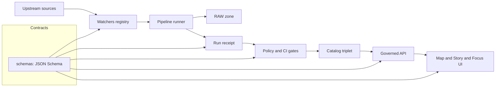

<!-- [KFM_META_BLOCK_V2]
doc_id: kfm://doc/2f0a2b0a-7b4e-4c66-9b4f-8de9f03213ae
title: schemas — governed contract artifacts (JSON Schema)
type: standard
version: v1
status: draft
owners: TBD
created: 2026-02-28
updated: 2026-02-28
policy_label: public
related:
  - docs/standards/KFM_MARKDOWN_WORK_PROTOCOL.md # TODO: verify path/name
  - policy/opa/ # TODO: verify path/name
  - contracts/openapi/ # TODO: verify path/name
tags: [kfm, schemas, contracts, governance]
notes:
  - Contract-first: schemas are first-class artifacts; changes must be versioned and tested.
[/KFM_META_BLOCK_V2] -->

# KFM Schemas
Machine-validated **contracts** (JSON Schema) that make KFM pipelines, catalogs, and governed APIs **testable, fail-closed, and evidence-first**.


> **Why this folder exists**
>
> KFM governance is enforced by construction: **write contracts first**, then enforce them via **policy + CI gates**, then surface them in **API/UI evidence drawers**.
> If it’s not validated, it’s not promotable. If it’s not promotable, it’s not publishable.

---

## Quick navigation
- [What lives here](#what-lives-here)
- [Where schemas plug in](#where-schemas-plug-in)
- [Directory layout](#directory-layout)
- [Naming and versioning](#naming-and-versioning)
- [Schema authoring rules](#schema-authoring-rules)
- [Validation and CI wiring](#validation-and-ci-wiring)
- [Schema registry](#schema-registry)
- [Adding or changing a schema](#adding-or-changing-a-schema)
- [Exclusions](#exclusions)
- [Minimum verification steps](#minimum-verification-steps)

---

## What lives here
This directory contains **contract artifacts** expressed as **JSON Schema**.

Typical schema subjects in KFM include (examples):
- **Run receipts**: typed “what happened” records emitted by every ingestion/transform run
- **Run manifests**: promotion-focused rollups that carry rights + signatures/attestations
- **Watchers registry entries**: a signed allow-list of automated fetchers (“watchers”)

If a pipeline run, promotion gate, API endpoint, or UI evidence surface depends on a JSON payload,
**that payload shape belongs here** (or in a clearly documented sibling contract directory).

---

## Where schemas plug in
Schemas are a **shared boundary** across pipeline code, policy, CI, and runtime surfaces.



---

## Directory layout

**Recommended skeleton (example; align to your repo wiring):**

```text
schemas/
  README.md
  run_receipt.v1.schema.json
  run_manifest.v1.schema.json
  watcher.v1.schema.json
  # add more schemas as needed…
```

> TIP: Keep this folder **small and canonical**. If other parts of the repo need generated code
> (e.g., TypeScript types), generate those elsewhere (see [Exclusions](#exclusions)).

---

## Naming and versioning

### File naming
**MUST**: use explicit major versioning in file names:

- `name.v1.schema.json`
- `name.v2.schema.json`

Examples:
- `run_receipt.v1.schema.json`
- `watcher.v1.schema.json`

### `$id` and `$schema`
**MUST**:
- Use JSON Schema **draft 2020-12** (unless a repo-wide standard says otherwise).
- Provide a stable `$id` that includes the **major version**.

Example pattern:

```json
{
  "$id": "https://kfm.org/schemas/watcher.v1.json",
  "$schema": "https://json-schema.org/draft/2020-12/schema"
}
```

### Compatibility rules (fail closed)
- **Breaking changes** ⇒ **new major** (`v2`) and new `$id`
  - Removing required fields
  - Renaming fields
  - Narrowing types/constraints in a way that rejects previously valid payloads
- **Non-breaking changes** ⇒ keep major, but still require tests
  - Adding optional fields
  - Widening enums/constraints
  - Adding new definitions that do not invalidate existing instances

> RULE: No breaking changes without a **version bump**.

---

## Schema authoring rules

### Defaults that make governance enforceable
**SHOULD** (default posture):
- `"type": "object"`
- `"additionalProperties": false` (or `unevaluatedProperties: false` where appropriate)
- Explicit `"required": [...]`
- Patterns for IDs (lowercase + delimiters), e.g. `^[a-z0-9:_-]+$`
- Machine-checkable invariants (timestamps, digest formats, URI formats)

### Deterministic identity
Where relevant, contracts **SHOULD** include:
- `spec_hash`: deterministic identifier for the run spec / config (canonicalized before hashing)
- `subject` or artifact digests as **content digests** (avoid “tag-only” references)

These enable CI/policy to verify “what ran” and “what bytes were produced” without guessing.

---

## Validation and CI wiring

### Local validation (example)
Run schema validation locally in one of these typical ways (adapt to repo tooling):

- Using a JSON Schema validator (Node):
  - `npx ajv-cli validate -s schemas/run_receipt.v1.schema.json -d path/to/run_receipt.json`

- Using policy gates (example with Conftest):
  - `conftest test path/to/run_receipt.json -p policy/opa`

### CI expectations
CI SHOULD:
- Validate all fixtures/examples against their schemas
- Run policy checks that *depend on schema invariants* (deny-by-default)
- Block merge on:
  - schema invalidation
  - broken `$id` / versioning rules
  - contract-test regressions

---

## Schema registry

Keep this table updated as schemas are added/changed.

| Schema file | Purpose | Versioning | Key invariants (examples) | Primary consumers |
|---|---|---:|---|---|
| `run_receipt.v1.schema.json` | Contract for per-run receipts (inputs/outputs/checks/timestamps) | v1 | `spec_hash` present; timestamps bound run; checks interpreted fail-closed | CI gates, policy pack, provenance/evidence surfaces |
| `run_manifest.v1.schema.json` | Promotion-focused rollup (rights + signatures/attestations + artifact refs) | v1 | rights present; signature/attestation refs present when required | Promotion/release workflow, PR gate |
| `watcher.v1.schema.json` | Signed allow-list entry for automated watchers | v1 | `spec_hash` + `signature_ref` required; endpoint URI; poll policy | CI watcher gate, Focus Mode safety |

> NOTE: If other schema families live elsewhere (e.g., OpenAPI, STAC profiles, registry entries),
> link them from here, but keep **this directory** focused on canonical JSON Schemas.

---

## Adding or changing a schema
Checklist (PR-sized, reversible):

- [ ] Create/update the `*.vN.schema.json` file
- [ ] Add or update **fixtures** that MUST validate
- [ ] Add/adjust CI contract tests to validate fixtures (fail closed)
- [ ] If breaking change: create `v(N+1)` schema, keep old major in place
- [ ] Update the [Schema registry](#schema-registry) table
- [ ] If used by policy: update Rego tests and ensure deny-by-default still holds
- [ ] If used by runtime: update DTO generation / validators and add compatibility notes

---

## Exclusions
Do **NOT** put these in `schemas/`:

- OpenAPI specs (keep under `contracts/openapi/` or equivalent)
- Policy code (keep under `policy/opa/` or equivalent)
- Generated types (TypeScript / Python models) — generate into the owning package/module
- Large sample datasets — keep in `examples/` or `data/` zones
- One-off JSON examples without tests — if it matters, it needs a fixture + validation

---

## Minimum verification steps
If you’re unsure how this folder is wired in your current repo state, do the smallest checks that remove ambiguity:

1) Capture repo root tree (so paths in this README can be made real)  
2) Find the schema validator in CI (Ajv, jsonschema, custom)  
3) Confirm which promotion gates are currently enforced  
4) Confirm which payloads are treated as “contracts” (run receipts, watcher entries, registry entries, etc.)

---

<p align="right"><a href="#kfm-schemas">Back to top</a></p>
