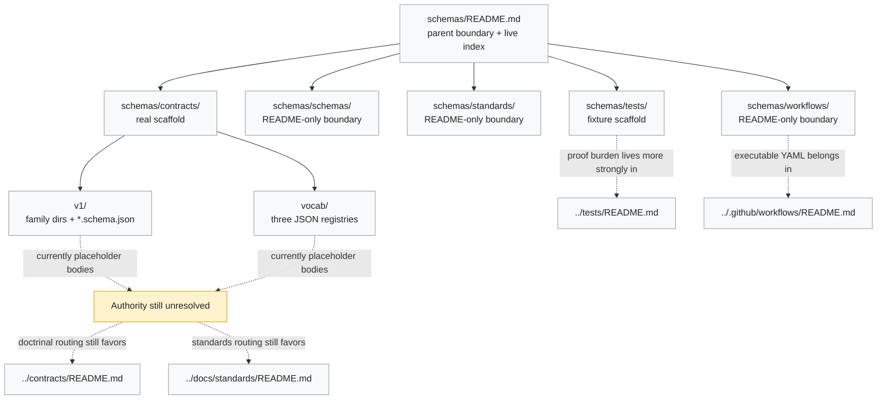

<!-- [KFM_META_BLOCK_V2]
doc_id: kfm://doc/NEEDS-VERIFICATION
title: Schemas
type: standard
version: v1
status: draft
owners: @bartytime4life
created: YYYY-MM-DD
updated: 2026-04-03
policy_label: public
related: [../README.md, ../contracts/README.md, ../docs/standards/README.md, ../policy/README.md, ../tests/README.md, ../tests/contracts/README.md, ../.github/workflows/README.md, ../.github/CODEOWNERS, ./contracts/README.md, ./schemas/README.md, ./standards/README.md, ./tests/README.md, ./workflows/README.md]
tags: [kfm, schemas, contracts, json-schema, scaffolds]
notes: [doc_id unresolved, created date not reverified from public history, owner currently resolves via CODEOWNERS global fallback, parent inventory reconciled to the live public-main subtree, canonical schema-home authority remains unresolved]
[/KFM_META_BLOCK_V2] -->

# Schemas

Parent boundary and live-tree index for the public `schemas/` scaffold while KFM reconciles real machine-file placement with unresolved schema-home authority.

> **Status:** experimental · **Doc status:** draft  
> **Owners:** `@bartytime4life` *(via current public `CODEOWNERS` global fallback; no narrower `/schemas/` rule was directly verified on public `main`)*  
>        
> **Repo fit:** path `schemas/README.md` · upstream [`../README.md`](../README.md) · nested lanes [`./contracts/README.md`](./contracts/README.md), [`./schemas/README.md`](./schemas/README.md), [`./standards/README.md`](./standards/README.md), [`./tests/README.md`](./tests/README.md), [`./workflows/README.md`](./workflows/README.md) · adjacent root lanes [`../contracts/README.md`](../contracts/README.md), [`../docs/standards/README.md`](../docs/standards/README.md), [`../policy/README.md`](../policy/README.md), [`../tests/README.md`](../tests/README.md), [`../.github/workflows/README.md`](../.github/workflows/README.md)  
> **Quick jumps:** [Scope](#scope) · [Repo fit](#repo-fit) · [Inputs](#inputs) · [Exclusions](#exclusions) · [Directory tree](#directory-tree) · [Quickstart](#quickstart) · [Usage](#usage) · [Diagram](#diagram) · [Tables](#tables) · [Task list](#task-list--definition-of-done) · [FAQ](#faq) · [Appendix](#appendix)

> [!IMPORTANT]
> Current public `main` no longer shows `schemas/` as `README.md`-only. The parent lane now visibly contains `contracts/`, `schemas/`, `standards/`, `tests/`, `workflows/`, and `README.md`.

> [!WARNING]
> Machine-file presence under `schemas/contracts/` does **not** settle canonical authority. Adjacent public docs still route machine contracts more strongly toward [`../contracts/`](../contracts/) and keep schema-home authority unresolved.

> [!NOTE]
> This parent README now needs to do two things at once: keep the anti-drift boundary visible **and** index the live subtree honestly. Understating the current tree is no longer safer; it is now a documentation bug.

## Scope

`schemas/` is no longer just a warning sign.

On current public `main`, it is a parent lane with visible children. Some of those children are still documentary; one of them (`./contracts/`) is already machine-file-bearing. That means this README can no longer safely describe the subtree as a single-file boundary surface. It now has to index the live tree, separate scaffold reality from settled authority, and keep contributors from treating visible files as automatic law.

This file should now do five jobs well:

- record the current public tree without overclaiming maturity
- keep KFM’s contract-first and trust-membrane doctrine intact
- distinguish **branch-visible machine files** from **settled canonical authority**
- route contributors toward the right child lane instead of turning the parent into a catch-all
- prevent silent duplication across `schemas/`, `contracts/`, `policy/`, `tests/`, and workflow control surfaces

KFM’s doctrine is still the same: machine-readable trust objects matter because the system’s value unit is the inspectable claim, not merely a fluent answer or map surface. Singular authority matters just as much as good schema design. A validator cannot safely govern two competing homes for the same trust-bearing family.

### Truth posture used here

| Marker | Meaning in this README |
|---|---|
| **CONFIRMED** | Directly visible on current public `main` or strongly grounded in adjacent public KFM docs |
| **INFERRED** | Conservative interpretation of confirmed tree shape or neighboring docs, but not formally resolved as repo law |
| **PROPOSED** | Safe next-step guidance that fits KFM doctrine and current repo reality, but is not presented as settled implementation |
| **UNKNOWN / NEEDS VERIFICATION** | Authority, workflow, validator, platform-setting, or branch-local detail that is not directly proven here |

[Back to top](#schemas)

## Repo fit

| Item | Value |
|---|---|
| Path | `schemas/README.md` |
| Role | Parent boundary and inventory README for the public `schemas/` subtree |
| Current public snapshot | `./contracts/`, `./schemas/`, `./standards/`, `./tests/`, `./workflows/`, `README.md` |
| Strongest doctrinal machine-contract signal | [`../contracts/README.md`](../contracts/README.md) and [`../docs/standards/README.md`](../docs/standards/README.md) still route machine contracts more strongly toward root `contracts/` |
| Strongest current machine-file signal | [`./contracts/README.md`](./contracts/README.md) with materialized `v1/` and `vocab/` subtrees |
| Current machine-file maturity | `./contracts/v1/*/*.schema.json` and `./contracts/vocab/*.json` are present, but current opened files are scaffold-state `{}` |
| Current fixture scaffold signal | [`./tests/README.md`](./tests/README.md) exposes `fixtures/contracts/v1/{valid,invalid}` as README-bearing placeholder leaves |
| Current boundary-only child lanes | `./schemas/`, `./standards/`, and `./workflows/` are currently README-only |
| Workflow signal | [`../.github/workflows/README.md`](../.github/workflows/README.md) documents the workflow lane, but public `main` still shows `README.md` only there |
| Ownership signal | `.github/CODEOWNERS` shows a global fallback plus explicit root rules such as `/.github/` and `/contracts/`; no narrower `/schemas/` rule was directly verified |
| Authority posture | **UNKNOWN / NEEDS VERIFICATION** — current public placement and current doctrinal routing still point to different homes |
| Why this file still matters | The parent lane is now a real subtree index. If it stays stale, contributors will read the live tree and the parent doc as two different repos |

### Upstream and downstream links

| Direction | Path | Why it matters |
|---|---|---|
| Upstream | [`../README.md`](../README.md) | Root identity, truth path, trust boundary, and repo-wide operating posture |
| Lateral | [`../contracts/README.md`](../contracts/README.md) | Current stronger human-readable contract narrative |
| Lateral | [`../docs/standards/README.md`](../docs/standards/README.md) | Shared standards lane and current routing signal for machine contracts |
| Lateral | [`../policy/README.md`](../policy/README.md) | Reasons, obligations, deny-by-default logic, and governance consequences |
| Lateral | [`../tests/README.md`](../tests/README.md) | Repo-wide governed verification surface |
| Lateral | [`../.github/workflows/README.md`](../.github/workflows/README.md) | Workflow intent, inventory, and future gate consequences |
| Downstream | [`./contracts/README.md`](./contracts/README.md) | Live machine-file-bearing scaffold lane inside `schemas/` |
| Downstream | [`./schemas/README.md`](./schemas/README.md) | Narrow boundary sublane for schema-shaped drift control |
| Downstream | [`./standards/README.md`](./standards/README.md) | Standards-shaped schema companion boundary lane |
| Downstream | [`./tests/README.md`](./tests/README.md) | Nested fixture scaffold and routing guide |
| Downstream | [`./workflows/README.md`](./workflows/README.md) | Workflow-shaped schema boundary lane |

### Working interpretation

The strongest safe reading today is:

1. keep `schemas/README.md` as the parent boundary and inventory index;
2. treat `schemas/contracts/` as a **real but still scaffold-state** machine-file-bearing subtree;
3. treat `schemas/schemas/`, `schemas/standards/`, and `schemas/workflows/` as documentary boundary lanes unless and until the repo proves more;
4. treat `schemas/tests/` as a visible fixture scaffold, not yet as the singular governed fixture home;
5. do **not** let visible child files settle canonical authority by inertia;
6. reconcile parent, child, and root-lane docs before expanding trust-bearing families further.

[Back to top](#schemas)

## Inputs

Accepted here:

| Belongs here | Why it belongs here |
|---|---|
| This README | The parent lane exists publicly and now needs a current subtree index |
| Parent-level inventory updates | This file should track visible child lanes honestly |
| Authority-resolution notes | The parent README is the right place to explain how nested scaffold reality relates to root doctrinal routing |
| Cross-lane routing guidance | Contributors need a clear “which lane owns this?” answer before they add files |
| Parent-level migration notes | Useful when child lanes change meaning or move between documentary and authoritative roles |
| Clearly marked non-authoritative indexes or mirrors | Acceptable only when the true source-of-truth stays explicit and linked |

### Minimum bar for anything added here

- it describes the role of the parent lane or its child-lane routing
- it does not create a new shadow authority surface directly under `schemas/`
- it keeps child README links and root-lane links current
- it does not treat current scaffold growth as implicit authority resolution
- it leaves policy, fixtures, workflow execution, and runtime code in their proper governed lanes

## Exclusions

The following do **not** belong directly under the parent `schemas/` root unless the repo explicitly changes direction:

| Does not belong here | Better home | Why |
|---|---|---|
| New top-level `*.schema.json` files directly under `schemas/` | The specific owning child lane or the canonical root once authority is resolved | The parent lane is an index and boundary, not a grab-bag registry |
| Executable policy logic or decision bundles | [`../policy/README.md`](../policy/README.md) | Policy must stay executable and reviewable, not hidden in schema inventory docs |
| Workflow YAML or merge-gate logic | [`../.github/workflows/README.md`](../.github/workflows/README.md) | Workflow execution belongs in the control plane |
| Runtime emitters, resolvers, or service code | app / package implementation surfaces | Consumers should reference contracts, not live in the schema index lane |
| Root-level valid / invalid packs intended to be canonical | [`../tests/README.md`](../tests/README.md) | Fixtures belong with governed verification unless the repo explicitly says otherwise |
| Duplicate authoritative copies of the same contract family across `schemas/` and `contracts/` | One canonical root plus an explicitly documented pointer/mirror strategy | Parallel truth surfaces create validator and reviewer drift |
| Human-readable standards prose | [`../docs/standards/README.md`](../docs/standards/README.md) | Standards prose already has a governed home |

> [!CAUTION]
> The biggest current risk is not “missing structure.” It is **structure that quietly means two different things** depending on which README a reviewer opened first.

[Back to top](#schemas)

## Directory tree

### Current public snapshot

```text
schemas/
├── README.md
├── contracts/
│   ├── README.md
│   ├── v1/
│   │   ├── README.md
│   │   ├── common/
│   │   ├── correction/
│   │   ├── data/
│   │   ├── evidence/
│   │   ├── policy/
│   │   ├── release/
│   │   ├── runtime/
│   │   └── source/
│   └── vocab/
│       ├── README.md
│       ├── obligation_codes.json
│       ├── reason_codes.json
│       └── reviewer_roles.json
├── schemas/
│   └── README.md
├── standards/
│   └── README.md
├── tests/
│   ├── README.md
│   └── fixtures/
│       └── contracts/
│           └── v1/
│               ├── README.md
│               ├── invalid/
│               │   └── README.md
│               └── valid/
│                   └── README.md
└── workflows/
    └── README.md
```

### What this means right now

- `schemas/` is **not** a single-file lane anymore.
- `schemas/contracts/` is the only child lane that currently exposes machine-file scaffolds.
- `schemas/contracts/v1/` is materially present, but the opened `*.schema.json` files are still scaffold-state placeholders.
- `schemas/contracts/vocab/` is materially present, but the opened JSON registries are still scaffold-state placeholders.
- `schemas/tests/` exposes a nested fixture scaffold, but the visible leaves are still README-only placeholders.
- `schemas/schemas/`, `schemas/standards/`, and `schemas/workflows/` remain documentary boundary lanes on current public `main`.

### Working reading of the subtree

```text
schemas/
├── parent index + anti-drift boundary               ← this file
├── contracts/                                       ← live machine-file-bearing scaffold
│   ├── v1/                                          ← family scaffold
│   └── vocab/                                       ← starter machine registries
├── schemas/                                         ← placement-control boundary
├── standards/                                       ← standards-shaped schema boundary
├── tests/                                           ← nested fixture scaffold
└── workflows/                                       ← workflow-shaped schema boundary
```

[Back to top](#schemas)

## Quickstart

1. Inspect the whole parent subtree before repeating older README-only language.
2. Read the child-lane boundary docs together with the root doctrinal docs.
3. Open a few current scaffold files before claiming maturity.
4. Stop and resolve authority explicitly before adding duplicate trust-bearing families across roots.

```bash
# Inspect the live parent subtree
find schemas -maxdepth 4 -type f | sort

# Read the parent and child boundary docs together
sed -n '1,260p' schemas/README.md
sed -n '1,260p' schemas/contracts/README.md
sed -n '1,260p' schemas/schemas/README.md
sed -n '1,260p' schemas/standards/README.md
sed -n '1,260p' schemas/tests/README.md
sed -n '1,260p' schemas/workflows/README.md

# Compare against adjacent root lanes
sed -n '1,260p' contracts/README.md
sed -n '1,240p' docs/standards/README.md
sed -n '1,240p' policy/README.md
sed -n '1,240p' tests/README.md
sed -n '1,240p' .github/workflows/README.md
sed -n '1,220p' .github/CODEOWNERS

# Confirm current scaffold-state machine files before claiming validator readiness
find schemas/contracts/v1 -name '*.schema.json' -type f | sort \
  | xargs -I{} sh -c 'printf "\n== %s ==\n" "{}"; cat "{}"'

find schemas/contracts/vocab -maxdepth 1 -name '*.json' -type f | sort \
  | xargs -I{} sh -c 'printf "\n== %s ==\n" "{}"; cat "{}"'

# Search for placement and authority language before changing file locations
git grep -nE 'schema home|authoritative schema|parallel schema|machine contracts|reason_code|obligation_code|reviewer_role' -- \
  schemas contracts docs policy tests .github
```

### Safe first move

A safe first move is **not** “add another schema-shaped file and let the tree speak for itself.”

A safe first move is:

- reconcile this parent README with the live subtree
- decide the canonical schema home explicitly
- align `contracts/README.md`, `docs/standards/README.md`, `tests/README.md`, and workflow docs with that decision
- wire fixtures and validators against **one** path only
- keep documentary lanes clearly documentary

[Back to top](#schemas)

## Usage

### For maintainers

Use this file as the parent sync point.

When any child lane changes inventory or role, update this file and the affected child/root docs in the same reviewed change. The goal is not just neat prose. The goal is that a contributor can infer the same placement rule from the parent index, the child lane, the standards index, the contracts lane, and the tests/workflows lanes.

### For contributors

Pick the **most specific** lane you can justify.

- if the change is about live contract scaffolds, start in [`./contracts/README.md`](./contracts/README.md)
- if it is a placement-control or anti-drift note, it may belong in [`./schemas/README.md`](./schemas/README.md)
- if it is standards-profile companion logic, use [`./standards/README.md`](./standards/README.md)
- if it is fixture scaffold navigation, use [`./tests/README.md`](./tests/README.md)
- if it is workflow-shaped schema boundary guidance, use [`./workflows/README.md`](./workflows/README.md)

Do **not** treat the parent `schemas/` root as an overflow shelf.

### For reviewers

Reject changes that do any of the following:

- repeat the stale claim that `schemas/` is `README.md`-only
- add trust-bearing files directly under the parent `schemas/` root
- let `schemas/contracts/` grow in a way that silently settles canonical authority
- introduce the same family or registry under both `schemas/` and `contracts/` without an explicit mirror/pointer strategy
- move fixtures, policy, or workflow logic into the wrong lane because the names look adjacent

### For future authority resolution

The repo currently has **two different signals**:

- the public tree exposes live machine-file scaffolds under `schemas/contracts/`
- the strongest adjacent doctrinal docs still route machine contracts more strongly toward root `contracts/`

That split needs an explicit decision, not a quiet winner.

<details>
<summary><strong>Resolution branches (PROPOSED)</strong></summary>

#### Branch A — `schemas/contracts/` becomes canonical

1. update [`../contracts/README.md`](../contracts/README.md) so it stops describing root `contracts/` as the stronger machine-contract location;
2. update [`../docs/standards/README.md`](../docs/standards/README.md) so routing no longer points away from the visible machine-file lane;
3. decide whether fixtures stay nested under `schemas/tests/` or remain singular under root `tests/`;
4. document validator paths and workflow gates against the canonical `schemas/contracts/` tree;
5. narrow ownership rules only after the live tree and writer set are actually verified.

#### Branch B — root `contracts/` remains canonical

1. move or explicitly mirror the machine files now visible under `schemas/contracts/`;
2. reduce `schemas/contracts/` to pointer / migration / boundary behavior instead of silent authority;
3. update child README surfaces so the nested subtree no longer reads as the de facto machine-file home;
4. update tests and workflow docs to reference the authoritative path only;
5. verify that no consumer, validator, or contributor guidance still points at the old nested location.

</details>

[Back to top](#schemas)

## Diagram


```mermaid
flowchart TB
    P["schemas/README.md<br/>parent boundary + live index"]

    P --> C["schemas/contracts/<br/>real scaffold"]
    P --> S["schemas/schemas/<br/>README-only boundary"]
    P --> ST["schemas/standards/<br/>README-only boundary"]
    P --> T["schemas/tests/<br/>fixture scaffold"]
    P --> W["schemas/workflows/<br/>README-only boundary"]

    C --> V1["v1/<br/>family dirs + *.schema.json"]
    C --> VOC["vocab/<br/>three JSON registries"]

    V1 -. currently placeholder bodies .-> A["Authority still unresolved"]
    VOC -. currently placeholder bodies .-> A

    A -. doctrinal routing still favors .-> RC["../contracts/README.md"]
    A -. standards routing still favors .-> DS["../docs/standards/README.md"]
    T -. proof burden lives more strongly in .-> RT["../tests/README.md"]
    W -. executable YAML belongs in .-> WF["../.github/workflows/README.md"]

    classDef soft fill:#f8f9fa,stroke:#999,color:#222;
    classDef warn fill:#fff3cd,stroke:#d39e00,color:#222;
    class P,C,S,ST,T,W,V1,VOC,RC,DS,RT,WF soft;
    class A warn;
```

Reading rule: inspect the live subtree first, then resolve authority explicitly. Do **not** let visible scaffold growth settle law by inertia.

[Back to top](#schemas)

## Tables

### A. Current visible schema-lane map

| Path | Current visible state | Working interpretation |
|---|---|---|
| `schemas/README.md` | Present, substantive | Parent boundary and inventory index |
| `schemas/contracts/` | `README.md` + `v1/` + `vocab/` | Live machine-file-bearing scaffold lane |
| `schemas/contracts/v1/*/*.schema.json` | Present across eight family lanes | Scaffold-state family shells, not yet proven enforcement-grade |
| `schemas/contracts/vocab/*.json` | `reason_codes.json`, `obligation_codes.json`, `reviewer_roles.json` | Starter registry placeholders, not yet semantically populated |
| `schemas/schemas/` | `README.md` only | Narrow boundary sublane for schema-shaped drift control |
| `schemas/standards/` | `README.md` only | Standards-shaped schema companion boundary lane |
| `schemas/tests/` | `README.md` + `fixtures/` | Nested fixture scaffold |
| `schemas/tests/fixtures/contracts/v1/{valid,invalid}` | README-bearing placeholder leaves | Not yet a proven governed fixture inventory |
| `schemas/workflows/` | `README.md` only | Workflow-shaped schema boundary lane |
| `../contracts/` | `README.md` only | Stronger current doctrinal route, but not current machine-file location |
| `../tests/contracts/` | `README.md` visible under root tests | Root repo already has a contract-facing verification family |
| `../.github/workflows/` | `README.md` only on public `main` | Workflow intent is documented; checked-in YAML is not visible there today |

### B. Put-it-here matrix

| Candidate change | Belongs in the parent `schemas/` root today? | Better home today | Why |
|---|---|---|---|
| Parent inventory update | Yes | `schemas/README.md` | This file owns the subtree index |
| New child-lane boundary README | No | The specific child lane | Use the most specific boundary surface |
| New trust-bearing schema body in an existing family | Not by default | The canonical contract lane once authority is explicit | Current visible files do not by themselves settle authority |
| Shared reason / obligation / reviewer role value | No, not in the parent root | `schemas/contracts/vocab/` *if that lane remains active* and all downstream docs/tests/policy references change together | Shared vocab must stay finite and singular |
| New valid / invalid example pack | No | Prefer root `tests/` until fixture-home law is explicit | Verification should not silently fork |
| Workflow YAML | No | `../.github/workflows/` | Execution control is not a schema-index concern |
| Human-readable standards prose | No | `../docs/standards/` | Standards prose already has a governed home |
| Runtime code | No | app / package lanes | Runtime consumers reference contracts; they do not live in the schema index |

### C. Authority-resolution matrix (PROPOSED)

| If the authoritative home becomes… | Then this parent README should… | And these docs must change with it |
|---|---|---|
| `schemas/contracts/` | keep the live subtree front-and-center and stop pointing readers toward root `contracts/` as the stronger machine-contract route | `../contracts/README.md`, `../docs/standards/README.md`, `../tests/README.md`, `../.github/workflows/README.md`, child scaffold READMEs |
| root `contracts/` | reduce the nested subtree to boundary / pointer / migration guidance and stop letting live machine files imply authority | `./contracts/README.md`, child family READMEs, fixture guidance, validator paths, consumer docs |
| neither is resolved yet | stay explicit about the split and avoid growing new trust-bearing families by default | all adjacent surfaces should preserve the unresolved state consistently |

[Back to top](#schemas)

## Task list / Definition of done

- [x] `schemas/` exists as a top-level repo lane.
- [x] Current public `schemas/` subtree visibly includes `contracts/`, `schemas/`, `standards/`, `tests/`, `workflows/`, and `README.md`.
- [x] `schemas/contracts/` now materializes `v1/` and `vocab/`.
- [x] `schemas/contracts/v1/*/*.schema.json` files are visible on public `main`.
- [x] Opened `schemas/contracts/v1` schema files currently show scaffold-state `{}` bodies.
- [x] `schemas/contracts/vocab/` visibly contains `reason_codes.json`, `obligation_codes.json`, and `reviewer_roles.json`.
- [x] Opened `schemas/contracts/vocab/*.json` files currently show scaffold-state `{}` bodies.
- [x] `schemas/tests/fixtures/contracts/v1/{valid,invalid}` are visible as nested README-bearing placeholders.
- [x] `schemas/schemas/`, `schemas/standards/`, and `schemas/workflows/` remain README-only on current public `main`.
- [x] Root `contracts/` remains README-only on current public `main`.
- [x] `docs/standards/README.md` still routes machine contracts toward root `contracts/`.
- [x] `.github/workflows/` remains README-only on current public `main`.
- [ ] Parent `schemas/README.md` and child README surfaces stay tree-accurate together.
- [ ] Canonical schema-home authority is written down explicitly.
- [ ] Contract, standards, tests, policy, and workflow docs stop implying contradictory homes.
- [ ] Placeholder `{}` schema and vocab files either gain real bodies or remain explicitly documented as scaffold-state.
- [ ] Valid and invalid fixtures exist as real examples in the authoritative verification lane.
- [ ] Merge-gating validators are checked in and linked from the authoritative docs.
- [ ] Any future mirror / pointer strategy is explicit enough that reviewers can tell which copy is law.

[Back to top](#schemas)

## FAQ

### Is `schemas/` still just a boundary lane?

Not anymore.

It is now a **parent boundary and inventory lane**. The boundary role is still important, but the parent doc also has to describe the live child-lane tree accurately.

### Does machine-file presence under `schemas/contracts/` make that lane authoritative?

No.

It makes that lane **real** and **machine-file-bearing** on the current public branch. It does **not** by itself settle the canonical-home decision.

### Why not simply rewrite everything to say `schemas/contracts/` is canonical?

Because adjacent public docs do not say that yet. Doing so here alone would solve one contradiction by creating another.

### Should contributors add more schema files under `schemas/contracts/v1/` today?

Only with care.

If the change is part of working within the already-visible scaffold, it still needs cross-lane review so the root contract, standards, tests, and workflow docs do not silently drift out of sync. Visible path presence is not the same as authority resolution.

### Why keep the parent README if child READMEs already exist?

Because contributors enter through different doors. Some start at the repo root, some at `schemas/`, some at `schemas/contracts/`. The parent README is where the subtree’s role, inventory, and current split signal need to be visible in one place.

### What is the safest next improvement after this revision?

Reconcile all adjacent docs to the same live-tree inventory, then settle canonical schema-home authority explicitly before adding more trust-bearing families.

[Back to top](#schemas)

## Appendix

<details>
<summary><strong>Historical note on why this revision changes the inventory language</strong></summary>

An earlier version of this README described `schemas/` as `README.md`-only.

That is no longer accurate for current public `main`.

The live subtree now exposes:

- a machine-file-bearing `schemas/contracts/` scaffold
- README-only documentary sublanes under `schemas/schemas/`, `schemas/standards/`, and `schemas/workflows/`
- a nested fixture scaffold under `schemas/tests/`

The doctrine did not weaken. The tree changed. This parent README now needs to reflect that.

</details>

<details>
<summary><strong>Parent-lane sync checklist</strong></summary>

When child-lane inventory or meaning changes, review these together:

- `schemas/README.md`
- `schemas/contracts/README.md`
- `schemas/schemas/README.md`
- `schemas/standards/README.md`
- `schemas/tests/README.md`
- `schemas/workflows/README.md`
- `contracts/README.md`
- `docs/standards/README.md`
- `tests/README.md`
- `.github/workflows/README.md`

If the change affects ownership, also review:

- `.github/CODEOWNERS`

</details>

<details>
<summary><strong>Maintainer shorthand</strong></summary>

If you only remember one rule from this README, make it this one:

**one parent index, one canonical schema home, one fixture strategy, one validator path, and no silent authority by inertia.**

</details>

[Back to top](#schemas)
