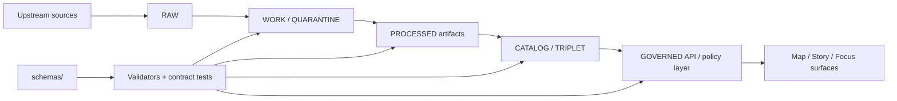

<!-- [KFM_META_BLOCK_V2]
doc_id: kfm://doc/schemas/readme
title: schemas
type: standard
version: v1
status: draft
owners: TBD
created: 2026-03-07
updated: 2026-03-07
policy_label: public
related: [../README.md, ../data/registry/README.md, ../data/catalog/stac/README.md, ../contracts/, ../policy/]
tags: [kfm, schemas, contracts, validation]
notes: [Directory README for the top-level schema surface.]
[/KFM_META_BLOCK_V2] -->

# schemas
Governed schema surface for validation, ingestion, cataloging, evidence resolution, and contract enforcement.

> **Status:** active directory / README revision proposed  
> **Owners:** TBD (`verify CODEOWNERS`)  
>   
>   
>   
>   
>   
>
> **Quick links:** [Scope](#scope) · [Repo fit](#repo-fit) · [Accepted inputs](#accepted-inputs) · [Exclusions](#exclusions) · [Directory tree](#directory-tree) · [Quickstart](#quickstart) · [How this directory fits the KFM truth path](#how-this-directory-fits-the-kfm-truth-path) · [Schema families](#schema-families) · [Change policy](#change-policy) · [Definition of done](#definition-of-done) · [FAQ](#faq)

## Scope
This directory is the **top-level schema coordination surface** for Kansas Frontier Matrix (KFM).

It exists to make structural expectations:
- visible,
- versioned,
- reviewable,
- machine-validated, and
- reusable across ingest, catalog, policy, API, UI, and evidence workflows.

**CONFIRMED**
- `/schemas` is a top-level directory in the public repo.
- The repo currently describes `schemas/` as backing **validation, ingestion, and contract enforcement**.
- KFM’s broader project posture treats schemas and contracts as **code-reviewed, versioned, and CI-checked** artifacts.

**PROPOSED**
- This README expands the current stub into the contract for how `schemas/` should evolve as the repo’s canonical schema surface.
- Where specific schema subdirectories are not yet confirmed in the public tree, they are labeled **recommended** rather than presented as live implementation.

**UNKNOWN**
- Which exact schema files, subdirectories, and validators are merge-blocking on the current branch.
- Whether all downstream consumers already resolve schemas from this directory rather than parallel copies elsewhere.

## Repo fit
**Path:** `/schemas/README.md`  
**Repo role:** root schema contract for the monorepo.

**Upstream**
- `docs/` for architecture, ADRs, standards, and governance
- `contracts/` for API and interface definitions
- `data/registry/` for dataset onboarding and DatasetVersion metadata
- `data/catalog/stac/` and other catalog surfaces for discovery metadata
- `policy/` for policy-as-code, fixtures, and redaction obligations

**Downstream**
- `tools/` validators and CLI checks
- `tests/` schema fixtures and contract tests
- `apps/` and `packages/` runtime consumers
- `scripts/` and pipelines that materialize governed artifacts
- user-visible surfaces that depend on EvidenceRefs / EvidenceBundles resolving correctly

In KFM, schemas are not “nice-to-have documentation.” They are part of the **trust path** between source data and publishable runtime behavior.

## Accepted inputs
This directory should contain or reference **canonical structural contracts**, such as:

| Accepted input | Purpose | Examples |
|---|---|---|
| JSON Schema or equivalent | Structural validation for machine-readable artifacts | dataset entries, manifests, receipts, EvidenceBundles |
| Versioned contract documents | Stable agreement between producers and consumers | API payload shapes, story schemas, telemetry payloads |
| Schema registries / indexes | Discovery of canonical definitions | schema map, version manifest, compatibility table |
| Small fixtures and examples | Testable samples for CI | valid/invalid payloads, migration fixtures |
| Cross-schema vocabulary constraints | Enforce enumerations and shared semantics | policy labels, artifact zones, citation kinds |

## Exclusions
The following do **not** belong here:

| Exclusion | Why it stays out | Where it goes instead |
|---|---|---|
| Raw or processed datasets | `schemas/` defines structure; it is not a storage zone | `RAW/`, `WORK/`, `PROCESSED/`, `PUBLISHED/` |
| Secrets, tokens, credentials | Never commit secrets to schema docs or examples | secret manager / environment configuration |
| Runtime databases or stateful services | Breaks the contract-only purpose of this directory | `apps/`, `packages/`, `infra/` |
| One-off experimental payloads with no review path | Undermines deterministic governance | `examples/` or local scratch space until formalized |
| Unversioned breaking changes | Destabilize downstream validators and UIs | introduce a new schema version, migration note, and compatibility plan |
| Decorative duplicate schemas | Competing truths cause drift | keep one canonical schema and reference it everywhere else |

## Directory tree
**Current public state**
```text
schemas/
└─ README.md
```

**Recommended growth path**
```text
schemas/
├─ README.md                         # this file
├─ index.json                        # optional machine-readable schema registry
├─ datasets/                         # dataset entry, DatasetVersion, manifest schemas
├─ catalog/                          # STAC / DCAT / PROV profile schemas and overlays
├─ evidence/                         # EvidenceRef, EvidenceBundle, run_receipt, promotion_receipt
├─ api/                              # request / response payload contracts when kept centrally
├─ ui/                               # Story Node, Focus Mode, Evidence Drawer payload shapes
├─ telemetry/                        # runtime telemetry, energy, carbon, cost accounting
├─ vocab/                            # shared enums if they truly belong with schemas
└─ fixtures/                         # tiny valid/invalid samples for CI and local checks
```

> **Important:** The tree above is a **recommended structure**, not a claim that all folders already exist.

## Quickstart
Start by discovering what exists before documenting it as implemented:

```bash
# inspect current schema surface
find schemas -maxdepth 3 -type f | sort

# inspect nearby contract surfaces that likely depend on schemas
find contracts data/registry data/catalog policy tests -maxdepth 3 -type f 2>/dev/null | sort

# look for core governance primitives
grep -RIn "spec_hash\|EvidenceRef\|EvidenceBundle\|run_receipt\|policy_label" schemas contracts data docs policy tests || true
```

Example local validation patterns once schema files exist:

```bash
# validate JSON payloads against canonical schemas (example only)
# replace TOOL + paths with the repo's chosen validator
TOOL validate --schema schemas/datasets/dataset_entry.schema.json data/registry/datasets/example.yml

# lint all JSON/YAML fixtures that should remain machine-valid
find schemas/fixtures -type f \( -name "*.json" -o -name "*.yml" -o -name "*.yaml" \) | sort
```

## How this directory fits the KFM truth path
Schemas are part of the promotion contract. They help stop ambiguous or malformed artifacts before they become publishable runtime surfaces.


```mermaid
flowchart LR
    U[Upstream sources] --> R[RAW]
    R --> W[WORK / QUARANTINE]
    W --> P[PROCESSED artifacts]
    P --> C[CATALOG / TRIPLET]
    C --> A[GOVERNED API / policy layer]
    A --> UI[Map / Story / Focus surfaces]

    S[schemas/] --> V[Validators + contract tests]
    V --> W
    V --> P
    V --> C
    V --> A
```

## Schema families
The table below distinguishes what is already supported by current repo/docs versus what is still a recommended consolidation target.

| Schema family | Status | What it governs | Typical consumers |
|---|---|---|---|
| Directory-level schema surface (`/schemas`) | **CONFIRMED** | Top-level place for schema contracts | validators, tests, contributors |
| Dataset onboarding schemas | **CONFIRMED as project need** | dataset identity, rights, cadence, pipeline spec, stewardship | `data/registry/`, CI gates, catalog generators |
| Catalog schemas / profiles | **CONFIRMED as project need** | STAC / DCAT / PROV object validity and cross-links | catalog builders, discovery APIs, Evidence resolver |
| Evidence schemas | **CONFIRMED as project need** | EvidenceRef, EvidenceBundle, receipts, attestation payloads | Story Nodes, Focus Mode, audit tooling |
| API/OpenAPI-aligned payload schemas | **CONFIRMED as project need** | request/response contracts for governed APIs | `apps/`, `contracts/`, SDKs, tests |
| Telemetry / cost / energy schemas | **PROPOSED consolidation target** | operational reporting and reproducibility metadata | runtime telemetry, release manifests |
| UI content schemas | **PROPOSED consolidation target** | Story Node and other publishable content shapes | UI renderers, publish gates, linting |
| Ad hoc parallel copies of the same schema | **NOT ALLOWED** | n/a | n/a |

## Design rules
1. **One canonical definition per contract.**  
   Do not allow silent forks of the same schema across directories.

2. **Version explicitly.**  
   Breaking changes require a new versioned schema or clear compatibility note.

3. **Prefer machine-readable over prose-only.**  
   Human explanation belongs in docs; enforcement belongs in schemas plus tests.

4. **Keep examples tiny and reviewable.**  
   CI should validate small, representative fixtures.

5. **Make incompatibility visible.**  
   Consumers should fail early when they receive unknown or invalid structures.

6. **Link contracts to policy.**  
   If a field is required for rights, sensitivity, redaction, or evidence resolution, encode that requirement so CI can block promotion.

7. **Preserve observational vs. derived distinctions.**  
   Schema fields should not blur what was observed, inferred, synthesized, generalized, or redacted.

## Change policy
Schema evolution must be deliberate.

### Required for every schema-affecting pull request
- explain **why** the shape changed
- identify **who consumes** the schema
- provide at least one **valid** and one **invalid** fixture when practical
- update any related docs, examples, and validators
- document whether the change is:
  - additive and backward compatible
  - tightening validation without shape changes
  - breaking and migration-requiring

### Recommended review questions
- Does this introduce a second source of truth?
- Does this change weaken fail-closed behavior?
- Does it affect `spec_hash`, DatasetVersion identity, or evidence resolution?
- Are rights, sensitivity, and provenance fields still sufficient?
- Are downstream UIs or APIs relying on field names or enum values that changed?

## Compatibility matrix
| Change type | Allowed in-place? | Extra work required |
|---|---|---|
| Add optional field | Usually yes | update examples and consumer docs |
| Add required field | Usually no | version bump or migration + CI updates |
| Rename field | No | new version + migration plan |
| Remove field | No | new version + migration plan |
| Tighten enum values | Risky | fixture updates + downstream impact review |
| Change semantic meaning without shape change | No | treat as breaking even if syntax is identical |

## Definition of done
A schema change is not done until all relevant boxes are checked:

- [ ] Canonical schema file is added or updated in the correct location.
- [ ] Schema naming and versioning are explicit.
- [ ] At least one validating example exists.
- [ ] At least one failing example exists when practical.
- [ ] Consumers are updated to use the canonical schema, not a copied version.
- [ ] CI or local validation instructions are updated.
- [ ] Related docs / README / runbooks are updated.
- [ ] Breaking changes include a migration note or follow-up issue.
- [ ] Policy-critical fields (rights, sensitivity, evidence, identity) remain enforced.
- [ ] Reviewers can explain how this schema participates in the truth path.

## Validation checkpoints
Use these checkpoints to decide whether a schema is ready to participate in promotion gates.

| Gate | Why it matters | Example question |
|---|---|---|
| Identity | keeps versions stable and reproducible | does the schema preserve stable IDs and `spec_hash` inputs? |
| Rights | blocks unclear licensing | can missing/unknown rights fields fail validation? |
| Sensitivity | prevents unsafe publication | are policy labels and redaction obligations representable? |
| Catalog linkage | keeps discovery resolvable | can the object link to STAC / DCAT / PROV and EvidenceRefs? |
| Receipt / audit | preserves traceability | can runs emit receipts that validate consistently? |
| Consumer alignment | prevents drift | do apps/tests use the same canonical file? |

## FAQ
### Why have a top-level `schemas/` if `contracts/` and `data/registry/` also exist?
Because KFM separates **where contracts are explained** from **where canonical validation shapes may live**. `contracts/` can describe interfaces broadly; `schemas/` is the sharp end of machine validation.

### Why does this README distinguish CONFIRMED from PROPOSED?
Because KFM’s trust posture rejects repo mythology. Current public facts should be separated from recommended future structure.

### Should every JSON file in the repo live under `schemas/`?
No. Only canonical schema definitions, schema indexes, and small validation fixtures belong here. Ordinary metadata, examples, and produced artifacts belong elsewhere.

### Can a schema depend on controlled vocabularies outside this folder?
Yes. If vocabularies are canonical somewhere else, reference them. Do not duplicate them just for convenience.

### What if a consumer cannot adopt a breaking change immediately?
Add a versioned successor schema and keep the older one until the migration is complete. Avoid stealth edits that change meaning in place.

## Appendix
### Naming guidance
- prefer lowercase filenames
- use explicit version suffixes when compatibility matters:
  - `dataset_entry.v1.schema.json`
  - `evidence_bundle.v2.schema.json`
- keep IDs and filenames stable; change versions instead of mutating meaning silently

### Suggested neighboring docs
- [`../README.md`](../README.md)
- [`../data/registry/README.md`](../data/registry/README.md)
- [`../data/catalog/stac/README.md`](../data/catalog/stac/README.md)
- [`../policy/`](../policy/)
- [`../contracts/`](../contracts/)

[Back to top](#schemas)