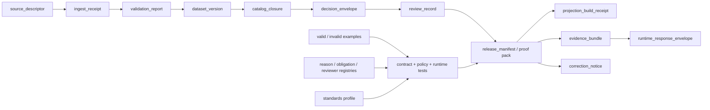

<!-- [KFM_META_BLOCK_V2]
doc_id: kfm://doc/NEEDS-VERIFICATION
title: Schemas
type: standard
version: v1
status: draft
owners: NEEDS-VERIFICATION
created: YYYY-MM-DD
updated: YYYY-MM-DD
policy_label: NEEDS-VERIFICATION
related: [NEEDS-VERIFICATION]
tags: [kfm, schemas, contracts, json-schema]
notes: [Current-session workspace exposed PDFs only; target path is schemas/README.md; March 2026 realization overlays more often place the same surface under contracts/schemas/.]
[/KFM_META_BLOCK_V2] -->

# Schemas

Machine-readable KFM contract schemas for intake, verification, release, runtime trust, and correction.

> **Status:** experimental  
> **Owners:** NEEDS-VERIFICATION  
> **Truth posture:** CONFIRMED doctrine · PROPOSED repo-local realization · UNKNOWN mounted schema inventory  
> 
> 
> 
> 
> 
>   
> **Quick jumps:** [Scope](#scope) · [Repo fit](#repo-fit) · [Directory tree](#directory-tree) · [Contract families](#contract-families) · [Common envelope expectations](#common-envelope-expectations) · [Standards profile](#standards-profile) · [Validation and gates](#validation-and-gates) · [Task list](#task-list--definition-of-done) · [FAQ](#faq)

> [!IMPORTANT]
> This README is written for the task-local path `schemas/README.md`. The strongest March 2026 realization overlays more often describe the same machine-readable surface as `contracts/schemas/`. Treat that mismatch as a path-reconciliation item until mounted repo truth is visible.

> [!NOTE]
> Current-session workspace evidence exposed PDFs only. No mounted KFM repo tree, schema registry, tests, workflow files, deployment manifests, or runtime logs were directly verified in this session.

## Scope

This directory is the machine-readable contract layer for KFM object families. Its job is to make source onboarding, catalog closure, policy decisions, release proof, runtime outcomes, and correction artifacts validateable, diffable, and reviewable rather than leaving them implicit in prose or service code.

The surface should stay narrow, typed, and boring in the good way:

- one schema per contract family
- shared envelope grammar across receipts, manifests, decisions, and runtime envelopes
- fixtures and gates that prove fail-closed behavior
- explicit links to standards-profile, policy-registry, and proof-object surfaces

If the repo is still pre-artifact, keep this README visible rather than letting the contract surface disappear into future-tense architecture prose.

[Back to top](#schemas)

## Repo fit

| Item | Value |
|---|---|
| Path | `schemas/README.md` |
| Role in the repo | Directory README for machine-readable KFM object schemas |
| Corpus-aligned equivalent | `contracts/schemas/` |
| Upstream links | NEEDS-VERIFICATION — likely contract root, standards profile, and policy registry surfaces |
| Downstream links | NEEDS-VERIFICATION — likely tests, governed APIs, UI trust surfaces, and runbooks |
| Doctrinal basis | D1/D2 doctrine, sharpened by March 2026 contract, verification, testing, configuration, and package overlays |
| Current treatment | Task-local README now; broader contract surface still needs mounted-repo reconciliation |

If the repo later normalizes under `contracts/schemas/`, move this README with the surface or leave a thin forwarding stub. Do not duplicate contract truth in two places.

## Accepted inputs

Accepted here:

- versioned JSON Schema files for KFM contract families
- shared `$defs` / `$ref` fragments when colocating them keeps validation and review simpler
- one standards-profile pin file or ADR-style profile document for this surface, if the repo keeps it beside the schemas
- concise directory-local notes about naming, versioning, and drift control

Recommended naming pattern:

```text
<contract_family>.schema.json
```

Starter examples:

```text
source_descriptor.schema.json
ingest_receipt.schema.json
validation_report.schema.json
dataset_version.schema.json
catalog_closure.schema.json
decision_envelope.schema.json
review_record.schema.json
release_manifest.schema.json
projection_build_receipt.schema.json
evidence_bundle.schema.json
runtime_response_envelope.schema.json
correction_notice.schema.json
```

If the repo splits `release_manifest` and `release_proof_pack`, document that explicitly rather than hiding it behind one filename.

## Exclusions

Do **not** place these here unless mounted repo truth explicitly says otherwise:

- public or internal OpenAPI descriptions; keep them in `apis/` or the repo’s verified API contract surface instead
- event or lifecycle-transition schemas if the repo keeps them under `events/`
- valid or invalid examples; keep them in `contracts/examples/`, `fixtures/`, or the repo’s verified example surface
- policy bundles and registries such as reason codes, obligation codes, rights classes, or reviewer-role maps; keep them in `policy/`
- emitted proof objects such as run manifests, run receipts, SBOMs, attestations, or release proof bundles
- runbooks, ADRs, and broader governance prose; keep them under `docs/`, `docs/runbooks/`, or equivalent
- outward catalog artifacts such as STAC/DCAT/PROV packages generated from released scope

[Back to top](#schemas)

## Directory tree

**PROPOSED starter inventory for this path (repo-unverified):**

```text
schemas/
├── README.md
├── source_descriptor.schema.json
├── ingest_receipt.schema.json
├── validation_report.schema.json
├── dataset_version.schema.json
├── catalog_closure.schema.json
├── decision_envelope.schema.json
├── review_record.schema.json
├── release_manifest.schema.json
├── projection_build_receipt.schema.json
├── evidence_bundle.schema.json
├── runtime_response_envelope.schema.json
└── correction_notice.schema.json
```

<details>
<summary><strong>Corpus-aligned broader contract layout (PROPOSED, repo-unverified)</strong></summary>

```text
repo-root/
├── contracts/
│   ├── schemas/
│   ├── examples/
│   │   ├── valid/
│   │   └── invalid/
│   └── profiles/
├── policy/
│   ├── bundles/
│   ├── reason_codes.json
│   ├── obligation_codes.json
│   └── reviewer_roles.json
├── apis/
├── tests/
│   ├── contracts/
│   ├── policy/
│   └── e2e/
├── docs/runbooks/
└── observability/
```

</details>

> [!TIP]
> Start flatter than you think. The March 2026 overlays repeatedly favor a small first wave plus one governed thin slice over a deep schema forest.

## Quickstart

1. Publish the first schema wave before broader platform expansion.
2. Pair every schema with at least one valid and one invalid example in the repo’s example surface.
3. Pin the standards profile in version control instead of leaving JSON Schema, OpenAPI, catalog vocabulary, and telemetry assumptions implicit.
4. Wire schema, example, policy, runtime negative-path, and correction tests into automated gates.
5. Treat undocumented breaking contract changes as merge blockers.

```bash
# illustrative pseudocode — bind these steps to the repo's actual validator runner
validate_schemas contracts/schemas/*.schema.json
validate_examples contracts/examples/valid
assert_invalid_examples_fail contracts/examples/invalid
run_contract_tests tests/contracts
run_policy_tests tests/policy
run_runtime_negative_tests tests/e2e/runtime_proof
run_correction_drills tests/e2e/correction
```

## Usage

### Working rules

- Prefer one schema file per contract family.
- Keep filenames snake_case and object families semantically stable.
- Carry explicit type and version fields in consequential envelopes.
- Keep policy registries and standards pins outside individual schema files; schemas should reference them, not reinvent them.
- Update schemas, fixtures, tests, and docs in the same review stream.

### Naming and versioning

Promotion, runtime proof, rollback, and correction are typed transitions in KFM. Contract drift therefore needs to be deliberate, reviewable, and test-backed.

A useful default rule is simple: change grammar on purpose, version it visibly, and never let examples or runbooks lag behind the schema that governs them.

### Common envelope expectations

The corpus repeatedly pushes toward a shared header grammar across receipts, manifests, decisions, and runtime envelopes.

| Field family | Typical members | Why keep it consistent |
|---|---|---|
| Type + version | `kind`, `contract_version` | Keeps contract families diffable and machine-readable |
| Subject + release lineage | `subject_ref`, `dataset_version_id`, `release_id`, `spec_hash` | Ties every consequential object to immutable scope |
| Policy state | `policy_label`, `reason_codes[]`, `obligation_codes[]` | Keeps allow/deny/narrowing behavior executable |
| Evidence + audit | `evidence_refs[]`, `audit_ref`, `trace_ref` | Preserves drill-through and causal reconstruction |
| Actor + time | `actor_id`, `evaluated_at` | Keeps review, runtime, and correction history legible |

Treat the table above as a recommended shared grammar, not as a substitute for per-family required fields.

## Diagram


```mermaid
flowchart LR
    SD[source_descriptor] --> IR[ingest_receipt]
    IR --> VR[validation_report]
    VR --> DV[dataset_version]
    DV --> CC[catalog_closure]
    CC --> DE[decision_envelope]
    DE --> RR[review_record]
    RR --> RM[release_manifest / proof pack]
    RM --> PBR[projection_build_receipt]
    RM --> EB[evidence_bundle]
    EB --> RRE[runtime_response_envelope]
    RM --> CN[correction_notice]

    EX[valid / invalid examples] --> T[contract + policy + runtime tests]
    REG[reason / obligation / reviewer registries] --> T
    PROF[standards profile] --> T
    T --> RM
```

The schema surface mirrors a governed object graph. It is not just a folder of JSON shapes.

## Tables

### Contract families

| Family / starter schema | Minimum purpose | Must include at least |
|---|---|---|
| `source_descriptor` | Declare the intake contract for a source or endpoint. | Identity, owner/steward, access mode, rights posture, support, cadence, validation plan, publication intent |
| `ingest_receipt` | Prove that a fetch and landing event occurred. | Source reference, fetch time, integrity checks, result, output pointers |
| `validation_report` | Record what checks passed, failed, or quarantined. | Check list, severity, reason codes, subject refs |
| `dataset_version` | Carry an authoritative candidate or promoted subject set. | Stable ID, version ID, support, time semantics, provenance links |
| `catalog_closure` | Publish outward metadata closure and lineage linkage. | STAC/DCAT/PROV refs, identifiers, release linkage, outward profile refs |
| `decision_envelope` | Express a policy result machine-readably. | Subject, action, lane, result, reason codes, obligation codes, policy basis, `audit_ref`, effective window |
| `review_record` | Capture human approval, denial, escalation, or note. | Reviewer role, decision, timestamp, refs, comments |
| `release_manifest` / `release_proof_pack` | Assemble a public-safe release and its proof. | Version refs, catalog refs, decision refs, docs/accessibility gate, rollback/correction posture, profile versions, bundle plan |
| `projection_build_receipt` | Prove a derived layer was built from a known release scope. | Release ref, projection type, surface class, build time, freshness basis, stale-after policy |
| `evidence_bundle` | Package support for a claim, feature, story, export preview, or answer. | Bundle ID, source basis, dataset refs, lineage summary, preview policy, transform receipts, rights/sensitivity state, `audit_ref` |
| `runtime_response_envelope` | Make runtime outcome accountable. | Schema version, object type, `audit_ref`, `request_id`, `evaluated_at`, surface class, surface state, result, citations check, decision ref |
| `correction_notice` | Preserve visible lineage under change. | Affected releases, replacement releases, affected surface classes, rebuild refs, cause, public note |

> [!TIP]
> The highest-leverage first wave is still small: `source_descriptor`, `dataset_version`, `decision_envelope`, `release_manifest`, `evidence_bundle`, `runtime_response_envelope`, and `correction_notice`. Broaden from there in lockstep with fixtures, tests, and one real governed slice.

### Standards profile

| Concern | Recommended profile | Notes for this surface |
|---|---|---|
| Object schemas | JSON Schema Draft 2020-12 | Best-fit baseline for KFM object schemas, examples, and invalid fixtures |
| HTTP API descriptions | OpenAPI 3.2.0 | Keep outside this directory unless repo truth says otherwise |
| Dataset / release discovery | DCAT 3 | Use for outward release discovery metadata |
| Provenance vocabulary | PROV | Retain as part of catalog closure and correction linkage |
| Spatiotemporal asset description | STAC | Strongest fit for collection / item / asset description; exact project pin should be explicit |
| Catalog search | OGC API – Records Part 1: Core 1.0 | Additive option for discovery routes |
| Authoritative feature reads | OGC API – Features | Preferred external shape where released authoritative reads are exposed |
| Map / tile portrayal | OGC API – Maps / Tiles | Preferred external shape for governed portrayal where exposed |
| Accessibility baseline | WCAG 2.2 | Treat accessibility as release evidence, not UI polish |
| Telemetry naming | OpenTelemetry semantic conventions | Exact adopted version remains a pin file / ADR question |

> [!IMPORTANT]
> Standards fit is not the same as a mounted repo pin. Keep exact profile versions in a dedicated standards-profile artifact and mark unresolved pins clearly until the repo is directly inspectable.

## Validation and gates

| Gate or test family | What it proves |
|---|---|
| Schema gate | Published schemas plus valid/invalid examples agree; structural acceptance is machine-checkable |
| Source replay gate | `source_descriptor` and `ingest_receipt` are sufficient to re-fetch and verify source inputs |
| Catalog closure gate | STAC/DCAT/PROV linkage and identifiers resolve coherently for dataset or release scope |
| Policy bundle gate | Reason codes, obligation codes, policy labels, and deny-by-default rules are complete enough to fail closed |
| Release assembly gate | Release unit is complete, signed/attested as required, and tied to catalog/provenance artifacts |
| Evidence-resolution gate | Every consequential visible claim or runtime response resolves to inspectable support |
| Runtime citation-negative test | The system refuses unsupported answers when citations fail, scope is empty, or evidence is unavailable |
| Surface-state gate | UI surfaces honestly display generalized, stale, withheld, superseded, or withdrawn states |
| Correction drill | Supersession, withdrawal, rollback, and correction behavior are real, visible, and auditable |
| Documentation / accessibility gate | Contracts, examples, diagrams, runbooks, and trust-visible outputs remain current and usable |

> [!WARNING]
> A schema without fixtures, gates, and a visible correction path is still useful, but it is not yet a trustworthy contract surface.

[Back to top](#schemas)

## Task list / Definition of done

- [ ] Reconcile the task-local `schemas/README.md` path with any mounted `contracts/schemas/` or equivalent contract surface.
- [ ] Publish the first-wave schemas and validate them against real fixtures.
- [ ] Provide at least one valid and one invalid example per high-value family.
- [ ] Pin the standards profile explicitly.
- [ ] Publish starter registries for reason codes, obligation codes, reviewer roles, rights classes, sensitivity classes, surface states, and runtime outcomes.
- [ ] Add deny-by-default policy bundles plus tests.
- [ ] Add contract, policy, release-assembly, runtime-negative, stale-projection, and correction-drill tests.
- [ ] Publish onboarding, replay, promotion assembly, stale-state, abstain/deny, correction, and rollback runbooks.
- [ ] Keep join keys stable enough for audit reconstruction (`release_id`, `dataset_version_id`, `decision_id`, `review_id`, `bundle_id`, `projection_id`, `audit_ref`, correction IDs).
- [ ] Fill owners, dates, policy label, and real upstream/downstream references before publication.

## FAQ

### Why does this README mention `contracts/schemas/` if the task path is `schemas/README.md`?

Because the strongest March 2026 realization overlays more often describe the broader machine-readable contract surface under `contracts/`, with `contracts/schemas/` as the schema home. This README stays faithful to the task-local path while keeping that broader corpus pattern visible until repo truth settles the final location.

### Do OpenAPI files belong here?

Not by default. The corpus consistently treats governed HTTP route contracts as a sibling surface to object-envelope schemas, not as the same directory.

### Do valid and invalid examples belong here?

Not usually. The corpus points to sibling example or fixture surfaces so schemas remain focused and tests can consume examples directly.

### Are all contract families required on day one?

No. The corpus repeatedly argues for a small first wave plus one governed thin slice over a large but untested schema forest.

### Why does this README keep saying “PROPOSED” so often?

Because the accessible workspace in this session did not verify a mounted repo tree, schema registry, workflows, manifests, tests, or runtime traces. The README is therefore allowed to stabilize doctrine and recommended structure, but not to promote repo-shape guesses into fact.

### Why is hydrology mentioned in a schemas README?

Because multiple March 2026 KFM overlays use a hydrology-first thin slice as the clearest proof lane for converting contract doctrine into one end-to-end governed path with release and correction evidence. The schema surface is part of that proof, not separate from it.

## Appendix

<details>
<summary><strong>Need to verify before publishing this README</strong></summary>

| Item | Why it matters |
|---|---|
| Actual repo tree | Prevents path assumptions from hardening into pseudo-fact |
| Current schema inventory | Avoids documenting files that already differ in name, split, or versioning pattern |
| Example / fixture locations | Needed for accurate quickstart and downstream references |
| Standards-profile file location | Needed so this README links to the real pin file |
| Contract-test runner and CI entrypoints | Needed for runnable snippets and truthful gate language |
| Owners / dates / policy label / related links | Required for an honest KFM meta block |
| Sample proof objects | Needed so schema docs stay tied to emitted reality |
| Sample runtime traces | Needed to confirm audit-link and surface-state assumptions |

</details>

<details>
<summary><strong>Corpus-aligned broader contract layout (PROPOSED, repo-unverified)</strong></summary>

```text
repo-root/
├── contracts/
│   ├── schemas/
│   ├── examples/
│   │   ├── valid/
│   │   └── invalid/
│   └── profiles/
├── policy/
│   ├── bundles/
│   ├── reason_codes.json
│   ├── obligation_codes.json
│   └── reviewer_roles.json
├── apis/
├── tests/
│   ├── contracts/
│   ├── policy/
│   └── e2e/
├── docs/runbooks/
└── observability/
```

Use this only as a reconciliation aid. It is a strong March 2026 corpus pattern, not a verified mounted repo tree.

</details>

<details>
<summary><strong>Starter sibling surfaces to keep aligned with schemas</strong></summary>

| Surface | Why it must travel with schema changes |
|---|---|
| Valid / invalid examples | They prove acceptance and fail-closed behavior |
| Standards profile | It pins dialects and outward contract vocabulary |
| Policy registries | They keep reason/obligation grammar executable |
| Release and runtime proof objects | They keep schemas tied to real trust behavior |
| Runbooks | They keep operators from rediscovering policy under stress |
| Observability join-key docs | They keep audit reconstruction possible |

</details>

[Back to top](#schemas)
