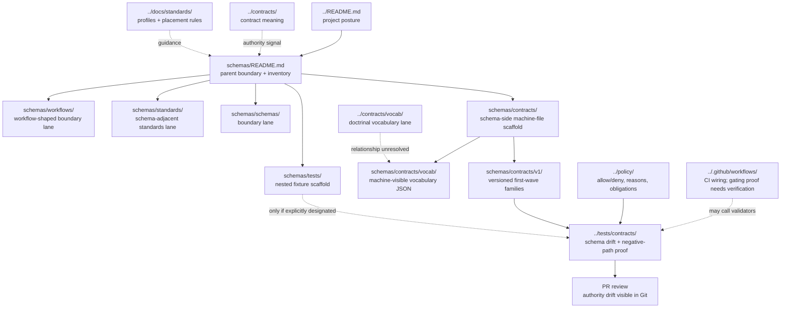

<!-- [KFM_META_BLOCK_V2]
doc_id: kfm://doc/NEEDS-VERIFICATION
title: Schemas
type: standard
version: v1
status: draft
owners: @bartytime4life
created: NEEDS_VERIFICATION
updated: 2026-04-22
policy_label: public
related: [../README.md, ./README.md, ./contracts/README.md, ./contracts/v1/README.md, ./contracts/vocab/README.md, ./schemas/README.md, ./standards/README.md, ./tests/README.md, ./workflows/README.md, ../contracts/README.md, ../contracts/vocab/README.md, ../docs/standards/README.md, ../policy/README.md, ../tests/README.md, ../tests/contracts/README.md, ../.github/workflows/README.md, ../.github/CODEOWNERS]
tags: [kfm, schemas, contracts, json-schema, scaffolds, governance]
notes: [doc_id and created date need active-checkout verification; owner and policy label are carried from surfaced project Markdown and should be rechecked against CODEOWNERS and repo policy before publication; canonical schema-home and canonical fixture-home authority remain unresolved until ADR-schema-home and adjacent READMEs agree.]
[/KFM_META_BLOCK_V2] -->

<a id="top"></a>

# Schemas

Parent boundary and live-tree index for the `schemas/` subtree while KFM keeps machine-contract shape, fixture placement, vocabulary ownership, and adjacent contract authority explicit.

> [!IMPORTANT]
> **Status:** `experimental` · **Doc status:** `draft`  
> **Owners:** `@bartytime4life` *(carried from surfaced project Markdown; active-checkout CODEOWNERS verification still required)*  
> **Path:** `schemas/README.md`  
> **Repo fit:** parent schema lane beneath [`../README.md`](../README.md); child lanes under [`./contracts/`](./contracts/README.md), [`./schemas/`](./schemas/README.md), [`./standards/`](./standards/README.md), [`./tests/`](./tests/README.md), and [`./workflows/`](./workflows/README.md); laterally coupled to [`../contracts/`](../contracts/README.md), [`../contracts/vocab/`](../contracts/vocab/README.md), [`../policy/`](../policy/README.md), [`../tests/contracts/`](../tests/contracts/README.md), and [`../.github/workflows/`](../.github/workflows/README.md).  
> **Quick jumps:** [Scope](#scope) · [Repo fit](#repo-fit) · [Inputs](#inputs) · [Exclusions](#exclusions) · [Directory tree](#directory-tree) · [Quickstart](#quickstart) · [Usage](#usage) · [Diagram](#diagram) · [Tables](#tables) · [Task list](#task-list--definition-of-done) · [FAQ](#faq) · [Appendix](#appendix)

<div align="left">


</div>

> [!WARNING]
> `schemas/` is **not** a dumping ground for schema-shaped files. It is a parent boundary that must keep the `contracts/`, `schemas/`, `policy/`, `tests/`, `docs/standards/`, and workflow surfaces from drifting into parallel truth systems.

---

## Scope

`schemas/` exists to make machine-readable shape visible **without pretending that directory shape alone settles authority**.

This parent README has four jobs:

1. index the current `schemas/` subtree;
2. route contributors to the narrowest responsible child or adjacent lane;
3. keep schema-home and fixture-home ambiguity visible until an ADR resolves it;
4. prevent machine files, vocabularies, fixtures, policies, workflow logic, and runtime code from silently becoming duplicate authorities.

### Current posture

| Question | Status | Working answer |
|---|---:|---|
| Is `schemas/` a real repo lane? | `CONFIRMED` from surfaced project Markdown; active checkout still `NEEDS VERIFICATION` | Treat it as a parent lane, not a single warning file. |
| Is `schemas/contracts/` machine-file-bearing? | `CONFIRMED` from surfaced project Markdown | Treat it as a live machine-file scaffold. |
| Is `schemas/contracts/` canonical law? | `NEEDS VERIFICATION` | Do not promote by directory name alone. |
| Is `schemas/tests/` the canonical fixture home? | `NEEDS VERIFICATION` | Keep it distinct from repo-wide [`../tests/contracts/`](../tests/contracts/README.md). |
| Is root [`../contracts/`](../contracts/README.md) still relevant? | `CONFIRMED` from surfaced project Markdown | Yes. It remains an adjacent authority signal and must not be hand-waved away. |
| Can policy logic live here? | `CONFIRMED exclusion` | No. Use [`../policy/`](../policy/README.md). |

[Back to top](#top)

---

## Repo fit

`schemas/README.md` sits in the middle of KFM’s contract-and-verification lattice.

| Relationship | Path | Role |
|---|---|---|
| Upstream | [`../README.md`](../README.md) | Root project orientation and governed-system posture |
| Governance | [`../.github/CODEOWNERS`](../.github/CODEOWNERS) | Ownership and review boundary; active-checkout verification required |
| Control plane | [`../.github/workflows/README.md`](../.github/workflows/README.md) | Workflow intent and validation automation boundary |
| Contract meaning | [`../contracts/README.md`](../contracts/README.md) | Human-readable trust-object and contract meaning |
| Vocabulary neighbor | [`../contracts/vocab/README.md`](../contracts/vocab/README.md) | Doctrinal vocabulary lane that may overlap schema-side vocab JSON |
| Policy neighbor | [`../policy/README.md`](../policy/README.md) | Decision rules, reason/obligation semantics, and deny behavior |
| Verification neighbor | [`../tests/README.md`](../tests/README.md) | Repo-wide governed verification surface |
| Contract proof neighbor | [`../tests/contracts/README.md`](../tests/contracts/README.md) | Schema drift checks, valid/invalid examples, negative-path proof |
| Standards neighbor | [`../docs/standards/README.md`](../docs/standards/README.md) | Cross-cutting standards, profiles, and placement guidance |
| Child lane | [`./contracts/README.md`](./contracts/README.md) | Schema-side contract scaffold |
| Child lane | [`./contracts/v1/README.md`](./contracts/v1/README.md) | Versioned first-wave schema families |
| Child lane | [`./contracts/vocab/README.md`](./contracts/vocab/README.md) | Schema-side machine-visible vocabularies |
| Child lane | [`./tests/README.md`](./tests/README.md) | Nested fixture scaffold and routing guide |
| Child lane | [`./schemas/README.md`](./schemas/README.md) | Boundary lane for schema-shaped drift control |
| Child lane | [`./standards/README.md`](./standards/README.md) | Standards-shaped schema boundary lane |
| Child lane | [`./workflows/README.md`](./workflows/README.md) | Workflow-shaped schema boundary lane |

### Working interpretation

The safest reading today is:

1. keep this file as the **parent boundary and inventory index**;
2. treat [`./contracts/`](./contracts/README.md) as a **real machine-file-bearing scaffold**, not automatically canonical law;
3. treat [`./tests/`](./tests/README.md) as a **real nested fixture scaffold**, not the singular governed fixture home;
4. treat [`./schemas/`](./schemas/README.md), [`./standards/`](./standards/README.md), and [`./workflows/`](./workflows/README.md) as boundary lanes unless the active checkout proves more;
5. treat root [`../contracts/`](../contracts/README.md), [`../contracts/vocab/`](../contracts/vocab/README.md), and [`../tests/contracts/`](../tests/contracts/README.md) as material adjacent signals;
6. resolve schema-home authority explicitly before adding new trust-bearing families or vocabulary registries by inertia.

[Back to top](#top)

---

## Inputs

Accepted here:

| Belongs here | Why it belongs here |
|---|---|
| Parent-level schema lane guidance | This file owns the top-level reading rule for `schemas/`. |
| Child-lane inventory updates | Maintainers need one honest map of visible schema-side children. |
| Cross-root authority notes | `schemas/` sits between `contracts/`, `policy/`, `tests/`, and workflow surfaces. |
| Migration notes for schema-home decisions | Changes to canonical homes must be discoverable from the parent lane. |
| Routing guidance for contributors | Contributors need to know whether a change belongs here, under a child lane, or outside `schemas/`. |
| Review warnings about split authority | The main risk is semantic drift that looks harmless in a directory diff. |

### Minimum bar for anything added here

A change belongs in this parent README only when it:

- describes the role of the parent lane or its child/sibling routing;
- keeps child README links and adjacent root-lane links current;
- does not create a new shadow authority directly under `schemas/`;
- does not treat scaffold growth as implicit authority resolution;
- leaves policy, tests, workflows, runtime code, and proof storage in their proper governed lanes.

[Back to top](#top)

---

## Exclusions

The following do **not** belong directly under the parent `schemas/` root unless a later ADR explicitly changes the placement rule.

| Does not belong here | Better home | Why |
|---|---|---|
| New top-level `*.schema.json` files directly under `schemas/` | The specific owning child lane or the decided canonical machine-contract home | The parent root is an index and boundary, not a grab-bag registry. |
| Executable policy logic or policy decision bundles | [`../policy/README.md`](../policy/README.md) | Policy must stay executable, reviewable, and deny-by-default. |
| Workflow YAML, merge gates, or runner definitions | [`../.github/workflows/README.md`](../.github/workflows/README.md) | Execution belongs in the control plane. |
| Runtime emitters, resolvers, DTO handlers, or service code | App/package implementation lanes | Runtime consumers reference contracts; they do not live in the schema index. |
| Repo-wide valid/invalid example packs | [`../tests/README.md`](../tests/README.md) or [`../tests/contracts/README.md`](../tests/contracts/README.md) | Governed verification should not silently fork. |
| Duplicate canonical vocabulary registries under both `schemas/contracts/vocab/` and `contracts/vocab/` | One decided home plus explicit pointer/mirror strategy | Parallel vocabulary truth creates semantic drift. |
| Human-readable standards doctrine | [`../docs/standards/README.md`](../docs/standards/README.md) | Standards prose already has a governed home. |
| Receipts, proofs, release bundles, or promotion outputs | `../data/receipts/`, `../data/proofs/`, or release/promotion lanes | Process memory and proof objects should stay distinct from schema description. |

> [!CAUTION]
> The biggest current risk is not “we forgot this subtree exists.” It is **split authority that looks harmless enough to survive review**.

[Back to top](#top)

---

## Directory tree

### Source-surfaced `schemas/` shape

Run the [Quickstart](#quickstart) before relying on this inventory in an active branch.

```text
schemas/
├── README.md
├── contracts/
│   ├── README.md
│   ├── v1/
│   │   ├── README.md
│   │   ├── common/
│   │   │   └── header_profile.schema.json
│   │   ├── correction/
│   │   │   └── correction_notice.schema.json
│   │   ├── data/
│   │   │   └── dataset_version.schema.json
│   │   ├── evidence/
│   │   │   └── evidence_bundle.schema.json
│   │   ├── policy/
│   │   │   └── decision_envelope.schema.json
│   │   ├── release/
│   │   │   └── release_manifest.schema.json
│   │   ├── runtime/
│   │   │   └── runtime_response_envelope.schema.json
│   │   └── source/
│   │       └── source_descriptor.schema.json
│   └── vocab/
│       ├── obligation_codes.json
│       ├── reason_codes.json
│       └── reviewer_roles.json
├── schemas/
│   └── README.md
├── standards/
│   └── README.md
├── tests/
│   ├── README.md
│   └── fixtures/
│       └── contracts/
│           └── v1/
│               ├── README.md
│               ├── invalid/
│               │   └── README.md
│               └── valid/
│                   └── README.md
└── workflows/
    └── README.md
```

### What this means right now

- `schemas/` is **not** a single-file lane.
- `schemas/contracts/` is the visible schema-side machine-file scaffold.
- `schemas/contracts/v1/` exposes first-wave trust-object schema families.
- `schemas/contracts/vocab/` exposes machine-visible vocabulary JSON.
- `schemas/tests/` is a nested fixture scaffold, not automatically the canonical fixture home.
- `schemas/schemas/`, `schemas/standards/`, and `schemas/workflows/` remain boundary lanes unless the active checkout proves more.
- Root `contracts/`, `contracts/vocab/`, and `tests/contracts/` now materially affect schema placement.
- `.github/workflows/` documentation does not by itself prove merge-blocking validation.

[Back to top](#top)

---

## Quickstart

Run from the repository root.

```bash
# Inspect the live parent subtree.
find schemas -maxdepth 5 -type f | sort

# Inspect adjacent contract and verification surfaces that affect this lane.
find contracts -maxdepth 4 -type f | sort
find tests/contracts -maxdepth 4 -type f | sort
find policy -maxdepth 4 -type f | sort
find .github/workflows -maxdepth 3 -type f | sort

# Re-open parent and child boundary docs together.
sed -n '1,260p' schemas/README.md
sed -n '1,260p' schemas/contracts/README.md
sed -n '1,260p' schemas/contracts/v1/README.md
sed -n '1,260p' schemas/contracts/vocab/README.md
sed -n '1,260p' schemas/schemas/README.md
sed -n '1,260p' schemas/standards/README.md
sed -n '1,260p' schemas/tests/README.md
sed -n '1,260p' schemas/workflows/README.md

# Compare against adjacent root lanes before changing authority language.
sed -n '1,260p' contracts/README.md
sed -n '1,260p' contracts/vocab/README.md
sed -n '1,260p' docs/standards/README.md
sed -n '1,260p' tests/README.md
sed -n '1,260p' tests/contracts/README.md
sed -n '1,220p' .github/CODEOWNERS
sed -n '1,220p' .github/workflows/README.md

# Confirm representative machine files before claiming validator readiness.
cat schemas/contracts/v1/runtime/runtime_response_envelope.schema.json
cat schemas/contracts/v1/source/source_descriptor.schema.json
cat schemas/contracts/v1/evidence/evidence_bundle.schema.json
cat schemas/contracts/vocab/reason_codes.json
cat schemas/contracts/vocab/obligation_codes.json
cat schemas/contracts/vocab/reviewer_roles.json

# Search for placement language before adding or moving schema families.
git grep -nE 'schema home|canonical schema|machine contract|fixture home|reason_codes|obligation_codes|reviewer_roles' -- \
  schemas contracts docs policy tests .github
```

### Safe first move

A safe first move is **not** “add another schema-shaped file and let the tree speak for itself.”

A safe first move is:

1. reconcile this parent README with the active subtree and adjacent root signals;
2. reopen `schemas/schemas/README.md`, `contracts/README.md`, `contracts/vocab/README.md`, `docs/standards/README.md`, and `tests/contracts/README.md` together;
3. decide canonical schema-home and canonical fixture strategy explicitly;
4. wire validators and fixtures against **one** chosen authority path only;
5. keep documentary lanes documentary.

[Back to top](#top)

---

## Usage

### For maintainers

Use this file as the parent sync point.

When any child lane or adjacent contract/verification surface changes meaning, update this file and the affected child or sibling READMEs in the same reviewed change. The goal is not just cleaner prose. The goal is that a contributor can infer the same placement rule from the parent index, local schema lanes, root contract lane, standards index, policy lane, and verification lane.

### For contributors

Pick the **most specific** lane you can justify.

| Work you are doing | Start here |
|---|---|
| First-wave trust-object schema body | [`./contracts/v1/README.md`](./contracts/v1/README.md) plus the specific family README |
| Schema-side shared vocab JSON | [`./contracts/vocab/README.md`](./contracts/vocab/README.md), then check [`../contracts/vocab/README.md`](../contracts/vocab/README.md) |
| Parent-level placement or anti-drift note | This file |
| Standards-shaped schema companion guidance | [`./standards/README.md`](./standards/README.md) and [`../docs/standards/README.md`](../docs/standards/README.md) |
| Nested schema-side fixture scaffold | [`./tests/README.md`](./tests/README.md), then check [`../tests/contracts/README.md`](../tests/contracts/README.md) |
| Contract-facing validation or negative examples | [`../tests/contracts/README.md`](../tests/contracts/README.md) |
| Policy decision behavior, reasons, or obligations | [`../policy/README.md`](../policy/README.md) |
| Workflow validation wiring | [`../.github/workflows/README.md`](../.github/workflows/README.md) |

Do **not** treat the parent `schemas/` root as an overflow shelf.

### For reviewers

Reject changes that do any of the following:

- add top-level schema files under `schemas/` without a placement decision;
- duplicate a vocabulary family under both `contracts/vocab/` and `schemas/contracts/vocab/` without a mirror/canonical rule;
- use `schemas/tests/fixtures/` as the hidden canonical fixture home while `tests/contracts/` says something else;
- route policy allow/deny logic through schema prose;
- claim merge-gating validation without checked workflow or CI proof;
- rename or move machine files without updating child READMEs, root contract docs, tests, and validator references together;
- convert placeholder `{}` schemas into “complete” trust objects without valid/invalid fixtures and negative-path tests.

[Back to top](#top)

---

## Diagram


```mermaid
flowchart TD
    Root["../README.md<br/>project posture"] --> Parent["schemas/README.md<br/>parent boundary + inventory"]

    Parent --> SC["schemas/contracts/<br/>schema-side machine-file scaffold"]
    SC --> V1["schemas/contracts/v1/<br/>versioned first-wave families"]
    SC --> VocabS["schemas/contracts/vocab/<br/>machine-visible vocabulary JSON"]

    Parent --> SF["schemas/tests/<br/>nested fixture scaffold"]
    Parent --> SB["schemas/schemas/<br/>boundary lane"]
    Parent --> ST["schemas/standards/<br/>schema-adjacent standards lane"]
    Parent --> SW["schemas/workflows/<br/>workflow-shaped boundary lane"]

    Contracts["../contracts/<br/>contract meaning"] -. authority signal .-> Parent
    VocabC["../contracts/vocab/<br/>doctrinal vocabulary lane"] -. relationship unresolved .-> VocabS
    Policy["../policy/<br/>allow/deny, reasons, obligations"] --> Tests
    V1 --> Tests["../tests/contracts/<br/>schema drift + negative-path proof"]
    SF -. only if explicitly designated .-> Tests

    Standards["../docs/standards/<br/>profiles + placement rules"] -. guidance .-> Parent
    Workflows["../.github/workflows/<br/>CI wiring; gating proof needs verification"] -. may call validators .-> Tests

    Tests --> Review["PR review<br/>authority drift visible in Git"]
```

[Back to top](#top)

---

## Tables

### Placement matrix

| Change | Belongs directly in parent `schemas/`? | Preferred placement | Review rule |
|---|---:|---|---|
| Parent README update | Yes | `schemas/README.md` | Keep child and adjacent links current. |
| New trust-object schema family | No | `schemas/contracts/v1/<family>/` or decided canonical machine-contract home | Requires ADR or existing placement rule, fixtures, and validation plan. |
| New domain-specific schema family | Usually no | Specific child/domain lane after schema-home decision | Avoid one-off top-level schema files. |
| Shared reason/obligation/reviewer vocabulary | No | One decided vocab home plus explicit mirror/pointer rule | Do not split vocabulary truth. |
| Valid/invalid examples | No | `tests/contracts/` or decided fixture home | Negative examples must be as reviewable as positive examples. |
| Policy rules | No | `../policy/` | Schemas may reference policy outcomes; policy owns decision logic. |
| Validator implementation | No | `../tools/validators/` or test helper lane | Keep validation behavior executable and tested. |
| Workflow YAML | No | `../.github/workflows/` | CI wiring should call reusable tools, not become hidden logic. |
| Runtime DTO or service code | No | App/package lanes | Runtime should consume schemas/contracts, not live in them. |
| Standards prose | No | `../docs/standards/` | Standards are documentation/control-plane guidance. |

### First-wave object families

| Family | Source-surfaced path | Role | Authority posture |
|---|---|---|---|
| `HeaderProfile` | `schemas/contracts/v1/common/header_profile.schema.json` | Shared schema header/profile convention | `NEEDS VERIFICATION` before treating as canonical law |
| `CorrectionNotice` | `schemas/contracts/v1/correction/correction_notice.schema.json` | Correction, supersession, and visible lineage | Machine-file scaffold; validation depth must be proved |
| `DatasetVersion` | `schemas/contracts/v1/data/dataset_version.schema.json` | Dataset identity/version metadata | Machine-file scaffold; catalog/proof linkage needed |
| `EvidenceBundle` | `schemas/contracts/v1/evidence/evidence_bundle.schema.json` | Evidence resolution unit for claims | Core trust object; must stay above generated summaries |
| `DecisionEnvelope` | `schemas/contracts/v1/policy/decision_envelope.schema.json` | Finite allow/deny/review outcome carrier | Policy semantics live in `policy/`; schema carries shape |
| `ReleaseManifest` | `schemas/contracts/v1/release/release_manifest.schema.json` | Release object and publication boundary | Must align with proof/receipt/release lanes |
| `RuntimeResponseEnvelope` | `schemas/contracts/v1/runtime/runtime_response_envelope.schema.json` | Outward finite runtime result state | Supports `ANSWER`, `ABSTAIN`, `DENY`, `ERROR` posture |
| `SourceDescriptor` | `schemas/contracts/v1/source/source_descriptor.schema.json` | Source identity, rights, role, and activation metadata | Source registry placement still needs explicit rule |

### Authority risks

| Risk | Symptom | Required mitigation |
|---|---|---|
| Schema-home drift | Files are added wherever the name feels right | ADR plus parent/child README sync |
| Fixture-home drift | `schemas/tests/fixtures` and `tests/contracts` both grow independently | One canonical fixture strategy; one runner path |
| Vocabulary split | `contracts/vocab` and `schemas/contracts/vocab` disagree | Canonical/mirror/pointer rule |
| Policy smuggling | Reason/obligation codes become policy behavior by implication | Policy logic stays in `policy/`; tests prove outcomes |
| Workflow overclaim | README says CI validates schemas, but no workflow proof exists | Checked workflow plus artifacts or status checks |
| Scaffold inflation | Placeholder schemas imply maturity | Valid/invalid fixtures and negative tests before stronger status |

[Back to top](#top)

---

## Task list / Definition of done

### Current public snapshot checks

- [x] `schemas/` is documented as a top-level parent lane.
- [x] `schemas/contracts/` is documented as exposing `v1/` and `vocab/`.
- [x] `schemas/contracts/v1/` is documented as exposing first-wave trust-object families.
- [x] `schemas/tests/fixtures/contracts/v1/{valid,invalid}` is documented as a nested fixture scaffold.
- [x] `schemas/schemas/`, `schemas/standards/`, and `schemas/workflows/` are documented as boundary lanes.
- [x] Root `contracts/vocab/README.md` is documented as a separate adjacent vocabulary lane.
- [x] `tests/contracts/` is documented as the stronger contract-facing proof surface.
- [x] `.github/workflows/` remains a workflow-boundary surface whose merge-gating depth needs proof.

### Remaining definition of done

- [ ] Active checkout confirms the exact `schemas/` tree.
- [ ] Active checkout confirms owner coverage for `/schemas/`.
- [ ] `docs/adr/ADR-schema-home.md` or equivalent resolves canonical schema-home authority.
- [ ] Canonical fixture-home authority is written down explicitly.
- [ ] `contracts/README.md` and `schemas/README.md` agree on machine-contract placement.
- [ ] `contracts/vocab/README.md` and `schemas/contracts/vocab/*.json` have an explicit canonical/mirror/pointer relationship.
- [ ] Placeholder schema and vocabulary files either gain real bodies or remain clearly labeled as scaffold-state.
- [ ] Contract-facing validators point to one authoritative schema path only.
- [ ] Merge-gating workflow proof is checked in and linked from authoritative docs.
- [ ] Any future mirror strategy is explicit enough that reviewers can tell which copy is law.

[Back to top](#top)

---

## FAQ

### Is `schemas/` the canonical schema home?

**NEEDS VERIFICATION.** The surfaced project Markdown shows a real `schemas/contracts/v1/` machine-file scaffold, but the broader KFM documentation repeatedly flags schema-home ambiguity. Treat `schemas/` as the current parent boundary and visible machine-file scaffold, not as settled law.

### Can I add a new `*.schema.json` directly under `schemas/`?

Usually no. Add it under the responsible child lane or the decided canonical machine-contract home. If no home exists, open or update the schema-home ADR before adding files.

### Where do valid and invalid examples belong?

Use [`../tests/contracts/`](../tests/contracts/README.md) for contract-facing proof unless the fixture-home rule explicitly designates [`./tests/fixtures/`](./tests/README.md) for a narrow schema-side purpose. Do not let both grow as independent truth surfaces.

### Are vocab JSON files policy?

No. Vocabulary files can define allowed terms or codes. Policy logic, deny rules, obligations, and allow/review outcomes belong in [`../policy/`](../policy/README.md) and must be tested.

### Can workflow docs prove validation is enforced?

No. Workflow documentation is not the same as checked, passing, merge-blocking validation. Treat `.github/workflows/README.md` as intent until the active checkout exposes YAML, status checks, and artifacts.

### What is the safest next PR?

A docs-only or docs-plus-fixture PR that reconciles `contracts/README.md`, `schemas/README.md`, `schemas/contracts/README.md`, `contracts/vocab/README.md`, `tests/contracts/README.md`, and the schema-home ADR before adding new trust-bearing schema families.

[Back to top](#top)

---

## Appendix

<details>
<summary><strong>Review bundle for schema authority changes</strong></summary>

When a PR changes schema placement, vocabulary placement, fixture placement, or contract authority, review these files together:

- `schemas/README.md`
- `schemas/contracts/README.md`
- `schemas/contracts/v1/README.md`
- `schemas/contracts/vocab/README.md`
- `schemas/schemas/README.md`
- `schemas/standards/README.md`
- `schemas/tests/README.md`
- `schemas/workflows/README.md`
- `contracts/README.md`
- `contracts/vocab/README.md`
- `docs/standards/README.md`
- `docs/adr/ADR-schema-home.md` *(or the active schema-home ADR path)*
- `policy/README.md`
- `tests/README.md`
- `tests/contracts/README.md`
- `.github/workflows/README.md`

If the change affects ownership, also review:

- `.github/CODEOWNERS`

</details>

<details>
<summary><strong>Current contradiction watchlist</strong></summary>

Keep these tensions visible until a later review resolves them:

1. `schemas/contracts/` is machine-file-bearing, but canonical schema-home law is still unresolved.
2. `schemas/contracts/vocab/*.json` exists as machine-visible JSON, while `contracts/vocab/README.md` exists as a separate doctrinal vocabulary lane.
3. `docs/standards/README.md` routes machine contracts to both roots, which is useful but still not an authority decision.
4. `tests/contracts/` strengthens the verification side while `.github/workflows/` still needs merge-gating proof.
5. `schemas/schemas/README.md` may retain stale parent-lane wording and should be reconciled with this parent.
6. `contracts/README.md` remains material, but path/body alignment should be rechecked before treating it as canonical-home proof.

</details>

<details>
<summary><strong>Maintainer shorthand</strong></summary>

Remember this rule:

**One parent index, one canonical schema home, one canonical fixture strategy, one vocabulary story, one validator path, and no silent authority by inertia.**

</details>

[Back to top](#top)
