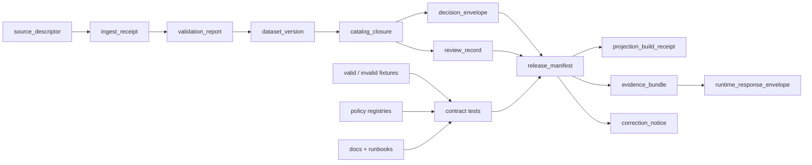

<!-- [KFM_META_BLOCK_V2]
doc_id: kfm://doc/NEEDS-VERIFICATION
title: Schemas
type: standard
version: v1
status: draft
owners: NEEDS-VERIFICATION
created: YYYY-MM-DD
updated: YYYY-MM-DD
policy_label: NEEDS-VERIFICATION
related: [NEEDS-VERIFICATION]
tags: [kfm, schemas, contracts, json-schema]
notes: [Target path for this task is schemas/README.md; March 2026 realization overlays more often describe the same surface as contracts/schemas/; mounted workspace exposed PDFs only.]
[/KFM_META_BLOCK_V2] -->

# Schemas

Machine-readable KFM contract schemas for source intake, governed publication, runtime trust, and correction.


**Status:** experimental  
**Owners:** NEEDS VERIFICATION  
**Truth posture:** CONFIRMED doctrine · PROPOSED repo-local realization · UNKNOWN current file inventory

**Quick jumps:** [Scope](#scope) · [Repo fit](#repo-fit) · [Accepted inputs](#accepted-inputs) · [Directory tree](#directory-tree) · [First-wave contract families](#first-wave-contract-families) · [Standards profile](#standards-profile) · [Validation and gates](#validation-and-gates) · [Task list](#task-list--definition-of-done) · [FAQ](#faq)

> [!IMPORTANT]
> This README is anchored to the repo-local path named in the task: `schemas/README.md`.  
> The strongest March 2026 KFM realization overlays more often describe the same surface as `contracts/schemas/`. Treat that as a **path-reconciliation item**, not as settled repo truth.

> [!NOTE]
> The current-session workspace exposed a rich PDF corpus, but **did not expose a mounted KFM repo tree, schema directory, tests, workflow files, or deployment manifests**. This README is therefore **repo-ready in structure** but intentionally explicit about what still needs verification.

## Scope

This directory is the schema surface that turns KFM contract families into machine-checkable artifacts. Its job is to make source intake, catalog closure, policy decisions, runtime outcomes, and correction flows **typed, diffable, testable, and reviewable**.

Keep this surface small, explicit, and boring in the best possible way:

- one schema per contract family
- one clear object purpose per file
- shared vocabulary kept stable
- examples and invalid fixtures reviewed in lockstep
- no hidden schema drift inside service code or polished prose

[Back to top](#schemas)

## Repo fit

| Item | Value |
|---|---|
| Path | `schemas/README.md` |
| Role in the repo | Directory README for the machine-readable contract schema surface |
| Upstream links | `TODO — verify canonical neighbors in mounted repo` |
| Downstream links | `TODO — verify fixture, test, API, event, and policy locations in mounted repo` |
| Corpus-aligned equivalent | `contracts/schemas/` appears more often in March 2026 realization overlays |
| Current treatment | This README describes the schema surface generically and keeps final path normalization explicit |

### What this directory should own

The schema layer should own the **JSON object contracts** that carry the KFM evidence lifecycle and runtime trust model.

### What this directory should not pretend to own

This directory is not the whole contract system. It should not silently absorb API descriptions, policy bundles, example fixtures, or published catalog artifacts just because they are also “JSON.”

[Back to top](#schemas)

## Accepted inputs

Accepted here:

- versioned JSON Schema files for KFM object envelopes
- local shared fragments or reusable `$ref` targets if the repo colocates them here
- schema comments and titles that help reviewers understand contract intent
- directory-local guidance that explains naming, review expectations, and drift controls

Typical examples:

- `source_descriptor.schema.json`
- `dataset_version.schema.json`
- `decision_envelope.schema.json`
- `release_manifest.schema.json`
- `evidence_bundle.schema.json`
- `runtime_response_envelope.schema.json`
- `correction_notice.schema.json`

## Exclusions

Do **not** place these here unless repo truth explicitly says otherwise:

- OpenAPI files and HTTP route descriptions
- valid or invalid example fixtures
- policy bundles, reason registries, or reviewer-role maps
- emitted STAC/DCAT/PROV catalog documents
- generated proof objects, receipts, or correction artifacts
- runbooks, ADRs, or governance prose
- UI payload snapshots or screenshots

Preferred homes for those surfaces are repo-truth questions and remain **NEEDS VERIFICATION** in the current session.

[Back to top](#schemas)

## Directory tree

The tree below is an **illustrative first wave** for this directory, adapted to the task-local `schemas/` path.

```text
schemas/
├── README.md
├── source_descriptor.schema.json
├── ingest_receipt.schema.json
├── validation_report.schema.json
├── dataset_version.schema.json
├── catalog_closure.schema.json
├── decision_envelope.schema.json
├── review_record.schema.json
├── release_manifest.schema.json
├── projection_build_receipt.schema.json
├── evidence_bundle.schema.json
├── runtime_response_envelope.schema.json
└── correction_notice.schema.json
```

> [!TIP]
> Start flatter than you think. The March 2026 overlays repeatedly favor a **small first wave** over a deeply nested, over-designed schema forest.

## Quickstart

1. Start with the first-wave contract families that the March 2026 overlays repeatedly elevate.
2. Pair every schema added here with at least one valid and one invalid fixture in the repo’s fixture surface.
3. Wire schema validation into contract tests and fail the merge on drift.
4. Update documentation, examples, and any standards-profile pin in the same review.
5. Treat missing examples, missing invalid fixtures, or undocumented breaking changes as release blockers.

```bash
# illustrative pseudocode — bind these steps to the repo's actual validator runner
validate_schemas schemas/*.schema.json
validate_valid_fixtures <fixtures/valid>
assert_invalid_fixtures_fail <fixtures/invalid>
run_contract_tests <tests/contracts>
```

## Usage

### Working rules for this directory

- Prefer **one schema file per contract family**.
- Keep envelope names stable enough to diff and discuss in code review.
- Carry explicit object identity and version fields in envelope-style objects.
- Keep shared enumerations or common fragments centralized; do not duplicate them opportunistically.
- Publish schema changes with matching fixture and documentation changes.
- Do not bury schema truth inside API handlers, worker code, or UI conditionals.

### First-wave contract families

| Contract family | Why it exists | Must be ready before |
|---|---|---|
| `source_descriptor` | Makes source admissibility, access mode, rights posture, cadence, scope, and validation burden explicit | governed ingestion |
| `ingest_receipt` | Proves that a fetch and landing event occurred | replayable intake |
| `validation_report` | Records what passed, failed, or entered quarantine | canonical write or quarantine |
| `dataset_version` | Carries the authoritative processed subject set | catalog closure |
| `catalog_closure` | Closes release metadata and lineage linkage | release assembly |
| `decision_envelope` | Expresses policy result machine-readably | promotion or runtime admissibility |
| `review_record` | Captures approval, denial, escalation, or note | policy-significant transition |
| `release_manifest` | Binds a public-safe release to approved inputs | public or restricted publication |
| `projection_build_receipt` | Proves a derived layer came from a known release | derived visibility |
| `evidence_bundle` | Packages inspectable support for a claim, feature, story, export preview, or answer | claim, feature, story, or answer support |
| `runtime_response_envelope` | Makes answer / abstain / deny / error outcomes accountable | governed runtime release |
| `correction_notice` | Preserves lineage under supersession, withdrawal, or narrowing | visible correction workflow |

### Standards profile

The schema surface should not leave standards-fit implicit.

| Concern | Recommended profile | What it is for |
|---|---|---|
| Machine-readable object schemas | JSON Schema Draft 2020-12 | contract schemas, examples, invalid fixtures, schema-aware docs |
| Public API descriptions | OpenAPI 3.2.0 | HTTP route contracts; keep this outside `schemas/` |
| Dataset / release discovery metadata | DCAT 3 | outward catalog metadata |
| Outward provenance | PROV-O | lineage vocabulary for entities, activities, and agents |
| Spatiotemporal collections and assets | STAC | collection / item / asset structure |
| Feature read routes | OGC API - Features | standards-aligned authoritative feature reads |
| Map and tile portrayal | OGC API - Maps / Tiles | portrayal and tiled delivery when exposed |
| Catalog search routes | OGC API - Records | optional interoperable discovery API |
| Accessibility baseline | WCAG 2.2 | trust-visible documentation and review usability |
| Observability semantics | OpenTelemetry semantic conventions | stable naming and join discipline for operational evidence |

> [!IMPORTANT]
> Standards pins belong in an explicit profile surface, not in tribal memory.  
> This README names the recommended profile; the repo-local home for the actual standards pin file remains **NEEDS VERIFICATION**.

[Back to top](#schemas)

## Schema lifecycle


```mermaid
flowchart LR
    A[source_descriptor] --> B[ingest_receipt]
    B --> C[validation_report]
    C --> D[dataset_version]
    D --> E[catalog_closure]
    E --> F[decision_envelope]
    E --> G[review_record]
    F --> H[release_manifest]
    G --> H
    H --> I[projection_build_receipt]
    H --> J[evidence_bundle]
    J --> K[runtime_response_envelope]
    H --> L[correction_notice]

    M[valid / invalid fixtures] --> N[contract tests]
    O[policy registries] --> N
    P[docs + runbooks] --> N
    N --> H
```

### Why the flow matters

The schema surface is not just a bag of JSON shapes. It mirrors the governed movement of KFM artifacts from intake through release, runtime trust, and correction.

## Validation and gates

| Gate | What it proves | Minimum expectation |
|---|---|---|
| Schema gate | structural acceptance is machine-checkable | every schema validates and matches its published examples |
| Valid/invalid fixture gate | fail-closed behavior is real | at least one passing and one failing example per contract family |
| Catalog closure gate | STAC / DCAT / PROV linkage resolves coherently | release-bound artifacts are link-complete |
| Policy bundle gate | reason and obligation vocabularies are executable | no ad hoc free-text drift for governed decisions |
| Release assembly gate | visible change cannot bypass release proof | manifest or equivalent proof object exists |
| Evidence resolution gate | consequential outputs remain inspectable | claims and answers resolve to support |
| Runtime citation-negative test | the system abstains, denies, or errors rather than fabricating support | negative-path tests exist |
| Documentation gate | docs, contracts, examples, and runbooks stay aligned | behavior-significant changes update the relevant docs |

> [!WARNING]
> A schema without fixtures and tests is still useful, but it is not yet a trustworthy contract surface.

[Back to top](#schemas)

## Task list / Definition of done

- [ ] The schema surface contains the first-wave contract families actually shipped in this repo.
- [ ] Every published schema has at least one valid and one invalid fixture somewhere in the governed fixture surface.
- [ ] Standards pins are explicit rather than implied.
- [ ] Schema changes run through contract tests and fail closed on drift.
- [ ] Runtime, release, and correction objects reuse the same contract grammar instead of inventing local dialects.
- [ ] Documentation, examples, and runbooks travel in the same review stream as the schemas they describe.
- [ ] Path reconciliation between `schemas/` and any `contracts/` surface is verified against repo truth.
- [ ] Owners, dates, and related-doc links in the meta block are filled in before publication.

## FAQ

### Why does this README mention `contracts/schemas/` if the task path is `schemas/README.md`?

Because the strongest March 2026 realization overlays more often describe the machine-readable schema surface as `contracts/schemas/`. This README stays faithful to the task-local path while flagging the repo-local placement decision as **NEEDS VERIFICATION**.

### Do OpenAPI files belong here?

No. Keep HTTP API descriptions in the API contract surface. This directory is for machine-readable object schemas.

### Are STAC, DCAT, and PROV documents stored here?

Not by default. Those are outward catalog and lineage artifacts, not the local object-schema source of truth.

### Are schemas alone enough to make KFM trustworthy?

No. KFM also expects valid and invalid fixtures, policy registries, contract tests, evidence resolution, release proof, correction drill-through, and documentation that stays aligned with behavior.

## Appendix

<details>
<summary><strong>Need-to-verify items before publishing this README</strong></summary>

| Item | Why it matters |
|---|---|
| Actual repo tree | Prevents path assumptions from hardening into pseudo-fact |
| Existing schema inventory | Avoids documenting files that already differ in name or split |
| Fixture directory location | Needed for accurate quickstart and downstream references |
| Standards-profile file location | Needed so this README links to the real pin file |
| Contract-test runner | Needed for truly runnable quickstart examples |
| Owners / created / updated fields | Required to publish the KFM meta block honestly |

</details>

<details>
<summary><strong>Provisional crosswalk: repo-local <code>schemas/</code> versus the broader contract surface</strong></summary>

| Surface | Belongs here? | Notes |
|---|---|---|
| Object envelope schemas | Yes | This directory’s core job |
| Shared schema fragments | Maybe | Only if repo-local placement keeps `$ref` usage simple |
| OpenAPI docs | No | Keep in the API contract surface |
| Event schemas | Usually no | Keep in the event contract surface if split separately |
| Policy registries | No | Keep with policy, not with object-shape definitions |
| Valid / invalid fixtures | No | Keep in fixture surfaces used by tests and docs |
| Runbooks / ADRs | No | Keep in docs, but update them with schema changes |

</details>

[Back to top](#schemas)# schemas

This directory is intentionally kept in the repository, even when empty.
