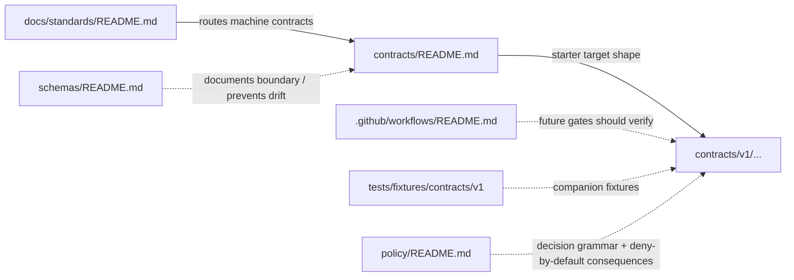

<!-- [KFM_META_BLOCK_V2]
doc_id: kfm://doc/NEEDS-VERIFICATION
title: Schemas
type: standard
version: v1
status: draft
owners: @bartytime4life
created: 2026-03-15
updated: 2026-03-28
policy_label: public
related: [../README.md, ../contracts/README.md, ../docs/standards/README.md, ../policy/README.md, ../tests/README.md, ../.github/workflows/README.md, ../.github/CODEOWNERS]
tags: [kfm, schemas, contracts, json-schema]
notes: [doc_id unresolved, created date inferred from public GitHub file history, updated date reflects this proposed revision, /schemas/ ownership currently resolves via CODEOWNERS global fallback, authoritative schema home remains unresolved]
[/KFM_META_BLOCK_V2] -->

# Schemas

Boundary and authority guide for the `schemas/` lane while KFM retires schema-home ambiguity and keeps machine contracts singular.

> **Status:** experimental · **Doc status:** draft  
> **Owners:** `@bartytime4life` *(via global fallback in [`../.github/CODEOWNERS`](../.github/CODEOWNERS); no narrower `/schemas/` rule was verified on public `main`)*  
>        
> **Repo fit:** path `schemas/README.md` · upstream [`../README.md`](../README.md) · current contract lane [`../contracts/README.md`](../contracts/README.md) · standards routing [`../docs/standards/README.md`](../docs/standards/README.md) · workflow guardrails [`../.github/workflows/README.md`](../.github/workflows/README.md)  
> **Quick jumps:** [Scope](#scope) · [Repo fit](#repo-fit) · [Inputs](#inputs) · [Exclusions](#exclusions) · [Directory tree](#directory-tree) · [Quickstart](#quickstart) · [Usage](#usage) · [Diagram](#diagram) · [Tables](#tables) · [Task list](#task-list--definition-of-done) · [FAQ](#faq) · [Appendix](#appendix)

> [!IMPORTANT]
> Current public `main` shows `schemas/` containing `README.md` only. Treat this directory as a documented boundary surface, not as an already-materialized schema registry.

> [!WARNING]
> The repo currently exposes both `schemas/` and `contracts/`. Until one authoritative schema home is made explicit, adding the same trust-bearing object family to both is drift, not redundancy.

> [!NOTE]
> `docs/standards/README.md` currently routes “API endpoint schemas and machine contracts” to [`../contracts/`](../contracts/), while [`../contracts/README.md`](../contracts/README.md) still records schema-home authority as unresolved. This README exists to keep that ambiguity visible rather than quietly hardening the wrong home.

## Scope

`schemas/` is a small but important lane.

Its current job is not to pretend that a full schema registry already lives here. Its job is to keep the path visible, prevent a second authoritative contract universe from growing by accident, and point contributors toward the current machine-contract lane until the repo resolves authority explicitly.

That means this README should do four things well:

- record the current public repo state without overclaiming
- preserve KFM’s contract-first doctrine
- prevent silent duplication across `schemas/` and `contracts/`
- stay light enough that it can become a stable pointer if `contracts/` is made canonical

KFM’s doctrine is still the same: machine-readable contracts are part of the trust membrane. But singular authority matters just as much as good schema design. A validator cannot safely govern two competing homes for the same trust-bearing objects.

### Truth posture used here

| Marker | Meaning in this README |
|---|---|
| **CONFIRMED** | Visible on current public `main` or directly grounded in the March 2026 KFM corpus |
| **PROPOSED** | Doctrine-consistent starter shape or convergence layout not yet proven as live repo implementation |
| **UNKNOWN / NEEDS VERIFICATION** | An authority, inventory, or validation detail that should not be treated as settled until branch-inspected |

[Back to top](#schemas)

## Repo fit

| Item | Value |
|---|---|
| Path | `schemas/README.md` |
| Role | Directory README for the `schemas/` lane and guardrail against parallel schema authority |
| Current public `main` snapshot | `schemas/` contains `README.md` only |
| Strongest current machine-contract lane | [`../contracts/README.md`](../contracts/README.md) |
| Standards routing signal | [`../docs/standards/README.md`](../docs/standards/README.md) routes API endpoint schemas and machine contracts to `../contracts/` |
| Workflow signal | [`../.github/workflows/README.md`](../.github/workflows/README.md) is README-only today and treats `contracts/`, `schemas/`, `policy/`, and `tests/` as canonical verification surfaces |
| Ownership signal | `@bartytime4life` via `.github/CODEOWNERS` global fallback; no narrower `/schemas/` rule is visible on current public `main` |
| Current authority posture | **UNKNOWN / NEEDS VERIFICATION** — the repo has not yet made one schema home singular in a way this README can treat as settled |
| Why this file still matters | The repo already publishes a top-level `schemas/` lane, so it needs an explicit boundary contract even if authoritative schema files ultimately land elsewhere |

### Upstream and downstream links

| Direction | Path | Why it matters |
|---|---|---|
| Upstream | [`../README.md`](../README.md) | Root system identity and top-level repository framing |
| Lateral | [`../contracts/README.md`](../contracts/README.md) | Current strongest contract publication and starter target shape |
| Lateral | [`../docs/standards/README.md`](../docs/standards/README.md) | Shared rules, profile placement, and standards-to-contract boundary |
| Lateral | [`../policy/README.md`](../policy/README.md) | Policy bundles, reasons, obligations, and deny-by-default runtime consequences |
| Lateral | [`../tests/README.md`](../tests/README.md) | Fixture and verification expectations |
| Downstream | [`../.github/workflows/README.md`](../.github/workflows/README.md) | Future merge-blocking validation, proof, and correction gates |

### Working interpretation

Use this file as the documentary boundary for `schemas/`, not as permission to grow a second registry.

At the moment, the strongest safe reading is:

1. keep `schemas/README.md` in place because the lane exists publicly
2. treat `../contracts/` as the stronger working signal for machine contracts
3. do not land competing authoritative object families in both places
4. resolve schema-home authority explicitly before wiring merge-blocking validators

[Back to top](#schemas)

## Inputs

Accepted here:

| Belongs here | Why it belongs here |
|---|---|
| This README | The lane already exists and needs an explicit boundary contract |
| Authority-resolution notes | This is the right place to explain how `schemas/` relates to `contracts/` |
| Pointer-style transition guidance | Contributors need a clear “put it there, not here” rule |
| Non-authoritative generated outputs **only if explicitly designated** | Acceptable only when the repo clearly marks them as compiled or mirrored artifacts, not source-of-truth contracts |
| Short maintenance notes tied to the lane itself | Useful when they prevent drift or clarify ownership |

### Minimum bar for anything added here

- it is clearly marked authoritative or non-authoritative
- it does not duplicate an authoritative contract family already owned elsewhere
- it keeps relative links to `contracts/`, `policy/`, `tests/`, and workflow guidance current
- it does not make schema-home authority more ambiguous than it already is

## Exclusions

The following do **not** belong here as canonical source-of-truth assets unless the repo explicitly changes direction:

| Does not belong here | Put it here instead | Why |
|---|---|---|
| New authoritative `*.schema.json` contract families | [`../contracts/`](../contracts/) | Current repo signals point machine contracts there more strongly |
| Policy bundles, reason codes, obligation codes, reviewer-role registries | [`../policy/README.md`](../policy/README.md) or the confirmed shared vocab lane | Policy should stay executable and reviewable, not forked through schema docs |
| Valid / invalid fixture packs | [`../tests/README.md`](../tests/README.md) or the confirmed fixture home | Fixtures should stay tied to verification, not drift into parallel doc surfaces |
| Workflow YAML and merge-gate wiring | [`../.github/workflows/README.md`](../.github/workflows/README.md) | CI enforces the contract layer; it is not the contract layer |
| Standards profiles and interoperability rules | [`../docs/standards/README.md`](../docs/standards/README.md) | Standards explain shared rules across domains |
| Runtime emitters, resolvers, or service code | app / package implementation surfaces | Consumers and emitters should reference contracts, not live inside this README lane |

> [!CAUTION]
> “Convenience copies” are especially risky here. Once two surfaces both look official, reviewers and validators can follow different trees without noticing.

## Directory tree

### Current public snapshot

```text
schemas/
└── README.md
```

### Current neighboring surfaces relevant to this lane

```text
contracts/
└── README.md

docs/
└── standards/
    └── README.md

.github/
└── workflows/
    └── README.md
```

### Recommended convergence shape after authority is resolved

```text
repo-root/
├── contracts/
│   ├── README.md
│   ├── v1/
│   │   ├── common/
│   │   │   └── header_profile.schema.json
│   │   ├── policy/
│   │   │   └── decision_envelope.schema.json
│   │   ├── evidence/
│   │   │   └── evidence_bundle.schema.json
│   │   ├── runtime/
│   │   │   └── runtime_response_envelope.schema.json
│   │   ├── correction/
│   │   │   └── correction_notice.schema.json
│   │   ├── release/
│   │   │   └── release_manifest.schema.json
│   │   ├── source/
│   │   │   └── source_descriptor.schema.json
│   │   └── data/
│   │       └── dataset_version.schema.json
│   └── vocab/
│       ├── reason_codes.json
│       ├── obligation_codes.json
│       └── reviewer_roles.json
├── tests/
│   └── fixtures/
│       └── contracts/
│           └── v1/
│               ├── valid/
│               └── invalid/
└── schemas/
    └── README.md
```

That target shape is **PROPOSED**. It is useful because it keeps this lane visible while placing actual machine contracts, vocab, and fixtures in one canonical stream.

[Back to top](#schemas)

## Quickstart

1. Read [`../contracts/README.md`](../contracts/README.md) first.
2. Read [`../docs/standards/README.md`](../docs/standards/README.md) next.
3. Before adding any contract family, confirm whether the repo has resolved authoritative schema home.
4. If authority is still unresolved, do **not** add the same object family to both `schemas/` and `contracts/`.
5. When validator paths or authority language change, update this file, `../contracts/README.md`, and `../.github/workflows/README.md` in the same reviewed change.

```bash
# Review the current authority-bearing neighbors
sed -n '1,220p' schemas/README.md
sed -n '1,260p' contracts/README.md
sed -n '1,220p' docs/standards/README.md
sed -n '1,220p' .github/workflows/README.md

# Confirm current ownership fallback before narrowing it
sed -n '300,340p' .github/CODEOWNERS

# Search for schema-home language before adding files
git grep -nE 'authoritative schema home|parallel schema|machine contracts|schema home' -- \
  schemas contracts docs .github
```

### Safe first move

A safe first move is not “add a schema here.”

A safe first move is:

- retire authority ambiguity
- make one canonical root explicit
- wire fixtures and validation against that single root
- keep this README as the visible boundary contract for the sibling lane

## Usage

### For maintainers

Use this file to keep `schemas/` honest.

If `contracts/` becomes canonical, this README should stay lean and documentary. It should point inward, describe the boundary, and make duplicate authority harder to introduce. If the repo later chooses another arrangement, update sibling docs and validator paths together rather than letting one README drift ahead of the others.

### For contributors

Treat this lane as documentation-first until the repo says more.

That means:

- put new trust-bearing schema work in the canonical surface
- do not assume `schemas/` is canonical just because the directory exists
- do not add generated or mirrored outputs here unless they are labeled non-authoritative
- when in doubt, stop and resolve authority before adding files

### For reviewers

Reject changes that do any of the following:

- introduce the same trust-bearing family in both `schemas/` and `contracts/`
- move validator paths without updating sibling docs
- add new canonical schema files here without an explicit authority decision
- blur the line between standards, contracts, policy, fixtures, and runtime code

### For future authority migration

If the repo later decides that `schemas/` should become canonical after all, do not “just start using it.”

Do the full move:

1. write the decision down
2. update `contracts/README.md`
3. update this README
4. update `docs/standards/README.md`
5. update workflow paths
6. update fixture paths
7. update any consumer docs or emitters that point to the old root

[Back to top](#schemas)

## Diagram


```mermaid
flowchart LR
    A[docs/standards/README.md] -->|routes machine contracts| B[contracts/README.md]
    B -->|starter target shape| C[contracts/v1/...]
    D[schemas/README.md] -.documents boundary / prevents drift.-> B
    E[.github/workflows/README.md] -.future gates should verify.-> C
    F[tests/fixtures/contracts/v1] -.companion fixtures.-> C
    G[policy/README.md] -.decision grammar + deny-by-default consequences.-> C
```

Reading rule: this lane should reduce ambiguity, not add a second source of machine-truth.

## Tables

### A. Current public repo signals

| Signal | Current visible state | What it means here |
|---|---|---|
| `schemas/` | `README.md` only | No live schema registry is evidenced here today |
| `contracts/` | `README.md` only | Current machine-contract lane is still documentary, but carries stronger authority guidance |
| `docs/standards/README.md` | Present | Standards and machine contracts are intentionally separated |
| `.github/workflows/` | `README.md` only | No checked-in public workflow YAML is visible yet |
| `CODEOWNERS` | global fallback `* @bartytime4life`; explicit `/.github/` and `/contracts/` rules; no narrower `/schemas/` rule visible | Ownership exists, but `/schemas/` does not currently have its own narrower rule |

### B. First contract wave after authority resolution

| Wave | Proposed landing path | Why it lands early |
|---|---|---|
| Wave 01 | `contracts/v1/common/header_profile.schema.json` | Shared minimum grammar keeps later families coherent |
| Wave 01 | `contracts/v1/policy/decision_envelope.schema.json` | Makes deny-by-default policy machine-readable |
| Wave 01 | `contracts/v1/evidence/evidence_bundle.schema.json` | Preserves evidence drill-through and reusable support bundles |
| Wave 01 | `contracts/v1/runtime/runtime_response_envelope.schema.json` | Enforces finite runtime outcomes and cite-or-abstain |
| Wave 01 | `contracts/v1/correction/correction_notice.schema.json` | Prevents silent overwrite and preserves correction lineage |
| Wave 01 | `contracts/v1/release/release_manifest.schema.json` | Keeps publication as a governed state transition |
| Wave 01.5 | `contracts/v1/source/source_descriptor.schema.json` | Starts turning source admission into a typed contract |
| Wave 01.5 | `contracts/v1/data/dataset_version.schema.json` | Begins anchoring canonical truth and version identity |
| Companion | `tests/fixtures/contracts/v1/valid/*` | Proves happy-path structure intentionally |
| Companion | `tests/fixtures/contracts/v1/invalid/*` | Proves fail-closed rejection intentionally |

### C. Placement decision matrix

| Candidate change | Belongs in `schemas/` right now? | Better home | Reason |
|---|---|---|---|
| New authoritative runtime envelope schema | No | `../contracts/` | Stronger current contract signal |
| New correction notice schema | No | `../contracts/` | Correction lineage is a trust-bearing contract family |
| Reason / obligation registries | No | `../policy/README.md` or confirmed shared vocab lane | Avoid free-text drift and duplicated policy authority |
| Valid / invalid fixture packs | No | `../tests/README.md` or confirmed fixture lane | Fixtures belong with verification |
| README guidance for schema-home authority | Yes | `schemas/README.md` | This lane already exists and needs a boundary contract |
| Generated compiled schema bundle | Maybe, but only if marked non-authoritative | Depends on explicit repo decision | Generated outputs are acceptable only when authority is unambiguous |

[Back to top](#schemas)

## Task list / Definition of done

- [x] `schemas/` exists as a top-level repo lane.
- [x] `contracts/` exists as a top-level repo lane.
- [x] Current public `schemas/` snapshot is README-only.
- [x] Current public `contracts/` snapshot is README-only.
- [x] Standards guidance currently routes machine contracts to `../contracts/`.
- [ ] ADR or equivalent repo decision resolves authoritative schema home explicitly.
- [ ] Canonical schema root is singular in docs, fixtures, validators, and contributor guidance.
- [ ] First-wave schema files exist in the canonical home.
- [ ] Valid and invalid fixtures exist in their confirmed fixture home.
- [ ] Merge-blocking validation is checked in.
- [ ] `schemas/README.md` and `../contracts/README.md` no longer imply competing authority.
- [ ] Placeholder metadata that still needs verification is retired deliberately rather than silently.

## FAQ

### Why keep `schemas/README.md` if machine contracts probably land in `contracts/`?

Because the repo already exposes a top-level `schemas/` lane. Ignoring it would hide ambiguity instead of governing it. This file keeps the path visible while making duplicate authority harder to introduce.

### Does this README declare `schemas/` deprecated?

No.

It declares the current public state, records the stronger adjacent signal toward `contracts/`, and leaves the final authority decision explicit instead of implied.

### Can generated or compiled schema outputs live here?

Only when the repo explicitly marks them as non-authoritative and keeps the canonical source elsewhere. Without that labeling, generated output becomes a second truth surface.

### Why is duplicate schema placement dangerous here?

Because CI, docs, code review, and runtime consumers can each follow a different tree. That is how “validated” systems still drift into contradictory trust behavior.

### What should happen once schema-home authority is resolved?

This README should get simpler, not more complex. It should either become a narrow pointer to the canonical lane or describe a clearly non-authoritative generated-output role.

[Back to top](#schemas)

## Appendix

<details>
<summary><strong>Historical March 2026 shape signals still worth remembering</strong></summary>

The March 2026 doctrine used more than one schema-shape signal:

- an umbrella signal centered on `schemas/artifacts/` plus `schemas/openapi/`
- a contract-package signal centered on `contracts/jsonschema/` plus fixtures

The current public repo state is simpler and more constrained:

- `schemas/` exists publicly
- `contracts/` exists publicly
- both lanes currently present README-first surfaces

That is exactly why authority needs to be singular before the first merge-blocking validator lands.

</details>

<details>
<summary><strong>Boundary reminders for future edits</strong></summary>

| Surface | What it owns | What it should not quietly absorb |
|---|---|---|
| `schemas/` | boundary guidance, transition notes, non-authoritative pointer behavior | competing canonical schema families |
| `contracts/` | machine-readable trust objects and schema publication | workflow wiring, runtime code, policy engines |
| `policy/` | executable deny-by-default logic, fixtures, decision grammar consequences | duplicated schema definitions |
| `tests/` | fixtures, negative-path proofs, validation harnesses | canonical contract ownership |
| `.github/workflows/` | CI and promotion wiring | shadow copies of contracts or policy |

</details>

<details>
<summary><strong>Maintainer shorthand</strong></summary>

If you only remember one rule from this README, make it this one:

**one authoritative schema home, one fixture home, one validator path, one clearly documented sibling pointer.**

</details>

[Back to top](#schemas)
