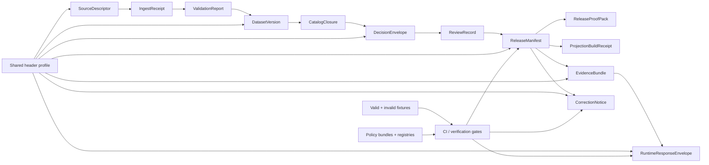

<!-- [KFM_META_BLOCK_V2]
doc_id: kfm://doc/NEEDS-VERIFICATION
title: Schemas
type: standard
version: v1
status: draft
owners: NEEDS-VERIFICATION
created: YYYY-MM-DD
updated: 2026-03-22
policy_label: NEEDS-VERIFICATION
related: [NEEDS-VERIFICATION: canonical working manual path, master design manual path, pass-5 dossier path, geospatial architecture manual path]
tags: [kfm, schemas, contracts, json-schema]
notes: [Task-local target path is schemas/README.md; strongest current repo-shape signal points to contracts/jsonschema/ and a broader schemas/artifacts + schemas/openapi split; mounted repo topology and ownership metadata were not directly visible in this session.]
[/KFM_META_BLOCK_V2] -->

# Schemas

Machine-readable KFM contract schemas for intake, validation, release, runtime trust, and correction.

> **Status:** experimental  
> **Owners:** NEEDS-VERIFICATION  
> 
> 
> 
> 
>   
> **Quick jumps:** [Scope](#scope) · [Repo fit](#repo-fit) · [Inputs](#inputs) · [Exclusions](#exclusions) · [Directory tree](#directory-tree) · [Quickstart](#quickstart) · [Diagram](#diagram) · [Tables](#tables) · [Task list](#task-list--definition-of-done) · [FAQ](#faq) · [Appendix](#appendix)

> [!IMPORTANT]
> This README is source-bounded. In this session, the directly inspectable workspace exposed a KFM PDF corpus under `/mnt/data`, not a mounted repository checkout. Exact repo topology, schema inventory, CI lanes, manifests, DTOs, emitters, and owners remain **UNKNOWN** until the live tree is surfaced.

> [!NOTE]
> This document follows the strongest available March 2026 KFM doctrine, but it keeps path uncertainty explicit. Three signals are currently in play:
>
> - **CONFIRMED task target:** `schemas/README.md`
> - **PROPOSED umbrella shape:** `schemas/artifacts/` and `schemas/openapi/`
> - **PROPOSED contract-package shape:** `contracts/jsonschema/` with adjacent fixtures and a shared header profile

> [!CAUTION]
> Once the mounted tree is visible, choose **one** authoritative home for trust-bearing schema files. Do **not** let `schemas/` and `contracts/jsonschema/` drift into parallel, inconsistent contract universes.

## Scope

This directory is the machine-readable edge of KFM governance.

It exists so that KFM’s trust posture does not stay trapped in prose. Source admission, validation, canonical truth, policy decisions, release state, runtime outcomes, and correction lineage all need typed, diffable, testable objects. A schema surface is where that shift happens.

That surface should stay disciplined:

- shared contract families, not ad hoc payload sprawl
- one visible header grammar across trust-bearing objects
- additive evolution by default
- valid and invalid fixtures beside every consequential family
- explicit separation between **CONFIRMED doctrine**, **PROPOSED realization**, and **UNKNOWN mounted implementation**

A good schema directory in KFM is not a dumping ground for every JSON payload in the system. It is the narrowest possible contract surface that still lets policy, delivery, runtime trust, and correction stay joined.

[Back to top](#schemas)

## Repo fit

| Item | Value |
|---|---|
| Path | `schemas/README.md` |
| Role | Directory README for KFM machine-readable contract schemas |
| Document class | Standard doc + directory README |
| Strongest doctrinal baseline | March 2026 KFM replacement-grade manuals, with the contract/artifact model and shared contract lattice carrying the most weight |
| Mounted repo truth | **UNKNOWN** — no repo checkout was directly visible in this session |
| Strongest repo-shape signal | `contracts/jsonschema/*.schema.json` + adjacent fixtures and `header-profile.schema.json` |
| Additional repo-shape signal | `schemas/artifacts/` + `schemas/openapi/` under a broader repo skeleton |
| Operational neighbors | policy bundles, fixtures, release proof objects, runtime emitters, and documentation/runbooks |

**Upstream / downstream placeholders to verify before publication:**  
`[TODO verify ../docs/contract-lattice.md](../docs/contract-lattice.md)` · `[TODO verify ../contracts/](../contracts/)` · `[TODO verify ../fixtures/](../fixtures/)` · `[TODO verify ../policy/](../policy/)`

### Path resolution rule

1. Keep this file at `schemas/README.md` because that is the explicit task-local target.
2. If the mounted repo already standardizes on `contracts/jsonschema/`, treat `schemas/README.md` as the entry-point README for the broader schema surface and point readers inward.
3. If the mounted repo already uses `schemas/artifacts/` and `schemas/openapi/`, keep this README as the umbrella index for those subtrees.
4. Do not duplicate object families across multiple authoritative homes.

### Interpretation guide

| Signal | Meaning | Trust level |
|---|---|---|
| `schemas/README.md` | Required output path for this task | **CONFIRMED** |
| `schemas/artifacts/` + `schemas/openapi/` | A broader March 2026 repo-skeleton signal | **PROPOSED** |
| `contracts/jsonschema/*.schema.json` | The strongest explicit file-pattern signal in the master design material | **PROPOSED** |
| Mounted repo tree | What the repository actually uses today | **UNKNOWN** |

## Inputs

Accepted here:

- JSON Schema files for trust-bearing KFM object families
- shared header-profile or fragment schemas used across those families
- narrow compatibility notes or migration notes tied directly to schema evolution
- this README and other short maintenance notes that belong with the schema surface

Preferred schema naming:

```text
<family>.schema.json
```

Recommended shared fragment naming:

```text
header-profile.schema.json
```

### Highest-leverage initial wave

The corpus argues for a **small first schema wave**, not a giant one.

```text
header-profile.schema.json
source_descriptor.schema.json
dataset_version.schema.json
decision_envelope.schema.json
release_manifest.schema.json
evidence_bundle.schema.json
runtime_response_envelope.schema.json
correction_notice.schema.json
```

### Immediate follow-on wave

These remain part of the doctrinal lattice, but they can follow once the initial wave is emitted and tested consistently.

```text
ingest_receipt.schema.json
validation_report.schema.json
catalog_closure.schema.json
review_record.schema.json
release_proof_pack.schema.json
projection_build_receipt.schema.json
```

> [!TIP]
> Start with the families that unlock the most downstream trust behavior: source declaration, canonical release identity, policy result, release statement, evidence packaging, runtime envelope, and correction lineage.

## Exclusions

Do **not** place these here unless the mounted repo proves that it intentionally does so:

- generated release manifests, proof packs, receipts, or correction artifacts
- policy bundles, reason registries, obligation registries, rights classes, or sensitivity classes
- runtime-only DTOs that belong to an app-local boundary rather than the shared trust lattice
- outward API runbooks, ADRs, broader governance prose, or operator playbooks
- valid and invalid fixtures if the repo keeps them in a dedicated fixture surface
- emitted STAC, DCAT, or PROV documents
- rebuildable delivery artifacts such as tiles, search indexes, embeddings, or scene layers

A useful rule of thumb: if the file is an **authoritative contract**, it probably belongs here; if it is an **emitted consequence** of a contract, it probably belongs elsewhere.

## Directory tree

**Candidate layout A — umbrella schema surface under `schemas/` (PROPOSED):**

```text
schemas/
├── README.md
├── artifacts/
│   ├── header-profile.schema.json
│   ├── source_descriptor.schema.json
│   ├── dataset_version.schema.json
│   ├── decision_envelope.schema.json
│   ├── release_manifest.schema.json
│   ├── evidence_bundle.schema.json
│   ├── runtime_response_envelope.schema.json
│   ├── correction_notice.schema.json
│   ├── ingest_receipt.schema.json
│   ├── validation_report.schema.json
│   ├── catalog_closure.schema.json
│   ├── review_record.schema.json
│   ├── release_proof_pack.schema.json
│   └── projection_build_receipt.schema.json
└── openapi/
    └── README.md
```

<details>
<summary><strong>Candidate layout B — contract-package surface under <code>contracts/jsonschema/</code> (PROPOSED)</strong></summary>

```text
contracts/
├── README.md
├── header-profile.schema.json
├── jsonschema/
│   ├── source_descriptor.schema.json
│   ├── dataset_version.schema.json
│   ├── decision_envelope.schema.json
│   ├── release_manifest.schema.json
│   ├── evidence_bundle.schema.json
│   ├── runtime_response_envelope.schema.json
│   ├── correction_notice.schema.json
│   ├── ingest_receipt.schema.json
│   ├── validation_report.schema.json
│   ├── catalog_closure.schema.json
│   ├── review_record.schema.json
│   ├── release_proof_pack.schema.json
│   └── projection_build_receipt.schema.json
└── fixtures/
    ├── valid/
    └── invalid/
```

</details>

<details>
<summary><strong>Candidate layout C — hybrid repo shape seen across the March 2026 corpus (PROPOSED)</strong></summary>

```text
repo/
├── schemas/
│   ├── README.md
│   ├── artifacts/
│   └── openapi/
├── packages/
│   └── contracts/
├── fixtures/
│   ├── valid/
│   └── invalid/
├── policy/
├── docs/
└── workflows/ or .github/workflows/
```

This hybrid is attractive when the repo wants:
- a public, easy-to-find schema index at `schemas/`
- reusable helpers, emitters, and migration logic in `packages/contracts/`
- dedicated fixture packs outside the schema tree

</details>

## Quickstart

1. Confirm the authoritative schema home in the mounted tree.
2. Publish the shared header-profile schema first.
3. Publish the smallest high-value schema wave.
4. Add one valid and one invalid fixture for each emitted family.
5. Wire schema linting and fixture checks into CI before broadening the lattice.
6. Prove one hydrology-first thin slice end to end before scaling out to more burdensome lanes.

```bash
# illustrative pseudocode — bind to the mounted repo's real runner and paths
validate 'schemas/artifacts/**/*.schema.json' 'contracts/jsonschema/**/*.schema.json'
validate 'fixtures/valid/**/*.json'
assert_invalid 'fixtures/invalid/**/*.json'

run gate:source-admission
run gate:validation
run gate:catalog-closure
run gate:policy-bundle
run gate:release-proof
run gate:evidence-resolution
run gate:runtime-citation-negative
run gate:surface-state
run gate:correction-drill
run gate:docs-accessibility
```

### Definition of a good first merge

A strong first merge here would include:

- one shared header profile
- one high-value schema family
- positive and negative fixtures
- CI validation
- one emitter or consumer proving the contract is not dead documentation

## Usage

### Working rules

- Treat schema changes, fixture changes, and gate changes as one review stream.
- Prefer additive evolution over silent breaking change.
- Keep human review history and machine-effective policy distinct.
- Keep emitted truth-bearing objects downstream of the schemas that define them.
- Require migration notes when outward semantics, required fields, or enums change.
- Preserve **fail-closed** meaning in the contract itself, not only in comments or runbooks.

### Common header grammar

Every trust-bearing object family should share enough structure to stay joinable across policy, release, runtime, and correction.

| Field family | Why it matters |
|---|---|
| `kind` + `schema_version` | Makes identity and evolution explicit |
| Stable IDs / release refs | Keeps joins across catalogs, logs, proof packs, and corrections possible |
| Time fields | Prevents observed time, acquisition time, processing time, publication time, and correction time from collapsing into one vague timestamp |
| Rights / sensitivity class | Keeps publication and runtime behavior policy-aware |
| Evidence / policy / review refs | Makes governance operational |
| Digest / audit refs | Supports rebuild, comparison, and audit |
| Supersession / withdrawal pointers | Prevents silent overwrite |

### What this directory optimizes for

This surface is optimizing for:

- contract clarity
- verification leverage
- runtime honesty
- correction lineage

That means a schema here is successful only if it helps another surface do one of the following reliably:

- validate an object
- reject an unsafe or incomplete object
- explain a visible runtime outcome
- preserve continuity through rollback, withdrawal, or supersession

## Diagram


```mermaid
flowchart LR
    A[SourceDescriptor] --> B[IngestReceipt]
    B --> C[ValidationReport]
    C --> D[DatasetVersion]
    D --> E[CatalogClosure]
    E --> F[DecisionEnvelope]
    F --> G[ReviewRecord]
    G --> H[ReleaseManifest]
    H --> I[ReleaseProofPack]
    H --> J[ProjectionBuildReceipt]
    H --> K[EvidenceBundle]
    K --> L[RuntimeResponseEnvelope]
    H --> M[CorrectionNotice]

    N[Shared header profile] --> A
    N --> D
    N --> F
    N --> H
    N --> K
    N --> L
    N --> M

    O[Valid + invalid fixtures] --> P[CI / verification gates]
    Q[Policy bundles + registries] --> P
    P --> H
    P --> L
    P --> M
```

The architectural point is simple: KFM’s schema surface is not a passive reference shelf. It is the typed object graph through which governance becomes executable.

## Tables

### A. Highest-leverage initial wave

| Family | Minimum purpose | Why it starts early |
|---|---|---|
| `SourceDescriptor` | Declare governed source-admission contract | It anchors intake, replayability, and source-role discipline |
| `DatasetVersion` | Declare authoritative candidate or promoted truth | It is the canonical join object for release-backed meaning |
| `DecisionEnvelope` | Express machine-readable policy result | It makes default-deny and obligation handling executable |
| `ReleaseManifest` | Declare release scope and inventory | It makes promotion legible and rollback-aware |
| `EvidenceBundle` | Package inspectable support for a claim | It is central to drawer, dossier, export, and Focus trust behavior |
| `RuntimeResponseEnvelope` | Make answer/abstain/deny/error explicit | It prevents fluent but uncited runtime leakage |
| `CorrectionNotice` | Preserve visible lineage when meaning changes | It prevents silent overwrite |

### B. Doctrinal lattice beyond the first wave

| Family | Lifecycle seam | Typical consequence if missing |
|---|---|---|
| `IngestReceipt` | Source edge -> RAW / WORK | Fetches cannot be replayed or audited cleanly |
| `ValidationReport` | WORK / QUARANTINE -> PROCESSED | Canonical write loses explicit pass/fail reasoning |
| `CatalogClosure` | Canonical truth -> outward discovery | Release loses metadata/lineage closure |
| `ReviewRecord` | Policy / human review | Approval history collapses into implied state |
| `ReleaseProofPack` | Promotion / publication | Publishable trust state remains under-proven |
| `ProjectionBuildReceipt` | Derived delivery | Tiles, exports, search, or scenes lose release linkage |

### C. Placement decision matrix

| Question | Safe answer today |
|---|---|
| Is `schemas/README.md` the required target file? | **Yes** |
| Is `schemas/` definitely the live repo home of the schema pack? | **No — UNKNOWN** |
| Is `contracts/jsonschema/` the strongest explicit file-pattern signal in the current corpus? | **Yes** |
| Does the corpus also support a broader `schemas/artifacts/` + `schemas/openapi/` split? | **Yes** |
| Can this README claim the mounted repo already contains those directories? | **No** |
| Should the doc hide that path split? | **No** |

### D. Validation and gate expectations

| Gate | What it should prove | Typical proof object |
|---|---|---|
| Source admission gate | Source declaration is typed, rights-aware, and reviewable | `SourceDescriptor` |
| Intake receipt gate | Fetch and landing are replayable | `IngestReceipt` |
| Validation gate | Structural, spatial, temporal, and domain checks are explicit | `ValidationReport` |
| Canonical write gate | Only validated truth reaches canonical state | `DatasetVersion` |
| Catalog closure gate | Discoverability, lineage, and rights are coherent enough for outward use | `CatalogClosure` |
| Policy bundle gate | Deny-by-default and obligation grammar are executable | `DecisionEnvelope` + policy tests |
| Release assembly gate | Release is inventory-complete and rollback-aware | `ReleaseManifest` / `ReleaseProofPack` |
| Evidence-resolution gate | Visible claims resolve to inspectable support | `EvidenceBundle` |
| Runtime citation-negative test | Uncited or empty-scope answers fail closed | `RuntimeResponseEnvelope` |
| Correction drill | Supersession and withdrawal remain visible | `CorrectionNotice` |

### E. Standards and interoperability profile

| Concern | Baseline posture | Mounted conformance |
|---|---|---|
| Shared object contracts | **JSON Schema** is a confirmed fit | **UNKNOWN** exact local pin |
| Governed route contracts | **OpenAPI** is a confirmed fit | **UNKNOWN** exact local pin |
| Discoverability + lineage closure | **DCAT + STAC + PROV** are confirmed fits | **UNKNOWN** exact emitted profile |
| Geospatial outward APIs | **OGC API families** are a strong fit where exposed | **UNKNOWN** local adoption depth |
| Accessibility | **WCAG 2.2** is a confirmed fit | **UNKNOWN** current harness coverage |
| Policy execution | **OPA / Rego or equivalent** is a strong fit | **UNKNOWN** mounted bundle shape |
| Release integrity | **OCI + signatures/attestations where adopted** | **UNKNOWN** mounted implementation |
| Observability joins | **OpenTelemetry-compatible naming** | **UNKNOWN** mounted convention |

[Back to top](#schemas)

## Task list / Definition of done

- [ ] Verify the authoritative schema home in the mounted repo.
- [ ] Publish `header-profile.schema.json` or equivalent shared fragment.
- [ ] Publish the highest-leverage initial schema wave.
- [ ] Add at least one valid and one invalid fixture per initial family.
- [ ] Publish compatibility and migration notes for outward contract changes.
- [ ] Add schema validation to CI.
- [ ] Add runtime-emitter checks for response envelopes.
- [ ] Add policy bundle tests that exercise deny-by-default behavior.
- [ ] Prove one hydrology-first thin slice with evidence drill-through and correction visibility.
- [ ] Surface mounted schema inventory, route inventory, workflow inventory, and ownership metadata.
- [ ] Replace meta-block placeholders before publication.

## FAQ

### Why is this README path-cautious?

Because the current session exposed only the PDF corpus, not the live repo tree. The doctrine is strong; the mounted file layout is not yet proven.

### Why mention both `schemas/` and `contracts/jsonschema/`?

Because the task target is `schemas/README.md`, while the strongest explicit March 2026 path signal for concrete schema files is `contracts/jsonschema/*.schema.json`. A second repo-skeleton signal also shows `schemas/artifacts/` and `schemas/openapi/`. The honest move is to keep that split visible.

### Does this README claim the schema pack already exists?

No. It describes the **CONFIRMED doctrinal lattice** and the **PROPOSED repo shapes** that best fit the current corpus.

### Why start with fewer schema families than the full lattice names?

Because the March 2026 design material explicitly prefers a small first schema wave with fixtures over an enormous fragile schema universe.

### Why does hydrology keep appearing in a schema README?

Because hydrology is the strongest first thin slice in the current corpus. It is rich enough to exercise stage transitions, release proof, EvidenceBundle behavior, runtime envelopes, and correction, while usually staying safer than the most stewardship-heavy lanes.

### Do API contracts belong here too?

Only partly. Shared route-contract schemas can be adjacent to this surface, but the broader outward API description should stay in a governed OpenAPI surface rather than dissolving into artifact schemas.

## Appendix

<details>
<summary><strong>Direct verification backlog</strong></summary>

| Unknown area | Why it matters | What would verify it |
|---|---|---|
| Mounted repo topology | Prevents this README from hardening a guessed path into fact | Direct repo tree export |
| Live schema inventory | Distinguishes doctrine from mounted files | Schema index from the real tree |
| Fixture inventory | Determines whether CI claims are real | Valid/invalid fixture packs |
| Workflow inventory | Turns gate claims into evidence | Workflow YAML or equivalent runner configs |
| Runtime emitters | Shows whether services actually emit the documented contracts | Sample payloads + tests |
| EvidenceBundle resolver | Critical for drawer and Focus trust behavior | Resolver contract + sample resolution trace |
| Correction tooling | Needed for visible lineage claims | Correction artifact + drill record |
| Ownership metadata | Needed for publication-readiness | CODEOWNERS or equivalent ownership map |

</details>

<details>
<summary><strong>Fail-closed consequences by family</strong></summary>

| Family | Fail-closed consequence |
|---|---|
| `SourceDescriptor` | No governed admission; reject, hold, or quarantine |
| `IngestReceipt` | Hold or quarantine because replay and provenance are incomplete |
| `ValidationReport` | Block canonical write |
| `DatasetVersion` | No authoritative state transition |
| `CatalogClosure` | No outward discoverability package |
| `DecisionEnvelope` | Deny, hold, generalize, or require review |
| `ReviewRecord` | Hold or escalate when human approval is required |
| `ReleaseManifest` | No trustworthy promotion |
| `ReleaseProofPack` | Candidate remains unpublishable |
| `ProjectionBuildReceipt` | Mark derived artifact stale, rebuild, or withdraw |
| `EvidenceBundle` | Runtime must abstain, deny, or error rather than bluff |
| `RuntimeResponseEnvelope` | No uncited answer and no hidden fifth outcome |
| `CorrectionNotice` | No silent overwrite of published meaning |

</details>

<details>
<summary><strong>Surfaces that must stay aligned with schema changes</strong></summary>

| Surface | Why it must travel with schema work |
|---|---|
| Valid / invalid fixtures | They prove acceptance and rejection behavior |
| Policy bundles | Contract and policy must agree on fields, states, and reasons |
| Runtime services | Envelopes only matter if real services emit them |
| Release proof objects | Contracts should stay tied to emitted reality |
| Runbooks | Operators need matching replay, rollback, and correction guidance |
| Documentation / accessibility gates | Trust-visible behavior must stay documented and reviewable |

</details>

[Back to top](#schemas)
