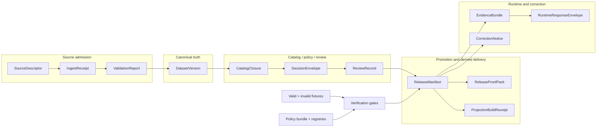

<!-- [KFM_META_BLOCK_V2]
doc_id: kfm://doc/NEEDS-VERIFICATION
title: Schemas
type: standard
version: v1
status: draft
owners: NEEDS-VERIFICATION
created: YYYY-MM-DD
updated: 2026-03-19
policy_label: NEEDS-VERIFICATION
related: [NEEDS-VERIFICATION]
tags: [kfm, schemas, contracts, json-schema]
notes: [Task-local target path is schemas/README.md; current-session evidence was PDF-only; mounted repo topology, schema inventory, and ownership metadata still need direct verification before publication.]
[/KFM_META_BLOCK_V2] -->

# Schemas

Machine-readable KFM contract schemas for intake, validation, release, runtime trust, and correction.

> **Status:** experimental  
> **Owners:** NEEDS-VERIFICATION  
> **Truth posture:** CONFIRMED doctrine · PROPOSED repo-local realization · UNKNOWN mounted schema inventory  
> 
> 
> 
> 
>   
> **Quick jumps:** [Scope](#scope) · [Repo fit](#repo-fit) · [Inputs](#inputs) · [Directory tree](#directory-tree) · [Quickstart](#quickstart) · [Diagram](#diagram) · [Tables](#tables) · [Task list](#task-list--definition-of-done) · [FAQ](#faq) · [Appendix](#appendix)

> [!IMPORTANT]
> This README is source-bounded. In this session, the directly visible workspace exposed a KFM PDF corpus under `/mnt/data`, not a mounted repository checkout. Keep repo-local filenames, schema inventory, CI lanes, manifests, route names, and emitters explicitly **UNKNOWN** until the live tree is surfaced.

> [!NOTE]
> The schema surface is doctrinally strong, but path realization is still unsettled. Current materials support a **schema-first contract lattice** and show **two competing layout signals**:
>
> - a task-local documentation target at `schemas/README.md`
> - a broader contract-surface signal around `contracts/` / `contracts/jsonschema/`
>
> This README keeps that mismatch visible instead of flattening it into faux certainty.

## Scope

This directory, wherever the mounted repo ultimately places it, is the machine-readable edge of KFM’s governed truth path. It is where intake, validation, release, runtime explanation, and correction stop being only prose and become typed, diffable, reviewable, and gateable artifacts.

The goal here is not to accumulate every possible object family on day one. The goal is to publish the smallest schema surface that can prove one governed slice end to end without hiding uncertainty, bypassing policy, or letting derived/runtime convenience masquerade as canonical truth.

This surface should stay disciplined:

- one contract family per schema file unless shared fragments materially reduce drift
- explicit alignment with registries, policy bundles, fixtures, and verification gates
- fail-closed behavior proven with valid and invalid examples
- visible separation between **CONFIRMED doctrine**, **PROPOSED realization**, and **UNKNOWN mounted implementation**

[Back to top](#schemas)

## Repo fit

| Item | Value |
|---|---|
| Path | `schemas/README.md` |
| Document class | Directory README + standard doc |
| Role | Directory-level guide for KFM machine-readable contract schemas |
| Task-local target | `schemas/` |
| Mounted repo truth | **UNKNOWN** — no repo checkout was directly visible in this session |
| Strongest doctrinal baseline | March 2026 KFM doctrine layer, especially the canonical, geospatial, master-design, expanded-working, Pass 5, and Ollama integration manuals |
| Current path signals | `schemas/*.schema.json` + `fixtures/valid/` + `fixtures/invalid/` *(starter artifact-pack signal; PROPOSED)* · `contracts/jsonschema/` + `contracts/fixtures/` *(repo-skeleton signal; PROPOSED)* · top-level `contracts/` *(secondary inventory signal; NEEDS VERIFICATION against mounted repo)* |
| Likely upstream surfaces | `../policy/`, `../registries/`, `../docs/`, `../contracts/` *(all relative links shown as likely neighbors, not mounted truth)* |
| Likely downstream surfaces | `../fixtures/valid/`, `../fixtures/invalid/`, release proofs, runtime envelopes, emitted catalogs, and derived build receipts *(surface names doctrinally grounded; exact paths NEEDS VERIFICATION)* |

### Path interpretation rule

Use these path signals conservatively:

| Signal | Meaning | Trust level |
|---|---|---|
| `schemas/README.md` | The requested target file for this task | **CONFIRMED task target** |
| `schemas/*.schema.json` | A concrete starter artifact-pack layout described in the freshest expansion material | **PROPOSED realization** |
| `contracts/jsonschema/` | A proposed repo skeleton for shared contract work | **PROPOSED realization** |
| `contracts/` | A broader contract/schema inventory surface described in secondary compendium material | **INFERRED path signal** |
| Live mounted tree | What the repository actually uses today | **UNKNOWN** |

## Inputs

Accepted here:

- versioned JSON Schema files for KFM contract families
- shared fragments or header-profile schemas used by those families
- minimal colocated notes that pin compatibility, deprecation, or migration posture
- this README and any brief maintenance notes deliberately kept with the schema surface

Preferred filename pattern:

```text
<family>.schema.json
```

Expected shared header grammar across trust-bearing objects:

- `kind`
- `schema_version`
- stable IDs
- created/updated timestamps
- observed/published time where relevant
- rights/sensitivity classification
- policy/review references
- digest/audit references
- supersession / withdrawal pointers

### Core first-wave families

```text
source_descriptor.schema.json
ingest_receipt.schema.json
validation_report.schema.json
dataset_version.schema.json
catalog_closure.schema.json
decision_envelope.schema.json
review_record.schema.json
release_manifest.schema.json
evidence_bundle.schema.json
runtime_response_envelope.schema.json
correction_notice.schema.json
```

### Immediate companion / follow-on families

```text
release_proof_pack.schema.json
projection_build_receipt.schema.json
```

> [!TIP]
> The corpus distinguishes between the **shared doctrinal lattice** and the **literal first implementation wave**. Keep that distinction visible. The first wave should be small enough to validate and ship; the wider lattice should remain visible so release, runtime, and correction work do not drift back into prose-only governance.

## Exclusions

Do **not** place these here unless the mounted repo directly proves otherwise:

- valid and invalid fixtures; keep them in a fixture surface such as `../fixtures/valid/` and `../fixtures/invalid/`
- policy bundles, rule files, reason registries, obligation registries, rights classes, and sensitivity classes
- emitted release manifests, proof packs, receipts, or correction objects generated by jobs or services
- outward HTTP API descriptions unless the mounted repo intentionally co-locates them here
- runbooks, ADRs, and broader governance prose
- generated STAC, DCAT, or PROV outputs
- renderer or UI payload schemas that belong to a neighboring app-surface contract area rather than the core object lattice

## Directory tree

**Candidate layout A — task-local schema surface (PROPOSED, not mounted truth):**

```text
schemas/
├── README.md
├── source_descriptor.schema.json
├── ingest_receipt.schema.json
├── validation_report.schema.json
├── dataset_version.schema.json
├── catalog_closure.schema.json
├── decision_envelope.schema.json
├── review_record.schema.json
├── release_manifest.schema.json
├── release_proof_pack.schema.json
├── projection_build_receipt.schema.json
├── evidence_bundle.schema.json
├── runtime_response_envelope.schema.json
└── correction_notice.schema.json
```

<details>
<summary><strong>Candidate layout B — broader contract surface (secondary path signal)</strong></summary>

```text
contracts/
├── jsonschema/
│   ├── source_descriptor.schema.json
│   ├── ingest_receipt.schema.json
│   ├── validation_report.schema.json
│   ├── dataset_version.schema.json
│   ├── catalog_closure.schema.json
│   ├── decision_envelope.schema.json
│   ├── review_record.schema.json
│   ├── release_manifest.schema.json
│   ├── evidence_bundle.schema.json
│   ├── runtime_response_envelope.schema.json
│   └── correction_notice.schema.json
├── fixtures/
│   ├── valid/
│   └── invalid/
└── header-profile.schema.json
```

This layout appears in the March 2026 repo-skeleton and contract-model material, but it is still **NEEDS VERIFICATION** against the mounted tree.

</details>

<details>
<summary><strong>Likely surrounding surfaces (illustrative only)</strong></summary>

```text
repo-root/
├── schemas/ or contracts/       # actual live choice still UNKNOWN
├── fixtures/
│   ├── valid/
│   └── invalid/
├── policy/
├── registries/
├── apps/
├── packages/
├── docs/
└── .github/
    └── workflows/
```

</details>

## Quickstart

1. Freeze the first contract wave before broadening the object universe.
2. Pair every high-value schema with at least one valid and one invalid fixture.
3. Publish starter registries and a deny-by-default policy bundle alongside the schema work.
4. Wire schema, policy, runtime-negative, surface-state, correction, and docs/accessibility gates.
5. Prove one hydrology-first governed slice end to end before expanding to more burdensome domains.

```bash
# illustrative pseudocode — bind these checks to the repo's actual runner and CI lane
validate schemas/*.schema.json
validate fixtures/valid/**/*.json
assert_invalid fixtures/invalid/**/*.json

run gate:source-admission
run gate:validation
run gate:catalog-closure
run gate:policy-bundle
run gate:release-proof
run gate:evidence-resolution
run gate:runtime-citation-negative
run gate:surface-state
run gate:correction-drill
run gate:docs-accessibility
```

## Usage

### Working rules

- Treat schema changes, fixture changes, registry changes, and gate changes as one review stream.
- Prefer additive evolution over silent breaking changes.
- Keep exact standards pins explicit in a standards/profile artifact or ADR, not implied by README prose.
- Never let schema commentary sound like mounted implementation fact when the live tree has not been surfaced.
- Keep emitted proof objects and runtime outputs downstream of these schemas, not mixed into them.
- Require migration notes whenever semantics, enums, or required-field meaning changes outwardly.

### What this directory is optimizing for

This surface is optimizing for four things at once:

- machine validation
- reviewable governance
- fail-closed runtime behavior
- visible correction lineage

Across the March 2026 corpus, consequential objects repeatedly need:

- stable type/version identity
- subject, release, or source lineage
- policy/result context
- evidence and audit linkage
- actor/time context
- enough structure to support **ABSTAIN**, **DENY**, **ERROR**, stale-visible behavior, rollback, and correction without hand-waving

### Minimum common object grammar

| Field family | Why it matters |
|---|---|
| `kind` + `schema_version` | Lets validators and downstream consumers reason about identity and evolution |
| Stable IDs | Supports joins across catalogs, runtime envelopes, logs, proofs, and corrections |
| Time semantics | Prevents issue date, observed date, fetch date, and publication date from being conflated |
| Rights / sensitivity | Keeps publication and runtime behavior policy-aware |
| Policy / review refs | Makes governance operational rather than decorative |
| Digest / audit refs | Supports replay, trust reconstruction, and change accountability |
| Supersession / withdrawal pointers | Prevents silent overwrite |

## Diagram


```mermaid
flowchart LR
    subgraph A["Source admission"]
        SD[SourceDescriptor]
        IR[IngestReceipt]
        VR[ValidationReport]
    end

    subgraph B["Canonical truth"]
        DV[DatasetVersion]
    end

    subgraph C["Catalog / policy / review"]
        CC[CatalogClosure]
        DE[DecisionEnvelope]
        RR[ReviewRecord]
    end

    subgraph D["Promotion and derived delivery"]
        RM[ReleaseManifest]
        RPP[ReleaseProofPack]
        PBR[ProjectionBuildReceipt]
    end

    subgraph E["Runtime and correction"]
        EB[EvidenceBundle]
        RRE[RuntimeResponseEnvelope]
        CN[CorrectionNotice]
    end

    SD --> IR --> VR --> DV --> CC --> DE --> RR --> RM --> RPP
    RM --> PBR
    RM --> EB --> RRE
    RM --> CN

    F[Valid + invalid fixtures] --> G[Verification gates]
    P[Policy bundle + registries] --> G
    G --> RM
```

The important architectural point is that the schema surface is not a bag of JSON files. It is the typed object graph through which intake, release, runtime trust, and correction stay connected.

## Tables

### A. Starter contract lattice

| Family | Minimum purpose | Lifecycle seam | Status in current corpus |
|---|---|---|---|
| `SourceDescriptor` | Declare governed intake contract for a source family, endpoint, archive, or acquisition pattern | Source edge -> admission -> RAW | **CONFIRMED doctrine** · concrete file path **PROPOSED** |
| `IngestReceipt` | Prove what was fetched, when, from where, and with what integrity result | RAW / WORK evidence | **CONFIRMED doctrine** |
| `ValidationReport` | Record structural, spatial, temporal, unit, and domain checks with pass/fail/quarantine reasons | WORK / QUARANTINE -> PROCESSED | **CONFIRMED doctrine** |
| `DatasetVersion` | Carry authoritative candidate or promoted truth with stable identity, time semantics, and provenance | Canonical truth | **CONFIRMED doctrine** |
| `CatalogClosure` | Publish outward discoverability, lineage, rights, and review closure for releasable scope | Catalog / policy / review | **CONFIRMED doctrine** |
| `DecisionEnvelope` | Express policy result machine-readably with reason and obligation codes | Catalog / policy / runtime mediation | **CONFIRMED doctrine** |
| `ReviewRecord` | Capture human approval, denial, escalation, or note with explicit role and context | Catalog / policy / review | **CONFIRMED doctrine** |
| `ReleaseManifest` | Declare release scope, inventory, linkage, and rollback posture | Promotion / release | **CONFIRMED doctrine** |
| `ReleaseProofPack` | Bundle publishability proof: signatures, attestations, checks, accessibility gate, rollback posture | Promotion / release verification | **CONFIRMED doctrine** · often immediate follow-on |
| `ProjectionBuildReceipt` | Prove derived tile, vector, export, search, graph, or scene artifact was built from a known release | Derived delivery | **CONFIRMED doctrine** · often immediate follow-on |
| `EvidenceBundle` | Package inspectable support for a claim, feature, story node, export preview, or answer | Runtime / trust surfaces | **CONFIRMED doctrine** |
| `RuntimeResponseEnvelope` | Make runtime outcomes finite, accountable, and cited | Runtime / trust surfaces | **CONFIRMED doctrine** |
| `CorrectionNotice` | Preserve visible lineage under rollback, supersession, withdrawal, narrowing, or corrected republication | Correction / rollback / supersession | **CONFIRMED doctrine** |

### B. Standards profile

| Concern | Baseline posture | Notes |
|---|---|---|
| Machine-readable object contracts | **JSON Schema Draft 2020-12** | Strong fit in the March 2026 standards notes; exact mounted validator/toolchain still **UNKNOWN** |
| Governed route contracts | **OpenAPI 3.x** | Exact local pin still **NEEDS VERIFICATION**; current external standards notes observed 3.1.2 and 3.2.0 as viable current versions |
| Catalog and lineage closure | **DCAT 3 + STAC + PROV** | Strong outward profile fit for discoverability, spatiotemporal asset description, and provenance |
| Outward geospatial APIs | **OGC API families where exposed** | Relevant for released/public surfaces, not necessarily stored in this directory |
| Accessibility baseline | **WCAG 2.2** | Trust-visible surfaces and docs are part of release honesty, not decorative extras |
| Policy execution | **OPA / Rego or equivalent** | Doctrinally strong fit; mounted policy bundle layout still **UNKNOWN** |
| Release integrity | **OCI/SBOM/signatures/attestations where adopted** | Relevant to proof packs and publishable trust state |
| Observability joins | **OpenTelemetry-compatible naming** | Join keys matter more than trendiness; exact mounted conventions remain **UNKNOWN** |

### C. Validation and gates

| Gate | What it should prove | Typical proof object |
|---|---|---|
| Source admission gate | Source descriptor is admissible, typed, rights-aware, and reviewable before fetch | `SourceDescriptor` |
| Intake integrity gate | Fetch, landing, and raw references are replayable and integrity-bearing | `IngestReceipt` |
| Validation gate | Structural, spatial, temporal, and domain checks are explicit and fail closed | `ValidationReport` |
| Canonical write gate | Only validated, time-aware, provenance-linked truth reaches canonical state | `DatasetVersion` |
| Catalog closure gate | Discoverability, lineage, rights, and review closure are coherent enough for outward release | `CatalogClosure` |
| Policy bundle gate | Reason codes, obligation codes, labels, and deny-by-default behavior are executable | `DecisionEnvelope` + policy tests |
| Release assembly gate | Release is inventory-complete, review-linked, and rollback-aware | `ReleaseManifest` / `ReleaseProofPack` |
| Derived delivery gate | Tiles, exports, search indexes, graphs, and scenes stay release-backed and stale-aware | `ProjectionBuildReceipt` |
| Evidence-resolution gate | Every consequential visible claim resolves to inspectable support | `EvidenceBundle` |
| Runtime citation-negative test | Unsupported or blocked answers refuse convenience fallback | `RuntimeResponseEnvelope` |
| Correction drill | Supersession, withdrawal, rollback, and corrected republication remain visible | `CorrectionNotice` |

### D. Path-signal decision matrix

| Question | Safe answer today |
|---|---|
| Is `schemas/README.md` the task target? | **Yes** |
| Is `schemas/` definitely the mounted live directory? | **No — UNKNOWN** |
| Do March 2026 docs support a schema-first contract lattice? | **Yes** |
| Do March 2026 docs show concrete starter filenames under `schemas/*.schema.json`? | **Yes, as PROPOSED artifact-pack realization** |
| Do March 2026 docs also show `contracts/jsonschema/` and `contracts/fixtures/`? | **Yes, as PROPOSED repo skeleton** |
| Can this README claim the live repo already contains those files? | **No** |

[Back to top](#schemas)

## Task list / Definition of done

- [ ] Reconcile the mounted path for this surface (`schemas/`, `contracts/jsonschema/`, or another verified location).
- [ ] Publish the explicit first schema wave.
- [ ] Publish at least one valid and one invalid fixture per high-value family.
- [ ] Publish a shared header-profile schema or equivalent reusable fragment.
- [ ] Publish starter registries for reasons, obligations, rights classes, sensitivity classes, and runtime outcomes.
- [ ] Publish a deny-by-default policy bundle and make it gateable.
- [ ] Implement or at least publish the EvidenceBundle resolver contract and RuntimeResponseEnvelope path.
- [ ] Add schema lint, fixture, policy, release-proof, evidence-resolution, runtime citation-negative, surface-state, correction, and docs/accessibility gates.
- [ ] Prove one hydrology-first governed slice end to end.
- [ ] Surface the live repo tree, schema inventory, workflow inventory, manifests, route inventory, and telemetry joins so UNKNOWNs can be retired with evidence.
- [ ] Fill owners, created date, policy label, and related links before publication.

## FAQ

### Why is this README still path-cautious?

Because current-session evidence did not include a mounted repo checkout. The strongest March 2026 documents are rich on doctrine and starter artifact direction, but they explicitly keep repo-local implementation detail **UNKNOWN** until the live tree is surfaced.

### Why are both `schemas/` and `contracts/` mentioned?

Because the current corpus contains both signals:

- the task itself targets `schemas/README.md`
- fresh artifact-pack material shows `schemas/*.schema.json`
- build/skeleton material also shows `contracts/jsonschema/` and `contracts/fixtures/`
- a secondary inventory layer mentions top-level `contracts/`

The honest move is to show the split and require direct verification.

### Does this README claim the schema pack already exists?

No. It documents the **doctrinally required lattice** and the **freshest proposed starter pack**, while keeping mounted inventory **UNKNOWN**.

### Why keep `ReleaseProofPack` and `ProjectionBuildReceipt` visible if some “minimal waves” stop earlier?

Because KFM doctrine treats release proof and derived-delivery lineage as trust-bearing seams, not optional afterthoughts. Even if they ship immediately after the literal first wave, hiding them would weaken the architecture picture.

### Do OpenAPI files belong here?

Not by default. The corpus treats outward HTTP route contracts as a neighboring surface unless the mounted repo deliberately co-locates them.

### Why does hydrology keep appearing in a schema README?

Because hydrology is the strongest first governed slice in the current corpus: public-safe more often than stewardship-heavy lanes, rich in place/time semantics, and structurally well suited to proving descriptor -> validation -> release -> evidence -> runtime -> correction end to end.

### What remains unknown before this README can be published as repo truth?

The mounted repo tree, actual schema inventory, CI/workflow lanes, deployment manifests, standards pins, resolver implementation, proof-pack emitters, and the exercised first slice.

## Appendix

<details>
<summary><strong>Direct verification backlog</strong></summary>

| Unknown area | Why it matters | What would verify it |
|---|---|---|
| Exact repo topology | Prevents this README from hardening a guessed path into fact | Surface the live repo tree |
| Literal schema inventory | Distinguishes doctrine from mounted files | Inventory mounted schema files and compare them to the documented lattice |
| Fixture inventory | Needed for CI and fail-closed proof | Surface valid/invalid fixture packs |
| Workflow / CI lanes | Gate claims remain aspirational until lane definitions are visible | Surface workflow YAML, task runner config, or equivalent CI definitions |
| Policy bundle layout | Deny-by-default cannot remain prose-only | Surface registries, rules, and policy tests |
| EvidenceBundle resolver path | Central to evidence drill-through and runtime trust | Publish resolver contract, sample bundle, and negative tests |
| RuntimeResponseEnvelope emitter path | Central to answer / abstain / deny / error behavior | Publish sample governed responses and runtime traces |
| Proof-pack implementation status | Release evidence remains rhetorical until real samples exist | Surface real ReleaseManifest / ReleaseProofPack outputs |
| Standards profile pins | A good fit is not the same as local adoption | Publish a standards-profile registry or ADR |
| First exercised thin slice | Hydrology is strongly recommended, but exercised status is still unverified | Surface slice-specific descriptors, releases, and drill records |

</details>

<details>
<summary><strong>Schema families and their fail-closed consequences</strong></summary>

| Family | Fail-closed consequence |
|---|---|
| `SourceDescriptor` | No governed admission; reject, hold, or quarantine source |
| `IngestReceipt` | Hold or quarantine; replay and provenance cannot be trusted |
| `ValidationReport` | Return to QUARANTINE or block canonical write |
| `DatasetVersion` | No authoritative write; remain in governed processing |
| `CatalogClosure` | No releasable scope; outward discovery remains blocked |
| `DecisionEnvelope` | Deny, hold, generalize, restrict, or require review |
| `ReviewRecord` | Require second review, hold, or no publication |
| `ReleaseManifest` | No trustworthy promotion; deployment cannot stand in for release |
| `ReleaseProofPack` | No publishable trust state; release remains candidate or blocked |
| `ProjectionBuildReceipt` | Block, rebuild, mark stale-visible, or withdraw derived output |
| `EvidenceBundle` | Runtime must abstain, deny, or error rather than bluff |
| `RuntimeResponseEnvelope` | No uncited answer, no hidden fifth outcome, no missing decision linkage |
| `CorrectionNotice` | No silent overwrite or invisible narrowing of public meaning |

</details>

<details>
<summary><strong>Surfaces that must stay aligned with schema changes</strong></summary>

| Surface | Why it must travel with schema work |
|---|---|
| Valid / invalid fixtures | They prove acceptance and fail-closed behavior |
| Registries | Reasons, obligations, rights classes, sensitivity classes, and runtime outcomes need stable machine vocabularies |
| Policy bundles | Deny-by-default must remain executable |
| Release proof samples | Schemas should stay tied to emitted reality |
| Runbooks | Operators need replay, promotion, stale-state, rollback, and correction guidance that matches the contract surface |
| Runtime consumers | Envelopes only matter if actual services emit and validate them |
| Docs/accessibility gate | Behavior-significant changes should not outrun trust-visible documentation |

</details>

[Back to top](#schemas)
