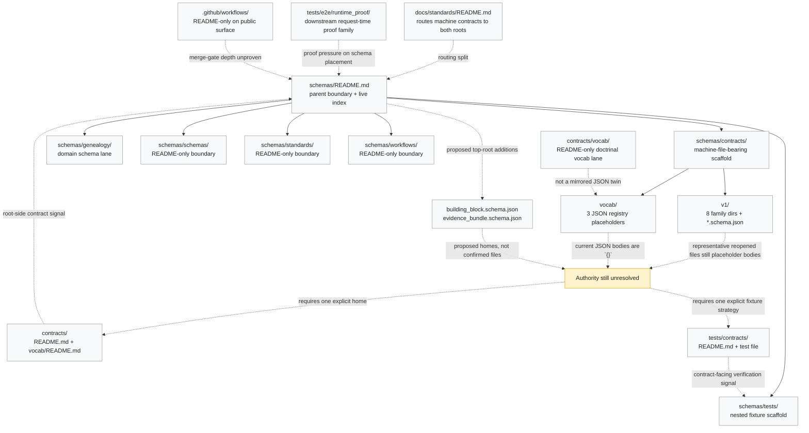

<!-- [KFM_META_BLOCK_V2]
doc_id: kfm://doc/schemas/readme
title: schemas
type: standard
version: v1
status: draft
owners: @bartytime4life
created: NEEDS_VERIFICATION__YYYY-MM-DD
updated: 2026-04-18
policy_label: public
related: [../README.md, ../contracts/README.md, ../contracts/vocab/README.md, ../docs/standards/README.md, ../policy/README.md, ../tests/README.md, ../tests/contracts/README.md, ../tests/e2e/runtime_proof/, ../.github/workflows/README.md, ../.github/CODEOWNERS, ./contracts/README.md, ./schemas/README.md, ./standards/README.md, ./tests/README.md, ./workflows/README.md, ./genealogy/README.md]
tags: [kfm, schemas, contracts, json-schema, vocab, fixtures, authority, runtime-proof]
notes: [Parent boundary and live-tree index for the public schemas subtree., Canonical schema-home authority, canonical fixture-home authority, and root-vs-nested contract vocabulary relationships remain unresolved and should not be implied by tree shape alone., This revision adds the newly proposed schema homes for building_block and evidence_bundle without claiming their files already exist on the mounted public tree.]
[/KFM_META_BLOCK_V2] -->

<a id="top"></a>

# `schemas/`

Parent boundary and live-tree index for the public `schemas/` subtree, with explicit handling for split contract signals, fixture-home ambiguity, and the newly proposed schema homes for EvidenceBundle-aligned validator work.

<div align="left">


</div>

| Field | Value |
|---|---|
| **Path** | `schemas/README.md` |
| **Status** | experimental |
| **Owners** | `@bartytime4life` |
| **Primary job** | parent boundary, live subtree index, and authority-conscious routing surface |
| **Not this lane** | a catch-all schema dump, policy runtime, workflow control plane, or silent authority winner |
| **Current emphasis** | tree-accurate inventory, schema-home caution, fixture-home caution, cross-root routing, proposed new schema homes |

**Quick jumps:** [Scope](#scope) · [Evidence posture](#evidence-posture) · [Repo fit](#repo-fit) · [Accepted inputs](#accepted-inputs) · [Exclusions](#exclusions) · [Directory tree](#directory-tree) · [Quickstart](#quickstart) · [Usage](#usage) · [Diagram](#diagram) · [Tables](#tables) · [Task list](#task-list--definition-of-done) · [FAQ](#faq) · [Appendix](#appendix)

> [!IMPORTANT]
> Current public-facing evidence confirms that `schemas/` is a **real nested subtree** with visible child lanes. This parent README must do more than warn about future placement: it must index the live tree honestly, keep unresolved authority questions explicit, and avoid treating proposed new schema families as landed implementation before they are visible in-tree.

> [!WARNING]
> Visible machine files under `schemas/contracts/`, a root-side `contracts/vocab/` lane, split routing in `docs/standards/`, a materialized `tests/contracts/` signal, and the newly proposed `schemas/building_block.schema.json` / `schemas/evidence_bundle.schema.json` homes do **not** by themselves settle canonical schema-home law.

> [!TIP]
> Read this file as a **parent coordination surface**, not as a silent winner in the schema-vs-contract-vs-fixture authority question.

---

## Scope

`schemas/` is no longer a single-file caution surface.

On the current public-facing tree, it is a parent lane with visible child directories, one live machine-file-bearing scaffold (`./contracts/`), one nested fixture scaffold (`./tests/`), several README-only boundary lanes, and a domain-specific child lane in [`./genealogy/README.md`](./genealogy/README.md).

This README now has seven jobs:

1. record the current public tree without overstating maturity
2. keep KFM’s contract-first, trust-membrane, and inspectable-claim doctrine intact
3. distinguish **branch-visible file presence** from **settled canonical authority**
4. route contributors toward the correct child or sibling lane instead of turning the parent into a catch-all
5. surface the active split between `schemas/contracts/`, `contracts/`, `contracts/vocab/`, `docs/standards/`, `tests/contracts/`, and `tests/e2e/runtime_proof/`
6. register the newly proposed top-level schema homes for `building_block` and `evidence_bundle` as **proposed**, not silently landed
7. prevent stale inventory language from surviving after the repo materially changed shape

### Truth posture used here

| Marker | Meaning in this README |
|---|---|
| **CONFIRMED** | directly visible on the current public-facing tree or directly supported by adjacent reopened docs |
| **INFERRED** | conservative interpretation of visible tree shape or neighboring doctrine, but not a formal authority decision |
| **PROPOSED** | safe next-step guidance aligned to KFM doctrine and current repo reality, but not asserted as settled implementation |
| **UNKNOWN / NEEDS VERIFICATION** | authority, workflow, validator, ownership, or branch-local detail not directly proven here |

### Working rule

Keep this parent lane **index-like, authority-conscious, and boringly truthful**.

If a change mostly defines:

- a **machine-readable schema family**, it belongs in the chosen canonical schema or contract lane
- a **shared vocabulary registry**, it belongs in the chosen canonical vocabulary home
- a **fixture or validator assertion**, it belongs in the governed fixture or tests lane
- a **child-lane boundary or routing rule**, it may belong here

[Back to top](#top)

---

## Evidence posture

| Surface or claim | Status | Why it matters |
|---|---|---|
| `schemas/` is a real top-level repo lane | **CONFIRMED** | this is a real parent surface, not a hypothetical stub |
| `schemas/contracts/` is machine-file-bearing | **CONFIRMED** | child-lane reality is no longer README-only |
| `schemas/tests/` is a real nested fixture scaffold | **CONFIRMED** | fixture placement questions are now active, not abstract |
| `schemas/schemas/`, `schemas/standards/`, and `schemas/workflows/` remain documentary boundary lanes | **CONFIRMED** | these lanes should not be overstated as executable homes |
| `schemas/genealogy/README.md` is now a real child lane | **CONFIRMED** | domain-specific schema guidance now exists under this parent |
| root `contracts/` is no longer README-only | **CONFIRMED** | root-side contract signals materially affect how this parent should be read |
| root `contracts/vocab/README.md` exists beside schema-side JSON vocab placeholders | **CONFIRMED** | vocabulary-home ambiguity is now visible |
| `docs/standards/README.md` routes machine contracts to both roots | **CONFIRMED** | standards routing is split rather than singular |
| `tests/contracts/` now includes at least one real test file | **CONFIRMED** | contract-facing verification is more concrete than a README-only reading |
| `tests/e2e/runtime_proof/` is a named downstream proof family in current project doctrine | **INFERRED** | request-time proof now materially affects schema and validator routing |
| `schemas/building_block.schema.json` and `schemas/evidence_bundle.schema.json` are the next proposed schema homes | **PROPOSED** | these are the newly discussed homes, but their file presence is not proven by the uploaded public-tree baseline |
| canonical schema-home authority | **NEEDS VERIFICATION** | tree shape alone does not decide law |
| canonical fixture-home authority | **NEEDS VERIFICATION** | nested fixture scaffolds are visible, but singular ownership is not settled |
| merge-gating workflow depth for schema validation | **NEEDS VERIFICATION** | workflow intent is documented, but checked-in enforcement is not proven here |

[Back to top](#top)

---

## Repo fit

**Path:** `schemas/README.md`  
**Role in repo:** parent boundary and live-tree index for the public `schemas/` subtree.

### Current public subtree summary

| Item | Value |
|---|---|
| Parent lane | `schemas/README.md` |
| Visible child lanes | `contracts/`, `genealogy/`, `schemas/`, `standards/`, `tests/`, `workflows/` |
| Strongest machine-file signal inside `schemas/` | [`./contracts/README.md`](./contracts/README.md) with materialized `v1/` and `vocab/` |
| Current nested fixture signal | [`./tests/README.md`](./tests/README.md) with placeholder fixture leaves |
| Current documentary child lanes | `./schemas/`, `./standards/`, `./workflows/` |
| Current domain-specific child lane | [`./genealogy/README.md`](./genealogy/README.md) |
| Current root contract signal | `../contracts/` includes `README.md` and `vocab/README.md` |
| Current standards routing signal | [`../docs/standards/README.md`](../docs/standards/README.md) routes machine contracts to both `../contracts/` and `./contracts/` |
| Current contract-facing verification signal | [`../tests/contracts/README.md`](../tests/contracts/README.md) now sits beside a checked-in test file |
| Current runtime-proof signal | [`../tests/e2e/runtime_proof/`](../tests/e2e/runtime_proof/) is part of the doctrine-facing test family |
| Proposed next schema homes | `./building_block.schema.json`, `./evidence_bundle.schema.json` |
| Authority posture | **UNKNOWN / NEEDS VERIFICATION** |

### Upstream, lateral, and downstream links

| Direction | Path | Why it matters |
|---|---|---|
| Upstream | [`../README.md`](../README.md) | root identity, truth path, trust membrane, and repo-wide posture |
| Lateral | [`../contracts/README.md`](../contracts/README.md) | root contract lane; real adjacent signal, but not automatically clean canonical-home proof |
| Lateral | [`../contracts/vocab/README.md`](../contracts/vocab/README.md) | root doctrinal vocabulary lane |
| Lateral | [`../docs/standards/README.md`](../docs/standards/README.md) | cross-cutting standards route for machine contracts and profiles |
| Lateral | [`../policy/README.md`](../policy/README.md) | deny-by-default logic, reasons, obligations, and governance consequences |
| Lateral | [`../tests/README.md`](../tests/README.md) | repo-wide governed verification surface |
| Lateral | [`../tests/contracts/README.md`](../tests/contracts/README.md) | contract-facing verification family with a real test signal |
| Lateral | [`../tests/e2e/runtime_proof/`](../tests/e2e/runtime_proof/) | downstream request-time proof family that should consume, not redefine, schema authority |
| Lateral | [`../.github/workflows/README.md`](../.github/workflows/README.md) | workflow intent boundary; merge-gate depth still needs checked-in YAML proof |
| Downstream | [`./contracts/README.md`](./contracts/README.md) | live machine-file-bearing subtree inside `schemas/` |
| Downstream | [`./genealogy/README.md`](./genealogy/README.md) | schema-side domain lane for genealogy object families and disclosure-aware semantics |
| Downstream | [`./schemas/README.md`](./schemas/README.md) | narrow boundary sublane for schema-shaped drift control |
| Downstream | [`./standards/README.md`](./standards/README.md) | standards-shaped schema boundary lane |
| Downstream | [`./tests/README.md`](./tests/README.md) | nested fixture scaffold and routing guide |
| Downstream | [`./workflows/README.md`](./workflows/README.md) | workflow-shaped schema boundary lane |

### Working interpretation

The safest reading today is:

1. keep `schemas/README.md` as the parent boundary and live subtree index
2. treat `schemas/contracts/` as a **real machine-file-bearing scaffold**, not automatically canonical law
3. treat `schemas/tests/` as a **real nested fixture scaffold**, but not yet as the singular governed fixture home
4. treat `schemas/genealogy/` as a **real child domain lane** under this parent
5. treat root `contracts/`, root `contracts/vocab/`, `docs/standards/`, `tests/contracts/`, and `tests/e2e/runtime_proof/` as **adjacent signals that materially matter**
6. treat the proposed top-level `building_block` and `evidence_bundle` schemas as **candidate homes requiring explicit reconciliation with existing contract and schema placement doctrine**
7. resolve schema-home, vocabulary-home, and fixture-home authority explicitly before adding trust-bearing families by inertia

[Back to top](#top)

---

## Accepted inputs

| Belongs here | Why it belongs here |
|---|---|
| this README | the parent lane needs a current subtree index and clear authority warning |
| parent-level inventory updates | this file should track visible child lanes honestly |
| cross-root authority-resolution notes | `schemas/` now sits between several live contract-related surfaces that need explicit reading rules |
| child-lane routing guidance | contributors need a clear “which lane owns this?” answer before they add files |
| parent-level migration notes | useful when child lanes change meaning or move between documentary and machine-file-bearing roles |
| sync notes for adjacent docs | this parent README is the right place to insist that child and sibling READMEs stay aligned |
| explicit registration of **proposed** new top-level schema homes | this file should surface proposed additions before they silently harden into authority by path alone |

### Minimum bar for anything added here

- it describes the role of the parent lane or its child and sibling routing
- it does not create a new shadow authority surface directly under the parent `schemas/` root
- it keeps child README links and adjacent root-lane links current
- it does not treat visible scaffold growth as implicit authority resolution
- it leaves policy, tests, workflows, and runtime code in their proper governed lanes

### Proposed next schema-home slice

The most recent validator and runtime-proof discussion introduces two schema files as the next likely additions:

| Proposed file | Intended role | Current posture |
|---|---|---|
| `schemas/building_block.schema.json` | top-level shape for declared building blocks | **PROPOSED** |
| `schemas/evidence_bundle.schema.json` | top-level shape for EvidenceBundle declarations | **PROPOSED** |

> [!NOTE]
> This table records the proposal so the parent lane can route it honestly. It does **not** claim those files already exist on the mounted public tree.

[Back to top](#top)

---

## Exclusions

| Does **not** belong here | Better home | Why |
|---|---|---|
| new top-level `*.schema.json` files directly under `schemas/` added by inertia | the specific owning child lane or the eventual canonical root | the parent lane is an index and boundary, not a catch-all registry |
| executable policy logic or decision bundles | [`../policy/README.md`](../policy/README.md) | policy must stay executable and reviewable |
| workflow YAML, merge-gate logic, or runner definitions | [`../.github/workflows/README.md`](../.github/workflows/README.md) | execution belongs in the control plane |
| runtime emitters, resolvers, DTO handlers, or service code | app / package implementation surfaces | consumers should reference contracts, not live in the schema index lane |
| repo-wide valid / invalid example packs intended to be canonical | [`../tests/README.md`](../tests/README.md), [`../tests/contracts/README.md`](../tests/contracts/README.md), or the eventual canonical fixture home | governed verification should not silently fork |
| duplicate canonical vocabulary registries under both `schemas/contracts/vocab/` and `contracts/vocab/` | one decided home plus explicit pointer or mirror strategy | parallel truth surfaces create semantic drift |
| human-readable standards doctrine | [`../docs/standards/README.md`](../docs/standards/README.md) | standards prose already has a governed home |

> [!CAUTION]
> The biggest current risk is not “we forgot this subtree exists.” It is **split authority that looks harmless enough to survive review** — especially once new schema files are added at the parent root without an explicit placement decision.

[Back to top](#top)

---

## Directory tree

### Current public `schemas/` subtree

```text
schemas/
├── README.md
├── contracts/
│   ├── README.md
│   ├── v1/
│   │   ├── README.md
│   │   ├── common/
│   │   │   └── header_profile.schema.json
│   │   ├── correction/
│   │   │   └── correction_notice.schema.json
│   │   ├── data/
│   │   │   └── dataset_version.schema.json
│   │   ├── evidence/
│   │   │   └── evidence_bundle.schema.json
│   │   ├── policy/
│   │   │   └── decision_envelope.schema.json
│   │   ├── release/
│   │   │   └── release_manifest.schema.json
│   │   ├── runtime/
│   │   │   └── runtime_response_envelope.schema.json
│   │   └── source/
│   │       └── source_descriptor.schema.json
│   └── vocab/
│       ├── README.md
│       ├── obligation_codes.json
│       ├── reason_codes.json
│       └── reviewer_roles.json
├── genealogy/
│   └── README.md
├── schemas/
│   └── README.md
├── standards/
│   └── README.md
├── tests/
│   ├── README.md
│   └── fixtures/
│       └── contracts/
│           └── v1/
│               ├── README.md
│               ├── invalid/
│               │   └── README.md
│               └── valid/
│                   └── README.md
└── workflows/
    └── README.md
```

### Proposed next additions discussed in the current design thread

```text
schemas/
├── building_block.schema.json     # PROPOSED
└── evidence_bundle.schema.json    # PROPOSED
```

### Adjacent root signals that affect how this parent should be read

```text
contracts/
├── README.md
└── vocab/
    └── README.md

docs/
└── standards/
    └── README.md

tests/
├── contracts/
│   ├── README.md
│   └── test_correction_notice_contract.py
└── e2e/
    └── runtime_proof/
        └── <README-or-tests-needs-verification>

.github/
└── workflows/
    └── README.md
```

### What this means right now

- `schemas/` is **not** a single-file lane anymore
- `schemas/contracts/` is the only child lane inside `schemas/` that visibly exposes machine-file scaffolds on the uploaded public snapshot
- `schemas/contracts/v1/` exposes eight visible schema-family files
- representative reopened schema and vocab files remain scaffold-state placeholders
- `schemas/tests/` is a real nested fixture scaffold, but its visible leaves remain README-bearing placeholders
- `schemas/genealogy/` is a real child lane and should be treated as part of the public subtree inventory
- `schemas/schemas/`, `schemas/standards/`, and `schemas/workflows/` remain documentary boundary lanes on the current public-facing tree
- root `contracts/` is **not** README-only anymore
- `tests/contracts/` is **not** README-only anymore
- `tests/e2e/runtime_proof/` is materially relevant to future schema and validator routing, even though its exact mounted contents remain **NEEDS VERIFICATION**
- adding `schemas/building_block.schema.json` and `schemas/evidence_bundle.schema.json` would change the meaning of the parent root and therefore should not happen without an explicit placement reading

[Back to top](#top)

---

## Quickstart

Inspect the whole contract and schema signal surface first. Do not let one directory name do interpretive work that the tree itself no longer supports.

```bash
# Inspect the live parent subtree
find schemas -maxdepth 4 -type f | sort

# Inspect adjacent contract / verification surfaces that affect this parent
find contracts -maxdepth 3 -type f | sort
find tests/contracts -maxdepth 2 -type f | sort
find tests/e2e -maxdepth 3 -type f | sort

# Re-open the parent and child boundary docs together
sed -n '1,260p' schemas/README.md
sed -n '1,260p' schemas/contracts/README.md
sed -n '1,260p' schemas/contracts/v1/README.md
sed -n '1,260p' schemas/contracts/vocab/README.md
sed -n '1,220p' schemas/genealogy/README.md
sed -n '1,260p' schemas/schemas/README.md
sed -n '1,260p' schemas/standards/README.md
sed -n '1,260p' schemas/tests/README.md
sed -n '1,260p' schemas/workflows/README.md

# Compare against adjacent root lanes
sed -n '1,260p' contracts/README.md
sed -n '1,260p' contracts/vocab/README.md
sed -n '1,260p' docs/standards/README.md
sed -n '1,260p' tests/README.md
sed -n '1,260p' tests/contracts/README.md
sed -n '1,260p' .github/workflows/README.md

# Confirm representative scaffold-state files before claiming validator readiness
cat schemas/contracts/v1/runtime/runtime_response_envelope.schema.json
cat schemas/contracts/vocab/reason_codes.json
cat schemas/contracts/vocab/obligation_codes.json
cat schemas/contracts/vocab/reviewer_roles.json

# If new top-level schema homes are under consideration, check that the parent root
# is the intentional canonical location rather than a convenience drop point.
git grep -nE 'building_block|evidence_bundle|schema home|canonical schema|machine contracts|reason_codes|obligation_codes|reviewer_roles|fixtures/contracts|runtime_proof' -- \
  schemas contracts docs policy tests .github
```

### Safe first move

A safe first move is **not** “add another schema-shaped file and let the tree speak for itself.”

A safe first move is:

1. reconcile this parent README with the live subtree and adjacent root signals
2. reopen `schemas/genealogy/README.md`, `schemas/schemas/README.md`, `contracts/README.md`, `contracts/vocab/README.md`, `docs/standards/README.md`, `tests/contracts/README.md`, and the relevant `tests/e2e/runtime_proof/` surface together
3. decide the canonical schema home and canonical fixture strategy explicitly
4. wire validators and fixtures against **one** chosen authority path only
5. keep documentary lanes clearly documentary
6. only then land the proposed top-level schema homes if that path is still the chosen authority

[Back to top](#top)

---

## Usage

### For maintainers

Use this file as the parent sync point.

When any child lane or adjacent contract/verification surface changes meaning, update this file and the affected child or sibling READMEs in the same reviewed change. The goal is not just cleaner prose. The goal is that a contributor can infer the same placement rule from the parent index, the local schema lanes, the root contract lane, the standards index, the runtime-proof family, and the verification lane.

### For contributors

Pick the **most specific** lane you can justify.

- if the change is about visible first-wave schema scaffolds, start in [`./contracts/README.md`](./contracts/README.md)
- if it is about the schema-side shared JSON registries now materialized on the public-facing tree, start in [`./contracts/vocab/README.md`](./contracts/vocab/README.md)
- if it is genealogy object-family and disclosure-aware schema guidance, start in [`./genealogy/README.md`](./genealogy/README.md)
- if it is a placement-control or anti-drift note, it may belong in [`./schemas/README.md`](./schemas/README.md)
- if it is standards-shaped schema companion guidance, use [`./standards/README.md`](./standards/README.md)
- if it is fixture scaffold navigation, use [`./tests/README.md`](./tests/README.md)
- if it is workflow-shaped schema boundary guidance, use [`./workflows/README.md`](./workflows/README.md)
- if it is contract-facing validation or example-pack proof work, re-open [`../tests/contracts/README.md`](../tests/contracts/README.md) before assuming it belongs under `schemas/`
- if it is request-time proof of runtime envelopes or bundle-driven behavior, re-open [`../tests/e2e/runtime_proof/`](../tests/e2e/runtime_proof/) before assuming the schema home should move with the tests
- if it is the proposed `building_block` or `evidence_bundle` schema pair, do **not** treat the parent root as pre-approved; first reconcile it with `schemas/contracts/`, `contracts/`, and `docs/standards/`

Do **not** treat the parent `schemas/` root as an overflow shelf.

### For reviewers

Reject changes that do any of the following:

- repeat the stale claim that `schemas/` is `README.md`-only
- repeat the stale claim that root `contracts/` is `README.md`-only
- imply that `docs/standards/README.md` routes machine contracts only to root `contracts/`
- ignore the visible `tests/contracts/` executable signal when describing verification posture
- omit the real `schemas/genealogy/` child lane from the parent inventory
- add trust-bearing files directly under the parent `schemas/` root without an explicit schema-home decision
- let `schemas/contracts/` grow in a way that silently settles canonical authority
- introduce the same family or registry under both `schemas/` and `contracts/` without an explicit mirror or pointer strategy
- move fixtures, policy, or workflow logic into the wrong lane because the names look adjacent
- let runtime-proof tests quietly redefine schema ownership by test convenience

### For future authority resolution

The repo currently exposes **several** real contract-adjacent signals:

- `schemas/contracts/` is the schema-side machine-file-bearing subtree
- `schemas/contracts/vocab/` materializes three JSON registry placeholders
- `schemas/genealogy/` is a real domain child lane under this parent
- `contracts/` includes a separate root `vocab/README.md` doctrinal lane
- `docs/standards/README.md` routes machine contracts to both `contracts/` and `schemas/contracts/`
- `tests/contracts/` carries a visible contract-facing test file
- `tests/e2e/runtime_proof/` is a now-material downstream proof family that will pressure envelope and bundle schema placement
- `.github/workflows/` still does not prove merge-gating depth on the visible public surface
- the proposed `schemas/building_block.schema.json` and `schemas/evidence_bundle.schema.json` pair creates a new top-root placement decision if adopted

That is an explicit decision problem, not a quiet winner.

<details>
<summary><strong>Resolution branches (PROPOSED)</strong></summary>

### Branch A — `schemas/contracts/` becomes canonical for machine-readable contract families

1. update [`../contracts/README.md`](../contracts/README.md) so it becomes a doctrinal or pointer surface rather than a competing machine-home signal
2. decide whether [`../contracts/vocab/README.md`](../contracts/vocab/README.md) stays doctrinal-only or becomes a thin pointer into `schemas/contracts/vocab/`
3. update [`../docs/standards/README.md`](../docs/standards/README.md) so routing stops implying a still-stronger root contract home
4. point [`../tests/contracts/README.md`](../tests/contracts/README.md), runtime-proof tests, and validators at the canonical schema path
5. decide whether `building_block.schema.json` and `evidence_bundle.schema.json` become new families under `schemas/contracts/` rather than free-floating top-root files
6. keep `schemas/tests/` scaffold-only or explicitly mirror-only unless fixture-home law also moves

### Branch B — root `contracts/` becomes canonical for machine-readable contract families

1. move or explicitly mirror the schema files now visible under [`./contracts/`](./contracts/README.md)
2. decide whether root `contracts/vocab/` becomes the real machine-readable vocabulary home or remains doctrinal-only while a different machine lane is chosen
3. reduce `schemas/contracts/` to boundary, pointer, or migration behavior instead of silent authority
4. update [`../docs/standards/README.md`](../docs/standards/README.md), [`../tests/contracts/README.md`](../tests/contracts/README.md), and runtime-proof references to point at the chosen authoritative path only
5. verify that no child README, fixture scaffold, or quickstart command still points at the superseded location
6. decide whether the proposed `building_block` and `evidence_bundle` schemas belong under root `contracts/` instead of the `schemas/` parent root

### Branch C — authority remains unresolved for one more revision window

1. keep the split explicit in every affected README
2. do not add new trust-bearing families by default
3. mark vocabulary and fixture work as scaffold, mirror, or illustrative unless an ADR or equivalent decision says more
4. keep the proposed top-level schema pair documented as proposed, not landed
5. prioritize one explicit authority decision over broader subtree growth

</details>

[Back to top](#top)

---

## Diagram


```mermaid
flowchart TB
    P["schemas/README.md<br/>parent boundary + live index"]

    P --> SC["schemas/contracts/<br/>machine-file-bearing scaffold"]
    P --> SG["schemas/genealogy/<br/>domain schema lane"]
    P --> SS["schemas/schemas/<br/>README-only boundary"]
    P --> ST["schemas/standards/<br/>README-only boundary"]
    P --> STS["schemas/tests/<br/>nested fixture scaffold"]
    P --> SW["schemas/workflows/<br/>README-only boundary"]

    P -. proposed top-root additions .-> NEW["building_block.schema.json<br/>evidence_bundle.schema.json"]

    SC --> V1["v1/<br/>8 family dirs + *.schema.json"]
    SC --> VOC["vocab/<br/>3 JSON registry placeholders"]

    ROOTC["contracts/<br/>README.md + vocab/README.md"] -. root-side contract signal .-> P
    ROOTV["contracts/vocab/<br/>README-only doctrinal vocab lane"] -. not a mirrored JSON twin .-> VOC
    STD["docs/standards/README.md<br/>routes machine contracts to both roots"] -. routing split .-> P
    TCON["tests/contracts/<br/>README.md + test file"] -. contract-facing verification signal .-> STS
    RTP["tests/e2e/runtime_proof/<br/>downstream request-time proof family"] -. proof pressure on schema placement .-> P
    WF[".github/workflows/<br/>README-only on public surface"] -. merge-gate depth unproven .-> P

    V1 -. representative reopened files still placeholder bodies .-> A["Authority still unresolved"]
    VOC -. current JSON bodies are `{}` .-> A
    NEW -. proposed homes, not confirmed files .-> A
    A -. requires one explicit home .-> ROOTC
    A -. requires one explicit fixture strategy .-> TCON

    classDef soft fill:#f8f9fa,stroke:#999,color:#222;
    classDef warn fill:#fff3cd,stroke:#d39e00,color:#222;
    class P,SC,SG,SS,ST,STS,SW,NEW,V1,VOC,ROOTC,ROOTV,STD,TCON,RTP,WF soft;
    class A warn;
```

Reading rule: inspect the live subtree first, then inspect the adjacent root contract, standards, verification, and runtime-proof surfaces together. Do **not** let visible growth on one side settle law by inertia.

[Back to top](#top)

---

## Tables

### A. Current visible schema-lane map

| Path | Current visible state | Working interpretation |
|---|---|---|
| `schemas/README.md` | present, substantive | parent boundary and inventory index |
| `schemas/contracts/` | `README.md` + `v1/` + `vocab/` | live machine-file-bearing scaffold lane |
| `schemas/contracts/v1/` | `README.md` + eight family subdirs | versioned schema-family scaffold lane |
| `schemas/contracts/v1/common/header_profile.schema.json` | present | first-wave schema file under a live scaffold lane |
| `schemas/contracts/v1/correction/correction_notice.schema.json` | present | first-wave schema file under a live scaffold lane |
| `schemas/contracts/v1/data/dataset_version.schema.json` | present | first-wave schema file under a live scaffold lane |
| `schemas/contracts/v1/evidence/evidence_bundle.schema.json` | present | first-wave schema file under a live scaffold lane |
| `schemas/contracts/v1/policy/decision_envelope.schema.json` | present | first-wave schema file under a live scaffold lane |
| `schemas/contracts/v1/release/release_manifest.schema.json` | present | first-wave schema file under a live scaffold lane |
| `schemas/contracts/v1/runtime/runtime_response_envelope.schema.json` | present; representative reopened body is `{}` | real path, scaffold-state content |
| `schemas/contracts/v1/source/source_descriptor.schema.json` | present | first-wave schema file under a live scaffold lane |
| `schemas/contracts/vocab/*.json` | `reason_codes.json`, `obligation_codes.json`, `reviewer_roles.json`; visible bodies remain scaffold placeholders | starter registry placeholders, not yet populated |
| `schemas/genealogy/` | `README.md` present | domain schema lane now visible under this parent |
| `schemas/schemas/` | `README.md` only | narrow boundary sublane for schema-shaped drift control |
| `schemas/standards/` | `README.md` only | standards-shaped schema companion boundary lane |
| `schemas/tests/` | `README.md` + `fixtures/` | nested fixture scaffold |
| `schemas/tests/fixtures/contracts/v1/{valid,invalid}` | README-bearing placeholder leaves | not yet a proven canonical fixture inventory |
| `schemas/workflows/` | `README.md` only | workflow-shaped schema boundary lane |
| `schemas/building_block.schema.json` | not visible in the uploaded baseline | **PROPOSED** top-level addition |
| `schemas/evidence_bundle.schema.json` | not visible in the uploaded baseline | **PROPOSED** top-level addition |

### B. Cross-root contract-signal matrix

| Surface | Current visible state | Why it matters here | Safest reading |
|---|---|---|---|
| `../contracts/` | `README.md` + `vocab/README.md` | root contract lane is no longer README-only | real adjacent surface, but not clean canonical-home proof on its own |
| `../contracts/README.md` | present, substantive, but should be reread carefully before treating it as settled singular authority | a real adjacent document with meaningful placement impact | treat as a live but noisy signal that still needs reconciliation |
| `../contracts/vocab/README.md` | README-only doctrinal vocabulary lane | root vocabulary doctrine now exists beside schema-side JSON registries | real neighboring vocabulary surface, not a mirrored machine-file twin |
| `../docs/standards/README.md` | routes machine contracts to both `contracts/` and `schemas/contracts/` | old singular-root reading is stale | standards routing is split, not singular |
| `../tests/contracts/` | `README.md` + `test_correction_notice_contract.py` | contract-facing verification is no longer README-only | verification burden at root is more concrete than the schema-side scaffold |
| `../tests/e2e/runtime_proof/` | doctrinally significant downstream proof family; exact mounted leaf inventory not proven here | request-time proof now pressures envelope and bundle schema placement | relevant downstream signal, but exact tree contents remain **NEEDS VERIFICATION** |
| `../.github/workflows/` | `README.md` only | workflow intent exists, but merge-gate YAML is not proven here | workflow enforcement depth remains `NEEDS VERIFICATION` |

### C. Put-it-here matrix

| Candidate change | Belongs in the parent `schemas/` root today? | Better home today | Why |
|---|---|---|---|
| parent inventory update | yes | `schemas/README.md` | this file owns the subtree index |
| new child-lane boundary README | no | the specific child lane | use the most specific boundary surface |
| new trust-bearing schema body in an existing visible family | not by default | the canonical contract lane once authority is explicit | current visible files do not settle authority by themselves |
| shared reason, obligation, or reviewer role value | no, not in the parent root | `schemas/contracts/vocab/` *or* another explicitly chosen canonical vocabulary home | shared vocab must stay finite and singular |
| new valid / invalid example pack | no | prefer root `tests/contracts/`, `tests/e2e/runtime_proof/`, or the eventual canonical fixture home | verification should not silently fork |
| workflow YAML | no | `../.github/workflows/` | execution control is not a schema-index concern |
| human-readable standards prose | no | `../docs/standards/` | standards prose already has a governed home |
| runtime code | no | app / package lanes | runtime consumers reference contracts; they do not live in the schema index |
| `building_block.schema.json` / `evidence_bundle.schema.json` | **not automatically** | whichever schema home is explicitly chosen after reconciliation | proposed usefulness does not override current authority ambiguity |

[Back to top](#top)

---

## Task list / Definition of done

### Current public snapshot checks

- [x] `schemas/` exists as a top-level repo lane.
- [x] Current public `schemas/` subtree visibly includes `contracts/`, `genealogy/`, `schemas/`, `standards/`, `tests/`, `workflows/`, and `README.md`.
- [x] `schemas/contracts/` materially exposes `v1/` and `vocab/`.
- [x] `schemas/contracts/v1/` exposes eight visible family subdirectories and first-wave `*.schema.json` files.
- [x] Representative reopened schema and vocab files still show scaffold-state placeholder bodies.
- [x] `schemas/tests/fixtures/contracts/v1/{valid,invalid}` are visible as nested README-bearing placeholders.
- [x] `schemas/genealogy/README.md` is part of the visible subtree.
- [x] `schemas/schemas/`, `schemas/standards/`, and `schemas/workflows/` remain README-only on the current visible surface.
- [x] Root `contracts/` is **not** README-only anymore; it visibly includes `vocab/README.md`.
- [x] Root `contracts/vocab/README.md` is a real doctrinal vocabulary lane.
- [x] `docs/standards/README.md` routes machine contracts to both `contracts/` and `schemas/contracts/`.
- [x] `tests/contracts/` is **not** README-only anymore; it visibly includes a real test file.
- [ ] Exact mounted leaf inventory under `tests/e2e/runtime_proof/` remains **NEEDS VERIFICATION**.
- [x] `.github/workflows/` remains README-only on the visible public surface.
- [x] Public `.github/CODEOWNERS` still does not prove a narrower `/schemas/` rule.
- [x] The proposed `building_block` / `evidence_bundle` top-level schema pair is documented as proposed, not landed.

### Remaining definition of done

- [ ] Parent `schemas/README.md`, child README surfaces, and adjacent root signals stay tree-accurate together.
- [ ] `schemas/schemas/README.md` no longer carries stale parent-inventory wording.
- [ ] Canonical schema-home authority is written down explicitly.
- [ ] Canonical fixture-home authority is written down explicitly.
- [ ] `contracts/README.md` is either reconciled to its actual directory role or explicitly documented as an intentional pointer surface.
- [ ] `contracts/vocab/README.md` and `schemas/contracts/vocab/*.json` have an explicit relationship: doctrinal-only, canonical/mirror, or migration.
- [ ] Placeholder schema and vocab files either gain real bodies or remain explicitly documented as scaffold-state.
- [ ] Contract-facing validators point to one authoritative schema path only.
- [ ] Runtime-proof fixtures and tests point to one authoritative schema path only.
- [ ] Merge-gating workflow proof is checked in and linked from the authoritative docs.
- [ ] Any future mirror or pointer strategy is explicit enough that reviewers can tell which copy is law.
- [ ] If `building_block.schema.json` and `evidence_bundle.schema.json` land, their placement is reconciled against the chosen canonical schema-home decision rather than justified by convenience.

[Back to top](#top)

---

## FAQ

### Is `schemas/` still just a boundary lane?

Not anymore.

It is now a **parent boundary and inventory lane** with a real nested subtree. The boundary role still matters, but the parent doc also has to describe live child-lane reality.

### Does machine-file presence under `schemas/contracts/` make that lane authoritative?

No.

It makes that lane **real** and **machine-file-bearing** on the current visible branch. It does **not** by itself settle the canonical-home decision.

### Is root `contracts/` still README-only?

No.

The current visible tree now shows `contracts/README.md` plus `contracts/vocab/README.md`. That strengthens the need for explicit contract-home and vocabulary-home decisions rather than README-only assumptions.

### Does `docs/standards/README.md` still point only to root `contracts/`?

No.

It routes machine contracts to **both** `contracts/` and `schemas/contracts/`. That means older “standards favors root contracts only” language is stale.

### Does `tests/contracts/` still look purely documentary?

No.

At least one checked-in test file is now visible there. That does not prove full merge-gate depth, but it does mean the contract-facing verification lane is more concrete than a README-only reading would suggest.

### Why mention `tests/e2e/runtime_proof/` here now?

Because request-time proof is now part of the project’s doctrinal test surface. Even if its mounted file inventory is not fully verified in this upload set, it materially affects how envelope and bundle schemas should be routed and consumed.

### Why include the proposed `building_block` and `evidence_bundle` schema files before they exist?

Because the parent lane is the right place to make proposed placement visible **before** it silently hardens into authority by path alone. Recording the proposal here helps reviewers catch an accidental schema-home decision.

### What is the safest next improvement after this revision?

Reconcile the split contract signals across `schemas/`, `contracts/`, `contracts/vocab/`, `docs/standards/`, `tests/contracts/`, and `tests/e2e/runtime_proof/` before landing the proposed top-level schema pair.

[Back to top](#top)

---

## Appendix

<details>
<summary><strong>Appendix A — parent-lane sync checklist</strong></summary>

When child-lane inventory or meaning changes, review these together:

- `schemas/README.md`
- `schemas/contracts/README.md`
- `schemas/contracts/v1/README.md`
- `schemas/contracts/vocab/README.md`
- `schemas/genealogy/README.md`
- `schemas/schemas/README.md`
- `schemas/standards/README.md`
- `schemas/tests/README.md`
- `schemas/workflows/README.md`
- `contracts/README.md`
- `contracts/vocab/README.md`
- `docs/standards/README.md`
- `tests/README.md`
- `tests/contracts/README.md`
- `tests/e2e/runtime_proof/README.md` or the nearest equivalent proof-family surface
- `.github/workflows/README.md`

If the change affects ownership, also review:

- `.github/CODEOWNERS`

</details>

<details>
<summary><strong>Appendix B — current contradiction watchlist</strong></summary>

These are the tensions this parent README should keep visible until a later review resolves them:

1. `schemas/contracts/` is machine-file-bearing, but canonical schema-home law is still unresolved.
2. `schemas/contracts/vocab/*.json` exists as machine-visible JSON, while `contracts/vocab/README.md` exists as a separate doctrinal vocabulary lane.
3. `docs/standards/README.md` routes machine contracts to both roots, which is more honest than older wording but still does not decide authority.
4. `tests/contracts/` now has at least one real test file, which strengthens the verification side of the story even while `.github/workflows/` remains README-only on the visible public surface.
5. `tests/e2e/runtime_proof/` now materially matters to schema consumption, even though its exact mounted inventory is not fully proven here.
6. `schemas/schemas/README.md` may still carry parent-staleness language that no longer matches the reconciled parent tree.
7. `contracts/README.md` is a real current document, but its current path and body alignment should be rechecked before anyone treats it as clean canonical-home proof.
8. The proposed `building_block.schema.json` and `evidence_bundle.schema.json` pair is useful, but usefulness is not the same thing as resolved placement authority.

</details>

<details>
<summary><strong>Appendix C — maintainer shorthand</strong></summary>

If you only remember one rule from this README, make it this one:

**one parent index, one canonical schema home, one canonical fixture strategy, one vocabulary story, one validator path, one runtime-proof consumption path, and no silent authority by inertia.**

</details>

[Back to top](#top)
