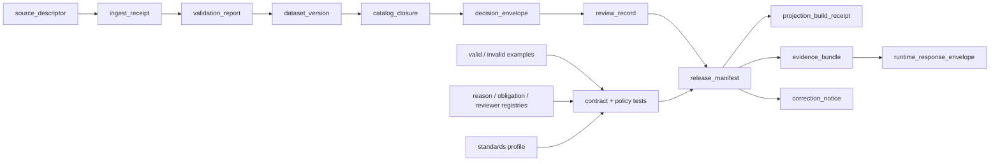

<!-- [KFM_META_BLOCK_V2]
doc_id: kfm://doc/NEEDS-VERIFICATION
title: Schemas
type: standard
version: v1
status: draft
owners: NEEDS-VERIFICATION
created: YYYY-MM-DD
updated: YYYY-MM-DD
policy_label: NEEDS-VERIFICATION
related: [NEEDS-VERIFICATION]
tags: [kfm, schemas, contracts, json-schema]
notes: [Target path for this task is schemas/README.md; March 2026 realization overlays more often describe the same surface as contracts/schemas/; mounted workspace exposed PDFs only.]
[/KFM_META_BLOCK_V2] -->

# Schemas

Machine-readable KFM contract schemas for intake, verification, release, runtime trust, and correction.

> **Status:** experimental  
> **Owners:** NEEDS VERIFICATION  
> **Truth posture:** CONFIRMED doctrine · PROPOSED repo-local realization · UNKNOWN mounted file inventory  
> 
> 
> 
> 
> 
>   
> **Quick jumps:** [Scope](#scope) · [Repo fit](#repo-fit) · [Directory tree](#directory-tree) · [Contract families](#contract-families) · [Standards profile](#standards-profile) · [Validation and gates](#validation-and-gates) · [Task list](#task-list--definition-of-done) · [FAQ](#faq)

> [!IMPORTANT]
> This README is written for the task-local path `schemas/README.md`. The strongest March 2026 realization overlays more often describe the same machine-readable surface as `contracts/schemas/`. Treat that mismatch as a path-reconciliation item until the mounted repo is visible.

> [!NOTE]
> Current-session workspace evidence exposed PDFs only. No mounted KFM repo tree, schema directory, tests, workflow files, deployment manifests, or runtime logs were directly verified in this session.

## Scope

This directory is the machine-readable contract layer for KFM object families. Its job is to turn source onboarding, catalog closure, policy decisions, release proof, runtime outcomes, and correction into artifacts that can be validated, diffed, tested, and reviewed.

The surface should stay narrow and predictable:

- one schema per contract family
- stable names and envelope grammar
- shared terminology across docs, tests, policy bundles, and runtime envelopes
- no hidden contract truth buried only in service code or polished prose

If the repo is still pre-artifact, keep this README in place rather than letting the contract surface disappear from review.

[Back to top](#schemas)

## Repo fit

| Item | Value |
|---|---|
| Path | `schemas/README.md` |
| Role in the repo | Directory README for machine-readable KFM object schemas |
| Corpus-aligned equivalent | `contracts/schemas/` |
| Upstream links | `NEEDS-VERIFICATION` |
| Downstream links | `NEEDS-VERIFICATION` |
| Current treatment | Task-local README now; broader contract surface still needs mounted-repo reconciliation |

If the repo later normalizes under `contracts/schemas/`, move this README with the surface or leave a thin forwarding stub rather than duplicating contract truth in two places.

## Accepted inputs

Accepted here:

- versioned JSON Schema files for KFM object envelopes
- shared `$defs` / `$ref` fragments only when colocating them keeps validation and review simpler
- small directory-local notes about naming, versioning, or drift control for this surface

Recommended naming pattern:

```text
<contract_family>.schema.json
```

Typical examples:

```text
source_descriptor.schema.json
dataset_version.schema.json
decision_envelope.schema.json
release_manifest.schema.json
evidence_bundle.schema.json
runtime_response_envelope.schema.json
correction_notice.schema.json
```

## Exclusions

Do **not** place these here unless mounted repo truth explicitly says otherwise:

- OpenAPI descriptions for public or internal routes
- event / lifecycle-transition schemas if the repo splits them under `events/`
- valid or invalid examples
- thin-slice fixture packs
- policy bundles, reason codes, obligation codes, or reviewer-role maps
- emitted STAC / DCAT / PROV catalog artifacts
- release proof packs, run receipts, or correction drill outputs
- runbooks, ADRs, or broader governance prose

[Back to top](#schemas)

## Directory tree

Task-local directory view:

```text
schemas/
├── README.md
├── source_descriptor.schema.json
├── ingest_receipt.schema.json
├── validation_report.schema.json
├── dataset_version.schema.json
├── catalog_closure.schema.json
├── decision_envelope.schema.json
├── review_record.schema.json
├── release_manifest.schema.json
├── projection_build_receipt.schema.json
├── evidence_bundle.schema.json
├── runtime_response_envelope.schema.json
└── correction_notice.schema.json
```

<details>
<summary><strong>Corpus-aligned broader contract layout (PROPOSED, repo-unverified)</strong></summary>

```text
repo-root/
├── contracts/
│   ├── schemas/
│   ├── examples/
│   │   ├── valid/
│   │   └── invalid/
│   └── profiles/
├── policy/
├── apis/
├── events/
├── tests/
├── docs/runbooks/
├── observability/
└── deployment/
```

</details>

> [!TIP]
> Start flatter than you think. The March 2026 realization overlays repeatedly prefer a small first wave over a deep schema forest.

## Quickstart

1. Start with the first schema wave, not the whole lattice.
2. Pair every schema with at least one valid and one invalid example in the repo’s example surface.
3. Pin the standards profile in version control instead of leaving JSON Schema, OpenAPI, and catalog vocabulary assumptions implicit.
4. Wire schema, example, policy, and runtime negative-path checks into automated tests.
5. Treat undocumented breaking contract changes as merge blockers.

```bash
# illustrative pseudocode — bind these steps to the repo's actual validator runner
validate_schemas schemas/*.schema.json
validate_examples contracts/examples/valid
assert_invalid_examples_fail contracts/examples/invalid
run_contract_tests tests/contracts
run_policy_tests tests/policy
```

## Usage

### Working rules

- Prefer one schema file per contract family.
- Keep filenames in snake_case and keep object families semantically stable.
- Carry explicit `schema_version` and `object_type` fields in envelope-style objects.
- Centralize profile pins and policy registries outside individual schemas; schemas should reference them, not reinvent them.
- Update schemas, examples, tests, and docs in the same review stream.

### Naming and versioning

Promotion, correction, runtime proof, and audit reconstruction are typed transitions in KFM. Contract drift therefore needs to be explicit, reviewable, and test-backed.

A useful default rule is simple: change grammar deliberately, version it visibly, and never let examples or runbooks lag behind the schema that governs them.

## Diagram


```mermaid
flowchart LR
    SD[source_descriptor] --> IR[ingest_receipt]
    IR --> VR[validation_report]
    VR --> DV[dataset_version]
    DV --> CC[catalog_closure]
    CC --> DE[decision_envelope]
    DE --> RR[review_record]
    RR --> RM[release_manifest]
    RM --> PBR[projection_build_receipt]
    RM --> EB[evidence_bundle]
    EB --> RRE[runtime_response_envelope]
    RM --> CN[correction_notice]

    EX[valid / invalid examples] --> T[contract + policy tests]
    REG[reason / obligation / reviewer registries] --> T
    PROF[standards profile] --> T
    T --> RM
```

The schema surface mirrors a governed object graph. It is not just a folder of JSON shapes.

## Tables

### Contract families

| Family / starter schema | Minimum purpose | Must include at least |
|---|---|---|
| `source_descriptor` | Declare the intake contract for a source or endpoint. | Identity, owner/steward, access mode, rights posture, support, cadence, validation plan, publication intent |
| `ingest_receipt` | Prove that a fetch and landing event occurred. | Source reference, fetch time, integrity checks, result, output pointers |
| `validation_report` | Record what checks passed, failed, or quarantined. | Check list, severity, reason codes, subject refs |
| `dataset_version` | Carry an authoritative candidate or promoted subject set. | Stable ID, version ID, support, time semantics, provenance links |
| `catalog_closure` | Publish outward metadata closure and lineage linkage. | STAC/DCAT/PROV refs, identifiers, release linkage, outward profile refs |
| `decision_envelope` | Express a policy result machine-readably. | Subject, action, lane, result, reason codes, obligation codes, policy basis, `audit_ref`, effective window |
| `review_record` | Capture human approval, denial, escalation, or note. | Reviewer role, decision, timestamp, refs, comments |
| `release_manifest` | Assemble a public-safe release and its proof. | Version refs, catalog refs, decision refs, docs/accessibility gate, rollback/correction posture, profile versions, bundle plan |
| `projection_build_receipt` | Prove a derived layer was built from a known release scope. | Release ref, projection type, surface class, build time, freshness basis, stale-after policy |
| `evidence_bundle` | Package support for a claim, feature, story, export preview, or answer. | Bundle ID, source basis, dataset refs, lineage summary, preview policy, transform receipts, rights/sensitivity state, `audit_ref` |
| `runtime_response_envelope` | Make runtime outcome accountable. | Schema version, object type, `audit_ref`, `request_id`, evaluated time, surface class, surface state, result, citations check, decision ref |
| `correction_notice` | Preserve visible lineage under change. | Affected releases, replacement releases, affected surface classes, rebuild refs, cause, public note |

> [!TIP]
> The highest-leverage first wave is still small: `source_descriptor`, `dataset_version`, `decision_envelope`, `release_manifest`, `evidence_bundle`, `runtime_response_envelope`, and `correction_notice`. Add the remaining families in lockstep with examples, tests, and a real governed flow.

### Standards profile

| Concern | Recommended profile | Notes for this surface |
|---|---|---|
| Object schemas | JSON Schema Draft 2020-12 | Best-fit baseline for machine-validated envelopes and examples |
| HTTP API descriptions | OpenAPI 3.2.0 | Keep outside this directory unless repo truth says otherwise |
| Dataset / release discovery | DCAT 3 | Pair with STAC and PROV rather than forcing one vocabulary to do everything |
| Provenance vocabulary | PROV-O | Supports lineage, correction linkage, and activity/entity/agent reasoning |
| Spatiotemporal assets | STAC | Exact project pin should live in a standards-profile artifact |
| Catalog search | OGC API - Records Part 1: Core 1.0 | Additive option; public exposure remains NEEDS VERIFICATION |
| Feature reads | OGC API - Features | Preferred external shape for released authoritative feature reads |
| Maps / tiles | OGC API - Maps / Tiles | Preferred external shape for governed portrayal where exposed |
| Accessibility baseline | WCAG 2.2 | Treat as part of release evidence, not UI polish |
| Telemetry naming | OpenTelemetry semantic conventions | Exact adopted version and categories should be pinned explicitly |

> [!IMPORTANT]
> Standards fit is not the same as a mounted repo pin. Keep exact profile versions in a dedicated standards-profile artifact and mark unresolved pins clearly until the repo is visible.

## Validation and gates

| Gate or test family | What it proves |
|---|---|
| Schema gate | Published schemas and valid/invalid examples agree; structural acceptance is machine-checkable |
| Source replay gate | A descriptor and connector path can reproduce intake without tribal memory |
| Catalog closure gate | STAC/DCAT/PROV linkage and EvidenceRef resolution stay coherent |
| Policy bundle gate | Reason codes, obligation codes, rights/sensitivity mappings, and review-required rules fail closed |
| Release assembly gate | No visibility change occurs without a complete release manifest or equivalent proof pack |
| Evidence resolution gate | Every consequential visible claim or runtime response resolves to inspectable support |
| Runtime citation-negative test | The system abstains, denies, or errors rather than fabricating support |
| Correction drill | Supersession or withdrawal preserves lineage and updates affected surface states |
| Documentation and accessibility gate | Docs, diagrams, examples, tables, runbooks, and trust-visible states remain current and usable |

> [!WARNING]
> A schema without examples, negative fixtures, and gates is still helpful, but it is not yet a trustworthy contract surface.

[Back to top](#schemas)

## Task list / Definition of done

- [ ] Path reconciliation between `schemas/README.md` and any `contracts/` surface is resolved against mounted repo truth.
- [ ] First-wave schemas exist and validate.
- [ ] Every contract family has at least one valid and one invalid example.
- [ ] Standards profile is explicit and version-pinned.
- [ ] Reason, obligation, and reviewer-role registries exist and are reviewable.
- [ ] Contract, policy, release-assembly, runtime-proof, and correction tests exist.
- [ ] Publication, replay, stale-state, correction, and rollback runbooks exist.
- [ ] Join keys needed for audit reconstruction are stable and documented.
- [ ] Owners, dates, policy label, and related links in the meta block are filled before publication.

## FAQ

### Why does this README mention `contracts/schemas/` if the task path is `schemas/README.md`?

Because the strongest March 2026 realization overlays describe the broader machine-readable contract surface under `contracts/`, with `contracts/schemas/` as the schema home. This README stays faithful to the task-local path while keeping that broader corpus pattern visible until repo truth settles the final location.

### Do OpenAPI files belong here?

Not by default. The corpus treats governed HTTP route contracts as a separate surface from object-envelope schemas.

### Do valid and invalid examples belong here?

Not usually. The March 2026 realization overlays place them in sibling example/fixture surfaces so schemas remain focused and tests can consume examples directly.

### Are all contract families required on day one?

No. The corpus repeatedly argues for a small first wave plus one governed thin slice over a large but untested schema forest.

### Can a single-source artifact still be publishable?

Sometimes. KFM verification doctrine allows single-source publication when other gates pass and the state stays explicitly source-dependent. Corroboration becomes mandatory when the system synthesizes beyond one source, publishes consequential composites, grants policy exceptions, or answers conflict-prone questions.

## Appendix

<details>
<summary><strong>Need-to-verify before publishing this README</strong></summary>

| Item | Why it matters |
|---|---|
| Actual repo tree | Prevents path assumptions from hardening into pseudo-fact |
| Current schema inventory | Avoids documenting files that already differ in name, split, or versioning pattern |
| Example / fixture locations | Needed for accurate quickstart and downstream references |
| Standards-profile file location | Needed so this README links to the real pin file |
| Contract-test runner and CI entrypoints | Needed for runnable snippets and truthful gate language |
| Owners / dates / policy label / related links | Required for an honest KFM meta block |

</details>

<details>
<summary><strong>Corpus-aligned broader contract layout (PROPOSED, repo-unverified)</strong></summary>

```text
repo-root/
├── contracts/
│   ├── schemas/
│   ├── examples/
│   │   ├── valid/
│   │   └── invalid/
│   └── profiles/
├── policy/
├── apis/
├── events/
├── tests/
├── docs/runbooks/
├── observability/
└── deployment/
```

Use this only as a reconciliation aid. It is a strong March 2026 corpus pattern, not a verified repo tree.

</details>

<details>
<summary><strong>Starter sibling surfaces to keep aligned with schemas</strong></summary>

| Surface | Why it must travel with schema changes |
|---|---|
| Examples and invalid fixtures | They prove acceptance and fail-closed behavior |
| Standards profile | It pins dialects and outward contract vocabulary |
| Policy registries | They keep reason/obligation grammar executable |
| Release / runtime proof artifacts | They keep schemas tied to real trust behavior |
| Runbooks | They keep operators from rediscovering policy under stress |
| Observability join-key docs | They keep audit reconstruction possible |

</details>

[Back to top](#schemas)
