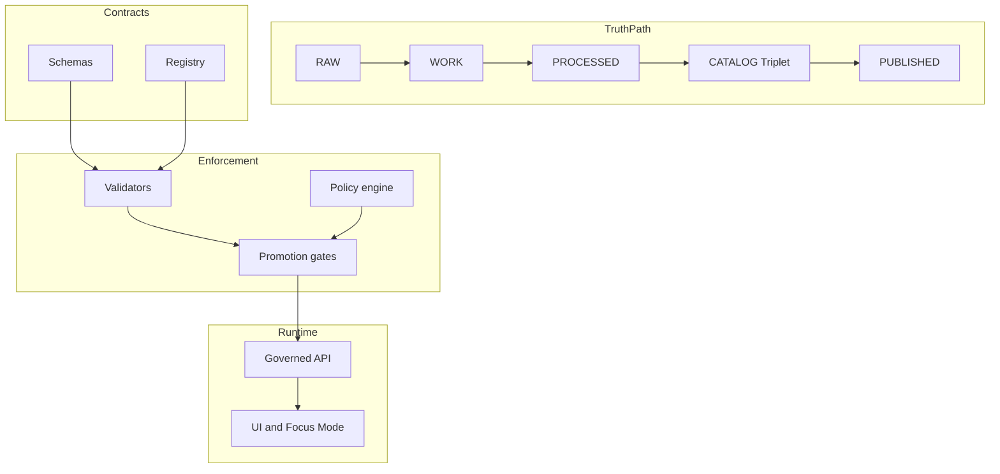

<!-- [KFM_META_BLOCK_V2]
doc_id: kfm://doc/c4017624-8264-45fe-86cd-8d7cf05991ed
title: schemas
type: standard
version: v1
status: draft
owners: TBD (Schema Stewards)
created: 2026-03-03
updated: 2026-03-03
policy_label: public
related:
  - tools/validators/
  - tools/schema/
  - governance/run_receipt.schema.json
  - .github/workflows/
tags: [kfm, schemas, json-schema, contracts, governance]
notes:
  - This README documents intended contracts and guardrails. Treat any "PROPOSED" or "UNKNOWN" items as design defaults until confirmed in-repo.
[/KFM_META_BLOCK_V2] -->

# schemas
Governed JSON Schema contracts for KFM artifacts (catalog triplet, receipts, telemetry, and other machine-validated interfaces).

<div align="center">

**Status:** Draft · **Owners:** TBD (Schema Stewards) · **Posture:** default-deny / fail-closed  
**Mode:** GOVERNED (contracts boundary)

[Purpose](#purpose) · [Where it fits](#where-this-fits-in-kfm) · [Directory](#directory-layout) · [Registry](#schema-registry) · [Quickstart](#quickstart) · [Change workflow](#change-workflow) · [Unknowns](#unknowns-to-verify)


-blue)
-blue)

<!-- TODO: Replace badges with real workflow targets once CI paths are finalized -->

</div>

---

## Scope

- **CONFIRMED:** This directory defines **machine-validated contracts** that gate promotion and publishing.
- **CONFIRMED:** Schemas are a **hard truth boundary**: if artifacts do not validate, they must not be promoted/published.
- **PROPOSED:** `schemas/` is the canonical “contracts surface” for JSON Schemas even if the repo also has a higher-level `contracts/` directory (i.e., `contracts/schemas/` may be an alternative placement).
- **UNKNOWN:** Exact placement (`schemas/` vs `contracts/schemas/`) in your current repo checkout.
  - **Verify:** `ls -la` at repo root; search for `contracts/` and `schemas/`.

---

## Conventions

### Evidence labels (CITE-OR-ABSTAIN)
Every meaningful statement in this README is labeled:

- **CONFIRMED** — documented as KFM intent/contract in governance/architecture materials.
- **PROPOSED** — recommended default convention (safe and incremental).
- **UNKNOWN** — not verifiable from repo evidence in this checkout; includes minimal verification steps.

> IMPORTANT: “CONFIRMED” means “confirmed as documented intent/contract,” not necessarily “already implemented in this branch.”

### Normative keywords
This README uses RFC-style keywords:

- **MUST** = required for promotion/publishing
- **SHOULD** = strongly recommended default
- **MAY** = optional / context-dependent

---

## Where this fits in KFM

- **CONFIRMED:** KFM operates a **truth path** with explicit zones and gated promotion: `RAW → WORK → PROCESSED → CATALOG (DCAT+STAC+PROV) → PUBLISHED`. Schemas are part of what makes those gates automatable and auditable.  
- **CONFIRMED:** KFM enforces a **trust membrane**: clients do not access storage directly; access is evaluated at the governed API / PEP boundary. Schemas provide a concrete contract surface for what may cross boundaries and what must be validated before it does.

### Architecture sketch


```mermaid
flowchart TB
  subgraph TruthPath
    Z1[RAW]
    Z2[WORK]
    Z3[PROCESSED]
    Z4[CATALOG Triplet]
    Z5[PUBLISHED]
  end

  subgraph Contracts
    S1[Schemas]
    S2[Registry]
  end

  subgraph Enforcement
    V1[Validators]
    V2[Policy engine]
    G1[Promotion gates]
  end

  subgraph Runtime
    A1[Governed API]
    U1[UI and Focus Mode]
  end

  Z1 --> Z2 --> Z3 --> Z4 --> Z5
  S1 --> V1 --> G1
  S2 --> V1
  V2 --> G1
  G1 --> A1 --> U1
```

---

## Acceptable inputs

- **CONFIRMED:** JSON Schema files that validate CI-critical artifacts such as:
  - **catalog triplet** records (DCAT, STAC, PROV profiles)
  - **run receipts** / promotion manifests / attestations
  - **telemetry events** used by governance/ops checks
- **PROPOSED:** Shared `$defs` for cross-cutting fields:
  - `dataset_id`, `dataset_version_id`
  - `spec_hash`
  - content digests (`sha256:` or `multihash:`)
  - time fields (`date-time`)
  - `policy_label` / sensitivity classification
  - SPDX license identifiers

---

## Exclusions

- **CONFIRMED:** No raw/processed data belongs here.
- **CONFIRMED:** No secrets, tokens, or environment-specific configuration belongs here.
- **PROPOSED:** Do not store generated bundles here (compiled schema packs, reports). Emit to `artifacts/` or CI artifacts instead.
- **PROPOSED:** Do not store Rego policy here; keep **schemas** and **policy** separate to preserve a clear policy boundary.

---

## Directory layout

### Target layout (PROPOSED)
Adapt names as needed; keep the intent: stable “families,” shared `$defs`, and versioned schemas.

```text
schemas/
├── README.md
├── registry.yaml                # canonical schema index (id, path, semver, compat mode, owners)
├── common/                      # shared $defs (ids, timestamps, digests, SPDX, policy labels)
├── catalogs/
│   ├── dcat/                    # DCAT profile schemas / constraints
│   ├── stac/                    # STAC profile schemas / extension pinning
│   └── prov/                    # PROV profiles / lineage bundles
├── telemetry/                   # telemetry event schemas
├── receipts/                    # run receipts / promotion manifests / attestations
└── api/                         # optional: DTO schemas if not expressed in OpenAPI
```

### Repo reality (UNKNOWN until verified)
- **UNKNOWN:** Which of the above folders exist today.
  - **Verify:** `ls -R schemas/` and replace this section with the actual tree.
  - **Verify:** `rg -n "schemas/" .github/workflows docs tools` to find live references.

---

## Schema registry

- **PROPOSED:** Maintain a single registry file (`schemas/registry.yaml`) so:
  - schemas are discoverable and referenceable by stable IDs
  - compatibility checks can be automated
  - ownership + policy labels are explicit
  - receipts/manifests can reference a deterministic schema id/version

### Proposed `schemas/registry.yaml` shape

```yaml
# schemas/registry.yaml
version: 1
schemas:
  - id: kfm.schema.receipts.run_receipt.v1
    path: schemas/receipts/run-receipt/v1/schema.json
    semver: 1.0.0
    mode: backward        # backward|forward|full
    owners: [tbd-schema-stewards]
    policy_label: restricted
    gates: ["F"]          # Promotion Contract gate(s) this schema supports

  - id: kfm.schema.telemetry.pipeline_run.v1
    path: schemas/telemetry/pipeline-run/v1/schema.json
    semver: 1.0.0
    mode: backward
    owners: [tbd-schema-stewards]
    policy_label: public
```

> NOTE: If the canonical receipt schema currently lives at `governance/run_receipt.schema.json`, treat that as authoritative until a governed migration plan exists.

---

## Promotion Contract alignment

- **CONFIRMED:** Promotion to `PUBLISHED` is blocked unless the **Promotion Contract gates** are satisfied.
- **PROPOSED:** Each gate maps to one or more schema families below (so enforcement is testable).

### Gates to schema families (mapping)

| Gate | What the gate checks | Schema family (target) | Notes |
|------|-----------------------|------------------------|------|
| A | Identity + versioning | `schemas/common/` | dataset ids, spec_hash, digests |
| B | Licensing + rights | `schemas/common/` + catalogs | SPDX IDs and rights blocks |
| C | Sensitivity + redaction plan | `schemas/common/` + receipts | policy labels + obligations |
| D | Catalog triplet validation | `schemas/catalogs/` | DCAT/STAC/PROV cross-links |
| E | QA thresholds | receipts + dataset specs | schema captures thresholds + results |
| F | Run receipt + audit record | `schemas/receipts/` | append-only, signed if required |
| G | Release manifest | receipts/manifests | ties promotion to artifacts/digests |

> PROPOSED: keep this table generated from `schemas/registry.yaml` to prevent doc drift.

---

## Versioning and compatibility

- **CONFIRMED:** Use SemVer rules for schema evolution:
  - **PATCH**: descriptions/examples/annotations only
  - **MINOR**: additive, backward-compatible (new optional fields, new enum values that don’t break existing)
  - **MAJOR**: breaking changes (new required fields, type changes, removals, tighter constraints)

- **PROPOSED:** Store multiple versions side-by-side (`.../v1/`, `.../v2/`) and never rewrite old versions after publish.
- **PROPOSED:** Run a PR-time compatibility diff for changed schemas and block merges on breaking changes unless a major bump is declared.

---

## Validation

### Quickstart

> These commands are **PROPOSED defaults** — adjust paths and tooling to match your repo.

```bash
# 0) Inspect schema surface (verify what exists)
ls -R schemas/ || true

# 1) Basic JSON well-formedness
find schemas -name "*.json" -print0 | xargs -0 -n1 jq -e . >/dev/null

# 2) Validate local fixtures against a schema (example)
python -m jsonschema \
  --schema schemas/receipts/run-receipt/v1/schema.json \
  tests/fixtures/receipts/run-receipt.sample.json

# 3) (Optional) Validate registry YAML if you use it
yq -e '.version == 1 and (.schemas | type == "!!seq")' schemas/registry.yaml
```

### CI validation (PROPOSED)

- Schema lint (well-formed JSON + `$ref` resolution)
- Schema compat diff (direction from registry `mode`)
- Fixture validation (sample payloads must validate)
- Catalog validators + link checkers + spec-hash drift checks (as part of broader promotion gates)

Example workflow sketch:

```yaml
name: schemas
on:
  pull_request:
    paths:
      - "schemas/**"
      - "tools/schema/**"
      - "tests/fixtures/**"
jobs:
  schemas:
    runs-on: ubuntu-latest
    steps:
      - uses: actions/checkout@v4

      - name: Lint JSON
        run: |
          find schemas -name "*.json" -print0 | xargs -0 -n1 jq -e . >/dev/null

      - name: Validate fixtures (example)
        run: |
          python -m jsonschema \
            --schema schemas/receipts/run-receipt/v1/schema.json \
            tests/fixtures/receipts/run-receipt.sample.json
```

---

## Change workflow

### Definition of Done (schema PR checklist)

- [ ] **CONFIRMED:** Schema(s) validate; `$ref` resolution is clean (no broken refs)
- [ ] **PROPOSED:** Registry entry created/updated (`schemas/registry.yaml`)
- [ ] **PROPOSED:** SemVer bump matches change type (patch/minor/major)
- [ ] **PROPOSED:** Compatibility diff report is green **or** major bump + migration note included
- [ ] **CONFIRMED:** Fixtures/examples updated (or added) to cover the change
- [ ] **CONFIRMED:** CI gates pass (schema lint, fixture validation, catalog validators where applicable)
- [ ] **PROPOSED:** Changelog note added (or PR includes rationale + rollback plan)

### Guardrails

- **CONFIRMED:** Avoid schema designs that enable targeting/exposure of sensitive locations.
- **PROPOSED:** If location fields exist, require:
  - explicit `policy_label`
  - explicit precision/aggregation rules (e.g., H3 resolution caps)
  - documented redaction/generalization obligations in the producing pipeline spec

---

## Schema registry table

> **PROPOSED:** Keep this table auto-generated from `schemas/registry.yaml`.

| schema id | path | semver | compat | policy_label | owners | gates |
|----------|------|--------|--------|--------------|--------|-------|
| *(TBD)*  | *(TBD)* | *(TBD)* | *(TBD)* | *(TBD)* | *(TBD)* | *(TBD)* |

---

## FAQ

### Why are schemas a “hard boundary”?
Because KFM is intended to be fail-closed: promotion/publishing must not proceed if identity, licensing, sensitivity, catalog triplet integrity, receipts, or release manifests can’t be validated.

### Where do API DTO schemas live?
- **PROPOSED default:** In OpenAPI (preferred) unless you have a strong reason to mirror DTOs as JSON Schemas under `schemas/api/`.

### Should we allow remote `$ref`?
- **PROPOSED:** Prefer local refs for determinism. If remote refs are used (e.g., STAC extension URIs), pin exact versions and record them in the registry.

---

## Unknowns to verify

Fail-closed until verified:

1) **Does `schemas/registry.yaml` exist today?**  
   - Verify: list `schemas/` and search CI for registry usage.

2) **Which schema families are currently enforced (catalogs, telemetry, receipts)?**  
   - Verify: grep for schema refs in validators and workflows.

3) **Where is the canonical run receipt schema stored (`governance/` vs `schemas/receipts/`)?**  
   - Verify: locate `run_receipt.schema.json` and identify the consuming validators.

4) **Which JSON Schema draft is enforced (2020-12 vs older)?**  
   - Verify: inspect `$schema` fields and pin validator versions in CI.

---

<details>
<summary><strong>Appendix: Recommended tools (swap-friendly)</strong></summary>

- **JSON validation:** `jq`
- **Schema validation:** Python `jsonschema` or Node `ajv` (pin versions in CI)
- **Compatibility diff:** `@atlassian/json-schema-diff` or equivalent
- **YAML tooling:** `yq`

> PROPOSED: keep tools in `tools/schema/` with a single wrapper so you can replace underlying validators without changing CI contracts.

</details>

---

Back to top: [schemas](#schemas)
