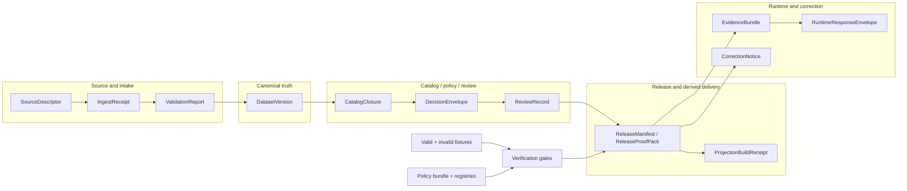

<!-- [KFM_META_BLOCK_V2]
doc_id: kfm://doc/NEEDS-VERIFICATION
title: Schemas
type: standard
version: v1
status: draft
owners: NEEDS-VERIFICATION
created: YYYY-MM-DD
updated: 2026-03-19
policy_label: NEEDS-VERIFICATION
related: [NEEDS-VERIFICATION]
tags: [kfm, schemas, contracts, json-schema]
notes: [Task-local target path is schemas/README.md; current-session evidence was PDF-only; corpus path signals for this surface diverge and require mounted-repo verification before publication.]
[/KFM_META_BLOCK_V2] -->

# Schemas

Machine-readable KFM contract schemas for intake, validation, release, runtime trust, and correction.

> **Status:** experimental  
> **Owners:** NEEDS-VERIFICATION  
> **Truth posture:** CONFIRMED doctrine · PROPOSED repo-local realization · UNKNOWN mounted schema inventory  
> 
> 
> 
>   
> **Quick jumps:** [Scope](#scope) · [Repo fit](#repo-fit) · [Inputs](#inputs) · [Directory tree](#directory-tree) · [Quickstart](#quickstart) · [Diagram](#diagram) · [Tables](#tables) · [Task list](#task-list--definition-of-done) · [FAQ](#faq) · [Appendix](#appendix)

> [!IMPORTANT]
> This README is source-bounded. In this session, the directly visible workspace exposed a KFM PDF corpus under `/mnt/data`, not a mounted repository checkout. Keep repo-local filenames, schema inventory, CI lanes, manifests, route names, and runtime emitters explicitly **NEEDS VERIFICATION** until the live tree is surfaced.

> [!NOTE]
> Path signals are not yet reconciled. The task target is `schemas/README.md`. The March 2026 schema reference also shows an illustrative `schemas/contracts/` starter layout, while older repository-inventory material described top-level `contracts/` as the contract/schema surface. This README keeps that mismatch visible instead of silently deciding it.

## Scope

This directory, wherever the mounted repo ultimately places it, is the machine-readable edge of KFM’s governed truth path. It is where intake, validation, release, runtime explanation, and correction stop being only prose and become typed, diffable, reviewable, and gateable artifacts.

The goal here is not to accumulate every possible object family on day one. The goal is to publish the smallest schema surface that can prove one governed slice end to end without hiding uncertainty, bypassing policy, or letting derived/runtime convenience masquerade as canonical truth.

This surface should stay disciplined:

- one contract family per schema file unless shared fragments materially reduce drift
- explicit alignment with registries, policy bundles, fixtures, and verification gates
- fail-closed behavior proven with valid and invalid examples
- visible separation between **CONFIRMED doctrine**, **PROPOSED realization**, and **UNKNOWN mounted implementation**

[Back to top](#schemas)

## Repo fit

| Item | Value |
|---|---|
| Path | `schemas/README.md` |
| Document class | Directory README + standard doc |
| Role | Directory-level guide for KFM machine-readable contract schemas |
| Task-local target | `schemas/` |
| Additional corpus path signals | `schemas/contracts/` *(illustrative starter layout)* · `contracts/` *(older repo inventory surface)* |
| Likely upstream surfaces | [`../policy/`](../policy/), [`../registries/`](../registries/), [`../docs/standards/`](../docs/standards/), [`../docs/adr/`](../docs/adr/) *(all illustrative; NEEDS VERIFICATION against mounted repo)* |
| Likely downstream surfaces | [`../fixtures/valid/`](../fixtures/valid/), [`../fixtures/invalid/`](../fixtures/invalid/), [`../docs/runbooks/`](../docs/runbooks/), [`../examples/thin-slice/hydrology/`](../examples/thin-slice/hydrology/) *(all illustrative; NEEDS VERIFICATION against mounted repo)* |
| Doctrinal baseline | March 18–19 2026 KFM master, contract, schema/contract, testing, policy, data, tooling, and primary-documentation references |
| Current constraint | No mounted repo tree, schema registry, workflow inventory, manifests, tests, dashboards, or runtime logs were directly visible in this session |

This README therefore documents the intended schema surface and its explicit unknowns. It does **not** claim that the live repo already exposes the exact file inventory shown below.

## Inputs

Accepted here:

- versioned JSON Schema files for KFM contract families
- shared fragments / reusable `$defs` referenced by those schemas
- schema-surface notes that pin dialect, compatibility rules, or deprecation posture
- this README and any brief colocated maintenance notes the repo deliberately keeps with the schema surface

Preferred filename pattern:

```text
<family>.schema.json
```

Explicit first-wave filenames named in the freshest schema reference:

```text
source_descriptor.schema.json
ingest_receipt.schema.json
validation_report.schema.json
dataset_version.schema.json
catalog_closure.schema.json
decision_envelope.schema.json
release_manifest.schema.json
runtime_response_envelope.schema.json
correction_notice.schema.json
evidence_bundle.schema.json
```

Adjacent follow-on or paired families that still belong to the wider starter lattice:

```text
review_record.schema.json
projection_build_receipt.schema.json
release_proof_pack.schema.json
```

> [!TIP]
> The corpus distinguishes between the **full starter lattice** and the **literal first schema wave**. Keep that distinction explicit. The first wave should be small enough to validate and ship; the wider lattice should remain visible so release, runtime, and correction work do not drift into prose-only governance.

## Exclusions

Do **not** place these here unless mounted repo truth explicitly says otherwise:

- valid and invalid fixtures; keep them in [`../fixtures/valid/`](../fixtures/valid/) and [`../fixtures/invalid/`](../fixtures/invalid/) or the repo’s verified equivalent
- policy bundles, reason/obligation registries, rights classes, and sensitivity classes; keep them in [`../policy/`](../policy/) and/or [`../registries/`](../registries/)
- emitted release proofs, manifests, receipts, SBOMs, attestations, or correction artifacts; keep them in the repo’s artifact or output surface, not the schema source surface
- outward HTTP API descriptions; keep them in the repo’s API-contract surface rather than in the object-schema directory
- runbooks, ADRs, and broader governance prose; keep them in [`../docs/runbooks/`](../docs/runbooks/), [`../docs/adr/`](../docs/adr/), or verified neighboring docs
- generated STAC/DCAT/PROV outputs; keep them in catalog/release output surfaces

## Directory tree

**PROPOSED starter tree for this path (not a mounted inventory claim):**

```text
schemas/
├── README.md
├── source_descriptor.schema.json
├── ingest_receipt.schema.json
├── validation_report.schema.json
├── dataset_version.schema.json
├── catalog_closure.schema.json
├── decision_envelope.schema.json
├── release_manifest.schema.json
├── runtime_response_envelope.schema.json
├── correction_notice.schema.json
└── evidence_bundle.schema.json
```

If the mounted repo splits `release_manifest` from `release_proof_pack`, or materializes `review_record` and `projection_build_receipt` immediately, document that explicitly rather than leaving the split implicit.

<details>
<summary><strong>Corpus-aligned surrounding layout (illustrative; repo-unverified)</strong></summary>

```text
repo-root/
├── schemas/                  # task-local target
│   └── README.md
├── fixtures/
│   ├── valid/
│   └── invalid/
├── registries/
├── policy/
├── docs/
│   ├── adr/
│   ├── standards/
│   └── runbooks/
├── examples/
│   └── thin-slice/
│       └── hydrology/
└── .github/
    └── workflows/
```

</details>

## Quickstart

1. Publish the smallest first-wave schema pack.
2. Pair every high-value family with at least one valid and one invalid fixture in the adjacent fixture surface.
3. Publish starter registries and a deny-by-default policy bundle alongside the schema work.
4. Wire schema, policy, runtime-negative, surface-state, correction, and docs/accessibility gates.
5. Prove one hydrology-first governed slice end to end before broadening the object set.

```bash
# illustrative pseudocode — bind these checks to the repo's actual runner and CI lane
validate schemas/*.schema.json
validate fixtures/valid
assert_invalid fixtures/invalid

run gate:source-replay
run gate:catalog-closure
run gate:policy-bundle
run gate:evidence-resolution
run gate:runtime-citation-negative
run gate:surface-state
run gate:correction-drill
run gate:docs-accessibility
```

## Usage

### Working rules

- Treat schema changes, fixture changes, registry changes, and gate changes as one review stream.
- Prefer additive evolution over silent breaking changes.
- Keep exact dialect/profile pins explicit in a standards artifact or ADR, not implied by README prose.
- Never let schema commentary sound like verified implementation when the mounted tree has not been surfaced.
- Keep generated proof objects and runtime outputs downstream of these schemas, not mixed into them.

### What this directory is optimizing for

This surface is optimizing for four things at once: machine validation, reviewable governance, fail-closed runtime behavior, and visible correction lineage.

Across the March 2026 materials, the shared envelope pressure is stable even when exact field names remain repo work rather than README truth. Consequential objects repeatedly need:

- stable type/version identity
- subject or release lineage
- policy/result context
- evidence and audit linkage
- actor/time context
- enough structure to support abstain, deny, stale-visible, correction, and rollback behavior without hand-waving

Keep the README at that level unless the mounted schema files themselves are visible.

## Diagram


```mermaid
flowchart LR
    subgraph A["Source and intake"]
        SD[SourceDescriptor]
        IR[IngestReceipt]
        VR[ValidationReport]
    end

    subgraph B["Canonical truth"]
        DV[DatasetVersion]
    end

    subgraph C["Catalog / policy / review"]
        CC[CatalogClosure]
        DE[DecisionEnvelope]
        RR[ReviewRecord]
    end

    subgraph D["Release and derived delivery"]
        RM[ReleaseManifest / ReleaseProofPack]
        PBR[ProjectionBuildReceipt]
    end

    subgraph E["Runtime and correction"]
        EB[EvidenceBundle]
        RRE[RuntimeResponseEnvelope]
        CN[CorrectionNotice]
    end

    SD --> IR --> VR --> DV --> CC --> DE --> RR --> RM
    RM --> PBR
    RM --> EB --> RRE
    RM --> CN

    F[Valid + invalid fixtures] --> G[Verification gates]
    P[Policy bundle + registries] --> G
    G --> RM
```

This is the important architectural point: the schema surface is not a bag of JSON files. It is the typed object graph through which intake, release, runtime trust, and correction stay connected.

## Tables

### A. Starter contract lattice and first-wave status

| Family | Minimum purpose | First-wave status | Notes |
|---|---|---|---|
| `SourceDescriptor` | Declare admissible source identity, rights posture, cadence, support, validation plan, and publication intent. | **Explicitly first wave** | Also carries the minimum intake burden for identity, access, ownership, spatial/temporal basis, rights/sensitivity, format/schema, storage policy, normalization, and publication intent. |
| `IngestReceipt` | Prove what was fetched, when, and with what integrity result. | **Explicitly first wave** | Replay and quarantine posture depend on it. |
| `ValidationReport` | Record structural, spatial, temporal, unit, and domain QC outcomes. | **Explicitly first wave** | Fail-closed path back to hold/quarantine depends on it. |
| `DatasetVersion` | Carry immutable authoritative processed truth with stable identity and time semantics. | **Explicitly first wave** | Canonical write safety depends on it. |
| `CatalogClosure` | Prove outward metadata, provenance, and discovery obligations are complete enough for review/release. | **Explicitly first wave** | STAC/DCAT/PROV coherence belongs here. |
| `DecisionEnvelope` | Express machine-readable policy result, reasons, obligations, and effectivity. | **Explicitly first wave** | Core policy artifact. |
| `ReviewRecord` | Capture human approval, denial, escalation, or note. | **Starter lattice; first-wave file status NEEDS VERIFICATION** | Explicitly present in the wider starter lattice and thin-slice bundle even when not always named in the literal first file list. |
| `ReleaseManifest` / `ReleaseProofPack` | Define the publishable trust unit for promotion, deployment handoff, published scope, and rollback posture. | **`release_manifest.schema.json` is explicit first wave** | Proof-pack may be paired with or split from manifest work. |
| `ProjectionBuildReceipt` | Prove a derived map/export stayed downstream of an approved release and freshness basis. | **Starter lattice; likely immediate follow-on** | Required when a derived delivery surface is exposed. |
| `EvidenceBundle` | Resolve a visible claim or runtime output to inspectable, policy-safe support. | **Explicitly first wave** | Freshest schema reference allows either a schema or a resolver contract. |
| `RuntimeResponseEnvelope` | Make runtime outcome accountable at request time. | **Explicitly first wave** | Central to answer / abstain / deny / error behavior. |
| `CorrectionNotice` | Preserve visible lineage under supersession, withdrawal, rollback, or correction. | **Explicitly first wave** | No silent overwrite. |

> [!NOTE]
> The corpus is consistent on the **full starter lattice**, but not every document describes the literal **first schema wave** at the same granularity. This README follows the freshest schema-specific file list while keeping the wider lattice visible.

### B. Standards profile

| Concern | Corpus-aligned baseline | Why it matters here |
|---|---|---|
| Machine-readable contract files | **JSON Schema Draft 2020-12** | Best-fit baseline for schema files, fixtures, and structural gates. |
| Governed HTTP API contracts | **OpenAPI 3.2.0** | Important to adjacent route-contract surfaces; not stored here by default. |
| Catalog and provenance closure | **DCAT 3 + PROV-O + STAC** | Needed for releasable scope, outward discoverability, and lineage. |
| Outward spatial route families | **OGC API – Features / Maps / Tiles / Records** | Relevant when governed outward discovery, feature, or portrayal routes are exposed. |
| Accessibility baseline | **WCAG 2.2** | Docs/accessibility gate is part of release trust, not optional polish. |
| Policy execution | **OPA / Rego bundles** | Schemas alone are not enough; deny-by-default policy must become executable. |
| Release integrity | **OCI 1.1.x / Sigstore-Cosign** | Relevant to release manifests, attestations, and proof-bearing publication. |
| Telemetry naming | **OpenTelemetry semantic conventions** | Stable joins across traces, audit refs, releases, and runtime envelopes. Exact local pin still needs explicit publication. |

### C. Validation & gates

| Gate | What it proves | Typical proof/report |
|---|---|---|
| Source replay gate | `SourceDescriptor` + `IngestReceipt` are enough to re-fetch and verify source inputs. | replay receipt or replay section in `validation_report` |
| Catalog closure gate | STAC/DCAT/PROV identifiers and closure remain coherent for dataset/release scope. | `catalog_closure` |
| Policy bundle gate | Reason codes, obligation codes, labels, and deny-by-default rules are complete enough to fail closed. | `decision_envelope` plus policy test report |
| Release assembly gate | Release unit is complete, signed/attested as required, and tied to catalog/provenance artifacts. | `release_manifest` or `release_proof_pack` |
| Evidence-resolution gate | Every consequential visible claim or runtime output resolves to inspectable support. | resolver proof or runtime evidence check |
| Runtime citation-negative test | Unsupported answers are refused when citations fail, scope is empty, or evidence is unavailable. | negative-test report / golden fixtures |
| Surface-state gate | UI surfaces honestly display stale, generalized, withheld, superseded, or withdrawn states. | surface-state check report |
| Correction drill | Supersession, withdrawal, rollback, and correction behavior are real, visible, and auditable. | `correction_notice` plus drill report |
| Documentation/accessibility gate | Contracts, examples, diagrams, runbooks, and trust-visible outputs stay current and usable. | doc/accessibility gate report |

[Back to top](#schemas)

## Task list / Definition of done

- [ ] Reconcile the mounted path for this surface (`schemas/`, `schemas/contracts/`, `contracts/`, or another verified location).
- [ ] Publish the explicit first-wave schema pack.
- [ ] Publish at least one valid and one invalid fixture per high-value family.
- [ ] Publish starter registries for reasons, obligations, rights classes, sensitivity classes, and runtime outcomes.
- [ ] Publish a deny-by-default policy bundle and make it gateable.
- [ ] Implement or at least publish the EvidenceBundle resolver contract and RuntimeResponseEnvelope path.
- [ ] Add source replay, catalog closure, policy bundle, release assembly, evidence-resolution, runtime citation-negative, surface-state, correction, and docs/accessibility gates.
- [ ] Prove one hydrology-first governed slice end to end.
- [ ] Surface the live repo tree, schema inventory, workflow inventory, manifests, route inventory, and telemetry joins so UNKNOWNs can be retired with evidence.
- [ ] Fill owners, created date, policy label, and related links before publication.

## FAQ

### Why is this README still path-cautious?

Because current-session evidence did not include a mounted repo checkout. The attached March 2026 documents are strong on doctrine and recommended structure, but they explicitly keep path-level claims **UNKNOWN** until the live tree is surfaced.

### Why are `ReviewRecord` and `ProjectionBuildReceipt` documented even though they are not always in the literal first file list?

Because they remain part of the wider starter lattice and the thin-slice proof bundle. The safest interpretation is: keep them doctrinally visible now, then let mounted repo truth decide whether they ship in the literal first schema wave or immediately after it.

### Do OpenAPI files belong here?

Not by default. The corpus treats outward HTTP route contracts as a neighboring surface, not the same directory as the object-envelope schemas.

### Do fixtures belong here?

Usually no. Keep valid and invalid examples in their own fixture surface so CI can consume them directly and the schema directory stays focused.

### Why does hydrology keep appearing in a schema README?

Because hydrology is the strongest first governed slice in the current corpus: public-safe more often than stewardship-heavy lanes, place/time rich, and structurally good for proving intake, release, runtime trust, and correction without immediately forcing the hardest heritage or identity burdens.

### What remains unknown before this README can be published as repo truth?

The mounted repo tree, the actual schema inventory, CI/workflow lanes, deployment manifests, resolver implementation, proof-pack samples, standards pins, and the actual chosen first slice.

## Appendix

<details>
<summary><strong>Direct verification backlog</strong></summary>

| Unknown area | Why it matters | What would verify it |
|---|---|---|
| Exact repo topology | Prevents this README from hardening a guessed path into fact. | Surface the live repo tree. |
| Literal schema inventory | Distinguishes doctrine from mounted files. | Inventory mounted schema files and compare them to the required family list. |
| Workflow / CI lanes | Gate claims remain aspirational until lane definitions are visible. | Surface workflow files or equivalent CI/task-runner definitions. |
| Deployment manifests / overlays | Release/runtime boundary claims remain unverified without them. | Surface Compose, systemd, Helm, Kubernetes, or GitOps manifests. |
| EvidenceBundle resolver implementation | Central to evidence drill-through and runtime trust. | Publish resolver contract, sample bundle output, and negative tests. |
| RuntimeResponseEnvelope path | Central to answer/abstain/deny/error behavior. | Publish sample governed responses and runtime traces. |
| Proof-pack implementation status | Release evidence is still prose until real samples exist. | Surface real proof-pack samples. |
| Exact local standards pins | Public-profile fit is not the same thing as a project pin. | Publish a standards-profile ADR or registry. |
| First actual thin slice | Hydrology is strongly recommended, not directly verified as the already-shipped first slice. | Name the real slice and tie it to fixtures, manifests, and proof objects. |

</details>

<details>
<summary><strong>Path signals observed in the current corpus</strong></summary>

- **Task target:** `schemas/README.md`
- **Fresh schema reference starter layout:** `schemas/contracts/` *(illustrative; not a mounted repo claim)*
- **Older repo-inventory signal:** top-level `contracts/` described as the API contract/schema surface

Do not merge these into faux certainty. Reconcile them against the live repository before publication.

</details>

<details>
<summary><strong>Surfaces that must stay aligned with schema changes</strong></summary>

| Surface | Why it must travel with schema work |
|---|---|
| Valid / invalid fixtures | They prove both acceptance and fail-closed behavior. |
| Registries | Reasons, obligations, rights classes, sensitivity classes, and runtime outcomes need stable machine vocabularies. |
| Policy bundles | A deny-by-default stance must stay executable, not merely documented. |
| Release proof samples | Schemas should stay tied to emitted reality. |
| Runbooks | Operators need replay, promotion, stale-state, correction, and rollback guidance that matches the contract surface. |
| Docs/accessibility gate | Behavior-significant changes should not outrun documentation and trust-visible usability. |

</details>

[Back to top](#schemas)