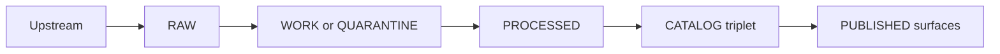
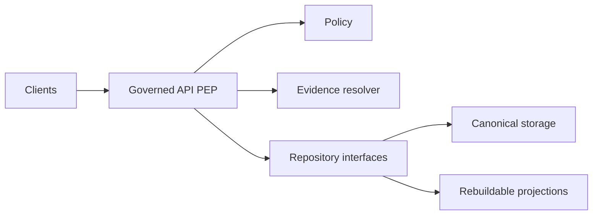
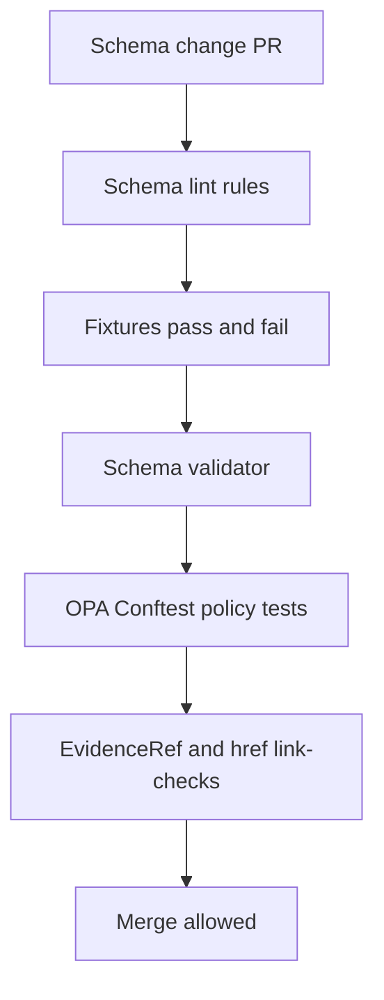

<!-- [KFM_META_BLOCK_V2]
doc_id: kfm://doc/2f0a2b0a-7b4e-4c66-9b4f-8de9f03213ae
title: schemas — governed contract artifacts (JSON Schema)
type: standard
version: v3
status: draft
owners: TBD
created: 2026-02-28
updated: 2026-03-02
policy_label: public
related:
  # NOTE: Paths are repo-relative and MUST be verified against the live repo tree.
  - docs/standards/KFM_MARKDOWN_WORK_PROTOCOL.md # verify
  - docs/standards/KFM_DCAT_PROFILE.md # verify
  - docs/standards/KFM_STAC_PROFILE.md # verify
  - docs/standards/KFM_PROV_PROFILE.md # verify
  - policy/opa/ # verify
  - contracts/openapi/ # verify
tags: [kfm, schemas, contracts, governance]
notes:
  - Contract-first: schemas are first-class artifacts; changes must be versioned and tested.
  - Promotion Contract: schema + contract tests are part of fail-closed promotion gates.
  - This README is normative for schemas/ intent; repo-specific wiring (paths/tools) must be verified in-tree.
[/KFM_META_BLOCK_V2] -->

# schemas/ — governed JSON Schema contract artifacts
Machine-validated **JSON Schema contracts** that make KFM pipelines, catalogs, policy gates, and governed APIs **testable, fail-closed, and evidence-first**.


 <!-- TODO: replace with real workflow badge(s) -->

> **Non‑negotiables**
> - If it’s **not validated**, it’s **not promotable**. If it’s **not promotable**, it’s **not publishable**.
> - **No breaking changes** without a **major version bump** (v1 → v2).
> - **No schema change** without **fixtures** and **contract tests**.
> - Schemas describe **cross-boundary payloads** (pipeline ↔ policy ↔ API ↔ UI evidence surfaces).

---

## Quick navigation
- [What lives here](#what-lives-here)
- [Contract taxonomy](#contract-taxonomy)
- [Where this fits in KFM](#where-this-fits-in-kfm)
- [Directory layout](#directory-layout)
- [Naming, versioning, and $id](#naming-versioning-and-id)
- [Schema authoring rules](#schema-authoring-rules)
- [Promotion Contract mapping](#promotion-contract-mapping)
- [Validation and CI wiring](#validation-and-ci-wiring)
- [Schema registry](#schema-registry)
- [Changing a schema](#changing-a-schema)
- [Schema lifecycle and deprecation](#schema-lifecycle-and-deprecation)
- [Exclusions](#exclusions)
- [Minimum verification steps](#minimum-verification-steps)

---

## What lives here
This directory contains **canonical JSON Schemas** for KFM **cross‑boundary** JSON payloads.

A payload belongs here when it is consumed across **two or more** of these boundaries:

- pipeline code ↔ CI gates
- pipeline code ↔ policy (OPA) checks
- pipeline code ↔ governed API
- governed API ↔ UI Evidence Drawer / citation verification
- UI publishing ↔ story/citation validation gates

**Rule of thumb:** if a payload shape can break **promotion, policy enforcement, API stability, or citation verification**, it belongs here (or in a clearly documented sibling contract directory linked from the [Schema registry](#schema-registry)).

---

## Contract taxonomy
These are the most common KFM “payload families” that should have explicit schemas:

- **Run receipts**: per-run “what happened” record emitted by every ingest/transform/publish run
- **Promotion / release manifests**: promotion-focused rollups (artifacts + digests + approvals) used to publish safely
- **Watcher entries**: allow-listed automated fetchers (watchers) with deterministic spec hash and (optional) signing
- **Evidence reference envelopes** (if present in your system): machine-checkable references that must resolve without guessing
- **UI/Story publishing sidecars** (if present): story node payloads, map state + citations, publish status

> NOTE: Some of these families may live outside `schemas/` in your repo (e.g., Story Node v3 schemas, OpenAPI schemas). That is acceptable **only if** the location is linked from the registry and validated by the same gates.

---

## Where this fits in KFM
Schemas sit on the **trust membrane**: they make promotion gates and policy enforcement **automatable** and **fail‑closed**.

### Truth path and promotion context (conceptual)


```mermaid
flowchart LR
  U[Upstream] --> RAW[RAW]
  RAW --> WORK[WORK or QUARANTINE]
  WORK --> PROC[PROCESSED]
  PROC --> CAT[CATALOG triplet]
  CAT --> PUB[PUBLISHED surfaces]
```

### Trust membrane (conceptual)


```mermaid
flowchart LR
  UI[Clients] --> PEP[Governed API PEP]
  PEP --> POL[Policy]
  PEP --> EVID[Evidence resolver]
  PEP --> REPO[Repository interfaces]
  REPO --> CAN[Canonical storage]
  REPO --> PROJ[Rebuildable projections]
```

### Boundary rules
- Clients **MUST NOT** read storage or databases directly; all access goes through the governed API boundary.
- Promotion **MUST** be blocked unless required artifacts exist **and validate**.
- Schema validation is **necessary but not sufficient**: policy checks and link integrity checks are also required.

---

## Directory layout
This folder should remain **small and canonical**.

### Required (minimum set)
```text
schemas/
  README.md
  run_receipt.v1.schema.json
  run_manifest.v1.schema.json
  watcher.v1.schema.json
```

### Recommended (high leverage)
```text
schemas/                                               # Schema hub: reusable JSON Schemas + a small registry/fixtures for deterministic contract testing
├─ registry.v1.json                                     # Machine-readable schema registry (recommended): schema_id, version, path, owners, status, and what artifacts each schema validates
├─ _fixtures/                                           # Small, deterministic fixtures used by contract tests (pass/fail cases; synthetic only)
│  ├─ run_receipt/                                      # Fixtures for run receipt schema validation
│  │  ├─ minimal.pass.json                              # Fixture: minimal valid run receipt (must pass schema + any required invariants)
│  │  └─ missing_spec_hash.fail.json                    # Fixture: invalid run receipt missing spec_hash (must fail; guards fail-closed enforcement)
│  └─ run_manifest/                                     # Fixtures for run manifest schema validation (if run manifests are adopted)
│     └─ minimal.pass.json                              # Fixture: minimal valid run manifest (must pass; prevents accidental over-tightening)
├─ _shared/                                             # Shared $defs only when truly reused across multiple schemas (avoid over-coupling)
│  └─ kfm_core.v1.schema.json                           # Core shared definitions (ids, timestamps, digests, policy_label, reason_codes) used across schema families
```

> TIP: Generated artifacts (TypeScript types, Python models) are **rebuildable** and should live in the owning module/package, not here (see [Exclusions](#exclusions)).

---

## Naming, versioning, and $id

### File naming
**MUST** use explicit major versioning in file names:

- `name.v1.schema.json`
- `name.v2.schema.json`

Examples:
- `run_receipt.v1.schema.json`
- `run_manifest.v1.schema.json`
- `watcher.v1.schema.json`

### `$schema` dialect
**MUST** use JSON Schema **draft 2020-12** unless the repo standard explicitly differs.

```json
{
  "$schema": "https://json-schema.org/draft/2020-12/schema"
}
```

### `$id` strategy (choose one and enforce it)
Your `$id` must be **stable** and include the **major version**. Two common strategies:

**Option A (recommended for tooling compatibility):** HTTP(S) base URI (even if not publicly hosted yet)
```json
{
  "$id": "https://<your-stable-base>/schemas/run_receipt.v1.schema.json"
}
```

**Option B (recommended for repo-internal stability):** KFM URI scheme
```json
{
  "$id": "kfm://schema/run_receipt/v1"
}
```

> NOTE: Do not “hand-wave” `$id`. Pick a base and enforce it in CI (lint rule: `$id` required, major included, no duplicates).

### Compatibility rules
- **Breaking changes** ⇒ **new major** (`v2`) and new `$id`
  - Removing required fields
  - Renaming fields
  - Narrowing types/constraints in a way that rejects previously valid payloads
- **Non-breaking changes** ⇒ keep major, but still require tests
  - Adding optional fields
  - Widening enums/constraints
  - Adding new `$defs` that do not invalidate existing instances

> RULE: No breaking changes without a **version bump**.

---

## Schema authoring rules

### Fail-closed defaults
KFM contracts should default to **deny-by-default** at the shape level.

**SHOULD** (default posture):
- Root `"type": "object"`
- `"additionalProperties": false` **or** `"unevaluatedProperties": false` (pick one posture and be consistent)
- Explicit `"required": [...]` (required fields are how we prevent silent drift)
- Prefer `"const"` / `"enum"` for protocol version fields (fail closed)
- Use `"format"` for timestamps and URIs where your validator enforces it
- Patterns for IDs (lowercase + delimiters), e.g. `^[a-z0-9:_-]+$`

### Deterministic identity and hashing
Where relevant, contracts **SHOULD** include fields that support deterministic identity and reproducibility:

- `dataset_id` and `dataset_version_id`
- `spec_hash` for the run spec/config (canonicalized before hashing)
- Content digests for inputs/outputs (e.g., `sha256:<hex>`)

### Make schema intent visible
**SHOULD**:
- set `title` + `description` on root and major `$defs`
- include a minimal `examples` array for humans
- use `$comment` for subtle invariants that are enforced by policy tests (OPA) or link-checkers

---

## Promotion Contract mapping
Schemas are a concrete dependency of the Promotion Contract gates. Keep this mapping explicit so CI and reviewers know what breaks when a contract changes.

| Promotion gate | What it checks (high level) | Typical schema dependencies |
|---|---|---|
| Gate A — Identity and versioning | IDs + deterministic spec hash + digests | `run_receipt.*`, `run_manifest.*`, `watcher.*` |
| Gate B — Licensing and rights metadata | License fields exist; terms snapshot recorded | manifests/registry entries that carry rights fields |
| Gate C — Sensitivity classification and redaction plan | `policy_label` assigned; obligations honored | any payload carrying `policy_label` / obligations |
| Gate D — Catalog triplet validation | DCAT/STAC/PROV validate + cross-link; EvidenceRefs resolve | receipt/manifest schemas + catalog validators elsewhere |
| Gate E — QA and thresholds | dataset-specific QA thresholds documented and met | QA report payload schemas (if modeled) + manifest links |
| Gate F — Policy tests and contract tests | OPA tests + schema tests block merges | fixtures + schemas + policy fixtures |
| Gate G — Release manifest | promotion recorded as release manifest with digests | `run_manifest.*` (or `release_manifest.*` if separated) |

> NOTE: DCAT/STAC/PROV validation typically uses their own profiles; link them in `related:` and in the [Schema registry](#schema-registry).

---

## Validation and CI wiring

### Local validation examples
Run schema validation locally in one of these typical ways (adapt to repo tooling):

- Node validator (Ajv):
  - `npx ajv-cli validate -s schemas/run_receipt.v1.schema.json -d schemas/_fixtures/run_receipt/minimal.pass.json`

- Python validator (`jsonschema`):
  - `python -m jsonschema -i schemas/_fixtures/run_receipt/minimal.pass.json schemas/run_receipt.v1.schema.json`

- Policy gate checks (Conftest + OPA):
  - `conftest test schemas/_fixtures/run_receipt/minimal.pass.json -p policy/opa`

### Contract-test flow (recommended)
Make schema changes “fail closed” by structuring CI like this:


```mermaid
flowchart TD
  PR[Schema change PR] --> LINT[Schema lint rules]
  LINT --> FIX[Fixtures pass and fail]
  FIX --> SVAL[Schema validator]
  SVAL --> PVAL[OPA Conftest policy tests]
  PVAL --> LINK[EvidenceRef and href link-checks]
  LINK --> MERGE[Merge allowed]
```

### CI expectations
CI **SHOULD**:
- Validate all fixtures/examples against their schemas
- Validate “fail fixtures” actually fail (negative tests)
- Run policy checks that depend on schema invariants (deny-by-default)
- Run link integrity checks when contracts reference other artifacts (EvidenceRefs, catalog links)
- Block merge on:
  - invalid schema
  - broken `$id` or versioning rules
  - contract-test regressions
  - policy test failures

> NOTE: If the repo is migrating policy to OPA/Rego v1, add a dedicated policy CI guard job (e.g., `opa check --v0-v1 --strict`) and treat failures as merge-blocking.

---

## Schema registry
Keep this section updated as schemas are added/changed. Prefer also maintaining a **machine-readable** `registry.v1.json` so tools can enumerate schema IDs.

| Schema file | Purpose | Version | Status | Promotion gates | Key invariants | Primary consumers |
|---|---|---:|---|---|---|---|
| `run_receipt.v1.schema.json` | Per-run receipt for inputs/outputs/tooling/policy decisions | v1 | active | A, F | `dataset_version_id`, `spec_hash`, digests, timestamps | CI gates, policy pack, evidence resolver, receipt viewer |
| `run_manifest.v1.schema.json` | Promotion record tying artifacts, digests, approvals | v1 | active | A, G, F | digests for all promoted artifacts; approvals when required | promotion workflow, release automation, PR gate |
| `watcher.v1.schema.json` | Allow-list entry for automated watchers | v1 | active | A, F | deterministic spec hash; endpoint URI; schedule | CI watcher gate, ingest dispatch, Focus Mode safety |

> NOTE: If other schema families live elsewhere (OpenAPI, Story Node schemas, dataset registry entry schemas), link them here, but keep **this directory** focused on canonical JSON Schemas.

---

## Changing a schema
Checklist for a PR-sized change that is reversible:

- [ ] Create/update the `*.vN.schema.json` file (pin dialect + $id)
- [ ] Add or update fixtures that MUST validate (and MUST fail)
- [ ] Add/adjust contract tests to validate fixtures and enforce versioning rules
- [ ] If breaking change: create `v(N+1)` schema, keep old major in place
- [ ] Update the [Schema registry](#schema-registry) table (and `registry.v1.json` if present)
- [ ] If used by policy: update Rego tests and ensure deny-by-default still holds
- [ ] If used by runtime: update validators/DTO generation and add compatibility notes

---

## Schema lifecycle and deprecation
KFM needs predictable evolution to preserve a stable evidence surface.

**Recommended lifecycle states** (apply consistently in registry + reviews):
- `draft` → `review` → `active` → `deprecated` → `retired` (retired = no longer accepted for new runs)

**Deprecation rules**
- Deprecate by **adding** a new major, not by mutating history.
- Keep deprecated majors available for validation and replay (as long as there is any artifact in the wild).
- If a schema becomes unsafe, block promotion via policy (Gate F) rather than silently editing old contracts.

---

## Exclusions
Do **NOT** put these in `schemas/`:

- OpenAPI specs (keep under `contracts/openapi/` or equivalent)
- Policy code (keep under `policy/opa/` or equivalent)
- Generated types (TypeScript / Python models) — generate into the owning package/module
- Large sample datasets — keep in `examples/` or `data/` zones
- One-off JSON examples without tests — if it matters, it needs a fixture + validation

---

## Minimum verification steps
If you’re unsure how this folder is wired in the current repo, do the smallest checks that remove ambiguity:

1) Capture repo commit hash and root directory tree (so links in this README can be made real)  
2) Find the schema validator in CI (Ajv, jsonschema, custom) and confirm it blocks merges  
3) Confirm which Promotion Contract gates are enforced today (and which are aspirational)  
4) Confirm which payload families are treated as contracts (receipts, manifests, watcher entries, registry entries)  
5) Confirm link-checking strategy for cross-artifact references (EvidenceRefs, catalog hrefs)

---

<p align="right"><a href="#schemas--governed-json-schema-contract-artifacts">Back to top</a></p>
