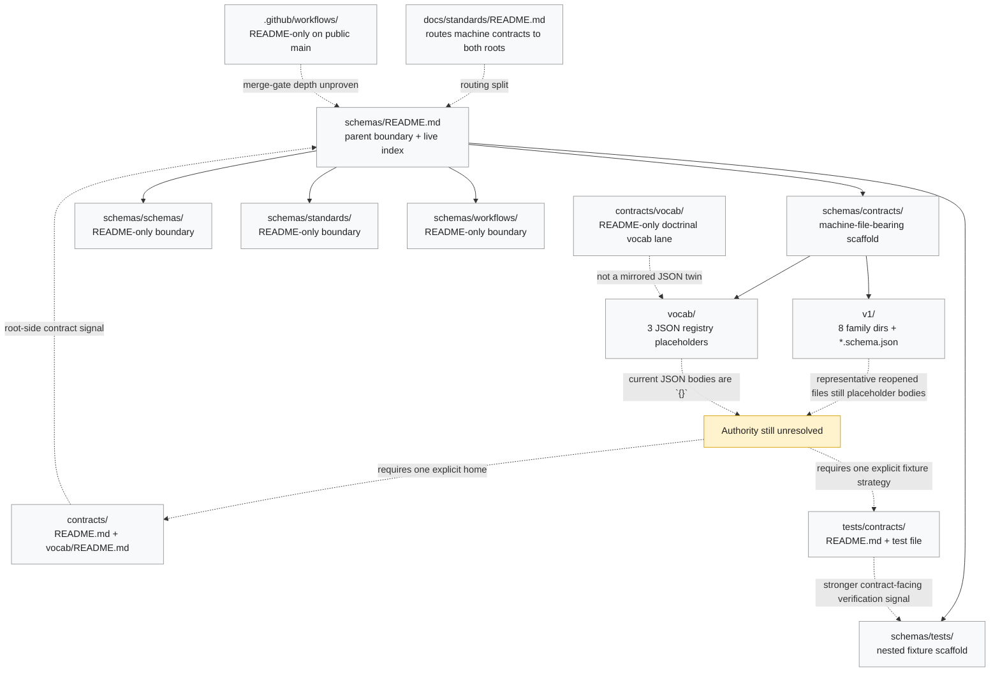

<!-- [KFM_META_BLOCK_V2]
doc_id: kfm://doc/NEEDS-VERIFICATION
title: Schemas
type: standard
version: v1
status: draft
owners: @bartytime4life
created: YYYY-MM-DD
updated: 2026-04-12
policy_label: public
related: [../README.md, ../contracts/README.md, ../contracts/vocab/README.md, ../docs/standards/README.md, ../policy/README.md, ../tests/README.md, ../tests/contracts/README.md, ../.github/workflows/README.md, ../.github/CODEOWNERS, ./contracts/README.md, ./schemas/README.md, ./standards/README.md, ./tests/README.md, ./workflows/README.md]
tags: [kfm, schemas, contracts, json-schema, scaffolds]
notes: [doc_id unresolved, created date not reverified from public history, owner currently resolves via CODEOWNERS global fallback, canonical schema-home and canonical fixture-home authority remain unresolved, root contract surfaces now include a separate vocab lane and a path-misaligned README that should be reconciled]
[/KFM_META_BLOCK_V2] -->

# Schemas

Parent boundary and live-tree index for the public `schemas/` subtree while KFM reconciles schema-home authority, fixture-home authority, and the now-split contract signals visible across adjacent repo roots.

> **Status:** experimental · **Doc status:** draft  
> **Owners:** `@bartytime4life` *(via current public `.github/CODEOWNERS` global fallback; no narrower `/schemas/` rule was directly verified on public `main`)*  
>        
> **Repo fit:** path `schemas/README.md` · upstream [`../README.md`](../README.md) · nested lanes [`./contracts/README.md`](./contracts/README.md), [`./schemas/README.md`](./schemas/README.md), [`./standards/README.md`](./standards/README.md), [`./tests/README.md`](./tests/README.md), [`./workflows/README.md`](./workflows/README.md) · adjacent root lanes [`../contracts/README.md`](../contracts/README.md), [`../contracts/vocab/README.md`](../contracts/vocab/README.md), [`../docs/standards/README.md`](../docs/standards/README.md), [`../policy/README.md`](../policy/README.md), [`../tests/README.md`](../tests/README.md), [`../tests/contracts/README.md`](../tests/contracts/README.md), [`../.github/workflows/README.md`](../.github/workflows/README.md)  
> **Quick jumps:** [Scope](#scope) · [Repo fit](#repo-fit) · [Inputs](#inputs) · [Exclusions](#exclusions) · [Directory tree](#directory-tree) · [Quickstart](#quickstart) · [Usage](#usage) · [Diagram](#diagram) · [Tables](#tables) · [Task list](#task-list--definition-of-done) · [FAQ](#faq) · [Appendix](#appendix)

> [!IMPORTANT]
> Current public `main` confirms that `schemas/` is a real nested subtree containing `contracts/`, `schemas/`, `standards/`, `tests/`, `workflows/`, and `README.md`.

> [!WARNING]
> The surrounding contract story is now **more split than this README’s earlier draft allowed**. `schemas/contracts/` is machine-file-bearing; root `contracts/` now also exposes a `vocab/` lane; `docs/standards/README.md` routes machine contracts to both `contracts/` and `schemas/contracts/`; and `tests/contracts/` now has at least one checked-in test file. None of that, by itself, settles canonical schema-home authority.

> [!NOTE]
> This file now has three jobs at once: keep the parent boundary visible, index the live subtree honestly, and stop the surrounding cross-root contract signals from being smoothed into a false “already resolved” story.

## Scope

`schemas/` is no longer a single-file warning surface.

On current public `main`, it is a parent lane with visible child directories, one live machine-file scaffold (`./contracts/`), one nested fixture scaffold (`./tests/`), and three README-only boundary lanes (`./schemas/`, `./standards/`, `./workflows/`). At the same time, adjacent root surfaces now send mixed signals about where machine contracts, shared vocabularies, and contract-facing verification should ultimately live.

This README should now do six jobs well:

- record the current public tree without overstating maturity
- keep KFM’s contract-first, trust-membrane, and inspectable-claim doctrine intact
- distinguish **branch-visible file presence** from **settled canonical authority**
- route contributors toward the correct child or sibling lane instead of turning the parent into a catch-all
- surface the growing split between `schemas/contracts/`, `contracts/`, `contracts/vocab/`, `docs/standards/`, and `tests/contracts/`
- prevent stale tree language from surviving after the repo has materially changed shape

KFM’s doctrine is still the same: machine-readable trust objects matter because the system’s value unit is the inspectable claim, not merely a fluent answer, rendered map, or convenient derived layer. Singular authority matters just as much as good schema design. A validator cannot safely govern two competing homes for the same trust-bearing family.

### Truth posture used here

| Marker | Meaning in this README |
|---|---|
| **CONFIRMED** | Directly visible on current public `main` or directly stated in adjacent public KFM docs reopened for this revision |
| **INFERRED** | Conservative interpretation of confirmed tree shape or neighboring docs, but not a formal authority decision |
| **PROPOSED** | Safe next-step guidance that fits KFM doctrine and current repo reality, but is not asserted as settled implementation |
| **UNKNOWN / NEEDS VERIFICATION** | Authority, workflow, validator, branch-local, or platform detail not directly proven here |

[Back to top](#schemas)

## Repo fit

| Item | Value |
|---|---|
| Path | `schemas/README.md` |
| Role | Parent boundary and live-tree index for the public `schemas/` subtree |
| Current public subtree | `./contracts/`, `./schemas/`, `./standards/`, `./tests/`, `./workflows/`, `README.md` |
| Strongest machine-file signal inside `schemas/` | [`./contracts/README.md`](./contracts/README.md) with materialized `v1/` and `vocab/` subtrees |
| Current fixture scaffold signal inside `schemas/` | [`./tests/README.md`](./tests/README.md) with `fixtures/contracts/v1/{valid,invalid}` placeholder leaves |
| Current boundary-only child lanes | `./schemas/`, `./standards/`, and `./workflows/` remain README-only on current public `main` |
| Current root contract signal | `../contracts/` is **no longer README-only**: it now visibly contains `README.md` and `vocab/README.md` |
| Current root vocabulary signal | [`../contracts/vocab/README.md`](../contracts/vocab/README.md) is a README-only doctrinal vocabulary lane, not a mirrored JSON registry |
| Current standards routing signal | [`../docs/standards/README.md`](../docs/standards/README.md) routes API endpoint schemas and machine contracts to **both** `../contracts/` and `./contracts/` |
| Current contract-facing verification signal | [`../tests/contracts/README.md`](../tests/contracts/README.md) now sits beside a checked-in `test_correction_notice_contract.py` file |
| Current workflow signal | [`../.github/workflows/README.md`](../.github/workflows/README.md) documents the lane, but public `main` still shows `README.md` only there |
| Ownership signal | `.github/CODEOWNERS` shows a global fallback plus explicit root rules such as `/.github/` and `/contracts/`; no narrower `/schemas/` rule was directly verified |
| Authority posture | **UNKNOWN / NEEDS VERIFICATION** — tree shape is real, but canonical schema-home and canonical fixture-home law remain unresolved |
| Why this file still matters | The parent lane now has to explain a real subtree **and** a more complex surrounding contract surface |

### Upstream and downstream links

| Direction | Path | Why it matters |
|---|---|---|
| Upstream | [`../README.md`](../README.md) | Root identity, truth path, trust membrane, and repo-wide operating posture |
| Lateral | [`../contracts/README.md`](../contracts/README.md) | Root contract lane, but its current body should be reread carefully before treating it as clean canonical-home proof |
| Lateral | [`../contracts/vocab/README.md`](../contracts/vocab/README.md) | Root doctrinal vocabulary lane now visible on public `main` |
| Lateral | [`../docs/standards/README.md`](../docs/standards/README.md) | Current cross-cutting standards route for machine contracts, profiles, and boundaries |
| Lateral | [`../policy/README.md`](../policy/README.md) | Deny-by-default logic, reasons, obligations, and governance consequences |
| Lateral | [`../tests/README.md`](../tests/README.md) | Repo-wide governed verification surface |
| Lateral | [`../tests/contracts/README.md`](../tests/contracts/README.md) | Contract-facing verification family now backed by at least one visible test file |
| Lateral | [`../.github/workflows/README.md`](../.github/workflows/README.md) | Workflow intent and boundary; merge-gate depth still needs checked-in YAML proof |
| Downstream | [`./contracts/README.md`](./contracts/README.md) | Live machine-file-bearing subtree inside `schemas/` |
| Downstream | [`./schemas/README.md`](./schemas/README.md) | Narrow boundary sublane for schema-shaped drift control |
| Downstream | [`./standards/README.md`](./standards/README.md) | Standards-shaped schema boundary lane |
| Downstream | [`./tests/README.md`](./tests/README.md) | Nested fixture scaffold and routing guide |
| Downstream | [`./workflows/README.md`](./workflows/README.md) | Workflow-shaped schema boundary lane |

### Working interpretation

The safest reading today is:

1. keep `schemas/README.md` as the parent boundary and live subtree index;
2. treat `schemas/contracts/` as a **real machine-file-bearing scaffold**, not automatically canonical law;
3. treat `schemas/tests/` as a **real nested fixture scaffold**, but not yet as the singular governed fixture home;
4. treat `schemas/schemas/`, `schemas/standards/`, and `schemas/workflows/` as README-only boundary lanes unless the branch proves more;
5. treat root `contracts/`, root `contracts/vocab/`, and `tests/contracts/` as **adjacent signals that now materially matter**, not as noise to be hand-waved away;
6. resolve schema-home authority explicitly before adding new trust-bearing families or vocabulary registries by inertia.

[Back to top](#schemas)

## Inputs

Accepted here:

| Belongs here | Why it belongs here |
|---|---|
| This README | The parent lane now needs a current subtree index and a clean authority warning |
| Parent-level inventory updates | This file should track visible child lanes honestly |
| Cross-root authority-resolution notes | `schemas/` now sits between several live contract-related surfaces that need explicit reading rules |
| Child-lane routing guidance | Contributors need a clear “which lane owns this?” answer before they add files |
| Parent-level migration notes | Useful when child lanes change meaning or move between documentary and machine-file-bearing roles |
| Sync notes for adjacent docs | This parent README is the right place to insist that child and sibling READMEs stay aligned |

### Minimum bar for anything added here

- it describes the role of the parent lane or its child/sibling routing
- it does not create a new shadow authority surface directly under the parent `schemas/` root
- it keeps child README links and adjacent root-lane links current
- it does not treat current scaffold growth as implicit authority resolution
- it leaves policy, tests, workflows, and runtime code in their proper governed lanes

[Back to top](#schemas)

## Exclusions

The following do **not** belong directly under the parent `schemas/` root unless the repo explicitly changes direction:

| Does not belong here | Better home | Why |
|---|---|---|
| New top-level `*.schema.json` files directly under `schemas/` | The specific owning child lane or the eventual canonical root | The parent lane is an index and boundary, not a grab-bag registry |
| Executable policy logic or decision bundles | [`../policy/README.md`](../policy/README.md) | Policy must stay executable and reviewable, not hidden in schema inventory prose |
| Workflow YAML, merge-gate logic, or runner definitions | [`../.github/workflows/README.md`](../.github/workflows/README.md) | Execution belongs in the control plane |
| Runtime emitters, resolvers, DTO handlers, or service code | app / package implementation surfaces | Consumers should reference contracts, not live in the schema index lane |
| Repo-wide valid / invalid example packs intended to be canonical | [`../tests/README.md`](../tests/README.md) or [`../tests/contracts/README.md`](../tests/contracts/README.md) | Governed verification should not silently fork |
| Duplicate canonical vocabulary registries under both `schemas/contracts/vocab/` and `contracts/vocab/` | One decided home plus an explicit pointer or mirror strategy | Parallel truth surfaces create semantic drift |
| Human-readable standards doctrine | [`../docs/standards/README.md`](../docs/standards/README.md) | Standards prose already has a governed home |

> [!CAUTION]
> The biggest current risk is no longer “we forgot this subtree exists.” It is **split authority that looks harmless enough to survive review**.

[Back to top](#schemas)

## Directory tree

### Current public `schemas/` subtree

```text
schemas/
├── README.md
├── contracts/
│   ├── README.md
│   ├── v1/
│   │   ├── README.md
│   │   ├── common/
│   │   │   └── header_profile.schema.json
│   │   ├── correction/
│   │   │   └── correction_notice.schema.json
│   │   ├── data/
│   │   │   └── dataset_version.schema.json
│   │   ├── evidence/
│   │   │   └── evidence_bundle.schema.json
│   │   ├── policy/
│   │   │   └── decision_envelope.schema.json
│   │   ├── release/
│   │   │   └── release_manifest.schema.json
│   │   ├── runtime/
│   │   │   └── runtime_response_envelope.schema.json
│   │   └── source/
│   │       └── source_descriptor.schema.json
│   └── vocab/
│       ├── README.md
│       ├── obligation_codes.json
│       ├── reason_codes.json
│       └── reviewer_roles.json
├── schemas/
│   └── README.md
├── standards/
│   └── README.md
├── tests/
│   ├── README.md
│   └── fixtures/
│       └── contracts/
│           └── v1/
│               ├── README.md
│               ├── invalid/
│               │   └── README.md
│               └── valid/
│                   └── README.md
└── workflows/
    └── README.md
```

### Adjacent root signals that now affect how this parent should be read

```text
contracts/
├── README.md
└── vocab/
    └── README.md

docs/
└── standards/
    └── README.md

tests/
└── contracts/
    ├── README.md
    └── test_correction_notice_contract.py

.github/
└── workflows/
    └── README.md
```

### What this means right now

- `schemas/` is **not** a single-file lane anymore.
- `schemas/contracts/` is the only child lane inside `schemas/` that currently exposes machine-file scaffolds.
- `schemas/contracts/v1/` now exposes eight visible family files.
- Representative reopened machine files under `schemas/contracts/v1/` and `schemas/contracts/vocab/` are still scaffold-state placeholders.
- `schemas/tests/` is a real nested fixture scaffold, but its visible leaves remain README-only placeholders.
- `schemas/schemas/`, `schemas/standards/`, and `schemas/workflows/` remain documentary boundary lanes on current public `main`.
- Root `contracts/` is **no longer README-only**, but its visible root-side sublane is still `vocab/README.md`, not a mirrored set of populated machine registries.
- `tests/contracts/` is **no longer README-only** either; at least one visible test file now exists there.
- `.github/workflows/` still does not prove merge-blocking schema validation YAML on public `main`.

[Back to top](#schemas)

## Quickstart

Inspect the whole contract surface first. Do not let one directory’s name do interpretive work that the tree itself no longer supports.

```bash
# Inspect the live parent subtree
find schemas -maxdepth 4 -type f | sort

# Inspect adjacent contract / verification surfaces that now affect this parent
find contracts -maxdepth 3 -type f | sort
find tests/contracts -maxdepth 2 -type f | sort

# Re-open the parent and child boundary docs together
sed -n '1,260p' schemas/README.md
sed -n '1,260p' schemas/contracts/README.md
sed -n '1,260p' schemas/contracts/v1/README.md
sed -n '1,260p' schemas/contracts/vocab/README.md
sed -n '1,260p' schemas/schemas/README.md
sed -n '1,260p' schemas/standards/README.md
sed -n '1,260p' schemas/tests/README.md
sed -n '1,260p' schemas/workflows/README.md

# Compare against adjacent root lanes
sed -n '1,260p' contracts/README.md
sed -n '1,260p' contracts/vocab/README.md
sed -n '1,260p' docs/standards/README.md
sed -n '1,260p' tests/README.md
sed -n '1,260p' tests/contracts/README.md
sed -n '1,220p' .github/CODEOWNERS
sed -n '1,220p' .github/workflows/README.md

# Confirm representative scaffold-state files before claiming validator readiness
cat schemas/contracts/v1/runtime/runtime_response_envelope.schema.json
cat schemas/contracts/vocab/reason_codes.json
cat schemas/contracts/vocab/obligation_codes.json
cat schemas/contracts/vocab/reviewer_roles.json

# Search for authority and placement language before moving files
git grep -nE 'schema home|canonical schema|machine contracts|reason_codes|obligation_codes|reviewer_roles|fixtures/contracts' -- \
  schemas contracts docs policy tests .github
```

### Safe first move

A safe first move is **not** “add another schema-shaped file and let the tree speak for itself.”

A safe first move is:

1. reconcile this parent README with the live subtree and the adjacent root signals;
2. reopen `schemas/schemas/README.md`, `contracts/README.md`, `contracts/vocab/README.md`, `docs/standards/README.md`, and `tests/contracts/README.md` together;
3. decide the canonical schema home and canonical fixture strategy explicitly;
4. wire validators and fixtures against **one** chosen authority path only;
5. keep documentary lanes clearly documentary.

[Back to top](#schemas)

## Usage

### For maintainers

Use this file as the parent sync point.

When any child lane or adjacent contract/verification surface changes meaning, update this file and the affected child or sibling READMEs in the same reviewed change. The goal is not just cleaner prose. The goal is that a contributor can infer the same placement rule from the parent index, the local schema lanes, the root contract lane, the standards index, and the verification lane.

### For contributors

Pick the **most specific** lane you can justify.

- if the change is about visible first-wave schema scaffolds, start in [`./contracts/README.md`](./contracts/README.md)
- if it is about the schema-side shared JSON registries now materialized on public `main`, start in [`./contracts/vocab/README.md`](./contracts/vocab/README.md)
- if it is a placement-control or anti-drift note, it may belong in [`./schemas/README.md`](./schemas/README.md)
- if it is standards-shaped schema companion guidance, use [`./standards/README.md`](./standards/README.md)
- if it is fixture scaffold navigation, use [`./tests/README.md`](./tests/README.md)
- if it is workflow-shaped schema boundary guidance, use [`./workflows/README.md`](./workflows/README.md)
- if it is contract-facing validation or example-pack proof work, re-open [`../tests/contracts/README.md`](../tests/contracts/README.md) before assuming it belongs under `schemas/`

Do **not** treat the parent `schemas/` root as an overflow shelf.

### For reviewers

Reject changes that do any of the following:

- repeat the stale claim that `schemas/` is `README.md`-only
- repeat the now-stale claim that root `contracts/` is `README.md`-only
- imply that `docs/standards/README.md` routes machine contracts only to root `contracts/`
- ignore the now-visible `tests/contracts/` executable signal when describing verification posture
- add trust-bearing files directly under the parent `schemas/` root
- let `schemas/contracts/` grow in a way that silently settles canonical authority
- introduce the same family or registry under both `schemas/` and `contracts/` without an explicit mirror or pointer strategy
- move fixtures, policy, or workflow logic into the wrong lane because the names look adjacent

### For future authority resolution

The repo currently exposes **several** real contract-adjacent signals:

- `schemas/contracts/` is the only schema-side machine-file-bearing subtree
- `schemas/contracts/vocab/` materializes three JSON registry placeholders
- `contracts/` now includes a separate root `vocab/README.md` doctrinal lane
- `docs/standards/README.md` routes API endpoint schemas and machine contracts to both `contracts/` and `schemas/contracts/`
- `tests/contracts/` now carries a visible contract-facing test file
- `.github/workflows/` still does not prove merge-gating depth on public `main`

That is an explicit decision problem, not a quiet winner.

<details>
<summary><strong>Resolution branches (PROPOSED)</strong></summary>

#### Branch A — `schemas/contracts/` becomes canonical for machine-readable contract families

1. update [`../contracts/README.md`](../contracts/README.md) so it becomes a doctrinal or pointer surface rather than a competing machine-home signal;
2. decide whether [`../contracts/vocab/README.md`](../contracts/vocab/README.md) stays doctrinal-only or becomes a thin pointer into `schemas/contracts/vocab/`;
3. update [`../docs/standards/README.md`](../docs/standards/README.md) so routing stops implying a still-stronger root contract home;
4. point [`../tests/contracts/README.md`](../tests/contracts/README.md) and any validators at the canonical schema path;
5. keep `schemas/tests/` either scaffold-only or explicitly mirror-only unless fixture-home law also moves.

#### Branch B — root `contracts/` becomes canonical for machine-readable contract families

1. move or explicitly mirror the schema files now visible under [`./contracts/`](./contracts/README.md);
2. decide whether root `contracts/vocab/` becomes the real machine-readable vocabulary home or remains doctrinal-only while a different machine lane is chosen;
3. reduce `schemas/contracts/` to boundary, pointer, or migration behavior instead of silent authority;
4. update [`../docs/standards/README.md`](../docs/standards/README.md) and [`../tests/contracts/README.md`](../tests/contracts/README.md) to reference the chosen authoritative path only;
5. verify that no child README, fixture scaffold, or quickstart command still points at the superseded location.

#### Branch C — authority remains unresolved for one more revision window

1. keep the split explicit in every affected README;
2. do not add new trust-bearing families by default;
3. mark vocabulary and fixture work as scaffold, mirror, or illustrative unless an ADR or equivalent decision says more;
4. prioritize one explicit authority decision over broader subtree growth.

</details>

[Back to top](#schemas)

## Diagram


```mermaid
flowchart TB
    P["schemas/README.md<br/>parent boundary + live index"]

    P --> SC["schemas/contracts/<br/>machine-file-bearing scaffold"]
    P --> SS["schemas/schemas/<br/>README-only boundary"]
    P --> ST["schemas/standards/<br/>README-only boundary"]
    P --> STS["schemas/tests/<br/>nested fixture scaffold"]
    P --> SW["schemas/workflows/<br/>README-only boundary"]

    SC --> V1["v1/<br/>8 family dirs + *.schema.json"]
    SC --> VOC["vocab/<br/>3 JSON registry placeholders"]

    ROOTC["contracts/<br/>README.md + vocab/README.md"] -. root-side contract signal .-> P
    ROOTV["contracts/vocab/<br/>README-only doctrinal vocab lane"] -. not a mirrored JSON twin .-> VOC
    STD["docs/standards/README.md<br/>routes machine contracts to both roots"] -. routing split .-> P
    TCON["tests/contracts/<br/>README.md + test file"] -. stronger contract-facing verification signal .-> STS
    WF[".github/workflows/<br/>README-only on public main"] -. merge-gate depth unproven .-> P

    V1 -. representative reopened files still placeholder bodies .-> A["Authority still unresolved"]
    VOC -. current JSON bodies are `{}` .-> A
    A -. requires one explicit home .-> ROOTC
    A -. requires one explicit fixture strategy .-> TCON

    classDef soft fill:#f8f9fa,stroke:#999,color:#222;
    classDef warn fill:#fff3cd,stroke:#d39e00,color:#222;
    class P,SC,SS,ST,STS,SW,V1,VOC,ROOTC,ROOTV,STD,TCON,WF soft;
    class A warn;
```

Reading rule: inspect the live subtree first, then inspect the adjacent root contract, standards, and verification surfaces together. Do **not** let visible growth on one side settle law by inertia.

[Back to top](#schemas)

## Tables

### A. Current visible schema-lane map

| Path | Current visible state | Working interpretation |
|---|---|---|
| `schemas/README.md` | Present, substantive | Parent boundary and inventory index |
| `schemas/contracts/` | `README.md` + `v1/` + `vocab/` | Live machine-file-bearing scaffold lane |
| `schemas/contracts/v1/` | `README.md` + eight family subdirs | Versioned schema-family scaffold lane |
| `schemas/contracts/v1/common/header_profile.schema.json` | Present | First-wave schema file under a live scaffold lane |
| `schemas/contracts/v1/correction/correction_notice.schema.json` | Present | First-wave schema file under a live scaffold lane |
| `schemas/contracts/v1/data/dataset_version.schema.json` | Present | First-wave schema file under a live scaffold lane |
| `schemas/contracts/v1/evidence/evidence_bundle.schema.json` | Present | First-wave schema file under a live scaffold lane |
| `schemas/contracts/v1/policy/decision_envelope.schema.json` | Present | First-wave schema file under a live scaffold lane |
| `schemas/contracts/v1/release/release_manifest.schema.json` | Present | First-wave schema file under a live scaffold lane |
| `schemas/contracts/v1/runtime/runtime_response_envelope.schema.json` | Present; representative reopened body is `{}` | Real path, scaffold-state content |
| `schemas/contracts/v1/source/source_descriptor.schema.json` | Present | First-wave schema file under a live scaffold lane |
| `schemas/contracts/vocab/*.json` | `reason_codes.json`, `obligation_codes.json`, `reviewer_roles.json`; current bodies `{}` | Starter registry placeholders, not yet populated |
| `schemas/schemas/` | `README.md` only | Narrow boundary sublane for schema-shaped drift control |
| `schemas/standards/` | `README.md` only | Standards-shaped schema companion boundary lane |
| `schemas/tests/` | `README.md` + `fixtures/` | Nested fixture scaffold |
| `schemas/tests/fixtures/contracts/v1/{valid,invalid}` | README-bearing placeholder leaves | Not yet a proven canonical fixture inventory |
| `schemas/workflows/` | `README.md` only | Workflow-shaped schema boundary lane |

### B. Cross-root contract-signal matrix

| Surface | Current public state | Why it matters here | Safest reading |
|---|---|---|---|
| `../contracts/` | `README.md` + `vocab/README.md` | Root contract lane is no longer README-only | Real adjacent surface, but not clean canonical-home proof on its own |
| `../contracts/README.md` | Present, substantive, but current body is path- and scope-misaligned toward `tests/contracts/README.md` | It is still a real adjacent document, but its current text should not be read uncritically as singular authority law | Treat as a live but noisy signal that needs reconciliation |
| `../contracts/vocab/README.md` | README-only doctrinal vocabulary lane | Root vocabulary doctrine now exists beside schema-side JSON registries | Real neighboring vocabulary surface, not a mirrored machine-file twin |
| `../docs/standards/README.md` | Routes API endpoint schemas and machine contracts to both `../contracts/` and `./contracts/` | The old “standards points only to root contracts” story is now stale | Standards routing is split, not singular |
| `../tests/contracts/` | `README.md` + `test_correction_notice_contract.py` | Contract-facing verification is no longer README-only | Verification burden at root is getting more concrete than the schema-side scaffold |
| `../.github/workflows/` | `README.md` only | Public workflow intent exists, but checked-in merge-gate YAML still is not visible here | Workflow enforcement depth remains NEEDS VERIFICATION |

### C. Put-it-here matrix

| Candidate change | Belongs in the parent `schemas/` root today? | Better home today | Why |
|---|---|---|---|
| Parent inventory update | Yes | `schemas/README.md` | This file owns the subtree index |
| New child-lane boundary README | No | The specific child lane | Use the most specific boundary surface |
| New trust-bearing schema body in an existing visible family | Not by default | The canonical contract lane once authority is explicit | Current visible files do not by themselves settle authority |
| Shared reason / obligation / reviewer role value | No, not in the parent root | `schemas/contracts/vocab/` *or* another explicitly chosen canonical vocabulary home | Shared vocab must stay finite and singular |
| New valid / invalid example pack | No | Prefer root `tests/contracts/` or the eventual canonical fixture home | Verification should not silently fork |
| Workflow YAML | No | `../.github/workflows/` | Execution control is not a schema-index concern |
| Human-readable standards prose | No | `../docs/standards/` | Standards prose already has a governed home |
| Runtime code | No | app / package lanes | Runtime consumers reference contracts; they do not live in the schema index |

[Back to top](#schemas)

## Task list / Definition of done

### Current public snapshot checks

- [x] `schemas/` exists as a top-level repo lane.
- [x] Current public `schemas/` subtree visibly includes `contracts/`, `schemas/`, `standards/`, `tests/`, `workflows/`, and `README.md`.
- [x] `schemas/contracts/` materially exposes `v1/` and `vocab/`.
- [x] `schemas/contracts/v1/` exposes eight visible family subdirectories and first-wave `*.schema.json` files.
- [x] Representative reopened schema and vocab files still show scaffold-state `{}` bodies.
- [x] `schemas/tests/fixtures/contracts/v1/{valid,invalid}` are visible as nested README-bearing placeholders.
- [x] `schemas/schemas/`, `schemas/standards/`, and `schemas/workflows/` remain README-only on current public `main`.
- [x] Root `contracts/` is **not** README-only anymore; it now visibly includes `vocab/README.md`.
- [x] Root `contracts/vocab/README.md` is a real doctrinal vocabulary lane on public `main`.
- [x] `docs/standards/README.md` routes API endpoint schemas and machine contracts to both `contracts/` and `schemas/contracts/`.
- [x] `tests/contracts/` is **not** README-only anymore; it now visibly includes `test_correction_notice_contract.py`.
- [x] `.github/workflows/` remains README-only on current public `main`.
- [x] Public `.github/CODEOWNERS` still does not show a narrower `/schemas/` rule.

### Remaining definition of done

- [ ] Parent `schemas/README.md`, child README surfaces, and adjacent root signals stay tree-accurate together.
- [ ] `schemas/schemas/README.md` stops referring to the parent as though it still carried stale README-only inventory wording.
- [ ] Canonical schema-home authority is written down explicitly.
- [ ] Canonical fixture-home authority is written down explicitly.
- [ ] `contracts/README.md` is either reconciled to its actual directory role or explicitly documented as an intentional pointer surface.
- [ ] `contracts/vocab/README.md` and `schemas/contracts/vocab/*.json` have an explicit relationship: doctrinal-only, canonical/mirror, or migration.
- [ ] Placeholder `{}` schema and vocab files either gain real bodies or remain explicitly documented as scaffold-state.
- [ ] Contract-facing validators point to one authoritative schema path only.
- [ ] Merge-gating workflow proof is checked in and linked from the authoritative docs.
- [ ] Any future mirror or pointer strategy is explicit enough that reviewers can tell which copy is law.

[Back to top](#schemas)

## FAQ

### Is `schemas/` still just a boundary lane?

Not anymore.

It is now a **parent boundary and inventory lane** with a real nested subtree. The boundary role still matters, but the parent doc also has to describe live child-lane reality.

### Does machine-file presence under `schemas/contracts/` make that lane authoritative?

No.

It makes that lane **real** and **machine-file-bearing** on the current public branch. It does **not** by itself settle the canonical-home decision.

### Is root `contracts/` still README-only?

No.

Current public `main` now shows `contracts/README.md` plus `contracts/vocab/README.md`. That strengthens the need for explicit contract-home and vocabulary-home decisions rather than weaker README-only assumptions.

### Does `docs/standards/README.md` still point only to root `contracts/`?

No.

It now routes API endpoint schemas and machine contracts to **both** `contracts/` and `schemas/contracts/`. That means older “standards favors root contracts only” language is now stale.

### Does `tests/contracts/` still look purely documentary?

No.

At least one checked-in test file is now visible there. That does not prove full merge-gate depth, but it does mean the contract-facing verification lane is more concrete than a README-only reading would suggest.

### Why keep the parent README if child READMEs already exist?

Because contributors enter through different doors. Some start at repo root, some at `schemas/`, some at `schemas/contracts/`, and some at `tests/contracts/`. The parent README is the one place where the subtree’s role, inventory, and surrounding authority split need to be visible together.

### What is the safest next improvement after this revision?

Reconcile the now-split contract signals across `schemas/`, `contracts/`, `contracts/vocab/`, `docs/standards/`, and `tests/contracts/` before adding new trust-bearing families.

[Back to top](#schemas)

## Appendix

<details>
<summary><strong>Parent-lane sync checklist</strong></summary>

When child-lane inventory or meaning changes, review these together:

- `schemas/README.md`
- `schemas/contracts/README.md`
- `schemas/contracts/v1/README.md`
- `schemas/contracts/vocab/README.md`
- `schemas/schemas/README.md`
- `schemas/standards/README.md`
- `schemas/tests/README.md`
- `schemas/workflows/README.md`
- `contracts/README.md`
- `contracts/vocab/README.md`
- `docs/standards/README.md`
- `tests/README.md`
- `tests/contracts/README.md`
- `.github/workflows/README.md`

If the change affects ownership, also review:

- `.github/CODEOWNERS`

</details>

<details>
<summary><strong>Current contradiction watchlist</strong></summary>

These are the tensions this parent README should keep visible until a later review resolves them:

1. `schemas/contracts/` is machine-file-bearing, but canonical schema-home law is still unresolved.
2. `schemas/contracts/vocab/*.json` exists as machine-visible JSON, while `contracts/vocab/README.md` exists as a separate doctrinal vocabulary lane.
3. `docs/standards/README.md` routes machine contracts to both roots, which is more honest than older wording but still does not decide authority.
4. `tests/contracts/` now has at least one real test file, which strengthens the verification side of the story even while `.github/workflows/` remains README-only on public `main`.
5. `schemas/schemas/README.md` still carries parent-staleness language that no longer matches the reconciled parent tree.
6. `contracts/README.md` is a real current public document, but its current path/body alignment should be rechecked before anyone treats it as clean canonical-home proof.

</details>

<details>
<summary><strong>Maintainer shorthand</strong></summary>

If you only remember one rule from this README, make it this one:

**one parent index, one canonical schema home, one canonical fixture strategy, one vocabulary story, one validator path, and no silent authority by inertia.**

</details>

[Back to top](#schemas)
